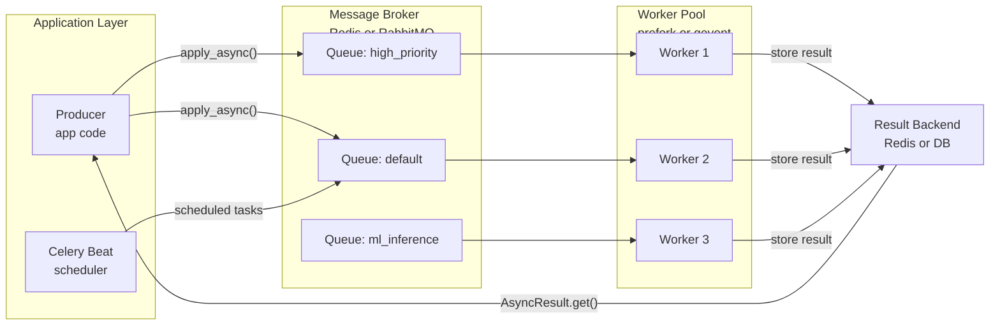

# ⚙️ Celery and Task Queues

> [!abstract] TL;DR
> Celery is Python's standard distributed task queue: your app code drops a message into a broker (Redis or RabbitMQ), a pool of worker processes picks it up, executes the task, and stores the result in a backend. It decouples slow or periodic work (ML inference, email sends, model retraining) from your request-response cycle.

---

## Intuition

**Analogy:** Think of a restaurant with a kitchen ticket system. The waiter (your app code) writes an order slip (task message) and clips it to the rail (broker). Line cooks (worker processes) grab tickets from the rail in order, cook the dish (execute the task), and place it on the pass (result backend). The waiter never stands in the kitchen waiting — they take new orders immediately. If a cook quits mid-dish (worker crashes), the ticket is still on the rail and another cook picks it up.

Celery wires this same pattern across processes and machines: the "rail" is Redis or RabbitMQ, the "cooks" are OS processes on one or many servers, and the "pass" is a Redis key or database row the waiter can check any time.

---

## How It Works

### Core Mechanics

#### 1. Celery Setup

```python
# tasks.py
from celery import Celery
from celery.schedules import crontab

app = Celery(
    "myapp",
    broker="redis://localhost:6379/0",   # message transport
    backend="redis://localhost:6379/1",  # result storage (separate DB index)
)

app.conf.update(
    task_serializer="json",
    result_serializer="json",
    accept_content=["json"],
    timezone="UTC",
    enable_utc=True,
    result_expires=3600,               # auto-delete results after 1 hour
    worker_prefetch_multiplier=1,      # one task at a time per worker (critical for long tasks)
    task_acks_late=True,               # re-queue if worker crashes mid-execution
    broker_transport_options={
        "visibility_timeout": 3600,    # seconds before unacked message is redelivered
    },
)
```

Launch a worker: `celery -A tasks worker --loglevel=info --concurrency=4 -Q high,default`
Launch the scheduler: `celery -A tasks beat --loglevel=info`

Broker options:
- **Redis** — simple, fast, zero config, good for most workloads.
- **RabbitMQ** — durable delivery guarantees, sophisticated routing (exchanges, bindings), dead-letter queues natively.
- **SQS** — AWS-native, serverless, no broker to manage, slightly higher latency.

#### 2. Defining and Calling Tasks

```python
from celery import shared_task   # preferred in Django — decoupled from app instance

# Fire-and-forget (result ignored)
@shared_task(ignore_result=True)
def send_email(to: str, subject: str, body: str) -> None:
    ...

# Bound task: self gives access to request info and retry mechanism
@app.task(bind=True, queue="ml_inference")
def run_model(self, payload: dict) -> dict:
    task_id = self.request.id   # unique task ID from the broker
    ...
```

Calling tasks:

| Pattern | Behavior |
|---------|----------|
| `task.delay(arg1, arg2)` | Enqueue immediately — shorthand for `apply_async` |
| `task.apply_async(args, kwargs, countdown=30)` | Enqueue with delay (seconds) |
| `task.apply_async(eta=datetime(2026, 8, 1))` | Enqueue at absolute time |
| `task.apply_async(expires=60)` | Discard if not started within 60 seconds |
| `task.s(arg)` | Create a `Signature` (lazy — not enqueued yet); used in canvas |
| `task.si(arg)` | Immutable signature — ignores result passed from previous canvas step |

#### 3. Task Configuration and Retries

```python
@app.task(
    bind=True,
    max_retries=3,
    default_retry_delay=60,      # seconds before first retry
    queue="high_priority",
    rate_limit="10/m",           # max 10 task starts per minute per worker
    time_limit=300,              # hard kill (SIGKILL) after 5 minutes
    soft_time_limit=270,         # SIGTERM 30s before hard kill — use for cleanup
    acks_late=True,              # task re-queued if worker dies before completion
    autoretry_for=(ConnectionError,),  # auto-retry on these exceptions
    retry_backoff=True,          # exponential: 1, 2, 4, 8... seconds
    retry_backoff_max=600,       # cap backoff at 10 minutes
    retry_jitter=True,           # add randomness to avoid thundering herd
)
def resilient_task(self, data: dict) -> dict:
    try:
        return call_external_api(data)
    except RateLimitError as exc:
        backoff = 60 * (2 ** self.request.retries)
        raise self.retry(exc=exc, countdown=backoff)
```

`acks_late=False` (default) acknowledges the task the moment a worker receives it — if the worker crashes mid-execution, the task is lost. `acks_late=True` delays acknowledgement until the task completes, giving at-least-once delivery.

#### 4. Task Routing and Multiple Queues

Define queues by workload type so CPU-heavy tasks don't starve lightweight ones:

```python
# In celeryconfig.py or app.conf.update()
task_routes = {
    "tasks.run_inference": {"queue": "ml_inference"},
    "tasks.send_email":    {"queue": "email"},
    "tasks.retrain_model": {"queue": "training"},
}

# Workers consuming specific queues
# celery -A tasks worker -Q ml_inference,email -c 8    (8 concurrent workers)
# celery -A tasks worker -Q training -c 1               (1 worker for expensive jobs)
```

Set `worker_prefetch_multiplier=1` for long-running tasks. The default (4) pre-fetches 4 tasks per worker — one slow task blocks the other 3 slots, starving the queue.

#### 5. Canvas — Workflow Primitives

Canvas lets you build multi-step pipelines without custom orchestration code:

| Primitive | Behaviour |
|-----------|-----------|
| `chain(a.s(), b.s())` | Sequential pipeline: output of `a` is input of `b` |
| `group([a.s(), b.s()])` | Parallel execution: both run concurrently, returns list of results |
| `chord(group, callback)` | Parallel fan-out then fan-in: `callback` receives the group result list |
| `chunks(list, n)` | Split iterable into `n`-sized groups, each dispatched in parallel |
| `a.s() | b.s()` | Pipe syntax — equivalent to `chain(a.s(), b.s())` |

```python
from celery import chord, group, chain

# Parallel preprocessing → single aggregation
pipeline = chord(
    group(preprocess_shard.s(i) for i in range(8)),  # 8 parallel workers
)(aggregate.s())                                       # callback with list of 8 results
```

#### 6. Celery Beat — Periodic Tasks

```python
from celery.schedules import crontab, timedelta

app.conf.beat_schedule = {
    "nightly-retraining": {
        "task": "tasks.retrain_model",
        "schedule": crontab(hour=2, minute=0),      # 2 AM UTC daily
        "args": ("v2",),
    },
    "hourly-feature-refresh": {
        "task": "tasks.refresh_features",
        "schedule": crontab(minute=0),              # top of every hour
    },
    "every-5-minutes-health-check": {
        "task": "tasks.check_model_health",
        "schedule": timedelta(minutes=5),
    },
}
```

**Beat must run as a single process.** It is a stateful scheduler that tracks when each task was last run. Running multiple beat instances causes duplicate task execution. Use `django-celery-beat` to store the schedule in a database and modify it dynamically without restarting beat.

#### 7. Monitoring and Debugging

```python
from celery.result import AsyncResult

result = AsyncResult(task_id, app=celery_app)
result.state    # PENDING | STARTED | PROGRESS | RETRY | SUCCESS | FAILURE
result.result   # return value on SUCCESS; exception on FAILURE
result.info     # meta dict from update_state() calls during PROGRESS

# Progress update from inside a task (bind=True required)
self.update_state(state="PROGRESS", meta={"progress": 50, "step": "inference"})
```

Task state machine: `PENDING → STARTED → (RETRY →)* SUCCESS | FAILURE`

**Flower** — web monitoring UI:
```bash
pip install flower
celery -A tasks flower --port=5555
# http://localhost:5555 — live worker/task dashboard
```

CLI inspection:
```bash
celery -A tasks inspect active      # tasks currently executing
celery -A tasks inspect reserved    # tasks fetched but not yet started
celery -A tasks inspect registered  # all @task-decorated functions known to workers
celery -A tasks inspect ping        # health check all workers
```

For testing, set `CELERY_TASK_ALWAYS_EAGER=True` to execute tasks synchronously inline — no broker needed, results are returned directly.

#### 8. Redis as Broker — Key Details

```python
broker_url = "redis://localhost:6379/0"
# or with auth:
broker_url = "redis://:password@localhost:6379/0"
# Redis Sentinel:
broker_url = "sentinel://sentinel1:26379;sentinel2:26379/0"
```

**Visibility timeout** is the most important Redis broker setting. When a worker fetches a task, Redis hides the message for `visibility_timeout` seconds. If the worker does not acknowledge within that window (because it crashed), the message becomes visible again and another worker picks it up. Set it to at least the maximum expected task duration:

```python
broker_transport_options = {"visibility_timeout": 43200}   # 12 hours for long jobs
```

If `visibility_timeout` is shorter than a task's runtime, the task will be delivered to a second worker while the first is still running it — causing duplicate execution even with `acks_late=True`.

#### 9. Production Patterns

**Concurrency pool by workload type:**

| Workload | Pool | Why |
|----------|------|-----|
| CPU-bound (model inference, image processing) | `prefork` (default) | True OS-process parallelism, one core per worker |
| I/O-bound (HTTP calls, DB queries) | `gevent` or `eventlet` | Green threads, thousands of concurrent I/O waits in one process |
| Debugging / single-threaded | `solo` | No concurrency, tasks run in the main process thread |

```bash
celery -A tasks worker -P gevent -c 500 -Q email         # I/O-bound: 500 green threads
celery -A tasks worker -P prefork -c 4 -Q ml_inference   # CPU-bound: 4 OS processes
celery -A tasks worker --autoscale=10,3                  # scale 3–10 workers by queue depth
```

**Task idempotency:** Design tasks so re-running them is safe. Check a database flag or use `task_id` as a deduplication key before doing irreversible work:

```python
@app.task(bind=True)
def charge_customer(self, order_id: str) -> None:
    if Payment.objects.filter(celery_task_id=self.request.id).exists():
        return   # already processed, skip
    Payment.objects.create(order_id=order_id, celery_task_id=self.request.id)
    stripe.charge(order_id)
```

**Graceful shutdown:** `SIGTERM` tells the worker to finish its current task then exit. `SIGQUIT` triggers a cold shutdown — current task is abandoned and re-queued (if `acks_late=True`).

#### 10. ML-Specific Patterns

- **Long-running model training** — wrap as a `@app.task(queue="training", time_limit=86400)`. Use `self.update_state()` to emit epoch-level progress for frontend polling.
- **Inference queue with rate limiting** — `@app.task(rate_limit="100/m", queue="ml_inference")` prevents overwhelming a GPU server. Workers on this queue use `prefork` with concurrency equal to GPU count.
- **Async inference for frontends** — user hits `POST /infer` → gets `task_id` → polls `GET /tasks/{task_id}` until `SUCCESS`. No connection held open.
- **Model loading** — import and load the model at worker startup using Celery's `worker_process_init` signal, not inside the task function. Loading a 500 MB model inside every task call adds seconds per request.

```python
from celery.signals import worker_process_init
import joblib

_model = None

@worker_process_init.connect
def load_model(**kwargs):
    global _model
    _model = joblib.load("models/classifier.pkl")   # once per worker process
```

---

### Flow / Architecture



---

## Code Demo

### 1. Full Celery App with Redis + Periodic Beat Schedule

```python
# tasks.py — complete runnable Celery application
from celery import Celery
from celery.schedules import crontab
from celery.signals import worker_process_init
import time
import logging

logger = logging.getLogger(__name__)

app = Celery(
    "myapp",
    broker="redis://localhost:6379/0",
    backend="redis://localhost:6379/1",
)

app.conf.update(
    task_serializer="json",
    result_serializer="json",
    accept_content=["json"],
    timezone="UTC",
    enable_utc=True,
    result_expires=3600,
    worker_prefetch_multiplier=1,      # one in-flight task per worker slot
    task_acks_late=True,
    broker_transport_options={"visibility_timeout": 3600},
    beat_schedule={
        "daily-model-retraining": {
            "task": "tasks.retrain_model",
            "schedule": crontab(hour=2, minute=0),
        },
        "hourly-feature-refresh": {
            "task": "tasks.refresh_features",
            "schedule": crontab(minute=0),
        },
    },
)

# ── Worker startup: load model once per worker process ────────────────────────
_model = None

@worker_process_init.connect
def load_model_at_startup(**kwargs):
    global _model
    logger.info("Loading model into worker process...")
    # In practice: _model = joblib.load("models/clf.pkl")
    _model = {"type": "mock", "version": "v1.2"}
    logger.info("Model loaded.")

# ── Tasks ─────────────────────────────────────────────────────────────────────
@app.task(ignore_result=True)
def refresh_features():
    """Fire-and-forget periodic task — result is not needed."""
    logger.info("Refreshing feature store cache...")
    time.sleep(1)

@app.task(bind=True, queue="training")
def retrain_model(self, model_version: str = "v1") -> dict:
    """Periodic retraining with progress updates."""
    self.update_state(state="PROGRESS", meta={"step": "loading_data", "progress": 10})
    time.sleep(2)

    self.update_state(state="PROGRESS", meta={"step": "training", "progress": 50})
    time.sleep(3)

    self.update_state(state="PROGRESS", meta={"step": "evaluating", "progress": 90})
    time.sleep(1)

    return {"model_version": model_version, "accuracy": 0.924, "status": "deployed"}
```

```bash
# Terminal 1 — worker consuming training + default queues
celery -A tasks worker --loglevel=info --concurrency=4 -Q training,default

# Terminal 2 — beat scheduler (only ONE instance ever)
celery -A tasks beat --loglevel=info

# Terminal 3 — Flower monitoring UI
celery -A tasks flower --port=5555
```

### 2. ML Inference Task with Retry + Exponential Backoff + Progress

```python
# inference_tasks.py
from celery import shared_task
from celery.exceptions import SoftTimeLimitExceeded
import logging
import time

logger = logging.getLogger(__name__)


@shared_task(
    bind=True,
    max_retries=3,
    queue="ml_inference",
    rate_limit="10/m",           # throttle: max 10 starts per minute per worker
    time_limit=300,              # SIGKILL after 5 min — never leave zombie workers
    soft_time_limit=270,         # SIGTERM at 4.5 min — graceful cleanup window
    acks_late=True,
)
def run_inference(self, payload: dict) -> dict:
    """
    ML inference task with exponential backoff retry and progress tracking.
    Safe to retry: result is deterministic for a given payload.
    """
    task_id = self.request.id
    logger.info("[%s] Starting inference: %s", task_id, payload)

    try:
        # Step 1 — validate
        self.update_state(state="PROGRESS", meta={"progress": 10, "step": "validating"})
        features = _preprocess(payload)

        # Step 2 — run model
        self.update_state(state="PROGRESS", meta={"progress": 50, "step": "inferring"})
        time.sleep(0.5)  # simulate GPU inference
        score = sum(features) * 0.3 + 0.1

        # Step 3 — post-process
        self.update_state(state="PROGRESS", meta={"progress": 90, "step": "postprocessing"})
        result = {
            "score": round(score, 4),
            "label": "positive" if score > 0.5 else "negative",
            "task_id": task_id,
        }

        logger.info("[%s] Inference complete: %s", task_id, result)
        return result

    except SoftTimeLimitExceeded:
        logger.error("[%s] Soft time limit hit — graceful shutdown", task_id)
        raise  # propagate so Celery marks the task FAILURE cleanly

    except (ConnectionError, TimeoutError) as exc:
        # Transient failures: exponential backoff (60s, 120s, 240s)
        backoff = 60 * (2 ** self.request.retries)
        logger.warning("[%s] Transient error, retry in %ds: %s", task_id, backoff, exc)
        raise self.retry(exc=exc, countdown=backoff)

    except Exception as exc:
        # Non-retryable: programming error, bad input, etc.
        logger.error("[%s] Non-retryable failure: %s", task_id, exc, exc_info=True)
        raise  # Celery marks task FAILURE immediately


def _preprocess(payload: dict) -> list:
    """Extract and normalize feature vector from payload dict."""
    return [float(payload.get("value", 0.0)), float(payload.get("weight", 1.0))]


# ── Calling the task ──────────────────────────────────────────────────────────
if __name__ == "__main__":
    # Submit and poll (for quick local testing only; use AsyncResult in prod)
    task = run_inference.apply_async(
        kwargs={"payload": {"value": 0.75, "weight": 0.9}},
        countdown=0,
    )
    print(f"Submitted task: {task.id}")
    result = task.get(timeout=30, propagate=False)
    print(f"State: {task.state}, Result: {result}")
```

### 3. Chord — Parallel Preprocessing then Aggregate

```python
# pipeline_tasks.py
from celery import chord, group, shared_task
import time


@shared_task(queue="preprocessing")
def preprocess_shard(shard_id: int, data: list) -> dict:
    """Process one data shard. Runs in parallel across N workers."""
    time.sleep(0.1)  # simulate work
    processed = [x ** 2 for x in data]
    return {
        "shard_id": shard_id,
        "count": len(processed),
        "checksum": sum(processed),
    }


@shared_task(queue="aggregation")
def aggregate_shards(shard_results: list) -> dict:
    """
    Called automatically by chord once ALL shard tasks complete.
    Receives the list of dicts from preprocess_shard.
    """
    total_records = sum(r["count"] for r in shard_results)
    combined_checksum = sum(r["checksum"] for r in shard_results)
    return {
        "total_records": total_records,
        "combined_checksum": combined_checksum,
        "shards_processed": len(shard_results),
    }


def run_parallel_pipeline(dataset: list, n_shards: int = 4) -> str:
    """
    Splits dataset into n_shards, preprocesses all in parallel,
    then calls aggregate_shards with the collected results.
    Returns the chord callback's task_id for polling.
    """
    shard_size = max(1, len(dataset) // n_shards)
    shards = [
        dataset[i * shard_size: (i + 1) * shard_size]
        for i in range(n_shards)
    ]

    parallel_work = group(
        preprocess_shard.s(shard_id=i, data=shard)
        for i, shard in enumerate(shards)
    )

    # chord: fan-out (parallel_work) → fan-in (aggregate_shards)
    callback = chord(parallel_work)(aggregate_shards.s())
    return callback.id   # poll this task_id for the aggregated result


# ── Chain example: data validation → inference → postprocess ─────────────────
from celery import chain

def submit_full_pipeline(raw_input: dict) -> str:
    """Sequential pipeline: each task receives the output of the previous one."""
    pipeline = chain(
        validate_input.s(raw_input),       # returns clean features
        run_inference.s(),                 # receives clean features, returns scores
        postprocess_output.s(),            # receives scores, returns final result
    )
    result = pipeline.apply_async()
    return result.id


@shared_task
def validate_input(raw: dict) -> dict:
    return {"value": float(raw.get("value", 0)), "weight": 1.0}

@shared_task
def run_inference(features: dict) -> dict:
    score = features["value"] * 0.5
    return {"score": score}

@shared_task
def postprocess_output(scores: dict) -> dict:
    return {"label": "positive" if scores["score"] > 0.5 else "negative", **scores}
```

### 4. FastAPI Endpoint — Submit Task + Poll Status

```python
# api.py — FastAPI service that submits Celery tasks and exposes status polling
from fastapi import FastAPI, HTTPException
from pydantic import BaseModel
from celery import Celery
from celery.result import AsyncResult
from typing import Optional

# ── Celery app reference (broker-only; no model loading here) ─────────────────
celery_app = Celery(
    "myapp",
    broker="redis://localhost:6379/0",
    backend="redis://localhost:6379/1",
)

api = FastAPI(title="Async ML Inference API")


# ── Pydantic schemas ──────────────────────────────────────────────────────────
class InferenceRequest(BaseModel):
    value: float
    weight: float = 1.0

class SubmitResponse(BaseModel):
    task_id: str
    status: str
    poll_url: str

class TaskStatus(BaseModel):
    task_id: str
    status: str                    # PENDING | PROGRESS | SUCCESS | FAILURE
    progress: Optional[int]        # 0–100 during PROGRESS
    step: Optional[str]            # current step name during PROGRESS
    result: Optional[dict]         # populated on SUCCESS
    error: Optional[str]           # populated on FAILURE


# ── Endpoints ─────────────────────────────────────────────────────────────────
@api.post("/infer", response_model=SubmitResponse, status_code=202)
async def submit_inference(request: InferenceRequest):
    """Submit long-running inference. Returns task_id immediately (HTTP 202)."""
    # Dispatch task without waiting for result
    task = celery_app.send_task(
        "inference_tasks.run_inference",
        kwargs={"payload": request.model_dump()},
        queue="ml_inference",
    )
    return SubmitResponse(
        task_id=task.id,
        status="submitted",
        poll_url=f"/tasks/{task.id}",
    )


@api.get("/tasks/{task_id}", response_model=TaskStatus)
async def get_task_status(task_id: str):
    """Poll this endpoint until status is SUCCESS or FAILURE."""
    result = AsyncResult(task_id, app=celery_app)

    if result.state == "PENDING":
        # Task not yet picked up by a worker (or task_id doesn't exist)
        return TaskStatus(task_id=task_id, status="PENDING",
                          progress=None, step=None, result=None, error=None)

    if result.state == "PROGRESS":
        meta = result.info or {}
        return TaskStatus(task_id=task_id, status="PROGRESS",
                          progress=meta.get("progress"),
                          step=meta.get("step"),
                          result=None, error=None)

    if result.state == "SUCCESS":
        return TaskStatus(task_id=task_id, status="SUCCESS",
                          progress=100, step=None,
                          result=result.result, error=None)

    if result.state == "FAILURE":
        return TaskStatus(task_id=task_id, status="FAILURE",
                          progress=None, step=None,
                          result=None, error=str(result.info))

    # RETRY, REVOKED, or custom states
    return TaskStatus(task_id=task_id, status=result.state,
                      progress=None, step=None, result=None, error=None)


# ── Run ───────────────────────────────────────────────────────────────────────
if __name__ == "__main__":
    import uvicorn
    uvicorn.run("api:api", host="0.0.0.0", port=8080, reload=False)
```

```bash
# Full local stack
docker run -d -p 6379:6379 redis:7-alpine          # start Redis
celery -A inference_tasks worker -Q ml_inference   # start worker
uvicorn api:api --port 8080                        # start API

# Submit a task
curl -X POST http://localhost:8080/infer \
  -H "Content-Type: application/json" \
  -d '{"value": 0.75, "weight": 0.9}'
# → {"task_id": "abc123...", "status": "submitted", "poll_url": "/tasks/abc123..."}

# Poll for status
curl http://localhost:8080/tasks/abc123...
# → {"status": "SUCCESS", "result": {"score": 0.325, "label": "negative"}, ...}
```

---

## Real-World Example

> **Example:** Instagram uses Celery at scale for async work that cannot block the request cycle — push notifications, story expiry processing, feed denormalization, and spam detection. When a user posts a photo, the API endpoint returns `HTTP 200` immediately after persisting the media; a Celery task running on a separate worker pool then fans out notifications to followers, updates search indexes, and runs content moderation classifiers. The classification pipeline itself is a `chord`: five parallel feature extraction tasks (face detection, text OCR, image embeddings, NSFW scoring, metadata extraction) feed into a single aggregator task that makes the final moderation decision. Workers consuming the moderation queue use `prefork` with `--concurrency=8` (matching GPU count) and `worker_prefetch_multiplier=1` so no single slow job starves others.

---

## Trade-offs

### Celery vs Alternative Task Queues

| Aspect | Celery | RQ (Redis Queue) | Dramatiq |
|--------|--------|-----------------|----------|
| **Maturity** | Very mature, 10+ years | Mature, simpler | Newer, actively developed |
| **Broker support** | Redis, RabbitMQ, SQS, many more | Redis only | Redis, RabbitMQ |
| **Periodic tasks** | Beat scheduler built-in | `rq-scheduler` (separate) | `apscheduler` integration |
| **Canvas / workflows** | `chain`, `group`, `chord` | None | Actor middleware |
| **Monitoring** | Flower (excellent) | `rq-dashboard` | Periodiq (basic) |
| **Configuration complexity** | High — many knobs | Very low | Low |
| **Best for** | Complex pipelines, polyglot brokers, Django | Simple jobs, small teams | Simpler API over Celery's complexity |

### Worker Concurrency: `prefork` vs `gevent` vs `solo`

| Aspect | `prefork` (default) | `gevent` | `solo` |
|--------|--------------------|---------|----|
| **Parallelism model** | OS processes (true parallel) | Green threads (cooperative) | Single-threaded |
| **GIL impact** | None — separate processes | None for I/O; blocks CPU | Fully GIL-bound |
| **Best workload** | CPU-bound: model inference, image processing | I/O-bound: HTTP calls, DB queries | Debugging, simple queues |
| **Worker startup time** | Slow (fork + model reload) | Fast | Fast |
| **Memory per worker** | High (each process has its own model copy) | Low (shared process heap) | Lowest |
| **Max concurrency** | `~CPU count × 2` | Hundreds–thousands | 1 |

### Redis vs RabbitMQ as Broker

| Aspect | Redis | RabbitMQ |
|--------|-------|---------|
| **Setup complexity** | Minimal — already used as cache | Requires AMQP config, exchanges, bindings |
| **Message durability** | Volatile by default (persistence optional) | Durable by default |
| **Routing** | Queue names only | Exchanges + routing keys (flexible topologies) |
| **Dead-letter queues** | Manual implementation | Native AMQP feature |
| **Throughput** | Very high (in-memory) | High (lower than Redis) |
| **Visibility timeout bug** | Yes — tasks duplicated if timeout < task runtime | No — AMQP acks are per-connection |
| **Choose when** | Simplicity, Redis already in stack, <1hr tasks | Strict delivery guarantees, complex routing, long tasks |

---

## When to Use vs Avoid

**Use Celery when:**
- Work takes >200ms and cannot block an HTTP response (email, PDF generation, ML inference)
- Tasks must be retried automatically on transient failures
- Periodic jobs replace cron scripts (nightly retraining, hourly aggregations)
- Parallel fan-out pipelines (chord) replace complex multiprocessing code
- Task execution must survive worker restarts (`acks_late=True`)

**Avoid Celery when:**
- Tasks complete in <50ms — the broker round-trip overhead exceeds the work itself
- You need strict DAG orchestration with cross-task dependencies and SLA tracking — use [[Apache_Airflow]] or [[Prefect]] instead
- Real-time streaming (millisecond-level event processing) — use [[Streaming_ML_with_Kafka]]
- The team is small and workload is simple — RQ adds far less cognitive overhead

---

## Common Pitfalls

- **`acks_late=False` (default) loses tasks on worker crash** — The default acknowledges the message the moment a worker fetches it. If the worker process is killed before completing the task, the message is gone. Set `task_acks_late=True` globally and ensure all tasks are idempotent to tolerate re-delivery.

- **Not setting `worker_prefetch_multiplier=1` for long tasks** — The default (4) lets one worker pre-fetch 4 tasks. A single 10-minute task blocks 3 other task slots in that worker, starving the queue. Always set `worker_prefetch_multiplier=1` when tasks have variable durations.

- **Running multiple beat instances** — Beat stores last-run timestamps locally. Two beat processes each believe they are the sole scheduler and both fire every task, causing double execution. Deploy exactly one beat process. Use `django-celery-beat` with a distributed lock if you need high-availability beat.

- **Importing heavy libraries at module level in tasks.py** — Every Celery worker imports `tasks.py` on startup. Importing TensorFlow or PyTorch at the top of the file adds 5–15 seconds to worker startup. Move model loading into `@worker_process_init.connect` or lazy-load on first task execution.

- **Forgetting to set `result_expires`** — By default, task results are stored in Redis forever. A high-throughput service accumulates millions of result keys. Set `result_expires=3600` (or appropriate TTL) to avoid Redis memory exhaustion.

- **Visibility timeout shorter than task runtime (Redis broker)** — If `visibility_timeout=3600` but a model training task runs for 6 hours, Redis re-delivers the message to a second worker at hour 1. That second worker starts a duplicate training run while the first is still running. Set `visibility_timeout` to at least `max(task_time_limit)` across all queues.

---

## Related Concepts

- [[Concurrency_in_Python]] — Celery workers use `prefork` (multiprocessing) or `gevent` (green threads); understanding the GIL and process model explains why CPU-bound tasks need `prefork` and I/O-bound tasks can use `gevent`
- [[FastAPI_for_ML]] — the canonical integration pattern: FastAPI endpoint submits a Celery task with `apply_async()`, returns `task_id`, and a polling endpoint wraps `AsyncResult` for the frontend
- [[Real_Time_vs_Batch_Inference]] — Celery implements the "async inference" pattern: decouple request (HTTP) from execution (worker), poll for result — fits between real-time (<100ms) and batch (hourly) inference modes
- [[Apache_Airflow]] — use Airflow when you need DAG-level dependencies, backfill semantics, and SLA monitoring across multi-hour pipelines; use Celery when you need lightweight async task dispatch from application code
- [[Prefect]] — modern alternative to Airflow for ML pipeline orchestration; Celery complements it for low-latency task dispatch that Prefect flows trigger
- [[Streaming_ML_with_Kafka]] — Kafka handles high-throughput event streaming (millions of events/sec, millisecond latency); Celery handles task queuing (thousands of tasks/sec, seconds latency) — different throughput and latency regimes
- [[REST_API_Design]] — the submit-and-poll REST pattern (`POST /jobs` → `GET /jobs/{id}`) is the standard API contract wrapping Celery task submission
- [[Docker_for_ML]] — Celery workers are typically containerized: one Dockerfile image, separate `command:` for `worker`, `beat`, and `flower` in `docker-compose.yml`

---

## Review Questions

1. **`acks_late` and delivery semantics:** By default (`acks_late=False`), a Celery task that crashes halfway through a payment charge will not retry automatically, even with `max_retries=3`. Explain exactly why. What setting changes this behaviour, what delivery guarantee does it provide, and what property must your task have for this to be safe?

2. **`chord` vs `group`:** You have 8 data preprocessing tasks and need a single result that combines all 8 outputs. A teammate suggests `group([...]).apply_async()`. What is missing from this approach, and how does `chord` solve it? What happens to the chord callback if one of the 8 group tasks fails?

3. **Beat single-instance requirement:** Your team deploys Celery beat as a Kubernetes `Deployment` with `replicas: 2` for high availability. What is the failure mode, and how would you fix it while still ensuring beat continues running if the single pod crashes?

4. **`prefetch_multiplier=1` for long tasks:** A queue has a mix of tasks: 80% take 1 second, 20% take 15 minutes. With the default `worker_prefetch_multiplier=4` and `--concurrency=4`, what happens to short tasks when a 15-minute task is running? Calculate how many task slots are blocked per worker, and explain why setting `prefetch_multiplier=1` fixes the problem.

---

## Sources

- [Celery Official Documentation](https://docs.celeryq.dev/en/stable/)
- [Celery Canvas — Workflows](https://docs.celeryq.dev/en/stable/userguide/canvas.html)
- [Celery Configuration Reference](https://docs.celeryq.dev/en/stable/userguide/configuration.html)
- [Celery — Using Redis](https://docs.celeryq.dev/en/stable/getting-started/backends-and-brokers/redis.html)
- [django-celery-beat — Database-backed Periodic Tasks](https://django-celery-beat.readthedocs.io/)
- [Flower — Celery Monitoring](https://flower.readthedocs.io/)
- [Real Python — Celery First Steps](https://realpython.com/asynchronous-tasks-with-django-and-celery/)

---

#python #celery #task-queue #redis #distributed #backend #worker
