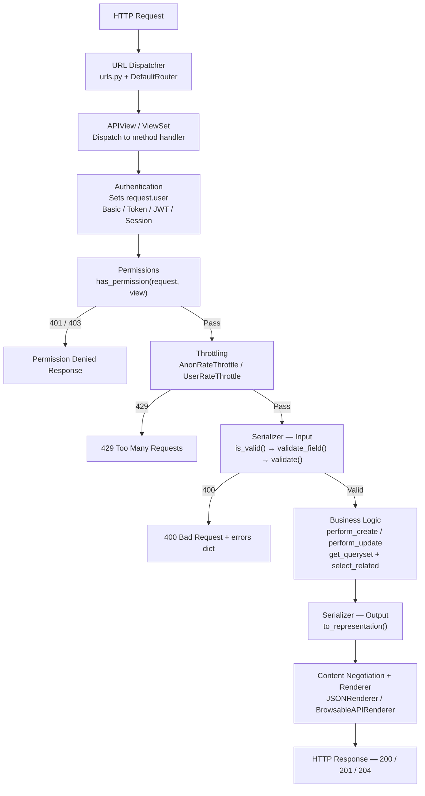
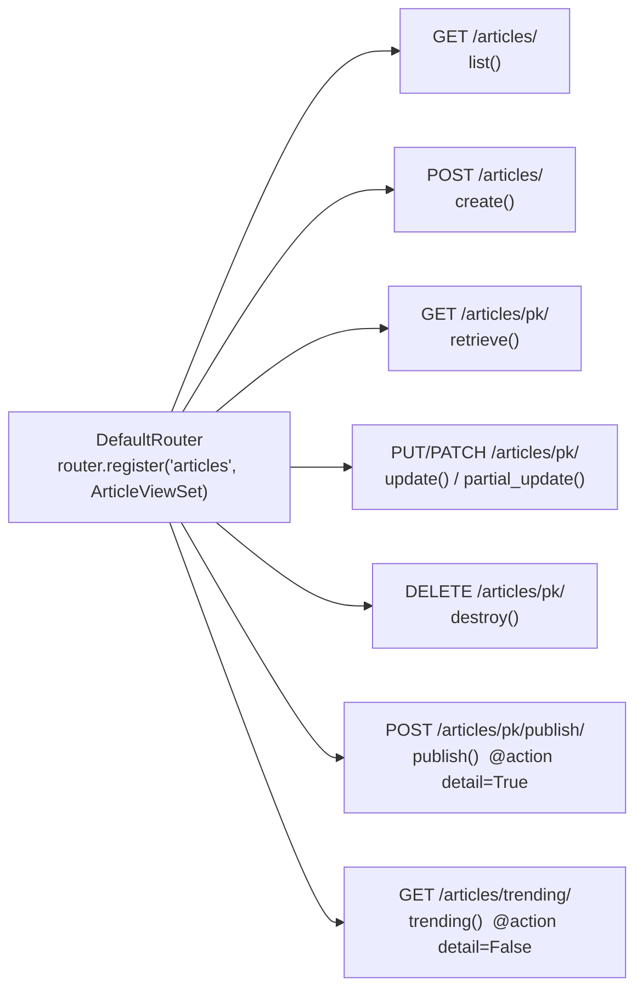

# Django REST Framework (DRF)

> [!abstract] TL;DR
> Django REST Framework is the production standard for building REST APIs in Python's Django ecosystem — it layers serialization, authentication, permissions, throttling, filtering, and pagination over Django's ORM and view system through a composable middleware pipeline, letting you go from model to fully-secured, paginated, filterable API endpoint in minutes while retaining full control over every layer.

---

## Intuition

**Analogy:** Think of DRF as a customs checkpoint at an international airport. Every incoming passenger (HTTP request) passes through passport control (authentication — who are you?), security screening (permissions — are you allowed in?), queue management (throttling — are you moving too fast?), and bag inspection (serializer validation). On the way out, bags are repacked to specification (serializer output) and presented through the correct gate (renderer — JSON, HTML, CSV). Django handles the flight routing (URL dispatcher); DRF handles the multi-layer border security pipeline that every request must clear.

This layered pipeline is why DRF scales from a weekend project to Instagram-scale traffic: each concern is separated, independently testable, and swappable without touching the others.

---

## How It Works

### Core Mechanics

1. **URL Dispatcher** routes the incoming request to the correct view via `urls.py`. `DefaultRouter` auto-generates these URLs for ViewSets.
2. **Authentication** runs first — reads the `Authorization` header (or session cookie) and sets `request.user` and `request.auth`. It does **not** reject requests; unauthenticated users become `AnonymousUser`.
3. **Permissions** decide whether `request.user` may perform this action. They can reject with 401 or 403.
4. **Throttling** enforces rate limits per user or IP, rejecting with 429 if exceeded.
5. **Serializer (input)** validates the request body through `is_valid()` — running field-level validators, cross-field `validate()`, and `validate_<field>()` methods.
6. **Business logic** executes: queries the database via the ORM, applies filters, creates or updates records.
7. **Serializer (output)** converts the model instance or queryset into Python primitives via `to_representation()`.
8. **Content Negotiation + Renderer** converts primitives to the wire format (JSON, browsable HTML, etc.) based on the `Accept` header.

### Flow / Architecture





---

## Core Concepts

### 1. Serializers

Serializers translate between complex Django ORM objects and Python primitives (dicts/lists) ready for JSON rendering. They also validate incoming data before it touches the database.

**`Serializer` vs `ModelSerializer`:**
- `Serializer` — fully manual: declare every field explicitly. Maximum control; no model coupling.
- `ModelSerializer` — auto-generates fields from the model `Meta.fields`. Reduces boilerplate; still fully overridable.

**Key field patterns:**

| Pattern | Field / kwarg | Purpose |
|---------|--------------|---------|
| Computed field | `SerializerMethodField` | Value derived at read time; no DB column |
| Hide on output | `write_only=True` | Passwords, tokens — accepted in input, never returned |
| Protect on input | `read_only=True` | IDs, timestamps — returned but never accepted as input |
| Map field names | `source='model_attr'` | API name differs from model column name |
| Traverse relation | `source='author.email'` | Dot-walk into FK or property |
| Nested read | `FKSerializer(read_only=True)` | Embed nested object in output |
| Nested write | `FKSerializer()` + override `create/update` | Fully writable nested |

**Field-level and cross-field validation:**
- `validate_<field_name>(self, value)` — runs after field deserialization; for single-field business rules.
- `validate(self, attrs)` — runs after all field validators; for cross-field consistency checks.

**`create()` and `update()` overrides** are required whenever you have M2M relations, nested writable serializers, or any logic beyond a plain `.save()`.

**`to_representation(instance)`** — override to reshape the output dict (strip null fields, rename keys, add computed envelope data).

**`to_internal_value(data)`** — override to transform raw input before field validation (e.g., accept a third-party webhook with a different key schema).

**Performance rule:** A serializer field that traverses a relation (`FKSerializer`, `SerializerMethodField` that hits the DB, `source='author.email'`) triggers one extra query per object in a list unless the view's `get_queryset()` uses `select_related` (FK) or `prefetch_related` (M2M / reverse FK).

---

### 2. ModelSerializer Deep Dive

```python
from rest_framework import serializers
from .models import Article, Tag

class TagSerializer(serializers.ModelSerializer):
    class Meta:
        model = Tag
        fields = ['id', 'name']  # Always explicit — never '__all__' in production

class ArticleSerializer(serializers.ModelSerializer):
    # Computed output field — no DB column
    word_count = serializers.SerializerMethodField()

    # Nested read: embed full tag objects in output; read_only prevents write confusion
    tags = TagSerializer(many=True, read_only=True)

    # Writable M2M: accept list of tag PKs on input, map to the 'tags' field via source
    tag_ids = serializers.PrimaryKeyRelatedField(
        many=True,
        queryset=Tag.objects.all(),
        write_only=True,
        source='tags',  # source: maps API field name to model attribute
    )

    class Meta:
        model = Article
        fields = [
            'id', 'title', 'body', 'status',
            'tags', 'tag_ids', 'word_count', 'created_at',
        ]
        read_only_fields = ['id', 'created_at']
        extra_kwargs = {
            'title': {'min_length': 3, 'max_length': 200},
            'body': {'required': False},
            # 'password': {'write_only': True}  -- idiomatic for User serializers
        }

    def get_word_count(self, obj) -> int:
        """get_<field_name> is required for every SerializerMethodField."""
        return len(obj.body.split()) if obj.body else 0

    def validate_title(self, value: str) -> str:
        """Field-level validation — called after the field's own validators."""
        if 'spam' in value.lower():
            raise serializers.ValidationError("Title must not contain spam.")
        return value.strip()

    def validate(self, attrs: dict) -> dict:
        """Cross-field validation — runs after all field-level validators pass."""
        if attrs.get('status') == 'published' and not attrs.get('body'):
            raise serializers.ValidationError(
                {"body": "A published article must have a body."}
            )
        return attrs

    def create(self, validated_data: dict) -> Article:
        """Required for M2M — DRF cannot auto-handle set() on M2M through .save()."""
        tags = validated_data.pop('tags', [])
        article = Article.objects.create(**validated_data)
        article.tags.set(tags)
        return article

    def update(self, instance: Article, validated_data: dict) -> Article:
        tags = validated_data.pop('tags', None)
        for attr, value in validated_data.items():
            setattr(instance, attr, value)
        instance.save()
        if tags is not None:  # None means not sent; [] means clear all
            instance.tags.set(tags)
        return instance

    def to_representation(self, instance) -> dict:
        """Override output: strip null values from response envelope."""
        data = super().to_representation(instance)
        return {k: v for k, v in data.items() if v is not None}
```

**`depth` on `ModelSerializer`:**
```python
class Meta:
    model = Article
    fields = '__all__'
    depth = 1  # Auto-nest FK/M2M one level deep
```
`depth` is read-only and causes N+1 queries because it does not add any `select_related`. Use explicit nested serializers with controlled prefetching in `get_queryset()` instead.

**Validators added automatically by `ModelSerializer`:**
- `UniqueValidator` — added for any model field with `unique=True`.
- `UniqueTogetherValidator` — added from `model.Meta.unique_together`.

---

### 3. APIView and Function-Based Views

**Function-based view (FBV) with `@api_view`:**
```python
from rest_framework.decorators import api_view
from rest_framework.response import Response
from rest_framework import status

@api_view(['GET', 'POST'])
def article_list(request):
    if request.method == 'GET':
        # request.query_params is the DRF wrapper over request.GET
        status_filter = request.query_params.get('status', None)
        qs = Article.objects.select_related('author').all()
        if status_filter:
            qs = qs.filter(status=status_filter)
        return Response(ArticleSerializer(qs, many=True).data)

    # POST: request.data is the parsed request body (JSON, form, multipart)
    serializer = ArticleSerializer(data=request.data)
    if serializer.is_valid():
        serializer.save(author=request.user)
        return Response(serializer.data, status=status.HTTP_201_CREATED)
    return Response(serializer.errors, status=status.HTTP_400_BAD_REQUEST)
```

**Class-based `APIView`:**
```python
from rest_framework.views import APIView
from django.http import Http404

class ArticleDetail(APIView):
    def get_object(self, pk):
        try:
            obj = Article.objects.select_related('author').get(pk=pk)
            # MUST call explicitly in APIView — GenericAPIView does this in get_object()
            self.check_object_permissions(self.request, obj)
            return obj
        except Article.DoesNotExist:
            raise Http404

    def get(self, request, pk):
        return Response(ArticleSerializer(self.get_object(pk)).data)

    def patch(self, request, pk):
        article = self.get_object(pk)
        # partial=True: only validate fields present in request.data
        serializer = ArticleSerializer(article, data=request.data, partial=True)
        serializer.is_valid(raise_exception=True)  # auto-raises 400 on failure
        serializer.save()
        return Response(serializer.data)

    def delete(self, request, pk):
        self.get_object(pk).delete()
        return Response(status=status.HTTP_204_NO_CONTENT)
```

`GenericAPIView` adds `queryset`, `serializer_class`, and the `get_object()` method (which calls `check_object_permissions` automatically) on top of `APIView`.

---

### 4. Generic Views

Generic views compose `GenericAPIView` with mixin classes, eliminating CRUD boilerplate while remaining overridable at any layer.

| Class | HTTP Methods | Typical use |
|-------|-------------|-------------|
| `ListAPIView` | GET collection | Read-only list endpoint |
| `CreateAPIView` | POST | Create-only endpoint |
| `RetrieveAPIView` | GET detail | Read-only single object |
| `UpdateAPIView` | PUT / PATCH | Update-only |
| `DestroyAPIView` | DELETE | Delete-only |
| `ListCreateAPIView` | GET + POST | Standard collection endpoint |
| `RetrieveUpdateDestroyAPIView` | GET / PUT / PATCH / DELETE | Full resource endpoint |

**Key override hooks (in order of use frequency):**

```python
from rest_framework import generics, permissions

class ArticleListCreateView(generics.ListCreateAPIView):
    permission_classes = [permissions.IsAuthenticated]

    def get_queryset(self):
        """Filter queryset at request time — never set queryset as a class attribute
        if it depends on request.user, as the class attribute is evaluated once at startup."""
        return (
            Article.objects
            .select_related('author')          # prevents N+1 on FK author
            .prefetch_related('tags')          # prevents N+1 on M2M tags
            .filter(author=self.request.user)
        )

    def get_serializer_class(self):
        """Return different serializer for read (rich output) vs write (simple input)."""
        if self.request.method == 'POST':
            return ArticleWriteSerializer
        return ArticleReadSerializer

    def perform_create(self, serializer):
        """Inject request-context fields not supplied by the client.
        Called by CreateModelMixin.create() after is_valid() passes."""
        serializer.save(author=self.request.user)

    def perform_update(self, serializer):
        serializer.save(last_edited_by=self.request.user)
```

---

### 5. ViewSets and Routers

ViewSets collapse all CRUD views for a resource into one class. Routers generate the URL patterns automatically.

```python
from rest_framework import viewsets, permissions, status
from rest_framework.decorators import action
from rest_framework.response import Response

class ArticleViewSet(viewsets.ModelViewSet):
    """
    ModelViewSet provides list, create, retrieve, update, partial_update, destroy.
    ReadOnlyModelViewSet provides only list and retrieve.
    """
    permission_classes = [permissions.IsAuthenticated]

    def get_queryset(self):
        return (
            Article.objects
            .select_related('author')
            .prefetch_related('tags')
            .all()
        )

    def get_serializer_class(self):
        if self.action in ['create', 'update', 'partial_update']:
            return ArticleWriteSerializer
        return ArticleReadSerializer

    def get_permissions(self):
        """Action-based permission — more granular than a single class-level list."""
        if self.action in ['list', 'retrieve']:
            return [permissions.AllowAny()]
        return [permissions.IsAuthenticated()]

    def perform_create(self, serializer):
        serializer.save(author=self.request.user)

    @action(detail=True, methods=['post'], permission_classes=[permissions.IsAuthenticated])
    def publish(self, request, pk=None):
        """
        Maps to: POST /articles/{pk}/publish/
        detail=True → operates on a single instance (pk in URL).
        detail=False → collection-level, e.g. GET /articles/trending/ (no pk in URL).
        self.get_object() triggers has_object_permission automatically.
        """
        article = self.get_object()
        if article.author != request.user:
            return Response({'detail': 'You do not own this article.'}, status=403)
        if article.status == 'published':
            return Response({'detail': 'Already published.'}, status=status.HTTP_409_CONFLICT)
        article.status = 'published'
        article.save(update_fields=['status'])
        return Response(ArticleReadSerializer(article).data)

    @action(detail=False, methods=['get'])
    def trending(self, request):
        """GET /articles/trending/ — top 10 by view count."""
        qs = self.get_queryset().filter(status='published').order_by('-view_count')[:10]
        return Response(ArticleReadSerializer(qs, many=True).data)
```

```python
# urls.py
from rest_framework.routers import DefaultRouter
from .views import ArticleViewSet

router = DefaultRouter()  # DefaultRouter also generates a browsable /api/ root endpoint
router.register(r'articles', ArticleViewSet, basename='article')

urlpatterns = router.urls
# Generated: /articles/, /articles/{pk}/, /articles/{pk}/publish/, /articles/trending/
```

`SimpleRouter` generates the same resource URLs but without the API root listing. Use `DefaultRouter` in development; either works in production.

---

### 6. Authentication

**Global configuration in `settings.py`:**
```python
REST_FRAMEWORK = {
    'DEFAULT_AUTHENTICATION_CLASSES': [
        'rest_framework_simplejwt.authentication.JWTAuthentication',
        'rest_framework.authentication.SessionAuthentication',  # enables browsable API
    ],
}
```

| Class | Mechanism | Use case |
|-------|-----------|----------|
| `BasicAuthentication` | `Authorization: Basic base64(user:pass)` | Dev/testing only — sends credentials on every request |
| `SessionAuthentication` | Django session cookie | Browser SPAs using the browsable API |
| `TokenAuthentication` | `Authorization: Token <token>` | Simple single-token model; no built-in expiry |
| `JWTAuthentication` (simplejwt) | `Authorization: Bearer <access_token>` | Production standard — short-lived access + long-lived refresh |

Authentication sets `request.user`. It does **not** reject requests — that is the permission layer's job. This means a view with `authentication_classes = [JWTAuthentication]` but `permission_classes = [AllowAny]` still processes anonymous requests.

**Per-view override to bypass global auth (e.g., public health endpoint):**
```python
class HealthCheckView(APIView):
    authentication_classes = []
    permission_classes = [permissions.AllowAny]

    def get(self, request):
        return Response({'status': 'ok'})
```

---

### 7. Permissions

```python
from rest_framework import permissions

class IsOwnerOrReadOnly(permissions.BasePermission):
    """
    has_permission  — called on every request before the view handler runs.
    has_object_permission — called only when view calls check_object_permissions(request, obj).
    Generic views (get_object()) call this automatically; raw APIView.get() does NOT.
    """
    def has_permission(self, request, view) -> bool:
        # Allow all safe methods (GET, HEAD, OPTIONS) for anyone
        if request.method in permissions.SAFE_METHODS:
            return True
        return request.user and request.user.is_authenticated

    def has_object_permission(self, request, view, obj) -> bool:
        # Read is always allowed; write is owner-only
        if request.method in permissions.SAFE_METHODS:
            return True
        return obj.author == request.user
```

**Built-in permissions:**
- `AllowAny` — no restriction (default for public endpoints).
- `IsAuthenticated` — must be authenticated; 401 otherwise.
- `IsAuthenticatedOrReadOnly` — anonymous GET allowed; write requires auth.
- `IsAdminUser` — `request.user.is_staff` must be True.
- `DjangoModelPermissions` — maps HTTP methods to Django model-level `add`/`change`/`delete` permissions.

**Composing multiple permissions** (`permission_classes = [IsAuthenticated, IsOwnerOrReadOnly]`) — all classes must return True; first failure short-circuits.

---

### 8. Filtering, Searching, Ordering

```python
# pip install django-filter

# settings.py — apply globally
REST_FRAMEWORK = {
    'DEFAULT_FILTER_BACKENDS': [
        'django_filters.rest_framework.DjangoFilterBackend',
        'rest_framework.filters.SearchFilter',
        'rest_framework.filters.OrderingFilter',
    ],
}

# filters.py
import django_filters
from .models import Article

class ArticleFilter(django_filters.FilterSet):
    # Date range: ?created_after=2026-01-01&created_before=2026-06-30
    created_after = django_filters.DateFilter(field_name='created_at', lookup_expr='gte')
    created_before = django_filters.DateFilter(field_name='created_at', lookup_expr='lte')

    # Multi-value: ?status=published&status=draft
    status = django_filters.MultipleChoiceFilter(choices=Article.STATUS_CHOICES)

    # Boolean presence check: ?has_assignee=true
    has_assignee = django_filters.BooleanFilter(
        field_name='assignee', lookup_expr='isnull', exclude=True
    )

    class Meta:
        model = Article
        fields = ['status', 'author']  # exact match filters generated automatically

# views.py
class ArticleViewSet(viewsets.ModelViewSet):
    filterset_class = ArticleFilter

    # SearchFilter prefix meanings:
    # ^name  = startswith   =email = exact   @body = full-text (PostgreSQL)  $title = regex
    search_fields = ['^title', '=author__username', '@body']

    # OrderingFilter: only expose these fields; default ordering applied if no param
    ordering_fields = ['created_at', 'view_count', 'title']
    ordering = ['-created_at']  # default: newest first
```

**Combined URL usage:**
```
GET /articles/?status=published&created_after=2026-01-01&search=django&ordering=-view_count
```

---

### 9. Pagination

```python
# settings.py — global default
REST_FRAMEWORK = {
    'DEFAULT_PAGINATION_CLASS': 'rest_framework.pagination.PageNumberPagination',
    'PAGE_SIZE': 20,
}
```

| Class | Query params | Provides count | Best for |
|-------|-------------|----------------|----------|
| `PageNumberPagination` | `?page=2&page_size=20` | Yes | Admin tables, reports |
| `LimitOffsetPagination` | `?limit=20&offset=40` | Yes | Flexible random access |
| `CursorPagination` | `?cursor=<opaque_token>` | No | Feeds, real-time data, infinite scroll |

**Custom `CursorPagination` (production feeds):**
```python
from rest_framework.pagination import CursorPagination

class FeedCursorPagination(CursorPagination):
    page_size = 20
    page_size_query_param = 'page_size'
    max_page_size = 100
    ordering = '-created_at'  # must be a stable (monotonic) field; composite ok

class ArticleViewSet(viewsets.ModelViewSet):
    pagination_class = FeedCursorPagination
    # Disable pagination on a specific view: pagination_class = None
```

**Standard paginated response envelope:**
```json
{
    "count": 142,
    "next": "http://api.example.com/articles/?page=3",
    "previous": "http://api.example.com/articles/?page=1",
    "results": [...]
}
```
`CursorPagination` omits `count` intentionally — a `COUNT(*)` on a large table is expensive and unnecessary for infinite-scroll patterns.

---

### 10. Throttling and Versioning

**Throttling:**
```python
# settings.py
REST_FRAMEWORK = {
    'DEFAULT_THROTTLE_CLASSES': [
        'rest_framework.throttling.AnonRateThrottle',   # by IP
        'rest_framework.throttling.UserRateThrottle',   # by user ID
    ],
    'DEFAULT_THROTTLE_RATES': {
        'anon': '100/day',
        'user': '1000/day',
        'upload': '10/hour',   # custom scope for expensive operations
    },
}

# Per-view scoped throttle for high-cost endpoints
from rest_framework.throttling import ScopedRateThrottle

class FileUploadView(APIView):
    throttle_classes = [ScopedRateThrottle]
    throttle_scope = 'upload'   # maps to 'upload': '10/hour' in settings
```

**Versioning:**
```python
# settings.py
REST_FRAMEWORK = {
    'DEFAULT_VERSIONING_CLASS': 'rest_framework.versioning.URLPathVersioning',
    'DEFAULT_VERSION': 'v1',
    'ALLOWED_VERSIONS': ['v1', 'v2'],
    'VERSION_PARAM': 'version',
}

# urls.py
from django.urls import path, include
urlpatterns = [
    path('api/<str:version>/', include('myapp.urls')),
]

# views.py — access request.version in any view
class ArticleViewSet(viewsets.ModelViewSet):
    def get_serializer_class(self):
        if self.request.version == 'v2':
            return ArticleV2Serializer
        return ArticleSerializer
```

| Versioning class | Mechanism | Caching | Testing ease |
|-----------------|-----------|---------|-------------|
| `URLPathVersioning` | `/api/v1/articles/` | Standard HTTP caching | Trivial — paste URL |
| `NamespaceVersioning` | Django URL namespaces | Standard | Simple |
| `AcceptHeaderVersioning` | `Accept: application/json; version=1.0` | Requires `Vary: Accept` | Needs tooling |

---

## Code Demo

### 1. `ModelSerializer` with `perform_create` and Nested Read Serializer

```python
# models.py (simplified)
from django.db import models
from django.contrib.auth import get_user_model

User = get_user_model()

class Project(models.Model):
    name = models.CharField(max_length=200)
    owner = models.ForeignKey(User, on_delete=models.CASCADE, related_name='projects')
    created_at = models.DateTimeField(auto_now_add=True)

class Task(models.Model):
    STATUS = [('todo', 'To Do'), ('done', 'Done')]
    title = models.CharField(max_length=200)
    project = models.ForeignKey(Project, on_delete=models.CASCADE, related_name='tasks')
    assignee = models.ForeignKey(User, null=True, blank=True, on_delete=models.SET_NULL)
    status = models.CharField(max_length=10, choices=STATUS, default='todo')
    due_date = models.DateField(null=True, blank=True)

# serializers.py
from rest_framework import serializers

class UserMinimalSerializer(serializers.ModelSerializer):
    class Meta:
        model = User
        fields = ['id', 'username', 'email']

class TaskReadSerializer(serializers.ModelSerializer):
    assignee = UserMinimalSerializer(read_only=True)

    class Meta:
        model = Task
        fields = ['id', 'title', 'status', 'due_date', 'assignee']

class ProjectSerializer(serializers.ModelSerializer):
    owner = UserMinimalSerializer(read_only=True)
    tasks = TaskReadSerializer(many=True, read_only=True)
    task_count = serializers.SerializerMethodField()

    class Meta:
        model = Project
        fields = ['id', 'name', 'owner', 'tasks', 'task_count', 'created_at']
        read_only_fields = ['id', 'created_at']

    def get_task_count(self, obj) -> int:
        # Uses prefetch_related cache — no extra query when view uses prefetch_related
        return obj.tasks.count()

# views.py
from rest_framework import generics, permissions

class ProjectListCreateView(generics.ListCreateAPIView):
    serializer_class = ProjectSerializer
    permission_classes = [permissions.IsAuthenticated]

    def get_queryset(self):
        # Three queries total regardless of result set size:
        # 1. Projects (+ owner via select_related)
        # 2. Tasks (prefetch_related)
        # 3. Task assignees (prefetch_related through tasks)
        return (
            Project.objects
            .select_related('owner')
            .prefetch_related('tasks__assignee')
            .filter(owner=self.request.user)
        )

    def perform_create(self, serializer):
        # owner comes from the authenticated session — client cannot supply it
        serializer.save(owner=self.request.user)
```

### 2. `ModelViewSet` with `@action` and Custom Permission Class

```python
from rest_framework import viewsets, permissions, status
from rest_framework.decorators import action
from rest_framework.response import Response

class IsTaskOwner(permissions.BasePermission):
    """Allows reads for anyone; writes only for the task's project owner."""
    def has_permission(self, request, view) -> bool:
        if request.method in permissions.SAFE_METHODS:
            return True
        return request.user and request.user.is_authenticated

    def has_object_permission(self, request, view, obj) -> bool:
        if request.method in permissions.SAFE_METHODS:
            return True
        return obj.project.owner == request.user

class TaskViewSet(viewsets.ModelViewSet):
    permission_classes = [permissions.IsAuthenticated, IsTaskOwner]

    def get_queryset(self):
        return (
            Task.objects
            .select_related('project__owner', 'assignee')
            .filter(project__owner=self.request.user)
        )

    def get_serializer_class(self):
        if self.action in ['list', 'retrieve']:
            return TaskReadSerializer
        return TaskWriteSerializer

    def get_permissions(self):
        if self.action == 'retrieve':
            return [permissions.AllowAny()]
        return [permissions.IsAuthenticated(), IsTaskOwner()]

    @action(detail=True, methods=['post'], url_path='complete')
    def mark_complete(self, request, pk=None):
        """POST /tasks/{pk}/complete/ — idempotency-safe state transition."""
        task = self.get_object()  # calls check_object_permissions internally
        if task.status == 'done':
            return Response(
                {'detail': 'Task is already complete.'},
                status=status.HTTP_409_CONFLICT,
            )
        task.status = 'done'
        task.save(update_fields=['status'])  # update_fields avoids full-row write
        return Response(TaskReadSerializer(task).data)

    @action(detail=False, methods=['get'], url_path='overdue')
    def overdue(self, request):
        """GET /tasks/overdue/ — collection action, no pk in URL."""
        from datetime import date
        qs = self.get_queryset().filter(due_date__lt=date.today(), status='todo')
        return Response(TaskReadSerializer(qs, many=True).data)

# urls.py
from rest_framework.routers import DefaultRouter
router = DefaultRouter()
router.register(r'tasks', TaskViewSet, basename='task')
urlpatterns = router.urls
```

### 3. `django-filter` FilterSet with Date Range + `SearchFilter` + `OrderingFilter`

```python
# pip install django-filter
import django_filters
from django_filters.rest_framework import DjangoFilterBackend
from rest_framework.filters import SearchFilter, OrderingFilter
from rest_framework import viewsets

class TaskFilter(django_filters.FilterSet):
    due_after = django_filters.DateFilter(field_name='due_date', lookup_expr='gte')
    due_before = django_filters.DateFilter(field_name='due_date', lookup_expr='lte')
    status = django_filters.MultipleChoiceFilter(choices=Task.STATUS)
    # True = has assignee; False = unassigned
    has_assignee = django_filters.BooleanFilter(
        field_name='assignee', lookup_expr='isnull', exclude=True
    )

    class Meta:
        model = Task
        fields = ['status', 'project']  # exact match on project FK

class FilteredTaskViewSet(viewsets.ModelViewSet):
    serializer_class = TaskReadSerializer
    filter_backends = [DjangoFilterBackend, SearchFilter, OrderingFilter]
    filterset_class = TaskFilter

    # SearchFilter: ^ startswith, = exact, @ full-text (PostgreSQL only), $ regex
    search_fields = ['^title', '=assignee__username']

    ordering_fields = ['due_date', 'created_at', 'title']
    ordering = ['due_date']  # default: soonest due date first

    def get_queryset(self):
        return Task.objects.select_related('assignee', 'project').all()

# Example requests:
# GET /tasks/?status=todo&due_after=2026-08-01&due_before=2026-08-31
# GET /tasks/?has_assignee=true&search=bug&ordering=-due_date
```

### 4. JWT Authentication with `djangorestframework-simplejwt`

```python
# pip install djangorestframework-simplejwt

# settings.py
from datetime import timedelta

INSTALLED_APPS = [
    'rest_framework',
    'rest_framework_simplejwt',
    'rest_framework_simplejwt.token_blacklist',  # needed for BLACKLIST_AFTER_ROTATION
]

REST_FRAMEWORK = {
    'DEFAULT_AUTHENTICATION_CLASSES': [
        'rest_framework_simplejwt.authentication.JWTAuthentication',
    ],
    'DEFAULT_PERMISSION_CLASSES': [
        'rest_framework.permissions.IsAuthenticated',
    ],
}

SIMPLE_JWT = {
    'ACCESS_TOKEN_LIFETIME': timedelta(minutes=15),  # short window limits exposure
    'REFRESH_TOKEN_LIFETIME': timedelta(days=7),
    'ROTATE_REFRESH_TOKENS': True,    # issue a new refresh token on each refresh call
    'BLACKLIST_AFTER_ROTATION': True, # invalidate the old refresh token after rotation
    'AUTH_HEADER_TYPES': ('Bearer',),
}

# urls.py
from rest_framework_simplejwt.views import TokenObtainPairView, TokenRefreshView

urlpatterns = [
    path('api/auth/login/', TokenObtainPairView.as_view(), name='token_obtain_pair'),
    path('api/auth/refresh/', TokenRefreshView.as_view(), name='token_refresh'),
]

# Custom JWT claims — embed extra user data in the token payload
from rest_framework_simplejwt.serializers import TokenObtainPairSerializer
from rest_framework_simplejwt.views import TokenObtainPairView

class CustomTokenSerializer(TokenObtainPairSerializer):
    @classmethod
    def get_token(cls, user):
        token = super().get_token(user)
        token['email'] = user.email        # embedded in payload; no DB call on verify
        token['is_staff'] = user.is_staff
        return token

class CustomTokenView(TokenObtainPairView):
    serializer_class = CustomTokenSerializer

# Client authentication flow:
# 1. POST /api/auth/login/    {"username": "...", "password": "..."}
#    Response: {"access": "<15min JWT>", "refresh": "<7day JWT>"}
#
# 2. GET  /api/articles/      Authorization: Bearer <access>
#
# 3. POST /api/auth/refresh/  {"refresh": "<old_refresh>"}
#    Response: {"access": "<new_access>", "refresh": "<new_refresh>"}  (if ROTATE=True)
```

---

## Real-World Example

> **Example — Instagram's Django API backbone:** Instagram was built on Django and served hundreds of millions of users before parts were migrated to C++. The DRF patterns map directly: the feed endpoint was a `ListAPIView` backed by `CursorPagination` (ordered by `pk`) with `select_related('author')` and `prefetch_related('likes', 'comments')` to keep the query count flat regardless of page size. Permission classes checked follow-graph relationships to decide whether a private account's posts were visible. Custom `@action` methods on a `MediaViewSet` handled the "like", "save", and "follow" state transitions — non-CRUD operations that sit cleanly on a resource but do not fit `PUT`/`DELETE` semantics.

---

## Trade-offs

| Aspect | DRF (Django) | FastAPI |
|--------|-------------|---------|
| Performance | Sync by default; ASGI/async views available since Django 4.1 | Async-native; faster under I/O-heavy or concurrent load |
| ORM | Django ORM — mature, migrations built in | SQLAlchemy or raw SQL — more flexible, more setup |
| Admin panel | Django Admin included — powerful CRUD UI for free | No equivalent; must build from scratch |
| Auto-docs | Browsable API + `drf-spectacular` for OpenAPI | Native OpenAPI 3.1 + Swagger UI built in |
| Auth / Permissions | First-class DRF permission classes and `simplejwt` | Dependency injection — flexible but more verbose |
| Learning curve | Higher — Django ORM + CBVs + DRF layers | Lower for simple APIs; grows with complexity |
| Best for | CRUD-heavy apps, teams with Django background, admin UI needed | High-throughput async APIs, ML inference endpoints |

| Aspect | `ModelSerializer depth=1` | Explicit nested serializer |
|--------|--------------------------|---------------------------|
| Code | One line | Declare nested class, reference in parent |
| N+1 risk | High — no automatic `select_related` added | Controlled — you write the prefetch in `get_queryset` |
| Writability | Read-only; writable nested requires `create()`/`update()` override regardless | Fully controllable |
| Production suitability | Prototyping only | Production standard |

| Aspect | `ModelViewSet` + Router | `APIView` |
|--------|------------------------|-----------|
| Code volume | Minimal — router generates 7 URL patterns; CRUD in one class | Explicit — one class (or method) per endpoint |
| Flexibility | Less — framework controls dispatch | Full — every handler is your code |
| Custom endpoints | `@action` decorator | Separate URL pattern + view class |
| Best for | Standard REST resources | Non-CRUD endpoints, complex branching, one-off views |

---

## When to Use vs Avoid

**Use DRF when:**
- Building a CRUD API backed by a Django ORM model — `ModelViewSet` + Router covers 80% of the surface area.
- You need Django Admin alongside the API for internal operations.
- The team already has Django experience and the project requires complex ORM queries with migrations.
- You want a browsable API in development and full OpenAPI docs via `drf-spectacular`.

**Avoid (prefer FastAPI) when:**
- The API is primarily async I/O — ML model inference, proxying external services, streaming responses.
- You need native OpenAPI 3.1 + Swagger UI without adding extra packages.
- The project has no CRUD-heavy ORM layer and Django's batteries are overhead.
- Startup latency and raw requests-per-second are the primary design constraint.

---

## Common Pitfalls

- **N+1 from nested `ModelSerializer` fields** — Adding `author = UserSerializer()` to `ArticleSerializer` triggers one query per article in a list view. Always override `get_queryset()` with `select_related('author')` for FK fields and `prefetch_related('tags')` for M2M. Never rely on `depth = 1`; it makes the N+1 invisible and queries multiply silently as the model grows.

- **Writable nested serializers not working out of the box** — DRF raises a `"The .create() method does not support writable nested fields by default"` error if you declare `address = AddressSerializer()` without overriding `create()` and `update()` in the parent. You must manually handle nested creation/update using `validated_data.pop('address')` and a separate `Address.objects.create(...)` call.

- **`perform_create` vs serializer `create()`** — `perform_create(serializer)` in the view is the correct place to inject request-context fields the client should not control (e.g., `author=request.user`). The serializer's `create()` is the right place for model-level logic using `validated_data` (e.g., setting M2M relations). Injecting `request.user` inside the serializer requires passing `context={'request': request}` and tightly couples the serializer to the view layer.

- **`IsAuthenticated` vs `IsAuthenticatedOrReadOnly` for list views** — `IsAuthenticated` makes anonymous `GET /articles/` return 401, blocking public read access entirely. For content APIs, `IsAuthenticatedOrReadOnly` allows anonymous reads while requiring authentication for writes. Combine with `has_object_permission` for full ownership control.

- **Forgetting `check_object_permissions` in raw `APIView`** — In a raw `APIView`, fetching `Article.objects.get(pk=pk)` and returning it without calling `self.check_object_permissions(request, article)` silently bypasses all `has_object_permission` checks. Only `GenericAPIView.get_object()` (used by generic views and ViewSets) calls this automatically.

- **Missing `partial=True` on PATCH** — Instantiating `MySerializer(instance, data=request.data)` without `partial=True` treats all required fields as mandatory, causing 400 errors when the client sends only the fields it wants to update. Always pass `partial=True` for PATCH handlers.

---

## Related Concepts

- [[REST_API_Design]] — REST architectural constraints and HTTP semantics that DRF implements; URL design, status codes, idempotency, and pagination patterns all apply directly to DRF endpoint design
- [[FastAPI_for_ML]] — alternative Python API framework; the DRF vs FastAPI decision is a common architectural fork; FastAPI is preferable for async-heavy ML inference APIs
- [[Decorators_and_Metaprogramming]] — `@api_view`, `@action`, and `@permission_classes` are Python decorators; understanding closure and wrapping mechanics helps debug unexpected behavior in decorated views
- [[Concurrency_in_Python]] — Django 4.1+ added async view support; understanding thread pool executors and event loops matters when mixing sync DRF views with async Django Channels or ASGI middleware
- [[Type_Hints_and_Static_Analysis]] — `mypy` with `djangorestframework-stubs` provides type checking for serializer fields and view method signatures; complements DRF's runtime validation

---

## Review Questions

1. **`has_permission` vs `has_object_permission`** — An `IsOwnerOrReadOnly` permission class returns `True` from `has_permission` for all authenticated users and restricts writes to owners in `has_object_permission`. A developer writes a raw `APIView.patch()` that calls `Article.objects.get(pk=pk)` directly and returns the result. Does `has_object_permission` run? Why or why not, and how do you fix it without switching to a generic view?

2. **`perform_create` use case** — Why should `author=request.user` be injected in `perform_create(serializer)` in the view rather than making `author` a writable `PrimaryKeyRelatedField` in the serializer? What mass-assignment attack does the serializer approach enable, and how does `perform_create` prevent it?

3. **`CursorPagination` vs `PageNumberPagination`** — A social feed API uses `PageNumberPagination`. Fifty new posts are published while a user paginates from page 1 to page 2. Describe exactly what duplicate or missing content the user sees, and explain why `CursorPagination` prevents it. What capability of `PageNumberPagination` does `CursorPagination` sacrifice, and why?

4. **Serializer `source` parameter** — A model has a field named `email_address` but the API contract requires the JSON key to be `email`. Write the field declaration using `source` in a `ModelSerializer`. Now write the declaration for a field `author_email` that should traverse the FK relation to return `article.author.email`. What query optimization must you add to the view to prevent this from causing N+1?

---

## Sources

- [Django REST Framework — Official Documentation](https://www.django-rest-framework.org/)
- [djangorestframework-simplejwt Documentation](https://django-rest-framework-simplejwt.readthedocs.io/)
- [django-filter Documentation](https://django-filter.readthedocs.io/)
- [drf-spectacular — OpenAPI 3 Schema Generation for DRF](https://drf-spectacular.readthedocs.io/)
- [Two Scoops of Django — REST API Best Practices](https://www.feldroy.com/books/two-scoops-of-django-3-x)
- [DRF — Serializer Relations (nested, source, PrimaryKeyRelatedField)](https://www.django-rest-framework.org/api-guide/relations/)

---

#python #django #drf #rest-api #serializers #viewsets #backend
