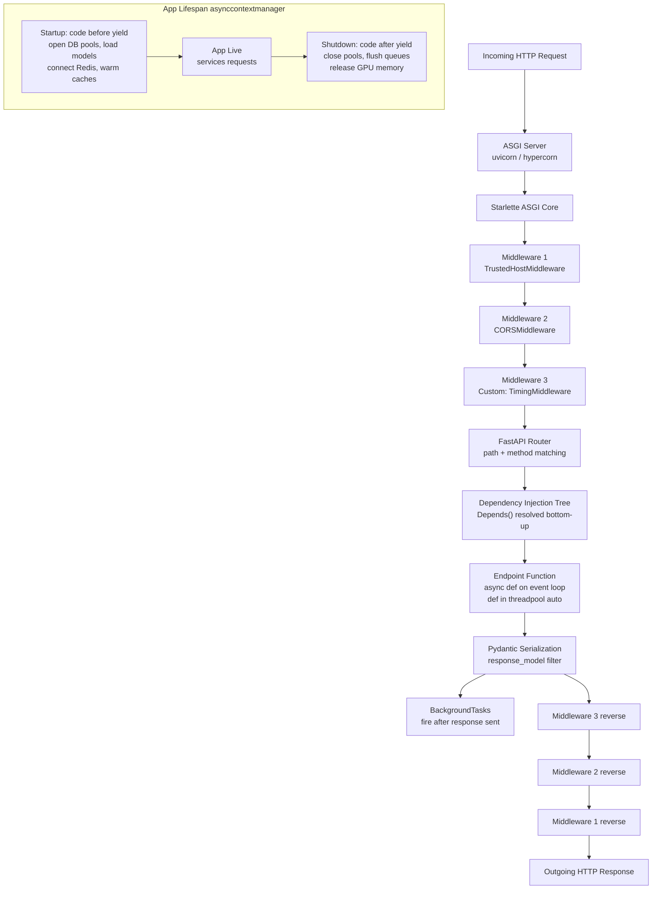

# FastAPI Deep Dive

> [!abstract] TL;DR
> FastAPI is a production-grade ASGI framework built on Starlette and Pydantic that turns Python type annotations into an HTTP API with automatic validation, OpenAPI docs, async support, and a composable dependency injection system — making it the dominant choice for Python backend services and ML model serving.

---

## Intuition

**Analogy:** Building a FastAPI app is like designing a smart postal sorting facility. Incoming parcels (HTTP requests) pass through security checkpoints (middleware), get scanned and validated at intake (Pydantic), routed to the right department (router), where specialists with pre-assembled tools wait (dependency injection). The facility auto-generates its own directory of services (OpenAPI docs at `/docs`). Some packages trigger follow-up work that continues after the original sender gets their receipt (background tasks). And the facility has a careful opening/closing ritual — loading heavy equipment at start of day, shutting it down at close (lifespan events).

Unlike a traditional synchronous warehouse (Flask/Django), this facility's sorting bays can handle thousands of packages concurrently without standing idle between steps (asyncio event loop).

---

## How It Works

### Core Mechanics

**The stack:**
- **uvicorn / hypercorn** — ASGI server: accepts TCP connections, speaks HTTP, calls the ASGI application as a Python callable.
- **Starlette** — the underlying ASGI web framework: routing, middleware machinery, `Request`/`Response` objects, WebSocket support, static files.
- **FastAPI** — extends Starlette: adds Pydantic-driven validation, `Depends()` injection, OpenAPI generation, and `response_model` serialization.
- **Pydantic v2** — validation engine: converts incoming JSON to typed Python objects and serializes outgoing objects to JSON.

**Request lifecycle in six steps:**
1. uvicorn parses the HTTP request into an ASGI scope/receive/send triple and calls the app.
2. The Starlette app passes the request through the middleware stack (outermost to innermost — LIFO on exit).
3. The router matches `method + path` to an endpoint function.
4. FastAPI resolves the full `Depends()` tree (depth-first, cached per request by default).
5. The endpoint function runs — `async def` on the event loop, plain `def` in a threadpool.
6. The return value is serialized through `response_model` and sent as the response body; then middleware executes in reverse; then `BackgroundTasks` fire.

### Flow / Architecture



---

## Parameters: Path, Query, and Body

### Type Annotations Drive Validation

FastAPI reads function signature annotations at import time and constructs validators automatically. The source of a parameter is inferred from its location: path variables are declared in the route string, query params are everything else that is not a Pydantic model, and bodies are Pydantic model arguments.

```python
from fastapi import FastAPI, Path, Query, Body
from typing import Annotated
from pydantic import BaseModel

app = FastAPI()

class Item(BaseModel):
    name: str
    price: float

# Path + Query + Body all from type annotations
@app.put("/items/{item_id}")
async def update_item(
    # Path: enforced ge/le at request time → HTTP 422 on violation
    item_id: Annotated[int, Path(ge=1, le=9999, description="Item primary key")],
    # Query: optional with default
    verbose: Annotated[bool, Query()] = False,
    # Body: Pydantic model auto-detected
    item: Item,
):
    return {"item_id": item_id, "item": item, "verbose": verbose}

# List query params: ?tag=python&tag=fastapi
@app.get("/search")
async def search(tags: list[str] = Query(default=[])):
    return {"tags": tags}

# embed=True: wraps body in {"item": {...}} instead of bare object
@app.post("/items")
async def create_item(item: Annotated[Item, Body(embed=True)]):
    return item
```

**`Annotated` (preferred in FastAPI 0.95+)** — combines the type with validation metadata in a single expression: `Annotated[int, Path(ge=1)]`. This makes the annotation self-contained and reusable across multiple endpoints.

---

## Pydantic Models for Request and Response

### Request Bodies and Response Filtering

```python
from pydantic import BaseModel, Field, ConfigDict
from typing import Optional

# Request body
class UserCreate(BaseModel):
    username: str = Field(min_length=3, max_length=50)
    email: str = Field(pattern=r"^[^@]+@[^@]+\.[^@]+$")
    password: str = Field(min_length=8)

# Response model — never leaks password field
class UserPublic(BaseModel):
    id: int
    username: str
    email: str

# ORM integration: reads from SQLAlchemy model attributes, not dict
class UserFromORM(BaseModel):
    model_config = ConfigDict(from_attributes=True)
    id: int
    username: str

# response_model_exclude_unset=True: only serializes fields that were
# explicitly set on the returned object — critical for PATCH semantics
@app.patch("/users/{user_id}", response_model=UserPublic, response_model_exclude_unset=True)
async def patch_user(user_id: int, updates: UserCreate):
    # Only fields present in the request body appear in the response
    ...

# API naming convention: snake_case Python, camelCase JSON
class EventPayload(BaseModel):
    model_config = ConfigDict(populate_by_name=True)
    event_type: str = Field(alias="eventType")
    occurred_at: str = Field(alias="occurredAt", serialization_alias="occurredAt")
```

**Key `response_model` behaviors:**

| Option | Effect |
|--------|--------|
| `response_model=UserPublic` | Filters output to only `UserPublic` fields; hides `password` |
| `response_model_exclude_unset=True` | Omits fields not explicitly set on the returned object |
| `response_model_exclude_none=True` | Omits fields whose value is `None` |
| `response_model=list[UserPublic]` | Validates a list of users |

---

## Dependency Injection System

The `Depends()` system is FastAPI's most powerful feature. It is a function-scoped IoC container: every request resolves its own dependency tree, and the resolved values are injected as function arguments.

### Function Dependencies

```python
from fastapi import Depends, Header, HTTPException

# A simple dependency
async def get_api_key(x_api_key: str = Header(...)) -> str:
    if x_api_key != "secret-key":
        raise HTTPException(status_code=403, detail="Invalid API key")
    return x_api_key

# Chained: db depends on settings, endpoint depends on db
async def get_settings() -> dict:
    return {"db_url": "sqlite:///./app.db", "pool_size": 5}

async def get_db(settings: dict = Depends(get_settings)):
    # settings is resolved first, then passed in
    db = connect(settings["db_url"])
    return db

@app.get("/data")
async def read_data(
    db=Depends(get_db),
    key: str = Depends(get_api_key),
):
    ...
```

### Class-Based Dependencies

```python
class Pagination:
    """Reusable pagination dependency — shares logic via class instantiation."""
    def __init__(self, skip: int = 0, limit: int = Query(default=10, le=100)):
        self.skip = skip
        self.limit = limit

@app.get("/items")
async def list_items(page: Pagination = Depends(Pagination)):
    return {"skip": page.skip, "limit": page.limit}
```

### Yield Dependencies (Setup/Teardown)

A dependency function with `yield` splits into setup (before `yield`) and teardown (after `yield`). Teardown is guaranteed even on exceptions — identical to `@contextmanager`. See [[Context_Managers]].

```python
# The full SQLAlchemy session pattern — see Code Demo section 3 below
async def get_db() -> AsyncGenerator[Session, None]:
    db = SessionLocal()
    try:
        yield db
        db.commit()
    except Exception:
        db.rollback()
        raise
    finally:
        db.close()
```

### Dependency Cache Semantics

By default `use_cache=True`: a dependency function is called **at most once per request**, and the result is shared across all parameters that depend on it within that request. This is critical for database sessions (one session per request, not one per call site). Set `use_cache=False` to force a new call every time.

```python
# Both endpoints in the same request share the same db session instance
@app.post("/transfer")
async def transfer(
    src: Account = Depends(get_account),   # internally uses Depends(get_db)
    dst: Account = Depends(get_account),   # same get_db call is reused
):
    ...
```

### OAuth2 Scopes

```python
from fastapi.security import OAuth2PasswordBearer, SecurityScopes
from fastapi import Security

oauth2_scheme = OAuth2PasswordBearer(tokenUrl="/token", scopes={"read": "Read access", "write": "Write access"})

async def get_current_user_with_scopes(
    security_scopes: SecurityScopes,
    token: str = Depends(oauth2_scheme),
):
    # security_scopes.scopes contains the required scopes for this call site
    ...

@app.delete("/items/{id}")
async def delete_item(user=Security(get_current_user_with_scopes, scopes=["write"])):
    ...
```

---

## Authentication Patterns

### HTTP Security Schemes

| Scheme | Class | Header/Location |
|--------|-------|----------------|
| HTTP Basic | `HTTPBasic` | `Authorization: Basic <base64>` |
| API Key (header) | `APIKeyHeader` | Custom header e.g. `X-API-Key` |
| API Key (query) | `APIKeyQuery` | `?api_key=...` |
| API Key (cookie) | `APIKeyCookie` | Cookie jar |
| Bearer token | `HTTPBearer` | `Authorization: Bearer <token>` |
| OAuth2 Password | `OAuth2PasswordBearer` | `Authorization: Bearer <JWT>` |

All schemes implement `__call__` as a dependency, extracting credentials from the request. The actual validation (checking the token, looking up the user) is your code in the dependency function that wraps the scheme. See **Code Demo 1** below for the complete JWT pattern.

---

## Middleware

Middleware wraps the entire ASGI app — every request passes through every middleware before reaching the router. Execution order is **LIFO**: the last middleware added is the outermost wrapper (first to run on entry, last to run on exit).

### Built-in Middleware

```python
from fastapi.middleware.cors import CORSMiddleware
from fastapi.middleware.gzip import GZipMiddleware
from fastapi.middleware.trustedhost import TrustedHostMiddleware

app.add_middleware(
    CORSMiddleware,
    allow_origins=["https://app.example.com"],
    allow_credentials=True,
    allow_methods=["*"],
    allow_headers=["*"],
)
app.add_middleware(GZipMiddleware, minimum_size=1000)
app.add_middleware(TrustedHostMiddleware, allowed_hosts=["example.com", "*.example.com"])
```

> [!warning] CORS Middleware Order
> `CORSMiddleware` **must be added last** (i.e., called first in `add_middleware` sequence). If any other middleware raises before CORS headers are set, the browser will receive a CORS error rather than the actual HTTP error. See [[#Common Pitfalls]].

### Custom Middleware with `BaseHTTPMiddleware`

```python
from starlette.middleware.base import BaseHTTPMiddleware

class CustomMiddleware(BaseHTTPMiddleware):
    async def dispatch(self, request: Request, call_next) -> Response:
        # Pre-processing: runs before the endpoint
        response = await call_next(request)  # all inner middleware + endpoint
        # Post-processing: runs after the endpoint returns
        return response
```

See **Code Demo 4** for the full timing + request ID middleware.

---

## WebSockets

WebSocket endpoints bypass the normal HTTP request/response cycle. They upgrade the TCP connection and maintain a persistent bidirectional channel.

```python
from fastapi import WebSocket, WebSocketDisconnect

@app.websocket("/ws/{client_id}")
async def websocket_endpoint(ws: WebSocket, client_id: str):
    await ws.accept()           # completes the HTTP → WebSocket upgrade
    try:
        while True:
            data = await ws.receive_text()          # blocks until message arrives
            await ws.send_json({"echo": data, "from": client_id})
    except WebSocketDisconnect:
        pass                    # client disconnected cleanly

# WebSocket endpoints support dependency injection too
@app.websocket("/ws/secure")
async def secure_ws(ws: WebSocket, token: str = Query(...)):
    user = await verify_token(token)   # custom auth logic
    await ws.accept()
    ...
```

**Message types:**

| Send | Receive |
|------|---------|
| `ws.send_text(str)` | `ws.receive_text() → str` |
| `ws.send_json(dict)` | `ws.receive_json() → dict` |
| `ws.send_bytes(bytes)` | `ws.receive_bytes() → bytes` |

See **Code Demo 2** for the broadcast connection manager.

---

## Lifespan Events and Application Startup

The `lifespan` parameter replaces the deprecated `@app.on_event("startup")` / `@app.on_event("shutdown")`. It is an `@asynccontextmanager` that runs setup before its `yield` and teardown after — a single, clear place for all resource lifecycle management.

```python
from contextlib import asynccontextmanager
from fastapi import FastAPI

@asynccontextmanager
async def lifespan(app: FastAPI):
    # STARTUP: runs once before the first request is accepted
    app.state.db_pool = await create_db_pool(DATABASE_URL)
    app.state.redis = await Redis.from_url(REDIS_URL)
    app.state.model = load_model("model.pkl")        # see FastAPI_for_ML
    yield
    # SHUTDOWN: runs after the last request completes
    await app.state.db_pool.close()
    await app.state.redis.close()

app = FastAPI(lifespan=lifespan)

# Access shared resources in endpoints via request.app.state
@app.get("/predict")
async def predict(request: Request):
    model = request.app.state.model
    ...
```

**Why lifespan over `@app.on_event`:**
- `@app.on_event` is deprecated since FastAPI 0.93.
- `lifespan` is a standard Python `asynccontextmanager` — testable, composable, no magic lifecycle methods.
- Startup exceptions (e.g., DB connection fails) propagate cleanly and prevent the app from starting with broken state.

**Testing with lifespan:**

```python
# pytest fixture that runs the full lifespan for test scope
import pytest
from httpx import AsyncClient, ASGITransport

@pytest.fixture
async def client():
    async with AsyncClient(transport=ASGITransport(app=app), base_url="http://test") as ac:
        yield ac   # lifespan runs for the duration of the test
```

---

## Background Tasks and Async

### `BackgroundTasks` — After Response, In-Process

`BackgroundTasks` runs functions **after the response has been sent** to the client, in the same process. Zero infrastructure, zero retry, zero monitoring.

```python
from fastapi import BackgroundTasks
import smtplib

def send_welcome_email(email: str, username: str):
    # Runs after response — client already received HTTP 201
    smtplib.SMTP("localhost").sendmail("noreply@app.com", email, f"Welcome {username}")

@app.post("/users", status_code=201)
async def create_user(user: UserCreate, background_tasks: BackgroundTasks):
    new_user = db.create(user)
    background_tasks.add_task(send_welcome_email, user.email, user.username)
    return new_user   # response sent immediately; email fires after
```

### Sync vs Async Endpoints

FastAPI handles both correctly:

| Endpoint signature | Execution model | Best for |
|-------------------|-----------------|----------|
| `async def` | Runs on the asyncio event loop | I/O-bound work (DB, HTTP calls, Redis) |
| `def` | Runs in a threadpool (auto) | CPU-bound work, blocking libraries |

**The critical rule:** never call blocking code (e.g., `time.sleep()`, synchronous DB drivers, `model.predict()`) from inside `async def` — it freezes the event loop and blocks all other concurrent requests. Use `run_in_executor` or a sync endpoint instead.

```python
import asyncio
from concurrent.futures import ThreadPoolExecutor

executor = ThreadPoolExecutor(max_workers=4)

@app.post("/predict")
async def predict(payload: PredictRequest):
    loop = asyncio.get_event_loop()
    # run_in_executor: offloads blocking call to thread, keeps event loop free
    result = await loop.run_in_executor(executor, model.predict, payload.features)
    return {"prediction": result}
```

See also: [[Concurrency_in_Python]] for the full asyncio vs threading vs multiprocessing decision tree.

---

## Testing FastAPI

### The Two Test Clients

```python
# Sync client — simpler, works without pytest-anyio
from fastapi.testclient import TestClient
client = TestClient(app)
response = client.post("/users", json={"username": "alice", "email": "a@b.com", "password": "secure123"})
assert response.status_code == 201

# Async client — required for async test functions, more realistic
import pytest
import anyio
from httpx import AsyncClient, ASGITransport

@pytest.mark.anyio
async def test_create_user():
    async with AsyncClient(transport=ASGITransport(app=app), base_url="http://test") as client:
        response = await client.post("/users", json={"username": "alice", "email": "a@b.com", "password": "secure123"})
    assert response.status_code == 201
    assert response.json()["username"] == "alice"
```

### Dependency Overrides — The Key to Testable Code

`app.dependency_overrides` is a dict that maps a real dependency to a mock replacement. FastAPI checks this map at request time, allowing any dependency to be swapped without modifying application code.

```python
def override_get_db():
    """Test database dependency — uses in-memory SQLite."""
    db = TestingSessionLocal()
    try:
        yield db
    finally:
        db.close()

# Override for the duration of the test module
app.dependency_overrides[get_db] = override_get_db

def test_list_users():
    response = client.get("/users")
    assert response.status_code == 200

# Restore after tests
app.dependency_overrides = {}
```

### WebSocket Testing

```python
def test_websocket_chat():
    with TestClient(app).websocket_connect("/ws/alice") as ws:
        ws.send_text("Hello")
        data = ws.receive_json()
        assert data["echo"] == "Hello"
```

---

## Production Patterns

### Router Organization

```python
# routers/users.py
from fastapi import APIRouter

router = APIRouter(prefix="/v1/users", tags=["users"])

@router.get("/", response_model=list[UserPublic])
async def list_users(): ...

@router.post("/", response_model=UserPublic, status_code=201)
async def create_user(user: UserCreate): ...

# main.py
from routers import users, items, auth

app = FastAPI()
app.include_router(users.router)
app.include_router(items.router)
app.include_router(auth.router, prefix="/v1/auth", tags=["auth"])
```

### OpenAPI Customization

```python
app = FastAPI(
    title="My API",
    description="Production ML API",
    version="2.0.0",
    docs_url="/docs",          # set to None to disable in production
    redoc_url="/redoc",
    openapi_url="/openapi.json",
    openapi_tags=[
        {"name": "inference", "description": "Model prediction endpoints"},
        {"name": "ops", "description": "Health and readiness probes"},
    ],
)
```

### Rate Limiting with slowapi

```python
from slowapi import Limiter
from slowapi.util import get_remote_address

limiter = Limiter(key_func=get_remote_address)
app.state.limiter = limiter

@app.get("/predict")
@limiter.limit("10/minute")
async def predict(request: Request): ...
```

### Health Check Endpoint

```python
@app.get("/health", tags=["ops"], include_in_schema=False)
async def health(request: Request):
    """Kubernetes liveness + readiness probe."""
    checks = {}
    try:
        await request.app.state.db_pool.execute("SELECT 1")
        checks["db"] = "ok"
    except Exception as e:
        checks["db"] = str(e)
    all_ok = all(v == "ok" for v in checks.values())
    return JSONResponse(
        status_code=200 if all_ok else 503,
        content={"status": "healthy" if all_ok else "degraded", "checks": checks},
    )
```

### Docker + uvicorn Workers

```dockerfile
# Dockerfile (minimal production image)
FROM python:3.12-slim
WORKDIR /app
COPY requirements.txt .
RUN pip install --no-cache-dir -r requirements.txt
COPY . .
CMD ["uvicorn", "main:app", "--host", "0.0.0.0", "--port", "8000", "--workers", "4"]
```

Use `--workers N` (one per CPU core) for CPU-bound workloads. For I/O-bound services at scale, combine with `--loop uvloop` for a 2-3x event loop speed boost.

---

## Code Demo

### Demo 1: JWT Authentication — Current User Dependency

```python
# pip install fastapi python-jose[cryptography] passlib[bcrypt]
from fastapi import FastAPI, Depends, HTTPException, status
from fastapi.security import OAuth2PasswordBearer, OAuth2PasswordRequestForm
from jose import JWTError, jwt
from passlib.context import CryptContext
from pydantic import BaseModel
from datetime import datetime, timedelta, timezone

SECRET_KEY = "dev-secret-replace-with-secrets-token-hex-32-in-prod"
ALGORITHM = "HS256"
ACCESS_TOKEN_EXPIRE_MINUTES = 30

pwd_context = CryptContext(schemes=["bcrypt"], deprecated="auto")
oauth2_scheme = OAuth2PasswordBearer(tokenUrl="/token")
app = FastAPI()

FAKE_USERS = {
    "alice": {"username": "alice", "hashed_password": pwd_context.hash("secret"), "role": "admin"},
    "bob":   {"username": "bob",   "hashed_password": pwd_context.hash("password"), "role": "reader"},
}

class User(BaseModel):
    username: str
    role: str

class Token(BaseModel):
    access_token: str
    token_type: str

def create_access_token(data: dict, expires_delta: timedelta | None = None) -> str:
    to_encode = data.copy()
    expire = datetime.now(timezone.utc) + (expires_delta or timedelta(minutes=15))
    to_encode["exp"] = expire
    return jwt.encode(to_encode, SECRET_KEY, algorithm=ALGORITHM)

async def get_current_user(token: str = Depends(oauth2_scheme)) -> User:
    """Core auth dependency: decode JWT, validate claims, return typed User."""
    exc = HTTPException(
        status_code=status.HTTP_401_UNAUTHORIZED,
        detail="Could not validate credentials",
        headers={"WWW-Authenticate": "Bearer"},
    )
    try:
        payload = jwt.decode(token, SECRET_KEY, algorithms=[ALGORITHM])
        username: str | None = payload.get("sub")
        if username is None:
            raise exc
    except JWTError:
        raise exc
    user_data = FAKE_USERS.get(username)
    if user_data is None:
        raise exc
    return User(username=user_data["username"], role=user_data["role"])

def require_role(required_role: str):
    """Factory dependency for RBAC — returns a role-enforcing Depends."""
    async def role_checker(current_user: User = Depends(get_current_user)) -> User:
        if current_user.role != required_role:
            raise HTTPException(status_code=403, detail="Insufficient permissions")
        return current_user
    return role_checker

@app.post("/token", response_model=Token)
async def login(form: OAuth2PasswordRequestForm = Depends()):
    user_data = FAKE_USERS.get(form.username)
    if not user_data or not pwd_context.verify(form.password, user_data["hashed_password"]):
        raise HTTPException(status_code=401, detail="Incorrect username or password")
    token = create_access_token({"sub": form.username}, timedelta(minutes=ACCESS_TOKEN_EXPIRE_MINUTES))
    return Token(access_token=token, token_type="bearer")

@app.get("/me", response_model=User)
async def read_me(current_user: User = Depends(get_current_user)):
    return current_user

@app.delete("/admin/purge")
async def admin_purge(admin: User = Depends(require_role("admin"))):
    return {"message": f"Purge authorized by {admin.username}"}
```

### Demo 2: WebSocket Connection Manager — Broadcast Chat

```python
from fastapi import FastAPI, WebSocket, WebSocketDisconnect

app = FastAPI()

class ConnectionManager:
    """In-process broadcast manager. For multi-server, replace with Redis Pub/Sub."""

    def __init__(self) -> None:
        self.active: list[WebSocket] = []

    async def connect(self, ws: WebSocket) -> None:
        await ws.accept()
        self.active.append(ws)

    def disconnect(self, ws: WebSocket) -> None:
        if ws in self.active:
            self.active.remove(ws)

    async def broadcast(self, message: str) -> None:
        """Send to all; silently drop stale connections."""
        dead: list[WebSocket] = []
        for ws in self.active:
            try:
                await ws.send_text(message)
            except Exception:
                dead.append(ws)
        for ws in dead:
            self.disconnect(ws)

manager = ConnectionManager()

@app.websocket("/ws/chat/{username}")
async def chat_endpoint(ws: WebSocket, username: str) -> None:
    await manager.connect(ws)
    await manager.broadcast(f"[server] {username} joined ({len(manager.active)} online)")
    try:
        while True:
            text = await ws.receive_text()
            await manager.broadcast(f"[{username}] {text}")
    except WebSocketDisconnect:
        manager.disconnect(ws)
        await manager.broadcast(f"[server] {username} left ({len(manager.active)} online)")
```

### Demo 3: Yield Dependency — SQLAlchemy Session with Rollback

```python
from fastapi import FastAPI, Depends, HTTPException
from sqlalchemy import create_engine, text
from sqlalchemy.orm import sessionmaker, Session
from typing import Generator

DATABASE_URL = "sqlite:///./app.db"  # swap to postgresql+asyncpg:// for async
engine = create_engine(DATABASE_URL, connect_args={"check_same_thread": False})
SessionLocal = sessionmaker(bind=engine, autocommit=False, autoflush=False)

app = FastAPI()

def get_db() -> Generator[Session, None, None]:
    """
    Yield dependency — three-phase lifecycle per request:
      1. Acquire: open DB session from pool
      2. Yield: endpoint runs with the session
      3. Teardown: commit on success, rollback on any exception, always close
    use_cache=True (default) means one session per request, not per call site.
    """
    db = SessionLocal()
    try:
        yield db
        db.commit()       # only reached if no exception was raised in endpoint
    except Exception:
        db.rollback()     # partial writes are undone — DB stays consistent
        raise             # re-raise so FastAPI returns the correct HTTP status
    finally:
        db.close()        # always returns connection to the pool

@app.get("/users/{user_id}")
def get_user(user_id: int, db: Session = Depends(get_db)):
    # Note: sync def — SQLAlchemy Core is blocking, runs in threadpool
    row = db.execute(
        text("SELECT id, name, email FROM users WHERE id = :uid"),
        {"uid": user_id},
    ).fetchone()
    if row is None:
        raise HTTPException(status_code=404, detail="User not found")
    return {"id": row.id, "name": row.name, "email": row.email}

@app.post("/users")
def create_user(name: str, email: str, db: Session = Depends(get_db)):
    db.execute(text("INSERT INTO users (name, email) VALUES (:n, :e)"), {"n": name, "e": email})
    # commit happens in get_db teardown after this function returns
    return {"status": "created"}
```

### Demo 4: Timing Middleware with Request ID Injection

```python
import time
import uuid
import logging
from fastapi import FastAPI, Request
from fastapi.responses import JSONResponse
from starlette.middleware.base import BaseHTTPMiddleware
from starlette.responses import Response
from starlette.types import ASGIApp

logger = logging.getLogger("api.timing")

class TimingMiddleware(BaseHTTPMiddleware):
    """
    Per-request:
      - Generates or propagates X-Request-ID header
      - Attaches request_id to request.state (readable in endpoints and logs)
      - Records wall-clock duration
      - Adds X-Request-ID and X-Response-Time-Ms to the response headers
    """

    def __init__(self, app: ASGIApp, header_name: str = "X-Request-ID") -> None:
        super().__init__(app)
        self.header_name = header_name

    async def dispatch(self, request: Request, call_next) -> Response:
        request_id = request.headers.get(self.header_name) or str(uuid.uuid4())
        request.state.request_id = request_id  # endpoints read via request.state.request_id

        start = time.perf_counter()
        response = await call_next(request)
        duration_ms = (time.perf_counter() - start) * 1000

        logger.info(
            "%s %s -> %d  %.1fms  [%s]",
            request.method,
            request.url.path,
            response.status_code,
            duration_ms,
            request_id,
        )

        response.headers[self.header_name] = request_id
        response.headers["X-Response-Time-Ms"] = f"{duration_ms:.1f}"
        return response

app = FastAPI()
# LIFO: TimingMiddleware is outermost (first entry, last exit)
app.add_middleware(TimingMiddleware, header_name="X-Request-ID")

@app.get("/example")
async def example(request: Request):
    # Endpoints can read the injected request ID for structured logging
    return {"request_id": request.state.request_id, "message": "ok"}
```

---

## Real-World Example

> **FastAPI at scale — Uber, Netflix, and the ML serving majority:** FastAPI is the default HTTP framework for Python ML services at scale-up and enterprise companies. The pattern is consistent: `lifespan` loads the model once per process, Pydantic validates inputs at the HTTP boundary (catching type mismatches before they silently corrupt predictions), `async def` with `run_in_executor` keeps the event loop unblocked during CPU-intensive inference, and `APIRouter` with `prefix="/v1"` allows versioned API evolution without breaking clients. Teams operating at 2,000-5,000 RPS per node use this pattern with 4-8 uvicorn workers behind an Nginx reverse proxy. The dependency injection system is particularly valued for swapping out database sessions between production and test environments with zero code changes.

> **Streaming LLM responses:** The `StreamingResponse` class is how all major LLM serving wrappers (LangChain, OpenAI SDK wrappers) implement Server-Sent Events (SSE) for token-by-token streaming. See [[Streaming_Responses]] for the full pattern.

---

## Trade-offs

### FastAPI vs Django REST Framework vs Flask

| Aspect | FastAPI | Django REST Framework | Flask |
|--------|---------|-----------------------|-------|
| Async support | Native ASGI, full async | ASGI in Django 4.1+, ORM still blocking | Partial — requires Quart fork |
| Performance | ~2,000 RPS/worker | ~400 RPS/worker | ~1,500 RPS/worker |
| Schema generation | Automatic via Pydantic | drf-spectacular (external) | Manual (Flask-RESTX) |
| Input validation | Pydantic (compile + runtime) | DRF Serializers (runtime) | Manual / Marshmallow |
| Admin interface | None | Built-in, batteries-included | None (Flask-Admin ext) |
| Auth system | Bring your own | Built-in user model + sessions | Bring your own |
| Learning curve | Moderate | Steep (ORM, views, serializers) | Low |
| Best fit | APIs, ML serving, microservices | Full-stack Django apps | Simple APIs, prototypes |

### `Depends` Yield vs Class-Based

| Aspect | Yield Dependency | Class-Based `__call__` |
|--------|-----------------|------------------------|
| Teardown guarantee | `try/finally` enforced by FastAPI | Must be implemented manually in `__call__` |
| Testability | Replace function in `dependency_overrides` | Replace class or instance |
| Shared state | Closure over variables | Instance attributes |
| Complexity threshold | Clean for simple setup/teardown | Better when state spans multiple methods |

### `BackgroundTasks` vs Celery

| Aspect | BackgroundTasks | Celery |
|--------|----------------|--------|
| Setup | Zero — built into FastAPI | Requires broker (Redis / RabbitMQ) + worker process |
| Reliability | None — lost if process crashes | Durable queues, retry policies |
| Retry on failure | Manual | Built-in with exponential backoff |
| Monitoring | None | Flower dashboard, task state tracking |
| Distributed workers | No — in-process only | Yes — scale workers independently |
| Best for | Send email, fire webhook, write log | Anything that must not be dropped: payments, reports |

---

## When to Use vs Avoid

**Use FastAPI when:**
- Building REST APIs in Python where type safety, auto-docs, and async matter.
- Serving ML models where Pydantic validates input features at the HTTP boundary.
- You need a dependency injection system that supports testable, composable teardown.
- Team size is small-to-medium and shipping speed matters over full-stack batteries.
- Request volume is under ~10,000 RPS per instance (beyond this, consider Triton or Go).

**Avoid when:**
- You need a full-stack MVC framework with ORM, admin, and session management baked in — use Django.
- Sub-millisecond latency is critical — consider Rust (axum) or Go (Gin/Chi).
- Your codebase is primarily synchronous legacy code with no plans to migrate — Flask has less async friction for pure sync workloads.
- The team is unfamiliar with async Python — mixing `async def` and `def` incorrectly causes subtle event loop blocking bugs.

---

## Common Pitfalls

- **Blocking sync call in `async def` endpoint** — calling `time.sleep()`, a synchronous DB driver, or `model.predict()` directly inside an `async def` handler freezes the event loop. All concurrent requests stall until the call completes. Fix: offload to `asyncio.get_event_loop().run_in_executor(executor, fn, args)` or change the handler to `def` (FastAPI auto-runs `def` handlers in a threadpool).

- **`use_cache=True` sharing mutable state across call sites within a request** — the default caching means two `Depends(get_db)` annotations in the same request share one session object. This is usually desirable (one transaction). The pitfall is assuming two calls create independent sessions: they do not. If you genuinely need two separate sessions (e.g., cross-database federation), use `Depends(get_db, use_cache=False)`.

- **`response_model` without `response_model_exclude_unset=True` on PATCH endpoints** — without this flag, FastAPI serializes all fields in the response model, even those that were not set, using their Pydantic defaults. A PATCH response then looks like a full update, confusing clients. Always pair `response_model_exclude_unset=True` with partial-update endpoints.

- **CORS middleware added after routing middleware** — `app.add_middleware()` builds a LIFO stack. If you add `TrustedHostMiddleware` after `CORSMiddleware`, `TrustedHostMiddleware` runs first (outermost) and may reject requests before CORS headers are ever set. The browser sees a network error, not a CORS rejection, making the bug hard to diagnose. Always add `CORSMiddleware` last in your `add_middleware` call sequence so it wraps everything else.

- **Using `@app.on_event("startup")` in new code** — this decorator is deprecated since FastAPI 0.93 and will be removed. It cannot guarantee teardown on exceptions during startup. Use `@asynccontextmanager` lifespan.

- **Not handling `WebSocketDisconnect` in WebSocket handlers** — if the client closes the connection and the server is blocked on `await ws.receive_text()`, FastAPI raises `WebSocketDisconnect`. Unhandled, this propagates as an unhandled exception and logs a traceback. Always wrap the receive loop in `try/except WebSocketDisconnect`.

---

## Related Concepts

- [[FastAPI_for_ML]] — the ML-specific serving pattern (lifespan model loading, batch inference, `run_in_executor`); this note extends that foundation to the full backend feature set.
- [[Context_Managers]] — yield dependencies are `@asynccontextmanager` under the hood; understanding the protocol explains why teardown is guaranteed and how exceptions propagate through the DI tree.
- [[Type_Hints_and_Static_Analysis]] — FastAPI's entire parameter extraction and validation system is built on `typing.get_type_hints()`; `Annotated` metadata, Pydantic model generation, and OpenAPI schema derivation all start from Python type annotations.
- [[Concurrency_in_Python]] — explains when to use `async def` vs `def`, what `run_in_executor` does, and why the GIL means sync CPU code in `async def` blocks all concurrent requests.
- [[Decorators_and_Metaprogramming]] — FastAPI route decorators (`@app.get`, `@app.post`) and the `Depends()` descriptor mechanism are applications of Python's decorator and descriptor protocols.
- [[Generators_and_Iterators]] — yield dependencies are generator functions; `StreamingResponse` with `yield` chunks uses the generator protocol for lazy streaming.
- [[Streaming_Responses]] — the SSE / token-streaming pattern using FastAPI's `StreamingResponse` and `EventSourceResponse` for LLM output.
- [[Model_Serving_Overview]] — positions FastAPI in the broader model serving landscape alongside Triton, BentoML, and Ray Serve.

---

## Review Questions

1. **Dependency cache semantics:** Two endpoints in the same request both declare `db: Session = Depends(get_db)`. How many times is `get_db` called by default? What happens to the session's `commit()` and `close()` calls in the yield dependency if one of the endpoints raises an `HTTPException`? What flag would you set to get two independent sessions, and when would you actually want that?

2. **Lifespan vs `on_event`:** A colleague migrates a service from `@app.on_event("startup")` to the `lifespan` pattern. During startup, the database connection fails. How does each approach differ in behavior: does the app start serving requests in the failed state? What is the operational consequence, and why is `lifespan` strictly better here?

3. **Sync endpoint threadpool behavior:** You have a FastAPI service with `async def` endpoints for all routes. A new endpoint needs to call a synchronous OCR library that takes 2 seconds per request. A junior engineer suggests changing it to `def` instead of `async def`. Is this correct? What exactly changes about how FastAPI handles the execution, and how does this affect concurrent request throughput?

4. **`response_model_exclude_unset` semantics:** You implement a `PATCH /users/{id}` endpoint that accepts partial updates. Without `response_model_exclude_unset=True`, what does the JSON response look like when a client sends only `{"email": "new@example.com"}`? What does it look like with the flag enabled? Why does this matter for API contract clarity and for clients that do diffing?

---

## Sources

- [FastAPI Documentation](https://fastapi.tiangolo.com/)
- [FastAPI — Advanced User Guide: Dependencies with yield](https://fastapi.tiangolo.com/tutorial/dependencies/dependencies-with-yield/)
- [FastAPI — Middleware](https://fastapi.tiangolo.com/tutorial/middleware/)
- [FastAPI — WebSockets](https://fastapi.tiangolo.com/advanced/websockets/)
- [FastAPI — Lifespan Events](https://fastapi.tiangolo.com/advanced/events/)
- [Pydantic v2 Documentation](https://docs.pydantic.dev/latest/)
- [Starlette Documentation](https://www.starlette.io/)
- [python-jose — JWT for Python](https://python-jose.readthedocs.io/en/latest/)

---

#python #fastapi #backend #rest-api #async #pydantic
