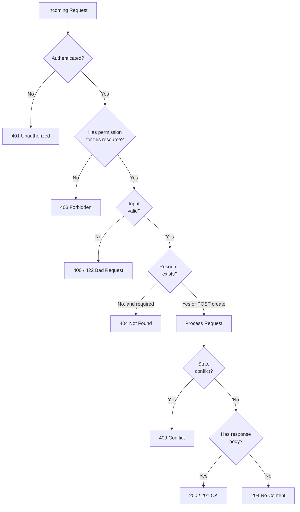

# REST API Design

> [!abstract] TL;DR
> REST is a set of architectural constraints that, when applied to HTTP, produces APIs that are predictable, cacheable, and scalable. In practice, "RESTful" means: resources are nouns in the URL, HTTP verbs encode intent, status codes communicate outcome, and responses are self-describing JSON. Mastering these conventions eliminates an entire class of bugs and makes your API self-documenting.

---

## Intuition

**Analogy:** Think of REST as a library cataloguing system. Every book (resource) has a fixed shelf location (URL). You don't ask the librarian "GetBook" — you tell her what you want to do (check out, return, search) and which shelf location. The action (borrow, return) maps to a verb; the shelf location is the noun. REST makes HTTP work the same way: URLs name things, methods describe what you want to do to them.

Non-REST APIs are like calling a librarian and saying "ExecuteBookRetrieval?" — you must learn a new vocabulary for every operation. REST removes that cognitive load by reusing HTTP's universal verb set.

---

## How It Works

### REST Constraints and Richardson Maturity Model

Roy Fielding defined six constraints that make an architecture truly RESTful:

1. **Client-Server** — UI concerns are separated from data storage concerns. Client and server evolve independently.
2. **Stateless** — Every request contains all information needed to process it. No session state on the server between requests.
3. **Cacheable** — Responses must declare whether they can be cached. Drives HTTP `Cache-Control` headers.
4. **Uniform Interface** — Resources are identified by URIs; manipulation happens through representations; messages are self-descriptive; HATEOAS (Hypermedia As The Engine Of Application State).
5. **Layered System** — Client cannot tell if it's talking directly to the server or through a proxy/load balancer.
6. **Code on Demand** (optional) — Servers can send executable code to clients (JavaScript).

The **Richardson Maturity Model** grades how RESTful an API is:

| Level | Name | What it means | Example |
|-------|------|---------------|---------|
| 0 | Single endpoint | One URL, one method, RPC-style | `POST /api` with `{action: "getUser"}` |
| 1 | Resources | Separate URLs per resource | `GET /users/42` |
| 2 | HTTP verbs | Correct use of GET, POST, PUT, DELETE | `DELETE /users/42` returns 204 |
| 3 | HATEOAS | Responses include links to next actions | `{"id":42,"_links":{"orders":"/users/42/orders"}}` |

**Pragmatic REST vs strict REST:** HATEOAS (Level 3) is academically correct but almost never implemented in practice — clients are statically generated from OpenAPI specs, not dynamically discovered. Production APIs target Level 2 as the de-facto standard. Level 3 is more common in public APIs with very long lifetimes (e.g., GitHub API `_links`).

### URL Design

**Nouns, not verbs.** The HTTP method is the verb. The URL is the noun.

```
WRONG:  GET  /getUsers
WRONG:  POST /createOrder
RIGHT:  GET  /users
RIGHT:  POST /orders
```

**Plural resource names** for collections; singular path segments don't appear in collection routes.

**Hierarchical relationships** reflect ownership:
```
GET  /users/{id}/orders        # orders belonging to a user
GET  /orders/{id}/items        # items within a specific order
```

**UUID vs auto-increment IDs:**
- Auto-increment IDs leak business intelligence (competitor can see order volume by watching IDs grow) and are unsafe for distributed systems.
- UUIDs (v4 random or v7 time-sorted) are opaque, globally unique, and safe to expose externally.
- Use UUIDs for external-facing APIs; keep integer PKs as internal database keys.

**Avoid deep nesting.** Beyond 2-3 levels, switch to query parameters:
```
# Too deep — fragile and hard to read
GET /users/{uid}/orders/{oid}/items/{iid}/reviews

# Better — use query params to express filter intent
GET /reviews?order_item_id={iid}
GET /orders?user_id={uid}         # alternative to /users/{uid}/orders
```

**POST for actions** (state transitions that don't map cleanly to CRUD):
```
POST /orders/{id}/cancel     # action: cancel order
POST /invoices/{id}/send     # action: trigger send
POST /accounts/{id}/verify   # action: trigger verification
```

### HTTP Method Semantics

| Method | Safe | Idempotent | Use for | Status on success |
|--------|------|------------|---------|-------------------|
| GET | Yes | Yes | Fetch resource or collection | 200 |
| POST | No | No | Create resource, trigger action | 201 (create), 200 (action) |
| PUT | No | Yes | Full replacement of a resource | 200 or 204 |
| PATCH | No | No* | Partial update | 200 or 204 |
| DELETE | No | Yes | Remove a resource | 204 |
| HEAD | Yes | Yes | Check existence / cache validation | 200 (no body) |
| OPTIONS | Yes | Yes | CORS preflight, capability discovery | 200 or 204 |

*PATCH idempotency depends on the patch format. JSON Merge Patch (`RFC 7396`) is idempotent; JSON Patch (`RFC 6902`) operations like `add` may not be.

**Safe** = does not change server state.
**Idempotent** = calling it N times produces the same server state as calling it once.

### HTTP Status Codes

```
2xx — Success
  200 OK             Standard success; GET, POST (action), PUT/PATCH with body
  201 Created        POST created a resource; MUST include Location header
  204 No Content     Success with no response body (DELETE, PUT/PATCH silent update)

3xx — Redirection
  301 Moved Permanently   Resource at new URL forever (update bookmarks)
  304 Not Modified        Cached version is still valid; no body sent

4xx — Client Error
  400 Bad Request           Malformed JSON, missing required fields
  401 Unauthorized          Not authenticated (no token or invalid token)
  403 Forbidden             Authenticated but lacks permission for this resource
  404 Not Found             Resource does not exist
  405 Method Not Allowed    HTTP method not supported for this endpoint
  409 Conflict              State conflict (duplicate unique field, version mismatch)
  422 Unprocessable Entity  Syntactically valid but semantically invalid (FastAPI default)
  429 Too Many Requests     Rate limit exceeded; include Retry-After header

5xx — Server Error
  500 Internal Server Error  Unexpected server failure (generic catch-all)
  502 Bad Gateway            Upstream service returned an invalid response
  503 Service Unavailable    Server overloaded or down for maintenance
```

### Flow / Architecture

```mermaid
graph LR
    subgraph REST_Constraints
        CS[Client-Server\nSeparation]
        SL[Stateless\nRequests]
        CA[Cacheable\nResponses]
        UI[Uniform\nInterface]
        LS[Layered\nSystem]
        COD[Code on\nDemand - optional]
    end

    subgraph HTTP_Method_to_CRUD
        GET_method[GET] --> READ[Read / Fetch]
        POST_method[POST] --> CREATE[Create / Action]
        PUT_method[PUT] --> REPLACE[Full Replace]
        PATCH_method[PATCH] --> UPDATE[Partial Update]
        DELETE_method[DELETE] --> DESTROY[Delete]
    end

    subgraph URL_Hierarchy
        ROOT[/] --> COLLECTION[/users]
        COLLECTION --> RESOURCE[/users/id]
        RESOURCE --> SUB[/users/id/orders]
        SUB --> SUBSUB[/users/id/orders/id]
    end
```



---

## Code Demo

### 1. FastAPI Router with Versioning, Pagination, Filtering, and Error Responses

```python
# pip install fastapi uvicorn pydantic
from fastapi import FastAPI, APIRouter, Query, HTTPException, Request, Response
from fastapi.responses import JSONResponse
from pydantic import BaseModel, Field
from typing import Optional
from datetime import datetime
from uuid import UUID, uuid4

app = FastAPI(title="Orders API", version="1.0.0")

# ── SCHEMAS ──────────────────────────────────────────────────────────────────
class OrderOut(BaseModel):
    id: UUID
    user_id: UUID
    status: str
    total_usd: float
    created_at: datetime

class PaginatedOrders(BaseModel):
    data: list[OrderOut]
    meta: dict  # total, page, per_page, has_next

class ErrorDetail(BaseModel):
    field: Optional[str] = None
    message: str

class ErrorResponse(BaseModel):
    error: dict  # code, message, details

# ── FAKE DATA STORE ───────────────────────────────────────────────────────────
ORDERS_DB: list[dict] = [
    {
        "id": uuid4(), "user_id": uuid4(), "status": "active",
        "total_usd": 49.99, "created_at": datetime(2025, 1, 15)
    },
    {
        "id": uuid4(), "user_id": uuid4(), "status": "cancelled",
        "total_usd": 12.00, "created_at": datetime(2025, 3, 10)
    },
]

# ── v1 ROUTER ────────────────────────────────────────────────────────────────
v1 = APIRouter(prefix="/v1")

@v1.get(
    "/orders",
    response_model=PaginatedOrders,
    summary="List orders",
    tags=["orders"],
)
async def list_orders(
    status: Optional[str] = Query(None, description="Filter by status"),
    created_after: Optional[datetime] = Query(None),
    sort: str = Query("created_at", regex="^(created_at|total_usd)$"),
    order: str = Query("desc", regex="^(asc|desc)$"),
    page: int = Query(1, ge=1),
    per_page: int = Query(20, ge=1, le=100),
):
    results = list(ORDERS_DB)

    # Filtering — ORM layer would do this in SQL; never interpolate into raw SQL
    if status:
        results = [o for o in results if o["status"] == status]
    if created_after:
        results = [o for o in results if o["created_at"] >= created_after]

    # Sorting
    results.sort(key=lambda o: o[sort], reverse=(order == "desc"))

    # Offset pagination
    total = len(results)
    start = (page - 1) * per_page
    page_results = results[start : start + per_page]

    return PaginatedOrders(
        data=[OrderOut(**o) for o in page_results],
        meta={
            "total": total,
            "page": page,
            "per_page": per_page,
            "has_next": start + per_page < total,
        },
    )

@v1.post(
    "/orders/{order_id}/cancel",
    status_code=200,
    summary="Cancel an order",
    tags=["orders"],
)
async def cancel_order(order_id: UUID):
    order = next((o for o in ORDERS_DB if o["id"] == order_id), None)
    if not order:
        raise HTTPException(status_code=404, detail="Order not found")
    if order["status"] == "cancelled":
        raise HTTPException(status_code=409, detail="Order is already cancelled")
    order["status"] = "cancelled"
    return {"id": order_id, "status": "cancelled"}

app.include_router(v1)
```

### 2. Cursor-Based Pagination

```python
import base64
import json
from datetime import datetime
from uuid import UUID

# Cursor encodes the last-seen record's sort key — opaque to the client
def encode_cursor(created_at: datetime, record_id: UUID) -> str:
    payload = {"created_at": created_at.isoformat(), "id": str(record_id)}
    return base64.urlsafe_b64encode(json.dumps(payload).encode()).decode()

def decode_cursor(cursor: str) -> tuple[datetime, UUID]:
    payload = json.loads(base64.urlsafe_b64decode(cursor.encode()))
    return datetime.fromisoformat(payload["created_at"]), UUID(payload["id"])

# Simulated keyset query — in real code this is a SQLAlchemy/SQL query
def get_orders_after_cursor(
    cursor_str: Optional[str],
    limit: int,
    db_orders: list[dict],
) -> dict:
    if cursor_str:
        cursor_dt, cursor_id = decode_cursor(cursor_str)
        # Keyset: WHERE (created_at, id) < (cursor_dt, cursor_id) ORDER BY ... LIMIT n
        # This is O(1) regardless of how deep in the dataset you are
        filtered = [
            o for o in db_orders
            if (o["created_at"], str(o["id"])) < (cursor_dt, str(cursor_id))
        ]
    else:
        filtered = list(db_orders)

    # Sort descending by created_at (most recent first)
    filtered.sort(key=lambda o: o["created_at"], reverse=True)
    page = filtered[:limit]

    next_cursor = None
    if len(page) == limit and len(filtered) > limit:
        last = page[-1]
        next_cursor = encode_cursor(last["created_at"], last["id"])

    return {
        "data": page,
        "next_cursor": next_cursor,  # null when no more pages
    }
```

### 3. RFC 7807 Problem Details Error Handler

```python
# RFC 7807 — Problem Details for HTTP APIs
# Standardizes machine-readable error responses across microservices

from fastapi import FastAPI, Request
from fastapi.responses import JSONResponse
from fastapi.exceptions import RequestValidationError
from starlette.exceptions import HTTPException as StarletteHTTPException

app = FastAPI()

# Map internal app error codes to RFC 7807 type URIs
ERROR_TYPES = {
    "VALIDATION_ERROR":    "https://api.example.com/errors/validation",
    "NOT_FOUND":           "https://api.example.com/errors/not-found",
    "CONFLICT":            "https://api.example.com/errors/conflict",
    "RATE_LIMITED":        "https://api.example.com/errors/rate-limited",
}

def problem_response(
    status: int,
    error_code: str,
    title: str,
    detail: str,
    instance: str = "",
    extra: dict = None,
) -> JSONResponse:
    body = {
        "type":     ERROR_TYPES.get(error_code, "about:blank"),
        "title":    title,
        "status":   status,
        "detail":   detail,
        "instance": instance,
    }
    if extra:
        body.update(extra)
    return JSONResponse(
        status_code=status,
        content=body,
        media_type="application/problem+json",
    )

@app.exception_handler(RequestValidationError)
async def validation_exception_handler(request: Request, exc: RequestValidationError):
    field_errors = [
        {"field": ".".join(str(loc) for loc in e["loc"]), "message": e["msg"]}
        for e in exc.errors()
    ]
    return problem_response(
        status=422,
        error_code="VALIDATION_ERROR",
        title="Validation Error",
        detail="One or more fields failed validation.",
        instance=str(request.url),
        extra={"errors": field_errors},
    )

@app.exception_handler(StarletteHTTPException)
async def http_exception_handler(request: Request, exc: StarletteHTTPException):
    code_map = {
        404: ("NOT_FOUND", "Resource Not Found"),
        409: ("CONFLICT", "Conflict"),
        429: ("RATE_LIMITED", "Too Many Requests"),
    }
    error_code, title = code_map.get(exc.status_code, ("ERROR", "Error"))
    return problem_response(
        status=exc.status_code,
        error_code=error_code,
        title=title,
        detail=str(exc.detail),
        instance=str(request.url),
    )
```

### 4. Idempotency Key for POST

```python
# Idempotency keys prevent duplicate payments / operations on network retry
# Client sends a unique key per logical operation; server remembers the result

import hashlib
from fastapi import FastAPI, Header, HTTPException
from typing import Optional

app = FastAPI()

# In production this is Redis with TTL (e.g., 24 hours)
idempotency_store: dict[str, dict] = {}

@app.post("/payments", status_code=201)
async def create_payment(
    payload: dict,
    idempotency_key: Optional[str] = Header(None, alias="Idempotency-Key"),
):
    if not idempotency_key:
        raise HTTPException(400, "Idempotency-Key header is required for payments")

    # Scope key to endpoint to prevent cross-endpoint collisions
    scoped_key = hashlib.sha256(f"POST:/payments:{idempotency_key}".encode()).hexdigest()

    if scoped_key in idempotency_store:
        # Return cached response — same status, same body, no side effects
        cached = idempotency_store[scoped_key]
        return JSONResponse(status_code=cached["status"], content=cached["body"])

    # Process payment (would be real payment processor call here)
    result = {"payment_id": str(uuid4()), "status": "pending", "amount": payload.get("amount")}

    # Store result before returning (even on success) so retries get same response
    idempotency_store[scoped_key] = {"status": 201, "body": result}
    return result
```

---

## Real-World Example

> **Example — GitHub REST API v3:** GitHub's API is a textbook Level 2 REST implementation. `GET /repos/{owner}/{repo}/issues` retrieves issues; `POST /repos/{owner}/{repo}/issues` creates one (returns 201 with `Location` header); `PATCH /repos/{owner}/{repo}/issues/{issue_number}` updates fields. They use cursor-based pagination via the RFC 5988 `Link` header (`rel="next"`, `rel="prev"`), UUID-style node IDs alongside integer IDs (the integer IDs are legacy), consistent error JSON `{message: "...", errors: [...]}`, and rate-limit headers (`X-RateLimit-Remaining`, `X-RateLimit-Reset`). URL versioning (`/v1`) was replaced by header versioning for the GraphQL API, reflecting exactly the trade-off in the table below.

---

## Trade-offs

| Aspect | URL Versioning (`/v1/`) | Header Versioning (`Accept: vnd+v2`) |
|--------|------------------------|--------------------------------------|
| Discoverability | Easy — visible in browser, curl, logs | Hard — requires custom header knowledge |
| Caching | Simple — URL is the cache key | Complex — `Vary: Accept` header required |
| Testing | Trivial — paste URL in browser | Requires tooling to set custom headers |
| URL cleanliness | Clutters URLs | URLs stay clean across versions |
| Industry adoption | Dominant (Stripe, GitHub, AWS) | Niche (some enterprise APIs) |

| Aspect | Offset Pagination | Cursor Pagination |
|--------|-------------------|-------------------|
| Consistency during inserts | Broken — inserts shift rows, causing duplicates or skips | Stable — cursor anchors to a record, not a position |
| Performance at deep pages | O(offset) — DB scans then discards rows | O(1) — keyset index lookup |
| Random access | Supported — jump to page N | Not supported — must paginate forward |
| Implementation complexity | Simple | Moderate (encode/decode cursor) |
| Use case | Admin dashboards, reports | Social feeds, real-time data, infinite scroll |

| Aspect | REST | GraphQL |
|--------|------|---------|
| Over/under-fetching | Common — multiple endpoints or extra fields | Solved — client specifies exact fields |
| Caching | HTTP cache out of the box | Complex — POST requests, persisted queries needed |
| Learning curve | Low — HTTP knowledge sufficient | High — schema, resolvers, N+1 problem |
| Schema / type safety | Via OpenAPI (optional) | Built into the protocol |
| Tooling | Ubiquitous | Growing (Apollo, Relay) |
| Best for | CRUD-heavy services, public APIs | Complex graphs of data, mobile clients |

---

## When to Use vs Avoid

**Use REST when:**
- Building a CRUD-driven service where resources are well-defined nouns.
- Serving multiple client types (web, mobile, third-party) — HTTP caching is valuable.
- Team is familiar with HTTP but not GraphQL.
- Public API that developers discover and integrate without deep coupling.

**Avoid (prefer GraphQL or RPC) when:**
- Clients need highly variable subsets of deeply nested data (GraphQL excels here).
- Internal microservice-to-microservice calls where performance and schema evolution are paramount (gRPC/Protobuf).
- Strongly typed bidirectional streaming is required (gRPC streaming).

---

## Common Pitfalls

- **Verbs in URL paths** — `/getUser`, `/deleteOrder` violates the uniform interface. The HTTP method IS the verb. Use `/users/{id}` + `GET`/`DELETE`.

- **Using 200 for errors** — Returning `{success: false, error: "Not found"}` with a 200 status code breaks every HTTP client, cache, and monitoring tool. Always use the correct 4xx/5xx status. Prometheus, APM tools, and API gateways all key off the status code.

- **401 vs 403 confusion** — `401 Unauthorized` means "I don't know who you are — please authenticate." `403 Forbidden` means "I know who you are, but you don't have permission." Returning 403 for unauthenticated requests leaks information about the resource's existence.

- **Offset pagination inconsistency** — If a client fetches page 2 while a new record is inserted at the front, every record shifts down by one, causing the last item of page 1 to appear again as the first item of page 2. For feeds and real-time data, use cursor-based pagination.

- **Not validating input on the server** — Client-side validation is UX only. A malicious client can bypass it entirely. Always validate on the server (Pydantic `Field(ge=0)`, length limits, regex patterns). This prevents mass assignment attacks, where a client sends extra fields that get persisted directly to the database.

- **Missing idempotency for POST** — Network retries on failed POST requests can create duplicate payments, orders, or emails. Require an `Idempotency-Key` header for any non-idempotent operation with significant side effects.

---

## Pagination Patterns Summary

| Pattern | Mechanism | Best for |
|---------|-----------|----------|
| Offset/Limit | `?page=2&per_page=20` → `OFFSET 20 LIMIT 20` | Admin tables, reports, static data |
| Cursor-based | `?after=<opaque_cursor>` → `WHERE id > last_id` | Infinite scroll, feeds, real-time APIs |
| Keyset | `WHERE (created_at, id) < (ts, id) ORDER BY ... LIMIT n` | High-performance cursors on composite keys |
| `Link` header | RFC 5988: `Link: <url>; rel="next", <url>; rel="prev"` | GitHub-style — cursor URLs in HTTP header |

---

## Versioning and Deprecation Policy

A production API needs a versioning policy, not just a versioning scheme:

1. Support at least **N-1 versions** in parallel (current + one previous major).
2. Announce deprecation with a `Deprecation` header and a sunset date (RFC 8594: `Sunset: Sat, 31 Dec 2026 23:59:59 GMT`).
3. Return `Warning: 299 - "Deprecated API version"` on deprecated endpoints.
4. Breaking changes (removing fields, changing types, renaming endpoints) always bump the major version.
5. Additive changes (new optional fields, new endpoints) are backward-compatible and do not require a version bump.

---

## OpenAPI and Documentation

FastAPI auto-generates OpenAPI 3.1 spec from type hints. Enrich it:

```python
from fastapi import FastAPI
from pydantic import BaseModel, Field

app = FastAPI(
    title="Orders API",
    description="Manages customer orders. See [changelog](/changelog).",
    version="2.0.0",
    contact={"name": "Platform Team", "email": "platform@example.com"},
)

class OrderCreateRequest(BaseModel):
    user_id: str = Field(
        ...,
        description="UUID of the user placing the order",
        json_schema_extra={"example": "3fa85f64-5717-4562-b3fc-2c963f66afa6"},
    )
    amount_usd: float = Field(..., gt=0, le=100_000)

@app.post(
    "/v1/orders",
    response_model=dict,
    summary="Create a new order",
    description="Creates an order and returns 201 with a Location header.",
    tags=["orders"],
    responses={
        201: {"description": "Order created"},
        422: {"description": "Validation error"},
        429: {"description": "Rate limit exceeded"},
    },
    # Mark as deprecated when you release v2:
    # deprecated=True,
)
async def create_order(body: OrderCreateRequest, response: Response):
    order_id = str(uuid4())
    response.status_code = 201
    response.headers["Location"] = f"/v1/orders/{order_id}"
    return {"id": order_id, "status": "pending"}
```

---

## Related Concepts

- [[FastAPI_for_ML]] — production FastAPI patterns (lifespan, Pydantic, async inference) that complement these REST design principles
- [[Type_Hints_and_Static_Analysis]] — Pydantic v2 uses Python type hints to enforce REST request/response schemas at runtime
- [[Concurrency_in_Python]] — async/await and thread pool patterns that underpin FastAPI's request handling under the HTTP layer

---

## Review Questions

1. **HTTP Methods and Idempotency** — Which HTTP methods are guaranteed to be idempotent, and what does idempotency mean in practice? If a client retries a `DELETE /orders/42` request because the network timed out, what should happen the second time, and what status code is correct?

2. **Cursor vs Offset Pagination Consistency** — A social feed API uses offset pagination. Fifty new posts are published while a user scrolls from page 1 to page 2. What happens to the user's feed, and why? How would cursor-based pagination prevent this? What is the trade-off the cursor approach makes against offset pagination?

3. **401 vs 403 — Information Disclosure** — A user sends a `GET /admin/reports` request without an `Authorization` header. Should the server return 401 or 403? Now the same user sends the request WITH a valid token but for a non-admin account. Which code should be returned now, and why does the distinction matter from a security perspective?

4. **Mass Assignment Vulnerability** — A `PATCH /users/{id}` endpoint deserializes the request body directly into the user database model. A client sends `{"email": "new@example.com", "is_admin": true}`. What is the vulnerability, what is it called in OWASP API Security Top 10, and how do you prevent it in FastAPI?

---

## Sources

- [Roy Fielding's Dissertation — Architectural Styles and the Design of Network-based Software Architectures](https://www.ics.uci.edu/~fielding/pubs/dissertation/rest_arch_style.htm)
- [Richardson Maturity Model — Martin Fowler](https://martinfowler.com/articles/richardsonMaturityModel.html)
- [RFC 7807 — Problem Details for HTTP APIs](https://www.rfc-editor.org/rfc/rfc7807)
- [RFC 7396 — JSON Merge Patch](https://www.rfc-editor.org/rfc/rfc7396)
- [RFC 5988 — Web Linking (Link header pagination)](https://www.rfc-editor.org/rfc/rfc5988)
- [OWASP API Security Top 10](https://owasp.org/www-project-api-security/)
- [FastAPI Documentation](https://fastapi.tiangolo.com/)
- [Stripe API Design Principles](https://stripe.com/blog/payment-api-design)

---

#python #rest-api #api-design #backend #http
