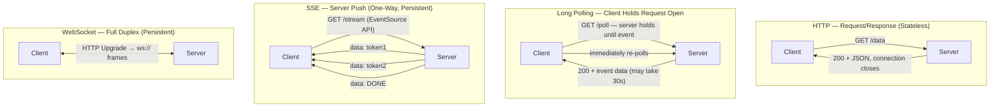
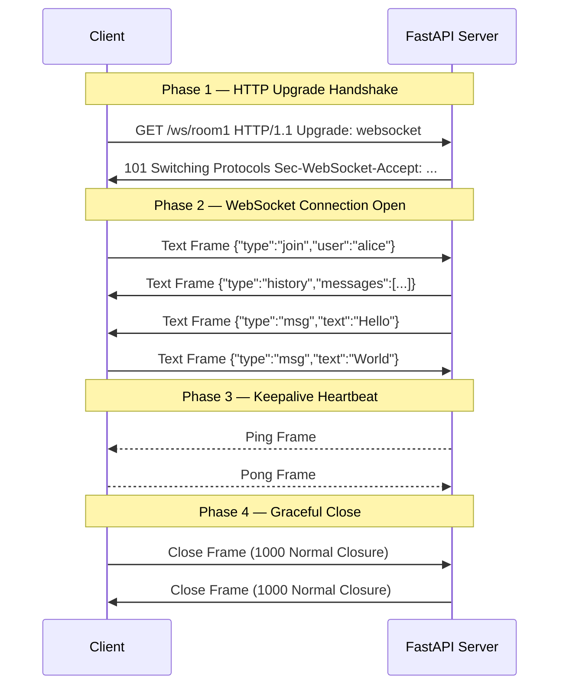
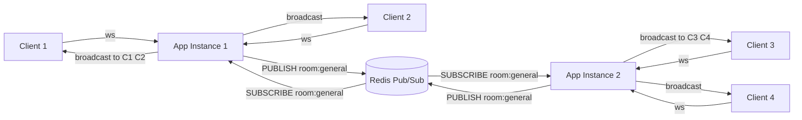

# WebSockets and Real-Time Communication

> [!abstract] TL;DR
> Real-time communication in Python has three main tools — WebSockets (full-duplex, persistent, bidirectional), Server-Sent Events (unidirectional server push, dead simple), and long polling (pure HTTP, stateless, no special protocol) — each with different trade-offs in complexity, scalability, and browser compatibility. FastAPI supports all three natively; scaling WebSockets beyond a single server requires Redis pub/sub to share connection state across instances.

---

## Intuition

**Analogy:** Think of the three protocols as different ways to communicate with a restaurant kitchen after ordering.

- **HTTP request/response** is the classic table-service model: you flag down a waiter, ask a question, wait for an answer, and the interaction ends. Every question requires a new waiter.
- **SSE (Server-Sent Events)** is a live order status board: the kitchen posts updates to a shared screen and you watch it. You can only read, never send messages back through that channel.
- **WebSocket** is a walkie-talkie with the kitchen: the channel stays open permanently, both sides can talk whenever they want, and either can initiate a conversation.

HTTP's stateless model is perfect for CRUD APIs — there is nothing to hold open. SSE is perfect when you are reading a live feed (LLM token streaming, live logs). WebSocket is necessary only when the client also needs to push messages back in real time (collaborative editing, chat, live gaming).

---

## How It Works

### Core Mechanics

#### Protocol Comparison

| Protocol | Direction | Connection | State | Transport | Best for |
|----------|-----------|------------|-------|-----------|----------|
| HTTP/REST | Client → Server → Client | New per request | Stateless | TCP | CRUD APIs, file uploads |
| Long Polling | Client asks, server holds | Long-lived per poll | Stateless | TCP/HTTP | Simple notifications, fallback |
| SSE | Server → Client only | One persistent HTTP | Stateless server-side | TCP/HTTP | Live feeds, token streaming |
| WebSocket | Full duplex | Persistent after upgrade | Stateful on server | TCP (after upgrade) | Chat, collab editing, gaming |

#### WebSocket Protocol Internals

A WebSocket connection begins as a standard HTTP/1.1 request. The client signals it wants to upgrade:

```
GET /ws HTTP/1.1
Host: api.example.com
Upgrade: websocket
Connection: Upgrade
Sec-WebSocket-Key: dGhlIHNhbXBsZSBub25jZQ==
Sec-WebSocket-Version: 13
```

The server validates the `Sec-WebSocket-Key` (SHA-1 hash + base64 encode with a magic GUID), and if it accepts:

```
HTTP/1.1 101 Switching Protocols
Upgrade: websocket
Connection: Upgrade
Sec-WebSocket-Accept: s3pPLMBiTxaQ9kYGzzhZRbK+xOo=
```

The TCP connection is now a WebSocket channel. Both sides can send **frames** at any time:
- **Text frames** — UTF-8 encoded strings (JSON is common)
- **Binary frames** — raw bytes (images, audio, protobuf)
- **Ping/Pong frames** — keepalive heartbeat; server sends Ping, client replies Pong automatically (most libraries handle this)
- **Close frame** — graceful shutdown with a 2-byte status code (1000 = normal, 1001 = going away, 1008 = policy violation, 1011 = server error)

**URL scheme:** `ws://` for unencrypted (port 80 default), `wss://` for TLS (port 443 default). Always use `wss://` in production — `ws://` traffic can be intercepted and firewalls that do deep packet inspection often block non-TLS websocket upgrades on non-standard ports.

---

### Flow / Architecture

#### Diagram 1 — Protocol Comparison



#### Diagram 2 — WebSocket Connection Lifecycle



#### Diagram 3 — Multi-Instance WebSocket Scaling with Redis Pub/Sub



Without Redis, a message from Client 1 (on Instance 1) never reaches Client 3 (on Instance 2). Redis pub/sub is the standard solution: every instance subscribes to the relevant Redis channel, and publishes to Redis instead of broadcasting locally. Redis then fans out to all subscribers.

---

## Code Demo

### 1. FastAPI Chat Server — ConnectionManager with Room Support and Redis Pub/Sub Scaling

```python
# pip install fastapi uvicorn redis websockets
import asyncio
import json
import redis.asyncio as aioredis
from fastapi import FastAPI, WebSocket, WebSocketDisconnect
from fastapi.websockets import WebSocketState

app = FastAPI()

# Redis pool — shared across all connections in this process
redis_client = aioredis.from_url("redis://localhost:6379", decode_responses=True)


class ConnectionManager:
    """Manages per-room WebSocket connections on a single app instance."""

    def __init__(self) -> None:
        # room_id -> [WebSocket, ...]
        self.rooms: dict[str, list[WebSocket]] = {}
        self._lock = asyncio.Lock()

    async def connect(self, websocket: WebSocket, room_id: str) -> None:
        await websocket.accept()
        async with self._lock:
            self.rooms.setdefault(room_id, []).append(websocket)

    async def disconnect(self, websocket: WebSocket, room_id: str) -> None:
        async with self._lock:
            if room_id in self.rooms:
                self.rooms[room_id] = [
                    ws for ws in self.rooms[room_id] if ws is not websocket
                ]
                if not self.rooms[room_id]:
                    del self.rooms[room_id]

    async def local_broadcast(self, message: str, room_id: str) -> None:
        """Send to all connections on THIS instance for this room."""
        async with self._lock:
            connections = list(self.rooms.get(room_id, []))
        dead: list[WebSocket] = []
        for ws in connections:
            try:
                if ws.client_state == WebSocketState.CONNECTED:
                    await ws.send_text(message)
            except Exception:
                dead.append(ws)
        for ws in dead:
            await self.disconnect(ws, room_id)


manager = ConnectionManager()


async def redis_subscriber(room_id: str, websocket: WebSocket) -> None:
    """
    Background task: subscribe to the Redis channel for this room and
    push every published message down this WebSocket connection.
    """
    channel = f"room:{room_id}"
    pubsub = redis_client.pubsub()
    await pubsub.subscribe(channel)
    try:
        async for raw in pubsub.listen():
            if raw["type"] != "message":
                continue
            if websocket.client_state != WebSocketState.CONNECTED:
                break
            await websocket.send_text(raw["data"])
    finally:
        await pubsub.unsubscribe(channel)
        await pubsub.aclose()


@app.websocket("/ws/{room_id}/{client_id}")
async def chat_endpoint(
    websocket: WebSocket,
    room_id: str,
    client_id: str,
) -> None:
    await manager.connect(websocket, room_id)

    # Each connection gets its own Redis subscriber task
    sub_task = asyncio.create_task(redis_subscriber(room_id, websocket))

    join_msg = json.dumps({"type": "join", "client_id": client_id, "room": room_id})
    await redis_client.publish(f"room:{room_id}", join_msg)

    try:
        while True:
            data = await websocket.receive_text()
            payload = json.dumps({
                "type": "message",
                "client_id": client_id,
                "room": room_id,
                "text": data,
            })
            # Publish to Redis — all instances (including this one) will receive it
            await redis_client.publish(f"room:{room_id}", payload)
    except WebSocketDisconnect:
        pass
    finally:
        sub_task.cancel()
        await manager.disconnect(websocket, room_id)
        leave_msg = json.dumps({"type": "leave", "client_id": client_id})
        await redis_client.publish(f"room:{room_id}", leave_msg)
```

### 2. SSE Endpoint for LLM Token Streaming

```python
# Server-Sent Events — unidirectional, ideal for token streaming from LLMs
import asyncio
import json
from typing import AsyncGenerator
from fastapi import FastAPI
from fastapi.responses import StreamingResponse

app = FastAPI()


async def fake_llm_stream(prompt: str) -> AsyncGenerator[str, None]:
    """Simulates autoregressive token generation. Replace with openai/anthropic SDK call."""
    tokens = f"Thinking about: {prompt}. The answer involves multiple layers.".split()
    for token in tokens:
        yield token + " "
        await asyncio.sleep(0.08)  # simulate per-token latency (~100ms/token)


async def sse_event_stream(prompt: str) -> AsyncGenerator[str, None]:
    """Wraps an async token generator in SSE wire format."""
    async for token in fake_llm_stream(prompt):
        # SSE format: each event is "data: <content>\n\n"
        # The double newline is the event delimiter — critical, do not omit
        yield f"data: {json.dumps({'token': token})}\n\n"
    # OpenAI-style termination sentinel — client checks for [DONE]
    yield "data: [DONE]\n\n"


@app.get("/stream")
async def stream_llm_response(prompt: str = "explain websockets") -> StreamingResponse:
    return StreamingResponse(
        sse_event_stream(prompt),
        media_type="text/event-stream",
        headers={
            "Cache-Control": "no-cache",
            "Connection": "keep-alive",
            # Tell nginx NOT to buffer this response — critical for SSE through proxies
            "X-Accel-Buffering": "no",
        },
    )


# Browser-side JavaScript equivalent:
# const es = new EventSource('/stream?prompt=hello');
# es.onmessage = (e) => {
#   if (e.data === '[DONE]') { es.close(); return; }
#   const { token } = JSON.parse(e.data);
#   document.body.innerText += token;
# };
```

### 3. WebSocket with JWT Authentication via Query Parameter and Dependency

```python
# JWT auth in WebSockets — cannot use Authorization header (no standard WS support)
# Options: (a) query param ?token=JWT, (b) first message after connect
import jwt
from fastapi import FastAPI, WebSocket, WebSocketDisconnect, Query, status, Depends
from fastapi.websockets import WebSocketState

app = FastAPI()
SECRET_KEY = "replace-this-with-env-var-in-production"
ALGORITHM = "HS256"


def get_current_user_from_token(token: str) -> dict:
    """Raises ValueError if token is invalid or expired."""
    try:
        payload = jwt.decode(token, SECRET_KEY, algorithms=[ALGORITHM])
        return payload
    except jwt.ExpiredSignatureError:
        raise ValueError("Token has expired")
    except jwt.InvalidTokenError:
        raise ValueError("Token is invalid")


@app.websocket("/ws/secure")
async def secure_websocket(
    websocket: WebSocket,
    token: str = Query(..., description="JWT bearer token"),
) -> None:
    # Validate BEFORE accepting — an unaccepted WebSocket returns 403 automatically
    try:
        user = get_current_user_from_token(token)
    except ValueError:
        # WS_1008_POLICY_VIOLATION is the correct close code for auth failures
        await websocket.close(code=status.WS_1008_POLICY_VIOLATION)
        return

    await websocket.accept()
    user_id: str = user.get("sub", "unknown")
    await websocket.send_json({"type": "auth_ok", "user_id": user_id})

    try:
        while True:
            data = await websocket.receive_json()
            # Echo back with auth context attached
            await websocket.send_json({
                "echo": data,
                "from_user": user_id,
            })
    except WebSocketDisconnect:
        pass


# Alternative — cookie-based auth (browser sends cookies automatically in WS upgrade):
# @app.websocket("/ws/cookie-auth")
# async def cookie_ws(websocket: WebSocket):
#     session_id = websocket.cookies.get("session_id")
#     if not session_id or not validate_session(session_id):
#         await websocket.close(code=status.WS_1008_POLICY_VIOLATION)
#         return
#     await websocket.accept()
#     ...
```

### 4. `websockets` Library Client with Exponential Backoff Reconnection

```python
# pip install websockets
import asyncio
import json
import websockets
from websockets.exceptions import ConnectionClosed


async def reliable_ws_client(uri: str, client_id: str) -> None:
    """
    Production-grade WebSocket client:
    - Reconnects on unexpected disconnect with exponential backoff
    - Exits cleanly on server-initiated normal close (code 1000)
    """
    backoff = 1.0   # seconds, doubles on each failure
    max_backoff = 60.0

    while True:
        try:
            async with websockets.connect(
                uri,
                additional_headers={"X-Client-ID": client_id},
                ping_interval=20,   # send Ping every 20s to detect dead connections
                ping_timeout=10,    # raise ConnectionClosed if no Pong within 10s
                open_timeout=5,     # raise OSError if handshake takes > 5s
            ) as ws:
                print(f"[{client_id}] Connected to {uri}")
                backoff = 1.0  # reset on successful connect

                await ws.send(json.dumps({"type": "hello", "client_id": client_id}))

                async for raw_message in ws:
                    msg = json.loads(raw_message)
                    print(f"[{client_id}] Received: {msg}")
                    # Insert your message handling logic here

        except ConnectionClosed as exc:
            if exc.rcvd is not None and exc.rcvd.code == 1000:
                print(f"[{client_id}] Server closed normally. Exiting.")
                break  # Normal closure — do not reconnect
            print(f"[{client_id}] Connection lost (code={getattr(exc.rcvd, 'code', '?')}). "
                  f"Reconnecting in {backoff:.0f}s...")

        except OSError as exc:
            print(f"[{client_id}] Cannot reach server: {exc}. Retrying in {backoff:.0f}s...")

        await asyncio.sleep(backoff)
        backoff = min(backoff * 2, max_backoff)  # exponential backoff with ceiling


asyncio.run(reliable_ws_client("ws://localhost:8000/ws/general/client_1", "client_1"))
```

---

## Real-World Example

> **Example — OpenAI ChatGPT and Claude.ai token streaming:** Both use Server-Sent Events (not WebSockets) for streaming assistant responses. The server returns `Content-Type: text/event-stream` and pushes one `data: {...}` event per token as the model generates output. The client uses the `EventSource` API (or `fetch` with `ReadableStream` for POST requests, since `EventSource` only supports GET). This choice is deliberate: SSE is unidirectional (the user has already sent their message via a separate POST), proxy-friendly, and simpler to debug than WebSocket. Only if you need real-time bidirectional interaction (voice-to-voice, real-time collaborative documents) would you reach for WebSocket. Slack's real-time message delivery, by contrast, uses WebSocket — every typing indicator, presence update, and message delivery is pushed over a persistent connection that each Slack client maintains.

---

## Trade-offs

### WebSocket vs SSE vs Long Polling

| Aspect | WebSocket | SSE | Long Polling |
|--------|-----------|-----|--------------|
| Directionality | Full-duplex | Server → Client only | Client-initiated |
| Protocol complexity | High (upgrade, framing, opcodes) | Low (plain HTTP streaming) | Lowest (plain HTTP) |
| Browser support | Excellent (all modern browsers) | Excellent, built-in `EventSource` | Universal |
| Proxy compatibility | Can be blocked by HTTP proxies | Works through all HTTP proxies | Works everywhere |
| Reconnection | Manual (library or custom) | Automatic with `Last-Event-ID` | Automatic (client re-requests) |
| HTTP/2 support | Separate stream (RFC 8441) | Native multiplexing | Native |
| Horizontal scaling | Hard — stateful, needs Redis pub/sub | Easier — stateless server side | Easy — stateless |
| Use case | Chat, gaming, collaborative editing | LLM streaming, live dashboards, notifications | Simple notifications, legacy support |

### Redis Pub/Sub vs Redis Streams for WebSocket Scaling

| Aspect | Redis Pub/Sub | Redis Streams |
|--------|--------------|---------------|
| Delivery guarantee | At-most-once (fire and forget) | At-least-once (consumer groups) |
| Message history | None (missed = gone) | Persistent with configurable retention |
| Latency | Sub-millisecond | ~1ms |
| Consumer groups | Not supported | Built-in |
| Best for | Live feeds where missing a message is tolerable | Chat history replay, audit logs |

### socket.io vs Raw WebSocket

| Aspect | socket.io | Raw WebSocket (fastapi / websockets) |
|--------|-----------|--------------------------------------|
| Rooms and namespaces | Built-in | Implement manually (ConnectionManager) |
| Automatic reconnection | Built-in | Implement manually |
| Fallback (SSE, polling) | Built-in transport negotiation | Not provided |
| Binary support | Yes | Yes |
| Protocol overhead | Higher (socket.io framing on top) | Minimal |
| JavaScript ecosystem | Dominant in Node.js world | Standard browser `WebSocket` API |
| Python server support | `python-socketio` with ASGI adapter | FastAPI/Starlette native |

---

## When to Use vs Avoid

**Use WebSocket when:**
- The client needs to send messages to the server in real time (chat messages, game moves, collaborative edits).
- Latency between a client event and a server reaction must be <100ms (live cursors, gaming).
- You are building a multiplayer or presence system where the server must track active connections.

**Use SSE when:**
- Data only flows server → client (LLM token streaming, live log tailing, stock tickers, progress bars).
- You want the simplest possible implementation with automatic reconnection built into the browser.
- Your infra has HTTP/2 (multiple SSE streams share one connection without the 6-connection browser limit).

**Use Long Polling when:**
- You need real-time-ish notifications but cannot run a persistent connection (strict firewall, load balancer with short idle timeouts).
- Simplicity matters more than efficiency (small number of clients, infrequent events).
- WebSocket support is blocked by a corporate proxy and SSE also fails.

**Avoid WebSocket when:**
- The interaction is request-response only — adding WebSocket complexity buys nothing.
- Your deployment is behind a CDN or HTTP proxy that does not support WebSocket upgrades.
- You have thousands of idle connections but rare actual messages — SSE or long polling wastes fewer resources in that pattern.

---

## Common Pitfalls

- **Forgetting `await websocket.accept()`** — FastAPI does not auto-accept WebSocket connections. Calling `send_text()` before `accept()` raises a `RuntimeError` immediately. Always `accept()` first (or reject with `close()` if auth fails before accepting).

- **Not handling `WebSocketDisconnect`** — If you read from a closed WebSocket without a try/except, the exception propagates unhandled and the connection is never removed from your `ConnectionManager`. The `active_connections` list grows forever until the process runs out of memory or file descriptors. Every `receive_*()` call must be wrapped.

- **WebSocket behind nginx without `proxy_read_timeout`** — Nginx's default `proxy_read_timeout` is 60 seconds. An idle WebSocket with no traffic for 60 seconds gets a 502 and is closed by nginx, even if the client and server are fine. Set `proxy_read_timeout 3600s;` and add a ping/pong heartbeat in your application to keep connections alive.

- **Sticky sessions without Redis** — In a multi-instance deployment, a load balancer sends different WebSocket connections to different instances. Without Redis pub/sub, a message sent from one instance only reaches clients connected to that same instance. Either configure sticky sessions at the load balancer (session affinity by cookie/IP) or use Redis pub/sub so all instances share the broadcast.

- **SSE blocked by HTTP/1.1 browser connection limits** — HTTP/1.1 allows max 6 connections per origin per browser. Each SSE `EventSource` uses one connection permanently. With 6+ tabs, new SSE streams are blocked. The fix is HTTP/2, which multiplexes all streams over one connection. Ensure your nginx/Caddy/ALB has HTTP/2 enabled when deploying SSE at scale.

- **JWT in query param visible in server logs** — `ws://api.example.com/ws?token=eyJ...` logs the full token in nginx access logs, load balancer logs, and anywhere else URLs are recorded. Prefer cookie-based auth (browser sends `Cookie` header automatically in the upgrade request) or send the JWT in the first WebSocket message after `accept()` and validate it before processing any further messages.

- **Blocking the asyncio event loop inside a WebSocket handler** — `time.sleep()`, synchronous DB calls, or CPU-heavy computation inside an `async def` WebSocket handler blocks all other connections on that event loop. Use `await asyncio.sleep()`, `asyncio.get_event_loop().run_in_executor()` for blocking calls, or `asyncio.to_thread()` for CPU-bound work.

---

## SSE Wire Format Reference

```
# SSE response Content-Type: text/event-stream
# Each "event" is terminated by a blank line (\n\n)

# Simple data event
data: {"token": "Hello"}\n
\n

# Named event (client listens with es.addEventListener('update', ...))
event: update\n
data: {"value": 42}\n
\n

# Event with ID (used by browser for Last-Event-ID reconnect header)
id: 1001\n
data: {"msg": "checkpoint"}\n
\n

# Retry hint — tell browser to wait 5s before reconnecting
retry: 5000\n
\n
```

---

## Long Polling Pattern

```python
import asyncio
from fastapi import FastAPI

app = FastAPI()

# Simulated in-memory event queue per topic; in production use Redis or a DB
_pending: dict[str, asyncio.Event] = {}
_latest: dict[str, str] = {}

@app.post("/events/{topic}")
async def publish_event(topic: str, data: str) -> dict:
    _latest[topic] = data
    if topic in _pending:
        _pending[topic].set()  # wake up any waiting pollers
    return {"published": True}

@app.get("/poll/{topic}")
async def long_poll(topic: str, timeout: float = 30.0) -> dict:
    """Client calls this; server holds the request until an event arrives or timeout."""
    if topic not in _pending:
        _pending[topic] = asyncio.Event()

    event = _pending[topic]
    event.clear()

    try:
        # asyncio.wait_for raises asyncio.TimeoutError after `timeout` seconds
        await asyncio.wait_for(event.wait(), timeout=timeout)
        return {"event": _latest.get(topic), "status": "ok"}
    except asyncio.TimeoutError:
        # Return empty — client immediately re-polls
        return {"event": None, "status": "timeout"}
```

---

## Testing WebSockets in FastAPI

```python
# pytest + httpx (TestClient supports WebSocket connections synchronously)
from fastapi.testclient import TestClient
from fastapi import FastAPI, WebSocket, WebSocketDisconnect

app = FastAPI()

@app.websocket("/ws/echo")
async def echo(websocket: WebSocket) -> None:
    await websocket.accept()
    try:
        while True:
            msg = await websocket.receive_text()
            await websocket.send_text(f"echo: {msg}")
    except WebSocketDisconnect:
        pass

def test_echo_websocket() -> None:
    client = TestClient(app)
    with client.websocket_connect("/ws/echo") as ws:
        ws.send_text("hello")
        response = ws.receive_text()
        assert response == "echo: hello"

        ws.send_text("world")
        response = ws.receive_text()
        assert response == "echo: world"
    # Exiting the context manager sends a close frame automatically
```

---

## Related Concepts

- [[FastAPI_for_ML]] — FastAPI's lifespan, Pydantic validation, and async request handling that underpin WebSocket endpoint design
- [[Concurrency_in_Python]] — asyncio event loop mechanics, `asyncio.Lock`, and `asyncio.create_task` that power non-blocking WebSocket handlers
- [[Generators_and_Iterators]] — async generators (`async def ... yield`) are the foundation of SSE streaming responses in FastAPI
- [[REST_API_Design]] — contrasts with WebSocket: when REST's stateless request-response model is sufficient and preferable
- [[Streaming_Responses]] — LLM token streaming over SSE — the primary production use case for SSE in AI applications
- [[LLM_Application_Architecture]] — system-level view of where WebSocket/SSE fits in an end-to-end AI application stack
- [[Real_Time_vs_Batch_Inference]] — broader pattern of when real-time connections are worth the operational complexity

---

## Review Questions

1. **WebSocket scaling with Redis pub/sub** — You deploy a chat app on three app instances behind a load balancer. Without any shared state, why does a message sent by Client A (connected to Instance 1) fail to reach Client B (connected to Instance 3)? Describe in detail how Redis pub/sub solves this. What delivery guarantee does Redis pub/sub provide, and when would you prefer Redis Streams instead?

2. **SSE vs WebSocket for LLM token streaming** — A product manager asks you to add real-time token streaming to a chatbot UI. The user types a message, submits it via a form, and the response streams back word by word. Would you use SSE or WebSocket? Justify your choice based on directionality, implementation complexity, proxy compatibility, and scaling characteristics.

3. **JWT authentication in WebSocket handshake** — A colleague proposes putting the JWT in the `Authorization: Bearer <token>` header of the WebSocket upgrade request. Why will this fail in browsers? What are the two viable alternatives, and what is the security risk of putting the token in the query string? Which approach would you choose for a production deployment and why?

4. **`WebSocketDisconnect` handling requirement** — A teammate writes a FastAPI WebSocket endpoint that calls `await websocket.receive_text()` in a loop but does not wrap it in a try/except. The app works fine in testing. What will happen in production when a client closes their browser tab? How does the missing exception handler lead to a resource leak, and what is the correct fix?

---

## Sources

- [FastAPI WebSockets Documentation](https://fastapi.tiangolo.com/advanced/websockets/)
- [MDN — WebSocket API](https://developer.mozilla.org/en-US/docs/Web/API/WebSocket)
- [MDN — Server-Sent Events](https://developer.mozilla.org/en-US/docs/Web/API/Server-sent_events/Using_server-sent_events)
- [RFC 6455 — The WebSocket Protocol](https://www.rfc-editor.org/rfc/rfc6455)
- [websockets Python Library Documentation](https://websockets.readthedocs.io/)
- [redis-py asyncio documentation](https://redis-py.readthedocs.io/en/stable/examples/asyncio_examples.html)

---

#python #websockets #real-time #sse #fastapi #backend #async
