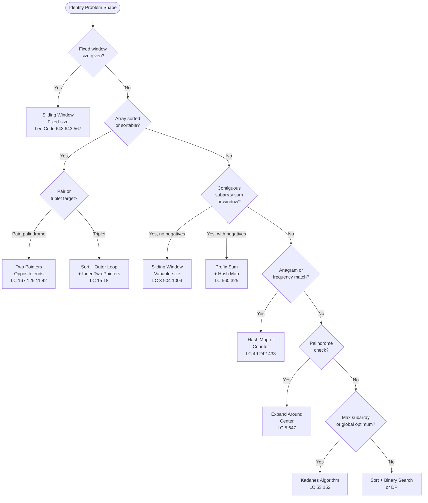

# Arrays and Strings — DSA Patterns in Python

> [!abstract] TL;DR
> Arrays and strings are the foundation of almost every coding interview. Mastering five patterns — two pointers, sliding window, prefix sum, hash map frequency, and expand-around-center — converts the vast majority of O(n²) brute-force problems into O(n) solutions.

---

## Intuition

**Analogy:** Think of a long train platform with passengers waiting at each spot. A brute-force approach means every conductor walks from one end, checking every possible range — O(n²) total walks. Smarter patterns are like conductors who maintain a window view, a running tally, or a map of who they have already seen — so they only walk the platform once.

The five core patterns are each optimized for a specific structural property of the problem: sorted order, a contiguous constraint, a target sum, a frequency requirement, or a symmetry check.

---

## Pattern Decision Tree



---

## Core Concepts

### 1. Python List Internals for Arrays

Python `list` is a **dynamic array** — a contiguous block of pointers to objects in heap memory.

**Over-allocation strategy:** When the backing array is full, Python allocates roughly 1.125x the required space (the growth factor varies but averages ~12.5% extra), then copies all pointers. This makes `append()` O(1) **amortized** — the occasional O(n) resize is spread over n operations.

```
Capacity growth: 0 → 4 → 8 → 16 → 25 → 35 → 46 → ...
```

| Operation | Time | Notes |
|-----------|------|-------|
| `lst.append(x)` | O(1) amortized | Occasional O(n) resize |
| `lst.insert(0, x)` | O(n) | Shifts all elements right |
| `lst.pop()` | O(1) | Removes from tail |
| `lst.pop(0)` | O(n) | Shifts all elements left |
| `lst[i]` | O(1) | Direct pointer offset |
| `lst[a:b]` | O(b-a) | Creates a **new** list (copy) |
| `lst[::-1]` | O(n) | Returns a **new** reversed list |
| `del lst[i]` | O(n) | Shifts elements after i |
| `x in lst` | O(n) | Linear scan; use `set` for O(1) |

> [!warning] Slicing copies
> `lst[a:b]` does NOT return a view. Every slice allocates new memory and copies k pointers. For algorithms that only need index bounds, always pass `(left, right)` indices rather than slicing.

**`array.array` for typed arrays:** When you need a homogeneous numeric array with C-level memory layout (e.g., for interfacing with C extensions), use `array.array('i', [1,2,3])`. Each element is stored directly (4 bytes for `'i'`), not as a Python object pointer. For ML workloads, prefer NumPy arrays instead.

```python
import array
# Typed array: 'i' = signed int, 'd' = double
typed = array.array('i', [1, 2, 3, 4, 5])
# Memory: 5 * 4 = 20 bytes vs list's 5 pointers + 5 int objects
```

---

### 2. Two-Pointer Technique

Two pointers maintain two index variables that traverse the array. The structural requirement determines which variant to use.

#### Opposite-End Pointers (requires sorted or symmetric structure)

Both start at opposite ends and converge. The decision of which pointer to move is driven by the problem's invariant.

**Classic problems:** Two-Sum in sorted array, Valid Palindrome, Container With Most Water, Trapping Rain Water.

**Convergence rule for pair-sum:** `arr[L] + arr[R] < target` → move L right (need larger); `> target` → move R left (need smaller). This works only because the array is sorted.

#### Same-Direction Pointers (in-place overwrite)

`slow` tracks the next write position; `fast` scans every element. When `fast` finds a valid element, write it at `slow` and advance both.

**Classic problems:** Remove Duplicates, Move Zeros, Merge Sorted Arrays In-Place.

#### Three Pointers (Dutch National Flag)

Sort an array of 0s, 1s, and 2s in a single pass using three regions:
- `[0, low-1]` → all 0s
- `[low, mid-1]` → all 1s
- `[high+1, n-1]` → all 2s
- `[mid, high]` → unsorted frontier

```python
def sort_colors(nums: list[int]) -> None:
    """Dutch National Flag — LeetCode 75. Sorts in-place, O(n) time O(1) space."""
    low, mid, high = 0, 0, len(nums) - 1
    while mid <= high:
        if nums[mid] == 0:
            nums[low], nums[mid] = nums[mid], nums[low]
            low += 1
            mid += 1
        elif nums[mid] == 1:
            mid += 1          # already in correct region
        else:                 # nums[mid] == 2
            nums[mid], nums[high] = nums[high], nums[mid]
            high -= 1         # do NOT increment mid: swapped value unexamined
```

---

### 3. Sliding Window

A window defined by `[left, right]` slides over the array. The window state (sum, frequency map) is updated incrementally — each element enters the window once and leaves at most once, giving O(n) total.

#### Fixed-Size Window

Move `right` one step, drop `left` one step (both advance together). Window size is always exactly k.

```
window_sum += arr[right] - arr[right - k]   # O(1) update
```

#### Variable-Size Window (Expand and Shrink)

```
Maximize (longest):   expand right → update answer → if violated → shrink left
Minimize (shortest):  expand right → if satisfied → shrink left → update answer
```

The key insight: **shrink with a `while` loop, never `if`** — one shrink step may not restore validity.

#### Monotonic Deque for Window Maximum

For "maximum element in every window of size k" (LeetCode 239), maintain a `collections.deque` of indices in **decreasing** order of `arr[i]`. The front of the deque is always the index of the current maximum.

```python
from collections import deque

def max_sliding_window(nums: list[int], k: int) -> list[int]:
    """
    Sliding window maximum using a monotonic deque.
    Time: O(n)  Space: O(k)
    """
    dq: deque[int] = deque()   # stores indices, front = max index
    result: list[int] = []

    for i, val in enumerate(nums):
        # Remove indices outside the window
        while dq and dq[0] < i - k + 1:
            dq.popleft()
        # Maintain decreasing order: pop smaller elements from back
        while dq and nums[dq[-1]] < val:
            dq.pop()
        dq.append(i)
        # Window is full once i >= k-1
        if i >= k - 1:
            result.append(nums[dq[0]])

    return result
```

---

### 4. Prefix Sums

Build once in O(n), answer any range query in O(1).

#### 1D Prefix Sum

```
prefix[0] = 0
prefix[i] = prefix[i-1] + nums[i-1]   (1-indexed, size n+1)

range_sum(l, r) = prefix[r+1] - prefix[l]   (0-indexed l, r in nums)
```

#### Prefix Sum + Hash Map: Subarray Sum Equals K

Instead of the O(n²) nested loop, track how many times each prefix sum has appeared. If `prefix[j] - prefix[i] == k`, then the subarray `nums[i..j-1]` sums to k.

Key insight: `count += seen[prefix - k]` — asking "how many earlier prefixes were exactly `k` less than the current prefix?"

#### 2D Prefix Sum (Matrix Range Queries)

```
P[i][j] = P[i-1][j] + P[i][j-1] - P[i-1][j-1] + matrix[i-1][j-1]

region_sum(r1,c1,r2,c2) = P[r2+1][c2+1] - P[r1][c2+1] - P[r2+1][c1] + P[r1][c1]
```

#### Prefix XOR for Range XOR Queries

Same pattern but with XOR: `xor[i] = xor[i-1] ^ nums[i-1]`. Range XOR of `[l, r]` = `xor[r+1] ^ xor[l]` (XOR cancels itself: `a ^ a = 0`).

---

### 5. Hash Map Patterns

| Problem | Key | Value | Query |
|---------|-----|-------|-------|
| Two Sum | `num` | index | `target - num in seen` |
| Subarray Sum = k | `prefix` | count | `prefix - k in seen` |
| Group Anagrams | `sorted(word)` | list of words | bucket by key |
| Longest subarray sum = k | `prefix` | earliest index | `prefix - k in seen` |
| Contains Duplicate within k distance | `num` | last seen index | `i - seen[num] <= k` |

**`Counter` for frequency:** `collections.Counter(s)` builds a frequency map in O(n). `Counter` subtraction floors at zero — `Counter({'a': 1}) - Counter({'a': 3})` gives `Counter()`, not `{'a': -2}`. Use explicit arithmetic when you need negative counts.

**`defaultdict` for grouping:**

```python
from collections import defaultdict

def group_anagrams(strs: list[str]) -> list[list[str]]:
    """Group strings that are anagrams of each other. Time: O(n * k log k)"""
    groups: defaultdict[str, list[str]] = defaultdict(list)
    for word in strs:
        key = "".join(sorted(word))   # sorted chars = canonical anagram key
        groups[key].append(word)
    return list(groups.values())
```

**Seen-set for O(1) membership:** When you only need existence (not count or index), use a `set`. `x in some_set` is O(1) vs O(n) for a list.

---

### 6. String Manipulation in Python

**Immutability:** Python strings are immutable — every `str + str` creates a new string. In a loop of n concatenations this is O(n²) total work.

```python
# BAD: O(n²) — each += copies all previous characters
result = ""
for ch in chars:
    result += ch

# GOOD: O(n) — join builds the string once from a list
result = "".join(chars)
```

**Essential string methods:**

| Method | Time | Notes |
|--------|------|-------|
| `s.split(sep)` | O(n) | Returns a new list |
| `sep.join(lst)` | O(n) | O(n) total chars written, not O(n²) |
| `s.strip()` | O(n) | Removes leading/trailing whitespace |
| `s.lower()` / `s.upper()` | O(n) | Returns new string |
| `s.count(sub)` | O(n*m) | Non-overlapping occurrences |
| `s.find(sub)` | O(n*m) | Returns -1 if not found |
| `s.replace(old, new)` | O(n) | Returns new string |
| `s.translate(table)` | O(n) | Fastest for char-by-char mapping |

**`str.translate` + `str.maketrans` for character mapping/deletion:**

```python
# Remove all non-alphanumeric characters efficiently
import string
table = str.maketrans("", "", string.punctuation + string.whitespace)
cleaned = s.translate(table)

# Map characters
table2 = str.maketrans("aeiou", "AEIOU")
result = "hello world".translate(table2)  # "hEllO wOrld"
```

**`ord()` and `chr()` for character arithmetic:**

```python
# Frequency array for lowercase letters (26 slots)
freq = [0] * 26
for ch in s:
    freq[ord(ch) - ord('a')] += 1

# Reconstruct char from index
ch = chr(ord('a') + idx)
```

**`re` module basics:**

```python
import re
re.findall(r'\w+', s)      # all words
re.sub(r'[^a-zA-Z0-9]', '', s)  # remove non-alphanumeric
re.split(r'\s+', s)        # split on any whitespace
```

---

### 7. Palindrome Patterns

#### Expand Around Center

For **Longest Palindromic Substring** (LeetCode 5), treat each character (odd-length) and each gap between characters (even-length) as a potential center. Expand outward as long as characters match.

Time: O(n²) worst case, O(1) space — better constant than brute force O(n³).

#### Two-Pointer Palindrome Check

```python
def is_palindrome(s: str) -> bool:
    left, right = 0, len(s) - 1
    while left < right:
        if s[left] != s[right]:
            return False
        left += 1
        right -= 1
    return True
```

#### Manacher's Algorithm

Reduces longest palindromic substring to O(n) time by reusing previously computed palindrome radii. The key observation: if we are inside a known palindrome, mirror the left side's result for the right side. See [[Manacher_Algorithm]] for the full derivation.

---

### 8. Sorting-Based Array Tricks

| Trick | Complexity | Use Case |
|-------|------------|----------|
| Sort then binary search | O(n log n + log n) | "Does X exist?" after setup |
| `sorted(key=lambda x: ...)` | O(n log n) | Custom comparator in Python 3 |
| Counting sort | O(n + k) | Bounded integers (e.g., chars, 0–1000) |
| Sort + two pointers | O(n log n + n) | 3Sum, 4Sum |
| `arr.sort()` vs `sorted(arr)` | Both O(n log n) | `sort()` in-place; `sorted()` returns new |

**Counting sort for bounded integers** — ideal when character frequency determines the answer:

```python
def is_anagram(s: str, t: str) -> bool:
    if len(s) != len(t):
        return False
    count = [0] * 26
    for a, b in zip(s, t):
        count[ord(a) - 97] += 1
        count[ord(b) - 97] -= 1
    return all(c == 0 for c in count)
```

**Next permutation algorithm** (LeetCode 31):
1. Find the rightmost index `i` where `nums[i] < nums[i+1]` (the "descent point").
2. Find the rightmost index `j` where `nums[j] > nums[i]` (the smallest value larger than `nums[i]`).
3. Swap `nums[i]` and `nums[j]`.
4. Reverse the suffix `nums[i+1:]` to get the next smallest order.

---

### 9. Common LeetCode Patterns

| Pattern | Core Idea | Key Problem |
|---------|-----------|-------------|
| **Kadane's Algorithm** | Local max ends here vs start fresh | Max Subarray (LC 53) |
| **Boyer-Moore Voting** | Cancel out votes; survivor is majority | Majority Element (LC 169) |
| **Floyd's Cycle (Array)** | Treat values as pointers; find cycle | Find Duplicate (LC 287) |
| **Next Permutation** | Rightmost descent + swap + reverse suffix | Next Permutation (LC 31) |
| **Product Except Self** | Prefix products * suffix products, no division | Product Except Self (LC 238) |

**Boyer-Moore Voting:** Maintain a `candidate` and `count`. When count hits 0, the current element becomes the new candidate. Any element appearing more than n/2 times will survive all cancellations.

```python
def majority_element(nums: list[int]) -> int:
    candidate, count = nums[0], 1
    for num in nums[1:]:
        if count == 0:
            candidate = num
        count += (1 if num == candidate else -1)
    return candidate  # guaranteed exists by problem constraints
```

---

## Code Demo

```python
from collections import Counter, defaultdict
from typing import Optional

# ─────────────────────────────────────────────────────────────────────────────
# 1. MINIMUM WINDOW SUBSTRING (LeetCode 76)
#    Variable sliding window + Counter
#    Time: O(|s| + |t|)  Space: O(|t|)
# ─────────────────────────────────────────────────────────────────────────────
def min_window(s: str, t: str) -> str:
    if not s or not t:
        return ""

    need = Counter(t)          # how many of each char we still need
    have: dict[str, int] = {}  # counts in current window
    formed = 0                 # number of chars whose need is fully satisfied
    required = len(need)       # distinct chars we must satisfy

    left = 0
    best_len = float("inf")
    best_l = best_r = 0

    for right, ch in enumerate(s):
        # --- EXPAND: add s[right] into window ---
        have[ch] = have.get(ch, 0) + 1
        if ch in need and have[ch] == need[ch]:
            formed += 1        # this char's requirement just met exactly

        # --- SHRINK: while window is valid, try to minimize it ---
        while formed == required:
            window_len = right - left + 1
            if window_len < best_len:
                best_len = window_len
                best_l, best_r = left, right

            # Remove s[left] from window
            left_ch = s[left]
            have[left_ch] -= 1
            if left_ch in need and have[left_ch] < need[left_ch]:
                formed -= 1    # window is no longer valid for this char
            left += 1

    return s[best_l : best_r + 1] if best_len != float("inf") else ""


# ─────────────────────────────────────────────────────────────────────────────
# 2. PRODUCT OF ARRAY EXCEPT SELF (LeetCode 238)
#    No division. Prefix product array * suffix product array.
#    Time: O(n)  Space: O(1) output array only (per problem constraints)
# ─────────────────────────────────────────────────────────────────────────────
def product_except_self(nums: list[int]) -> list[int]:
    n = len(nums)
    result = [1] * n

    # First pass: result[i] = product of all elements to the LEFT of i
    prefix = 1
    for i in range(n):
        result[i] = prefix
        prefix *= nums[i]

    # Second pass: multiply by product of all elements to the RIGHT of i
    suffix = 1
    for i in range(n - 1, -1, -1):
        result[i] *= suffix
        suffix *= nums[i]

    return result


# ─────────────────────────────────────────────────────────────────────────────
# 3. LONGEST PALINDROMIC SUBSTRING (LeetCode 5)
#    Expand around center for both odd and even length palindromes.
#    Time: O(n²)  Space: O(1)
# ─────────────────────────────────────────────────────────────────────────────
def longest_palindrome(s: str) -> str:
    if not s:
        return ""

    def expand(left: int, right: int) -> tuple[int, int]:
        """Expand outward while characters match. Returns (start, end) inclusive."""
        while left >= 0 and right < len(s) and s[left] == s[right]:
            left -= 1
            right += 1
        # When loop breaks, s[left] != s[right], so valid palindrome is [left+1, right-1]
        return left + 1, right - 1

    best_start, best_end = 0, 0

    for i in range(len(s)):
        # Odd-length palindrome centered at s[i]
        l, r = expand(i, i)
        if r - l > best_end - best_start:
            best_start, best_end = l, r

        # Even-length palindrome centered between s[i] and s[i+1]
        l, r = expand(i, i + 1)
        if r - l > best_end - best_start:
            best_start, best_end = l, r

    return s[best_start : best_end + 1]


# ─────────────────────────────────────────────────────────────────────────────
# 4. SUBARRAY SUM EQUALS K (LeetCode 560)
#    Prefix sum + hash map. Handles negative numbers.
#    Time: O(n)  Space: O(n)
# ─────────────────────────────────────────────────────────────────────────────
def subarray_sum(nums: list[int], k: int) -> int:
    # seen[prefix] = number of times this prefix sum has appeared so far
    seen: dict[int, int] = {0: 1}   # empty prefix (before index 0) has sum 0
    prefix = 0
    count = 0

    for num in nums:
        prefix += num
        # If (prefix - k) appeared before, those subarrays ending here sum to k
        count += seen.get(prefix - k, 0)
        seen[prefix] = seen.get(prefix, 0) + 1

    return count


# ─────────────────────────────────────────────────────────────────────────────
# QUICK TESTS
# ─────────────────────────────────────────────────────────────────────────────
if __name__ == "__main__":
    assert min_window("ADOBECODEBANC", "ABC") == "BANC"
    assert min_window("a", "a") == "a"
    assert min_window("a", "aa") == ""

    assert product_except_self([1, 2, 3, 4]) == [24, 12, 8, 6]
    assert product_except_self([-1, 1, 0, -3, 3]) == [0, 0, 9, 0, 0]

    assert longest_palindrome("babad") in ("bab", "aba")
    assert longest_palindrome("cbbd") == "bb"
    assert longest_palindrome("a") == "a"

    assert subarray_sum([1, 1, 1], 2) == 2
    assert subarray_sum([1, 2, 3], 3) == 2
    assert subarray_sum([-1, -1, 1], 0) == 1

    print("All tests passed.")
```

---

## Real-World Example

> **Example — Redis `GETRANGE` / `SETRANGE` commands:** Redis strings are backed by a Simple Dynamic String (SDS) — a C struct that tracks length and allocated capacity separately, using the same over-allocation strategy as Python lists. This means `APPEND` operations are O(1) amortized. The design mirrors exactly how Python list internals work: store current length, allocated capacity, and a contiguous buffer. GETRANGE implements a sliding-window-style read in O(k) where k is the requested byte length, not O(n) of the total string.

---

## Trade-offs

| Technique | Best Fit | Space | Sorted Required? | Handles Negatives? |
|-----------|----------|-------|------------------|--------------------|
| Two Pointers (opposite ends) | Pair/triplet sum, palindrome, water | O(1) | Yes (for sum problems) | No |
| Two Pointers (same direction) | In-place filter, remove duplicates | O(1) | No | N/A |
| Sliding Window (fixed) | Subarray of fixed size k | O(1) | No | Yes |
| Sliding Window (variable) | Longest/shortest subarray | O(k) with hash map | No | Only if positive |
| Prefix Sum + Hash Map | Subarray sum = k, range queries | O(n) | No | Yes |
| Hash Map (Counter) | Anagram, frequency, two-sum | O(n) | No | Yes |
| Expand Around Center | Palindromic substrings | O(1) | No | N/A |
| Deque (monotonic) | Sliding window maximum | O(k) | No | Yes |

**`list` vs `deque` for sliding window maximum:**

| | `list` with manual tracking | `collections.deque` |
|-|-----------------------------|---------------------|
| Push/pop from left | O(n) — shifts all elements | O(1) amortized |
| Push/pop from right | O(1) amortized | O(1) amortized |
| Index access | O(1) | O(n) — not a random access structure |
| Use when | Simple two-pointer windows | Monotonic deque patterns |

Use `deque` whenever you need fast removal from both ends (sliding window maximum). Use `list` for everything else.

---

## When to Use vs Avoid

**Use Two Pointers when:**
- The array is sorted or you can sort it (O(n log n) overhead is acceptable).
- You need O(1) extra space (in-place constraint).
- The problem involves pairs, triplets, or contiguous blocks.

**Avoid Two Pointers when:**
- The array contains negative numbers and you need a subarray sum target (use prefix sum instead).
- The problem is non-contiguous or requires skipping elements.

**Use Sliding Window when:**
- The problem explicitly involves a **contiguous** subarray or substring.
- All elements are non-negative (required for variable window shrink correctness).
- You need the longest or shortest window satisfying a condition.

**Avoid Sliding Window when:**
- Elements can be negative and you have a sum target — the window cannot simply shrink when the sum exceeds the target.
- The optimal answer is non-contiguous.

**Use Prefix Sum + Hash Map when:**
- You need subarray sum queries with negative numbers.
- You need O(1) range sum after O(n) preprocessing.
- You need to count subarrays satisfying a sum condition.

---

## Common Pitfalls

- **Off-by-one in window boundaries** — window size is `right - left + 1`, not `right - left`. Forgetting the `+1` causes silent wrong answers in minimum-length problems. Always validate with a length-1 window.

- **Modifying a list while iterating** — `for x in lst: lst.remove(x)` skips elements because `remove()` shifts indices. Use index-based loops or build a new list: `[x for x in lst if condition]`.

- **`str + str` in a loop is O(n²)** — each concatenation copies all previous characters. Replace with `"".join(parts)` where `parts` is built via `append()` in a list. This is O(n) total.

- **Forgetting to handle empty input** — `min_window("", "ABC")`, `longest_palindrome("")`, `subarray_sum([], 0)` all need guards. Check `if not s` at the top of every function.

- **`Counter` subtraction floors at 0** — `Counter({'a': 1}) - Counter({'a': 5})` returns `Counter()` (empty), not `Counter({'a': -4})`. If you need to track deficit (how many chars are still missing), maintain explicit `need` and `have` dicts and check `have[ch] == need[ch]` to avoid this pitfall.

- **Using `if` instead of `while` to shrink the window** — a single shrink step may not restore validity. The shrink phase must be a `while` loop: `while formed == required: shrink and update`.

- **Variable sliding window with negative numbers** — shrinking when `window_sum > target` is invalid if negatives are present (a later negative element could bring the sum back down). Switch to prefix sum + hash map for those cases.

- **Forgetting `seen = {0: 1}` in prefix sum + hash map** — the empty prefix has sum 0. Without this initialization, subarrays that start at index 0 and sum to k are never counted.

---

## Related Concepts

- [[Two_Pointers]] — the core opposite-ends and same-direction patterns that underlie most array problems
- [[Sliding_Window]] — dedicated note covering fixed and variable windows with implementation templates
- [[Prefix_Sum]] — 1D/2D prefix sum, difference arrays, and range XOR queries
- [[Kadane_Algorithm]] — maximum subarray sum; the canonical "reset or extend" DP pattern
- [[Hash_Table_Patterns]] — frequency maps, two-sum, grouping, and seen-set patterns
- [[String_Fundamentals]] — deeper dive into string algorithms (KMP, Rabin-Karp, Z-algorithm)
- [[Manacher_Algorithm]] — O(n) longest palindromic substring; extends expand-around-center
- [[Deque]] — `collections.deque` internals and why it is O(1) at both ends
- [[Monotonic_Stack]] — monotonic deque for window max is a related monotonic structure
- [[Fast_Slow_Pointers]] — the same-direction two-pointer variant specialized for linked lists and cycle detection
- [[Counting_Sort]] — O(n+k) sort for bounded integers; useful for anagram checks and frequency problems
- [[Python_for_ML]] — Python performance internals: GIL, vectorization, and when to leave Python for NumPy

---

## Review Questions

1. **The variable sliding window shrinks when a constraint is violated. Why must the shrink step use a `while` loop rather than a single `if`? Construct a counterexample — an input and window constraint — where using `if` gives the wrong answer.**

2. **You have an array of integers (possibly negative). You want all subarrays with sum exactly equal to k. Explain why sliding window fails here, and trace through how the prefix-sum + hash map approach finds the count in O(n) time. What does `seen = {0: 1}` represent physically?**

3. **Two-pointer pair-sum on a sorted array runs in O(n) without a hash map. The unsorted two-sum problem requires either O(n) space (hash map) or O(n log n) time (sort first + two pointers). Which property of the sorted array makes the O(n) time O(1) space solution possible — and why does that property disappear when the array is unsorted?**

4. **Python strings are immutable. You are asked to build a result string character-by-character inside a loop of n iterations. Two colleagues propose: (a) `result += char` each iteration, and (b) `parts.append(char)` then `"".join(parts)` at the end. Analyze the time complexity of each approach. At what n does the difference become practically significant in Python?**

---

## Sources

- [LeetCode — Array and String Explore Card](https://leetcode.com/explore/learn/card/array-and-string/)
- [Python Time Complexity — Python Wiki](https://wiki.python.org/moin/TimeComplexity)
- [Python list implementation — Laurent Luce's Blog](http://www.laurentluce.com/posts/python-list-implementation/)
- [NeetCode — Arrays & Hashing Playlist](https://neetcode.io/roadmap)
- Grokking the Coding Interview — Sliding Window and Two Pointers chapters

---

#dsa #arrays #strings #two-pointers #sliding-window #python #leetcode
