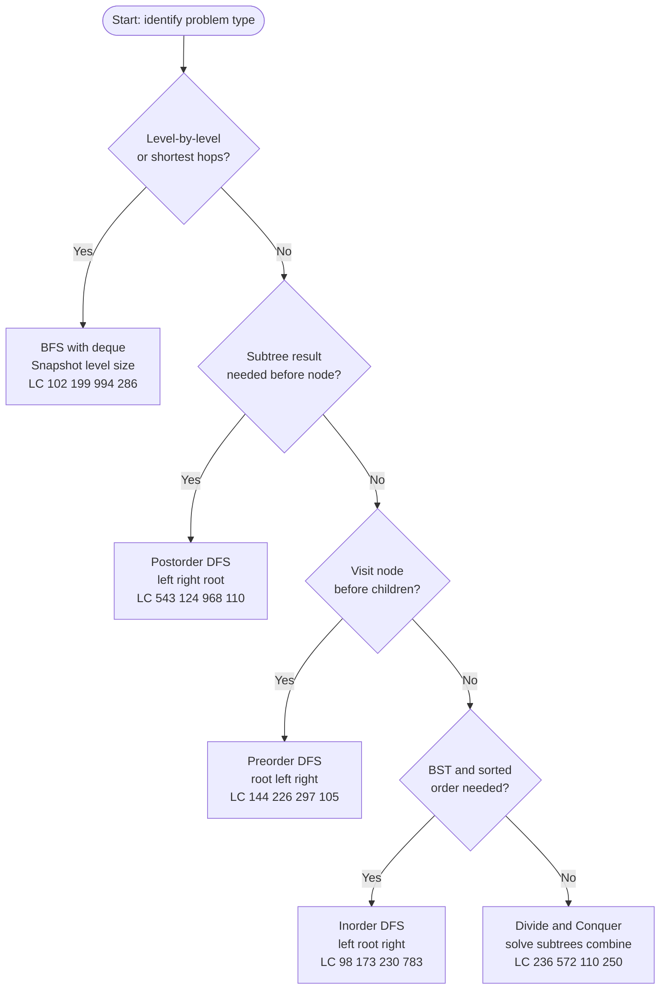

# Binary Trees and BSTs — DSA Patterns in Python

> [!abstract] TL;DR
> Binary trees are hierarchical structures where each node has at most two children; mastering four traversal orders (preorder, inorder, postorder, BFS) and the recursive "solve left, solve right, combine at root" pattern unlocks 90% of tree interview problems, while the BST invariant (left < root < right) enables O(h) search, insert, and delete.

---

## Intuition

**Analogy:** Imagine auditing a company org chart. The CEO sits at the root; every manager has at most two direct reports. There are four audit strategies:
- **Preorder** — announce each manager before diving into their team. Used when making a copy (root must exist before children) or serializing the tree.
- **Inorder** — fully audit the left team, then announce the manager, then audit the right team. In a BST, this produces employees listed by salary in sorted ascending order.
- **Postorder** — fully audit both teams before evaluating the manager. Used when a manager's performance score depends on their team's totals (diameter, subtree sum, LCA).
- **BFS** — audit the entire C-suite before any VP, then all VPs before any director. Natural for "level N employees" and shortest-path-in-unweighted-tree problems.

The recursive mental model: **assume the function already works for smaller trees.** At each node, ask "what do I need from my left subtree?" and "what do I need from my right subtree?" — the recursion fills in the rest.

---

## Pattern Decision Tree



---

## How It Works

### 1. TreeNode Class

The standard interview definition used by every LeetCode tree problem.

```python
from collections import deque
from typing import Optional

class TreeNode:
    def __init__(self, val: int = 0, left: 'TreeNode' = None, right: 'TreeNode' = None):
        self.val = val
        self.left = left
        self.right = right

    def __repr__(self) -> str:
        return f"TreeNode({self.val})"


def build_from_level_order(vals: list) -> Optional[TreeNode]:
    """
    Build a tree from LeetCode's level-order (BFS) array format.
    None in the list means a missing node — children of None are skipped.
    Example: [4, 2, 6, 1, 3, 5, 7] builds a complete BST.
    """
    if not vals or vals[0] is None:
        return None
    root = TreeNode(vals[0])
    q = deque([root])
    i = 1
    while q and i < len(vals):
        node = q.popleft()
        if i < len(vals) and vals[i] is not None:
            node.left = TreeNode(vals[i])
            q.append(node.left)
        i += 1
        if i < len(vals) and vals[i] is not None:
            node.right = TreeNode(vals[i])
            q.append(node.right)
        i += 1
    return root


def height(root: Optional[TreeNode]) -> int:
    """Number of edges on the longest root-to-leaf path. Empty tree = -1."""
    if not root:
        return -1
    return 1 + max(height(root.left), height(root.right))


def size(root: Optional[TreeNode]) -> int:
    """Total node count."""
    if not root:
        return 0
    return 1 + size(root.left) + size(root.right)


tree = build_from_level_order([4, 2, 6, 1, 3, 5, 7])
print(height(tree))   # 2
print(size(tree))     # 7
```

---

### 2. DFS Traversals — Recursive

Three return-value styles for different calling contexts.

```python
# ── Style 1: Return a new list (readable, fine for interviews) ────────────
def preorder(root: Optional[TreeNode]) -> list:
    """root → left → right. Use for: copy tree, serialize."""
    if not root:
        return []
    return [root.val] + preorder(root.left) + preorder(root.right)

def inorder(root: Optional[TreeNode]) -> list:
    """left → root → right. Inorder of a BST yields a sorted sequence."""
    if not root:
        return []
    return inorder(root.left) + [root.val] + inorder(root.right)

def postorder(root: Optional[TreeNode]) -> list:
    """left → right → root. Use for: delete tree, evaluate subtrees first."""
    if not root:
        return []
    return postorder(root.left) + postorder(root.right) + [root.val]


# ── Style 2: Pass list as parameter (avoids O(n²) list concatenation) ─────
def inorder_accum(root: Optional[TreeNode], result: list = None) -> list:
    if result is None:
        result = []
    if root:
        inorder_accum(root.left, result)
        result.append(root.val)
        inorder_accum(root.right, result)
    return result


# ── Style 3: nonlocal for a single mutable scalar ─────────────────────────
def find_node(root: Optional[TreeNode], target: int) -> Optional[TreeNode]:
    found = None
    def dfs(node: Optional[TreeNode]) -> None:
        nonlocal found
        if not node or found:
            return
        if node.val == target:
            found = node
            return
        dfs(node.left)
        dfs(node.right)
    dfs(root)
    return found


tree = build_from_level_order([4, 2, 6, 1, 3, 5, 7])
print(inorder(tree))      # [1, 2, 3, 4, 5, 6, 7]  — sorted because it is a BST
print(preorder(tree))     # [4, 2, 1, 3, 6, 5, 7]
print(postorder(tree))    # [1, 3, 2, 5, 7, 6, 4]
```

---

### 3. DFS Traversals — Iterative

Iterative DFS avoids Python's default recursion limit (~1000 frames) for skewed trees.

```python
def preorder_iter(root: Optional[TreeNode]) -> list:
    """Push right before left so left is popped first (LIFO mirrors recursion)."""
    if not root:
        return []
    result, stack = [], [root]
    while stack:
        node = stack.pop()
        result.append(node.val)
        if node.right:
            stack.append(node.right)   # pushed first → popped second
        if node.left:
            stack.append(node.left)    # pushed second → popped first
    return result


def inorder_iter(root: Optional[TreeNode]) -> list:
    """Dive left as far as possible, process, switch to right subtree."""
    result, stack, curr = [], [], root
    while curr or stack:
        while curr:                    # descend to leftmost node
            stack.append(curr)
            curr = curr.left
        curr = stack.pop()             # backtrack
        result.append(curr.val)        # process
        curr = curr.right              # now explore right subtree
    return result


def postorder_iter(root: Optional[TreeNode]) -> list:
    """
    Two-stack trick: simulate reverse-postorder (root → right → left)
    by pushing LEFT before RIGHT. Reverse the accumulated list at the end.
    """
    if not root:
        return []
    stack, result = [root], []
    while stack:
        node = stack.pop()
        result.append(node.val)        # collects root → right → left
        if node.left:
            stack.append(node.left)    # left pushed before right
        if node.right:
            stack.append(node.right)   # right popped first
    return result[::-1]                # reverse → left → right → root = postorder


tree = build_from_level_order([4, 2, 6, 1, 3, 5, 7])
print(preorder_iter(tree))    # [4, 2, 1, 3, 6, 5, 7]
print(inorder_iter(tree))     # [1, 2, 3, 4, 5, 6, 7]
print(postorder_iter(tree))   # [1, 3, 2, 5, 7, 6, 4]
```

> [!tip] Morris Inorder — O(1) Space
> Morris traversal threads the tree temporarily: for `curr`, find its inorder predecessor (rightmost node of `curr.left`). If predecessor.right is None, thread it to `curr` and go left. If it already points to `curr`, unthread it, visit `curr`, go right. No stack, no recursion — O(N) time, O(1) space. Useful when an interviewer demands constant extra space.

---

### 4. BFS / Level-Order Traversal

Snapshot `len(q)` at the start of each iteration to separate level boundaries cleanly.

```python
def level_order(root: Optional[TreeNode]) -> list:
    """LeetCode 102. Returns list of levels, each level is a list of values."""
    if not root:
        return []
    result, q = [], deque([root])
    while q:
        level_size = len(q)            # snapshot before expanding
        level = []
        for _ in range(level_size):
            node = q.popleft()
            level.append(node.val)
            if node.left:
                q.append(node.left)
            if node.right:
                q.append(node.right)
        result.append(level)
    return result


def right_side_view(root: Optional[TreeNode]) -> list:
    """LeetCode 199. Last node dequeued at each level = rightmost visible."""
    result, q = [], deque([root]) if root else deque()
    while q:
        for _ in range(len(q)):
            node = q.popleft()
            if node.left:
                q.append(node.left)
            if node.right:
                q.append(node.right)
        result.append(node.val)        # node is the last dequeued at this level
    return result


def avg_of_levels(root: Optional[TreeNode]) -> list:
    """LeetCode 637."""
    result, q = [], deque([root]) if root else deque()
    while q:
        level_size = len(q)
        level_sum = 0
        for _ in range(level_size):
            node = q.popleft()
            level_sum += node.val
            if node.left:
                q.append(node.left)
            if node.right:
                q.append(node.right)
        result.append(level_sum / level_size)
    return result


tree = build_from_level_order([3, 9, 20, None, None, 15, 7])
print(level_order(tree))      # [[3], [9, 20], [15, 7]]
print(right_side_view(tree))  # [3, 20, 7]
print(avg_of_levels(tree))    # [3.0, 14.5, 11.0]
```

---

### 5. Tree Recursion Patterns

The key question at every node: **"What should this function return for a subtree, and how do I combine left and right?"**

```python
# ── Diameter (LeetCode 543) ────────────────────────────────────────────────
# Diameter = longest path between any two nodes (path need not pass through root).
# At each node: candidate = depth(left) + depth(right).
# RETURN depth to parent; TRACK diameter separately — these are different values.

def diameter_of_binary_tree(root: Optional[TreeNode]) -> int:
    max_diameter = [0]   # list so the nested function can mutate it

    def depth(node: Optional[TreeNode]) -> int:
        if not node:
            return 0
        l = depth(node.left)
        r = depth(node.right)
        max_diameter[0] = max(max_diameter[0], l + r)  # path bends here
        return 1 + max(l, r)                            # single arm to parent

    depth(root)
    return max_diameter[0]


# ── Path Sum (LeetCode 112) ────────────────────────────────────────────────
def has_path_sum(root: Optional[TreeNode], target: int) -> bool:
    if not root:
        return False
    if not root.left and not root.right:       # leaf node
        return root.val == target
    return (has_path_sum(root.left,  target - root.val) or
            has_path_sum(root.right, target - root.val))


# ── Path Sum II — Backtracking (LeetCode 113) ─────────────────────────────
def path_sum_II(root: Optional[TreeNode], target: int) -> list:
    """Collect ALL root-to-leaf paths summing to target. Classic backtracking."""
    result, path = [], []

    def dfs(node: Optional[TreeNode], remaining: int) -> None:
        if not node:
            return
        path.append(node.val)
        if not node.left and not node.right and remaining == node.val:
            result.append(path[:])         # snapshot — never append the live list
        dfs(node.left,  remaining - node.val)
        dfs(node.right, remaining - node.val)
        path.pop()                         # backtrack

    dfs(root, target)
    return result


t = build_from_level_order([5, 4, 8, 11, None, 13, 4, 7, 2, None, None, None, 1])
print(has_path_sum(t, 22))    # True  (5 → 4 → 11 → 2)
print(path_sum_II(t, 22))     # [[5, 4, 11, 2]]
print(diameter_of_binary_tree(build_from_level_order([1, 2, 3, 4, 5])))  # 3
```

---

### 6. BST Operations

All operations are O(h): O(log n) on balanced trees, O(n) worst case on degenerate (sorted-input) trees.

```python
# ── Search O(h) ───────────────────────────────────────────────────────────
def bst_search(root: Optional[TreeNode], val: int) -> Optional[TreeNode]:
    if not root or root.val == val:
        return root
    return bst_search(root.left if val < root.val else root.right, val)


# ── Insert O(h) ───────────────────────────────────────────────────────────
def bst_insert(root: Optional[TreeNode], val: int) -> TreeNode:
    if not root:
        return TreeNode(val)
    if val < root.val:
        root.left = bst_insert(root.left, val)
    elif val > root.val:
        root.right = bst_insert(root.right, val)
    return root   # duplicate values are ignored


# ── Delete O(h) — three cases ─────────────────────────────────────────────
def _inorder_successor(node: TreeNode) -> TreeNode:
    """Leftmost node in right subtree = smallest value greater than node."""
    node = node.right
    while node.left:
        node = node.left
    return node

def bst_delete(root: Optional[TreeNode], val: int) -> Optional[TreeNode]:
    if not root:
        return None
    if val < root.val:
        root.left  = bst_delete(root.left,  val)
    elif val > root.val:
        root.right = bst_delete(root.right, val)
    else:
        # Case 1 & 2: leaf or one child — return the surviving child (or None)
        if not root.left:
            return root.right
        if not root.right:
            return root.left
        # Case 3: two children
        # Replace value with inorder successor's value, then delete successor
        # from the RIGHT subtree only (not the full tree — avoids O(n) and bugs).
        successor = _inorder_successor(root)
        root.val   = successor.val
        root.right = bst_delete(root.right, successor.val)
    return root


# ── Validity Check O(n) ───────────────────────────────────────────────────
def is_valid_bst(root: Optional[TreeNode],
                 lo: float = float('-inf'),
                 hi: float = float('inf')) -> bool:
    """
    Pass valid range DOWN the tree. Checking only immediate children is
    insufficient — descendants must also respect ancestor constraints.
    """
    if not root:
        return True
    if not (lo < root.val < hi):
        return False
    return (is_valid_bst(root.left,  lo, root.val) and
            is_valid_bst(root.right, root.val, hi))


# ── Kth Smallest (LeetCode 230) O(h + k) ─────────────────────────────────
def kth_smallest(root: Optional[TreeNode], k: int) -> int:
    """Inorder gives sorted order; stop the moment the counter reaches k."""
    count, result = [0], [None]

    def inorder_walk(node: Optional[TreeNode]) -> None:
        if not node or result[0] is not None:
            return
        inorder_walk(node.left)
        count[0] += 1
        if count[0] == k:
            result[0] = node.val
            return
        inorder_walk(node.right)

    inorder_walk(root)
    return result[0]


bst = build_from_level_order([5, 3, 6, 2, 4, None, None, 1])
print(is_valid_bst(bst))      # True
print(kth_smallest(bst, 3))   # 3
bst = bst_delete(bst, 3)      # delete node with two children
print(inorder(bst))           # [1, 2, 4, 5, 6]
```

---

### 7. Tree Construction

**Preorder + inorder (LeetCode 105):** `preorder[0]` is always the root. Its position in `inorder` splits the array into left and right subtrees. A hash map gives O(1) lookup, making the whole reconstruction O(n). See **Demo 4** for the complete implementation.

**Postorder + inorder (LeetCode 106):** `postorder[-1]` is the root. Same split logic; recursion boundaries shift accordingly — included in Demo 4 as a bonus.

**Serialize / deserialize:** Preorder DFS with `"#"` for null nodes uniquely encodes the tree because the root-first structure determines the tree unambiguously during decoding. BFS serialization (LeetCode's own format) is more readable and also lossless. See **Demo 2**.

---

### 8. LCA — Lowest Common Ancestor

**BST LCA (LeetCode 235):** Use the BST ordering to navigate without visiting every node. If both `p` and `q` are less than `root.val`, the LCA is in the left subtree. If both are greater, it is in the right subtree. The first node where values split (or one equals root) is the LCA. O(H) time, O(1) extra space.

**General binary tree LCA (LeetCode 236):** Postorder traversal. At each node, ask "did I find p or q in my left subtree? In my right subtree?" If both sides return non-null, the current node is the LCA. If only one side returns non-null, bubble that result up. O(N) time.

**Distance between two nodes:** `dist(p, q) = depth(p) + depth(q) - 2 * depth(LCA(p, q))`. Precompute all depths in O(N). See **Demo 3** for complete implementations of both LCA variants.

---

### 9. Advanced Tree Patterns

```python
# ── Balanced Binary Tree Check (LeetCode 110) ─────────────────────────────
# Return -1 as a sentinel for "unbalanced" — avoids a second O(n) pass.
def is_balanced(root: Optional[TreeNode]) -> bool:
    def check(node: Optional[TreeNode]) -> int:
        """Returns height if subtree is balanced, -1 otherwise."""
        if not node:
            return 0
        l = check(node.left)
        if l == -1:
            return -1          # short-circuit: already found imbalance
        r = check(node.right)
        if r == -1:
            return -1
        if abs(l - r) > 1:
            return -1          # this node is the imbalance point
        return 1 + max(l, r)
    return check(root) != -1


# ── Count Complete Tree Nodes (LeetCode 222) — O(log² n) ─────────────────
# A complete binary tree is fully filled except possibly the last level.
# If leftmost depth == rightmost depth → perfect subtree with 2^h - 1 nodes.
# Otherwise split and recurse — but only ONE side will be perfect.
def count_nodes(root: Optional[TreeNode]) -> int:
    if not root:
        return 0
    l_node, r_node = root, root
    lh = rh = 0
    while l_node:
        l_node = l_node.left
        lh += 1
    while r_node:
        r_node = r_node.right
        rh += 1
    if lh == rh:               # perfect binary tree: exactly 2^h - 1 nodes
        return (1 << lh) - 1
    return 1 + count_nodes(root.left) + count_nodes(root.right)


print(is_balanced(build_from_level_order([3, 9, 20, None, None, 15, 7])))           # True
print(is_balanced(build_from_level_order([1, 2, 2, 3, 3, None, None, 4, 4])))       # False
print(count_nodes(build_from_level_order([1, 2, 3, 4, 5, 6])))                      # 6
```

---

### 10. Heaps as Trees

A **binary heap** is a complete binary tree stored as an array. No `TreeNode` pointers — the structure is implicit in index arithmetic.

**1-indexed array** (textbook): node at `i` → parent `i // 2`, left `2i`, right `2i + 1`.
**0-indexed array** (Python `heapq`): node at `i` → parent `(i - 1) // 2`, left `2i + 1`, right `2i + 2`.

```python
import heapq

# ── Min-heap: index 0 always holds the smallest element ───────────────────
h = []
heapq.heappush(h, 5)
heapq.heappush(h, 1)
heapq.heappush(h, 3)
print(heapq.heappop(h))     # 1 — O(log n)
print(h[0])                 # 3 — O(1) peek without removing

# ── heapify in-place: O(n) vs n individual heappush calls: O(n log n) ─────
data = [5, 3, 8, 1, 9, 2]
heapq.heapify(data)
print(data[0])              # 1 — valid min-heap in-place

# ── Max-heap: negate values ────────────────────────────────────────────────
max_h = []
for val in [5, 3, 8, 1, 9]:
    heapq.heappush(max_h, -val)
print(-heapq.heappop(max_h))   # 9

# ── kth largest in O(n log k) using a min-heap of size k ──────────────────
def kth_largest(nums: list, k: int) -> int:
    """Min-heap of size k: root is the kth largest seen so far."""
    min_h = nums[:k]
    heapq.heapify(min_h)
    for num in nums[k:]:
        if num > min_h[0]:
            heapq.heapreplace(min_h, num)   # combined pop+push in O(log k)
    return min_h[0]

print(kth_largest([3, 2, 1, 5, 6, 4], 2))  # 5
```

> [!note] Python has no built-in balanced BST
> For production ordered data requiring O(log n) insert/delete/search, use `sortedcontainers.SortedList` (`pip install sortedcontainers`). It handles all the AVL/Red-Black rotation complexity transparently and is accepted on most online judges.

---

## Code Demo

### Demo 1: Maximum Path Sum in Binary Tree (LeetCode 124)

```python
from collections import deque
from typing import Optional

class TreeNode:
    def __init__(self, val=0, left=None, right=None):
        self.val, self.left, self.right = val, left, right

def _build(vals):
    if not vals or vals[0] is None:
        return None
    root = TreeNode(vals[0])
    q = deque([root])
    i = 1
    while q and i < len(vals):
        node = q.popleft()
        if i < len(vals) and vals[i] is not None:
            node.left = TreeNode(vals[i]); q.append(node.left)
        i += 1
        if i < len(vals) and vals[i] is not None:
            node.right = TreeNode(vals[i]); q.append(node.right)
        i += 1
    return root


def max_path_sum(root: Optional[TreeNode]) -> int:
    """
    A path may start and end at any node but travels contiguous edges.
    It can bend at exactly one node (its "apex"), using both the left and
    right arms — but cannot continue upward from that apex to a parent.

    Strategy — postorder:
      gain(node) returns the best single-arm contribution FROM this node.
      Before returning, update the global max using the full bent path:
        left_arm + node.val + right_arm
      Negative arms are pruned with max(0, ...) because including them
      hurts the total.

    Time O(N)  Space O(H)
    """
    max_sum = [float('-inf')]    # list allows mutation inside nested function

    def gain(node: Optional[TreeNode]) -> int:
        if not node:
            return 0
        left_gain  = max(0, gain(node.left))    # cut off negative subtrees
        right_gain = max(0, gain(node.right))
        # Candidate: path bends at this node — uses both arms + current value
        max_sum[0] = max(max_sum[0], node.val + left_gain + right_gain)
        # Only one arm can extend to the parent (cannot bend twice)
        return node.val + max(left_gain, right_gain)

    gain(root)
    return max_sum[0]


# Test 1: expected 42  (path: 15 → 20 → 7)
print(max_path_sum(_build([-10, 9, 20, None, None, 15, 7])))   # 42

# Test 2: expected 6  (path: 2 → 1 → 3)
print(max_path_sum(_build([1, 2, 3])))                          # 6

# Test 3: single negative node — must include it, no other choice
print(max_path_sum(TreeNode(-3)))                               # -3
```

---

### Demo 2: Serialize and Deserialize Binary Tree (LeetCode 297, BFS)

```python
from collections import deque
from typing import Optional

class TreeNode:
    def __init__(self, val=0, left=None, right=None):
        self.val, self.left, self.right = val, left, right

class Codec:
    """
    BFS (level-order) serialization — mirrors LeetCode's own tree format.
    Null children are marked '#'. Children of null nodes are NOT enqueued,
    so trailing '#' tokens are omitted naturally.

    Serialize: BFS the live tree, emit node value or '#' for each slot.
    Deserialize: create root from first token, then for each parent in
                 the queue assign the next two tokens as left and right.

    Time O(N)  Space O(N)
    """

    def serialize(self, root: Optional[TreeNode]) -> str:
        if not root:
            return ""
        tokens, q = [], deque([root])
        while q:
            node = q.popleft()
            if node:
                tokens.append(str(node.val))
                q.append(node.left)     # enqueue even if None to emit '#'
                q.append(node.right)
            else:
                tokens.append("#")
        return ",".join(tokens)

    def deserialize(self, data: str) -> Optional[TreeNode]:
        if not data:
            return None
        vals = data.split(",")
        root = TreeNode(int(vals[0]))
        q = deque([root])
        i = 1
        while q and i < len(vals):
            node = q.popleft()
            if vals[i] != "#":
                node.left = TreeNode(int(vals[i]))
                q.append(node.left)
            i += 1
            if i < len(vals) and vals[i] != "#":
                node.right = TreeNode(int(vals[i]))
                q.append(node.right)
            i += 1
        return root


codec = Codec()

# Build: [1, 2, 3, null, null, 4, 5]
root = TreeNode(1, TreeNode(2), TreeNode(3, TreeNode(4), TreeNode(5)))
encoded = codec.serialize(root)
print(encoded)                          # "1,2,3,#,#,4,5,#,#,#,#"

recovered = codec.deserialize(encoded)
print(codec.serialize(recovered))       # same string — round-trip identity

# Edge cases
print(codec.serialize(None))            # ""
print(codec.deserialize("") is None)    # True
```

---

### Demo 3: Lowest Common Ancestor — BST and General (LeetCode 235, 236)

```python
from typing import Optional

class TreeNode:
    def __init__(self, val=0, left=None, right=None):
        self.val, self.left, self.right = val, left, right


def lca_bst(root: TreeNode, p: TreeNode, q: TreeNode) -> TreeNode:
    """
    LeetCode 235: BST LCA — O(H) time, O(1) space (iterative).

    BST ordering tells us which branch to take:
    - Both p.val and q.val < root.val → LCA is in left subtree.
    - Both > root.val → LCA is in right subtree.
    - Otherwise (values split, or one equals root) → current root IS the LCA.
    """
    while root:
        if p.val < root.val and q.val < root.val:
            root = root.left
        elif p.val > root.val and q.val > root.val:
            root = root.right
        else:
            return root     # split point or exact match


def lca_binary_tree(root: Optional[TreeNode],
                    p: TreeNode,
                    q: TreeNode) -> Optional[TreeNode]:
    """
    LeetCode 236: General binary tree LCA — O(N) time, O(H) space.

    Postorder: propagate found nodes upward.
    Base case: return the node itself if it IS p, q, or None.
    - Both left and right return non-null → this node is the LCA (split point).
    - Only one side returns non-null → both targets are in that subtree; bubble up.

    Correctness: non-null return iff p or q (or both) exist in the subtree.
    The first node where BOTH sides are non-null is the LCA.
    """
    if not root or root is p or root is q:
        return root
    left  = lca_binary_tree(root.left,  p, q)
    right = lca_binary_tree(root.right, p, q)
    if left and right:
        return root           # p in left subtree, q in right subtree
    return left or right      # both in one subtree, or neither found


# Build the test tree manually:
#        6
#       / \
#      2   8
#     / \ / \
#    0  4 7  9
#      / \
#     3   5
n6=TreeNode(6); n2=TreeNode(2); n8=TreeNode(8)
n0=TreeNode(0); n4=TreeNode(4); n7=TreeNode(7); n9=TreeNode(9)
n3=TreeNode(3); n5=TreeNode(5)
n6.left=n2;  n6.right=n8
n2.left=n0;  n2.right=n4
n8.left=n7;  n8.right=n9
n4.left=n3;  n4.right=n5

# BST LCA
print(lca_bst(n6, n2, n8).val)   # 6 — root is the split point
print(lca_bst(n6, n2, n4).val)   # 2 — p is ancestor of q
print(lca_bst(n6, n3, n5).val)   # 4

# General binary tree LCA (same tree, no BST assumptions)
print(lca_binary_tree(n6, n3, n5).val)   # 4
print(lca_binary_tree(n6, n2, n8).val)   # 6
```

---

### Demo 4: Build Tree from Preorder + Inorder (LeetCode 105)

```python
from typing import Optional

class TreeNode:
    def __init__(self, val=0, left=None, right=None):
        self.val, self.left, self.right = val, left, right


def build_tree(preorder: list, inorder: list) -> Optional[TreeNode]:
    """
    Key observations:
    1. preorder[pre_lo] is always the current subtree's root.
    2. Locating that root in inorder splits it into left elements (left of root)
       and right elements (right of root).
    3. left_size = (mid - in_lo) tells us how many nodes are in the left
       subtree — the same count applies to preorder.

    Hash map gives O(1) inorder lookup → O(N) total reconstruction.
    Time O(N)  Space O(N)
    """
    inorder_idx = {val: i for i, val in enumerate(inorder)}

    def helper(pre_lo: int, pre_hi: int, in_lo: int, in_hi: int) -> Optional[TreeNode]:
        if pre_lo > pre_hi:
            return None
        root_val = preorder[pre_lo]
        root = TreeNode(root_val)
        mid = inorder_idx[root_val]        # root's index in inorder array
        left_size = mid - in_lo            # number of nodes in left subtree

        root.left  = helper(
            pre_lo + 1,                    # left subtree: next preorder slot
            pre_lo + left_size,            # left subtree occupies left_size slots
            in_lo,                         # inorder left boundary unchanged
            mid - 1                        # inorder right boundary: root's left
        )
        root.right = helper(
            pre_lo + left_size + 1,        # right subtree: after left subtree
            pre_hi,                        # extends to end of preorder slice
            mid + 1,                       # inorder left boundary: root's right
            in_hi                          # inorder right boundary unchanged
        )
        return root

    return helper(0, len(preorder) - 1, 0, len(inorder) - 1)


# Expected tree:
#       3
#      / \
#     9  20
#        / \
#       15   7
t = build_tree([3, 9, 20, 15, 7], [9, 3, 15, 20, 7])

def _inorder(node):
    return [] if not node else _inorder(node.left) + [node.val] + _inorder(node.right)

print(_inorder(t))          # [9, 3, 15, 20, 7] — matches inorder input
print(t.val)                # 3
print(t.right.val)          # 20
print(t.right.left.val)     # 15


# Bonus: Build from Postorder + Inorder (LeetCode 106)
# postorder[-1] is the root; left_size calculation is identical.
def build_tree_post(postorder: list, inorder: list) -> Optional[TreeNode]:
    inorder_idx = {val: i for i, val in enumerate(inorder)}

    def helper(post_lo: int, post_hi: int, in_lo: int, in_hi: int) -> Optional[TreeNode]:
        if post_lo > post_hi:
            return None
        root_val = postorder[post_hi]
        root = TreeNode(root_val)
        mid = inorder_idx[root_val]
        left_size = mid - in_lo
        root.left  = helper(post_lo,              post_lo + left_size - 1, in_lo,    mid - 1)
        root.right = helper(post_lo + left_size,  post_hi - 1,             mid + 1,  in_hi)
        return root

    return helper(0, len(postorder) - 1, 0, len(inorder) - 1)

t2 = build_tree_post([9, 15, 7, 20, 3], [9, 3, 15, 20, 7])
print(_inorder(t2))         # [9, 3, 15, 20, 7]
```

---

## Real-World Example

> **Example — MySQL B-tree Index and `ORDER BY`:** MySQL's InnoDB storage engine represents every index as a B-tree (a generalization of the binary search tree where each node holds many keys). An `ORDER BY indexed_col` query performs an inorder traversal of the leaf level of the B-tree index, retrieving rows in sorted key order without a sort step — the same principle as BST inorder giving a sorted sequence. Python's `asyncio` event loop uses `heapq` (a binary heap stored as an array) to schedule callbacks by their fire time: `heappush` adds a new timer, `heappop` retrieves the next callback to execute. Huffman compression builds an optimal prefix-free code by repeatedly merging the two lowest-frequency nodes from a min-heap into a binary tree — a direct application of both heaps and tree construction.

---

## Trade-offs

| Aspect | Recursive DFS | Iterative DFS |
|--------|--------------|---------------|
| Readability | Mirrors tree structure naturally | More boilerplate; harder to verify |
| Stack limit | Python default ~1000 frames — `RecursionError` on skewed trees | Explicit stack on heap — no size limit |
| Performance | Function-call overhead per frame | Slightly faster; no frame allocation |
| Postorder | One-liner with recursion | Requires two-stack trick |
| O(1) space inorder | Not possible | Morris traversal threads the tree |

| Aspect | Unbalanced BST | Balanced BST (AVL / Red-Black) | `sortedcontainers.SortedList` |
|--------|---------------|-------------------------------|-------------------------------|
| Search / Insert / Delete | O(log n) avg, O(n) worst | O(log n) guaranteed | O(log n) guaranteed |
| Implementation | ~30 lines | Rotations / color-fixing, 150+ lines | Zero — third-party library |
| Python built-in | No | No | `pip install sortedcontainers` |
| Best for | Random data, teaching | Production ordered data in C++/Java | Production Python |

---

## When to Use vs Avoid

**Use preorder DFS when:**
- Copying or serializing a tree (root must be created before its children).
- Checking if one tree is a subtree of another.
- Generating all root-to-leaf paths.

**Use inorder DFS when:**
- Input is a BST and you need elements in sorted order.
- Validating BST property.
- Finding kth smallest / largest in a BST.

**Use postorder DFS when:**
- A node's result depends on both subtrees being fully evaluated first (diameter, maximum path sum, LCA, height, subtree sums).
- Deleting or freeing a tree (free children before parent).

**Use BFS when:**
- Level-by-level processing: connect nodes at the same level, zigzag traversal, average of levels.
- Shortest hop count in an unweighted tree.
- Serializing in a human-readable format.

**Avoid:**
- Recursive DFS on trees with depth > 1000 without `sys.setrecursionlimit` or an iterative rewrite.
- An unbalanced BST when input arrives in sorted or near-sorted order (degrades to O(n) linked list).
- Checking BST validity by comparing only a node to its immediate children — use the `lo / hi` bound technique.

---

## Common Pitfalls

- **Not guarding against `None` first** — Accessing `node.left` or `node.val` before checking `if not node` raises `AttributeError`. Every recursive helper must start with `if not node: return ...`.

- **BST validity via child comparison only** — `node.val > node.left.val` is necessary but not sufficient. The tree `[5, 1, 4, None, None, 3, 6]` passes child-only checks but fails because 3 < 5 violates the root's right-subtree constraint. Always pass `lo` and `hi` bounds downward.

- **BST delete with two children — wrong recursion target** — A common mistake is calling `bst_delete(root, successor.val)` on the full tree rather than `bst_delete(root.right, successor.val)`. The full-tree call is O(N), may delete the wrong node if duplicates exist, and defeats the purpose of finding the inorder successor.

- **Python recursion limit on deep trees** — The default `sys.getrecursionlimit()` is 1000. A BST built by inserting sorted values has depth N. Either raise the limit with `sys.setrecursionlimit(10**5)` at the top of your solution or convert to iterative. The failure mode is `RecursionError: maximum recursion depth exceeded` with no partial result.

- **Diameter: confusing local depth with global answer** — The depth helper returns `1 + max(l, r)` (single arm) to the parent, but the diameter at this node is `l + r` (both arms). Returning `l + r` to the parent would incorrectly "bend" the path at every node on the way up, which is not a valid tree path.

- **Copying path in Path Sum II** — `result.append(path)` appends a reference to the mutable list. After backtracking, the list is empty, so every entry in `result` becomes `[]`. Always snapshot with `result.append(path[:])`.

---

## Related Concepts

- [[Binary_Tree_Fundamentals]] — Formal definitions of full, complete, perfect, and degenerate trees; height and depth proofs; why complete binary tree height is O(log n).
- [[Binary_Search_Tree]] — BST invariant, average vs worst-case complexity analysis, self-balancing motivation.
- [[Tree_Traversals]] — Formal derivation of all four traversal orders with complexity proofs and non-recursive formulations.
- [[AVL_Tree]] — Height-balanced BST using rotations; guarantees O(log n) height; the principle behind why unbalanced BSTs degrade.
- [[Binary_Heap]] — Complete binary tree stored as an array; parent/child index arithmetic; O(n) heapify proof.
- [[Priority_Queue]] — Abstract data type built on a binary heap; powers Dijkstra, event simulation, and Python's `asyncio` scheduler.
- [[Recursion_Fundamentals]] — Call-stack mechanics, recurrence relations, and the formal model behind all recursive DFS implementations.
- [[Backtracking]] — DFS with explicit state restoration; Path Sum II and word search are canonical backtracking-on-tree problems.
- [[DP_on_Trees]] — Tree DP and the rerooting technique; diameter, maximum independent set on trees, and subtree aggregation queries.
- [[Stack]] — The explicit LIFO structure that powers iterative DFS; understanding it explains why right-before-left push order produces preorder output.
- [[Deque]] — Powers BFS level-order traversal; `popleft()` in O(1) vs `list.pop(0)` in O(n) — always use `collections.deque` for BFS.
- [[Python_Collections]] — Python's `collections.deque` for BFS and `heapq` for priority queues — the concrete implementations used throughout tree algorithms.
- [[Graphs]] — Trees are acyclic connected graphs; BFS and DFS on trees are graph traversal without the visited-set overhead.
- [[Decision_Trees]] — ML decision trees use recursive binary splitting; Gini impurity or information gain replaces the BST ordering criterion.

---

## Review Questions

1. **LCA logic:** In `lca_binary_tree`, the function returns a node immediately when `root is p` or `root is q` — without searching deeper — even though the other target node might be a descendant of the returned node. Explain why this is correct. What property of the LCA definition guarantees that returning early here cannot miss the true LCA?

2. **Inorder and BST:** Why does inorder traversal of any BST yield values in strictly ascending order? Prove it by induction on tree height using only the BST invariant. How would you exploit this property to validate a BST without passing explicit `lo / hi` bounds — what are the trade-offs of that approach?

3. **Diameter: global vs local max:** The diameter algorithm returns `1 + max(l, r)` to the parent but stores `l + r` in the global maximum. Why can these not be the same value? Construct a three-node example (root with two leaves) and trace through both values to show what would go wrong if you returned `l + r` to the parent.

4. **Serialize/Deserialize format choice:** Preorder DFS serialization with `"#"` for null nodes (`"1,2,#,#,3,#,#"`) uniquely reconstructs the tree. BFS serialization must include internal null markers but can drop trailing ones. Why does preorder + null markers uniquely determine the tree structure, while BFS without any null markers does not? What information is captured by the preorder null markers that BFS omits?

---

## Sources

- [LeetCode Tree Problems Tag](https://leetcode.com/tag/tree/)
- [LeetCode Binary Search Tree Tag](https://leetcode.com/tag/binary-search-tree/)
- [Python `heapq` Documentation](https://docs.python.org/3/library/heapq.html)
- [CP-Algorithms — Lowest Common Ancestor](https://cp-algorithms.com/graph/lca.html)
- [sortedcontainers Documentation](http://www.grantjenks.com/docs/sortedcontainers/)
- [Neetcode Trees Playlist](https://neetcode.io/roadmap)

---

#dsa #binary-trees #bst #traversal #recursion #python #leetcode
