# Bit Manipulation — DSA Patterns in Python

> [!abstract] TL;DR
> Bit manipulation treats integers as arrays of boolean flags, enabling O(1) set/clear/toggle operations, XOR-based identity tricks, and bitmask DP that compresses exponential state into a single integer — all without any library imports.

---

## Intuition

**Analogy:** Imagine a row of 64 light switches in a fuse box. A regular integer is just the decimal reading on a meter. Bit manipulation is reaching directly into the fuse box and flipping individual switches — instantly setting, clearing, or testing any one of them with a single hand gesture, regardless of what the others are doing.

Each bit is an independent boolean flag. Because all 64 switches live inside one CPU register, you can flip all of them simultaneously in a single clock cycle — something no loop over a Python list can match.

---

## How It Works

### Core Mechanics

**1. Python integers have arbitrary precision.** There is no 32-bit or 64-bit limit. `1 << 1000` works without overflow. The bit representation of a positive integer matches its binary value exactly. Negative integers use two's complement conceptually: `-1` looks like `...11111111` (infinite leading 1s), which is why `~0 == -1`.

**2. Inspecting bits:**
- `bin(n)` → `'0b1010'` (string); `oct(n)` → `'0o12'`; `hex(n)` → `'0xa'`
- `0b1010`, `0o12`, `0xFF` are valid integer literals
- `n.bit_length()` → minimum bits needed to represent n (no leading zeros)
- `(-1).bit_length()` → `1` (Python treats negative bit_length as the magnitude)

**3. Bitwise operators (in precedence order, lowest to highest):**
1. `|` OR — 2
2. `^` XOR — 3
3. `&` AND — 4
4. `<<` / `>>` shift — 5
5. `~` NOT — 6 (unary, highest bitwise)

All bitwise operators have **lower precedence than arithmetic** (`+`, `-`, `*`, `/`). Always parenthesize: `(n & 1) + 1`, not `n & 1 + 1` (the `+` binds first).

**4. `~n` in Python equals `-n - 1`.** Because Python integers are arbitrary-precision two's complement with conceptually infinite sign extension, flipping all bits of `5` (`...0000101`) gives `...1111010`, which is the two's complement representation of `-6`. This is different from C/Java where `~` gives an unsigned result within a fixed word size.

### Flow / Architecture

```mermaid
flowchart LR
    subgraph Operators["Bitwise Operators"]
        AND["n & m\nAND\nboth bits 1"]
        OR["n | m\nOR\neither bit 1"]
        XOR["n ^ m\nXOR\nexactly one 1"]
        NOT["~n\nNOT\nflip all bits"]
        LSH["n << k\nLeft Shift\n× 2^k"]
        RSH["n >> k\nRight Shift\n÷ 2^k floor"]
    end

    subgraph Tricks["Fundamental Bit Tricks"]
        SET["Set bit k\nn | (1 << k)"]
        CLR["Clear bit k\nn & ~(1 << k)"]
        TOG["Toggle bit k\nn ^ (1 << k)"]
        CHK["Check bit k\n(n >> k) & 1"]
        ISO["Isolate lowest set bit\nn & (-n)"]
        CLO["Clear lowest set bit\nn & (n - 1)"]
        POW["Power of 2 check\nn > 0 and (n & (n-1)) == 0"]
    end

    subgraph XOR_tricks["XOR Identities"]
        SELF["a ^ a = 0\nself-cancellation"]
        ZERO["a ^ 0 = a\nidentity"]
        COMM["a ^ b ^ a = b\ncancel pairs"]
    end

    subgraph Popcount["Count Set Bits"]
        KERN["Kernighan\nn &= n-1 per step"]
        BIN["bin(n).count('1')"]
        BC["n.bit_count()\nPython 3.10+"]
    end

    Operators --> Tricks
    Tricks --> XOR_tricks
    XOR_tricks --> Popcount
```



---

## Core Concepts

### 1. Python Integers and Bits

```python
n = 0b1010_1100    # binary literal = 172
print(bin(n))      # '0b10101100'
print(n.bit_length())  # 8  — minimum bits to represent n

# Two's complement: ~n = -n - 1 (always, in Python)
print(~5)    # -6
print(~0)    # -1
print(~(-1)) # 0

# Arbitrary precision — no overflow
big = 1 << 128
print(big.bit_length())  # 129

# Byte-level conversion
data = (258).to_bytes(2, 'big')   # b'\x01\x02'
back = int.from_bytes(data, 'big')  # 258
```

### 2. The Six Fundamental Bit Operations

```python
n = 0b1011  # 11 in decimal

# Set bit at position k (0-indexed from right)
def set_bit(n: int, k: int) -> int:
    return n | (1 << k)

# Clear bit at position k
def clear_bit(n: int, k: int) -> int:
    return n & ~(1 << k)

# Toggle bit at position k
def toggle_bit(n: int, k: int) -> int:
    return n ^ (1 << k)

# Check if bit k is set — returns 0 or 1
def check_bit(n: int, k: int) -> int:
    return (n >> k) & 1

# Isolate the lowest set bit (useful for iterating over set bits)
def lowest_set_bit(n: int) -> int:
    return n & (-n)   # -n = ~n + 1 in two's complement

# Clear the lowest set bit — Kernighan's trick building block
def clear_lowest(n: int) -> int:
    return n & (n - 1)

# Check power of 2: exactly one bit set
def is_power_of_two(n: int) -> bool:
    return n > 0 and (n & (n - 1)) == 0
```

### 3. XOR Tricks

XOR has three algebraic properties that make it powerful:
- **Self-cancellation:** `a ^ a = 0`
- **Identity:** `a ^ 0 = a`
- **Commutativity and associativity:** order does not matter

**Finding the single non-duplicate number:** XOR all elements. Duplicates cancel to 0; the unique element remains.

**XOR swap (no temp variable):**
```
a ^= b   # a = a ^ b
b ^= a   # b = b ^ (a ^ b) = a
a ^= b   # a = (a ^ b) ^ a = b
```

> [!warning] XOR swap pitfall
> This only works when `a` and `b` are at **different memory locations**. `arr[i], arr[i] = arr[i] ^ arr[i]` zeros the element. Always use Python's tuple swap `a, b = b, a` in practice.

### 4. Counting Set Bits (Popcount)

**Kernighan's algorithm:** Each `n &= n - 1` clears exactly the lowest set bit. The loop runs exactly as many times as there are set bits — O(popcount), not O(bit_length).

```python
def popcount_kernighan(n: int) -> int:
    count = 0
    while n:
        n &= n - 1   # drop lowest set bit
        count += 1
    return count

# Proof: n-1 flips the trailing 0s and the lowest 1 into 1s and a 0.
# ANDing with n keeps all higher bits and zeros out the lowest 1 and all trailing zeros.
# Example: n = 0b10110100 (3 set bits)
#   step 1: n-1 = 0b10110011  →  n & (n-1) = 0b10110000
#   step 2: n-1 = 0b10101111  →  n & (n-1) = 0b10100000
#   step 3: n-1 = 0b10011111  →  n & (n-1) = 0b10000000
#   step 4: n-1 = 0b01111111  →  n & (n-1) = 0b00000000  → loop ends, count=4 ... wait
# Let me recount: 0b10110100 has bits set at positions 7,5,4,2 → 4 set bits.
```

**Python options ranked by readability vs speed:**

| Method | Python Version | Notes |
|--------|---------------|-------|
| `bin(n).count('1')` | 2.7+ | Readable; string allocation overhead |
| `n.bit_count()` | 3.10+ | Built-in, fastest pure Python |
| Kernighan loop | any | O(popcount); useful for iteration |
| `gmpy2.popcount(n)` | any (with gmpy2) | C-level, fastest for large n |

### 5. Bitmask for Subset Enumeration

An n-element set has exactly 2^n subsets. Represent each subset as an integer bitmask: bit `i` is set if and only if element `i` is in the subset.

```python
items = ['A', 'B', 'C']
n = len(items)

for mask in range(1 << n):         # iterate over all 2^n subsets
    subset = [items[i] for i in range(n) if mask & (1 << i)]
    print(f"mask={mask:03b}: {subset}")
# mask=000: []
# mask=001: ['A']
# mask=010: ['B']
# mask=011: ['A', 'B']
# ...
# mask=111: ['A', 'B', 'C']
```

**Iterate over set bits of a mask** (useful in bitmask DP transitions):
```python
tmp = mask
while tmp:
    bit = tmp & (-tmp)   # isolate lowest set bit
    i = bit.bit_length() - 1  # bit index
    tmp ^= bit           # clear it
```

### 6. Bitmask DP

Use when the problem asks for an optimal arrangement of n small items (n ≤ 20) where the state depends on **which subset has been processed**.

**State:** `dp[mask]` = optimal value achievable when the subset encoded by `mask` has been handled.

**Classic: Traveling Salesman Problem (minimum Hamiltonian path)**
- `dp[mask][i]` = minimum cost to visit all cities in `mask`, ending at city `i`
- Transition: `dp[mask | (1 << j)][j] = min(..., dp[mask][i] + dist[i][j])`
- Time: O(n² · 2^n), Space: O(n · 2^n)

**Counting bits DP (building block):**
- `dp[i] = dp[i >> 1] + (i & 1)` — the number of 1-bits in `i` is the number in `i//2` plus whether the last bit is set.
- This builds all values 0..n in O(n) time and O(n) space.

---

## Code Demo

```python
# ─────────────────────────────────────────────────────────────────────────────
# 1. FIND TWO NON-DUPLICATE NUMBERS (LeetCode 260)
#    Every number appears twice except for two. XOR all numbers to get x ^ y
#    where x, y are the two unique numbers. Split on any differing bit.
#    Time: O(n)  Space: O(1)
# ─────────────────────────────────────────────────────────────────────────────
def single_number_iii(nums: list[int]) -> list[int]:
    # Step 1: XOR everything. Result = x ^ y (duplicate pairs cancel).
    xor_all = 0
    for n in nums:
        xor_all ^= n

    # Step 2: Find any bit where x and y differ.
    # (xor_all & -xor_all) isolates the lowest differing bit.
    diff_bit = xor_all & (-xor_all)

    # Step 3: Partition all numbers into two groups by that bit.
    # x falls in one group, y in the other; duplicates cancel within each group.
    x, y = 0, 0
    for n in nums:
        if n & diff_bit:
            x ^= n
        else:
            y ^= n

    return [x, y]


# ─────────────────────────────────────────────────────────────────────────────
# 2. COUNTING BITS FOR 0..N WITH DP (LeetCode 338)
#    dp[i] = number of 1-bits in i.
#    Recurrence: dp[i] = dp[i >> 1] + (i & 1)
#    Time: O(n)  Space: O(n)
# ─────────────────────────────────────────────────────────────────────────────
def count_bits(n: int) -> list[int]:
    dp = [0] * (n + 1)
    for i in range(1, n + 1):
        dp[i] = dp[i >> 1] + (i & 1)
        # dp[i >> 1]: popcount of i without its last bit
        # (i & 1):    contribution of the last bit
    return dp


# ─────────────────────────────────────────────────────────────────────────────
# 3. SUBSETS GENERATION WITH BITMASK (LeetCode 78)
#    Generate all 2^n subsets of a list.
#    Time: O(n * 2^n)  Space: O(n * 2^n)
# ─────────────────────────────────────────────────────────────────────────────
def subsets(nums: list[int]) -> list[list[int]]:
    n = len(nums)
    result: list[list[int]] = []
    for mask in range(1 << n):
        subset = [nums[i] for i in range(n) if mask & (1 << i)]
        result.append(subset)
    return result


# ─────────────────────────────────────────────────────────────────────────────
# 4. PARTITION TO K EQUAL SUM SUBSETS — BITMASK DP (LeetCode 698)
#    Can nums be divided into k subsets each with sum = total/k?
#    dp[mask] = remainder sum still needed after filling from the bits in mask.
#    A mask is "complete" if dp[mask] == 0 (a full bucket just finished).
#    Time: O(n * 2^n)  Space: O(2^n)
# ─────────────────────────────────────────────────────────────────────────────
def can_partition_k_subsets(nums: list[int], k: int) -> bool:
    total = sum(nums)
    if total % k != 0:
        return False
    target = total // k

    nums.sort(reverse=True)           # prune: largest first
    if nums[0] > target:
        return False

    n = len(nums)
    dp = [-1] * (1 << n)
    dp[0] = 0                         # empty set: 0 remainder

    for mask in range(1 << n):
        if dp[mask] == -1:
            continue                   # this mask state is unreachable
        for i in range(n):
            if mask & (1 << i):
                continue               # element i already used
            next_mask = mask | (1 << i)
            if dp[next_mask] != -1:
                continue               # already computed
            cur = (dp[mask] + nums[i]) % target
            dp[next_mask] = cur

    return dp[(1 << n) - 1] == 0


# ─────────────────────────────────────────────────────────────────────────────
# 5. COMMON SINGLE-FUNCTION TRICKS
# ─────────────────────────────────────────────────────────────────────────────
def single_number(nums: list[int]) -> int:
    """LeetCode 136. Every number appears twice except one. XOR all."""
    result = 0
    for n in nums:
        result ^= n
    return result


def hamming_weight(n: int) -> int:
    """LeetCode 191. Number of 1 bits (popcount). Kernighan's algorithm."""
    count = 0
    while n:
        n &= n - 1
        count += 1
    return count


def reverse_bits(n: int) -> int:
    """LeetCode 190. Reverse 32 bits of an unsigned integer."""
    result = 0
    for _ in range(32):
        result = (result << 1) | (n & 1)
        n >>= 1
    return result


def missing_number(nums: list[int]) -> int:
    """LeetCode 268. Array has n numbers from [0,n] with one missing. XOR trick."""
    result = len(nums)
    for i, n in enumerate(nums):
        result ^= i ^ n          # XOR with both index and value; pairs cancel
    return result


# ─────────────────────────────────────────────────────────────────────────────
# QUICK TESTS
# ─────────────────────────────────────────────────────────────────────────────
if __name__ == "__main__":
    # single_number_iii
    result = single_number_iii([1, 2, 1, 3, 2, 5])
    assert set(result) == {3, 5}, result

    # count_bits
    assert count_bits(5) == [0, 1, 1, 2, 1, 2]

    # subsets
    s = subsets([1, 2, 3])
    assert len(s) == 8
    assert [] in s and [1, 2, 3] in s

    # can_partition_k_subsets
    assert can_partition_k_subsets([4, 3, 2, 3, 5, 2, 1], 4) is True
    assert can_partition_k_subsets([1, 2, 3, 4], 3) is False

    # single_number
    assert single_number([2, 2, 1]) == 1

    # hamming_weight
    assert hamming_weight(0b00000000000000000000000000001011) == 3

    # reverse_bits
    assert reverse_bits(0b00000010100101000001111010011100) == 0b00111001011110000010100101000000

    # missing_number
    assert missing_number([3, 0, 1]) == 2

    print("All tests passed.")
```

---

## Real-World Example

> **Example — Redis HyperLogLog (HLL):** Redis HyperLogLog counts unique elements in a stream using only 12 KB of memory, regardless of cardinality. The algorithm hashes each element, then counts the position of the **leftmost set bit** in the hash — equivalent to `(hash & -hash).bit_length() - 1`. The maximum "leftmost 1 position" seen in a bucket estimates how many distinct elements have been observed. This is a direct production use of `n & (-n)` (isolate lowest set bit) running billions of times per day inside a real-time analytics system.

---

## Trade-offs

| Aspect | Bitmask DP | Set-based DP |
|--------|-----------|--------------|
| Memory | O(2^n) integers — 2^20 ints = 4 MB | O(n * states) — can be less for sparse problems |
| Speed | O(n * 2^n) — very fast per transition; all bit ops are O(1) | O(n²) or better for some problems |
| n limit | Practical limit ~20 (2^20 = 1M states); 25 is marginal (33M) | No hard limit on n |
| Readability | Compact but opaque; bitmask indexing hides intent | Explicit state is easier to reason about |
| Subset iteration | `mask & (1 << i)` is O(1) | Set membership is O(1) average but higher constant |

| Popcount method | Readability | Python version | Performance |
|----------------|-------------|----------------|-------------|
| `bin(n).count('1')` | High | 2.7+ | Slow for large n (string alloc) |
| `n.bit_count()` | High | 3.10+ | Fast (C-level) |
| Kernighan loop | Medium | any | O(popcount); best for iterating over set bits |
| `gmpy2.popcount()` | Low (external dep) | any | Fastest for big integers |

---

## When to Use vs Avoid

**Use bit manipulation when:**
- You need to track a subset of n items (n ≤ 20) and transitions between subsets — bitmask DP.
- You need O(1) flag operations: checking, setting, toggling membership.
- XOR self-cancellation simplifies a duplicate-detection problem to a single pass.
- You are working at the byte/protocol level: checksums, flags, network headers.
- Performance is critical and you want to avoid dictionary or set overhead for boolean state.

**Avoid bit manipulation when:**
- n > 20 for bitmask DP — 2^20 is fine; 2^30 is 1 GB of state.
- The code will be maintained by people unfamiliar with bit tricks — the logic becomes opaque fast.
- Python's arbitrary precision means you are tempted to replicate C-style `uint32` logic — Python has no unsigned 32-bit type; `~n` gives `-n-1`, not an unsigned complement.
- The problem does not have a natural bitmask structure — forcing it adds complexity without benefit.

---

## Common Pitfalls

- **`~n` is not unsigned NOT** — In Python `~5 == -6`, always. In C `~5u == 0xFFFFFFFA` for uint32. If you need to simulate a 32-bit unsigned NOT, use `n ^ 0xFFFFFFFF` instead of `~n`.

- **No 32-bit overflow in Python** — Problems ported from C/Java that rely on integer overflow (e.g., `sum_without_plus` using two's complement wrap-around) will not behave the same way. You must explicitly mask with `& 0xFFFFFFFF` to simulate 32-bit arithmetic.

- **XOR swap breaks when both variables alias the same memory location** — `arr[i] ^= arr[i]` zeros the element because both reads come from the same location before the write completes. Python's `a, b = b, a` is safe and idiomatic; always prefer it.

- **Bitmask DP is exponential in n** — If a problem says "partition n items" and n can be 50 or 100, bitmask DP will TLE or OOM. It is only feasible for n ≤ 20 in competitive programming, or ≤ 25 with careful pruning.

- **Operator precedence traps** — `a & b == c` is parsed as `a & (b == c)`, not `(a & b) == c`. Similarly `1 << k + 1` is `1 << (k+1)`. Always add parentheses around bitwise expressions when mixing with other operators.

- **Forgetting the `n > 0` guard for power-of-two check** — `(0 & -1) == 0` passes the bit test, but 0 is not a power of two. The check must be `n > 0 and (n & (n-1)) == 0`.

---

## Related Concepts

- [[Arrays_and_Strings]] — prefix XOR (`xor[i] = xor[i-1] ^ nums[i-1]`) is a direct application of XOR self-cancellation for range queries
- [[Graphs]] — bitmask DP on graphs powers the TSP solution and minimum-cost Hamiltonian path problems; the bitmask encodes which nodes have been visited
- [[Python_Collections]] — `int` is the backbone of bitmask DP; understanding Python's arbitrary-precision integer storage helps predict memory usage at 2^n scale

---

## Review Questions

1. **Kernighan's algorithm removes one set bit per iteration via `n &= n - 1`. Prove why this works: what does subtracting 1 from an integer do to its bit pattern, and why does ANDing with the original value clear exactly the lowest set bit and nothing else?**

2. **XOR self-cancellation says `a ^ a = 0`. You have an array of 2n+2 elements where every element appears exactly twice except for two distinct elements x and y. Walk through the two-pass algorithm that finds both x and y in O(n) time and O(1) space. Why can you not simply XOR everything and read off both values directly?**

3. **Bitmask DP for partition into k equal-sum subsets uses `dp[mask]` = current bucket remainder after processing all elements whose bit is set. What is the state transition? Why does computing `(dp[mask] + nums[i]) % target` implicitly handle the completion of one bucket and the start of the next?**

4. **In Python, `~5` equals `-6`. In C with a 32-bit unsigned int, `~5u` equals `4294967290`. A LeetCode problem asks you to reverse all 32 bits of an unsigned integer. Your Python solution must handle this correctly. What goes wrong if you write `~n` to flip bits, and how do you fix it?**

---

## Sources

- [Python Bitwise Operators — Real Python](https://realpython.com/python-bitwise-operators/)
- [LeetCode Bit Manipulation Explore Card](https://leetcode.com/explore/learn/card/bit-manipulation/)
- [Competitive Programmer's Handbook — Bitmask DP (Laaksonen)](https://cphbook.org/)
- [Bit Twiddling Hacks — Sean Eron Anderson, Stanford](https://graphics.stanford.edu/~seander/bithacks.html)
- [Python int.bit_count() — docs.python.org](https://docs.python.org/3/library/stdtypes.html#int.bit_count)

---

#dsa #bit-manipulation #bitwise #python #leetcode
