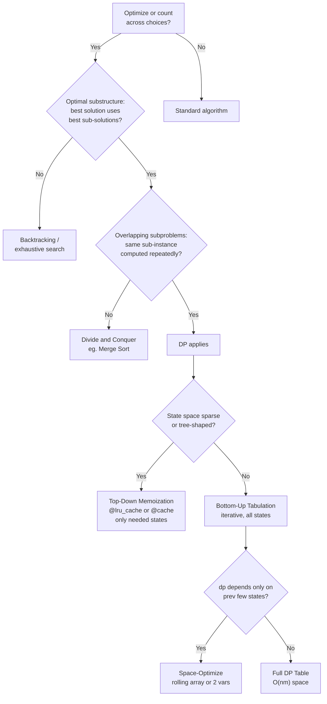
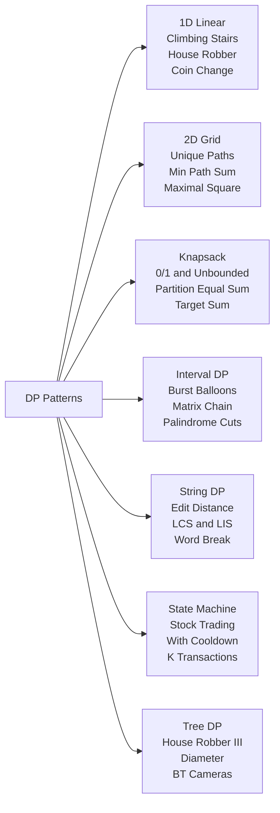

# 🧩 Dynamic Programming — Python Patterns

> [!abstract] TL;DR
> Dynamic Programming turns exponential brute-force into polynomial time by caching subproblem answers. Python offers `@functools.lru_cache` / `@cache` for frictionless top-down memoization; mastering tabulation's fill-order rules and space compression unlocks bottom-up solutions that sidestep Python's call-stack limit entirely. Seven pattern families cover virtually every DP problem encountered in interviews.

---

## Intuition

**Analogy:** You are renovating a skyscraper floor by floor. Before starting floor 8, floors 1–7 must already be complete and signed off — you never demolish a finished floor and rebuild it. The signed-off floors are your cached subproblem answers; the construction spec (load calculations that reference the floors below) is your recurrence relation; the ground floor is your base case.

Plain recursion demolishes and rebuilds floors on every request. DP keeps the signed-off paperwork on a desk (the memo table). The cost of filing paperwork once beats the cost of reconstruction every time.

---

## How It Works

### Core Mechanics

**Two conditions required for DP:**

**1. Overlapping Subproblems** — the same sub-instance is computed multiple times during naive recursion. `fib(3)` appears in both the call tree of `fib(5)` and `fib(4)`. Without caching: O(2ⁿ). With caching: O(n).

**2. Optimal Substructure** — an optimal solution to the whole problem *contains* optimal solutions to its sub-problems. Shortest path A→C through B equals shortest(A→B) + shortest(B→C). Counter-example: the longest *simple* path does NOT have optimal substructure — taking an optimal subpath can force a globally worse route.

**The diagnostic question:** "Can I express `f(n)` in terms of strictly smaller inputs?" If yes, write the recurrence. If the same sub-inputs recur, DP applies.

**5-Step Derivation Framework:**

| Step | Question |
|------|----------|
| 1. Define state | What does `dp[i]` (or `dp[i][j]`) represent? Be precise. |
| 2. Write transition | How is `dp[i]` computed from smaller states? |
| 3. Set base cases | Which states are trivially known without recursion? |
| 4. Determine fill order | Smaller states must be computed before larger ones that depend on them. |
| 5. Extract the answer | `dp[n]`, `max(dp)`, `dp[m][n]`, etc. |

---

### Python Memoization Toolkit

```python
import functools
import sys
from typing import List

# ── @functools.cache (Python 3.9+) — unbounded, zero boilerplate ─────────
@functools.cache
def fib(n: int) -> int:
    if n <= 1:
        return n
    return fib(n - 1) + fib(n - 2)

# Inspect and reset the cache (critical in competitive programming)
print(fib.cache_info())  # CacheInfo(hits=..., misses=..., maxsize=None, currsize=...)
fib.cache_clear()        # resets; call between independent test cases


# ── @lru_cache(maxsize=None) — Python 3.2+, equivalent to @cache ─────────
@functools.lru_cache(maxsize=None)
def coin_change_memo(amount: int, coins: tuple) -> int:
    """coins must be a tuple — lru_cache requires hashable arguments."""
    if amount == 0:
        return 0
    if amount < 0:
        return float('inf')
    return 1 + min(coin_change_memo(amount - c, coins) for c in coins)

# Usage: coin_change_memo(11, (1, 5, 6, 9)) == 2


# ── Manual memo dict — full control over keys and lifetime ───────────────
def word_break(s: str, word_set: frozenset) -> bool:
    """
    LC 139. Can s be segmented into dictionary words?
    Manual memo lets us use a closure dict without making word_set hashable
    as a function argument.
    """
    memo: dict[int, bool] = {}

    def dp(start: int) -> bool:
        if start == len(s):
            return True
        if start in memo:
            return memo[start]
        for end in range(start + 1, len(s) + 1):
            if s[start:end] in word_set and dp(end):
                memo[start] = True
                return True
        memo[start] = False
        return False

    return dp(0)


# ── Raising the recursion limit for n up to ~10^4 ────────────────────────
sys.setrecursionlimit(20_000)
# For n > 10^4 or tight memory: switch to tabulation to avoid stack overflow.


# ── @lru_cache on instance methods — memory leak pitfall ─────────────────
# lru_cache holds a strong reference to `self` as part of the cache key.
# The instance is never garbage-collected as long as the cache lives.
# Pattern: use a module-level helper that accepts only hashable primitives,
# or use functools.cached_property for per-instance one-shot computation.

class Solution:
    @functools.lru_cache(maxsize=None)
    def dp_helper(self, i: int, j: int) -> int:
        # Works but self never GCs; acceptable in short-lived LeetCode contexts.
        # In production/web services, call self.dp_helper.cache_clear() when done.
        return i + j
```

---

### Bottom-Up Tabulation

```python
from typing import List

# ── 1D tabulation with O(1) space optimization ───────────────────────────
def house_robber(nums: List[int]) -> int:
    """
    LC 198. House Robber.
    State:      dp[i] = max money robbing houses 0..i
    Transition: dp[i] = max(dp[i-1], dp[i-2] + nums[i])
    Only need prev two values → O(1) space.
    """
    if not nums:
        return 0
    if len(nums) == 1:
        return nums[0]
    prev2, prev1 = nums[0], max(nums[0], nums[1])
    for i in range(2, len(nums)):
        prev2, prev1 = prev1, max(prev1, prev2 + nums[i])
    return prev1


# ── 2D tabulation compressed to 1D row ───────────────────────────────────
def unique_paths(m: int, n: int) -> int:
    """
    LC 62. Unique Paths — move only right or down.
    dp[i][j] = dp[i-1][j] + dp[i][j-1].
    Compress: dp[j] (current row) += dp[j-1] (left in same row).
    Previous-row value of dp[j] is the "from above" contribution.
    """
    dp = [1] * n            # top row: exactly one path to each cell (go right)
    for _ in range(1, m):
        for j in range(1, n):
            dp[j] += dp[j-1]   # dp[j] = above (unchanged so far) + left (just updated)
    return dp[n-1]
```

---

### Flow / Architecture



### Pattern Taxonomy



---

### Pattern Reference

| Family | State shape | Fill order | Key recurrence signal | Representative problems |
|--------|-------------|------------|-----------------------|-------------------------|
| **1D Linear** | `dp[i]` | left → right | `dp[i] = f(dp[i-1], dp[i-2])` | Climbing Stairs, House Robber, Jump Game, Decode Ways |
| **2D Grid** | `dp[i][j]` | top-left → bottom-right | `dp[i][j] = f(dp[i-1][j], dp[i][j-1])` | Unique Paths, Min Path Sum, Maximal Square |
| **Knapsack** | `dp[i][w]` or `dp[w]` | items outer, weight inner | include/exclude each item | 0/1 Knapsack, Unbounded, Subset Sum, Partition |
| **Interval DP** | `dp[i][j]` | increasing length | `dp[i][j] = max over k in [i..j]` | Burst Balloons, Matrix Chain, Stone Merging, Palindrome Partition |
| **String DP** | `dp[i][j]` | both strings left → right | match vs skip transitions | Edit Distance, LCS, Longest Palindromic Subsequence, Interleaving String |
| **State Machine** | `dp[day][state]` | day 0 → day n | state transitions on each day | Stock Buy/Sell I–IV, Cooldown (LC 309), Transaction Fee (LC 714) |
| **Tree DP** | per-node pair `(include, exclude)` | postorder DFS | include/exclude root | House Robber III, Diameter, Binary Tree Cameras |

**State Machine DP — Stock Trading Template:**

```python
# LC 309. Best Time to Buy and Sell Stock with Cooldown.
# States: HELD (own stock), SOLD (just sold, enter cooldown), REST (idle)
# Transitions:
#   HELD[i]  = max(HELD[i-1],  REST[i-1] - price[i])  # hold or buy
#   SOLD[i]  = HELD[i-1] + price[i]                   # sell what we held
#   REST[i]  = max(REST[i-1],  SOLD[i-1])              # stay idle or come off cooldown

def max_profit_cooldown(prices: List[int]) -> int:
    held, sold, rest = -prices[0], 0, 0
    for price in prices[1:]:
        held, sold, rest = (
            max(held, rest - price),
            held + price,
            max(rest, sold),
        )
    return max(sold, rest)
```

---

## Code Demo

### Demo 1: Edit Distance — Tabulation and Space Optimization

```python
from typing import List

def edit_distance_2d(word1: str, word2: str) -> int:
    """
    LC 72. Edit Distance (Levenshtein distance).
    Min insert / delete / replace ops to convert word1 to word2.

    State:      dp[i][j] = min ops to convert word1[:i] to word2[:j]
    Base:       dp[0][j] = j  (j insertions from empty)
                dp[i][0] = i  (i deletions to reach empty)
    Transition:
      chars match:    dp[i][j] = dp[i-1][j-1]          (no op needed)
      chars differ:   dp[i][j] = 1 + min(
                          dp[i-1][j],    # delete from word1
                          dp[i][j-1],    # insert into word1
                          dp[i-1][j-1]   # replace in word1
                      )
    """
    m, n = len(word1), len(word2)
    dp = [[0] * (n + 1) for _ in range(m + 1)]
    for i in range(m + 1):
        dp[i][0] = i
    for j in range(n + 1):
        dp[0][j] = j
    for i in range(1, m + 1):
        for j in range(1, n + 1):
            if word1[i-1] == word2[j-1]:
                dp[i][j] = dp[i-1][j-1]
            else:
                dp[i][j] = 1 + min(dp[i-1][j], dp[i][j-1], dp[i-1][j-1])
    return dp[m][n]


def edit_distance_1d(word1: str, word2: str) -> int:
    """
    Space-optimized to O(n): replace the 2D table with two 1D rows.

    dp[i][j] depends on three neighbors:
      dp[i-1][j-1]  diagonal — call it `diag`, saved before overwriting
      dp[i-1][j]    above    — prev[j] before this iteration
      dp[i][j-1]    left     — curr[j-1] just computed

    We walk left-to-right in the inner loop; `prev` holds the previous row.
    """
    m, n = len(word1), len(word2)
    prev = list(range(n + 1))         # dp[0] = [0, 1, 2, ..., n]

    for i in range(1, m + 1):
        curr = [i] + [0] * n          # curr[0] = i  (i deletions)
        for j in range(1, n + 1):
            if word1[i-1] == word2[j-1]:
                curr[j] = prev[j-1]               # diagonal: no op
            else:
                curr[j] = 1 + min(
                    prev[j],                       # delete  (row above)
                    curr[j-1],                     # insert  (left in current row)
                    prev[j-1]                      # replace (diagonal)
                )
        prev = curr

    return prev[n]


assert edit_distance_2d("horse", "ros") == 3
assert edit_distance_1d("horse", "ros") == 3
assert edit_distance_2d("intention", "execution") == 5
assert edit_distance_1d("intention", "execution") == 5
```

---

### Demo 2: 0/1 Knapsack — 2D and 1D

```python
from typing import List

def knapsack_2d(weights: List[int], values: List[int], capacity: int) -> int:
    """
    0/1 Knapsack — full 2D table. O(n * W) time, O(n * W) space.
    dp[i][w] = max value using first i items with weight limit w.
    """
    n = len(weights)
    dp = [[0] * (capacity + 1) for _ in range(n + 1)]
    for i in range(1, n + 1):
        wt, val = weights[i-1], values[i-1]
        for w in range(capacity + 1):
            dp[i][w] = dp[i-1][w]                           # exclude item i
            if wt <= w:
                dp[i][w] = max(dp[i][w], dp[i-1][w - wt] + val)  # include
    return dp[n][capacity]


def knapsack_1d(weights: List[int], values: List[int], capacity: int) -> int:
    """
    0/1 Knapsack — 1D space-optimized. O(n * W) time, O(W) space.

    CRITICAL: iterate weight in REVERSE (capacity down to wt).

    Why reverse?
      The update rule is dp[w] = max(dp[w], dp[w - wt] + val).
      In the 2D version, dp[i-1][w - wt] refers to the PREVIOUS row.
      With a single array iterated forward, dp[w - wt] is already updated
      within the current item's pass — effectively using item i again,
      which is unbounded knapsack behavior.
      Reverse iteration ensures dp[w - wt] is still from the previous
      conceptual row (before item i was considered), enforcing the 0/1 rule.

    Contrast: Unbounded Knapsack uses FORWARD iteration intentionally.
    """
    dp = [0] * (capacity + 1)
    for wt, val in zip(weights, values):
        for w in range(capacity, wt - 1, -1):   # HIGH to LOW
            dp[w] = max(dp[w], dp[w - wt] + val)
    return dp[capacity]


weights  = [1, 3, 4, 5]
values   = [1, 4, 5, 7]
cap      = 7
assert knapsack_2d(weights, values, cap) == 9
assert knapsack_1d(weights, values, cap) == 9


# ── Partition Equal Subset Sum (LC 416) — boolean knapsack ───────────────
def can_partition(nums: List[int]) -> bool:
    """
    Can nums be split into two subsets with equal sum?
    Equivalent to: can we choose items summing to total // 2?
    Same 1D knapsack structure, dp[w] = bool instead of max value.
    """
    total = sum(nums)
    if total % 2 != 0:
        return False
    target = total // 2
    dp = [False] * (target + 1)
    dp[0] = True                        # empty subset sums to 0
    for num in nums:
        for w in range(target, num - 1, -1):   # reverse: 0/1 rule
            dp[w] = dp[w] or dp[w - num]
    return dp[target]


assert can_partition([1, 5, 11, 5]) == True
assert can_partition([1, 2, 3, 5])  == False
```

---

### Demo 3: Longest Increasing Subsequence — O(n²) DP and O(n log n) Patience Sorting

```python
import bisect
from typing import List

def lis_dp(nums: List[int]) -> int:
    """
    LIS — O(n²) DP.
    dp[i] = length of LIS ending exactly at index i.
    Transition: dp[i] = max(dp[j] + 1) for all j < i where nums[j] < nums[i].
    Answer: max(dp).
    """
    if not nums:
        return 0
    dp = [1] * len(nums)
    for i in range(1, len(nums)):
        for j in range(i):
            if nums[j] < nums[i]:
                dp[i] = max(dp[i], dp[j] + 1)
    return max(dp)


def lis_patience(nums: List[int]) -> int:
    """
    LIS via patience sorting — O(n log n) time, O(n) space.

    Analogy: patience card game. Deal cards left to right.
    Place each card on the leftmost pile whose top >= current card.
    If no such pile, start a new pile. Number of piles = LIS length.

    tails[k] = smallest tail element of all increasing subsequences of length k+1.
    tails is always strictly sorted, enabling binary search for each card.

    For each num:
      pos = bisect_left(tails, num)  — leftmost index where tails[pos] >= num
      pos == len(tails)  → num extends the longest subsequence (append).
      pos < len(tails)   → tails[pos] = num: same-length subsequence, smaller tail
                           (a smaller tail gives more room for future growth).
    """
    tails: List[int] = []
    for num in nums:
        pos = bisect.bisect_left(tails, num)
        if pos == len(tails):
            tails.append(num)
        else:
            tails[pos] = num
    return len(tails)


assert lis_dp([10, 9, 2, 5, 3, 7, 101, 18]) == 4      # [2,3,7,101]
assert lis_patience([10, 9, 2, 5, 3, 7, 101, 18]) == 4
assert lis_patience([0, 1, 0, 3, 2, 3]) == 4
assert lis_patience([7, 7, 7, 7]) == 1                 # strictly increasing


# ── Russian Doll Envelopes (LC 354) — LIS in 2D ──────────────────────────
def max_envelopes(envelopes: List[List[int]]) -> int:
    """
    Sort by width ASC, then height DESC within the same width.
    DESC within same width prevents fitting two same-width envelopes.
    Then LIS on heights alone gives the answer.
    """
    envelopes.sort(key=lambda e: (e[0], -e[1]))
    heights = [e[1] for e in envelopes]
    return lis_patience(heights)
```

---

### Demo 4: Burst Balloons — Interval DP

```python
from typing import List

def max_coins(nums: List[int]) -> int:
    """
    LC 312. Burst Balloons — Interval DP.

    Naive framing (forward): which balloon to burst first?
    Bursting changes neighbors — subproblems are NOT independent.

    Key insight — think in reverse: which balloon is LAST to burst
    in interval [left..right]?
    When balloon k is last, all others in [left..right] are gone.
    k's effective neighbors are nums[left-1] and nums[right+1] — the boundaries.
    Coins from bursting k = nums[left-1] * nums[k] * nums[right+1].
    Subproblems [left..k-1] and [k+1..right] are now independent of k.

    State:      dp[left][right] = max coins from bursting all in [left..right]
    Fill order: increasing interval length (length 1 first, ..., length n last).
                Must compute shorter intervals before longer ones that contain them.
    Base:       dp[i][i-1] = 0  (empty interval, handled implicitly by init to 0)
    """
    nums = [1] + nums + [1]    # sentinel boundaries: edge balloons get neighbor = 1
    n = len(nums)
    dp = [[0] * n for _ in range(n)]

    for length in range(1, n - 1):              # interval lengths 1 to n-2
        for left in range(1, n - length):
            right = left + length - 1
            for k in range(left, right + 1):    # k = last balloon to burst
                gain = nums[left-1] * nums[k] * nums[right+1]
                dp[left][right] = max(
                    dp[left][right],
                    dp[left][k-1] + gain + dp[k+1][right]
                )
    return dp[1][n-2]


assert max_coins([3, 1, 5, 8]) == 167
assert max_coins([1, 5])        == 10
assert max_coins([])            == 0


# ── Why length-first fill order is mandatory ─────────────────────────────
# For nums = [3, 1, 5] (padded: [1, 3, 1, 5, 1]):
# dp[1][3] (full interval) needs dp[1][0]=0, dp[2][3], dp[1][1], dp[3][3], dp[1][2], dp[4][3]=0.
# dp[2][3] and dp[1][2] (length-2 intervals) must be ready before dp[1][3] (length-3).
# If you fill by left index instead of length, dp[1][3] may be computed before dp[2][3].
```

---

## Real-World Example

> **Example — Unix `diff` and Bioinformatics Alignment:** The `diff` command (and Git's file comparison engine) generates edit scripts using Longest Common Subsequence: every line NOT in the LCS is either an insertion or deletion. For a 10,000-line file, this is a 10⁸-cell DP table — manageable in milliseconds with a tight C loop. The Needleman-Wunsch algorithm for DNA/protein sequence alignment is exactly edit distance DP with affine gap penalties replacing uniform cost. Bioinformatics tools align sequences millions of bases long by combining the 2D DP recurrence with hardware-accelerated SIMD to compute 16 cells in parallel. Both applications validate that 2D string DP is not merely a textbook exercise — it is a production foundation at billion-dollar scale.

---

## Trade-offs

### `@lru_cache` / `@cache` vs Manual Memo Dict

| Aspect | `@lru_cache` / `@cache` | Manual `memo = {}` |
|--------|------------------------|---------------------|
| Boilerplate | Zero — one decorator line | 3–5 lines per function |
| Argument requirement | Args must be hashable (no lists or dicts) | Any hashable key; transform args yourself |
| Instance method safety | Holds ref to `self` — prevents GC | Full control over dict lifetime |
| Eviction | `lru_cache(maxsize=N)` evicts LRU entries | Custom eviction logic possible |
| Between-test clearing | `func.cache_clear()` | Re-initialize the dict |
| Best fit | Standalone recursive functions; contests | Closures; non-hashable state; web services |

### Top-Down Memoization vs Bottom-Up Tabulation

| Aspect | Top-Down (Memoization) | Bottom-Up (Tabulation) |
|--------|------------------------|------------------------|
| Code naturalness | Follows the recurrence directly | Requires explicit iteration order |
| States computed | Only reachable states — good for sparse spaces | All states in fill order |
| Stack overflow risk | Yes — Python default is 1000 frames | None (iterative) |
| Space optimization | Difficult to compress | Easy: compress to O(n) or O(1) |
| Runtime constant factor | Higher (function-call overhead per state) | Lower (array indexing only) |
| Best fit | Tree DP, bitmask DP, large sparse state spaces | Dense grids, string DP, knapsack |

---

## When to Use vs Avoid

**Use DP when:**
- The problem asks for optimal value (min/max) or a count of ways over combinatorial choices.
- Drawing the naive recursion tree reveals repeated branches (overlapping subproblems).
- Greedy provably fails: a locally optimal choice blocks a globally optimal result.
- The problem says "how many ways", "minimum cost", "maximum profit", or "can you form X".

**Avoid (or reconsider) when:**
- Subproblems are all distinct — use divide-and-conquer (merge sort, binary search).
- State space is O(2ⁿ) with large n — DP is impractical without bitmask compression.
- Greedy is provably correct and simpler (activity selection, Huffman coding).
- No optimal substructure exists (e.g., longest simple path in a general graph is NP-hard).

---

## Common Pitfalls

- **Wrong iteration direction in 1D knapsack** — The inner loop for 0/1 knapsack MUST iterate from `capacity` down to `weight`. Forward iteration lets `dp[w - wt]` see the already-updated current item, producing unbounded knapsack behavior. If items are unlimited, forward iteration is correct — choosing direction is a deliberate decision, not a detail.

- **Off-by-one between `dp[i]` and element at index `i`** — The convention `dp[i]` = "answer for first `i` elements" means `dp[0]` = empty prefix (base case) and element access uses `arr[i-1]`. Mixing this with `dp[i]` = "answer ending at index `i`" (where `dp[0]` = `arr[0]`) in the same codebase causes subtle wrong answers.

- **Missing base-case initialization in 2D DP** — Edit distance requires both `dp[0][j] = j` (first row) and `dp[i][0] = i` (first column). Missing either column or row produces incorrect results for strings with empty prefixes.

- **`@lru_cache` with mutable arguments** — Lists are not hashable. Calling `dp(arr)` where `arr` is a list raises `TypeError: unhashable type: 'list'`. Convert to `tuple(arr)` before the call.

- **Interval DP filled by left index instead of length** — `dp[left][right]` depends on `dp[left][k-1]` and `dp[k+1][right]`, both of which are shorter intervals. Filling by left index does not guarantee shorter intervals are computed first. Always use the outer loop over interval length.

- **LCS length vs actual subsequence reconstruction** — The DP table gives the LCS *length*. Reconstructing the actual string requires a separate backtracking pass: walk from `dp[m][n]` back to `dp[0][0]`, following the diagonal on matches and the direction of the max otherwise. Returning `dp[m][n]` when the problem asks for the string is a category error.

- **`@lru_cache` not cleared between independent test cases** — In competitive programming with multiple test cases in one process, a cached function from test case 1 pollutes test case 2. Call `func.cache_clear()` or re-define the function inside the test-case loop.

---

## Related Concepts

- [[DP_Fundamentals]] — the 5-step framework, the two DP conditions, and the subproblem DAG in depth.
- [[Memoization_vs_Tabulation]] — side-by-side comparison including complexity analysis and the LCS two-row compression proof.
- [[DP_Patterns]] — the 8-family pattern recognition guide with full LeetCode problem lists per family.
- [[Knapsack_01]] — 0/1 knapsack recurrence derivation and the complete reverse-iteration correctness proof.
- [[Knapsack_Unbounded]] — unbounded knapsack and why forward iteration is correct when items are reusable.
- [[Edit_Distance]] — full Levenshtein derivation with trace table.
- [[LCS_and_LIS]] — 2D LCS table construction and LIS patience sorting with sequence reconstruction.
- [[Coin_Change]] — canonical 1D unbounded knapsack covering both minimum-coins and count-ways variants.
- [[DP_on_Trees]] — tree DP using postorder DFS, House Robber III, and tree diameter.
- [[Recursion_Fundamentals]] — DP is structured recursion plus caching; review call stacks and base-case patterns here first.
- [[Python_for_ML]] — Python performance patterns including `functools`, comprehensions, and when to vectorize vs loop.
- [[Generators_and_Iterators]] — covers `functools.lru_cache` and `functools.reduce` in the context of lazy iterators.

---

## Review Questions

1. **Knapsack direction:** In 0/1 knapsack with 1D space optimization, why must the inner loop iterate weights in reverse order? What goes wrong with forward iteration, and which DP variant does forward iteration naturally implement?

2. **`@lru_cache` on instance methods:** A colleague decorates a class method with `@lru_cache(maxsize=None)`. Unit tests pass, but memory usage grows unbounded across HTTP requests in a Flask service. Explain the root cause in terms of Python's reference counting and propose two concrete fixes.

3. **Interval DP fill order:** Why does Burst Balloons require filling the DP table by increasing interval *length* rather than by increasing left index? Construct a three-balloon example where filling by left index produces a wrong intermediate result.

4. **State machine DP state definition:** For LC 309 (Stock Trading with Cooldown), there are three states: HELD, SOLD, REST. A junior engineer collapses them to a single binary flag `holding = 0 or 1` and gets wrong answers. Explain which transition is lost when the SOLD and REST states are merged, and show the correct three-state recurrence.

---

## Sources

- [Python `functools` docs — `lru_cache` and `cache`](https://docs.python.org/3/library/functools.html)
- [LeetCode — Dynamic Programming Explore Card](https://leetcode.com/explore/learn/card/dynamic-programming/)
- [MIT 6.006 — Introduction to Algorithms: DP Lectures (Demaine)](https://ocw.mit.edu/courses/6-006-introduction-to-algorithms-fall-2011/)
- [Patience Sorting and LIS — cp-algorithms.com](https://cp-algorithms.com/sequences/longest_increasing_subsequence.html)
- CLRS, 4th ed., Chapter 14 — Dynamic Programming

---

#dsa #dynamic-programming #memoization #tabulation #python #leetcode
