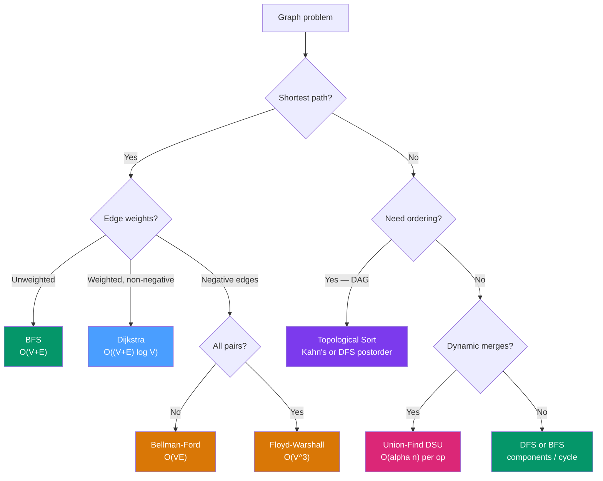

# Graphs — DSA Patterns in Python

> [!abstract] TL;DR
> Graph problems dominate coding interviews because they unify routing, connectivity, ordering, and search — master BFS (layer-by-layer shortest path), DFS (deep exploration and cycle detection), Dijkstra (weighted shortest path), topological sort (dependency ordering), and Union-Find (dynamic connectivity) and you cover 80% of all graph LeetCode problems.

---

## Intuition

**Analogy:** A city road network makes every concept concrete. Intersections are nodes, roads are edges, and distance or toll is the weight. BFS explores roads layer by layer — first all 1-hop neighbors, then all 2-hop neighbors — giving the shortest route in an unweighted city. Dijkstra picks whichever unfinished intersection is closest by total toll paid, expanding outward like a ripple from the source. DFS sprints down one road as far as possible before backtracking — useful when you need to detect if roads form a loop (cycle) rather than find the shortest route. Union-Find answers "are these two intersections in the same borough?" in near-constant time, even as new roads get added. Topological sort finds a valid build order for a city with strict dependency rules — each building can only start once its prerequisites are finished.

Every graph problem is a variation of one of these five lenses. Matching the lens to the problem structure before touching code is the key skill.

---

## How It Works

### 1. Graph Representations in Python

**Adjacency list with `defaultdict(list)`** is the standard representation for sparse graphs. Edge `(u → v)` is stored as `graph[u].append(v)`. For weighted graphs use `graph[u].append((weight, v))` — the weight goes first so tuples sort naturally in a min-heap.

```python
from collections import defaultdict

# Unweighted directed graph
graph = defaultdict(list)
for u, v in [(0,1),(0,2),(1,3),(2,3)]:
    graph[u].append(v)

# Weighted undirected graph — weight first for heapq compatibility
wgraph = defaultdict(list)
for u, v, w in [(0,1,4),(0,2,1),(1,3,2),(2,3,5)]:
    wgraph[u].append((w, v))
    wgraph[v].append((w, u))
```

**Adjacency matrix** (`matrix[u][v] = weight`) only makes sense for dense graphs (E ≈ V²) or when O(1) edge-existence lookup is required. Memory is O(V²) — prohibitive for V > 10,000.

**Implicit graph (grid as graph):** Many problems give you a 2-D grid where cells are nodes and adjacency is computed on the fly. Never build an explicit adjacency structure — just compute neighbors via direction arrays.

```python
DIRS_4 = [(0,1),(0,-1),(1,0),(-1,0)]       # 4-directional (no diagonals)
DIRS_8 = [(dr,dc) for dr in (-1,0,1) for dc in (-1,0,1) if (dr,dc) != (0,0)]

def neighbors(r, c, rows, cols):
    for dr, dc in DIRS_4:
        nr, nc = r + dr, c + dc
        if 0 <= nr < rows and 0 <= nc < cols:
            yield nr, nc
```

---

### 2. DFS — Depth-First Search

DFS explores as deep as possible before backtracking. Use it for: connected components, cycle detection, topological sort (postorder), and path existence.

**Recursive DFS template:**

```python
def dfs(graph, node, visited):
    visited.add(node)
    for neighbor in graph[node]:
        if neighbor not in visited:
            dfs(graph, neighbor, visited)
```

**Iterative DFS** (avoids Python's recursion limit, preferred for deep graphs):

```python
def dfs_iterative(graph, start):
    visited = set()
    stack = [start]
    while stack:
        node = stack.pop()
        if node in visited:
            continue
        visited.add(node)
        for neighbor in graph[node]:
            if neighbor not in visited:
                stack.append(neighbor)
    return visited
```

**Cycle detection — undirected graph** (track parent to avoid false positives):

```python
def has_cycle_undirected(graph, n):
    visited = set()

    def dfs(node, parent):
        visited.add(node)
        for neighbor in graph[node]:
            if neighbor not in visited:
                if dfs(neighbor, node):
                    return True
            elif neighbor != parent:
                return True      # back edge to non-parent → cycle
        return False

    for i in range(n):
        if i not in visited and dfs(i, -1):
            return True
    return False
```

**Cycle detection — directed graph (3-color / recursion stack):** Nodes are white (unvisited), gray (in current DFS path), or black (fully processed). A back edge to a gray node means a cycle.

```python
def has_cycle_directed(graph, n):
    WHITE, GRAY, BLACK = 0, 1, 2
    color = [WHITE] * n

    def dfs(node):
        color[node] = GRAY
        for neighbor in graph[node]:
            if color[neighbor] == GRAY:
                return True      # back edge → cycle
            if color[neighbor] == WHITE and dfs(neighbor):
                return True
        color[node] = BLACK
        return False

    return any(color[i] == WHITE and dfs(i) for i in range(n))
```

**DFS on grid (number of islands):**

```python
def num_islands(grid):
    rows, cols = len(grid), len(grid[0])
    count = 0

    def dfs(r, c):
        if r < 0 or r >= rows or c < 0 or c >= cols or grid[r][c] != '1':
            return
        grid[r][c] = '0'          # mark visited in-place (avoids extra set)
        for dr, dc in DIRS_4:
            dfs(r + dr, c + dc)

    for r in range(rows):
        for c in range(cols):
            if grid[r][c] == '1':
                dfs(r, c)
                count += 1
    return count
```

---

### 3. BFS — Breadth-First Search

BFS explores neighbors level by level, guaranteeing the shortest path in an **unweighted** graph. The deque (`collections.deque`) is essential — `popleft()` is O(1) vs `pop(0)` on a list which is O(n).

**BFS template — single source shortest path:**

```python
from collections import deque

def bfs_shortest(graph, start, target):
    queue = deque([(start, 0)])    # (node, distance)
    visited = {start}

    while queue:
        node, dist = queue.popleft()
        if node == target:
            return dist
        for neighbor in graph[node]:
            if neighbor not in visited:
                visited.add(neighbor)   # mark BEFORE enqueue, not after dequeue
                queue.append((neighbor, dist + 1))
    return -1
```

> [!warning] Critical: mark visited before enqueuing, not after dequeuing. Marking after dequeue allows the same node to be added to the queue multiple times, exploding from O(V+E) to potentially O(V*E). This is the single most common BFS TLE.

**Multi-source BFS:** Start all source nodes at level 0 simultaneously. Classic problems: Rotting Oranges, Walls and Gates, Pacific Atlantic Water Flow.

```python
def multi_source_bfs(grid, sources):
    rows, cols = len(grid), len(grid[0])
    queue = deque()
    for r, c in sources:
        queue.append((r, c, 0))    # (row, col, distance)
        grid[r][c] = -1            # mark visited

    while queue:
        r, c, dist = queue.popleft()
        for dr, dc in DIRS_4:
            nr, nc = r + dr, c + dc
            if 0 <= nr < rows and 0 <= nc < cols and grid[nr][nc] == 0:
                grid[nr][nc] = dist + 1
                queue.append((nr, nc, dist + 1))
```

**01-BFS:** When edge weights are only 0 or 1, use a deque. Cost-0 edges go to the front (`appendleft`), cost-1 edges go to the back (`append`). This achieves O(V+E) — the efficiency of BFS without the overhead of Dijkstra.

```python
def bfs_01(graph, start, n):
    dist = [float('inf')] * n
    dist[start] = 0
    dq = deque([start])

    while dq:
        u = dq.popleft()
        for weight, v in graph[u]:
            if dist[u] + weight < dist[v]:
                dist[v] = dist[u] + weight
                if weight == 0:
                    dq.appendleft(v)    # free edge — explore first
                else:
                    dq.append(v)
    return dist
```

---

### 4. Topological Sort

Topological sort orders nodes in a DAG such that all edges go from left to right. Only valid on **Directed Acyclic Graphs** — if a cycle exists, no ordering is possible.

**Kahn's Algorithm (BFS-based):** Repeatedly remove nodes with in-degree 0. If the result includes all nodes, the graph is acyclic. If fewer nodes appear, a cycle prevented the rest from reaching in-degree 0.

```
Initial:  [A→C, A→D, B→D, B→E, C→F, D→F]
In-degree: A=0, B=0, C=1, D=2, E=1, F=2
Queue:    [A, B]   → process A → C,D degrees drop → process B → D,E drop
                  → process C → F drops once → process D → F drops again
                  → process E (leaf) → process F
Order: [A, B, C, D, E, F]  (one valid ordering)
```

**DFS-based topological sort:** Run DFS; append each node to a list when it finishes (postorder). Reverse the list. Any back edge (gray → gray) means a cycle.

---

### 5. Dijkstra's Algorithm

Dijkstra finds shortest paths from a single source in a graph with **non-negative weights**. The min-heap ensures we always process the globally nearest unfinalized node.

**Lazy deletion pattern:** When a shorter path is found for an already-queued node, push the new entry without removing the old one. When a node is popped, skip it if the stored distance is stale (`d > dist[u]`).

Time complexity: O((V+E) log V) with a binary heap.

**When to use vs alternatives:**
- Unweighted graph → BFS (O(V+E), simpler)
- Non-negative weights → Dijkstra
- Negative weights, single source → Bellman-Ford O(VE)
- All-pairs shortest paths → Floyd-Warshall O(V³)

---

### 6. Union-Find (Disjoint Set Union)

Union-Find answers "are X and Y connected?" and "merge X's group with Y's group" in amortized O(α(n)) — the inverse Ackermann function, which is ≤ 4 for any input size encountered in practice.

Two optimizations are mandatory:
- **Path compression:** When finding the root, flatten all nodes along the path to point directly at the root.
- **Union by rank:** Always attach the shorter tree under the taller tree's root.

Use Union-Find for: counting connected components, detecting cycles in undirected graphs, Kruskal's MST, and any problem where you dynamically merge groups.

---

### 7. Grid Graph Problems — Pattern Matching

| Problem | Pattern | Key Trick |
|---------|---------|-----------|
| Number of Islands | DFS/BFS | Modify grid in-place to avoid visited set |
| Rotting Oranges | Multi-source BFS | Initialize queue with all rotten cells at t=0 |
| Shortest Path in Binary Matrix | BFS | Level = steps; walls block traversal |
| Walls and Gates | Multi-source BFS | Propagate distance from all gates simultaneously |
| Pacific Atlantic Water Flow | Reverse BFS | BFS from both coasts inward; find intersection |
| Word Search | DFS + Backtracking | Undo cell marking on return (backtrack) |
| Surrounded Regions | DFS from border | Mark border-connected cells, then flip the rest |

---

### 8. Advanced Algorithms — Concept Summary

**Bellman-Ford:** Relax all edges V-1 times. A V-th relaxation that still improves any distance signals a negative cycle. O(VE). Use when negative edge weights are present.

**Floyd-Warshall:** Dynamic programming over all intermediate nodes. `dp[i][j] = min(dp[i][j], dp[i][k] + dp[k][j])` for each `k`. Gives all-pairs shortest paths in O(V³). Practical only for V ≤ ~500.

**Prim's MST:** Greedy heap-based approach for Minimum Spanning Tree. Start from any node, repeatedly add the cheapest edge connecting the visited set to an unvisited node. O((V+E) log V). Equivalent result to Kruskal's but different traversal order.

**Bipartite check (2-coloring):** Use BFS. Try to 2-color the graph — if two adjacent nodes get the same color, it is not bipartite. Common proxy for "can this graph be split into two groups with no intra-group edges?"

**Strongly Connected Components (SCC):** Tarjan's or Kosaraju's algorithm. Both O(V+E). A SCC is a maximal set of nodes where every node is reachable from every other. See [[Strongly_Connected_Components]] for full details.

---

### 9. Python-Specific Graph Tricks

```python
import sys
sys.setrecursionlimit(10**6)   # raise limit for deep recursive DFS
                               # but prefer iterative DFS for production code

# In-place grid modification — fastest way to mark visited
# grid[r][c] = '#'  or  grid[r][c] = '0'
# Restore if you need backtracking (word search)

# enumerate + zip for clean grid iteration
for r, row in enumerate(grid):
    for c, val in enumerate(row):
        if val == '1':
            dfs(r, c)

# Build adjacency list from edge list in one line
from collections import defaultdict
graph = defaultdict(list)
for u, v in edges:
    graph[u].append(v)
    graph[v].append(u)   # omit second line for directed graphs
```

---

## Flow / Architecture — Algorithm Selection



---

## Code Demo

### Demo 1: Dijkstra's Shortest Path

```python
import heapq
from collections import defaultdict

def dijkstra(graph: dict, src: int, n: int) -> list:
    """
    Single-source shortest paths from src to all other nodes.
    graph: adjacency list where graph[u] = [(weight, v), ...]
    Returns dist array; dist[i] = shortest distance from src to i.
    """
    dist = [float('inf')] * n
    dist[src] = 0
    heap = [(0, src)]           # (cumulative_dist, node)

    while heap:
        d, u = heapq.heappop(heap)
        if d > dist[u]:
            continue            # stale entry — lazy deletion, skip it
        for weight, v in graph[u]:
            new_dist = dist[u] + weight
            if new_dist < dist[v]:
                dist[v] = new_dist
                heapq.heappush(heap, (new_dist, v))

    return dist


# Build graph: 0->(1,4), 0->(2,1), 2->(1,2), 1->(3,1), 2->(3,5)
graph = defaultdict(list)
for u, v, w in [(0,1,4),(0,2,1),(2,1,2),(1,3,1),(2,3,5)]:
    graph[u].append((w, v))
    graph[v].append((w, u))    # undirected

print(dijkstra(graph, 0, 4))   # [0, 3, 1, 4]
# Path to node 1: 0→2→1 (cost 1+2=3), not 0→1 directly (cost 4)
```

---

### Demo 2: Union-Find with Path Compression and Union by Rank

```python
class UnionFind:
    """
    Disjoint Set Union with path compression + union by rank.
    All operations amortized O(alpha(n)) ≈ O(1).
    """

    def __init__(self, n: int):
        self.parent = list(range(n))
        self.rank = [0] * n
        self.components = n          # tracks number of distinct components

    def find(self, x: int) -> int:
        if self.parent[x] != x:
            self.parent[x] = self.find(self.parent[x])   # path compression
        return self.parent[x]

    def union(self, x: int, y: int) -> bool:
        """Merge x and y's components. Returns False if already same (cycle)."""
        rx, ry = self.find(x), self.find(y)
        if rx == ry:
            return False            # same root → would form a cycle
        if self.rank[rx] < self.rank[ry]:
            rx, ry = ry, rx         # ensure rx has higher rank
        self.parent[ry] = rx        # attach smaller tree under larger
        if self.rank[rx] == self.rank[ry]:
            self.rank[rx] += 1
        self.components -= 1
        return True


# Count connected components
uf = UnionFind(6)
for u, v in [(0,1),(1,2),(3,4)]:
    uf.union(u, v)
print(uf.components)               # 3: {0,1,2}, {3,4}, {5}

# Detect cycle in undirected graph
uf2 = UnionFind(3)
uf2.union(0, 1)
uf2.union(1, 2)
has_cycle = not uf2.union(2, 0)    # find(2)==find(0) → cycle
print(has_cycle)                   # True

# Kruskal's MST: sort edges by weight, greedily add non-cycle edges
def kruskal_mst(n, edges):
    uf = UnionFind(n)
    mst_cost = 0
    for w, u, v in sorted(edges):  # sort by weight
        if uf.union(u, v):
            mst_cost += w
    return mst_cost

print(kruskal_mst(4, [(1,0,1),(2,1,2),(3,0,2),(4,2,3),(5,0,3)]))  # 6
```

---

### Demo 3: Topological Sort — Kahn's Algorithm

```python
from collections import defaultdict, deque

def topological_sort_kahns(n: int, edges: list) -> list:
    """
    Kahn's BFS-based topological sort.
    Returns ordering of all n nodes, or [] if a cycle exists.
    """
    graph = defaultdict(list)
    indegree = [0] * n

    for u, v in edges:
        graph[u].append(v)
        indegree[v] += 1

    # All nodes with no prerequisites go first
    queue = deque(i for i in range(n) if indegree[i] == 0)
    order = []

    while queue:
        u = queue.popleft()
        order.append(u)
        for v in graph[u]:
            indegree[v] -= 1
            if indegree[v] == 0:
                queue.append(v)

    return order if len(order) == n else []  # shorter list → cycle detected


# LeetCode 207 — Course Schedule
def can_finish(num_courses: int, prerequisites: list) -> bool:
    # prerequisites[i] = [course, prereq] means: take prereq before course
    edges = [(prereq, course) for course, prereq in prerequisites]
    return len(topological_sort_kahns(num_courses, edges)) == num_courses


print(topological_sort_kahns(4, [(0,1),(0,2),(1,3),(2,3)]))
# [0, 1, 2, 3] or [0, 2, 1, 3] — both valid

print(can_finish(2, [[1,0],[0,1]]))    # False — mutual prerequisite = cycle
print(can_finish(4, [[1,0],[2,0],[3,1],[3,2]]))  # True
```

---

### Demo 4: Word Ladder — BFS with Character Substitution

```python
from collections import deque

def word_ladder(begin_word: str, end_word: str, word_list: list) -> int:
    """
    LeetCode 127: find minimum transformations from begin_word to end_word.
    Each transformation changes exactly one character; result must be in word_list.
    Returns 0 if no path exists.
    """
    word_set = set(word_list)
    if end_word not in word_set:
        return 0

    queue = deque([(begin_word, 1)])   # (current_word, steps_including_start)
    visited = {begin_word}

    while queue:
        word, steps = queue.popleft()
        for i in range(len(word)):
            for ch in 'abcdefghijklmnopqrstuvwxyz':
                candidate = word[:i] + ch + word[i+1:]
                if candidate == end_word:
                    return steps + 1   # found — return immediately
                if candidate in word_set and candidate not in visited:
                    visited.add(candidate)   # mark before enqueue
                    queue.append((candidate, steps + 1))
    return 0


print(word_ladder("hit", "cog", ["hot","dot","dog","lot","log","cog"]))  # 5
print(word_ladder("hit", "cog", ["hot","dot","dog","lot","log"]))         # 0
# hit→hot→dot→dog→cog  (5 words = 4 transformations + start)
```

---

## Real-World Example

> **Example — Google Maps and Dijkstra:** Google Maps routes your commute using a variant of Dijkstra's algorithm on a weighted road graph where edge weights represent travel time (not raw distance). The node-shrinking optimization in production (contraction hierarchies) preprocesses the graph so that Dijkstra can skip low-importance nodes, reducing query time from minutes to milliseconds for continental-scale graphs. The same algorithm handles flight routing, package delivery scheduling, and network packet routing (OSPF protocol). Union-Find appears in Kruskal's algorithm used to lay out minimum-cost network cables connecting data centers — always add the cheapest cable that doesn't create a redundant loop.

---

## Trade-offs

| Aspect | DFS | BFS | Union-Find (DSU) |
|--------|-----|-----|-----------------|
| Shortest path | No — finds A path, not the shortest | Yes — guaranteed shortest in unweighted | No |
| Space (worst case) | O(V) stack depth — risk of stack overflow | O(V) queue width — safe in Python | O(V) parent/rank arrays |
| Cycle detection | Yes — recursion stack or 3-color | No | Yes — check if `find(u)==find(v)` |
| Dynamic connectivity | No — re-run on change | No — re-run on change | Yes — `union` adds edges online |
| Grid problems | In-place marking easy | Level distance natural | Rarely used (BFS/DFS better) |

| Graph Representation | Time: neighbor lookup | Space | Best for |
|----------------------|-----------------------|-------|---------|
| Adjacency list | O(degree) | O(V+E) | Sparse graphs (most problems) |
| Adjacency matrix | O(1) | O(V²) | Dense graphs, Floyd-Warshall |
| Edge list | O(E) scan | O(E) | Kruskal's MST, Bellman-Ford |
| Implicit (grid) | O(1) via directions | O(1) extra | Grid problems |

| Shortest Path Algorithm | Handles Negatives | All Pairs | Complexity | Typical Use |
|------------------------|:-----------------:|:---------:|-----------|------------|
| BFS | No | No | O(V+E) | Unweighted graphs |
| Dijkstra | No | No | O((V+E) log V) | Weighted, non-negative |
| Bellman-Ford | Yes | No | O(VE) | Negative weights |
| Floyd-Warshall | Yes | Yes | O(V³) | Small dense graphs |

---

## When to Use vs Avoid

**Use BFS when:**
- You need shortest path in an unweighted graph (grid, social network hops).
- You need level-order exploration (all nodes at distance k before distance k+1).
- Multi-source shortest distance (rotting oranges, walls and gates).

**Use DFS when:**
- You need to detect cycles (directed or undirected).
- You need to enumerate all paths or do backtracking (word search, permutations).
- Generating topological order via postorder.
- Connected component labeling where order does not matter.

**Use Dijkstra when:**
- Edge weights are non-negative integers or floats.
- You only need single-source distances.
- You need the fastest weighted shortest path algorithm.

**Use Union-Find when:**
- You need to dynamically merge groups and answer "same group?" queries.
- Kruskal's MST (process edges by weight, add if they don't form a cycle).
- Problems that ask for the number of connected components after dynamic edge additions.

**Use Topological Sort when:**
- The graph is a DAG and you need a valid processing order.
- Dependency resolution (build systems, course scheduling, alien dictionary).

**Avoid:**
- DFS for shortest path in unweighted graphs (gives A path, not the shortest).
- Dijkstra when any edge has negative weight (use Bellman-Ford).
- Recursive DFS for very deep graphs in Python without raising `sys.setrecursionlimit` (default limit is 1000).
- Adjacency matrix for sparse graphs with large V (O(V²) space is prohibitive).

---

## Common Pitfalls

- **Not marking visited before enqueuing in BFS** — Marking after `popleft()` instead of before `append()` allows the same node to be enqueued multiple times. For a grid problem this turns O(rows*cols) into O(rows²*cols²), causing TLE on large inputs.

- **Dijkstra on negative edges** — Dijkstra's greedy "finalized minimum" assumption breaks when a later negative edge can further reduce a settled node's distance. The result will be silently incorrect, not an exception. Use Bellman-Ford or detect and reject negative edges upfront.

- **Recursive DFS hitting Python's recursion limit** — Python's default `sys.getrecursionlimit()` is 1000. A grid of 300×300 can produce 90,000-node DFS chains. Either call `sys.setrecursionlimit(10**6)` at module level (risky — may crash the Python process on some judges) or convert to iterative DFS with an explicit stack.

- **Union-Find without path compression** — Plain `find(x)` without compression builds chains of depth O(n). `union` without rank builds degenerate trees. Both optimizations are required to achieve the amortized O(α(n)) guarantee; either one alone is insufficient.

- **Forgetting disconnected components** — Starting BFS/DFS from only one node misses isolated components. Always wrap the traversal in an outer loop `for i in range(n): if i not in visited: dfs(i, ...)`.

- **Using `list.pop(0)` instead of `deque.popleft()`** — `list.pop(0)` is O(n) because it shifts every element. This degrades BFS from O(V+E) to O(V²+E). Always use `collections.deque`.

- **Topological sort on cyclic graph** — Kahn's algorithm silently produces an incomplete ordering if a cycle exists. Always check `len(order) == n` and return failure explicitly; otherwise the partial order will cause downstream errors.

- **In-place grid modification without backtracking** — Marking cells visited in-place (setting to `'0'`) is correct for flood-fill problems but wrong for word search, where you must restore the cell's value before backtracking to explore other branches.

---

## Related Concepts

- [[BFS]] — Full BFS derivation with complexity proof; this note applies BFS as a building block for shortest path and multi-source problems.
- [[DFS]] — DFS recursion mechanics and the call-stack model; this note extends it to cycle detection with colors and grid traversal.
- [[Dijkstra]] — Detailed heap mechanics and correctness proof for the greedy choice; this note is the practical Python implementation.
- [[Union_Find]] — Full derivation of path compression + union by rank with amortized analysis; this note applies it for cycle detection and MST.
- [[Topological_Sort]] — Full treatment of both Kahn's and DFS-based algorithms; this note applies Kahn's to course scheduling problems.
- [[Graph_Representation]] — Formal comparison of all representation types; this note selects the right representation per problem type.
- [[Bellman_Ford]] — Negative edge weight handling and negative cycle detection; use when Dijkstra's non-negative requirement is violated.
- [[Floyd_Warshall]] — All-pairs shortest path for small dense graphs; use for O(V³) pre-computation followed by O(1) queries.
- [[Minimum_Spanning_Tree]] — Kruskal's (Union-Find based) and Prim's (heap based) MST algorithms.
- [[Strongly_Connected_Components]] — Tarjan's and Kosaraju's algorithms for SCCs in directed graphs.
- [[Priority_Queue]] — The min-heap that powers Dijkstra; Python's `heapq` is a min-heap over tuples.
- [[Backtracking]] — DFS with state restoration; applies to word search and all path-enumeration graph problems.
- [[Generators_and_Iterators]] — Python's `yield` and iterator protocol underpin lazy neighbor generation in implicit graph traversals.

---

## Review Questions

1. **Dijkstra's limitation:** You run Dijkstra on a graph that contains one negative-weight edge. The algorithm returns a distance array with no errors. How do you know the result may be wrong, and what would you use instead? Under what specific condition would the result still be correct despite the negative edge?

2. **Union-Find path compression:** Trace through `find(5)` on a Union-Find structure where `parent = [0, 0, 1, 2, 3, 4]` (a chain). Show the state of `parent` before and after the call with path compression. How does this prevent the same O(n) traversal from happening again?

3. **Topological sort and cycle detection:** You run Kahn's algorithm on a graph with 6 nodes and receive back an ordering of only 4 nodes. What does this tell you, and how would you identify which nodes are part of the cycle using only the data structures already present in Kahn's algorithm?

4. **Multi-source BFS:** You are given a grid where `0` = empty, `1` = wall, and there are multiple sources marked `2`. You need to find the minimum distance from any source to every empty cell. Explain why initializing all sources at distance 0 in a single BFS queue is correct, and contrast this with running a separate BFS from each source and taking the minimum — what is the time complexity difference?

---

## Sources

- [LeetCode Graph Problems Tag](https://leetcode.com/tag/graph/)
- [Python `heapq` Documentation](https://docs.python.org/3/library/heapq.html)
- [Python `collections.deque` Documentation](https://docs.python.org/3/library/collections.html#collections.deque)
- [CP-Algorithms — Dijkstra's Algorithm](https://cp-algorithms.com/graph/dijkstra.html)
- [CP-Algorithms — Disjoint Set Union](https://cp-algorithms.com/data_structures/disjoint_set_union.html)
- [CP-Algorithms — Topological Sort](https://cp-algorithms.com/graph/topological-sort.html)
- [Neetcode Graph Playlist](https://neetcode.io/roadmap)

---

#dsa #graphs #bfs #dfs #dijkstra #union-find #topological-sort #python #leetcode
