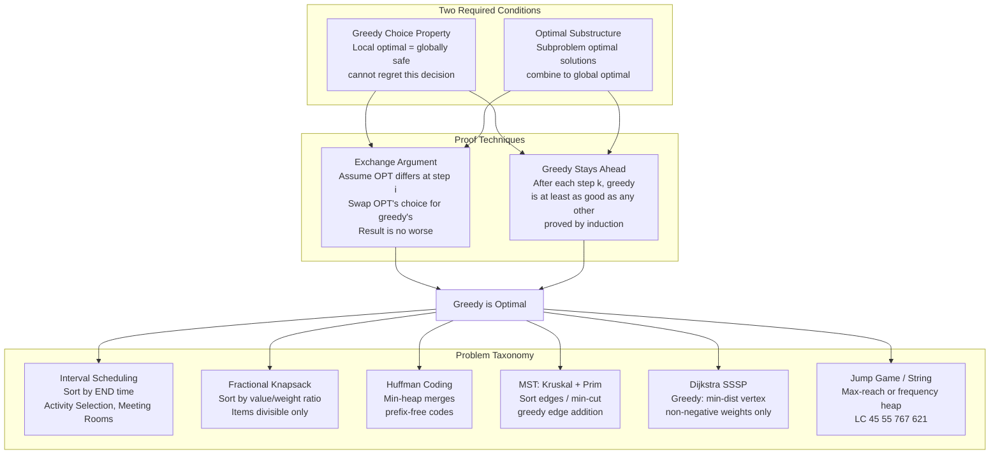

# Greedy Algorithms — DSA Patterns in Python

> [!abstract] TL;DR
> A greedy algorithm commits to the locally optimal choice at each step and never reconsiders. It is correct when two conditions hold — **greedy choice property** (local optimal is globally safe) and **optimal substructure** — and proven via the **exchange argument** or **greedy stays ahead**. Mastering greedy means recognizing the six problem families (intervals, knapsack, Huffman, MST, shortest path, jump/string) and knowing when to fall back to DP.

---

## Intuition

**Analogy:** Imagine tipping a jar of coins onto a scale to reach exactly $1.00 using US currency (quarters, dimes, nickels, pennies). An experienced cashier always picks the *largest coin that still fits* — greedy — and it works perfectly because each US denomination is a multiple of all smaller ones. Now try the same trick with coins worth 1¢, 3¢, and 4¢, targeting 6¢. The greedy picks 4 + 1 + 1 = 3 coins; the optimal is 3 + 3 = 2 coins. The greedy fails the moment the coin structure breaks the "each choice leaves the best remaining structure" property.

This is the greedy contract: **the choice made at each step must never foreclose a better global outcome**. When that property holds and you can prove it, greedy is fast and elegant. When it doesn't, reach for dynamic programming.

---

## Correctness Framework

### Two Required Conditions

**Greedy Choice Property:** The globally optimal solution can always be constructed by making locally optimal (greedy) choices. Formally: making the best choice at step `i` does not prevent reaching the global optimum. You will *never regret* a greedy decision.

**Optimal Substructure:** After making the greedy choice, the remaining subproblem has an optimal solution that can be combined with the greedy choice to produce a globally optimal solution. (Same condition DP needs — but greedy additionally requires the choice to be deterministic without exploring alternatives first.)

### Two Proof Techniques

**Exchange Argument (most common):**
1. Assume an optimal solution OPT differs from greedy solution G at step `i`.
2. Find the first position where they differ.
3. Show that "swapping" OPT's choice at position `i` for G's choice produces a solution no worse than OPT.
4. By induction, G is at least as good as OPT → G is optimal.

**Greedy Stays Ahead:**
After each step `k`, the greedy solution is at least as good as any other partial solution. Formally, measure progress with a function (e.g., intervals covered, distance reached) and prove by induction that greedy's measure is always ≥ any other algorithm's measure.

### Correctness Diagram + Problem Taxonomy



---

## Core Concepts

### 1. Greedy Choice Property: Commit Without Looking Back

The defining feature of greedy vs. DP is **whether you explore multiple choices**.

| | Greedy | Dynamic Programming |
|---|---|---|
| Decisions | Commit once, never revisit | Explore all choices, keep best |
| Proof requirement | Must prove exchange argument | Optimal substructure sufficient |
| Time complexity | O(n log n) typical | O(n²) or O(n · W) typical |
| Space | O(1) or O(n) | O(n) to O(n²) |
| Counterexample test | Find one input where greedy fails | N/A — DP explores exhaustively |

**The litmus test:** Can you find a small input (4–5 elements) where the greedy gives a suboptimal answer? If yes → DP. If you've tried hard and cannot → attempt the exchange argument.

**Canonical greedy-fails example:**

```
Coins [1, 3, 4], target = 6
Greedy (largest first): 4 + 1 + 1 = 3 coins
Optimal:                3 + 3     = 2 coins   ← greedy FAILS

Coins [1, 5, 10, 25], target = 41
Greedy (largest first): 25 + 10 + 5 + 1 = 4 coins  ← OPTIMAL
(US denominations form a matroid structure that enables greedy)
```

---

### 2. Interval Scheduling Problems

All interval problems reduce to a small set of canonical solutions. The key is identifying *which* variant you have.

**Activity Selection (maximize non-overlapping):**
Sort by **end time**. Greedily select each interval if its start ≥ `last_end`. The exchange argument: any earlier-ending interval leaves at least as much room for future picks.

**Interval Merging:**
Sort by **start time**. Merge the current interval into the last merged if `current.start ≤ last_merged.end`; else append as new. Set `last_merged.end = max(last_merged.end, current.end)` on merge (a later-starting interval may still extend further right).

**Minimum Meeting Rooms:**
Sort by **start time**. Use a min-heap of end times (one slot per room). For each new meeting: if `heap[0] ≤ start`, reuse that room (`heapreplace`); otherwise open a new room (`heappush`). The heap size at the end is the answer. Equivalently: minimum rooms = maximum number of simultaneously overlapping meetings.

**Insert Interval:**
Three-phase scan on an already-sorted list: (1) add all intervals ending before the new one, (2) merge all intervals overlapping the new one by extending bounds, (3) add all remaining. O(n), no sort needed.

**Non-overlapping Intervals (min removals):**
`min_removals = n - max_non_overlapping`. Compute max non-overlapping with activity selection, then subtract.

| Problem | Sort Key | Core Operation |
|---|---|---|
| Max non-overlapping (LC 435) | End time | Greedy selection |
| Min meeting rooms (LC 253) | Start time | Min-heap of end times |
| Merge intervals (LC 56) | Start time | Extend or append |
| Insert interval (LC 57) | Already sorted | Three-phase scan |
| Min arrows / burst balloons (LC 452) | End time | Same as max non-overlapping |

---

### 3. Jump Game Patterns

Both Jump Game problems use a "maximum reachable index" variable. The greedy insight: **reaching farther is always better than reaching closer**, so we track the frontier.

**Jump Game I (LC 55) — Can you reach the end?**
Track `max_reach`. At each index `i`, if `i > max_reach` we are stuck (return `False`). Otherwise update `max_reach = max(max_reach, i + nums[i])`.

**Jump Game II (LC 45) — Minimum jumps:**
Model as BFS levels. `current_end` is the farthest index reachable in exactly `jumps` jumps. Scan positions within `[0, current_end]`, track the global `farthest` reachable from any position in this range. When `i == current_end`, we must jump — increment `jumps`, set `current_end = farthest`.

The BFS analogy: each "level" is the set of indices reachable with exactly `k` jumps. We expand each level greedily (taking the farthest reach), which minimizes the number of levels needed.

```
nums = [2, 3, 1, 1, 4]
jumps=0, current_end=0, farthest=0

i=0: farthest = max(0, 0+2) = 2
     i == current_end(0) → jump! jumps=1, current_end=2

i=1: farthest = max(2, 1+3) = 4
     i ≠ current_end(2)

i=2: farthest = max(4, 2+1) = 4
     i == current_end(2) → jump! jumps=2, current_end=4
     current_end(4) ≥ len-1(4) → done

Answer: 2 jumps
```

---

### 4. String and Character Greedy

**Remove Duplicate Letters (LC 316):**
Build the lexicographically smallest subsequence with each letter exactly once. Use a monotonic stack + last-occurrence map. For each character: while the stack top is greater than the current character AND the stack top appears again later (last_occurrence > i), pop the stack. Push the current character if it's not already in the stack.

**Largest Number (LC 179):**
Custom sort: compare two strings `a` and `b` by whether `a+b > b+a` (concatenation comparison). This defines a total order where greedily placing the "larger combiner" first is always optimal.

**Reorganize String (LC 767):**
Rearrange characters so no two adjacent characters are the same. Greedy: at each step, place the most frequent character that is *not* the character placed in the previous position. Use a max-heap. After placing a character, "park" it as `prev` and re-add the previous `prev` to the heap so it is available again next round. Returns `""` if impossible (any character's frequency exceeds `⌈n/2⌉`).

**Task Scheduler (LC 621):**
Tasks with cooldown `n`. The minimum time is `max(len(tasks), (max_freq - 1) * (n + 1) + count_max)`. The formula: `max_freq - 1` full frames of size `n+1`, plus the last partial frame of size `count_max` (number of tasks tied at maximum frequency). The `max(...)` handles the case where tasks are dense enough to fill all idle slots naturally.

---

### 5. Scheduling and Assignment

**Assign Cookies (LC 455):**
Sort both children's greed factors and cookie sizes. Use two pointers: try to satisfy the least-greedy child with the smallest sufficient cookie. If `cookie[j] >= child[i]`, assign it and advance both pointers; otherwise only advance the cookie pointer. O(n log n).

**Two-City Scheduling (LC 1029):**
Must send exactly n people to each city. Sort by the *cost difference* `cost_A - cost_B` ascending. Send the first n (cheapest to send to A) to city A, the rest to city B. Exchange argument: if we could swap any two people (one from each city) and reduce total cost, it would contradict the sort order.

**Gas Station (LC 134):**
Can you complete the circular circuit? Key observation: if `sum(gas) >= sum(cost)` globally, a valid starting station always exists. Find it greedily: track `current_surplus = sum(gas[i] - cost[i])`. Whenever `current_surplus < 0`, we cannot start from anywhere in `[start..i]` (proven by exchange argument) — reset `start = i + 1` and `current_surplus = 0`. Return `start` if `total_surplus >= 0`, else `-1`.

---

### 6. Huffman Coding

Huffman coding assigns variable-length prefix-free binary codes to symbols based on frequency: frequent symbols get short codes, rare symbols get long codes. It minimizes expected bits per symbol.

**Algorithm:**
1. Create a leaf node for each symbol with its frequency.
2. Use a min-heap. While heap size > 1:
   - Extract the two lowest-frequency nodes (`left`, `right`).
   - Create an internal node with `freq = left.freq + right.freq`.
   - Push the internal node back.
3. Remaining node is the root. DFS to assign codes: left edge = `"0"`, right edge = `"1"`.

**Why greedy is optimal (exchange argument):**
Suppose OPT assigns the two rarest symbols (`f_min1`, `f_min2`) to positions other than the deepest. We can swap them to the deepest positions without increasing total cost: rare symbols × longer codes ≤ frequent symbols × those longer codes. Therefore the two rarest symbols should always occupy the deepest level — exactly what Huffman produces by merging them first.

**Complexity:** O(n log n) total — n leaf nodes, n-1 merges, each merge costs O(log n) heap operations.

**Real disguises:**
- "Minimum cost to connect sticks" (LC 1167) — each merge cost is the sum of the two sticks; this is exactly Huffman.
- "Minimum cost to merge files" — same structure.

---

### 7. Graph Greedy Algorithms

**Prim's MST:**
Greedy invariant: at each step, add the minimum-weight edge that crosses the cut between visited and unvisited vertices. Use a min-heap of `(weight, vertex)` pairs. Start from any vertex (weight 0). For each extracted vertex, add its edges to the heap if the neighbor is unvisited. Runs in O(E log V) with a binary heap.

**Kruskal's MST:**
Sort all edges by weight ascending. Greedily add each edge if it does not create a cycle (check via Union-Find). Stop after adding `n-1` edges. Runs in O(E log E). The cut property of MSTs guarantees correctness: the minimum-weight edge crossing any cut is always in some MST.

**Dijkstra's Shortest Path:**
Greedy invariant: the vertex with the smallest tentative distance is finalized first. Once a vertex is extracted from the min-heap, its distance is optimal (proven by the greedy stays-ahead argument with non-negative weights). Runs in O((V + E) log V).

**When greedy fails on graphs:**
- **Negative edge weights:** Dijkstra is incorrect — a later discovery of a negative edge could improve a "finalized" distance. Use Bellman-Ford O(VE) instead.
- **Maximum spanning tree:** Same structure as MST, just reverse the sort (or negate weights).
- **Shortest path with constraints:** (e.g., "at most k edges") — greedy fails; use DP on states.

| Algorithm | Greedy? | Handles Neg. Weights? | Time |
|---|---|---|---|
| Dijkstra | Yes | No | O((V+E) log V) |
| Bellman-Ford | No (DP) | Yes | O(VE) |
| Prim's MST | Yes | N/A | O(E log V) |
| Kruskal's MST | Yes | N/A | O(E log E) |

---

### 8. Fractional Knapsack

Items have weights and values. The knapsack has capacity `W`. **Items are divisible** — you can take a fraction of any item.

**Algorithm:** Sort items by `value/weight` ratio descending. Greedily take each item in full until the capacity is exhausted; take a fractional portion of the last item that fits.

**Why greedy is optimal:** Exchange argument — suppose OPT allocates less of item `i` (highest ratio) and more of item `j` (lower ratio). Swapping `x` units from item `j` to item `i` increases value by `x * (ratio_i - ratio_j) > 0`. Contradiction → OPT must allocate maximum possible to the highest-ratio items first.

**0/1 Knapsack — greedy fails:** When items are indivisible (take all or nothing), the greedy by ratio may waste capacity. Example: W=10, items [(value=6, weight=3), (value=10, weight=7)]. Greedy by ratio takes item 1 (ratio=2.0) getting value=6, leaving 7 capacity — but item 2 doesn't fit. Optimal: take item 2 for value=10. Use DP (O(n·W)) for 0/1 knapsack.

```
Fractional Knapsack — Greedy WORKS  (items splittable)
0/1 Knapsack       — DP REQUIRED    (items indivisible)
```

---

### 9. Two-Pointer as Greedy

Many two-pointer problems are greedy decisions at each step — which pointer to move is determined by a local optimality criterion.

**Container With Most Water (LC 11):**
Two pointers at opposite ends. Area = `min(height[L], height[R]) * (R - L)`. Greedy: always move the pointer with the **smaller height** inward. Why: moving the taller side can only decrease `R-L` while not increasing `min(height)`. Moving the shorter side might find a taller wall, increasing area.

**Trapping Rain Water (LC 42):**
Two pointers. At each step, process the side with the smaller max boundary (`max_left` or `max_right`). Water trapped at position `i` = `max_boundary - height[i]` (if positive). Greedy: the trapped water on the shorter side is fully determined by its own boundary (the other side is guaranteed to be higher); move that pointer inward.

**Valid Parenthesis String (LC 678):**
`*` can be `(`, `)`, or empty. Greedy: track a range `[min_open, max_open]` — the minimum and maximum possible count of unmatched open parentheses. For `(`: both +1. For `)`: both -1. For `*`: `min_open -= 1`, `max_open += 1`. If `max_open < 0` at any point → impossible. At the end, return `min_open == 0`.

---

### 10. The Exchange Argument Template

When asked to **prove** a greedy algorithm is correct on a whiteboard or in an interview, use this template:

```
Exchange Argument Template
──────────────────────────
1. Definitions
   Let G = greedy solution, OPT = any optimal solution.
   Assume G ≠ OPT (otherwise we're done).

2. Find the first divergence
   Let i be the first index/step where G and OPT differ.
   G chooses element g_i; OPT chooses element opt_i.
   By greedy choice property, g_i is locally optimal.

3. Construct OPT'
   Swap opt_i for g_i in OPT, adjusting OPT minimally
   to accommodate this change.

4. Show OPT' is no worse than OPT
   Prove: value(OPT') ≥ value(OPT)   [or cost(OPT') ≤ cost(OPT)]
   Key: the greedy property guarantees g_i "fits" at least as well.

5. Inductive step
   OPT' now agrees with G on step i.
   Apply the argument inductively to the next divergence.

6. Conclusion
   After finite steps, OPT can be transformed to G without worsening.
   Therefore G is optimal.
```

**Activity selection exchange argument (concrete):**
- G chose the earliest-ending interval `g_1`; OPT chose `opt_1` (different, so `g_1.end ≤ opt_1.end`).
- Replace `opt_1` with `g_1` in OPT. Since `g_1.end ≤ opt_1.end`, every interval compatible with `opt_1` in OPT is still compatible with `g_1`.
- OPT' has the same number of intervals as OPT. Apply inductively.

---

## Code Demo

```python
import heapq
from collections import Counter
from typing import Optional


# ─────────────────────────────────────────────────────────────────────────────
# 1. MINIMUM MEETING ROOMS (LeetCode 253)
#    Greedy: sort by start time; min-heap tracks end times of active rooms.
#    Reuse earliest-ending room if it frees before new meeting starts.
#    Time: O(n log n)  Space: O(n)
# ─────────────────────────────────────────────────────────────────────────────
def min_meeting_rooms(intervals: list[list[int]]) -> int:
    if not intervals:
        return 0
    intervals.sort(key=lambda x: x[0])   # sort by start time
    heap: list[int] = []                  # min-heap of end times (one per active room)

    for start, end in intervals:
        if heap and heap[0] <= start:
            # Earliest-ending room is free; reuse it (replace its end time)
            heapq.heapreplace(heap, end)
        else:
            # All rooms are occupied; open a new one
            heapq.heappush(heap, end)

    return len(heap)   # rooms still in heap = minimum rooms needed


# ─────────────────────────────────────────────────────────────────────────────
# 2. REORGANIZE STRING (LeetCode 767)
#    Greedy with max-heap: place most-frequent char that isn't the last one placed.
#    "Park" the previous char outside the heap for one round, then re-add it.
#    Time: O(n log k)  Space: O(k)   k = distinct chars (at most 26)
# ─────────────────────────────────────────────────────────────────────────────
def reorganize_string(s: str) -> str:
    freq = Counter(s)
    # Negate counts: Python heapq is a min-heap; negate simulates max-heap.
    heap = [(-cnt, char) for char, cnt in freq.items()]
    heapq.heapify(heap)

    result: list[str] = []
    prev_neg_cnt: int = 0    # negated count of the previously placed char
    prev_char: str = ""      # the char placed in the immediately prior position

    while heap:
        neg_cnt, char = heapq.heappop(heap)
        result.append(char)

        # Re-add the previous char to the heap now that it is no longer "last"
        if prev_neg_cnt < 0:   # prev_neg_cnt < 0 means there are remaining copies
            heapq.heappush(heap, (prev_neg_cnt, prev_char))

        # Park current char: neg_cnt + 1 because counts are negative (one copy used)
        prev_neg_cnt = neg_cnt + 1
        prev_char = char

    # If we placed all n characters, the rearrangement is valid
    return "".join(result) if len(result) == len(s) else ""


# ─────────────────────────────────────────────────────────────────────────────
# 3. JUMP GAME II (LeetCode 45)
#    BFS-level greedy: treat reachable positions as levels.
#    At each level boundary, jump and extend the frontier to the farthest reach.
#    Time: O(n)  Space: O(1)
# ─────────────────────────────────────────────────────────────────────────────
def jump_game_ii(nums: list[int]) -> int:
    jumps = 0
    current_end = 0    # farthest index reachable with exactly 'jumps' jumps
    farthest = 0       # farthest index reachable from any position in current level

    # No need to jump FROM the last index; stop one step before
    for i in range(len(nums) - 1):
        farthest = max(farthest, i + nums[i])
        if i == current_end:       # exhausted all positions at this jump count
            jumps += 1
            current_end = farthest
            if current_end >= len(nums) - 1:
                break              # already reached or passed the last index

    return jumps


# ─────────────────────────────────────────────────────────────────────────────
# 4. HUFFMAN ENCODING FROM SCRATCH
#    Greedy: always merge the two lowest-frequency nodes.
#    Exchange argument proves that rarest symbols must be deepest → optimal codes.
#    Time: O(n log n)  Space: O(n)
# ─────────────────────────────────────────────────────────────────────────────
class _HNode:
    """Huffman tree node. Defines __lt__ by frequency for heap ordering."""
    __slots__ = ("freq", "char", "left", "right")

    def __init__(self, freq: int, char: Optional[str] = None,
                 left: Optional["_HNode"] = None,
                 right: Optional["_HNode"] = None) -> None:
        self.freq = freq
        self.char = char
        self.left = left
        self.right = right

    def __lt__(self, other: "_HNode") -> bool:
        return self.freq < other.freq   # enables heapq comparisons


def huffman_codes(text: str) -> dict[str, str]:
    """Build a Huffman code table from input text. Returns {char: binary_str}."""
    freq_map = Counter(text)
    if len(freq_map) == 1:
        return {next(iter(freq_map)): "0"}   # edge case: single unique symbol

    heap = [_HNode(freq, char) for char, freq in freq_map.items()]
    heapq.heapify(heap)                       # O(n) initial heapify

    # Merge step: n-1 merges, each O(log n)
    while len(heap) > 1:
        left = heapq.heappop(heap)    # lowest frequency node
        right = heapq.heappop(heap)   # second lowest frequency node
        merged = _HNode(freq=left.freq + right.freq, left=left, right=right)
        heapq.heappush(heap, merged)

    root = heap[0]
    codes: dict[str, str] = {}

    def _assign(node: Optional[_HNode], path: str) -> None:
        """DFS traversal: left edge = '0', right edge = '1'."""
        if node is None:
            return
        if node.char is not None:       # leaf node: record the code
            codes[node.char] = path
            return
        _assign(node.left, path + "0")
        _assign(node.right, path + "1")

    _assign(root, "")
    return codes


def huffman_encode(text: str) -> tuple[str, dict[str, str]]:
    """Encode text to a Huffman binary string. Returns (encoded_bits, code_table)."""
    codes = huffman_codes(text)
    return "".join(codes[ch] for ch in text), codes


def huffman_decode(encoded: str, codes: dict[str, str]) -> str:
    """Decode a Huffman binary string given the code table."""
    reverse = {v: k for k, v in codes.items()}
    result: list[str] = []
    buf = ""
    for bit in encoded:
        buf += bit
        if buf in reverse:
            result.append(reverse[buf])
            buf = ""
    return "".join(result)


# ─────────────────────────────────────────────────────────────────────────────
# QUICK TESTS
# ─────────────────────────────────────────────────────────────────────────────
if __name__ == "__main__":
    # 1. Minimum meeting rooms
    assert min_meeting_rooms([[0, 30], [5, 10], [15, 20]]) == 2   # rooms: [0-30], [5-10,15-20]
    assert min_meeting_rooms([[7, 10], [2, 4]]) == 1              # no overlap

    # 2. Reorganize string
    r = reorganize_string("aab")
    assert r == "aba", f"Expected 'aba', got '{r}'"
    assert reorganize_string("aaab") == ""   # impossible: 'a' needs 3 of 4 slots

    # 3. Jump Game II
    assert jump_game_ii([2, 3, 1, 1, 4]) == 2
    assert jump_game_ii([2, 3, 0, 1, 4]) == 2
    assert jump_game_ii([0]) == 0              # already at end

    # 4. Huffman encode/decode round-trip
    text = "abracadabra"
    encoded, codes = huffman_encode(text)
    assert huffman_decode(encoded, codes) == text
    # Compression check: should use fewer bits than 8-bit ASCII
    ascii_bits = len(text) * 8
    assert len(encoded) < ascii_bits, f"{len(encoded)} >= {ascii_bits}"
    print(f"Huffman codes:  {codes}")
    print(f"Encoded length: {len(encoded)} bits  (ASCII: {ascii_bits} bits, "
          f"{100 * len(encoded) // ascii_bits}% of original)")

    print("All tests passed.")
```

---

## Real-World Example

> **Example — Apache Kafka partition assignment:** Kafka's default partition assignment algorithm uses a greedy round-robin strategy — it assigns partitions to brokers in order, balancing load by always assigning the next partition to the broker with the fewest current assignments. This is the same greedy "assign to least-loaded" strategy as the meeting rooms problem: a new partition is the "meeting," brokers are "rooms," and the min-heap tracks current load per broker. The greedy is provably optimal for minimizing maximum load when all partitions are equal in weight.

> **Example — Dijkstra in Google Maps:** Google Maps uses Dijkstra (or A* which is Dijkstra with a heuristic) to find shortest routes. The greedy "always finalize the nearest unvisited node" is correct because road distances are non-negative. On toll roads with negative effective costs (credit-back scenarios), the greedy cannot be used — those require Bellman-Ford.

> **Example — GZIP/ZIP compression:** Both use Huffman coding as the entropy coding stage. After the LZ77 back-reference encoding pass, character and length/distance pair frequencies are computed and Huffman trees are built. The Huffman stage alone typically reduces output by 15–25% compared to fixed-width encoding, exploiting the exact greedy-optimal property of minimum expected code length.

---

## Trade-offs

| Aspect | Greedy | Dynamic Programming |
|--------|--------|---------------------|
| **Correctness guarantee** | Only when exchange argument holds | Always correct if recurrence is right |
| **Time complexity** | O(n log n) or O(n) typical | O(n²) to O(n · W) typical |
| **Space** | O(1) to O(n) | O(n) to O(n²) |
| **When applicable** | Greedy choice property provable | Optimal substructure only |
| **Coin change (arbitrary)** | Wrong — no exchange arg | Correct — O(n · amount) |
| **Coin change (canonical)** | Correct — O(n) | Correct but overkill |
| **0/1 Knapsack** | Wrong — indivisible items | Correct — O(n · W) |
| **Fractional Knapsack** | Correct — O(n log n) | Correct but unnecessary |
| **Activity Selection** | Correct — O(n log n) | Correct but O(n²) |

| Aspect | Greedy Interval Scheduling | Sweep Line |
|--------|---------------------------|------------|
| **Min meeting rooms** | O(n log n) — min-heap | O(n log n) — event sort |
| **Tie-breaking** | Heap handles automatically | Must break start/end ties manually |
| **Flexibility** | Per-interval decisions | Easy to add capacity constraints |
| **Memory** | O(n) heap | O(n) event list |

| Concern | Impact on Greedy |
|---------|-----------------|
| **Sorting cost** | The O(n log n) sort is the dominant cost in most greedy algorithms; without it, greedy logic is O(n). If input is pre-sorted, greedy runs in O(n). |
| **Heap operations** | Each push/pop is O(log n). Problems using a heap (Meeting Rooms, Huffman, Dijkstra) have O(n log n) or O(E log V) due to heap, not sorting. |
| **No sorting or heap** | Pure greedy scans (Jump Game, Gas Station) run in O(n) with O(1) space — the best possible. |

---

## When to Use vs Avoid

**Use greedy when:**
- You can prove the exchange argument or greedy stays ahead for the problem.
- Items are divisible (fractional knapsack, fractional assignment).
- The problem has a natural "earliest/smallest/largest first" ordering that is clearly optimal.
- A small adversarial example does not break the greedy.
- The problem involves intervals, MST, SSSP with non-negative weights, or Huffman-style merging.
- Time constraints demand O(n log n) rather than O(n²) DP.

**Avoid greedy when:**
- Items are indivisible and the best combination is non-obvious (0/1 knapsack → DP).
- Coin denominations are arbitrary (coin change → DP; greedy only works for canonical systems like US denominations).
- Edge weights can be negative (Dijkstra → Bellman-Ford).
- You need to count or enumerate all optimal solutions (DP).
- A small counterexample breaks the greedy — trust the counterexample, switch to DP.
- The problem requires revisiting past decisions (backtracking or DP).

---

## Common Pitfalls

- **Applying greedy to 0/1 knapsack** — the most expensive mistake. Greedy by value/weight ratio is correct for fractional knapsack but provably wrong when items are indivisible. Always ask: "Can I take a fraction of this item?" If no → use DP (see [[Knapsack_01]]).

- **Sorting by start time instead of end time for activity selection** — sorting by start time does not yield maximum non-overlapping intervals. Example: interval `[0, 100]` starts first but blocks all others. Sorting by end time is the only correct ordering; the exchange argument breaks for any other criterion.

- **Greedy coin change on non-canonical denominations** — greedy (pick largest coin that fits) is optimal for US denominations (1, 5, 10, 25) because each coin is approximately a multiple of smaller ones. For arbitrary denominations like `[1, 3, 4]`, greedy fails. Always use DP for coin change problems in interviews (see [[Coin_Change]]).

- **Confusing MST with shortest path** — Prim's and Kruskal's minimize total edge weight to span all nodes. Dijkstra finds minimum-distance paths from a single source. They solve different problems and should never be substituted for each other.

- **Using Dijkstra with negative weights** — Dijkstra finalizes a vertex's distance on first extraction. A negative edge discovered later could improve that distance, but Dijkstra never re-processes finalized vertices. Use Bellman-Ford (see [[Bellman_Ford]]) for graphs with negative edges.

- **Off-by-one in the Jump Game II loop bound** — the loop runs `for i in range(len(nums) - 1)`, not `range(len(nums))`. Jumping *from* the last index is unnecessary and leads to an extra jump count. Always exclude the last position from the loop.

- **Not re-adding the previous character in Reorganize String** — the critical step after placing `char` is to park it as `prev` and re-add it to the heap only on the *next* iteration. Forgetting the re-add causes valid arrangements to return `""` incorrectly.

- **Heap comparisons failing for equal frequencies in Huffman** — when two `_HNode` objects have equal frequency, Python's heapq falls back to comparing the objects themselves. Always define `__lt__` on the node class. If you use tuples `(freq, char)` instead of nodes, ensure the second element is comparable (string characters are).

---

## Related Concepts

- [[Greedy_Fundamentals]] — the two correctness conditions, exchange argument proof structure, and greedy vs DP decision guide; this note is the Python-focused companion
- [[Greedy_Patterns]] — catalog of all 6 greedy families with code for each; read before tackling a new greedy problem to identify the pattern
- [[Activity_Selection]] — deep dive into the interval scheduling family: activity selection, merge intervals, meeting rooms I and II, insert interval, min arrows
- [[Huffman_Coding]] — full Huffman implementation with the CLRS example, encode/decode pipeline, and prefix-free code theory
- [[DP_Fundamentals]] — the fallback when greedy choice property cannot be proven; DP explores all subproblems where greedy commits to one
- [[Knapsack_01]] — the canonical example where greedy fails and DP is required; items are indivisible
- [[Coin_Change]] — another greedy-fails DP problem; greedy only works for canonical coin systems
- [[Dijkstra]] — greedy shortest path: always finalize minimum-distance unvisited vertex; requires non-negative weights
- [[Minimum_Spanning_Tree]] — Kruskal's and Prim's greedy MST algorithms; Kruskal uses [[Union_Find]] for cycle detection
- [[Bellman_Ford]] — the DP-based SSSP that handles negative weights; use when Dijkstra's greedy precondition fails
- [[Priority_Queue]] — Python's `heapq` module mechanics; underpins Meeting Rooms, Huffman, Dijkstra, Prim's, and Reorganize String
- [[Monotonic_Stack]] — a related greedy structure: resolve "next greater element" immediately when the monotone invariant breaks
- [[Two_Pointers]] — opposite-end two-pointer problems (Container With Most Water, Trapping Rain Water) are greedy: always move the smaller-bounded pointer
- [[Merge_Intervals]] — interval merging sort-and-scan, a prerequisite for understanding the interval scheduling family
- [[Arrays_and_Strings]] — peer note covering two-pointer, sliding window, and prefix sum patterns in Python

---

## Review Questions

1. **Outline the exchange argument proof for Activity Selection** (sort by end time, greedily pick earliest-ending compatible interval). Be specific: what two solutions are you comparing, what "exchange" are you performing at step `i`, and why does the resulting solution have at least as many intervals as OPT?

2. **Why must interval scheduling problems (maximize non-overlapping) sort by end time rather than start time?** Construct a concrete counterexample — a set of 3–4 intervals — where sorting by start time and applying the same greedy logic yields a suboptimal answer.

3. **You are given an arbitrary coin denomination set `[1, 6, 10]` and target `12`. Show that the greedy (largest coin first) gives the wrong answer, then explain why the same greedy is correct for US denominations `[1, 5, 10, 25]`.** What structural property of US denominations enables greedy correctness?

4. **Compare Prim's MST and Kruskal's MST in terms of greedy invariant, data structure used, and the class of graphs where each is preferred.** Both are provably correct via the MST cut property — state the cut property and explain how it justifies adding the minimum-weight edge crossing any cut.

---

## Sources

- [LeetCode 253 — Meeting Rooms II](https://leetcode.com/problems/meeting-rooms-ii/)
- [LeetCode 767 — Reorganize String](https://leetcode.com/problems/reorganize-string/)
- [LeetCode 45 — Jump Game II](https://leetcode.com/problems/jump-game-ii/)
- [LeetCode 55 — Jump Game](https://leetcode.com/problems/jump-game/)
- [LeetCode 435 — Non-overlapping Intervals](https://leetcode.com/problems/non-overlapping-intervals/)
- [LeetCode 1167 — Minimum Cost to Connect Sticks](https://leetcode.com/problems/minimum-cost-to-connect-sticks/)
- [NeetCode — Greedy Playlist](https://neetcode.io/roadmap)
- CLRS Chapter 16 — Greedy Algorithms (Activity Selection, Huffman Codes)
- Kleinberg & Tardos, *Algorithm Design* Chapter 4 — Greedy Algorithms (interval scheduling, exchange argument framework)

---

#dsa #greedy #algorithms #python #leetcode #intervals
