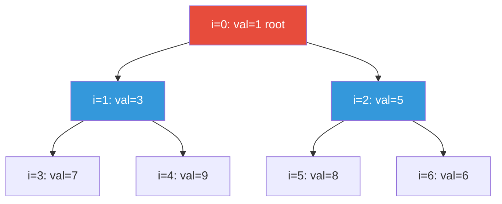
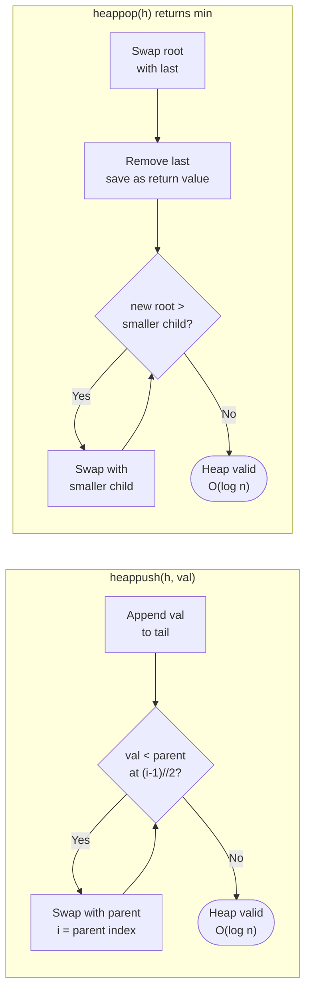
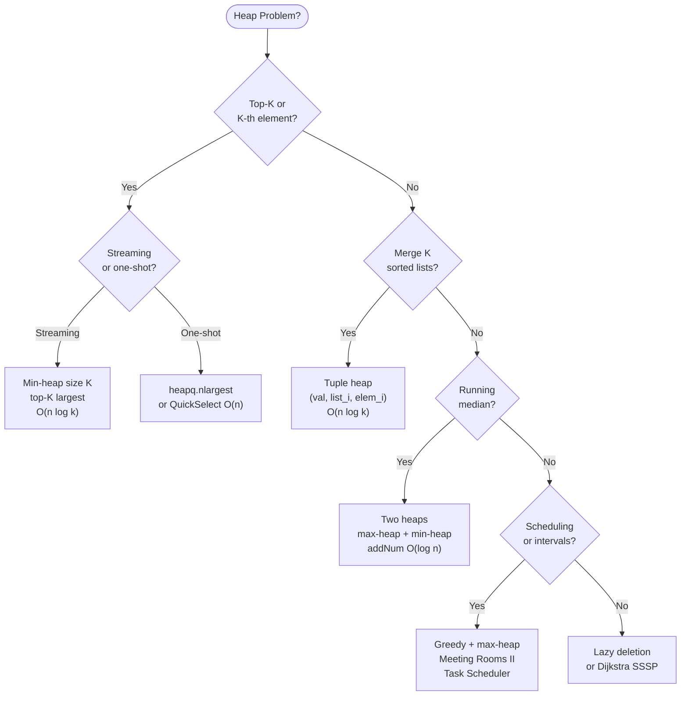

# Heaps and Priority Queues — DSA Patterns in Python

> [!abstract] TL;DR
> Python's `heapq` module wraps a binary min-heap into a plain list. Six recurring patterns — top-K, merge K sorted, median stream, lazy deletion, task scheduling, and Dijkstra — share one insight: the heap gives you the cheapest next choice in O(log n) without sorting the whole collection.

---

## Intuition

**Analogy:** Think of a hospital emergency room. Patients don't get seen in arrival order — a triage nurse constantly picks whoever is most critical right now. When a new patient arrives, they are ranked and slotted in. When the doctor calls "next," the most urgent patient steps forward without scanning the entire waiting room. That instant access to "who's most urgent" is exactly what a heap provides.

The heap is not a sorted list. It makes one guarantee: the most extreme element (minimum or maximum) is always at the root and reachable in O(1). Everything else is loosely ordered enough to restore that guarantee in O(log n) after each insert or removal.

---

## How It Works

### Heap Structure and Array Representation

A binary heap is a **complete binary tree** stored in a flat array. For a node at 0-indexed position `i`:

| Relationship | Formula |
|---|---|
| Parent | `(i - 1) // 2` |
| Left child | `2 * i + 1` |
| Right child | `2 * i + 2` |

**Min-heap property:** Every parent's value is less than or equal to both children's values. The global minimum is always at index 0.



Array: `[1, 3, 5, 7, 9, 8, 6]` — index 0 is the root; indices 1–2 are level 1; indices 3–6 are level 2.

The **complete binary tree** property (all levels full except possibly the last, filled left-to-right) guarantees no gaps in the array, making the index formulas exact.

---

### heappush and heappop Mechanics

**heappush (sift-up):** Append the new element to the end of the array. Repeatedly compare it with its parent at `(i-1)//2`; if smaller, swap and move up. Stop when the heap property is restored.

**heappop (sift-down):** Swap the root with the last element; shrink the array by one (saving the old root as the return value). Repeatedly compare the new root with its two children; swap with the smaller child if it is smaller than the current node. Stop when restored.



---

### The heapq Module

Python's `heapq` operates on a plain `list` in-place. There is no `Heap` class — the list IS the heap after `heapify` is called on it.

| Operation | Call | Time | Notes |
|---|---|---|---|
| Insert | `heapq.heappush(h, item)` | O(log n) | Sift-up from tail |
| Extract min | `heapq.heappop(h)` | O(log n) | Sift-down from root |
| Peek min | `h[0]` | O(1) | Direct index; do not use `heappop` just to peek |
| Push then pop | `heapq.heappushpop(h, item)` | O(log n) | Pushes item first; if item is the new min, returns it immediately without modifying the heap |
| Pop then push | `heapq.heapreplace(h, item)` | O(log n) | Always pops the current min first, then pushes item; undefined on empty heap |
| Build from list | `heapq.heapify(h)` | O(n) | Floyd's bottom-up algorithm; NOT O(n log n) |
| K smallest | `heapq.nsmallest(k, iterable, key=fn)` | O(n log k) | Prefer `sorted()` when k is close to n |
| K largest | `heapq.nlargest(k, iterable, key=fn)` | O(n log k) | Same trade-off |

> [!warning] heappushpop vs heapreplace — not interchangeable
> `heappushpop(h, x)` pushes `x` first, then pops — if `x` is already the new minimum it returns `x` immediately without a sift-down. `heapreplace(h, x)` pops the current minimum **first** regardless of `x`, then pushes `x`. In a fixed-size sliding-window heap, using the wrong one produces silent off-by-one errors.

---

### Max-Heap Trick

Python only provides a min-heap. Simulate a max-heap by **negating values on push and negating again on pop**.

```python
import heapq

max_heap: list[int] = []
heapq.heappush(max_heap, -5)    # push 5 as -5
heapq.heappush(max_heap, -1)    # push 1 as -1
heapq.heappush(max_heap, -3)    # push 3 as -3

largest = -heapq.heappop(max_heap)   # pops -5 (min), negate -> 5
# largest == 5
```

This works for any numeric type. For custom objects, read the next section.

---

### Heap with Custom Objects

When heap elements are tuples, Python compares them **lexicographically**: first element, then second, and so on. If two elements tie at some position and the next position holds an incomparable type (e.g., a `ListNode`), Python raises `TypeError: '<' not supported`.

**Solution: monotonic counter as tiebreaker.**

```python
import heapq
import itertools

_counter = itertools.count()     # generates 0, 1, 2, … without repeat

heap: list = []
# (priority, unique_id, item) — id is always unique so item is NEVER compared
heapq.heappush(heap, (priority, next(_counter), item))
```

**Alternative: `@dataclass(order=True)` with `field(compare=False)`**

```python
from dataclasses import dataclass, field

@dataclass(order=True)
class Task:
    priority: int                          # used for heap comparison
    name: str    = field(compare=False)    # excluded from comparisons
    payload: object = field(compare=False) # excluded from comparisons
```

---

## Pattern Taxonomy



---

## Core Patterns

### Pattern 1 — Top-K Problems

**Goal:** Find the K largest (or smallest) elements from a stream or large array, without sorting everything.

**Key insight:** Maintain a min-heap of size exactly K. The root is the **smallest among the top-K candidates** — the sentinel that evicts any element too small to belong. After processing all N elements, the heap contains exactly the K largest.

```python
import heapq

def top_k_largest(nums: list[int], k: int) -> list[int]:
    """Min-heap of size k. O(n log k) time, O(k) space."""
    heap: list[int] = []
    for num in nums:
        heapq.heappush(heap, num)
        if len(heap) > k:
            heapq.heappop(heap)   # evict the smallest; survivors are the top-k
    return heap                   # unsorted; contains the k largest values


def find_kth_largest(nums: list[int], k: int) -> int:
    """LeetCode 215. heap[0] is the kth largest after processing all elements."""
    heap: list[int] = []
    for num in nums:
        heapq.heappush(heap, num)
        if len(heap) > k:
            heapq.heappop(heap)
    return heap[0]


def top_k_frequent(nums: list[int], k: int) -> list[int]:
    """LeetCode 347. Count frequencies; pick top-k by frequency."""
    from collections import Counter
    freq = Counter(nums)
    return heapq.nlargest(k, freq, key=freq.get)
```

**When heap beats sort:** For N = 10^7 and K = 10, the heap does O(N log K) ≈ 3.3 × 10^7 operations versus sort's O(N log N) ≈ 2.3 × 10^8. Roughly 7× faster. When K ≈ N, use `sorted()` — Timsort's cache efficiency beats a heap's random-access pattern.

---

### Pattern 2 — Merge K Sorted Lists/Arrays

**Goal:** Merge K sorted sequences into one sorted sequence in O(n log k) time.

**Key insight:** A naive scan across all K front-pointers costs O(K) per extraction, giving O(n·K) total. A min-heap reduces the per-extraction cost to O(log K).

Heap tuple: `(value, list_index, element_index)`. The `list_index` breaks ties so Python never attempts to compare underlying node objects (which would raise `TypeError`).

**Time: O(n log k)** — n total elements, k lists.
**Space: O(k)** — at most one entry per list in the heap at any time.

---

### Pattern 3 — Median of Data Stream

**Goal:** Find the running median after each insertion in O(1), with O(log n) insertions.

**Key insight:** Split the data at the median into two halves. The **lower half** lives in a max-heap (`lo`) and the **upper half** in a min-heap (`hi`). The median is derivable from the tops of both heaps in O(1) — no scanning needed.

**Invariant A (ordering):** `max(lo) <= min(hi)` at all times.
**Invariant B (sizing):** `len(lo) == len(hi)` or `len(lo) == len(hi) + 1`.

```
Stream so far: [1, 2, 4, 5, 7, 9]

 lo (max-heap)     |    hi (min-heap)
 negated: -4, -2, -1    5, 7, 9
 actual:   4,  2,  1    5, 7, 9
 top = 4                top = 5

 Median = (4 + 5) / 2 = 4.5
```

When the total count is odd, `lo` holds one extra element and its top IS the median.

---

### Pattern 4 — Task Scheduling and Interval Problems

**Meeting Rooms II (LeetCode 253):** Minimum number of conference rooms required.

```python
import heapq

def min_meeting_rooms(intervals: list[list[int]]) -> int:
    """
    Sort by start time. Min-heap of end times tracks when each room next frees up.
    Greedy: reuse whichever room ends earliest, if it frees up before the new meeting.
    Time: O(n log n)  Space: O(n)
    """
    if not intervals:
        return 0
    intervals.sort(key=lambda x: x[0])
    rooms: list[int] = []            # min-heap of end times
    for start, end in intervals:
        if rooms and rooms[0] <= start:
            heapq.heapreplace(rooms, end)   # room freed; reassign it
        else:
            heapq.heappush(rooms, end)      # need a new room
    return len(rooms)
```

`heapreplace` atomically pops the earliest-ending room and pushes the new end time — one call instead of a pop then push pair.

---

### Pattern 5 — Lazy Deletion

**Problem:** Standard heaps don't support O(log n) arbitrary deletion. You can't find a specific element in O(1) — you'd have to scan the whole array.

**Solution:** Mark items as "deleted" in a separate set. On every `heappop`, skip any element that is in the deleted set (a "tombstone"). The amortized cost remains O(log n).

```python
import heapq

class LazyHeap:
    """Min-heap with O(log n) amortized arbitrary deletion via tombstones."""

    def __init__(self) -> None:
        self._heap: list[int] = []
        self._deleted: set[int] = set()

    def push(self, val: int) -> None:
        heapq.heappush(self._heap, val)

    def delete(self, val: int) -> None:
        self._deleted.add(val)           # O(1): mark, do not touch the heap

    def pop(self) -> int:
        self._clear_tombstones()
        return heapq.heappop(self._heap)

    def peek(self) -> int:
        self._clear_tombstones()
        return self._heap[0]

    def _clear_tombstones(self) -> None:
        while self._heap and self._heap[0] in self._deleted:
            self._deleted.discard(self._heap[0])
            heapq.heappop(self._heap)
```

**Priority update pattern:** To change an element's priority, push it again with the new priority and mark the old entry as deleted. The new (correct) entry surfaces first; the old entry is silently discarded when it reaches the top.

**Amortized analysis:** Each element is pushed at most once and popped at most twice (once as a tombstone drain, once as a real pop). Total work across all operations is O(n log n), giving O(log n) amortized per operation.

> [!warning] Tombstone leak
> In a long-running process, the `_deleted` set grows without being cleaned. If `len(_deleted) > len(_heap) // 2`, rebuild the heap from scratch: `heapq.heapify([x for x in _heap if x not in _deleted])` and clear `_deleted`.

---

### sortedcontainers.SortedList

For problems requiring heap operations **plus** O(log n) arbitrary deletion or rank queries, Python's `sortedcontainers.SortedList` is a powerful alternative. It is available on LeetCode.

```python
from sortedcontainers import SortedList

sl = SortedList([3, 1, 4, 1, 5])
sl.add(2)               # O(log n) insert
sl.remove(4)            # O(log n) removal by value (raises ValueError if absent)
sl.discard(99)          # O(log n) removal if present, no-op otherwise
sl[0]                   # O(1) minimum
sl[-1]                  # O(1) maximum
sl.bisect_left(3)       # O(log n) index of leftmost insertion point for 3
sl.index(5)             # O(log n) index of value 5
```

`SortedList` maintains sorted order via a block-based internal structure (not a heap). It gives O(log n) insert, delete, and search — at the cost of a higher constant factor than `heapq` for pure push/pop workloads.

> [!warning] Not in the standard library
> `SortedList` is NOT part of Python's stdlib. It is available in LeetCode's Python environment but may not be present in custom production environments. Always confirm availability before using it in an interview.

---

## Code Demo

```python
import heapq
from collections import Counter, deque
from typing import Optional
import itertools

# ─────────────────────────────────────────────────────────────────────────────
# 1. MEDIAN OF DATA STREAM (LeetCode 295)
#    Two heaps split data at the median: lo (max-heap) holds the lower half,
#    hi (min-heap) holds the upper half.
#    addNum: O(log n)  |  findMedian: O(1)
# ─────────────────────────────────────────────────────────────────────────────
class MedianFinder:
    def __init__(self) -> None:
        self.lo: list[int] = []   # max-heap: store negated values
        self.hi: list[int] = []   # min-heap: store actual values

    def addNum(self, num: int) -> None:
        # Step 1: push into lo (lower-half max-heap)
        heapq.heappush(self.lo, -num)

        # Step 2: enforce ordering — max(lo) must be <= min(hi)
        if self.hi and -self.lo[0] > self.hi[0]:
            heapq.heappush(self.hi, -heapq.heappop(self.lo))

        # Step 3: enforce sizing — lo may have at most one extra element
        if len(self.lo) > len(self.hi) + 1:
            heapq.heappush(self.hi, -heapq.heappop(self.lo))
        elif len(self.hi) > len(self.lo):
            heapq.heappush(self.lo, -heapq.heappop(self.hi))

    def findMedian(self) -> float:
        if len(self.lo) > len(self.hi):
            return float(-self.lo[0])              # odd count: lo holds the middle
        return (-self.lo[0] + self.hi[0]) / 2.0   # even count: average of two middles


# ─────────────────────────────────────────────────────────────────────────────
# 2. MERGE K SORTED LINKED LISTS (LeetCode 23)
#    Heap tuple (val, counter, node) — counter prevents ListNode comparison.
#    Time: O(n log k)  Space: O(k)
# ─────────────────────────────────────────────────────────────────────────────
class ListNode:
    def __init__(self, val: int = 0, next: "Optional[ListNode]" = None):
        self.val = val
        self.next = next

def merge_k_lists(lists: list[Optional[ListNode]]) -> Optional[ListNode]:
    dummy = ListNode(0)
    current = dummy
    heap: list[tuple[int, int, ListNode]] = []
    counter = itertools.count()

    for node in lists:
        if node:
            heapq.heappush(heap, (node.val, next(counter), node))

    while heap:
        _, _, node = heapq.heappop(heap)
        current.next = node
        current = current.next
        if node.next:
            heapq.heappush(heap, (node.next.val, next(counter), node.next))

    return dummy.next


# ─────────────────────────────────────────────────────────────────────────────
# 3. TASK SCHEDULER (LeetCode 621)
#    Greedy: at each time unit, run the highest-frequency available task.
#    Max-heap of task counts (negated) + cooldown deque.
#    Time: O(t) where t is the answer  Space: O(1) — at most 26 task types
# ─────────────────────────────────────────────────────────────────────────────
def task_scheduler(tasks: list[str], n: int) -> int:
    freq = Counter(tasks)
    max_heap = [-cnt for cnt in freq.values()]
    heapq.heapify(max_heap)

    time = 0
    cooldown: deque[tuple[int, int]] = deque()   # (available_at, neg_count)

    while max_heap or cooldown:
        time += 1

        # Release any task whose cooldown expired at or before this time unit
        if cooldown and cooldown[0][0] <= time:
            heapq.heappush(max_heap, cooldown.popleft()[1])

        if max_heap:
            neg_cnt = heapq.heappop(max_heap) + 1    # execute once: count drops by 1
            if neg_cnt < 0:                           # task still has remaining copies
                cooldown.append((time + n + 1, neg_cnt))
        # else: idle CPU cycle — time is already incremented, loop continues

    return time


# ─────────────────────────────────────────────────────────────────────────────
# 4. K CLOSEST POINTS TO ORIGIN (LeetCode 973)
#    Max-heap of size k: negate dist² to evict the farthest point on overflow.
#    Time: O(n log k)  Space: O(k)
# ─────────────────────────────────────────────────────────────────────────────
def k_closest(points: list[list[int]], k: int) -> list[list[int]]:
    heap: list[tuple[int, int, int]] = []   # (-dist², x, y)
    for x, y in points:
        neg_dist_sq = -(x * x + y * y)
        heapq.heappush(heap, (neg_dist_sq, x, y))
        if len(heap) > k:
            heapq.heappop(heap)   # evict the currently farthest point
    return [[x, y] for _, x, y in heap]


# ─────────────────────────────────────────────────────────────────────────────
# TESTS
# ─────────────────────────────────────────────────────────────────────────────
if __name__ == "__main__":
    # MedianFinder
    mf = MedianFinder()
    mf.addNum(1)
    mf.addNum(2)
    assert mf.findMedian() == 1.5, "Expected 1.5"
    mf.addNum(3)
    assert mf.findMedian() == 2.0, "Expected 2.0"

    # Task Scheduler
    assert task_scheduler(["A", "A", "A", "B", "B", "B"], 2) == 8
    assert task_scheduler(["A", "A", "A", "B", "B", "B"], 0) == 6
    assert task_scheduler(
        ["A", "A", "A", "A", "A", "A", "B", "C", "D", "E", "F", "G"], 2
    ) == 16

    # K Closest Points
    result = k_closest([[1, 3], [-2, 2], [5, 8], [0, 1]], 2)
    result_set = {(p[0], p[1]) for p in result}
    assert (0, 1) in result_set and (-2, 2) in result_set

    print("All tests passed.")
```

---

## Real-World Example

> **Example — Redis Sorted Sets (ZSet):** Redis implements sorted sets using a skip list plus a hash table, but the conceptual role maps directly to a priority queue: O(log n) insert (`ZADD`), O(log n) removal by value (`ZREM`), and O(1) access to the min/max element (`ZRANGE ... LIMIT 0 0`). Practical uses powered by this heap-like interface: leaderboards (`ZRANGE leaderboard 0 9 REV WITHSCORES` for the top 10 scores), rate limiting (sliding window counters keyed by expiry timestamp), and job queues where jobs have priorities — Celery's Redis broker stores scheduled tasks in a sorted set ordered by the Unix timestamp at which each task should run, effectively treating the sorted set as a priority queue polled by worker processes.

---

## Trade-offs

| Aspect | `heapq` (stdlib) | `sortedcontainers.SortedList` |
|---|---|---|
| Availability | Standard library, always present | Third-party; on LeetCode but not guaranteed in prod |
| Insert | O(log n) | O(log n) |
| Extract min/max | O(log n) | O(log n) |
| Peek min/max | O(1) via `h[0]` | O(1) via `sl[0]` / `sl[-1]` |
| Arbitrary deletion | O(n) linear or O(log n) amortized with lazy deletion | O(log n) direct |
| Index / rank access | O(n) — must scan | O(log n) |
| Binary search | Not supported | O(log n) `bisect_left` / `bisect_right` |
| Memory overhead | O(n) flat array | O(n) with block-based overhead |
| Best for | Interview patterns, streaming top-K, merge K | Median, sliding window needing deletion |

| Sort Method | Time | Space | Stable | Cache-friendly |
|---|---|---|---|---|
| Heap sort | O(n log n) | O(1) in-place | No | Poor — random access pattern |
| Timsort (`sorted()`) | O(n log n) | O(n) | Yes | Excellent — merges nearly-sorted runs |
| `heapq` for top-K | O(n log k) | O(k) | N/A | Moderate |

| Priority Update Strategy | Time per Update | Space Cost | When to Use |
|---|---|---|---|
| Lazy deletion (tombstone) | O(log n) amortized | O(n) extra set | Frequent updates, large heap |
| Push duplicate + delete old | O(log n) push | O(1) extra | Simple priority bump pattern |
| Rebuild heap | O(n) one-time | O(1) extra | Bulk updates, small heap |

---

## When to Use vs Avoid

**Use a heap when:**
- You repeatedly need the min or max element from a dynamically changing collection.
- K << N and you want top-K without sorting the full collection.
- You are merging K sorted streams (Merge K Sorted Lists, External Sort).
- You are maintaining a running median (two heaps).
- You are implementing Dijkstra's algorithm or A* search.
- You need to process tasks by priority with a cooldown or deadline constraint.

**Avoid a heap when:**
- K is close to N — `sorted()` is faster in practice due to Timsort's cache efficiency.
- You need to remove arbitrary elements by value frequently — use `SortedList` or rebuild.
- You need index or rank queries — a heap gives only O(n) scan; use `SortedList` or a Segment Tree.
- The problem has a mathematical closed form (e.g., kth largest in a sorted matrix admits an O(k log k) binary search that avoids a heap entirely).
- You need a stable sort — heap sort is not stable.

---

## Common Pitfalls

- **Forgetting to negate for max-heap** — Pushing values directly gives a min-heap. The most frequent symptom is extracting the minimum when the maximum was intended. Adopt a convention: always annotate the heap variable with `# max-heap: values negated`.

- **Incomparable tuple elements** — `heapq.heappush(h, (5, some_node))` raises `TypeError: '<' not supported` when two tuples share the same first element and Python tries to compare the second. Always add a monotonic counter as the second element: `(priority, next(counter), item)`.

- **heapreplace vs heappushpop confusion** — `heapreplace(h, x)` always pops the current minimum first, regardless of `x`. `heappushpop(h, x)` pushes `x` first and may return `x` immediately without a sift-down. Mixing them in a fixed-size sliding-window pattern produces silent wrong answers.

- **`nlargest`/`nsmallest` for large K** — `heapq.nlargest(k, data)` is O(n log k). When k is close to n, it is slower than `sorted(data, reverse=True)[:k]` which runs via Timsort. Python's own documentation recommends using `sorted()` when k is not significantly smaller than n.

- **Lazy deletion tombstone leak** — In a long-running service, the deleted set grows without bound. Add a rebuild trigger: if `len(_deleted) > len(_heap) // 2`, compact the heap to remove all tombstones at once.

- **heapify is O(n), not O(n log n)** — A common misconception. Floyd's bottom-up heapify costs O(n) because most nodes sit near the leaves and require only short sift-downs. Pushing N elements one at a time is O(n log n); calling `heapify` on an existing list is O(n). Always use `heapify` when initializing from a pre-populated list.

- **Forgetting `itertools.count()` for object tie-breaking** — Without a unique counter, pushing two `ListNode` objects with the same value into a heap raises `TypeError` at runtime, not at push time — it surfaces only when a tie is broken during sift operations, making it hard to reproduce in testing.

---

## Related Concepts

- [[Binary_Heap]] — the underlying data structure: complete binary tree, 0-indexed array formulas, sift-up and sift-down mechanics, and the O(n) heapify proof
- [[Priority_Queue]] — the abstract data type that heapq implements; push/pop/peek interface, the `heapq` cheat sheet, and the negation trick for max-priority
- [[Top_K_Pattern]] — deep-dive on min-heap-of-size-K vs QuickSelect vs sorting; includes Kth Largest in a Stream (LC 703) and when each approach wins
- [[Two_Heaps_Pattern]] — the canonical two-heap data structure for running medians; detailed derivation of the size invariant and the addNum rebalancing steps
- [[Heap_Sort_Algorithm]] — how the same heap machinery sorts an array in O(n log n) time and O(1) space; why Timsort beats it in practice for real data
- [[Dijkstra]] — the canonical heap-in-graphs algorithm; each `(dist, node)` tuple in the min-heap is precisely the top-K pattern applied to shortest paths
- [[Greedy_Patterns]] — task scheduling, activity selection, and interval problems all use heaps to select the locally best choice at each step
- [[Deque]] — `collections.deque` in sliding window maximum; the monotonic deque is a structural cousin of the heap — both track extremes efficiently but for different access patterns
- [[Sorting_Overview]] — comparison of heap sort, Timsort, counting sort, and when to prefer each; the heap-vs-sort decision for top-K

---

## Review Questions

1. **`heapify` is O(n), not O(n log n). The standard proof sums over all levels the work done by sift-down at each node. Write the closed-form summation `sum_{k=0}^{log n} (n/2^k) * k`, simplify it using the identity for `sum k/2^k`, and explain intuitively why most nodes are near the leaves and do almost no work.**

2. **The `MedianFinder` `addNum` method has three steps: push to `lo`, enforce ordering (step 2), then enforce sizing (step 3). Construct a specific sequence of three `addNum` calls where, if you removed only step 2, the ordering invariant `max(lo) <= min(hi)` would be violated and `findMedian` would return the wrong answer. Trace through all heap states.**

3. **The lazy deletion heap has an amortized O(log n) pop. However, a single pop could clear many tombstones before finding a live element. Design a specific sequence of push and delete operations on a heap of size N such that a single `pop()` call performs O(N) tombstone-clearing sift-downs. Does this sequence violate the amortized O(log n) bound? Show your accounting.**

4. **`heapq.nlargest(k, data)` is O(n log k) and `sorted(data, reverse=True)[:k]` is O(n log n). For which range of k values is `nlargest` genuinely faster, assuming that Timsort's constant factor is approximately 2x better than heapq's C implementation for random data? Express your answer in terms of n.**

---

## Sources

- [Python heapq — Official Documentation](https://docs.python.org/3/library/heapq.html)
- [LeetCode — Heap Explore Card](https://leetcode.com/explore/learn/card/heap/)
- [NeetCode — Heap / Priority Queue Playlist](https://neetcode.io/roadmap)
- [sortedcontainers Documentation](http://www.grantjenks.com/docs/sortedcontainers/)
- [CPython heapq source — Floyd's heapify implementation](https://github.com/python/cpython/blob/main/Lib/heapq.py)

---

#dsa #heaps #priority-queue #heapq #python #leetcode
