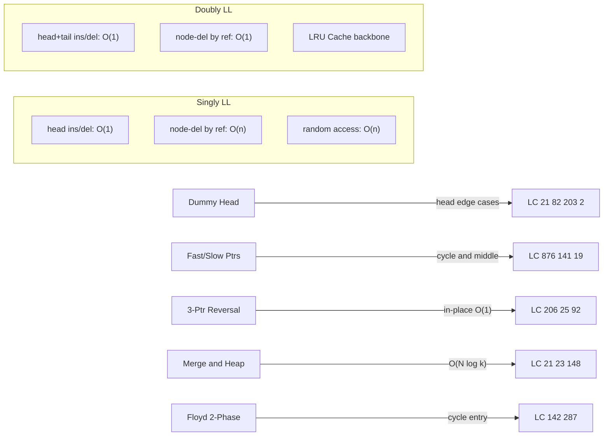

# Linked Lists (Python DSA Patterns)

> [!abstract] TL;DR
> A linked list is a chain of nodes — each holding a value and a pointer to the next — enabling O(1) head insertion but O(n) random access. In Python interviews you define `ListNode` from scratch; in production `collections.deque` is the right tool. Five patterns — dummy head, fast/slow pointers, 3-pointer reversal, merge with heap, and Floyd's two-phase cycle detection — unlock roughly 90% of linked list interview problems.

---

## Intuition

**Analogy:** A linked list is a scavenger hunt where each clue tells you only where the next clue is hidden. You cannot jump to clue #7 without walking the chain from clue #1. But planting a new "first clue" is instant — write one card and hand it out.

This is the core trade-off. Arrays are a numbered shelf: jump to any slot in O(1), but inserting at position 1 forces every existing item to shift right. Linked lists flip this: O(1) at the head, O(n) everywhere else, and zero contiguous memory required.

---

## How It Works

### Core Mechanics

**Singly linked list** — each node has `val` and `next`. Traversal is one-directional and O(n). No random access.

**Doubly linked list** — each node also has `prev`. Enables O(1) delete given a node reference and backward traversal. The backbone of LRU Cache and `collections.deque`.

| Operation | Singly LL | Doubly LL | Python `list` | `collections.deque` |
|-----------|-----------|-----------|---------------|---------------------|
| Insert at head | O(1) | O(1) | O(n) | O(1) |
| Insert at tail | O(1) with tail ptr | O(1) with tail ptr | O(1) amort. | O(1) |
| Delete at head | O(1) | O(1) | O(n) | O(1) |
| Delete at tail | O(n) | O(1) | O(1) amort. | O(1) |
| Delete given node ref | O(n) | O(1) | — | — |
| Random access | O(n) | O(n) | O(1) | O(n) |
| Cache performance | Poor | Poor | Excellent | Good (block-linked) |

### Flow / Architecture



---

## Core Concepts

### 1. ListNode Class in Python

Standard interview definition — every LeetCode linked list problem begins here.

```python
from __future__ import annotations
from typing import Optional

class ListNode:
    def __init__(self, val: int = 0, next: Optional[ListNode] = None):
        self.val = val
        self.next = next

    def __repr__(self) -> str:
        # Cap at 10 nodes to avoid infinite loop on cycles
        vals, curr, count = [], self, 0
        while curr and count < 10:
            vals.append(str(curr.val))
            curr = curr.next
            count += 1
        if curr:
            vals.append("...")
        return " -> ".join(vals) + " -> None"


def array_to_list(vals: list[int]) -> Optional[ListNode]:
    """Build a linked list from an array using dummy head pattern. O(n)"""
    dummy = ListNode(0)
    curr = dummy
    for v in vals:
        curr.next = ListNode(v)
        curr = curr.next
    return dummy.next


def list_to_array(head: Optional[ListNode]) -> list[int]:
    """Convert linked list back to array. O(n)"""
    res, curr = [], head
    while curr:
        res.append(curr.val)
        curr = curr.next
    return res
```

> [!tip] Why Python has no built-in linked list
> Python's `list` is a dynamic array with O(1) amortized append, O(1) random access, and excellent cache locality. A custom `ListNode` loses random access and suffers from pointer-chasing cache misses. For production use, `collections.deque` (a doubly-linked list of fixed-size blocks) gives O(1) at both ends with much lower overhead per element. `ListNode` exists **only** for solving interview problems.

---

### 2. Traversal and Search

```python
def find_length(head: Optional[ListNode]) -> int:
    count, curr = 0, head
    while curr:
        count += 1
        curr = curr.next
    return count


def find_middle(head: Optional[ListNode]) -> Optional[ListNode]:
    """
    Fast/slow pointer technique.
    slow moves 1 step, fast moves 2 steps.
    When fast reaches None, slow is at the middle.
    For even-length lists, returns the SECOND middle (right of center).
      [1,2,3]   -> node(2)
      [1,2,3,4] -> node(3)   <- second middle
    """
    slow = fast = head
    while fast and fast.next:
        slow = slow.next        # 1 step
        fast = fast.next.next   # 2 steps
    return slow


def nth_from_end(head: Optional[ListNode], n: int) -> Optional[ListNode]:
    """
    Two-pointer with a gap of exactly n between fast and slow.
    Advance fast n steps first, then advance both until fast is None.
    Slow lands on the nth node from the end.
    """
    slow = fast = head
    for _ in range(n):
        fast = fast.next    # type: ignore
    while fast:
        slow = slow.next    # type: ignore
        fast = fast.next    # type: ignore
    return slow
```

---

### 3. Reversal Patterns

The **3-pointer technique** underpins every list reversal. Before overwriting `curr.next`, save it.

```
State:  prev=None  curr=head  nxt=uninitialized

Each iteration:
  nxt       = curr.next   # 1. save forward pointer
  curr.next = prev        # 2. reverse the arrow
  prev      = curr        # 3. advance prev
  curr      = nxt         # 4. advance curr

New head = prev  (the last non-None curr)
```

**Reverse a sublist** between 1-indexed positions `left` and `right`:

```python
def reverse_between(head: Optional[ListNode], left: int, right: int) -> Optional[ListNode]:
    """Reverse nodes at positions left..right (1-indexed). O(n), O(1)."""
    dummy = ListNode(0, head)
    pre = dummy

    for _ in range(left - 1):       # walk to node just before left
        pre = pre.next              # type: ignore

    prev, curr = None, pre.next
    for _ in range(right - left + 1):
        nxt = curr.next             # type: ignore
        curr.next = prev            # type: ignore
        prev = curr
        curr = nxt

    # pre.next is now the old sublist head (= new sublist tail)
    pre.next.next = curr            # type: ignore  tail -> remainder
    pre.next = prev                 # pre -> new sublist head
    return dummy.next
```

**Recursive reversal** (O(n) space, O(n) time — understand but prefer iterative in interviews):

```python
def reverse_recursive(head: Optional[ListNode]) -> Optional[ListNode]:
    if not head or not head.next:
        return head
    new_head = reverse_recursive(head.next)
    head.next.next = head   # make the next node point back
    head.next = None        # current node becomes the new tail
    return new_head
```

---

### 4. Dummy Head / Sentinel Node

A dummy head is a throwaway `ListNode(0)` prepended before the real head. It ensures the real head node always has a predecessor, eliminating "what if I need to delete/replace the head?" as a special case.

```python
# Standard template — use this whenever you build or modify from the front
dummy = ListNode(0)
dummy.next = head
curr = dummy

# ... pointer manipulations ...

return dummy.next   # real new head (may differ from original head)
```

**Use whenever:** inserting or deleting at the head, building a result list node-by-node (merge, partition), or partitioning into multiple chains that later get reconnected.

---

### 5. Floyd's Cycle Detection

**Phase 1 — Detect cycle:** Both `slow` (1 step) and `fast` (2 steps) start at `head`. If `slow is fast` at any point, a cycle exists.

**Phase 2 — Find cycle entry:** Reset `slow` to `head`; keep `fast` at the meeting point. Advance both 1 step at a time. They meet at the cycle entry node.

**Why Phase 2 works:** Let F = distance from head to cycle entry, C = cycle length, a = distance from cycle entry to the Phase 1 meeting point. In Phase 1: slow travels F + a steps, fast travels 2(F + a) steps. The extra distance fast covered is a multiple of C: `F + a = kC`. From the meeting point, fast is `C - a = C - (kC - F) = F` steps from the cycle entry. Resetting slow to head means slow also needs F steps to reach the entry. They arrive simultaneously.

```python
def detect_cycle(head: Optional[ListNode]) -> Optional[ListNode]:
    slow = fast = head
    while fast and fast.next:
        slow = slow.next            # type: ignore
        fast = fast.next.next       # type: ignore
        if slow is fast:            # use `is`, not `==`
            break
    else:
        return None    # fast hit None — no cycle

    slow = head        # Phase 2: reset slow to head
    while slow is not fast:
        slow = slow.next    # type: ignore
        fast = fast.next    # type: ignore
    return slow   # cycle entry node
```

**Array-as-linked-list** (LeetCode 287 — Find the Duplicate Number): treat index `i` as a node that points to `nums[i]`. A duplicate value means two indices point to the same next node, creating a cycle. Apply Floyd's exactly the same way, but on array indices.

---

### 6. Merge and Split

**Merge two sorted lists** (iterative, O(n + m), O(1)):

```python
def merge_two_sorted(l1: Optional[ListNode], l2: Optional[ListNode]) -> Optional[ListNode]:
    dummy = ListNode(0)
    curr = dummy
    while l1 and l2:
        if l1.val <= l2.val:
            curr.next = l1
            l1 = l1.next
        else:
            curr.next = l2
            l2 = l2.next
        curr = curr.next
    curr.next = l1 or l2    # attach whichever list has remaining nodes
    return dummy.next
```

**Split list at middle** (left-biased — first half gets the extra node for odd length):

```python
def split_at_middle(head: Optional[ListNode]):
    """Returns (first_half_head, second_half_head)."""
    slow, fast = head, head.next   # fast starts 1 ahead → left-biased middle
    while fast and fast.next:
        slow = slow.next           # type: ignore
        fast = fast.next.next      # type: ignore
    second = slow.next             # type: ignore
    slow.next = None               # sever the list at the middle
    return head, second
```

> [!note] Left vs right middle
> `fast = head.next` at start → slow stops at the *last node of the left half* (left-biased). This is correct for merge sort and palindrome checking. `fast = head` → slow stops at the *first node of the right half* (right-biased, same as `find_middle`).

**Interleave two lists** (Reorder List, LC 143): find middle, reverse second half, merge by alternating nodes from each half. All O(n) time, O(1) space.

---

### 7. In-Place Operations

```python
# Delete node given ONLY that node — not its predecessor (LC 237).
# Cannot traverse to predecessor, so copy the next node's value forward.
def delete_node(node: ListNode) -> None:
    node.val = node.next.val    # type: ignore  overwrite with next value
    node.next = node.next.next  # type: ignore  skip the (now duplicate) next


# Remove duplicates from a sorted list (LC 83).
def delete_duplicates(head: Optional[ListNode]) -> Optional[ListNode]:
    curr = head
    while curr and curr.next:
        if curr.val == curr.next.val:
            curr.next = curr.next.next   # skip duplicate
        else:
            curr = curr.next             # only advance when no duplicate
    return head


# Partition list around value x — all nodes < x before nodes >= x (LC 86).
# Two dummy heads gather each partition; merge at the end.
def partition(head: Optional[ListNode], x: int) -> Optional[ListNode]:
    less_head = ListNode(0)
    greater_head = ListNode(0)
    less, greater = less_head, greater_head
    curr = head
    while curr:
        if curr.val < x:
            less.next = curr
            less = less.next
        else:
            greater.next = curr
            greater = greater.next
        curr = curr.next
    greater.next = None          # CRITICAL: break any residual cycle
    less.next = greater_head.next
    return less_head.next
```

---

### 8. LRU Cache Implementation

An LRU Cache requires **O(1) get and O(1) put with eviction**. The structure that achieves this is a doubly-linked list (maintains recency order) combined with a hash map (O(1) node lookup by key).

**Production Python** — use `collections.OrderedDict`:

```python
from collections import OrderedDict

class LRUCache:
    def __init__(self, capacity: int):
        self.cap = capacity
        self.cache: OrderedDict = OrderedDict()

    def get(self, key: int) -> int:
        if key not in self.cache:
            return -1
        self.cache.move_to_end(key)     # mark as most recently used
        return self.cache[key]

    def put(self, key: int, value: int) -> None:
        if key in self.cache:
            self.cache.move_to_end(key)
        self.cache[key] = value
        if len(self.cache) > self.cap:
            self.cache.popitem(last=False)   # evict LRU (oldest item)
```

**From-scratch** — doubly-linked list + hash map. See Code Demo below.

The list is arranged: `[LRU sentinel] <-> ... <-> [MRU sentinel]`. On every access, move the node to just before the MRU sentinel. On eviction, remove the node just after the LRU sentinel. Both operations are O(1) because the doubly-linked list gives O(1) removal given a node reference, and the hash map gives O(1) lookup of that reference.

---

### 9. Advanced Patterns

**Palindrome check** (O(n) time, O(1) space — LC 234):
1. Find middle with fast/slow.
2. Reverse second half in-place.
3. Walk both halves simultaneously comparing values.
4. Optionally restore the list before returning.

**Copy list with random pointer** (O(1) space — LC 138):
Instead of a hash map (O(n) space), use interleaving:
1. Insert a copy of each node immediately after it: `A -> A' -> B -> B' -> C -> C'`.
2. Set random pointers: `node.next.random = node.random.next`.
3. Separate the two interwoven lists.

**Add two numbers** (LC 2): digits stored in reverse order. Use dummy head. Loop while `l1 or l2 or carry`; compute `divmod(carry + v1 + v2, 10)` each iteration. The `or carry` condition handles the final carry-out (e.g., `99 + 1 = 100`).

---

## Code Demo

```python
from __future__ import annotations
from typing import Optional, List
import heapq


class ListNode:
    def __init__(self, val: int = 0, next: Optional[ListNode] = None):
        self.val = val
        self.next = next

    def __lt__(self, other: ListNode) -> bool:
        return self.val < other.val   # required for heapq when vals are equal


# ── helpers ───────────────────────────────────────────────────────────────────
def build(vals: list[int]) -> Optional[ListNode]:
    dummy = ListNode()
    curr = dummy
    for v in vals:
        curr.next = ListNode(v)
        curr = curr.next
    return dummy.next

def arr(head: Optional[ListNode]) -> list[int]:
    res, curr = [], head
    while curr:
        res.append(curr.val)
        curr = curr.next
    return res


# ── 1. Reverse Linked List in K-Groups (LeetCode 25) ─────────────────────────
def reverse_k_group(head: Optional[ListNode], k: int) -> Optional[ListNode]:
    """
    Reverse nodes in groups of k. Leave the tail unchanged if < k nodes remain.
    Time: O(n)  Space: O(1)

    Strategy: use dummy predecessor. For each group, count k nodes forward.
    If k nodes exist, reverse [group_prev.next .. kth] then advance group_prev.
    """
    def reverse_segment(start: Optional[ListNode],
                        end: Optional[ListNode]) -> Optional[ListNode]:
        """Reverse nodes from start up to (not including) end. Returns new head."""
        prev, curr = end, start
        while curr is not end:
            nxt = curr.next         # type: ignore
            curr.next = prev        # type: ignore
            prev = curr
            curr = nxt
        return prev  # new head of the reversed segment

    dummy = ListNode(0, head)
    group_prev = dummy

    while True:
        # Count k nodes ahead; return early if fewer than k remain
        kth = group_prev
        for _ in range(k):
            kth = kth.next          # type: ignore
            if not kth:
                return dummy.next

        group_next = kth.next
        old_tail = group_prev.next  # after reversal, group_prev.next becomes the tail

        new_head = reverse_segment(group_prev.next, group_next)
        group_prev.next = new_head
        old_tail.next = group_next  # type: ignore  reconnect tail to remainder

        group_prev = old_tail       # type: ignore  advance past the reversed segment


# ── 2. LRU Cache from scratch — Doubly-LL + Hash Map (LeetCode 146) ──────────
class DNode:
    """Node for the doubly-linked list inside LRUCache."""
    def __init__(self, key: int = 0, val: int = 0):
        self.key = key
        self.val = val
        self.prev: Optional[DNode] = None
        self.next: Optional[DNode] = None


class LRUCache:
    """
    Layout: [LRU-sentinel] <-> node1 <-> ... <-> nodeN <-> [MRU-sentinel]
    Sentinel nodes eliminate all null-pointer checks at the boundaries.

    get(key):  O(1) — lookup in hash map, unlink, reinsert at MRU end
    put(key):  O(1) — same as get if exists; else insert at MRU end;
                      if over capacity, evict node just after LRU sentinel
    """
    def __init__(self, capacity: int):
        self.cap = capacity
        self.cache: dict[int, DNode] = {}
        self.lru = DNode()   # LRU sentinel (head)
        self.mru = DNode()   # MRU sentinel (tail)
        self.lru.next = self.mru
        self.mru.prev = self.lru

    def _remove(self, node: DNode) -> None:
        node.prev.next = node.next   # type: ignore
        node.next.prev = node.prev   # type: ignore

    def _add_to_mru(self, node: DNode) -> None:
        """Insert node immediately before MRU sentinel."""
        node.prev = self.mru.prev
        node.next = self.mru
        self.mru.prev.next = node    # type: ignore
        self.mru.prev = node

    def get(self, key: int) -> int:
        if key not in self.cache:
            return -1
        node = self.cache[key]
        self._remove(node)
        self._add_to_mru(node)
        return node.val

    def put(self, key: int, value: int) -> None:
        if key in self.cache:
            self._remove(self.cache[key])
        node = DNode(key, value)
        self.cache[key] = node
        self._add_to_mru(node)
        if len(self.cache) > self.cap:
            lru_node = self.lru.next    # type: ignore  oldest node
            self._remove(lru_node)
            del self.cache[lru_node.key]


# ── 3. Floyd's Cycle Detection + Cycle Start (LeetCode 142) ──────────────────
def detect_cycle(head: Optional[ListNode]) -> Optional[ListNode]:
    """
    Phase 1: slow (1-step) and fast (2-step) both start at head.
             They meet inside the cycle if one exists.
    Phase 2: reset slow to head; advance both at 1 step.
             They meet at the cycle entry node.

    Time: O(n)  Space: O(1)
    """
    slow = fast = head

    # Phase 1
    while fast and fast.next:
        slow = slow.next            # type: ignore
        fast = fast.next.next       # type: ignore
        if slow is fast:            # identity check, not value equality
            break
    else:
        return None   # fast reached None — no cycle

    # Phase 2
    slow = head
    while slow is not fast:
        slow = slow.next    # type: ignore
        fast = fast.next    # type: ignore
    return slow   # cycle entry node


# ── 4. Merge K Sorted Lists (LeetCode 23) ─────────────────────────────────────
def merge_k_lists(lists: List[Optional[ListNode]]) -> Optional[ListNode]:
    """
    Min-heap always yields the globally smallest unmerged node.
    Push each list's head; after popping a node, push its successor.

    Time: O(N log k)  Space: O(k)
    where N = total nodes across all lists, k = number of lists.
    """
    heap: list = []
    for node in lists:
        if node:
            heapq.heappush(heap, (node.val, node))   # __lt__ handles equal vals

    dummy = ListNode(0)
    curr = dummy
    while heap:
        _, node = heapq.heappop(heap)
        curr.next = node
        curr = curr.next
        if node.next:
            heapq.heappush(heap, (node.next.val, node.next))

    return dummy.next


# ── Demo ──────────────────────────────────────────────────────────────────────
if __name__ == "__main__":
    # 1. Reverse k-groups
    print(arr(reverse_k_group(build([1, 2, 3, 4, 5]), 2)))  # [2, 1, 4, 3, 5]
    print(arr(reverse_k_group(build([1, 2, 3, 4, 5]), 3)))  # [3, 2, 1, 4, 5]

    # 2. LRU Cache
    lru = LRUCache(2)
    lru.put(1, 1)
    lru.put(2, 2)
    print(lru.get(1))   # 1  — key 1 is now MRU
    lru.put(3, 3)       # evicts key 2 (LRU)
    print(lru.get(2))   # -1 — evicted
    lru.put(4, 4)       # evicts key 1 (LRU)
    print(lru.get(1))   # -1 — evicted
    print(lru.get(3))   # 3
    print(lru.get(4))   # 4

    # 3. Floyd's cycle detection
    nodes = [ListNode(i) for i in range(1, 6)]   # nodes 1..5
    for i in range(4):
        nodes[i].next = nodes[i + 1]
    nodes[4].next = nodes[2]   # 5 -> 3, cycle entry is node with val=3
    entry = detect_cycle(nodes[0])
    print(entry.val if entry else None)   # 3

    # 4. Merge K sorted lists
    lists = [build([1, 4, 5]), build([1, 3, 4]), build([2, 6])]
    print(arr(merge_k_lists(lists)))   # [1, 1, 2, 3, 4, 4, 5, 6]
```

---

## Real-World Example

> **Example:** Redis uses a **doubly-linked list** as the foundation of its list data type (LPUSH, RPUSH, LPOP, RPOP). Each Redis list is stored as a `quicklist` — a doubly-linked list of compressed `ziplist` nodes — giving O(1) push/pop at both ends while packing multiple values per node for cache efficiency. The same LRU Cache pattern (doubly-linked list + hash map) directly powers Redis eviction when `maxmemory-policy` is `allkeys-lru` or `volatile-lru`: the hash map provides O(1) key lookup and the doubly-linked list tracks access order so the least-recently-used entry can be evicted in O(1).

---

## Trade-offs

**Linked list vs Python `list`:**

| Aspect | Linked List | Python `list` |
|--------|-------------|---------------|
| Insert/delete at head | O(1) | O(n) — must shift all elements |
| Insert/delete at tail | O(1) with tail ptr | O(1) amortized |
| Insert/delete at middle | O(n) traverse + O(1) link | O(n) traverse + O(n) shift |
| Random access | O(n) pointer chase | O(1) index arithmetic |
| Memory per element | ~3x overhead (val + next ptr + obj header) | ~8 bytes pointer in contiguous block |
| Cache performance | Poor — nodes scattered across heap | Excellent — prefetcher loves contiguous memory |
| Predictable growth | Always exact size | May over-allocate (1.125x growth factor) |

**`collections.deque` vs custom `ListNode`:**

| Aspect | `collections.deque` | Custom `ListNode` |
|--------|---------------------|-------------------|
| Use case | Production Python code | Interview / LeetCode problems |
| O(1) at both ends | Yes | Yes (with tail pointer) |
| Random access | O(n) | O(n) |
| Memory efficiency | High — block-linked list (64-node blocks) | Low — one Python object per node |
| Built-in operations | `rotate`, `maxlen`, `extend`, `extendleft` | None — implement from scratch |
| Thread safety | GIL-protected | No |
| Import required | `from collections import deque` | Define class in every file |

---

## When to Use vs Avoid

**Use linked lists when:**
- You need O(1) insert/delete at the head or both ends and the list size is highly dynamic.
- You need O(1) delete given a node reference — only doubly-linked lists offer this (LRU Cache, browser history).
- Implementing a queue from scratch when `collections` is unavailable.
- The interview question explicitly uses `ListNode` (virtually all LeetCode linked list problems).

**Avoid linked lists when:**
- You need random access — O(n) vs O(1) for Python `list` makes a real difference.
- The workload is read-heavy with sequential scans — cache locality of arrays is 5-10x faster in practice.
- You need to sort efficiently — merge sort works on linked lists but constant factors are poor.
- In production Python code where `collections.deque` handles every legitimate deque use case.

---

## Common Pitfalls

- **Not using dummy head for head-deletion** — without a dummy, deleting the head requires a special-case branch (`if curr is head: head = head.next`). With `dummy.next = head`, every node has a predecessor and the loop body is uniform. This bites you most in "remove all nodes with value X" when X equals the head.
- **Losing the `next` pointer before reversal** — `curr.next = prev` permanently overwrites the forward pointer. Always save `nxt = curr.next` on the line immediately before this. Forgetting is the single most common cause of infinite loops in reversal code.
- **Off-by-one in nth-from-end** — the gap between fast and slow must be exactly `n`, not `n - 1`. Advance fast `n` steps before starting the joint advance. Use a dummy for both pointers to handle the edge case where the target is the head itself.
- **Not terminating the greater-chain in partition** — after splitting into `less` and `greater` chains, the last node of `greater` still points into the original list (a residual `next`). Always set `greater.next = None` before merging, or you create a cycle.
- **`==` vs `is` in cycle detection** — `slow == fast` compares node values and will give a false positive when two different nodes hold the same value. Always use `slow is fast` to compare object identity (pointer equality).
- **Modifying while iterating** — reassigning `curr.next` to skip a node and then doing `curr = curr.next` follows the old, now-skipped pointer. Use a `prev`/`curr` pair so `prev.next = curr.next` and `curr = curr.next` (advancing via the old pointer before it moves).

---

## Related Concepts

- [[Singly_Linked_List]] — core node structure, O(1) head insertion, full operation complexity analysis
- [[Doubly_Linked_List]] — O(1) node deletion given a reference; the backbone of LRU Cache
- [[Fast_Slow_Pointers]] — Floyd's algorithm with full mathematical proof of both phases
- [[Linked_List_Patterns]] — the six canonical patterns: reversal, merge, split, reorder, dummy head, in-place
- [[Deque]] — `collections.deque` as the production alternative; monotonic deque for sliding window
- [[Two_Pointers]] — parent technique; fast/slow pointers are the linked-list specialization
- [[Priority_Queue]] — `heapq` internals; used directly in merge K sorted lists
- [[Top_K_Pattern]] — heap-based patterns including multi-way merge
- [[Hash_Table_Fundamentals]] — hash map half of LRU Cache; O(1) key-to-node lookup

---

## Review Questions

1. **Floyd's cycle Phase 2 math** — After Phase 1 the meeting point is inside the cycle. Express the Phase 1 meeting condition as an equation involving F (head-to-entry distance), C (cycle length), and k (integer). Then show algebraically why resetting slow to head and advancing both pointers at 1 step causes them to meet at the cycle entry rather than anywhere else in the cycle.
2. **Dummy head purpose** — Write the exact Python code for "remove all nodes with value X" without a dummy head. Identify the line that silently fails when X equals the value of the head node. Now rewrite with a dummy head and show why that line disappears.
3. **Fast/slow for middle** — The condition `while fast and fast.next` with both starting at `head` returns the second middle for even-length lists. What single change to the starting position of `fast` (one line) returns the first middle instead? Explain why this distinction matters for (a) palindrome checking and (b) the split step in merge sort on linked lists.
4. **LRU Cache data structure choice** — An LRU Cache with O(1) get and O(1) put requires evicting the least-recently-used entry on overflow. Explain why a singly-linked list + hash map cannot achieve O(1) eviction, what specific operation requires backward traversal, and how adding a `prev` pointer (doubly-linked) resolves this to O(1).

---

## Sources

- [LeetCode — Linked List Explore Card](https://leetcode.com/explore/learn/card/linked-list/)
- [Python docs — collections.deque](https://docs.python.org/3/library/collections.html#collections.deque)
- [Python docs — collections.OrderedDict](https://docs.python.org/3/library/collections.html#collections.OrderedDict)
- [Redis — Quicklist internals](https://github.com/redis/redis/blob/unstable/src/quicklist.c)
- Neetcode.io — Linked List video series
- *Elements of Programming Interviews in Python* — Chapter 7

---

#dsa #linked-lists #two-pointers #python #leetcode
