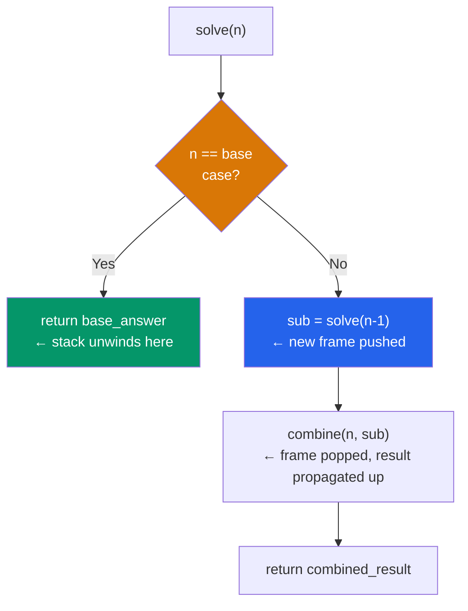
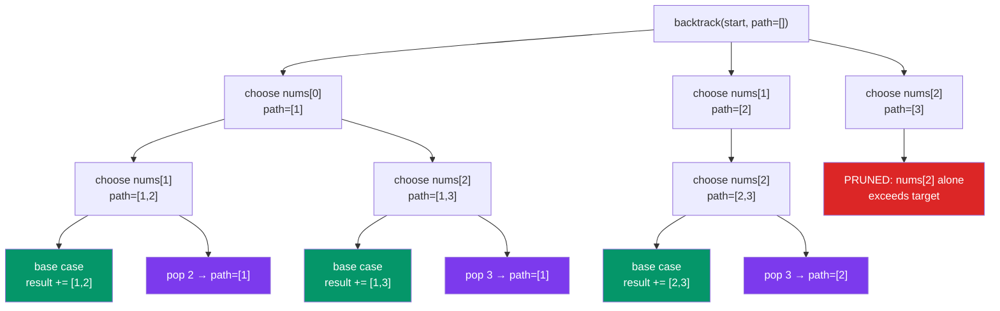

# Recursion and Backtracking

> [!abstract] TL;DR
> Recursion solves a problem by reducing it to a smaller version of itself; backtracking is recursion with an explicit undo step that explores a decision tree and prunes invalid branches early. Together they solve the entire class of constraint-satisfaction, enumeration, and search problems — subsets, permutations, N-Queens, Sudoku, and Word Search — with a single reusable template.

---

## Intuition — Analogy First

**Analogy:** Imagine you are trying every combination on a combination lock. A naive approach tries all 10,000 four-digit combinations. A smarter approach — backtracking — tries a digit, and if the partial combination is already ruled out by a constraint, spins back and tries the next digit immediately rather than exhausting the remaining positions. The "spin back" is the undo step; the constraint check is the pruning.

Recursion is how you descend — each function call handles one digit position and delegates the rest to a clone of itself. Backtracking is the discipline of restoring the lock to its pre-choice state before trying the next digit. Without restore, every recursive branch starts from a corrupted state.

In Python terms: every `path.append(x)` that enters a branch must have a matching `path.pop()` that exits it. Every `visited.add(cell)` must have a matching `visited.remove(cell)`. The call stack handles the function frames automatically; you handle the shared mutable state manually.

---

## How It Works

### 1. Recursion Fundamentals

Every recursive solution has exactly two parts:

- **Base case** — the input is small enough to answer directly; return without a recursive call. Without this, you get infinite recursion and a `RecursionError`.
- **Recursive case** — reduce the problem by one unit, call yourself, and combine the sub-result with the current piece.

The key mindset shift is **trusting the recursion**: assume `solve(n-1)` already returns the correct answer for `n-1`. Your only job is to combine that answer with the contribution of `n`. This is the inductive leap that makes recursive code easy to write once you internalize it.

**Python recursion limit.** CPython sets a default call stack depth of 1000 frames.

```python
import sys
print(sys.getrecursionlimit())   # 1000
sys.setrecursionlimit(10_000)    # increase for deep trees
```

Hitting the limit raises `RecursionError: maximum recursion depth exceeded`. For problems with depth proportional to input size (e.g., a linked list of 10,000 nodes), convert to an iterative approach instead of raising the limit — Python does not perform tail-call optimization and never will (Guido van Rossum has explicitly rejected it to preserve readable tracebacks).

**Stack frame cost.** Each Python function call allocates a frame object on the C stack and in the Python heap. For tight loops, this overhead is meaningful — a recursive Fibonacci without memoization runs in O(2^n) time and O(n) space, while an iterative version runs in O(n) time and O(1) space.

---

### 2. Recursion Patterns

**Linear recursion — factorial:**
Each call reduces n by 1 and multiplies on the way back up.

```python
def factorial(n: int) -> int:
    if n <= 1:          # base case
        return 1
    return n * factorial(n - 1)   # one recursive call
```

**Tree recursion — Fibonacci (naive vs memoized):**
Each call spawns two sub-calls, creating an exponential call tree. Memoization collapses the tree to a DAG by caching results.

```python
from functools import lru_cache

# Naive: O(2^n) time — recomputes fib(k) exponentially many times
def fib_naive(n: int) -> int:
    if n <= 1:
        return n
    return fib_naive(n - 1) + fib_naive(n - 2)

# Memoized: O(n) time, O(n) space — each subproblem computed once
@lru_cache(maxsize=None)
def fib(n: int) -> int:
    if n <= 1:
        return n
    return fib(n - 1) + fib(n - 2)
```

`@lru_cache` (or `@cache` in Python 3.9+) is the idiomatic Python way to add top-down memoization. Arguments must be hashable; for list inputs, convert to a tuple first. See [[Decorators_and_Metaprogramming]] for the full mechanics of `@lru_cache`.

**Divide and conquer — merge sort skeleton:**
Split into halves, sort each half recursively, then merge. The work is done on the way back up (the merge step).

```python
def merge_sort(arr: list[int]) -> list[int]:
    if len(arr) <= 1:          # base case: already sorted
        return arr
    mid = len(arr) // 2
    left  = merge_sort(arr[:mid])    # conquer left half
    right = merge_sort(arr[mid:])    # conquer right half
    return merge(left, right)        # combine

def merge(a: list[int], b: list[int]) -> list[int]:
    result, i, j = [], 0, 0
    while i < len(a) and j < len(b):
        if a[i] <= b[j]:
            result.append(a[i]); i += 1
        else:
            result.append(b[j]); j += 1
    return result + a[i:] + b[j:]
```

**Mutual recursion — even / odd:**

```python
def is_even(n: int) -> bool:
    if n == 0: return True
    return is_odd(n - 1)

def is_odd(n: int) -> bool:
    if n == 0: return False
    return is_even(n - 1)
```

Rare in interviews but appears in language parsers and state machines.

---

### 3. The Universal Backtracking Template

Every backtracking problem fits this template:

```python
def backtrack(start, path, result, *context):
    # --- Base case: valid complete solution ---
    if is_complete(path):
        result.append(path[:])   # COPY the path — do not append the reference
        return

    for choice in choices(start, path, context):
        # --- Pruning: skip invalid choices early ---
        if not is_valid(choice, path, context):
            continue

        # --- Choose ---
        path.append(choice)
        apply_state(choice, context)

        # --- Explore ---
        backtrack(next_start(start, choice), path, result, context)

        # --- Unchoose (undo) ---
        path.pop()
        restore_state(choice, context)
```

The three operations — **choose, explore, unchoose** — must be perfectly symmetric. Every state mutation in "choose" must be mirrored by the inverse mutation in "unchoose". Forgetting the unchoose step is the most common backtracking bug.

The `path[:]` copy in the base case is the second most common bug. Because Python lists are mutable, `result.append(path)` appends a reference to the same list object. By the time the function returns, `path` will have been modified by subsequent backtracking steps, leaving `result` filled with copies of the final (empty) state of `path`. Always use `path[:]` or `list(path)` or `tuple(path)`.

---

### 4. Subsets and Combinations

**Subsets (power set) — include/exclude model:**

At each index, make a binary decision: include this element or skip it. This generates all 2^n subsets.

```python
def subsets(nums: list[int]) -> list[list[int]]:
    result = []

    def backtrack(start: int, path: list[int]):
        result.append(path[:])          # every path prefix is a valid subset
        for i in range(start, len(nums)):
            path.append(nums[i])        # include nums[i]
            backtrack(i + 1, path)
            path.pop()                  # exclude nums[i]

    backtrack(0, [])
    return result
```

**Subsets with duplicates — sort + skip same element at same level:**

```python
def subsets_with_dup(nums: list[int]) -> list[list[int]]:
    nums.sort()                          # sort to group duplicates
    result = []

    def backtrack(start: int, path: list[int]):
        result.append(path[:])
        for i in range(start, len(nums)):
            # Skip the same value at the same recursion depth
            if i > start and nums[i] == nums[i - 1]:
                continue
            path.append(nums[i])
            backtrack(i + 1, path)
            path.pop()

    backtrack(0, [])
    return result
```

The guard `i > start and nums[i] == nums[i-1]` is the canonical duplicate-pruning idiom. The condition `i > start` (not `i > 0`) ensures we only skip duplicates at the *same level of the recursion tree*, not across different levels — including the same value in different positions is legal.

**Combinations — choose exactly k from n:**

```python
def combine(n: int, k: int) -> list[list[int]]:
    result = []

    def backtrack(start: int, path: list[int]):
        if len(path) == k:
            result.append(path[:])
            return
        # Pruning: not enough elements left to complete a combination
        remaining_needed = k - len(path)
        for i in range(start, n - remaining_needed + 2):   # +2 because range is exclusive
            path.append(i)
            backtrack(i + 1, path)
            path.pop()

    backtrack(1, [])
    return result
```

Reference: `itertools.combinations(range(1, n+1), k)` produces the same output but is a C-speed iterator, not a recursive function. Use it in production; use the backtracking version to understand the mechanism or when you need custom pruning.

---

### 5. Permutations

**Permutations of distinct elements — using a used set:**

```python
def permute(nums: list[int]) -> list[list[int]]:
    result = []
    used = [False] * len(nums)

    def backtrack(path: list[int]):
        if len(path) == len(nums):
            result.append(path[:])
            return
        for i in range(len(nums)):
            if used[i]:
                continue
            used[i] = True
            path.append(nums[i])
            backtrack(path)
            path.pop()
            used[i] = False

    backtrack([])
    return result
```

**Permutations with duplicates — sort + skip:**

```python
def permute_unique(nums: list[int]) -> list[list[int]]:
    nums.sort()
    result = []
    used = [False] * len(nums)

    def backtrack(path: list[int]):
        if len(path) == len(nums):
            result.append(path[:])
            return
        for i in range(len(nums)):
            if used[i]:
                continue
            # Skip duplicate: same value as previous AND previous is NOT in current path
            # (if previous is in path, we are continuing a valid branch; if not, it's a duplicate start)
            if i > 0 and nums[i] == nums[i - 1] and not used[i - 1]:
                continue
            used[i] = True
            path.append(nums[i])
            backtrack(path)
            path.pop()
            used[i] = False

    backtrack([])
    return result
```

The condition `not used[i-1]` is the key: it means the previous duplicate has already been un-chosen (is not in the current path), so choosing `nums[i]` would generate the same permutation as a branch already explored with `nums[i-1]` in that position.

Reference: `itertools.permutations(nums)` produces all permutations including duplicates; wrap with `set(...)` for uniqueness. The backtracking version prunes at generation time.

---

### 6. Combination Sum Variants

**Sum to target — repetition allowed (LC 39):**
Pass the same index `i` to the recursive call (not `i+1`), allowing the same element to be reused.

```python
def combination_sum(candidates: list[int], target: int) -> list[list[int]]:
    candidates.sort()
    result = []

    def backtrack(start: int, path: list[int], remaining: int):
        if remaining == 0:
            result.append(path[:])
            return
        for i in range(start, len(candidates)):
            if candidates[i] > remaining:   # sorted → all subsequent are also too large
                break
            path.append(candidates[i])
            backtrack(i, path, remaining - candidates[i])   # i, not i+1
            path.pop()

    backtrack(0, [], target)
    return result
```

**Sum to target — no repetition, with duplicates in input (LC 40):**
Pass `i+1` and use the `i > start and same-as-previous` skip. See the full solution in the Code Demo section.

**Sum to target — limited count (kSum):**
Add a `count` parameter and a base case that checks both `remaining == 0` and `len(path) == k`.

```python
def four_sum(nums: list[int], target: int) -> list[list[int]]:
    nums.sort()
    result = []

    def backtrack(start: int, path: list[int], remaining: int):
        if len(path) == 4 and remaining == 0:
            result.append(path[:])
            return
        if len(path) == 4:
            return
        for i in range(start, len(nums)):
            if i > start and nums[i] == nums[i - 1]:
                continue
            if nums[i] > remaining and len(path) + 1 == 4:
                break
            path.append(nums[i])
            backtrack(i + 1, path, remaining - nums[i])
            path.pop()

    backtrack(0, [], target)
    return result
```

---

### 7. Grid Backtracking

**General pattern for grid DFS:**

1. Check boundary and base case at the top.
2. Read the cell value; if it does not match, return immediately.
3. Mark the cell visited (write a sentinel value) — this prevents re-visiting within the current DFS path.
4. Recurse in four directions.
5. Restore the cell — this enables other DFS paths from other starting cells to visit it.

The in-place mark (`board[r][c] = '#'`) is more cache-friendly than maintaining a separate `visited` set, and the restore (`board[r][c] = temp`) is the backtracking undo step.

**N-Queens constraint model:**
Instead of scanning the board for conflicts on every placement (O(n) per check), maintain three sets:
- `cols`: columns already occupied.
- `pos_diag`: `/` diagonals, identified by `row + col` (constant along each `/` diagonal).
- `neg_diag`: `\` diagonals, identified by `row - col` (constant along each `\` diagonal).

Each set lookup and insert is O(1), making the constraint check O(1) per placement. This is the key optimization that makes N-Queens tractable.

**Sudoku constraint model:**
Maintain 27 sets (9 rows, 9 cols, 9 boxes). The box index for cell `(r, c)` is `(r // 3) * 3 + (c // 3)`. Pre-collect all empty cells into a list so the recursion iterates over empties only, not the full 81 cells.

---

### 8. Pruning Strategies

| Strategy | Mechanism | Example |
|---|---|---|
| Sort + early break | Sort candidates; if `candidates[i] > remaining`, break (all subsequent are larger) | Combination Sum |
| Sort + skip duplicate | `if i > start and nums[i] == nums[i-1]: continue` | Subsets II, Combination Sum II |
| Constraint sets | Pre-built sets for O(1) validity check instead of O(n) scan | N-Queens, Sudoku |
| Bound function | If current partial path already violates a bound (e.g., sum exceeds target), return | Combination Sum |
| Forward checking | Before placing, count remaining valid options; if zero for any unset variable, return | Advanced Sudoku |

Pruning converts exponential worst-case into practical sub-exponential runtime for most inputs. Sort is the cheapest enabler: one O(n log n) sort at the start allows O(1) branch cuts throughout.

---

### 9. Converting Recursion to Iteration

Python's call stack is limited and not optimized. For deep recursion, use an explicit stack:

```python
# Recursive DFS on a tree
def dfs_recursive(root):
    if root is None:
        return
    process(root)
    dfs_recursive(root.left)
    dfs_recursive(root.right)

# Iterative equivalent with explicit stack
def dfs_iterative(root):
    if root is None:
        return
    stack = [root]
    while stack:
        node = stack.pop()
        process(node)
        if node.right:
            stack.append(node.right)   # push right first so left is processed first
        if node.left:
            stack.append(node.left)
```

For backtracking, iterative conversion requires storing the undo operation alongside the state. This is called the **continuation pattern** — each stack frame holds both the state and the "what to do when I return" information.

**When to prefer iterative:**
- Input size is large enough to hit the 1000-frame default limit.
- The recursion is tail-recursive (a single recursive call at the end with no post-processing) — rewrite as a loop with `while True`.
- You need to pause and resume traversal (e.g., yielding values incrementally) — use a generator with an explicit stack. See [[Generators_and_Iterators]] for the `yield from` recursive pattern that avoids deep call stacks.

---

## Mermaid Diagrams

### Recursion Call Stack Mental Model



### Backtracking Decision Tree with Pruning



---

## Code Demo

### 1. N-Queens — O(1) Constraint Check with Column and Diagonal Sets

```python
# N-Queens: place n queens on an n×n board so no two queens share
# a row, column, or diagonal. Returns all valid board configurations.

def solve_n_queens(n: int) -> list[list[str]]:
    results: list[list[str]] = []
    cols:      set[int] = set()   # occupied columns
    pos_diag:  set[int] = set()   # occupied '/' diagonals (row + col is constant)
    neg_diag:  set[int] = set()   # occupied '\' diagonals (row - col is constant)
    board = [['.' ] * n for _ in range(n)]

    def backtrack(row: int) -> None:
        if row == n:                              # all rows filled — valid solution
            results.append([''.join(r) for r in board])
            return
        for col in range(n):
            if col in cols or (row + col) in pos_diag or (row - col) in neg_diag:
                continue                          # O(1) constraint check

            # Choose: place queen
            cols.add(col)
            pos_diag.add(row + col)
            neg_diag.add(row - col)
            board[row][col] = 'Q'

            backtrack(row + 1)

            # Unchoose: remove queen
            cols.remove(col)
            pos_diag.remove(row + col)
            neg_diag.remove(row - col)
            board[row][col] = '.'

    backtrack(0)
    return results


# Verification
solutions = solve_n_queens(4)
print(f"N=4: {len(solutions)} solutions")   # 2 solutions
for s in solutions:
    for row in s:
        print(row)
    print()
```

---

### 2. Combination Sum II — Duplicates Handled by Sort + Skip

```python
# Combination Sum II (LC 40): given candidates (may contain duplicates) and a
# target, find all unique combinations that sum to target. Each element may be
# used only once. Duplicates in output are not allowed.

def combination_sum2(candidates: list[int], target: int) -> list[list[int]]:
    candidates.sort()               # sort enables duplicate-skip and early-break pruning
    results: list[list[int]] = []

    def backtrack(start: int, path: list[int], remaining: int) -> None:
        if remaining == 0:
            results.append(path[:])   # path[:] copies the list — not a reference
            return

        for i in range(start, len(candidates)):
            # Duplicate pruning: skip same value at the same recursion level
            # (i > start, not i > 0 — we only skip within this level)
            if i > start and candidates[i] == candidates[i - 1]:
                continue
            # Branch bound: sorted list, so remaining candidates are all >= candidates[i]
            if candidates[i] > remaining:
                break

            path.append(candidates[i])
            backtrack(i + 1, path, remaining - candidates[i])   # i+1: no reuse
            path.pop()                                           # undo

    backtrack(0, [], target)
    return results


# Verification
print(combination_sum2([10, 1, 2, 7, 6, 1, 5], 8))
# [[1, 1, 6], [1, 2, 5], [1, 7], [2, 6]]

print(combination_sum2([2, 5, 2, 1, 2], 5))
# [[1, 2, 2], [5]]
```

---

### 3. Sudoku Solver — Constraint Sets with Pre-Collected Empties

```python
# Sudoku Solver (LC 37): fill empty cells ('.') so every row, column, and
# 3x3 box contains digits 1-9 exactly once. Guaranteed exactly one solution.

def solve_sudoku(board: list[list[str]]) -> None:
    """Modifies board in-place."""
    rows  = [set() for _ in range(9)]   # digits used in each row
    cols  = [set() for _ in range(9)]   # digits used in each column
    boxes = [set() for _ in range(9)]   # digits used in each 3x3 box

    empties: list[tuple[int, int]] = []

    # Pre-populate constraint sets from the given clues
    for r in range(9):
        for c in range(9):
            d = board[r][c]
            if d != '.':
                box_idx = (r // 3) * 3 + (c // 3)
                rows[r].add(d)
                cols[c].add(d)
                boxes[box_idx].add(d)
            else:
                empties.append((r, c))

    def backtrack(idx: int) -> bool:
        if idx == len(empties):
            return True                          # all empty cells filled
        r, c = empties[idx]
        box_idx = (r // 3) * 3 + (c // 3)

        for digit in '123456789':
            # O(1) constraint check across row, column, and box simultaneously
            if digit in rows[r] or digit in cols[c] or digit in boxes[box_idx]:
                continue

            # Choose: place digit
            board[r][c] = digit
            rows[r].add(digit)
            cols[c].add(digit)
            boxes[box_idx].add(digit)

            if backtrack(idx + 1):
                return True                      # propagate success upward

            # Unchoose: remove digit
            board[r][c] = '.'
            rows[r].remove(digit)
            cols[c].remove(digit)
            boxes[box_idx].remove(digit)

        return False                             # no valid digit found — backtrack

    backtrack(0)


# Verification (a known hard Sudoku)
board = [
    ["5","3",".",".","7",".",".",".","."],
    ["6",".",".","1","9","5",".",".","."],
    [".","9","8",".",".",".",".","6","."],
    ["8",".",".",".","6",".",".",".","3"],
    ["4",".",".","8",".","3",".",".","1"],
    ["7",".",".",".","2",".",".",".","6"],
    [".","6",".",".",".",".","2","8","."],
    [".",".",".","4","1","9",".",".","5"],
    [".",".",".",".","8",".",".","7","9"],
]
solve_sudoku(board)
print(board[0])   # ['5', '3', '4', '6', '7', '8', '9', '1', '2']
```

---

### 4. Word Search — In-Place Visited Marking

```python
# Word Search (LC 79): given a 2D grid of characters and a word, return True
# if the word exists as a path of adjacent (up/down/left/right) cells.
# The same cell may not be used more than once in a single path.

def word_search(board: list[list[str]], word: str) -> bool:
    rows, cols = len(board), len(board[0])

    def dfs(r: int, c: int, idx: int) -> bool:
        if idx == len(word):
            return True                           # consumed entire word — found
        if not (0 <= r < rows and 0 <= c < cols):
            return False                          # out of bounds
        if board[r][c] != word[idx]:
            return False                          # character mismatch

        # Mark visited in-place — avoids a separate visited set
        temp, board[r][c] = board[r][c], '#'

        found = (
            dfs(r + 1, c, idx + 1) or
            dfs(r - 1, c, idx + 1) or
            dfs(r, c + 1, idx + 1) or
            dfs(r, c - 1, idx + 1)
        )

        board[r][c] = temp                        # restore — backtracking undo step
        return found

    # Try every cell as a potential starting position
    for r in range(rows):
        for c in range(cols):
            if dfs(r, c, 0):
                return True
    return False


# Verification
grid = [
    ['A','B','C','E'],
    ['S','F','C','S'],
    ['A','D','E','E'],
]
print(word_search(grid, "ABCCED"))   # True
print(word_search(grid, "SEE"))      # True
print(word_search(grid, "ABCB"))     # False (cannot reuse B)
```

---

## Real-World Example

> **Example — Constraint solvers in ML hyperparameter search:** Libraries like Optuna and Ray Tune use backtracking-style constraint propagation in their search spaces. When a trial configuration is sampled and a constraint is violated (e.g., `batch_size > available_memory`), the trial is pruned before launching — exactly the "detect infeasibility early and backtrack" pattern. The `suggest_int` / `suggest_categorical` API maps to the "choose" step; the early-pruning callback maps to the constraint check; the `study.optimize` loop is the outer iteration over the decision tree. More directly: graph neural network models use recursive message passing where each node's hidden state is computed by calling the same aggregation function on its neighbors — this is mutual recursion expressed as a fixed-point iteration, and debugging it requires the same stack-trace intuition as debugging explicit Python recursion.

---

## Trade-offs

### Recursion vs Iteration

| Aspect | Recursive | Iterative |
|---|---|---|
| Readability | Natural for tree/DAG problems; matches the mathematical definition | Verbose for complex state; requires manual stack management |
| Stack depth | Limited by Python's 1000-frame default; every call allocates a frame | No limit from call stack; bounded only by heap memory |
| Python overhead | Each function call: frame allocation, argument lookup, return | Loop body: minimal per-iteration overhead |
| Tail recursion | Not optimized in CPython; equivalent loop is always faster | Naturally tail-recursive |
| Debugging | Readable tracebacks; each frame shows local state | Harder to inspect; explicit stack contents not surfaced by default |

### Backtracking vs BFS for Enumeration

| Aspect | Backtracking (DFS) | BFS |
|---|---|---|
| Memory | O(depth × branching) — only one root-to-leaf path in memory | O(branching^depth) — entire frontier in memory |
| Finding one solution | Stops early on first valid leaf; fast in practice with pruning | Finds shortest path first; must expand level by level |
| Finding all solutions | Natural — collect at leaf; pruning is straightforward | Awkward — must continue after finding first solution |
| Constraint propagation | Easy — check before recursing, skip branch entirely | Applied at expansion time; less natural |
| Typical use | N-Queens, Sudoku, Word Search, combination enumeration | Shortest path, BFS-optimal constraint problems |

### Memoized Recursion vs Tabulation DP

When subproblems overlap (Fibonacci, LCS, knapsack), two options exist:
- **Memoized recursion** (`@lru_cache`): write top-down, only computes needed states, natural for tree-shaped dependency graphs. Call stack overhead; risk of hitting recursion limit for large n.
- **Tabulation (bottom-up DP)**: fills a table in dependency order, no stack overhead, cache-friendly iteration, easy to space-optimize by keeping only the last row/diagonal. See [[Memoization_vs_Tabulation]] for the full comparison.

Use backtracking (not DP) when: the problem requires enumerating all solutions, not just counting or optimizing. Use DP when: you need the optimal value and subproblems overlap (greedy won't work). The decision tree: if `result` is a list of solutions, backtracking; if `result` is a single number (min/max/count), DP or greedy.

---

## When to Use vs Avoid

**Use backtracking when:**
- The problem asks to *enumerate* all valid configurations (subsets, permutations, paths).
- Constraints are local and can be checked incrementally (N-Queens, Sudoku, Word Search).
- The search space is too large for brute force but pruning reduces it to tractable size.
- The problem has a decision tree structure with ordered choices.

**Use memoized recursion (`@lru_cache`) when:**
- Subproblems overlap but the call depth is bounded (tree height, string length).
- You are converting a clean recursive formulation to DP without redesigning the solution.
- The input is hashable or can be converted to a tuple.

**Avoid deep recursion when:**
- Input size n > 500 and recursion depth is O(n) — hit the default 1000 frame limit.
- Performance is critical in a tight inner loop — use iterative DFS with an explicit stack.
- The problem has large overlapping subproblems with known DP structure — tabulation is faster.

---

## Common Pitfalls

- **Appending path reference instead of a copy** — `result.append(path)` appends a reference to the live list. All entries in `result` will reflect the final (empty) state of `path`. Always use `result.append(path[:])`. Equivalently `result.append(list(path))` or `result.append(tuple(path))`. This is the single most common backtracking bug in interviews.

- **Forgetting the undo step (unchoose)** — If you `path.append(x)` before recursing but forget `path.pop()` after, subsequent branches start from a corrupted path. The same applies to grid marking: `board[r][c] = '#'` without the matching `board[r][c] = temp` restore.

- **Wrong duplicate-skip guard (`i > 0` instead of `i > start`)** — Using `i > 0 and nums[i] == nums[i-1]` skips the first element of each group at every recursion level, including the outermost one. The correct guard is `i > start` — skip only when we are not at the start of the current loop (i.e., we have already tried this value at this level).

- **Hitting Python's recursion limit** — A 9x9 Sudoku has at most 81 empty cells and depth 81, well within limits. But a recursive merge sort on a list of 2000 elements has depth 11 (fine). A recursive flatten on a linked-list-shaped nested list of 2000 elements has depth 2000 (fails). Know the recursion depth your algorithm will reach on the maximum input size.

- **Mutating input during iteration** — Sorting `candidates` before backtracking is correct (done once before any recursion). Do not sort inside the recursive function — it re-sorts on every call and turns an O(n log n) one-time cost into an O(n log n) per-node cost.

- **Missing the `i > start` condition in combination sum with start=0** — When `start=0`, the guard `i > start` is `0 > 0 = False`, so no skipping happens at the first level. This is correct because the first element in a sorted list cannot be a duplicate of a non-existent previous element. The guard fires correctly starting from the second element in each loop.

---

## Related Concepts

- [[Recursion_Fundamentals]] — the base/recursive case model, Russian doll analogy, call stack mechanics; read this first if the concept of stack frames is unfamiliar
- [[Backtracking]] — the theoretical template (choose → explore → unchoose) and maze analogy; this Python note is the implementation companion
- [[Backtracking_Patterns]] — the five canonical pattern families (permutations, combinations, subsets, constraint satisfaction, grid path); maps each pattern to the template variant used here
- [[Divide_and_Conquer]] — recursion where both halves are processed (merge sort, quicksort); contrast with backtracking where only valid branches are explored
- [[Memoization_vs_Tabulation]] — when overlapping subproblems make pure backtracking too slow; the bridge from recursive enumeration to DP optimization
- [[DP_Patterns]] — the eight DP families; when a backtracking problem has a `count all solutions` or `find optimal` variant, it likely maps to one of these DP families
- [[DFS]] — backtracking on explicit graphs (not just implicit decision trees); the same visited-mark and unmark pattern applies on graph nodes
- [[Combinatorics]] — the mathematical counts that backtracking generates: C(n,k) combinations, P(n,k) permutations, 2^n subsets; useful for reasoning about solution space size before coding
- [[Decorators_and_Metaprogramming]] — `@lru_cache` and `@cache` decorators that add memoization to recursive functions; the mechanics of argument hashing and cache eviction
- [[Generators_and_Iterators]] — `yield from` for recursive generators that lazily produce solutions one at a time instead of collecting into a list; useful when the result set is too large to hold in memory

---

## Review Questions

1. **Path copy vs reference:** You write `result.append(path)` inside the base case of a backtracking function. After `backtrack(0, [], result)` completes, every element of `result` is `[]`. Explain exactly why this happens — trace the reference semantics. Then give two alternative expressions that produce the correct behavior, and explain when you would prefer `path[:]` over `tuple(path)`.

2. **Duplicate pruning in permutations:** Given `nums = [1, 1, 2]`, the permutation backtracker uses the guard `if i > 0 and nums[i] == nums[i-1] and not used[i-1]: continue`. Why is the `not used[i-1]` part necessary? Construct a concrete example showing the branch that would be generated if you removed `not used[i-1]` and explain why it is a duplicate.

3. **N-Queens diagonal constraint O(1):** A naive N-Queens implementation scans each placed queen to check for diagonal conflicts — O(n) per placement. Explain the mathematical invariant that allows the `/` and `\` diagonal membership checks to be reduced to O(1) set lookups. What are the two values computed per placement, and why does each uniquely identify exactly one diagonal?

4. **Backtracking vs DP:** You are asked to solve two variants of the same problem: (a) *count* the number of ways to make change for amount `n` using coins `[1, 5, 10]`; (b) *enumerate* all distinct coin combinations that sum to `n`. For which variant do you use backtracking and for which do you use DP? What property of the problem drives this decision? If n = 10,000 and you are asked for (b), what practical concern arises and how would you address it?

---

## Sources

- [LeetCode Explore — Recursion I and II](https://leetcode.com/explore/learn/card/recursion-i/)
- [LeetCode Explore — Backtracking](https://leetcode.com/tag/backtracking/)
- [Python Docs — sys.setrecursionlimit](https://docs.python.org/3/library/sys.html#sys.setrecursionlimit)
- [Python Docs — functools.lru_cache](https://docs.python.org/3/library/functools.html#functools.lru_cache)
- [Python Docs — itertools.combinations, itertools.permutations](https://docs.python.org/3/library/itertools.html)
- Skiena, S. — *The Algorithm Design Manual* (3rd ed., Springer, 2020) — Ch. 9 (Combinatorial Search)
- Sedgewick, R. & Wayne, K. — *Algorithms* (4th ed., Addison-Wesley, 2011) — Ch. 2 (Sorting: Divide and Conquer)
- Guido van Rossum — [Tail Recursion Elimination](http://neopythonic.blogspot.com/2009/04/tail-recursion-elimination.html) — why CPython will never optimize tail calls

---

#dsa #recursion #backtracking #python #leetcode #combinatorics
