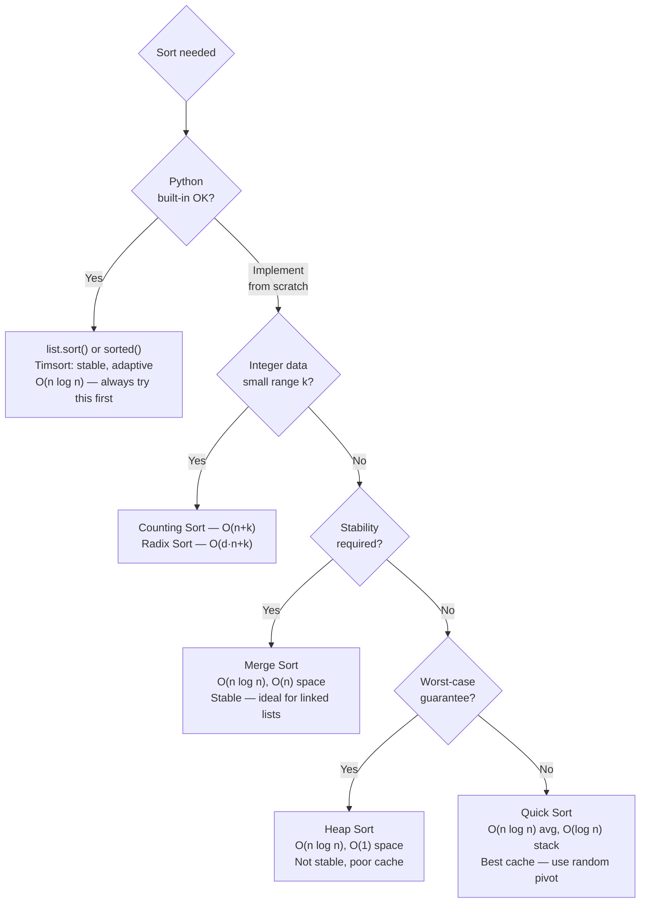
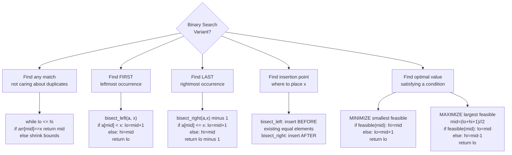

# Sorting and Searching — Python DSA Patterns

> [!abstract] TL;DR
> Python's `sort()` and `sorted()` (Timsort) handle 95% of production sorting needs; `bisect` handles binary search on sorted lists; and "binary search on the answer" — the pattern of binary-searching a feasibility predicate — unlocks an entire class of optimization problems that look nothing like search at first glance.

---

## Intuition

**Analogy:** Imagine a librarian who maintains a card catalogue sorted by author name. Finding a specific author is O(log n) — open to the middle, go left or right, repeat. Inserting a new card means finding the right gap (binary search) then sliding cards apart. The insight: *sorting pays for itself the moment you need to search more than once.* Every binary search algorithm is just a formalization of this "open to the middle" strategy, applied not just to arrays but to abstract answer spaces.

In the "binary search on answer" pattern, the "array" is not data at all — it is every possible numeric answer to a problem. The sorted property is monotonicity: if answer `x` is feasible, then every answer `> x` (or `< x`) is also feasible. Binary search finds the exact tipping point.

---

## How It Works

### 1. Python `sort()` and `sorted()` — Timsort

Python's built-in sort is **Timsort**, a hybrid of merge sort and insertion sort designed for real-world (partially-sorted) data.

| Property | Detail |
|----------|--------|
| Time complexity | O(n log n) worst; O(n) best (already sorted) |
| Space | O(n) — merge sort phase requires extra memory |
| Stability | Yes — equal elements preserve original relative order |
| Adaptivity | Yes — detects natural "runs" of sorted data |

**`list.sort()` vs `sorted()`:**
```python
# sorted() returns a NEW list; list.sort() is in-place
nums = [3, 1, 4, 1, 5, 9]
new_sorted = sorted(nums)          # nums unchanged
nums.sort()                        # nums is now sorted in-place, returns None
```

**`key=` parameter** — applied once per element (no repeated comparison overhead):
```python
# Sort strings by length, then alphabetically (multi-key with tuple)
words = ["banana", "fig", "apple", "cherry", "date"]
words.sort(key=lambda w: (len(w), w))
# ['fig', 'date', 'apple', 'banana', 'cherry']

# Sort list of dicts by value, descending
data = [{"name": "Alice", "score": 88}, {"name": "Bob", "score": 95}]
data.sort(key=lambda x: x["score"], reverse=True)
```

**Multi-pass sort stability trick** — sort by secondary key first, then primary key; stability preserves the secondary order among equal primaries:
```python
# Sort by department first, then by salary within each department
employees = [("eng", 90000), ("hr", 60000), ("eng", 75000), ("hr", 80000)]
employees.sort(key=lambda e: e[1])          # step 1: sort by salary
employees.sort(key=lambda e: e[0])          # step 2: sort by dept (stable!)
# result: salary order is preserved within each dept group
```

**`functools.cmp_to_key()`** — use only when natural ordering is non-transitive (e.g., custom string concatenation for largest number):
```python
import functools

def compare_nums(a, b):
    """For 'largest number' problem: compare which concatenation is larger."""
    if a + b > b + a:
        return -1   # a comes first
    return 1

nums_str = ["3", "30", "34", "5", "9"]
nums_str.sort(key=functools.cmp_to_key(compare_nums))
print("".join(nums_str))   # "9534330"
```

---

### 2. Sorting Algorithms from Scratch

Core algorithms to know — each fills a different niche:

| Algorithm | Time (avg) | Time (worst) | Space | Stable | In-Place | Key property |
|-----------|-----------|-------------|-------|--------|----------|-------------|
| Merge Sort | O(n log n) | O(n log n) | O(n) | Yes | No | Guaranteed; good for linked lists |
| Quick Sort | O(n log n) | O(n²) | O(log n) | No | Yes | Best cache performance in practice |
| Heap Sort | O(n log n) | O(n log n) | O(1) | No | Yes | Guaranteed in-place; poor cache |
| Counting Sort | O(n+k) | O(n+k) | O(k) | Yes | No | Non-comparison; integers only |
| Radix Sort | O(d·(n+k)) | O(d·(n+k)) | O(n+k) | Yes | No | Multi-digit integers; d = digits |
| Bucket Sort | O(n) avg | O(n²) | O(n+k) | Yes | No | Uniform distribution assumption |

**3-way partition for quicksort with many duplicates** (Dutch National Flag):
```
lo, mid, hi = 0, 0, n-1
while mid <= hi:
    if arr[mid] < pivot: swap(arr, lo, mid); lo++; mid++
    elif arr[mid] > pivot: swap(arr, mid, hi); hi--
    else: mid++
```
This gives O(n) performance when all elements are equal (where standard quicksort is O(n²)).

---

### 3. Binary Search Fundamentals

**The invariant:** at any point in the loop, the answer (if it exists) lies in `[lo, hi]`. Never violate this.

**Overflow-safe midpoint:** `mid = lo + (hi - lo) // 2`
- In Python integers are arbitrary-precision so `(lo + hi) // 2` never overflows, but the left-shift form is a good habit from C++/Java.

**Two loop conditions and when to use each:**

| Condition | Closes when | Use for |
|-----------|------------|---------|
| `while lo <= hi` | `lo > hi` | Exact match search (can return -1) |
| `while lo < hi` | `lo == hi` | Lower/upper bound (always returns a valid position) |

**Critical rule:** with `while lo < hi`, you must ensure the loop terminates:
- If `hi = mid`, use `mid = (lo + hi) // 2` (rounds down — safe because hi will strictly decrease)
- If `lo = mid`, use `mid = (lo + hi + 1) // 2` (rounds up — prevents infinite loop when `hi = lo + 1`)

---

### 4. The `bisect` Module

`bisect` implements binary search on sorted lists in C-speed.

```python
import bisect

a = [1, 3, 3, 5, 7, 9]

# bisect_left(a, x): first position i where a[i] >= x
bisect.bisect_left(a, 3)    # 1  (first 3 is at index 1)
bisect.bisect_left(a, 4)    # 3  (4 would go between index 2 and 3)

# bisect_right(a, x): first position i where a[i] > x
bisect.bisect_right(a, 3)   # 3  (after the last 3)
bisect.bisect_right(a, 4)   # 3  (same result for missing value)

# Count occurrences of x in sorted list:
x = 3
count = bisect.bisect_right(a, x) - bisect.bisect_left(a, x)   # 2

# Check if x exists:
i = bisect.bisect_left(a, x)
exists = i < len(a) and a[i] == x   # True

# insort: insert while maintaining sorted order (O(n) due to list shift)
bisect.insort_left(a, 4)    # a is now [1, 3, 3, 4, 5, 7, 9]
```

**`bisect_left` vs `bisect_right` — the boundary rules:**
- `bisect_left(a, x)` returns the leftmost index where `x` can be inserted → used to find the first element `>= x`
- `bisect_right(a, x)` returns the rightmost index where `x` can be inserted → used to find the first element `> x`

For checking element existence: use `bisect_left`, then verify `a[i] == x`. `bisect_right - 1` gives the last occurrence.

---

### 5. Binary Search on Answer — The Most Important Pattern

**The pattern:** "Find the minimum (or maximum) value that satisfies a condition."

The key insight: if answer `x` is feasible, then `x+1` is also feasible (for minimization). The feasibility is monotone, so the boundary between feasible/infeasible can be binary searched.

**Template (minimize smallest feasible value):**
```
lo, hi = min_possible_answer, max_possible_answer
while lo < hi:
    mid = (lo + hi) // 2
    if feasible(mid):
        hi = mid          # mid works — try to find something smaller
    else:
        lo = mid + 1      # mid doesn't work — need at least mid+1
return lo                  # lo == hi, this is the minimum feasible value
```

**Template (maximize largest feasible value):**
```
lo, hi = min_possible_answer, max_possible_answer
while lo < hi:
    mid = (lo + hi + 1) // 2   # round up to avoid infinite loop
    if feasible(mid):
        lo = mid               # mid works — try to find something larger
    else:
        hi = mid - 1           # mid doesn't work — can't go this high
return lo
```

**Classic problems using this pattern:**
- Koko eating bananas (minimize eating speed)
- Capacity to ship packages (minimize ship capacity)
- Find minimum in rotated sorted array
- Split array largest sum (minimize the maximum subarray sum)
- Median of two sorted arrays (find kth element via binary search on partition)

---

### 6. Rotated Sorted Array Patterns

A rotated sorted array like `[4, 5, 6, 7, 0, 1, 2]` has one pivot point where the sort order wraps. Key observations:
- At least one half of any midpoint split is still sorted
- You can determine which half by comparing `arr[lo]` with `arr[mid]`

**Strategy:** determine which half is sorted, then check if target falls in the sorted half. If yes, search there; if no, search the other half.

**With duplicates** (`nums[lo] == nums[mid] == nums[hi]`): you cannot determine which side is sorted. Shrink bounds by one from each side — worst case degrades to O(n).

---

### 7. Quick Select — Kth Element in O(n)

Quick select is quicksort's partition step applied repeatedly — but instead of recursing both sides, recurse only on the side containing the target rank.

- **Expected O(n)** — each random pivot partitions roughly in half
- **O(n²) worst case** — always picks min/max as pivot (mitigate with `random.shuffle` or random pivot)
- **In-place** — O(1) extra space (excluding recursion stack)
- **Not stable** — relative order of equal elements changes

**When to use Quick Select vs alternatives:**
| Approach | Time | Space | Use when |
|----------|------|-------|----------|
| `sorted(arr)[-k]` | O(n log n) | O(n) | k is large, need full sorted order |
| `heapq.nlargest(k, arr)` | O(n log k) | O(k) | Streaming data; k << n |
| Quick select | O(n) avg | O(1) | One-shot kth element on in-memory array |

---

### 8. Order Statistics in Python

```python
import heapq
import statistics

nums = [3, 1, 4, 1, 5, 9, 2, 6]

# Top-k largest: O(n log k) — best for streaming or k << n
top3 = heapq.nlargest(3, nums)           # [9, 6, 5]

# Kth largest via sort: O(n log n) — simplest, use for small inputs
kth = sorted(nums)[-3]                    # 5 (3rd largest)

# Median: O(n log n) — uses sorting internally
med = statistics.median(nums)            # 3.5

# Quantiles: O(n log n)
q = statistics.quantiles(nums, n=4)     # [1.75, 3.5, 5.75] — Q1, Q2, Q3
```

---

### 9. Search in 2D Matrix

Two common variants:

**Variant A — Each row sorted, rows not globally sorted, each col also sorted:**
Start from top-right corner. At `(r, c)`:
- `matrix[r][c] > target` → move left (eliminate column)
- `matrix[r][c] < target` → move down (eliminate row)
- Time: O(m + n), Space: O(1)

**Variant B — Each row sorted AND last element of row < first element of next row (fully sorted):**
Treat as a 1D sorted array of length `m*n`. Binary search on virtual index `i` where `row = i // n`, `col = i % n`.
- Time: O(log(m*n)), Space: O(1)

---

## Flow / Architecture

### Sorting Algorithm Selection



### Binary Search Variants Decision Tree



---

## Code Demo

### Demo 1: Binary Search on Answer — Koko Eating Bananas

```python
import math

def min_eating_speed(piles: list[int], h: int) -> int:
    """
    LeetCode 875: Find minimum speed k so Koko finishes all piles in h hours.
    - Each hour she eats from ONE pile at most k bananas.
    - Binary search on the answer: speed k in [1, max(piles)].
    - feasible(k): total hours at speed k <= h.
    """
    def feasible(speed: int) -> bool:
        return sum(math.ceil(pile / speed) for pile in piles) <= h

    lo, hi = 1, max(piles)
    while lo < hi:
        mid = (lo + hi) // 2
        if feasible(mid):
            hi = mid          # speed mid works — try slower
        else:
            lo = mid + 1      # speed mid too slow — need at least mid+1
    return lo

# Test
piles = [3, 6, 7, 11]
h = 8
print(min_eating_speed(piles, h))   # 4
# At k=4: ceil(3/4)+ceil(6/4)+ceil(7/4)+ceil(11/4) = 1+2+2+3 = 8 hours exactly
```

---

### Demo 2: Quick Select — Kth Largest Element

```python
import random

def find_kth_largest(nums: list[int], k: int) -> int:
    """
    LeetCode 215: Kth Largest Element — in-place QuickSelect.
    k-th largest == (n-k)-th smallest (0-indexed from left).
    Expected O(n) time, O(1) space (excluding recursion stack).
    """
    target_idx = len(nums) - k   # target rank from the left

    def partition(lo: int, hi: int) -> int:
        # Random pivot: avoids O(n^2) on sorted/reverse-sorted input
        pivot_idx = random.randint(lo, hi)
        nums[pivot_idx], nums[hi] = nums[hi], nums[pivot_idx]
        pivot = nums[hi]
        store = lo
        for i in range(lo, hi):
            if nums[i] <= pivot:
                nums[store], nums[i] = nums[i], nums[store]
                store += 1
        nums[store], nums[hi] = nums[hi], nums[store]
        return store

    lo, hi = 0, len(nums) - 1
    while lo < hi:
        p = partition(lo, hi)
        if p == target_idx:
            return nums[p]
        elif p < target_idx:
            lo = p + 1
        else:
            hi = p - 1
    return nums[lo]

# Test
print(find_kth_largest([3, 2, 1, 5, 6, 4], 2))   # 5 (2nd largest)
print(find_kth_largest([3, 2, 3, 1, 2, 4, 5, 5, 6], 4))  # 4
```

---

### Demo 3: Merge Sort with Explicit Merge Step

```python
def merge_sort(arr: list[int]) -> list[int]:
    """
    Stable merge sort: O(n log n) time, O(n) extra space.
    Returns a NEW sorted list; does not modify arr.
    """
    if len(arr) <= 1:
        return arr[:]

    mid = len(arr) // 2
    left = merge_sort(arr[:mid])
    right = merge_sort(arr[mid:])
    return _merge(left, right)


def _merge(left: list[int], right: list[int]) -> list[int]:
    """
    Merge two sorted lists into one sorted list.
    <= ensures stability: equal elements from left stay before right.
    """
    result = []
    i = j = 0
    while i < len(left) and j < len(right):
        if left[i] <= right[j]:   # <= is key to stability
            result.append(left[i])
            i += 1
        else:
            result.append(right[j])
            j += 1
    result.extend(left[i:])
    result.extend(right[j:])
    return result

# Test
arr = [5, 2, 4, 6, 1, 3]
print(merge_sort(arr))   # [1, 2, 3, 4, 5, 6]
print(arr)               # [5, 2, 4, 6, 1, 3] — original unchanged
```

---

### Demo 4: Search in Rotated Sorted Array with Duplicates

```python
def search_rotated_with_duplicates(nums: list[int], target: int) -> bool:
    """
    LeetCode 81: Search in Rotated Sorted Array II (handles duplicates).
    Returns True if target exists in the array.
    O(log n) average, O(n) worst case when duplicates prevent half-elimination.
    """
    lo, hi = 0, len(nums) - 1
    while lo <= hi:
        mid = (lo + hi) // 2
        if nums[mid] == target:
            return True
        # Duplicate ambiguity: nums[lo]==nums[mid]==nums[hi]
        # Cannot tell which half is sorted — shrink both bounds safely
        if nums[lo] == nums[mid] == nums[hi]:
            lo += 1
            hi -= 1
        elif nums[lo] <= nums[mid]:   # left half is sorted
            if nums[lo] <= target < nums[mid]:
                hi = mid - 1          # target in sorted left half
            else:
                lo = mid + 1          # target in right half
        else:                         # right half is sorted
            if nums[mid] < target <= nums[hi]:
                lo = mid + 1          # target in sorted right half
            else:
                hi = mid - 1          # target in left half
    return False

# Tests
print(search_rotated_with_duplicates([2, 5, 6, 0, 0, 1, 2], 0))   # True
print(search_rotated_with_duplicates([2, 5, 6, 0, 0, 1, 2], 3))   # False
print(search_rotated_with_duplicates([1, 1, 3, 1], 3))             # True
```

---

## Real-World Example

> **Example:** NumPy's `numpy.searchsorted(a, v, side='left'|'right')` is `bisect_left`/`bisect_right` implemented at C-speed for entire arrays at once. It is used internally by `numpy.histogram` (every bin boundary is a binary search over the bin edges array), by `pandas.cut` and `pandas.qcut` for bucketing continuous features, and in distributed sort-merge joins where worker outputs are sorted and binary search locates the merge boundary. Any time you see `np.searchsorted` in a data pipeline, a binary search is happening — the Python `bisect` equivalent that scales to 10M+ element arrays without a Python loop.

---

## Trade-offs

### `sorted()` vs `heapq.nlargest()` vs Quick Select

| Approach | Time | Space | Use case |
|----------|------|-------|----------|
| `sorted(arr)[-k]` | O(n log n) | O(n) | Need full sorted order; k is large (k ≈ n) |
| `heapq.nlargest(k, arr)` | O(n log k) | O(k) | Streaming top-k; k << n; can't modify input |
| Quick select | O(n) avg | O(1) | One-shot kth element; can modify input in-place; k << n |

### `bisect_left` vs `bisect_right`

| Function | Returns | First element found | Last element found | Existence check |
|----------|---------|--------------------|--------------------|-----------------|
| `bisect_left(a, x)` | Leftmost insert point; `a[i] >= x` everywhere right | `a[bisect_left(a,x)]` if it equals x | N/A | `a[i]==x` where `i=bisect_left(a,x)` |
| `bisect_right(a, x)` | Rightmost insert point; `a[i] > x` everywhere right | N/A | `a[bisect_right(a,x)-1]` if it equals x | `bisect_right > bisect_left` |
| **Count of x** | — | — | — | `bisect_right(a,x) - bisect_left(a,x)` |

### Merge Sort vs Quick Sort

| Aspect | Merge Sort | Quick Sort |
|--------|-----------|-----------|
| Stability | Stable (equal elements preserve order) | Not stable (Lomuto/Hoare both swap equal elements) |
| In-place | No — O(n) extra space for merge buffer | Yes — O(log n) stack space for recursion |
| Cache performance | Poor — merge step accesses two non-adjacent subarrays | Excellent — partition scans sequential memory |
| Worst case | O(n log n) guaranteed | O(n²) on sorted/reverse input with naive pivot |
| Best for | Linked lists; stable sort; external sort; predictable perf | Arrays; in-practice speed; memory-constrained systems |
| Python's choice | Timsort is merge-sort based — stability wins for `key=` patterns | Use for Quick Select only; not used in Python builtins |

---

## When to Use vs Avoid

**Use Python's `sort()` / `sorted()` when:**
- You need a sorted list and the data fits in memory — always the default
- You need a stable sort (multi-pass sort trick relies on stability)
- You are sorting with a `key=` function — the key is evaluated once, not repeated

**Use binary search / `bisect` when:**
- Data is already sorted and you need O(log n) lookup
- Counting occurrences of a value in a sorted list
- Finding insertion points for interval merging or scheduling problems

**Use binary search on answer when:**
- Problem asks "find the minimum X such that [condition]" or "find maximum X such that [condition]"
- You can write a `feasible(x) -> bool` function in O(n) or O(n log n)
- The feasibility is monotone (once true, always true as x increases/decreases)

**Avoid custom sort implementations when:**
- Python's `sorted()` meets the requirement — Timsort is faster than any pure-Python implementation
- `key=` can express the comparison — avoid `functools.cmp_to_key` unless the ordering is non-transitive

**Avoid Quick Select when:**
- Input may be adversarial — use `heapq.nlargest` instead (no O(n²) risk)
- You need a sorted result, not just the kth element

---

## Common Pitfalls

- **Infinite loop with `lo = mid` in `while lo < hi`** — if `hi = lo + 1`, then `mid = lo`, and `lo = mid` never advances. Fix: use `lo = mid + 1` when updating the lower bound, or use `mid = (lo + hi + 1) // 2` when `lo = mid` is unavoidable (maximize template).

- **`bisect_left` vs `bisect_right` for existence check** — `bisect_right(a, x) - 1` gives the index of the last element `<= x`, which equals `x` if x is present. But `bisect_left(a, x)` gives the first position `>= x` — check `a[i] == x`. Mixing these up gives wrong answers for duplicates.

- **Off-by-one in count of element** — use `bisect_right(a, x) - bisect_left(a, x)`. Using `bisect_right(a, x) - bisect_right(a, x-1)` is fragile (breaks for floats, off-by-one for integers).

- **Timsort `key=` vs comparison function** — Python 3 removed the `cmp=` parameter. The correct approach is `key=`. `functools.cmp_to_key` is an escape hatch for algorithms where the comparison is not decomposable into a key (e.g., "largest number" problem) — do not use it when `key=` suffices.

- **Binary search on answer with wrong boundary** — setting `lo = 0, hi = max(piles)` works for Koko but fails if the minimum feasible answer is 0 (infeasible by definition). Always think about whether `lo` is a valid feasible value and whether `hi` is guaranteed to be feasible (to ensure the loop terminates at a valid answer).

- **Quick Select modifying input** — `find_kth_largest(nums, k)` partitions `nums` in-place. If the caller still needs the original order, pass a copy: `find_kth_largest(nums[:], k)`.

---

## Related Concepts

- [[Binary_Search]] — the foundational templates for exact match, lower bound, and upper bound that this note builds on
- [[Binary_Search_Patterns]] — deep-dive on the binary search on answer / parametric search pattern with additional problems
- [[Sorting_Overview]] — full algorithm comparison table and decision guide for all sort variants
- [[Merge_Sort]] — detailed implementation of the stable merge sort with in-place optimization techniques
- [[Quick_Sort]] — Lomuto and Hoare partition, 3-way partition for duplicates, and randomized pivot analysis
- [[Counting_Sort]] — O(n+k) non-comparison sort referenced in the linear sort section above
- [[Radix_Sort]] — digit-by-digit sort that extends counting sort to multi-digit integers
- [[Top_K_Pattern]] — comprehensive coverage of the min-heap vs Quick Select vs sort tradeoff for top-k problems
- [[Binary_Heap]] — the underlying data structure powering `heapq.nlargest` and `heapq.nsmallest`
- [[Priority_Queue]] — Python's `heapq` module API and patterns for streaming order statistics
- [[Divide_and_Conquer]] — the algorithmic paradigm that underpins both merge sort and quicksort
- [[Two_Pointers]] — complementary search pattern for unsorted or two-array problems where binary search does not apply
- [[Python_for_ML]] — Python performance patterns and data structures; the context for when `bisect` and `sort()` appear in ML pipelines
- [[Generators_and_Iterators]] — when processing large sorted datasets, combine `bisect` with generator pipelines to avoid materializing full sorted lists
- [[Big_O_Notation]] — complexity analysis needed to choose between O(n log n) sort, O(n log k) heap, and O(n) quick select

---

## Review Questions

1. **Pattern recognition:** You are given a function `can_build(days) -> bool` that returns `True` if a factory can produce N items in `days` days or fewer, and the function is monotone (more days → easier). Write the binary search template to find the minimum number of days needed. What invariant does your `lo` pointer maintain throughout the loop?

2. **`bisect` precision:** Given a sorted list `a = [1, 2, 2, 2, 3, 4]`, what does `bisect.bisect_left(a, 2)` return? What does `bisect.bisect_right(a, 2)` return? How would you use these two calls to count the number of occurrences of `2` in the list, and to check whether `2` exists?

3. **Stability trade-off:** You need to sort a list of `(student_id, exam_score)` tuples first by score descending, then by student_id ascending as a tiebreaker — all in a single `sort()` call. Write the `key=` lambda. Then explain: if you instead did a two-pass sort (sort by student_id first, then by score), does the stability of Timsort guarantee the correct final order? Why or why not?

4. **Quick Select vs heap:** A data pipeline receives a stream of one million integers and must report the top-100 largest values after processing all of them. You cannot store the full stream. Compare `heapq.nlargest(100, stream)` vs first collecting into a list then using Quick Select. Which is better and why? What changes if you need the top-100 after every 10,000 items (rolling top-100)?

---

## Sources

- [Python docs — Sorting HOW TO](https://docs.python.org/3/howto/sorting.html)
- [Python docs — bisect module](https://docs.python.org/3/library/bisect.html)
- [Python docs — heapq module](https://docs.python.org/3/library/heapq.html)
- [CPython Timsort source — listsort.txt](https://github.com/python/cpython/blob/main/Objects/listsort.txt)
- [LeetCode 875 — Koko Eating Bananas](https://leetcode.com/problems/koko-eating-bananas/)
- [LeetCode 215 — Kth Largest Element in an Array](https://leetcode.com/problems/kth-largest-element-in-an-array/)
- [LeetCode 81 — Search in Rotated Sorted Array II](https://leetcode.com/problems/search-in-rotated-sorted-array-ii/)

---

#dsa #sorting #binary-search #python #leetcode #timsort
