# Stack and Queue Patterns in Python

> [!abstract] TL;DR
> Stacks (LIFO) and queues (FIFO) unlock eight major interview patterns: bracket matching, iterative DFS, monotonic stack for next-greater/smaller problems, two-stack tricks (min stack, queue simulation), BFS level traversal, monotonic deque for sliding-window maximum, and heapq-driven priority patterns. Python's `list` is a fine stack; always use `collections.deque` as a queue — `list.pop(0)` is O(n) and a silent performance killer.

---

## Intuition

**Analogy:** Think of two contrasting diners. A **stack** is a cafeteria plate dispenser — the last plate loaded is the first one grabbed; only the top is ever accessible. A **queue** is a theme park ride line — first person in is first person served; newcomers join the back, everyone exits from the front.

Every algorithm in this note reduces to one question: do you need the most recently seen thing (stack) or the earliest thing you have not yet handled (queue)? A **monotonic stack** adds one extra constraint to the plate dispenser: whenever a taller plate arrives, shorter plates below it are automatically ejected. That single extra rule enables a family of O(n) algorithms that would otherwise require O(n²) brute force.

---

## Pattern Taxonomy

```mermaid
graph TD
    ROOT["Stack and Queue Patterns in Python"]
    ROOT --> STACK_NODE["Stack — LIFO"]
    ROOT --> QUEUE_NODE["Queue — FIFO"]

    STACK_NODE --> BASE_STACK["list or deque\nappend + pop O1"]
    STACK_NODE --> MONO_NODE["Monotonic Stack"]
    STACK_NODE --> TWO_NODE["Two-Stack Patterns"]

    BASE_STACK --> B1["Balanced Parentheses"]
    BASE_STACK --> B2["Iterative DFS"]
    BASE_STACK --> B3["Undo and Redo"]

    MONO_NODE --> M1["Next Greater Element"]
    MONO_NODE --> M2["Largest Rectangle in Histogram"]
    MONO_NODE --> M3["Trapping Rain Water"]

    TWO_NODE --> T1["Min Stack O1 getMin"]
    TWO_NODE --> T2["Queue via Two Stacks"]
    TWO_NODE --> T3["Reverse Polish Notation"]

    QUEUE_NODE --> PLAIN_Q["deque — append + popleft O1"]
    QUEUE_NODE --> MONO_DQ["Monotonic Deque"]
    QUEUE_NODE --> HEAP_Q["heapq — min-heap"]

    PLAIN_Q --> Q1["BFS and Level Order Traversal"]
    PLAIN_Q --> Q2["Multi-Source BFS"]
    PLAIN_Q --> Q3["0-1 BFS with deque"]

    MONO_DQ --> D1["Sliding Window Maximum O(n)"]
    MONO_DQ --> D2["Jump Game VI DP Optimization"]

    HEAP_Q --> H1["Dijkstra Shortest Path"]
    HEAP_Q --> H2["Top-K Elements"]
    HEAP_Q --> H3["Median Maintenance"]
```



---

## How It Works

### 1. Stack in Python

Python's `list` is the idiomatic stack. `append()` and `pop()` are both amortized O(1) because CPython over-allocates backing memory with a doubling strategy. `list[-1]` gives O(1) peek without removal.

```python
stack = []
stack.append(10)    # push
stack.append(20)
peek = stack[-1]    # 20 — no removal, O(1)
val  = stack.pop()  # 20 — removes top, O(1)
```

**`list` vs `collections.deque` for stack-only use:** Both offer O(1) push/pop at the right end. A `list` wins on random access (O(1) vs deque's O(n)); a `deque` has constant-time guarantees without amortization and also supports `appendleft`/`popleft` for queue use. For pure stack operations, `list` is idiomatic Python. Reach for `deque` when you also need queue operations in the same structure.

**Stack in the call stack:** Every function call pushes a frame onto Python's call stack. Recursive algorithms implicitly use this stack, but Python's default recursion limit is 1,000 frames. Converting recursion to an explicit stack removes this limit and makes depth predictable.

```python
class Stack:
    def __init__(self):
        self._data = []

    def push(self, val):    self._data.append(val)
    def pop(self):          return self._data.pop()
    def peek(self):         return self._data[-1]
    def is_empty(self):     return not self._data
    def __len__(self):      return len(self._data)
    def __repr__(self):     return f"Stack({self._data})"
```

---

### 2. Queue in Python

> [!danger] Never use `list.pop(0)` as a queue dequeue. It is O(n) because every remaining element shifts left in memory. For n = 10,000 elements processed one by one, that is ~50 million memory writes.

**`collections.deque`** is the standard queue. Implemented as a doubly-linked list of fixed-size blocks; `appendleft`, `popleft`, `append`, and `pop` are all O(1).

```python
from collections import deque

q = deque()
q.append(1)        # enqueue at rear — O(1)
q.append(2)
front = q[0]       # peek front — O(1)
val   = q.popleft()  # dequeue from front — O(1)
```

**`queue` module for threads:** `queue.Queue` adds internal locking for multi-threaded producer-consumer pipelines. `queue.LifoQueue` is a thread-safe stack; `queue.PriorityQueue` is a thread-safe heap. For single-threaded algorithm work, always prefer `collections.deque` or `heapq` — they carry zero locking overhead.

---

### 3. Balanced Parentheses

**Core insight:** Push every opening bracket. On every closing bracket, pop and verify that the top matches. If the stack is empty after processing all characters, the string is balanced.

```python
def is_valid(s: str) -> bool:
    close_to_open = {')': '(', '}': '{', ']': '['}
    stack = []
    for ch in s:
        if ch in '({[':
            stack.append(ch)
        elif ch in ')}]':
            if not stack or stack[-1] != close_to_open[ch]:
                return False
            stack.pop()
    return not stack

# "({[]})"  → True
# "([)]"    → False
```

**Variations that use the same core pattern:**
- **Minimum Add to Make Valid (LC 1249):** Count unmatched `(` and unmatched `)` separately; the answer is the sum of both counts.
- **Score of Parentheses (LC 856):** Stack of integers; `(` pushes 0, `)` pops — if inner value was 0 it contributes 1, otherwise it is doubled before being added to the new top.

---

### 4. Monotonic Stack — Critical Interview Pattern

A monotonic stack maintains a sorted order by popping elements that violate the invariant when a new element arrives. Each element is pushed once and popped at most once — O(n) total despite the nested loop.

| Stack type | Order (bottom to top) | Pop condition | Answers |
|------------|-----------------------|---------------|---------|
| Decreasing | large to small | new element is **larger** | Next Greater Element |
| Increasing | small to large | new element is **smaller** | Next Smaller Element |

**Template — always store indices, not values.** Indices let you compute distances and widths:

```python
stack = []    # stores indices
for i, val in enumerate(arr):
    while stack and arr[stack[-1]] < val:   # change < to > for "next smaller"
        popped_idx = stack.pop()
        # arr[popped_idx]'s "next greater" is val (index i)
        result[popped_idx] = i - popped_idx   # or whatever you need
    stack.append(i)
# Elements remaining on stack have no next greater (assign default, e.g. -1 or 0)
```

**Why O(n)?** Each index is pushed exactly once and popped at most once. Total push + pop operations ≤ 2n regardless of input shape.

**Sentinel trick:** For histogram-style problems, append `0` or `-inf` to the input to automatically flush every remaining stack element at the end without an extra cleanup loop.

**Classic problems and their stack types:**

| Problem | Stack type | Key twist |
|---------|-----------|-----------|
| Next Greater Element (LC 496/503) | Decreasing | Store values in map |
| Daily Temperatures (LC 739) | Decreasing | Store indices; answer = i − j |
| Largest Rectangle in Histogram (LC 84) | Increasing | Width uses `stack[-1]` as left boundary after pop |
| Trapping Rain Water (LC 42) | Decreasing | Compute bounded water between left wall and current bar |
| Stock Span (LC 901) | Decreasing | Count of consecutive days ≤ today's price |

---

### 5. Two-Stack Patterns

**Min Stack (LC 155) — O(1) `getMin` at all times:**

Maintain a parallel `min_stack` where `min_stack[i]` is the minimum of `stack[0..i]`. When the main stack pops, the min stack pops in sync, restoring the previous minimum.

```python
class MinStack:
    def __init__(self):
        self.stack     = []
        self.min_stack = []    # min_stack[-1] is always the current minimum

    def push(self, val: int) -> None:
        self.stack.append(val)
        running_min = val if not self.min_stack else min(val, self.min_stack[-1])
        self.min_stack.append(running_min)

    def pop(self) -> None:
        self.stack.pop()
        self.min_stack.pop()   # stays in sync — this is critical

    def top(self) -> int:      return self.stack[-1]
    def getMin(self) -> int:   return self.min_stack[-1]
```

> [!warning] Common mistake: only pushing to `min_stack` on new minimums. If you do this, `min_stack` and `main_stack` become misaligned after any pop. Always push to `min_stack` on every `push`, regardless of whether the value is a new minimum.

**Queue from Two Stacks (LC 232) — amortized O(1) per operation:**

Elements are pushed onto `inbox`. On dequeue, if `outbox` is empty, drain all of `inbox` into `outbox` (which reverses the order, restoring FIFO). Each element moves from inbox to outbox at most once across its lifetime — amortized O(1) per dequeue.

```python
class MyQueue:
    def __init__(self):
        self.inbox  = []    # push here
        self.outbox = []    # pop from here

    def push(self, val: int) -> None:
        self.inbox.append(val)

    def pop(self) -> int:
        self._refill()
        return self.outbox.pop()

    def peek(self) -> int:
        self._refill()
        return self.outbox[-1]

    def empty(self) -> bool:
        return not self.inbox and not self.outbox

    def _refill(self) -> None:
        if not self.outbox:
            while self.inbox:
                self.outbox.append(self.inbox.pop())
```

**Reverse Polish Notation (LC 150):** Single stack, numbers push, operators pop two operands and push the result. `int(a / b)` for division (truncates toward zero, matching the problem spec — Python's `//` truncates toward negative infinity).

---

### 6. BFS with Queue

BFS explores level by level. The FIFO property guarantees that when you first reach a node, you have found the shortest path to it in an unweighted graph.

**Level-by-level template** — snapshot `len(queue)` at the start of each level to process exactly that level's nodes before moving on:

```python
from collections import deque

def bfs_level_order(root):
    if not root:
        return []
    q = deque([root])
    levels = []
    while q:
        level_size = len(q)          # nodes at this depth — snapshot before loop
        level = []
        for _ in range(level_size):
            node = q.popleft()
            level.append(node.val)
            if node.left:  q.append(node.left)
            if node.right: q.append(node.right)
        levels.append(level)
    return levels
```

**Multi-source BFS:** Seed the queue with all sources simultaneously at distance 0. One BFS pass computes "distance to nearest source" for every node in O(V+E). Classic use: Rotting Oranges (LC 994) — all initially rotten oranges are seeds.

**0-1 BFS with deque:** When edge weights are only 0 or 1, replace the priority queue with a deque. Zero-weight edges go to the **front** (`appendleft`) — they are free moves processed next. Unit-weight edges go to the **back** (`append`). Achieves O(V+E) vs Dijkstra's O((V+E) log V).

```python
def bfs_01(graph, start, n):
    dist = [float('inf')] * n
    dist[start] = 0
    dq = deque([start])
    while dq:
        u = dq.popleft()
        for v, w in graph[u]:
            if dist[u] + w < dist[v]:
                dist[v] = dist[u] + w
                if w == 0:
                    dq.appendleft(v)   # free move — process immediately
                else:
                    dq.append(v)       # costly move — process after current level
    return dist
```

---

### 7. Sliding Window Maximum with Monotonic Deque

**Pattern:** Maintain a monotonic **decreasing** deque of indices. The deque front always holds the index of the current window's maximum.

For each index `i`:
1. Remove from the **front** any index that has exited the window (`dq[0] <= i - k`).
2. Remove from the **rear** any index whose stored value is smaller than or equal to `nums[i]` — those indices can never become the window maximum while `nums[i]` remains in the window.
3. Append `i` to the rear.
4. Once `i >= k - 1`, `nums[dq[0]]` is the window maximum.

Total cost: each index enters the deque once and leaves once — O(n).

> [!warning] Step order matters. Evict out-of-window indices from the front **first**, then clean the rear. Reversing these steps can incorrectly remove the true maximum before it leaves the window.

---

### 8. Priority Queue with heapq

Python's `heapq` is a **min-heap** over a plain list. There is no separate `MaxHeap` class — negate values to get max-heap behavior.

**Full API reference:**

```
heapq.heappush(h, item)        # O(log n) — insert
heapq.heappop(h)               # O(log n) — remove and return min
h[0]                           # O(1)      — peek min without removal
heapq.heapify(lst)             # O(n)      — convert list to heap in-place
heapq.heapreplace(h, item)     # O(log n)  — pop then push; errors if empty
heapq.heappushpop(h, item)     # O(log n)  — push then pop; safe on empty
heapq.nlargest(k, iterable)    # O(n + k log n)
heapq.nsmallest(k, iterable)   # O(n + k log n)
```

**Max-heap via negation:**
```python
import heapq
max_heap = []
for val in [5, 1, 8, 3]:
    heapq.heappush(max_heap, -val)
max_val = -heapq.heappop(max_heap)   # 8
```

**Tuple heap for `(priority, item)` — always add a tiebreaker.** Python compares tuples lexicographically. If two entries share the same priority and the item objects are not comparable (no `__lt__`), Python raises `TypeError`. A monotonic counter eliminates this:

```python
import heapq, itertools
counter = itertools.count()
heap = []
heapq.heappush(heap, (priority, next(counter), item))
```

**Top-K frequent elements pattern:**
```python
from collections import Counter
import heapq

def top_k_frequent(nums: list[int], k: int) -> list[int]:
    freq = Counter(nums)
    # nlargest scans full freq dict and returns k most-frequent keys
    return heapq.nlargest(k, freq, key=freq.get)
```

**`nlargest` vs manual min-heap of size k:** For k << n both are O(n log k). `nlargest` is simpler for one-shot queries; a manual min-heap of size k is better for streaming data where you receive elements one at a time and want the running top-k.

---

### 9. Monotonic Queue Patterns Beyond Sliding Window

**Jump Game VI (LC 1696) — DP with deque optimization:**

`dp[i] = nums[i] + max(dp[i-k], ..., dp[i-1])`. The naive implementation computes the window max in O(k) per step — O(nk) total. The monotonic deque reduces the inner max to O(1) amortized — O(n) total.

```python
from collections import deque

def max_result(nums: list[int], k: int) -> int:
    n = len(nums)
    dp = [0] * n
    dp[0] = nums[0]
    dq = deque([0])   # indices; dp values are decreasing front to back

    for i in range(1, n):
        # Evict indices outside the window
        while dq and dq[0] < i - k:
            dq.popleft()
        dp[i] = nums[i] + dp[dq[0]]    # front = best dp in window
        # Maintain decreasing order of dp values in deque
        while dq and dp[dq[-1]] <= dp[i]:
            dq.pop()
        dq.append(i)

    return dp[-1]
```

**Constrained Subsequence Sum (LC 1425):** Identical structure — `dp[i] = nums[i] + max(0, max(dp[i-k]..dp[i-1]))`. The deque tracks the best reachable dp in the allowed jump range.

**General pattern:** Whenever you have `dp[i] = f(nums[i], max or min of dp over a sliding window of size k)`, the naive O(k) window query can always be replaced by a monotonic deque for O(1) per step.

---

## Code Demo

```python
from collections import deque
import heapq

# ── 1. Largest Rectangle in Histogram (LC 84) ─────────────────────────────────
# Monotonic increasing stack. When a shorter bar arrives (h), pop all taller
# bars and compute the maximum rectangle each could form with h as right boundary.
# Width of popped bar's rectangle: from current stack top (left boundary) to i.

def largest_rectangle_area(heights: list[int]) -> int:
    heights = heights + [0]   # sentinel: height 0 flushes the entire stack
    stack = []                # monotonic increasing — stores indices
    max_area = 0

    for i, h in enumerate(heights):
        while stack and heights[stack[-1]] >= h:
            idx = stack.pop()
            left_boundary = stack[-1] if stack else -1
            width = i - left_boundary - 1
            max_area = max(max_area, heights[idx] * width)
        stack.append(i)

    return max_area

assert largest_rectangle_area([2, 1, 5, 6, 2, 3]) == 10   # 5×2 rectangle
assert largest_rectangle_area([2, 4])              == 4    # 4×1 rectangle
assert largest_rectangle_area([1])                 == 1
print("largest_rectangle_area: OK")


# ── 2. Sliding Window Maximum (LC 239) ────────────────────────────────────────
# Monotonic decreasing deque of indices.
# dq[0] is always the index of the current window's maximum value.

def max_sliding_window(nums: list[int], k: int) -> list[int]:
    dq = deque()    # indices; values nums[dq[i]] are decreasing front to back
    result = []

    for i, num in enumerate(nums):
        # Step 1: evict indices that have exited the window
        if dq and dq[0] <= i - k:
            dq.popleft()

        # Step 2: remove rear indices with values <= current (they can never be max)
        while dq and nums[dq[-1]] <= num:
            dq.pop()

        dq.append(i)

        # Step 3: record window max once the first full window is formed
        if i >= k - 1:
            result.append(nums[dq[0]])

    return result

assert max_sliding_window([1, 3, -1, -3, 5, 3, 6, 7], 3) == [3, 3, 5, 5, 6, 7]
assert max_sliding_window([1], 1) == [1]
print("max_sliding_window: OK")


# ── 3. Min Stack — O(1) getMin (LC 155) ───────────────────────────────────────
# min_stack[i] = running minimum across stack[0..i].
# Push to min_stack on EVERY push (not just on new minimums).
# Pop from both stacks in sync to maintain alignment.

class MinStack:
    def __init__(self):
        self.stack     = []
        self.min_stack = []    # min_stack[-1] = current minimum

    def push(self, val: int) -> None:
        self.stack.append(val)
        running_min = val if not self.min_stack else min(val, self.min_stack[-1])
        self.min_stack.append(running_min)

    def pop(self) -> None:
        self.stack.pop()
        self.min_stack.pop()   # must stay in sync with main stack

    def top(self) -> int:
        return self.stack[-1]

    def getMin(self) -> int:
        return self.min_stack[-1]

ms = MinStack()
ms.push(-2); ms.push(0); ms.push(-3)
assert ms.getMin() == -3    # -3 is the current minimum
ms.pop()
assert ms.top()    == 0     # top reverts to 0
assert ms.getMin() == -2    # minimum reverts to -2
print("MinStack: OK")


# ── 4. BFS Shortest Path in Grid with Obstacles (LC 1091 adapted) ─────────────
# 0 = open cell, 1 = obstacle. 4-directional movement.
# Returns minimum steps from top-left (0,0) to bottom-right (R-1, C-1), or -1.
# Mark cells visited WHEN ENQUEUED, not when dequeued — prevents duplicate enqueues.

def shortest_path_in_grid(grid: list[list[int]]) -> int:
    rows, cols = len(grid), len(grid[0])
    if grid[0][0] == 1 or grid[rows-1][cols-1] == 1:
        return -1

    directions = [(0, 1), (0, -1), (1, 0), (-1, 0)]
    visited = {(0, 0)}
    q = deque([(0, 0, 1)])    # (row, col, steps)

    while q:
        r, c, steps = q.popleft()
        if r == rows - 1 and c == cols - 1:
            return steps
        for dr, dc in directions:
            nr, nc = r + dr, c + dc
            if (0 <= nr < rows and 0 <= nc < cols
                    and grid[nr][nc] == 0
                    and (nr, nc) not in visited):
                visited.add((nr, nc))   # mark on enqueue — not on dequeue
                q.append((nr, nc, steps + 1))

    return -1   # unreachable

grid_blocked = [
    [0, 1, 1],
    [1, 1, 0],
    [1, 0, 0],
]
grid_open = [
    [0, 0, 0],
    [1, 1, 0],
    [1, 1, 0],
]
assert shortest_path_in_grid(grid_blocked) == -1
assert shortest_path_in_grid(grid_open)    == 4   # path: (0,0)→(0,1)→(1,2)→(2,2)
print("shortest_path_in_grid: OK")
```

---

## Real-World Example

> **Example — Redis Lists and Celery Task Queues:** Redis's `LPUSH`/`RPUSH`/`LPOP`/`RPOP` commands implement deque semantics at the infrastructure level. Celery (the Python distributed task queue) uses Redis lists as job queues: producers `RPUSH` task payloads onto the right end; workers `BLPOP` (blocking left-pop) from the front — an O(1) dequeue that blocks until an item arrives. The sliding-window rate limiter common in API gateways uses a Redis sorted set as a monotonic queue: timestamps outside the rolling window are evicted with `ZREMRANGEBYSCORE`, then `ZCARD` counts the remaining requests. The data structure patterns — deque for FIFO, monotonic eviction for window extremum — are identical to what `collections.deque` implements in-process.

---

## Trade-offs

| Comparison | Option A | Option B | Decision rule |
|------------|----------|----------|---------------|
| Stack implementation | `list` — O(1) amortized; O(1) random access | `deque` — O(1) guaranteed; O(n) random access | Use `list` for pure stacks; use `deque` when you also need queue ops on the same structure |
| Dynamic priority queries | `heapq` — stdlib, O(log n) push/pop, no arbitrary deletion | `sortedcontainers.SortedList` — O(log n) insert/delete at any position, third-party | Use `heapq` for standard top-K / Dijkstra; use `SortedList` when you need O(log n) rank queries or deletion of arbitrary elements |
| Shortest path algorithm | BFS — O(V+E), guarantees shortest path in unweighted graphs | DFS — O(V+E), finds a path but not guaranteed shortest; less memory on narrow deep graphs | Use BFS whenever "minimum steps/hops" is the question; DFS for reachability or complete path enumeration |
| Window extremum | Monotonic deque — O(n) total, handles any window | Segment tree / sparse table — O(n log n) build + O(1) or O(log n) query | Monotonic deque for single-pass online problems; sparse table for static arrays with many offline range-max queries |

---

## When to Use vs Avoid

**Use a stack when:**
- Processing must happen in reverse order of arrival — undo, expression evaluation, call frame tracking
- You need "the most recent element satisfying condition X" — monotonic stack for next-greater/smaller
- Converting recursion to iteration to avoid Python's 1,000-frame recursion limit

**Use a queue (deque) when:**
- Level-by-level graph or tree traversal (BFS)
- Sliding-window extremum in O(n) — monotonic deque
- FIFO producer-consumer pipelines where arrival order must be preserved

**Use heapq when:**
- Repeated access to the global minimum (or maximum via negation) — Dijkstra, A*, task scheduling
- Top-K or bottom-K queries over a stream
- Merging k sorted iterators

**Avoid these patterns:**
- `list.pop(0)` as a queue dequeue — always O(n); replace with `deque.popleft()`
- `heapq` when you need O(log n) deletion of arbitrary elements — it has no such operation; use `sortedcontainers.SortedList`
- DFS for shortest-path problems in unweighted graphs — use BFS instead

---

## Common Pitfalls

- **`list.pop(0)` as queue dequeue** — silently O(n) because every remaining element shifts in memory. It passes small tests and catastrophically degrades on large inputs. Always use `deque.popleft()`.

- **Monotonic deque eviction order** — in the sliding window maximum pattern, evict out-of-window indices from the front *before* removing smaller elements from the rear. If you do it in reverse order, you may incorrectly discard the true window maximum before checking whether it has gone stale.

- **Min stack not pushing on every push** — only pushing to `min_stack` when a new minimum is seen causes `min_stack` and `main_stack` to have different depths. The first pop of a non-minimum value misaligns them permanently. Always push the running minimum unconditionally.

- **heapq is a min-heap — negate for max** — `heapq.heappop` returns the *smallest* element. Forgetting to negate on both `heappush` and `heappop` gives results with reversed sign. When combining with tuple heaps `(-val, idx, item)`, remember to negate only the priority component.

- **Tuple heap without tiebreaker** — if two heap entries have the same priority and the item objects do not implement `__lt__`, Python raises `TypeError` when comparing the third element. Always insert a monotonic counter as a middle element: `(priority, next(counter), item)`.

- **Marking BFS nodes visited on dequeue instead of enqueue** — if you mark a node visited only when you dequeue it, the same node can be enqueued multiple times before it is processed. This produces incorrect distances and degrades performance from O(V+E) to O(V²) in dense graphs.

---

## Related Concepts

- [[Stack]] — Python `list` as LIFO stack; `append`/`pop`/`list[-1]` patterns and a clean `Stack` class
- [[Queue]] — `collections.deque` as FIFO queue; `queue.Queue` thread-safety trade-offs
- [[Deque]] — internal structure of `collections.deque`; monotonic deque implementation and dry runs
- [[Monotonic_Stack]] — dedicated treatment of next-greater/smaller, histogram, rain water with full dry runs and LeetCode problem map
- [[Stack_Queue_Patterns]] — pattern taxonomy: bracket matching, two-stack tricks, iterative DFS, expression evaluation
- [[Priority_Queue]] — full `heapq` API cheat sheet; tuple trick; two-heap median maintenance
- [[Top_K_Pattern]] — heapq vs QuickSelect vs full sort; when each approach wins
- [[Binary_Heap]] — internal heap structure; why `heapify` is O(n) not O(n log n)
- [[BFS]] — complete BFS reference: grid BFS, multi-source BFS, 0-1 BFS, level-by-level templates, LeetCode problem map
- [[DFS]] — iterative DFS using explicit stack; comparison with BFS for traversal problems
- [[Dijkstra]] — heapq-driven shortest path in weighted graphs; BFS generalized with a priority queue
- [[Sliding_Window]] — two-pointer sliding window; when to upgrade from plain pointers to monotonic deque
- [[Recursion_Fundamentals]] — every recursive call frame is a stack push; explicit stack conversion removes depth limit
- [[Amortized_Analysis]] — why `list.append` is O(1) amortized; formal proof that two-stack queue gives O(1) amortized per operation
- [[Python_for_ML]] — Python performance patterns and stdlib data structure choices in broader ML/data engineering context

---

## Review Questions

1. **Monotonic stack invariant:** You want to find, for each bar in a histogram, the largest rectangle that uses that bar as its *shortest* bar. Should you use a monotonic increasing or decreasing stack? State the exact pop condition, and when you pop index `i`, explain how you compute the width of that rectangle using the new stack top.

2. **Deque for sliding window:** In the sliding window maximum algorithm, the deque stores indices rather than values. Explain precisely why storing values would break the algorithm — construct a specific example array and window size where a value-storing deque would produce the wrong answer.

3. **Two-stack queue amortized complexity:** The queue-from-two-stacks implementation transfers elements from `inbox` to `outbox` lazily. Using the accounting method or aggregate analysis, prove that n push and pop operations cost O(n) total, making each operation O(1) amortized. What is the worst-case cost of a single pop, and why does it not affect the amortized bound?

4. **heapq max-heap trick:** A colleague builds a max-heap by negating all values before pushing. They then call `heapq.nlargest(3, heap)` directly on the internal heap list, expecting the 3 largest original values. Why does this return wrong results, and what is the correct way to extract the 3 largest original values from their negated max-heap?

---

## Sources

- [Python docs — `collections.deque`](https://docs.python.org/3/library/collections.html#collections.deque)
- [Python docs — `heapq` — Heap queue algorithm](https://docs.python.org/3/library/heapq.html)
- [Python docs — `queue` module](https://docs.python.org/3/library/queue.html)
- [LeetCode — Largest Rectangle in Histogram (LC 84)](https://leetcode.com/problems/largest-rectangle-in-histogram/)
- [LeetCode — Sliding Window Maximum (LC 239)](https://leetcode.com/problems/sliding-window-maximum/)
- [LeetCode — Min Stack (LC 155)](https://leetcode.com/problems/min-stack/)
- [LeetCode — Shortest Path in Binary Matrix (LC 1091)](https://leetcode.com/problems/shortest-path-in-binary-matrix/)
- [LeetCode — Jump Game VI (LC 1696)](https://leetcode.com/problems/jump-game-vi/)
- [NeetCode — Stack, Queue, and Heap playlists](https://neetcode.io/roadmap)

---

#dsa #stacks #queues #monotonic-stack #python #leetcode #bfs
