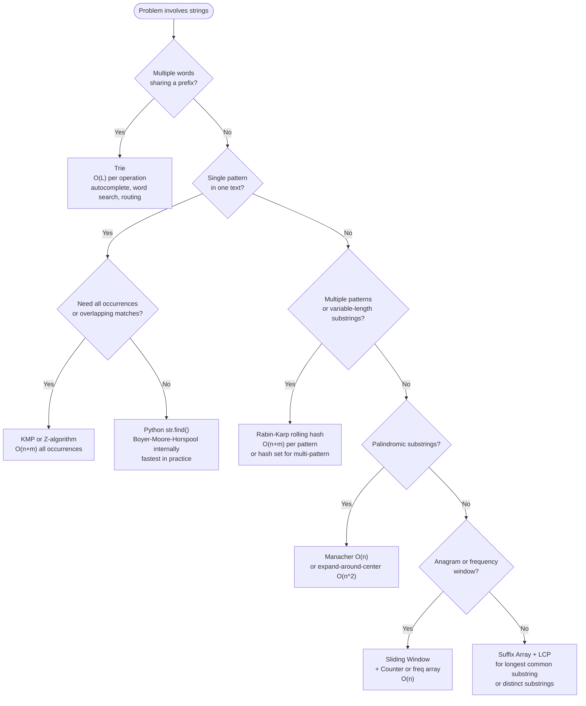
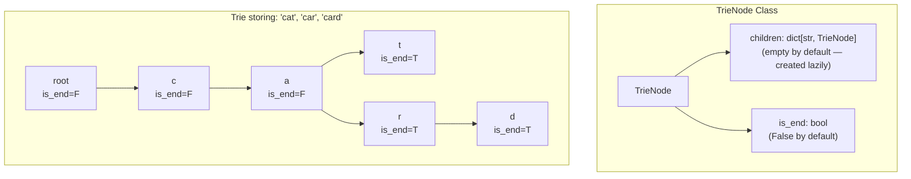
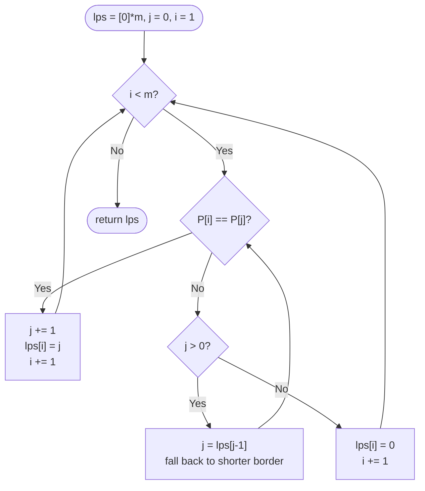
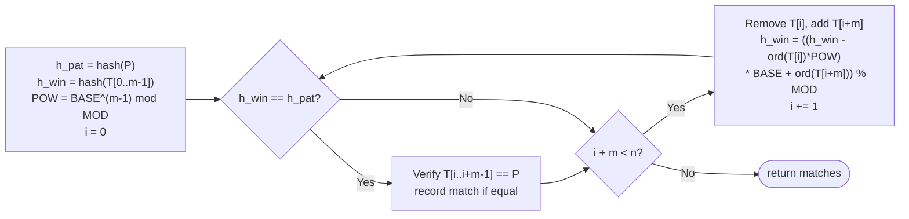

# Trie and Advanced String Algorithms — DSA Patterns in Python

> [!abstract] TL;DR
> Five algorithms dominate advanced string problems: Trie (O(L) prefix queries), KMP (O(n+m) pattern matching via failure function), Rabin-Karp (O(n+m) rolling hash), Z-algorithm (O(n) Z-box matching), and Manacher (O(n) palindromes). Choosing correctly is a matter of recognizing the problem's structural property — prefix query, single-pattern match, multi-pattern match, or palindrome detection.

---

## Intuition

**Analogy:** All advanced string algorithms share one insight — *avoid re-reading what you already know.* A Trie exploits shared prefixes so "app", "apple", "application" all traverse the same root-to-node path. KMP exploits the self-similarity of the pattern so a mismatch never forces the text pointer backward. Rabin-Karp converts each window to a number so a new hash is computed from the old one by one subtraction and one multiplication. Z-algorithm keeps a "furthest right match" bookmark and seeds new positions from it. Every one of these replaces O(n×m) brute-force re-reading with O(n+m) single-pass reasoning.

---

## Which Algorithm to Use



---

## 1. Trie (Prefix Tree)

### Node Structure

Each `TrieNode` has exactly two fields. The critical distinction between `search` and `starts_with` lives entirely in whether `is_end` is checked at the final node.



**Shared prefix, zero extra cost.** "car" and "card" share the path `root → c → a → r`. Adding "card" only appends one node (`d`) regardless of how many other words already share that prefix.

### Operation Complexity

| Operation | Algorithm | Time | Space |
|-----------|-----------|------|-------|
| `insert(word)` | Walk/create nodes, set `is_end=True` at last | O(L) | O(L) worst |
| `search(word)` | Walk nodes, return `is_end` at final node | O(L) | O(1) |
| `starts_with(prefix)` | Walk nodes, return True if path exists | O(L) | O(1) |
| `delete(word)` | Walk down, unset `is_end`, prune dead branches | O(L) | O(1) |
| Autocomplete | Walk to prefix node, DFS all descendants | O(p + k) | O(k) |
| Build from n words | n inserts | O(n × L) | O(n × L) |

L = word or prefix length. All operations are independent of total word count.

**Space:** O(ALPHABET_SIZE × N × L) worst case (no shared prefixes). For lowercase English, 1000 words of average length 10: up to 260,000 nodes. Use `dict` children (lazy allocation) rather than a fixed 26-slot array to reduce memory for sparse or unicode alphabets.

### The `defaultdict` Functional Trie

A one-liner that exploits Python's recursive type system. Useful as an interview trick but harder to extend:

```python
from collections import defaultdict
from functools import reduce

# Recursive defaultdict — each key auto-creates a new defaultdict of the same type
Trie = lambda: defaultdict(Trie)
root = Trie()

def insert(trie, word):
    reduce(lambda node, ch: node[ch], word, trie)["#"] = True  # "#" = end marker

def search(trie, word):
    node = reduce(lambda d, c: d.get(c) or {}, word, trie)
    return "#" in node
```

This is elegant for read-only tries but painful for deletion, frequency tracking, or any node-level metadata. Use the class-based version in any non-trivial context.

### Compact (Patricia) Trie Concept

A standard Trie creates one node per character. A Patricia (compact) Trie merges chains of single-child nodes into a single edge labelled with the whole substring segment. This reduces node count from O(n × L) to O(n) at the cost of edge-splitting on insert. Not typically implemented in interviews but the direct conceptual ancestor of suffix trees and radix trees used in production routing tables.

---

## 2. KMP — Knuth-Morris-Pratt

### The Failure Function (LPS Array)

`lps[i]` = length of the **longest proper prefix** of `pattern[:i+1]` that is also a suffix of `pattern[:i+1]`. "Proper" means not the whole string itself.

For `pattern = "ABABAC"`:

```
i=0  "A"       → lps=0  (no proper prefix)
i=1  "AB"      → lps=0  ("A" is not a suffix of "AB")
i=2  "ABA"     → lps=1  ("A" is both prefix and suffix)
i=3  "ABAB"    → lps=2  ("AB" is both prefix and suffix)
i=4  "ABABA"   → lps=3  ("ABA" is both prefix and suffix)
i=5  "ABABAC"  → lps=0  (no match)
```

`lps = [0, 0, 1, 2, 3, 0]`

### Pi Construction Algorithm



**Why O(m) amortized:** `j` increases by 1 each time `CMP` succeeds. Each fallback (`j = lps[j-1]`) strictly decreases `j`. Therefore total fallbacks cannot exceed total increases, which is at most `m`. Total loop iterations = O(m).

**Why the text pointer never backtracks:** During search, `j` tracks how many pattern characters are matched. A mismatch jumps `j` backward via `lps`, but `i` (the text index) only ever advances. The text is read exactly once — O(n).

---

## 3. Rabin-Karp (Rolling Hash)

### Hash Formula

```
h = (h * BASE + ord(c)) % MOD
```

After computing the hash of the first window in O(m), each subsequent window is obtained in O(1):

```
new_hash = ((old_hash - ord(leaving_char) * POW) * BASE + ord(entering_char)) % MOD
```

where `POW = BASE^(m-1) % MOD`.

### Rolling Window Mechanics



**Average O(n+m):** Hash collisions are rare. With a Mersenne prime modulus (e.g., `2^61 - 1`), the expected number of false positives is negligible.

**Worst case O(nm):** Pathological input (all-identical characters) forces char-by-char verification at every step. **Double hashing** — running two independent `(BASE, MOD)` pairs simultaneously — makes this astronomically unlikely in practice.

**Multi-pattern advantage:** Store all pattern hashes in a Python `set`. Each text window hash checks against all k patterns in O(1) — O(n + Σm_i) total vs O(n × k) for naive per-pattern KMP.

---

## 4. Z-Algorithm

### Z-Array Definition

`Z[i]` = length of the longest substring starting at `s[i]` that is also a **prefix** of `s`. By convention, `Z[0] = len(s)`.

For `s = "AABXAA"`:
```
Z[0] = 6  (convention: whole string)
Z[1] = 1  "A" matches prefix "A"
Z[2] = 0  "B" does not match prefix "A"
Z[3] = 0  "X" does not match
Z[4] = 2  "AA" matches prefix "AA"
Z[5] = 1  "A" matches prefix "A"
```

### Z-Box Maintenance

```mermaid
flowchart TD
    ZINIT(["Z[0]=n, l=0, r=0\nfor i = 1 to n-1"])
    OUTSIDE{"i > r?\n(outside current Z-box)"}
    NAIVE["Z[i] = 0\nExtend by comparing\ns[i+Z[i]] vs s[Z[i]]"]
    SEED["Z[i] = min(Z[i-l], r-i+1)\n(seed from mirror position i-l)"]
    CANEXT{"Z[i] == r - i + 1?\n(hit right edge of box)"]
    EXTEND["Extend beyond r:\ncompare s[i+Z[i]] vs s[Z[i]]"]
    UPDBX["Update box:\nl = i, r = i + Z[i] - 1\n(only if Z[i] > 0)"]
    NEXTI["i += 1"]
    ZDONE(["return Z"])

    ZINIT --> OUTSIDE
    OUTSIDE -- Yes --> NAIVE --> UPDBX --> NEXTI
    OUTSIDE -- No --> SEED --> CANEXT
    CANEXT -- Yes --> EXTEND --> UPDBX --> NEXTI
    CANEXT -- No --> NEXTI
    NEXTI --> OUTSIDE
    NEXTI --> ZDONE
```

**Pattern matching with Z:** Build `combined = P + "$" + T`, compute Z-array. Any index `i` in the `T`-portion where `Z[i] == len(P)` is a match. The `"$"` sentinel prevents `Z[i]` from ever spanning across the boundary into the pattern portion.

**Z vs KMP:** Same O(n+m) complexity. Z is geometrically intuitive (the Z-box is a literal window you maintain). KMP is more powerful for structural analysis (period detection: shortest period = `n - lps[n-1]`; border enumeration). For a coding interview where you want to implement the simplest correct O(n+m) matcher, Z is often faster to write.

---

## 5. Boyer-Moore (Conceptual)

Python's built-in `str.find()` uses a Boyer-Moore-Horspool variant internally. The two key heuristics:

1. **Bad character:** On a mismatch at text position `i` with `P[j]`, shift the pattern so the rightmost occurrence of `text[i]` in `P` aligns with `text[i]`. Can skip up to m positions at once.
2. **Good suffix:** The already-matched suffix of the pattern guides a safe shift that preserves any remaining possible match.

**Best case O(n/m):** Long patterns over large alphabets skip most of the text entirely. This is why `str.find()` beats KMP in benchmarks for typical English text.

**When to prefer `str.find()` over KMP:**
- You only need the first occurrence or non-overlapping occurrences.
- The data is a Python `str` (not a token list, byte sequence, or custom alphabet).
- Implementation simplicity matters — `text.find(pattern)` is one line.

---

## 6. Suffix Array and LCP Array (Concepts)

A **suffix array** `SA` is the sorted array of all n suffix start indices of string s. For `s = "banana"`:

```
All suffixes sorted:
  "a"       → starts at index 5
  "ana"     → starts at index 3
  "anana"   → starts at index 1
  "banana"  → starts at index 0
  "na"      → starts at index 4
  "nana"    → starts at index 2

SA = [5, 3, 1, 0, 4, 2]
```

The **LCP array** `lcp[i]` = length of longest common prefix between `SA[i-1]` and `SA[i]`. Together:

| Query | Using SA + LCP | Naive |
|-------|---------------|-------|
| Longest common substring of two strings | O(n + m) | O(nm) |
| Number of distinct substrings | n(n+1)/2 − sum(LCP) | O(n²) |
| All occurrences of pattern | O(m log n) binary search | O(nm) |
| Longest repeated substring | max(LCP) | O(n²) |

**Construction:** O(n log² n) with prefix doubling. The O(n) SA-IS algorithm exists but is complex enough to be a library function in competitive programming. In interviews, understand the concepts; in CP, use a pre-written `suffix_array` template.

---

## 7. Manacher's Algorithm (Palindromes in O(n))

Manacher finds all palindromic substrings in O(n) by:

1. **Transforming** `s = "abc"` → `t = "#a#b#c#"`. Inserting `"#"` between every character (and at start/end) means every palindrome in `t` has odd length — the center is always a single character. This eliminates the odd/even case split.
2. **Maintaining** a center `c` and right boundary `r` of the rightmost known palindrome. For each new position `i`:
   - Mirror position `mirror = 2*c - i` gives a free lower bound: `P[i] >= min(P[mirror], r - i)`.
   - Extend beyond `r` if possible, updating `c` and `r`.
3. **Extracting** results: the longest palindrome has radius `max(P)`. Convert back to original indices by `(i - P[i]) // 2` for start, `P[i]` for length.

**Critical pitfall:** If the sentinel `"#"` appears in the input string, the transform breaks. Use a character guaranteed absent, or a multi-char sentinel like `"$#"` with a matching end guard `"$"` — so the structure is `"@#a#b#c#$"`.

---

## 8. Anagram and Frequency Problems

Fixed-size sliding window + frequency array or `Counter` is the canonical O(n) pattern for this class:

| Problem | Technique | LeetCode |
|---------|-----------|----------|
| Find all anagrams in string | Fixed window + 26-int freq array | 438 |
| Permutation in string | Fixed window + freq comparison | 567 |
| Minimum window substring | Variable window + Counter | 76 |
| Group anagrams | `"".join(sorted(word))` as dict key | 49 |
| Longest substring no repeat | Variable window + seen set | 3 |

**`Counter` for anagram check (simple):**
```python
from collections import Counter
def is_anagram(s: str, t: str) -> bool:
    return Counter(s) == Counter(t)   # O(n + m)
```

**26-element int array (faster constant, lowercase only):**
```python
def is_anagram_fast(s: str, t: str) -> bool:
    if len(s) != len(t):
        return False
    freq = [0] * 26
    for a, b in zip(s, t):
        freq[ord(a) - 97] += 1
        freq[ord(b) - 97] -= 1
    return all(c == 0 for c in freq)
```

**Sorted-string anagram key for grouping:**
```python
from collections import defaultdict

def group_anagrams(strs: list[str]) -> list[list[str]]:
    """O(n * k log k) — k = max word length."""
    groups: defaultdict[str, list[str]] = defaultdict(list)
    for word in strs:
        groups["".join(sorted(word))].append(word)
    return list(groups.values())
```

---

## Code Demo

```python
from __future__ import annotations
from collections import defaultdict
from typing import Optional

# =============================================================================
# 1. FULL TRIE CLASS — insert, search, startsWith, delete
#    All operations O(L) where L = word/prefix length.
# =============================================================================

class TrieNode:
    __slots__ = ("children", "is_end")

    def __init__(self) -> None:
        self.children: dict[str, TrieNode] = {}
        self.is_end: bool = False


class Trie:
    """
    Prefix tree with dict-based children (flexible alphabet).
    O(L) insert, search, starts_with, and delete.
    """

    def __init__(self) -> None:
        self.root = TrieNode()

    def insert(self, word: str) -> None:
        node = self.root
        for ch in word:
            if ch not in node.children:
                node.children[ch] = TrieNode()
            node = node.children[ch]
        node.is_end = True

    def search(self, word: str) -> bool:
        """Exact match: node must exist AND is_end must be True."""
        node = self._traverse(word)
        return node is not None and node.is_end

    def starts_with(self, prefix: str) -> bool:
        """Prefix match: node must exist; is_end is irrelevant."""
        return self._traverse(prefix) is not None

    def _traverse(self, s: str) -> Optional[TrieNode]:
        node = self.root
        for ch in s:
            if ch not in node.children:
                return None
            node = node.children[ch]
        return node

    def delete(self, word: str) -> bool:
        """
        Delete a word. Returns True if it existed.
        Recursively prunes nodes that lead nowhere after deletion.
        """
        def _del(node: TrieNode, depth: int) -> bool:
            """Returns True if this node should now be deleted by its parent."""
            if depth == len(word):
                if not node.is_end:
                    return False            # Word was never inserted
                node.is_end = False
                return len(node.children) == 0  # Prune if leaf

            ch = word[depth]
            if ch not in node.children:
                return False                # Word not found

            should_delete = _del(node.children[ch], depth + 1)
            if should_delete:
                del node.children[ch]
                # Prune this node too if it is now a dead end
                return not node.is_end and len(node.children) == 0
            return False

        return _del(self.root, 0)


# =============================================================================
# 2. WORD SEARCH II (LC 212) — Trie + DFS with trie pruning
#    Naive per-word DFS: O(W * M * N * 4^L)
#    Trie approach: O(M * N * 4^L) — prune non-prefix branches early.
# =============================================================================

def find_words(board: list[list[str]], words: list[str]) -> list[str]:
    trie = Trie()
    for w in words:
        trie.insert(w)

    rows, cols = len(board), len(board[0])
    found: set[str] = set()

    def dfs(node: TrieNode, r: int, c: int, path: str) -> None:
        ch = board[r][c]
        if ch not in node.children:
            return                          # Prefix not in trie — prune branch

        child = node.children[ch]
        path = path + ch

        if child.is_end:
            found.add(path)
            child.is_end = False            # Prune: avoid re-visiting this word

        board[r][c] = "#"                   # Mark cell as visited
        for dr, dc in ((-1, 0), (1, 0), (0, -1), (0, 1)):
            nr, nc = r + dr, c + dc
            if 0 <= nr < rows and 0 <= nc < cols and board[nr][nc] != "#":
                dfs(child, nr, nc, path)
        board[r][c] = ch                    # Restore cell

    for r in range(rows):
        for c in range(cols):
            dfs(trie.root, r, c, "")

    return list(found)


# =============================================================================
# 3. KMP — find_all() returning all start positions (0-based)
#    Includes overlapping matches.  Time: O(n + m)  Space: O(m)
# =============================================================================

def build_lps(pattern: str) -> list[int]:
    """
    Compute the LPS (failure function) array.
    lps[i] = length of longest proper prefix of pattern[:i+1]
             that is also a suffix of pattern[:i+1].
    """
    m = len(pattern)
    lps = [0] * m
    j = 0                       # Length of previous longest prefix-suffix
    for i in range(1, m):
        while j > 0 and pattern[i] != pattern[j]:
            j = lps[j - 1]     # Fall back through the failure chain
        if pattern[i] == pattern[j]:
            j += 1
        lps[i] = j
    return lps


def kmp_find_all(text: str, pattern: str) -> list[int]:
    """
    Return all start indices (0-based) where pattern occurs in text.
    Overlapping matches are included.
    """
    n, m = len(text), len(pattern)
    if m == 0:
        return list(range(n + 1))
    lps = build_lps(pattern)
    matches: list[int] = []
    j = 0                       # Characters matched in pattern so far
    for i in range(n):
        while j > 0 and text[i] != pattern[j]:
            j = lps[j - 1]
        if text[i] == pattern[j]:
            j += 1
        if j == m:
            matches.append(i - m + 1)
            j = lps[j - 1]     # Allow overlapping: do NOT reset j to 0
    return matches


# =============================================================================
# 4. LONGEST DUPLICATE SUBSTRING (LC 1044)
#    Binary search on length L + Rabin-Karp rolling hash to detect duplicates.
#    O(n log n) average time.
# =============================================================================

def longest_dup_substring(s: str) -> str:
    MOD = (1 << 61) - 1         # Mersenne prime: reduces collision probability
    BASE = 131

    def check(length: int) -> str:
        """Return a duplicated substring of given length, or '' if none exists."""
        if length == 0:
            return ""

        power = pow(BASE, length - 1, MOD)  # BASE^(length-1) mod MOD

        # Hash of the first window
        h = 0
        for ch in s[:length]:
            h = (h * BASE + ord(ch)) % MOD

        seen: dict[int, list[int]] = defaultdict(list)
        seen[h].append(0)

        for i in range(1, len(s) - length + 1):
            # Roll: subtract contribution of s[i-1], add s[i+length-1]
            h = (h - ord(s[i - 1]) * power % MOD) % MOD
            h = (h * BASE + ord(s[i + length - 1])) % MOD

            # Hash match found — verify to rule out false positives
            if h in seen:
                candidate = s[i : i + length]
                for prev in seen[h]:
                    if s[prev : prev + length] == candidate:
                        return candidate
            seen[h].append(i)

        return ""

    lo, hi = 0, len(s) - 1
    result = ""
    while lo <= hi:
        mid = (lo + hi) // 2
        dup = check(mid)
        if dup:
            result = dup
            lo = mid + 1        # Try longer
        else:
            hi = mid - 1        # Shorter
    return result


# =============================================================================
# QUICK TESTS
# =============================================================================

if __name__ == "__main__":
    # --- Trie ---
    trie = Trie()
    for w in ["apple", "app", "application", "apply", "banana"]:
        trie.insert(w)
    assert trie.search("app") is True
    assert trie.search("ap") is False           # "ap" was never inserted
    assert trie.starts_with("appl") is True
    assert trie.starts_with("xyz") is False
    assert trie.delete("app") is True
    assert trie.search("app") is False          # deleted
    assert trie.search("apple") is True         # still exists
    print("Trie: OK")

    # --- Word Search II ---
    board = [
        ["o", "a", "a", "n"],
        ["e", "t", "a", "e"],
        ["i", "h", "k", "r"],
        ["i", "f", "l", "v"],
    ]
    result = set(find_words(board, ["oath", "pea", "eat", "rain"]))
    assert result == {"eat", "oath"}, f"Got {result}"
    print("Word Search II: OK")

    # --- KMP ---
    assert kmp_find_all("ababcababd", "abab") == [0, 5]
    assert kmp_find_all("aaaaaa", "aaa") == [0, 1, 2, 3]   # overlapping
    assert kmp_find_all("hello", "xyz") == []
    print("KMP find_all: OK")

    # --- Longest Duplicate Substring ---
    assert longest_dup_substring("banana") == "ana"
    assert longest_dup_substring("abcd") == ""
    print("Longest duplicate substring: OK")

    print("All tests passed.")
```

---

## Real-World Examples

> **Elasticsearch autocomplete (Trie / FST):** Lucene's suggest module stores all indexed terms in a Finite State Transducer — a compressed Trie that also merges shared suffixes (not just prefixes). When a user types a query prefix, the FST traverses matching nodes in O(p) and enumerates top-k completions ranked by stored frequency. The FST reduces memory by 10-100x compared to a naive Trie by merging common suffix paths. This is why Elasticsearch autocomplete handles billions of documents with sub-millisecond latency.

> **Git delta compression (rolling hash):** Git's pack-file format uses a rolling hash variant to compute deltas between object versions. When building a delta from a source blob to a target blob, Git slides a hash window over the source to fingerprint all fixed-size chunks. It then scans the target for matching fingerprints — the same hash-set lookup as Rabin-Karp multi-pattern search. Matching regions are encoded as back-references, shrinking repository sizes by orders of magnitude.

---

## Trade-offs

### Trie vs Hash Map for String Storage

| Aspect | Trie | Hash Map (`dict`) |
|--------|------|-------------------|
| Exact lookup | O(L) | O(L) — hash computation dominates |
| Prefix queries | O(p + k) native | O(n × L) — must scan all keys |
| Memory | O(ALPHABET × N × L) — nodes per char | O(N × L) — one entry per word |
| Implementation | ~30 lines, tree traversal | One line with `dict` |
| Autocomplete | Built-in via DFS | Requires sort or extra structure |
| Lexicographic order | Natural (traverse in char order) | Not ordered |

Use Trie when prefix operations dominate. Use hash map when only exact lookups are needed.

### Pattern Matching Algorithms

| Algorithm | Preprocessing | Search | Worst Case | Best Use |
|-----------|---------------|--------|------------|----------|
| Naive | None | O(nm) | O(nm) | Trivially small strings |
| KMP | O(m) | O(n) | O(n+m) | All/overlapping matches, structural analysis |
| Rabin-Karp | O(m) | O(n) avg | O(nm) w/ collisions | Multiple patterns, duplicate substrings |
| Z-algorithm | None | O(n) | O(n+m) | Pattern matching, simpler than KMP |
| Boyer-Moore | O(m + sigma) | O(n/m) best | O(nm) | Large alphabet, practical speed |
| Python `str.find()` | None | O(n) typical | O(nm) | Production; fastest for standard strings |

### Python `str.find()` vs Manual KMP

| | `str.find()` | Manual KMP (`kmp_find_all`) |
|-|-------------|--------------------------|
| All non-overlapping | `while (i := s.find(p, i)) != -1` | Natural |
| Overlapping matches | Requires `start` parameter tricks | Built-in via `j = lps[j-1]` |
| Custom sequences | Strings only | Any comparable sequence |
| Constant factor | Very low (compiled C + BMH) | Higher (Python interpreter loop) |
| Code size | 1 line | ~20 lines |

**Rule of thumb:** Use `str.find()` in Python for all standard single-pattern production use. Implement KMP when you need overlapping matches, non-string sequences (token lists, byte arrays), or when the failure function itself is the answer (period detection, palindrome prefix tricks).

---

## When to Use vs Avoid

**Use Trie when:**
- Building autocomplete, spell checking, or a prefix router (IP longest-prefix match).
- The word list is queried far more by prefix than by exact key.
- Word Search II or grid + dictionary problems where trie pruning eliminates entire DFS subtrees.

**Avoid Trie when:**
- Only exact lookups are needed — a hash set is simpler, smaller, and faster.
- The alphabet is enormous (Unicode characters) — dict children mitigate this, but a DAWG may be more appropriate.
- Memory is severely constrained — a sorted array with binary search is O(log n) exact lookup with minimal overhead.

**Use KMP or Z-algorithm when:**
- All occurrences (including overlapping) must be found.
- The pattern has high self-similarity (repeated substrings) where naive matching quadratically degrades.
- The failure function itself is needed: period detection, shortest palindrome, rotation checking.

**Use Rabin-Karp when:**
- Searching for multiple patterns simultaneously — one pass, hash set lookup.
- Finding the longest duplicate substring — binary search on length + hash check.
- Pattern length varies and you cannot afford O(m) preprocessing per length.

**Avoid Rabin-Karp when:**
- Guaranteed O(n+m) worst case is required — use double hashing or switch to KMP.
- The MOD is small (e.g., 10^9+7 alone) for adversarial competitive programming inputs — use two independent mods.

---

## Common Pitfalls

- **`search` vs `starts_with` confusion** — `search` must verify `node.is_end = True` at the terminal node. `starts_with` only checks whether the traversal path exists. Omitting the `is_end` check makes `search("ca")` return `True` when only `"cat"` is stored.

- **KMP LPS off-by-one** — `lps[0]` is always 0 (a single character has no proper prefix). The construction loop must start at `i = 1`. Starting at `i = 0` or mishandling the `j = 0` boundary causes silently wrong LPS values.

- **KMP missing overlapping matches** — after finding a match at position `i`, reset `j = lps[j-1]` (not `j = 0`). Resetting to 0 misses overlapping occurrences: pattern `"aaa"` in text `"aaaa"` would report only one match instead of two.

- **Rabin-Karp false positives** — a hash match does not guarantee a string match. Always verify character-by-character after a hash hit. Skipping verification gives wrong answers on any input where two different substrings hash to the same value.

- **Rabin-Karp single-hash insufficient** — for adversarial inputs (competitive programming) a single `MOD = 10^9+7` has collision probability ~1/MOD per comparison but over n comparisons it compounds. Use two independent `(BASE, MOD)` pairs and require both to match.

- **Manacher transform contamination** — if the sentinel character `"#"` appears in the input string, the interleaved transform `"#a#b#"` is invalid. Use a character guaranteed absent, or pad with two different sentinels: `"@#" + "#".join(s) + "#$"` where `@` and `$` guard both ends.

- **Trie delete without pruning** — setting `is_end = False` without removing now-leaf nodes leaks memory. The recursive delete helper must signal upward when a subtree becomes empty so the parent can `del` the reference.

- **Word Search II TLE** — after finding a word in the trie during DFS, set `child.is_end = False` immediately. Without this, the same word is re-found on subsequent DFS paths, multiplying the result and wasting time on already-complete branches.

---

## Related Concepts

- [[Trie]] — the foundational DSA note: array-based children variant, dry-run traces, full complexity proofs
- [[KMP_Algorithm]] — deep dive: amortized proof of O(m) pi construction, DFA interpretation, period detection formula
- [[Z_Algorithm]] — Z-box maintenance proof, Z vs KMP comparison, Z-array for string period
- [[String_Hashing]] — prefix hash array construction, double hashing, O(1) substring hash after O(n) preprocessing
- [[Suffix_Array]] — prefix doubling construction, Kasai's LCP algorithm, distinct substring counting
- [[Manacher_Algorithm]] — full derivation of the transform string, center/radius maintenance, O(n) proof
- [[Rabin_Karp]] — polynomial hash derivation, rolling formula proof, 2D pattern matching extension
- [[String_Matching_Overview]] — side-by-side comparison of all string matching algorithms with use-case guide
- [[String_Fundamentals]] — Python string immutability, ord/chr, Counter, expand-around-center palindrome
- [[Hash_Table_Fundamentals]] — hash map internals that underlie the Rabin-Karp hash-set lookup
- [[Backtracking]] — the DFS + backtracking strategy used in Word Search II and palindrome pairs
- [[Arrays_and_Strings]] — prerequisite: sliding window, two pointers, Counter, and anagram patterns in Python
- [[Sliding_Window]] — fixed and variable window patterns for anagram, frequency, and minimum-window problems

---

## Review Questions

1. **Trie vs hash map for autocomplete:** A hash map supports O(L) exact lookup but O(n × L) prefix enumeration (scan all n words). A Trie supports O(p + k) prefix enumeration for p = prefix length, k = results returned. At what workload ratio does the Trie's O(p + k) outweigh its higher memory cost compared to a hash set storing the same words?

2. **KMP failure function semantics:** For pattern `"ABAB"`, `lps[3] = 2`. State in plain English what `lps[3] = 2` means. When a mismatch occurs at `j = 3` during a search, why do we jump to `j = lps[2] = 1` rather than `j = 0`? What re-reading of the text are we avoiding by making this specific jump?

3. **Rabin-Karp collision handling:** Your implementation finds 100 hash matches scanning a text of length 10^6 with a pattern of length 100, using a single MOD = 10^9+7. In the absolute worst case, how much extra work does char-by-char verification add? When is this acceptable, and when should you switch to double hashing or a different algorithm entirely?

4. **Z-array sentinel necessity:** To find pattern `P` in text `T` using the Z-algorithm, you build `combined = P + "$" + T` and scan for positions where `Z[i] == len(P)`. Explain why the `"$"` separator is necessary. Construct a specific example where `combined = P + T` (no separator) produces a false positive — an index where `Z[i] == len(P)` but `P` does not actually occur at that position in `T`.

---

## Sources

- [LeetCode — Implement Trie (LC 208)](https://leetcode.com/problems/implement-trie-prefix-tree/)
- [LeetCode — Word Search II (LC 212)](https://leetcode.com/problems/word-search-ii/)
- [LeetCode — Longest Duplicate Substring (LC 1044)](https://leetcode.com/problems/longest-duplicate-substring/)
- [CP-Algorithms — Prefix Function / KMP](https://cp-algorithms.com/string/prefix-function.html)
- [CP-Algorithms — Z-Function](https://cp-algorithms.com/string/z-function.html)
- [CP-Algorithms — String Hashing](https://cp-algorithms.com/string/string-hashing.html)
- [CP-Algorithms — Suffix Array](https://cp-algorithms.com/string/suffix-array.html)
- Skiena — The Algorithm Design Manual, Chapter 12 (Data Structures)
- CLRS — Chapter 32 (String Matching)

---

#dsa #trie #string-algorithms #kmp #rolling-hash #python #leetcode
