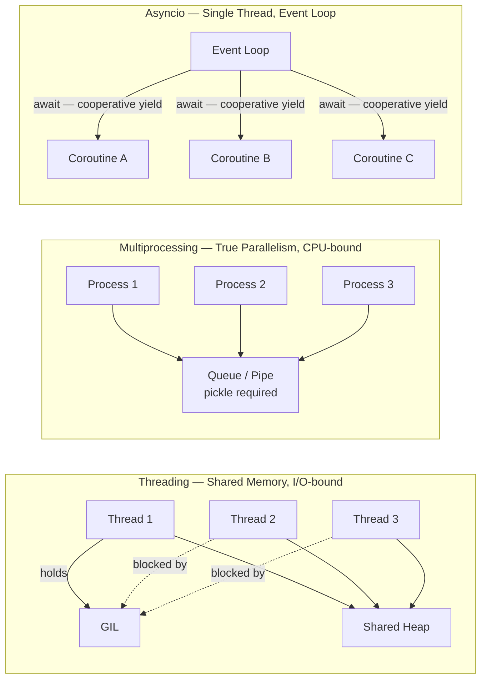
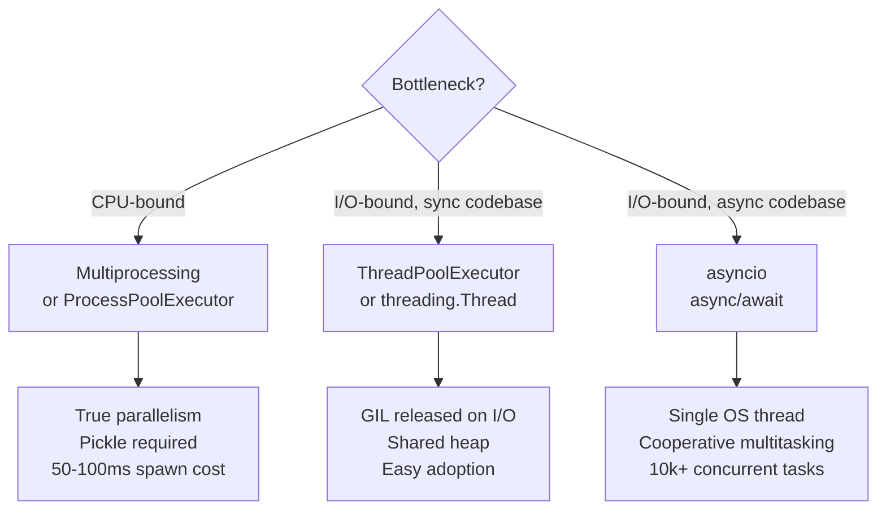

# ⚡ Concurrency in Python

> [!abstract] TL;DR
> Python offers three distinct concurrency models — threading (shared memory, GIL-constrained, I/O-bound), multiprocessing (true CPU parallelism, separate memory, CPU-bound), and asyncio (single thread, cooperative multitasking, massive I/O concurrency) — each solving a different bottleneck. Choosing the wrong model is one of the most common performance mistakes in production Python.

---

## Intuition

**Analogy:** Imagine a busy restaurant kitchen. The **GIL** is a single "master cutting board" — only one chef can use it at a time, even if multiple chefs are standing around. **Threading** is multiple chefs sharing that one board, handing it off while others wait for water to boil or ingredients to arrive (I/O waits). **Multiprocessing** is opening three completely separate kitchens — each has its own board, ingredients, and staff, so all three truly work in parallel, but communicating between kitchens requires packaging orders into boxes and sending a courier (pickle/IPC). **Asyncio** is one hyper-efficient chef who, instead of standing idle while water boils, immediately pivots to chop vegetables — switching tasks cooperatively whenever a task is waiting, never blocking.

The GIL turns threaded Python CPU work into a relay race. Multiprocessing replaces the relay with independent parallel sprinters. Asyncio replaces all of them with a single sprinter who never stands still.

---

## How It Works

### Core Mechanics

#### 1. The Global Interpreter Lock (GIL)

The GIL is a mutex inside CPython that ensures only one thread executes Python bytecode at a time. It exists to protect CPython's reference-counting garbage collector: without it, two threads could simultaneously decrement an object's reference count to zero, causing a double-free memory error.

Key facts:
- **What it protects:** CPython's internal reference counts and memory allocator. It does NOT protect your application data — your `dict` and `list` objects are not automatically thread-safe.
- **When it releases:** On any blocking I/O syscall (network, disk, `time.sleep`), after every ~5ms "check interval" (allowing thread switching), and when C extensions explicitly release it via `Py_BEGIN_ALLOW_THREADS`.
- **C extensions and the GIL:** NumPy, OpenCV, and PyTorch release the GIL during their C/CUDA operations. A NumPy matrix multiply on two large arrays runs in parallel across CPU cores even inside threads.
- **Python 3.13:** Experimental "free-threaded" (no-GIL) builds are available as `python3.13t` under PEP 703. Not production-ready yet but the path is clear.
- **Alternatives to the GIL:** `multiprocessing` (separate interpreter per process), PyPy, Cython `with nogil:` blocks, C extensions.

---

#### 2. `threading` Module

`Thread` runs a Python callable in a separate OS thread within the same process. All threads share the heap. Synchronization primitives prevent data corruption.

**Core API:**
```python
import threading

t = threading.Thread(target=fn, args=(arg1,), kwargs={}, daemon=True)
t.start()
t.join(timeout=5.0)   # blocks caller until thread finishes or timeout expires
```

`daemon=True` means the thread is killed automatically when the main thread exits — used for background tasks that should not block shutdown.

**Synchronization primitives:**

| Primitive | Purpose |
|-----------|---------|
| `threading.Lock()` | Mutual exclusion. `with lock:` is the safe pattern. |
| `threading.RLock()` | Reentrant lock. Same thread can acquire multiple times without deadlock. |
| `threading.Condition(lock)` | `wait()` / `notify()` / `notify_all()` for producer-consumer coordination. |
| `threading.Semaphore(n)` | Limits concurrent access to n threads (rate limiting, connection pools). |
| `threading.Event()` | `.set()` signals all waiting threads; `.wait()` blocks until set. |
| `threading.Barrier(n)` | All n threads block at the barrier until all n have arrived. |
| `threading.local()` | Thread-local storage. Each thread gets its own independent copy of the variable. |

**Thread-safe producer-consumer with `queue.Queue`:**
```python
import queue

# queue.Queue is thread-safe — no additional locking needed
q = queue.Queue(maxsize=100)   # blocks the producer when full (back-pressure)
q.put(item)                    # producer — blocks if full
item = q.get()                 # consumer — blocks until an item is available
q.task_done()                  # signal that one retrieved item has been processed
q.join()                       # block until every queued item has been task_done()
```

---

#### 3. `concurrent.futures.ThreadPoolExecutor`

High-level API over `threading`. Manages a reusable pool of worker threads and returns `Future` objects for tracking results.

```python
from concurrent.futures import ThreadPoolExecutor, as_completed, wait, FIRST_EXCEPTION
import os

# I/O-bound rule of thumb: min(32, os.cpu_count() + 4)
max_workers = min(32, os.cpu_count() + 4)

with ThreadPoolExecutor(max_workers=max_workers) as executor:
    # submit: non-blocking, returns a Future immediately
    future = executor.submit(fn, arg1, arg2)
    result = future.result()   # blocks the calling thread until done

    # map: returns results in submission order; blocks if a result is not ready
    results = list(executor.map(fn, iterable, timeout=30))

    # as_completed: yields Futures in completion order (fastest finishes first)
    futures = [executor.submit(fn, x) for x in items]
    for f in as_completed(futures):
        print(f.result())

    # wait: block until a specific condition
    done, pending = wait(futures, return_when=FIRST_EXCEPTION)
```

`__exit__` calls `shutdown(wait=True)` — all submitted tasks complete before the `with` block exits.

---

#### 4. `multiprocessing` Module

Each `Process` is a separate OS process with its own Python interpreter and memory space. No GIL contention between processes — true CPU parallelism.

```python
from multiprocessing import Process, Pool, Queue, Pipe, Value, Array, Manager
import os

# ── Single process ──────────────────────────────────────────────────────────
p = Process(target=fn, args=(arg,))
p.start()
p.join()

# ── Pool: parallel map over an iterable ─────────────────────────────────────
with Pool(processes=os.cpu_count()) as pool:
    results = pool.map(fn, iterable)              # blocks; returns ordered list
    results = pool.starmap(fn, [(a, b), (c, d)])  # multi-arg: unpacks each tuple
    for r in pool.imap_unordered(fn, iterable):   # yields results as they complete
        process(r)

# ── Inter-process communication ──────────────────────────────────────────────
q = Queue()                     # pickle-based; safe across processes
parent_conn, child_conn = Pipe() # faster than Queue for point-to-point

# ── Shared memory (avoids pickle) ────────────────────────────────────────────
counter = Value('i', 0)   # shared C int; ctypes typecodes ('i', 'd', 'c', ...)
arr = Array('d', 1000)    # shared C double[1000]

# ── Manager: shared dicts and lists via proxy objects ─────────────────────────
with Manager() as mgr:
    shared_dict = mgr.dict()   # slow but flexible; uses a manager server process
    shared_list = mgr.list()
```

**Pickling constraint:** Everything passed between processes must be picklable. Lambdas, closures defined inside functions, file handles, database connections, and lock objects are NOT picklable and will raise `PicklingError` at runtime.

**Start methods — the critical choice:**

| Method | Platform default | Speed | Safety |
|--------|-----------------|-------|--------|
| `fork` | Linux | Fast (~5ms) | Dangerous after threads — locks held by threads at fork time are permanently locked in the child |
| `spawn` | Windows, macOS (since 3.8) | Slow (~50–100ms) | Safe — fresh interpreter, no inherited state. Requires `if __name__ == "__main__":` guard. |
| `forkserver` | Opt-in | Moderate | Safe — a clean forked server handles spawning |

---

#### 5. `concurrent.futures.ProcessPoolExecutor`

Same `Future`-based API as `ThreadPoolExecutor`, but spawns worker processes. The cleanest interface for process-based parallelism.

```python
from concurrent.futures import ProcessPoolExecutor
import os, functools

def worker_init(model_path: str) -> None:
    """Called once in each worker process — load expensive resources here."""
    import joblib
    global model
    model = joblib.load(model_path)

def predict_batch(features):
    """Module-level function — picklable. Uses worker-local model."""
    return model.predict(features)

with ProcessPoolExecutor(
    max_workers=os.cpu_count(),
    initializer=worker_init,       # runs once per worker at startup
    initargs=("models/clf.pkl",),
) as executor:
    # chunksize batches items per IPC call — reduces pickling overhead for large iterables
    results = list(executor.map(predict_batch, feature_batches, chunksize=64))
```

**Gotcha:** Lambdas and closures are not picklable. Use module-level functions or `functools.partial`. Move per-worker resources (models, DB connections) into the `initializer`, not the task function arguments.

---

#### 6. `asyncio` — Event Loop and Coroutines

Asyncio is cooperative multitasking within a **single OS thread**. Coroutines (`async def`) voluntarily yield control at every `await` point, allowing the event loop to schedule other coroutines. No OS scheduling involved — entirely in Python.

```python
import asyncio

# ── Define a coroutine ────────────────────────────────────────────────────────
async def fetch(url: str) -> str:
    await asyncio.sleep(1)   # yields to the event loop; thread is NOT blocked
    return f"result from {url}"

# ── Run the top-level coroutine ───────────────────────────────────────────────
result = asyncio.run(fetch("https://example.com"))   # creates and runs an event loop

# ── Concurrent tasks ───────────────────────────────────────────────────────────
async def main() -> None:
    # create_task: schedules the coroutine immediately, runs concurrently
    task1 = asyncio.create_task(fetch("url1"))
    task2 = asyncio.create_task(fetch("url2"))
    r1 = await task1
    r2 = await task2

    # gather: all coroutines run concurrently; results in submission order
    # return_exceptions=True: exceptions returned as values, no early cancellation
    results = await asyncio.gather(
        fetch("u1"), fetch("u2"), fetch("u3"),
        return_exceptions=True,
    )

    # wait: fine-grained control over completion conditions
    tasks = [asyncio.create_task(fetch(u)) for u in ["u1", "u2", "u3"]]
    done, pending = await asyncio.wait(tasks, return_when=asyncio.FIRST_COMPLETED)
    for t in pending:
        t.cancel()   # cancel tasks that are no longer needed

    # asyncio.timeout (3.11+): hard deadline for a block of async code
    try:
        async with asyncio.timeout(5.0):
            result = await fetch("slow_url")
    except TimeoutError:
        print("Timed out")

    # wait_for: timeout for a single coroutine (pre-3.11 compatible)
    result = await asyncio.wait_for(fetch("url"), timeout=3.0)

    # asyncio.sleep(0): yield control once, then resume — prevents starving
    await asyncio.sleep(0)
```

---

#### 7. `asyncio` — Synchronization and Queues

asyncio primitives are NOT thread-safe and must only be used within the event loop. They are NOT interchangeable with `threading.Lock`.

```python
import asyncio

# ── asyncio.Lock: mutual exclusion between coroutines ─────────────────────────
lock = asyncio.Lock()
async with lock:
    shared_resource.modify()   # only one coroutine at a time

# ── asyncio.Semaphore: limit concurrent coroutines ────────────────────────────
sem = asyncio.Semaphore(20)    # max 20 concurrent HTTP requests
async with sem:
    await make_http_request()

# ── asyncio.Queue: async producer-consumer ────────────────────────────────────
queue: asyncio.Queue = asyncio.Queue(maxsize=50)
await queue.put(item)          # blocks if full (back-pressure)
item = await queue.get()       # blocks until item available
queue.task_done()
await queue.join()             # block until all items have been task_done()

# ── asyncio.TaskGroup (3.11+): structured concurrency ────────────────────────
# If ANY task raises an exception, ALL remaining tasks are immediately cancelled.
# Prevents "orphaned" coroutines running without supervision.
async with asyncio.TaskGroup() as tg:
    task_a = tg.create_task(coroutine_a())
    task_b = tg.create_task(coroutine_b())
    task_c = tg.create_task(coroutine_c())
# All three tasks are guaranteed to be done or cancelled here.
# Exceptions are raised as ExceptionGroup.
```

`TaskGroup` is the preferred pattern for new async code (Python 3.11+). It enforces that no task outlives its parent scope, which makes async code dramatically easier to reason about.

---

#### 8. Mixing Sync and Async

The cardinal rule: **never call blocking code from inside an `async def` function**. `time.sleep(1)` inside a coroutine freezes the entire event loop — all other coroutines are stuck for 1 full second.

```python
import asyncio
from concurrent.futures import ThreadPoolExecutor

_executor = ThreadPoolExecutor(max_workers=4)

async def use_blocking_library() -> str:
    # run_in_executor: runs sync function in a thread pool, returns awaitable
    loop = asyncio.get_event_loop()
    result = await loop.run_in_executor(_executor, blocking_io_function, arg1)
    return result

# asyncio.to_thread (3.9+): cleaner syntax for the same pattern
async def use_to_thread() -> str:
    result = await asyncio.to_thread(blocking_io_function, arg1)
    return result

# Running async code from synchronous context (e.g. a script entrypoint)
result = asyncio.run(some_coroutine())   # creates a new event loop; only at top level
```

**Do not** mix `asyncio.run()` with an already-running loop (e.g., inside a Jupyter notebook — use `await` directly or `nest_asyncio`).

**Alternative frameworks:**
- `anyio` — compatibility shim over asyncio and trio; use when writing libraries that should work on either runtime.
- `trio` — alternative async runtime with stricter structured concurrency; nurseries instead of TaskGroup.

---

#### 9. Async I/O Libraries

| Library | Purpose | Sync equivalent |
|---------|---------|----------------|
| `httpx.AsyncClient` | Async HTTP/1.1 and HTTP/2 | `requests.Session` |
| `aiofiles` | Async file I/O | `open()` |
| `asyncpg` | Async PostgreSQL (native protocol) | `psycopg2` |
| `aiomysql` | Async MySQL | `PyMySQL` |
| `motor` | Async MongoDB | `pymongo` |
| `aioredis` | Async Redis | `redis.Redis` |

**Rate limiting with `asyncio.Semaphore`:**
```python
import asyncio, httpx

async def fetch_limited(sem: asyncio.Semaphore, client: httpx.AsyncClient, url: str) -> dict:
    async with sem:        # max N coroutines inside this block at any time
        resp = await client.get(url, timeout=10.0)
        return resp.json()

async def scrape_all(urls: list[str]) -> list[dict]:
    sem = asyncio.Semaphore(20)   # throttle to 20 concurrent requests
    async with httpx.AsyncClient() as client:
        tasks = [fetch_limited(sem, client, url) for url in urls]
        return await asyncio.gather(*tasks, return_exceptions=True)
```

---

### Flow / Architecture

**Three concurrency models — structure and constraints:**



**Decision tree — choosing the right model:**



---

## Code Demo

### 1. ThreadPoolExecutor — Parallel HTTP Requests

```python
# pip install httpx
import httpx
import time
from concurrent.futures import ThreadPoolExecutor, as_completed

URLS = [
    "https://httpbin.org/get?n=1",
    "https://httpbin.org/get?n=2",
    "https://httpbin.org/get?n=3",
    "https://httpbin.org/get?n=4",
    "https://httpbin.org/get?n=5",
]

def fetch(url: str) -> dict:
    """Blocking HTTP GET. The GIL is released during the network syscall."""
    with httpx.Client(timeout=10.0) as client:
        resp = client.get(url)
        resp.raise_for_status()
        return {"url": url, "status": resp.status_code}

t0 = time.perf_counter()

with ThreadPoolExecutor(max_workers=5) as executor:
    futures = {executor.submit(fetch, url): url for url in URLS}
    for future in as_completed(futures):
        url = futures[future]
        try:
            result = future.result()
            print(f"OK   {result['url']} — HTTP {result['status']}")
        except Exception as e:
            print(f"FAIL {url}: {type(e).__name__}: {e}")

# Concurrent: ~0.3s  vs  Sequential: ~1.5s
print(f"Total: {time.perf_counter() - t0:.2f}s")
```

### 2. ProcessPoolExecutor — CPU-Bound Image Processing

```python
# pip install Pillow
# Windows/macOS (spawn): the if __name__ == "__main__" guard is mandatory
import io, os
from PIL import Image
from concurrent.futures import ProcessPoolExecutor

def resize_image(img_bytes: bytes, target_size: tuple[int, int]) -> bytes:
    """Runs in a worker process — full CPU core, no GIL sharing."""
    with Image.open(io.BytesIO(img_bytes)) as img:
        resized = img.resize(target_size, Image.LANCZOS)
        buf = io.BytesIO()
        resized.save(buf, format="JPEG", quality=85)
        return buf.getvalue()

def main() -> None:
    # Create a large test source image (simulates a high-res photo)
    src = Image.new("RGB", (4000, 3000), color=(100, 149, 237))
    buf = io.BytesIO()
    src.save(buf, format="JPEG")
    original_bytes = buf.getvalue()

    sizes = [(1920, 1080), (1280, 720), (800, 600), (400, 300), (200, 150), (100, 75)]

    with ProcessPoolExecutor(max_workers=os.cpu_count()) as executor:
        futures = {executor.submit(resize_image, original_bytes, sz): sz for sz in sizes}
        for future in futures:
            size = futures[future]
            output = future.result()
            print(f"Resized to {size}: {len(output):,} bytes")

if __name__ == "__main__":
    main()
```

### 3. asyncio Producer-Consumer with Queue and TaskGroup

```python
import asyncio, random

STOP = object()   # unique sentinel — cannot be confused with a real item

async def producer(queue: asyncio.Queue, n_items: int) -> None:
    """Generates work items with simulated async arrival delay."""
    for i in range(n_items):
        await asyncio.sleep(random.uniform(0.01, 0.05))
        await queue.put(f"item_{i}")
        print(f"[producer] enqueued item_{i}")
    await queue.put(STOP)

async def consumer(queue: asyncio.Queue, cid: int) -> int:
    """Processes items until it sees the sentinel."""
    processed = 0
    while True:
        item = await queue.get()
        if item is STOP:
            await queue.put(STOP)   # pass sentinel along for other consumers
            queue.task_done()
            break
        await asyncio.sleep(0.02)   # simulate processing work
        print(f"[consumer-{cid}] processed {item}")
        processed += 1
        queue.task_done()
    return processed

async def main() -> None:
    queue: asyncio.Queue = asyncio.Queue(maxsize=10)

    # TaskGroup: if producer raises, both consumers are immediately cancelled
    async with asyncio.TaskGroup() as tg:
        tg.create_task(producer(queue, n_items=20))
        c1 = tg.create_task(consumer(queue, cid=1))
        c2 = tg.create_task(consumer(queue, cid=2))

    print(f"Consumer 1 processed: {c1.result()}, Consumer 2 processed: {c2.result()}")

asyncio.run(main())
```

### 4. asyncio.gather with Timeout and Exception Handling

```python
# pip install httpx
import asyncio, httpx

async def fetch_json(client: httpx.AsyncClient, url: str) -> dict:
    """Async HTTP request — coroutine yields at every network I/O await."""
    resp = await client.get(url, timeout=5.0)
    resp.raise_for_status()
    return resp.json()

async def main() -> None:
    urls = [
        "https://httpbin.org/json",        # succeeds
        "https://httpbin.org/status/500",  # raises HTTPStatusError
        "https://httpbin.org/uuid",        # succeeds
        "https://httpbin.org/delay/10",    # exceeds the 5s client timeout
    ]

    async with httpx.AsyncClient() as client:
        # return_exceptions=True: exceptions appear as list values, not raised
        # All four requests run concurrently — no early cancellation on error
        results = await asyncio.gather(
            *[fetch_json(client, url) for url in urls],
            return_exceptions=True,
        )

    for url, result in zip(urls, results):
        if isinstance(result, Exception):
            print(f"FAIL {url}: {type(result).__name__}")
        else:
            print(f"OK   {url}: keys={list(result.keys())}")

    # asyncio.timeout (3.11+): hard deadline for a block
    async with httpx.AsyncClient() as client:
        try:
            async with asyncio.timeout(2.0):
                r = await fetch_json(client, "https://httpbin.org/delay/5")
        except TimeoutError:
            print("Hard timeout after 2.0s — TimeoutError raised and propagated")

asyncio.run(main())
```

---

## Real-World Example

> **Example:** FastAPI and Ray Serve use asyncio as the request-handling layer. When a prediction request arrives, the asyncio event loop dispatches it to an `async def` endpoint. The endpoint immediately offloads the CPU-bound `model.predict()` call to a thread pool via `asyncio.to_thread()`, keeping the event loop free to accept new requests. This allows a single uvicorn process with 4 worker threads to serve 1,000+ concurrent in-flight requests — asyncio multiplexes the connections, the thread pool handles the CPU, and neither blocks the other. Separately, PyTorch DataLoader uses `multiprocessing` (not threading) when `num_workers > 0`, because image decoding and augmentation are pure CPU work — exactly the case where multiprocessing's process-per-core model provides true parallelism free of the GIL.

---

## Trade-offs

### Concurrency Model Comparison

| Aspect | threading | multiprocessing | asyncio |
|--------|-----------|-----------------|---------|
| GIL impact | Constrained for Python CPU ops; released on I/O | No GIL — true parallelism | N/A — single thread |
| Memory | Shared heap — cheap | Separate per process — high | Shared heap — cheap |
| Startup overhead | ~1ms per thread | ~50–100ms per process | ~0ms per coroutine |
| Max practical concurrency | Hundreds | CPU core count | Tens of thousands |
| Shared state | Easy but requires `Lock` | Hard — must pickle or use IPC | Trivial — single thread, no races |
| Debugging difficulty | Hard — race conditions, data corruption | Moderate — separate PIDs, deadlocks | Moderate — async tracebacks |
| Best use case | I/O-bound, legacy sync code | CPU-bound, data-parallel work | I/O-bound, high concurrency |

### asyncio.gather vs TaskGroup vs asyncio.wait

| Aspect | asyncio.gather | asyncio.TaskGroup (3.11+) | asyncio.wait |
|--------|---------------|---------------------------|--------------|
| Cancellation on error | No (with `return_exceptions=True`) | Yes — all tasks cancelled immediately | No |
| Exception propagation | Exception returned as a list value | Re-raised as `ExceptionGroup` | Returned in `done` set |
| Result collection | Ordered list matching inputs | Via `task.result()` on each task | Iterate `done` set manually |
| Python version | 3.4+ | 3.11+ | 3.4+ |
| Best for | Fan-out, need all results regardless of errors | Strict structured concurrency, error propagation | `FIRST_COMPLETED` patterns, fine-grained control |

---

## When to Use vs Avoid

**Use `threading` / `ThreadPoolExecutor` when:**
- Making I/O-bound calls (HTTP, DB, disk) in a synchronous codebase
- Migrating from sequential to concurrent without an asyncio rewrite
- Working with libraries that have no async API
- Shared mutable state between workers is needed

**Use `multiprocessing` / `ProcessPoolExecutor` when:**
- Tasks are CPU-bound: image transforms, numerical computation, model inference without GPU
- Running parallel ML preprocessing pipelines where each worker handles a data shard
- Memory isolation is desired — a crash in one worker cannot corrupt others
- Using PyTorch DataLoader with `num_workers > 0`

**Use `asyncio` when:**
- Building servers, API clients, or scrapers with thousands of concurrent connections
- The codebase is already async-native (FastAPI, aiohttp, httpx, asyncpg)
- Per-task overhead must be minimal (10,000+ concurrent tasks in a single process)
- Implementing back-pressure-aware producer-consumer with `asyncio.Queue`

**Avoid when:**
- `threading` for CPU-bound work — the GIL prevents real parallelism.
- `multiprocessing` for trivially fast tasks — 100ms spawn overhead amortizes poorly over 1ms tasks.
- `asyncio` when your dependencies are sync-only — blocking calls freeze the entire event loop.
- `asyncio` for pure CPU work without `to_thread` / `run_in_executor` — it adds complexity with zero benefit.

---

## Common Pitfalls

- **Blocking the event loop** — Calling `time.sleep()`, `requests.get()`, `open().read()`, or any synchronous I/O inside `async def` freezes every other coroutine for the duration. Use `await asyncio.sleep()` and `asyncio.to_thread()` / `run_in_executor()` for any blocking operation. This is the single most frequent asyncio bug in production.

- **Unsynchronized shared mutable state** — Two threads modifying a `dict`, `list`, or custom object concurrently without a `Lock` causes silent data corruption. Python's GIL protects CPython internals — not your application objects. Use `threading.Lock` as a context manager or prefer `queue.Queue` for inter-thread communication.

- **`fork` after threads — deadlock in child** — Forking a multithreaded process on Linux (`fork` start method) is dangerous. If any thread holds a `Lock` (including the GIL, the logging lock, or a malloc lock) at the moment of `fork`, the lock is permanently held in the child process — the thread that held it does not exist in the child. The result is an immediate deadlock. Fix: call `multiprocessing.set_start_method("spawn")` before creating any threads in a process that will later create child processes.

- **Forgetting `await` — coroutine never runs** — `result = some_coroutine()` creates a coroutine object and does nothing with it. Python 3.11+ emits `RuntimeWarning: coroutine 'X' was never awaited`, but older versions silently discard the work. Always `await` coroutines immediately or wrap in `asyncio.create_task()` if concurrent execution is needed.

- **Unpicklable objects in multiprocessing** — Lambdas, functions defined inside other functions (closures), database connections, file handles, and `threading.Lock` objects cannot cross process boundaries. `PicklingError` is raised at task submission time, not at function definition. Use module-level functions and `functools.partial`. Move per-worker resources (models, connections) into the `initializer` parameter of `ProcessPoolExecutor`.

- **Missing `if __name__ == "__main__":` guard** — On Windows and macOS (spawn start method), each worker process re-imports the main module. Without this guard, the import triggers another `ProcessPoolExecutor`, which triggers more imports — a fork bomb. Every script that creates a `ProcessPoolExecutor` or `Pool` must have this guard around the execution entry point.

---

## Related Concepts

- [[Python_for_ML]] — introduces GIL context in the ML stack; explains why hot loops are handed off to C/CUDA libraries to escape the GIL
- [[FastAPI_for_ML]] — production use of `asyncio` event loop with `run_in_executor` for concurrent ML inference serving
- [[PyTorch_DataLoader]] — uses `multiprocessing` for `num_workers > 0`; image decoding and augmentation are CPU-bound and benefit from separate processes
- [[Streaming_Responses]] — async generators and SSE streaming; relies on asyncio's cooperative multitasking for per-token streaming
- [[Data_Parallelism]] — distributed training runs each GPU rank as a separate process (no GIL), communicating gradients via NCCL all-reduce
- [[NumPy_Fundamentals]] — NumPy releases the GIL during C/SIMD operations, enabling threads to achieve true parallelism for numerical work

---

## Review Questions

1. **GIL and CPU-bound work:** You have a function that applies a custom pixel-level filter written in pure Python (nested loops over a 4000×3000 image) to 1,000 images. A colleague suggests `ThreadPoolExecutor(max_workers=8)` on an 8-core machine to get 8× speedup. Will this work? Explain why or why not, and describe the correct alternative including its constraint on how the function must be defined.

2. **TaskGroup cancellation semantics:** Your asyncio pipeline uses `asyncio.TaskGroup` with three tasks: a database reader, a data transformer, and a file writer. The database reader raises a `ConnectionError` after 2 seconds of partial reads. Describe exactly what happens to the transformer and writer tasks. How would you preserve data already transformed or buffered before the cancellation, and what `asyncio` mechanism would you use?

3. **run_in_executor use case:** A FastAPI endpoint calls synchronous scikit-learn `model.predict(X)` that takes 200ms. The service must handle 50 concurrent requests. Explain why calling it directly inside `async def predict()` limits throughput to 5 RPS regardless of how many workers uvicorn has, and show how to fix it with `asyncio.to_thread()`.

4. **fork vs spawn:** You are writing a data loader on Linux that creates a `multiprocessing.Pool` inside a Flask web server worker. Teammates report intermittent deadlocks that only occur under load, not in testing. What is the most likely cause at the OS process level, and which one-line change to the start method would resolve it?

---

## Sources

- [Python docs — threading](https://docs.python.org/3/library/threading.html)
- [Python docs — multiprocessing](https://docs.python.org/3/library/multiprocessing.html)
- [Python docs — asyncio](https://docs.python.org/3/library/asyncio.html)
- [Python docs — concurrent.futures](https://docs.python.org/3/library/concurrent.futures.html)
- [PEP 703 — Making the GIL Optional in CPython](https://peps.python.org/pep-0703/)
- [Real Python — Speed Up Python With Concurrency](https://realpython.com/python-concurrency/)
- [httpx Documentation](https://www.httpx.org/)

---

#python #concurrency #asyncio #threading #multiprocessing #GIL #advanced
