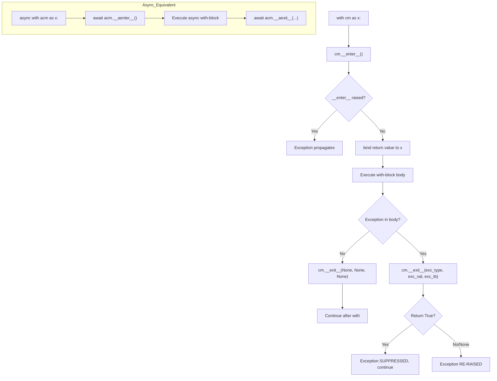

# Python Context Managers

> [!abstract] TL;DR
> A context manager guarantees that setup and teardown code always run as a matched pair — no matter what happens in between — making resource cleanup correct by construction rather than by discipline.

---

## Intuition

**Analogy:** Think of a context manager as a hotel key card. When you check in (`__enter__`), the front desk hands you the card — the door is unlocked, the room is yours. When you check out (`__exit__`), the card is deactivated and the room is cleaned regardless of what state you left it in. You cannot forget to check out: the hotel's system enforces it automatically even if you leave in a hurry (an exception).

Without context managers, cleanup is a promise you make to yourself with `try/finally`. With context managers, cleanup is a contract enforced by the language.

---

## How It Works

### Core Mechanics — The Protocol

Every context manager implements two dunder methods:

| Method | Signature | Role |
|--------|-----------|------|
| `__enter__` | `(self) -> value` | Runs on `with` entry; return value is bound by `as` |
| `__exit__` | `(self, exc_type, exc_val, exc_tb) -> bool` | Runs on exit; return `True` to suppress exception, falsy to re-raise |

**Desugaring:** the `with` statement is syntactic sugar for a deterministic try/finally:

```python
# What you write:
with open("data.csv") as f:
    data = f.read()

# What Python actually runs:
mgr = open("data.csv")
f = mgr.__enter__()
try:
    data = f.read()
except:
    if not mgr.__exit__(*sys.exc_info()):
        raise          # re-raise if __exit__ returned falsy
else:
    mgr.__exit__(None, None, None)
```

The critical difference from bare try/finally: you **cannot accidentally omit** the cleanup call. The `with` block guarantees `__exit__` runs even on `return`, `break`, `continue`, or uncaught exceptions.

### `__exit__` Return Value Rules

```
__exit__ returns True   → exception is SUPPRESSED (swallowed silently)
__exit__ returns False  → exception propagates normally
__exit__ returns None   → same as False (None is falsy)
```

Returning `True` is a deliberate, rare choice — almost always you want falsy so exceptions are not hidden.

### Flow / Architecture



---

## The `@contextmanager` Decorator

`contextlib.contextmanager` converts a **generator function** into a context manager. The `yield` expression is the boundary: everything before `yield` is `__enter__`, everything after is `__exit__`.

```python
from contextlib import contextmanager

@contextmanager
def managed_resource():
    # __enter__ phase
    resource = acquire()
    try:
        yield resource          # body of the with-block runs here
    finally:
        release(resource)       # __exit__ phase — guaranteed
```

**One-yield rule:** the generator must yield exactly once. Yielding zero times raises `RuntimeError`. Yielding twice raises `RuntimeError` on the second attempt. The decorator enforces this.

**Exception handling in the generator:**

```python
@contextmanager
def careful_resource():
    resource = acquire()
    try:
        yield resource
    except ValueError as e:
        # Selectively handle; anything else propagates
        log.warning(f"Recoverable error: {e}")
        release(resource)
    except Exception:
        release(resource)
        raise                   # do not swallow unknown exceptions
    else:
        release(resource)       # only if no exception
```

---

## `contextlib` Toolkit

| Utility | What it does | Typical use |
|---------|-------------|-------------|
| `suppress(*excs)` | Silently ignores listed exception types | Skip `FileNotFoundError` on optional cleanup |
| `redirect_stdout(f)` | Routes `sys.stdout` to file-like object `f` | Capture `print()` output in tests |
| `redirect_stderr(f)` | Routes `sys.stderr` to file-like object `f` | Silence noisy library warnings |
| `nullcontext(val)` | No-op context manager, returns `val` | Optional context manager in conditional branches |
| `closing(obj)` | Calls `obj.close()` on exit | Wrap objects that have `close()` but not `__exit__` |
| `chdir(path)` (3.11+) | Changes cwd, restores on exit | Tests that need a specific working directory |
| `ExitStack` | Dynamically accumulates context managers | Variable number of files, conditional managers |
| `AsyncExitStack` | Async variant of `ExitStack` | Variable async context managers |

### `suppress` Example

```python
from contextlib import suppress
import os

with suppress(FileNotFoundError):
    os.remove("temp_artifact.pkl")   # safe even if file doesn't exist
# execution continues regardless
```

### `nullcontext` for Conditional Managers

```python
from contextlib import nullcontext

def run_inference(model, use_amp: bool):
    ctx = torch.autocast("cuda") if use_amp else nullcontext()
    with ctx:
        return model(inputs)
```

Without `nullcontext`, you would need an `if/else` that duplicates the body.

---

## `ExitStack` — Dynamic Context Manager Stacking

`ExitStack` lets you accumulate an arbitrary number of context managers at runtime, which is impossible with nested `with` blocks (which are fixed at write-time).

```python
from contextlib import ExitStack

def process_files(paths: list[str]):
    with ExitStack() as stack:
        handles = [stack.enter_context(open(p)) for p in paths]
        # All files are open here; all will be closed on exit
        for fh in handles:
            process(fh.read())
    # All file handles guaranteed closed, even on exception

# ExitStack callbacks (no return value needed)
stack.callback(print, "Cleanup done")       # called with fn(*args, **kwargs)
stack.push(some_exit_func)                  # called with (exc_type, exc_val, exc_tb)

# Detach ownership — transfer cleanup responsibility to caller
new_stack = stack.pop_all()                 # current stack is now empty
```

**Key property:** cleanup runs in LIFO order (last entered, first exited) — same as nested `with` blocks.

---

## Async Context Managers

For `async with`, implement `__aenter__` and `__aexit__` (both must be coroutines), or use `@asynccontextmanager`:

```python
from contextlib import asynccontextmanager

@asynccontextmanager
async def managed_db_conn(url: str):
    conn = await db.connect(url)
    try:
        yield conn
    except Exception:
        await conn.rollback()
        raise
    else:
        await conn.commit()
    finally:
        await conn.close()

async def main():
    async with managed_db_conn("postgresql://...") as conn:
        await conn.execute("INSERT INTO events VALUES (?)", data)
```

**`asyncio.timeout` (Python 3.11+):** the idiomatic async timeout pattern:

```python
import asyncio

async def fetch_with_timeout(url: str):
    async with asyncio.timeout(5.0):          # raises TimeoutError after 5s
        return await aiohttp_session.get(url)
```

---

## Code Demo

### 1. Timer / Benchmark Context Manager

```python
import time
from contextlib import contextmanager

@contextmanager
def timer(label: str = "Block"):
    start = time.perf_counter()
    try:
        yield
    finally:
        elapsed = time.perf_counter() - start
        print(f"[{label}] {elapsed:.4f}s")

# Usage
with timer("Model inference"):
    predictions = model.predict(X_test)
# Prints: [Model inference] 0.0234s
```

### 2. Class-Based Database Transaction Manager

```python
import sqlite3

class Transaction:
    """Commit on clean exit; rollback on any exception."""

    def __init__(self, db_path: str):
        self._db_path = db_path
        self._conn = None

    def __enter__(self) -> sqlite3.Cursor:
        self._conn = sqlite3.connect(self._db_path)
        return self._conn.cursor()

    def __exit__(self, exc_type, exc_val, exc_tb):
        if exc_type is None:
            self._conn.commit()
        else:
            self._conn.rollback()   # guarantees no partial writes
        self._conn.close()
        return False                # always re-raise; never suppress

with Transaction("runs.db") as cur:
    cur.execute("INSERT INTO runs VALUES (?, ?)", (run_id, metrics))
# commit happens here if no exception; rollback if exception
```

### 3. `ExitStack` — Opening a Variable List of Files

```python
from contextlib import ExitStack

def merge_csv_files(paths: list[str], out_path: str) -> None:
    with ExitStack() as stack:
        readers = [
            stack.enter_context(open(p, encoding="utf-8"))
            for p in paths
        ]
        writer = stack.enter_context(open(out_path, "w", encoding="utf-8"))

        header_written = False
        for reader in readers:
            for i, line in enumerate(reader):
                if i == 0 and header_written:
                    continue          # skip duplicate header rows
                writer.write(line)
            header_written = True
    # all file handles closed here, guaranteed

merge_csv_files(["jan.csv", "feb.csv", "mar.csv"], "q1.csv")
```

### 4. `redirect_stdout` to Capture Print Output in Tests

```python
import io
from contextlib import redirect_stdout

def report_metrics(accuracy: float, loss: float) -> None:
    print(f"Accuracy: {accuracy:.4f}")
    print(f"Loss:     {loss:.6f}")

# In your test:
buf = io.StringIO()
with redirect_stdout(buf):
    report_metrics(0.9342, 0.0821)

output = buf.getvalue()
assert "Accuracy: 0.9342" in output
assert "Loss:     0.082100" in output
```

---

## Real-World Examples

> **FastAPI lifespan:** FastAPI uses `@asynccontextmanager` for the `lifespan` parameter. The generator's body before `yield` loads the model into `app.state` on startup; the body after `yield` tears down connections on shutdown. This guarantees the model is loaded exactly once per process, not per request — a ~100× latency improvement for large models. See [[FastAPI_for_ML]].

> **PyTorch `torch.no_grad()`:** Every PyTorch evaluation loop wraps inference in `with torch.no_grad():`. This is a context manager that disables the autograd engine for its duration, halving memory consumption and speeding up forward passes by ~30%. Forgetting it does not crash — it silently wastes memory and compute, making it a classic silent bug. See [[PyTorch_Training_Loop]].

> **`unittest.mock.patch`:** The standard library's `patch` is both a decorator and a context manager. As a context manager, it replaces the target attribute for the duration of the `with` block and restores it unconditionally on exit — critical for test isolation.

---

## Trade-offs

| Aspect | `@contextmanager` | Class-based `__enter__`/`__exit__` |
|--------|------------------|-------------------------------------|
| Code length | Shorter — single function | Longer — full class boilerplate |
| Testability | Harder — generator state is internal | Easier — attributes and methods are inspectable |
| Reusability | Limited — single-use generator per call | High — class can be subclassed, parameterized |
| Exception handling | Must explicitly catch inside generator | `__exit__` receives exception info cleanly |
| IDE support | Good | Better — all methods are explicit |

| Aspect | `ExitStack` | Nested `with` blocks |
|--------|-------------|----------------------|
| Dynamic stacking | Yes — number known at runtime | No — fixed at write-time |
| Readability | Slightly less obvious | Visually clear nesting |
| Variable number of CMs | Native | Requires loop + try/finally hack |
| LIFO cleanup order | Guaranteed | Guaranteed |

---

## When to Use vs Avoid

**Use context managers when:**
- A resource must be released after use (files, DB connections, locks, temp directories)
- You want symmetric setup/teardown without relying on developer discipline
- You are writing tests that modify global state (env vars, stdout, patches)
- Cleanup must happen on both success and exception paths

**Avoid / be careful when:**
- `__exit__` returns `True` — this suppresses all exceptions, including `KeyboardInterrupt` and `SystemExit`; use `suppress()` with specific exception types instead
- The setup in `__enter__` can fail and you need fine-grained error reporting — a plain `try/except` may be clearer
- `ExitStack` is used outside a `with` statement — cleanup is no longer guaranteed

---

## Common Pitfalls

- **Generator has no `yield`** — `@contextmanager` wraps the function; if no `yield` is reached, `__enter__` raises `RuntimeError: generator didn't yield`. This turns a context manager into a silent no-op if the `yield` is inside a branch that doesn't execute.

- **Multiple `yield` statements** — yielding twice raises `RuntimeError: generator didn't stop`. The decorator expects exactly one yield.

- **`__exit__` returning `True` accidentally** — any truthy return value suppresses exceptions. A common mistake: `return exc_type is None` returns `True` when there is no exception but also returns `False` when there is one — which is correct. But `return True` unconditionally swallows everything including bugs.

- **`ExitStack` without a `with` statement** — writing `stack = ExitStack(); stack.enter_context(f)` outside a `with` block means `stack.__exit__` is never called. Always use `ExitStack` as a context manager itself.

- **Forgetting `try/finally` in `@contextmanager`** — if the code after `yield` is not wrapped in `try/finally`, an exception in the `with` body will bypass the cleanup code in the generator. The generator receives the exception at the `yield` point via `.throw()`.

- **Using `suppress()` without listing specific exceptions** — `suppress(Exception)` catches everything except `BaseException` subclasses (`SystemExit`, `KeyboardInterrupt`). This is almost always too broad in production code.

---

## Related Concepts

- [[Python_for_ML]] — covers Python language patterns used throughout ML codebases, including generators and decorators that underpin `@contextmanager`
- [[PyTorch_Training_Loop]] — uses `torch.no_grad()` and `torch.autocast()` as context managers in every evaluation loop
- [[PyTorch_Fundamentals]] — explains `torch.no_grad()` as the primary context manager in the PyTorch API
- [[FastAPI_for_ML]] — uses `@asynccontextmanager` for the `lifespan` pattern that loads models on startup
- [[Distributed_Training_Overview]] — implements a custom `@contextmanager` to temporarily disable DDP gradient synchronization
- [[NumPy_Fundamentals]] — related Python foundation note; NumPy file I/O uses the context manager protocol via `open()`

---

## Review Questions

1. **Conceptual:** `__exit__` receives three arguments: `exc_type`, `exc_val`, and `exc_tb`. What does each represent, and what is the precise rule for when `__exit__` should return `True` vs a falsy value? What happens if `__exit__` itself raises an exception?

2. **Scenario:** You are writing a data pipeline that opens between 1 and 50 Parquet files depending on a runtime configuration flag. You need to guarantee all file handles are closed even if processing fails halfway through. Nested `with` blocks cannot handle this. Which `contextlib` tool solves this, and sketch the implementation?

3. **Trade-off:** You need a reusable context manager for a PostgreSQL connection that commits on success and rolls back on exception. A colleague implements it with `@contextmanager`; you implement it as a class. What advantages does each approach offer, and which would you prefer for a shared library used by 10 teams?

4. **Debugging:** A teammate wraps a flaky external API call with `contextlib.suppress(Exception)` to prevent crashes. The API starts returning `None` silently instead of raising. Why is this pattern dangerous, and what should be done instead?

---

## Sources

- [Python docs — contextlib](https://docs.python.org/3/library/contextlib.html)
- [PEP 343 — The "with" Statement](https://peps.python.org/pep-0343/)
- [Real Python — Context Managers and the `with` Statement](https://realpython.com/python-with-statement/)
- [Brett Cannon — How the `with` statement desugars](https://snarky.ca/what-the-heck-is-pyc-files/)

---

#python #context-managers #with-statement #contextlib #resource-management
