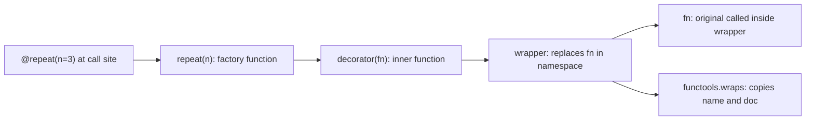
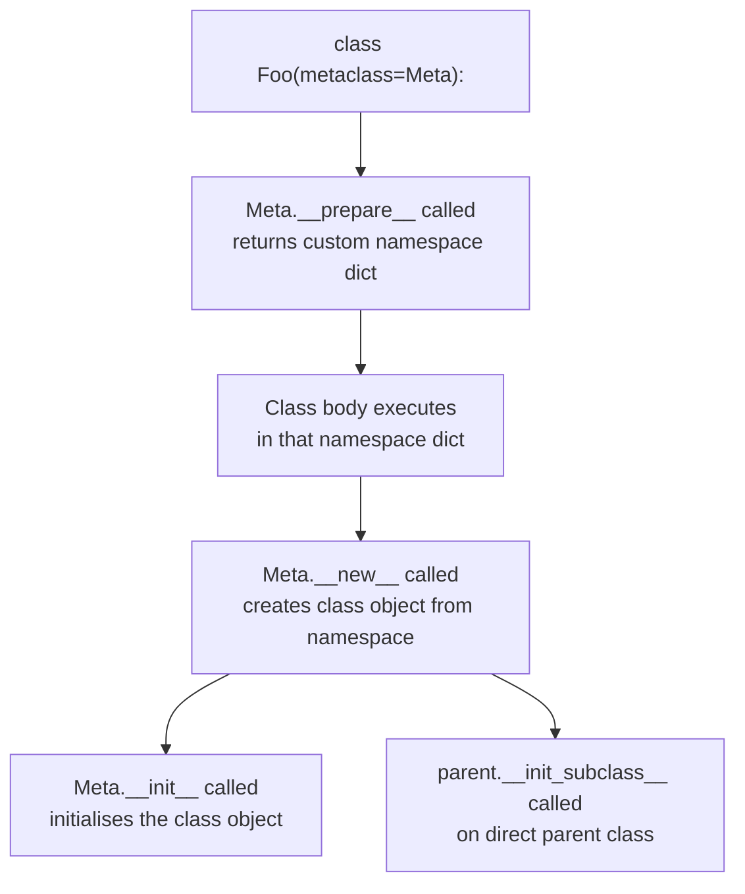

# Decorators and Metaprogramming

> [!abstract] TL;DR
> Decorators and metaclasses let you write code that writes code — transforming functions and classes at definition time so that cross-cutting concerns (caching, validation, registration, logging) are expressed once and applied everywhere, without touching the original logic.

---

## Intuition — Analogy First

**Analogy:** A decorator is like a coffee sleeve — it wraps around the cup without changing what is inside, but every person who picks it up gets insulation, a better grip, and a branded experience. The coffee (original function) is unchanged; the sleeve adds behaviour transparently.

Extend this to metaclasses: if a decorator is a sleeve applied after the cup is made, a metaclass is the mold that shapes every cup as it is being cast. Instead of post-hoc wrapping, a metaclass controls the very construction of classes — you define the factory that produces factories.

`__init_subclass__` sits between the two: it is a hook fired in the parent class each time a child is created — like a registration desk that automatically records every new cup produced from a mold, without you needing to build a new mold.

---

## How It Works — Mechanics

### 1. Function Decorators — Core Mechanics

A decorator is a higher-order function: it takes a callable, wraps it, and returns the replacement.

```python
@timer
def train():
    ...
```

desugars exactly to `train = timer(train)`. The `@` is purely syntactic sugar applied at definition time, not call time.

**`functools.wraps` is non-negotiable.** Without it, the wrapper steals `__name__`, `__doc__`, and `__module__` from the original, which breaks `help()`, Sphinx, logging, and any tool that reads function metadata.

```python
import functools

def timer(fn):
    @functools.wraps(fn)          # copies __name__, __doc__, __wrapped__
    def wrapper(*args, **kwargs):
        import time
        t0 = time.perf_counter()
        result = fn(*args, **kwargs)
        print(f"{fn.__name__} took {time.perf_counter() - t0:.4f}s")
        return result
    return wrapper
```

`__wrapped__` is set by `@wraps` and allows `inspect.unwrap(fn)` to peel back all decorator layers to reach the original.

**Stacking decorators — execution order:** decorators apply bottom-up at definition time, but the outermost wrapper runs first at call time.

```python
@A
@B
@C
def f(): ...
# definition:  f = A(B(C(f)))
# call order:  A-wrapper -> B-wrapper -> C-wrapper -> f -> unwind
```

---

### 2. Parameterized Decorators — The Factory Pattern

When a decorator needs arguments, one extra level of nesting is required.

```python
@repeat(3)
def say_hi(): ...
# desugars to:  say_hi = repeat(3)(say_hi)
# so repeat(3) must return a decorator
```

**Pattern 1 — three-level nesting (most common):**

```python
def repeat(n):
    def decorator(fn):
        @functools.wraps(fn)
        def wrapper(*args, **kwargs):
            result = None
            for _ in range(n):
                result = fn(*args, **kwargs)
            return result
        return wrapper
    return decorator
```

**Pattern 2 — optional arguments (works both with and without parentheses):**

```python
def repeat(_fn=None, *, n=1):
    """Works as @repeat or @repeat(n=3)."""
    def decorator(fn):
        @functools.wraps(fn)
        def wrapper(*args, **kwargs):
            result = None
            for _ in range(n):
                result = fn(*args, **kwargs)
            return result
        return wrapper
    # If called with a function directly (@repeat, no parens), decorate immediately
    return decorator if _fn is None else decorator(_fn)
```

The trick is inspecting whether the first positional argument is a callable — if it is, the decorator was called without arguments.

---

### 3. Class Decorators

Class decorators are applied after the class object is created. They receive the fully-formed class, can mutate or replace it, and return it.

`@dataclass` is the canonical example — it inspects `__annotations__`, then injects `__init__`, `__repr__`, `__eq__`, and optionally comparison methods and slot declarations.

`@functools.total_ordering` is another: define `__eq__` and one of `__lt__`/`__le__`/`__gt__`/`__ge__`; it derives the rest automatically.

Custom class decorator that registers subclasses:

```python
REGISTRY = {}

def register(cls):
    REGISTRY[cls.__name__] = cls
    return cls   # always return the class — forgetting this deletes it
```

The key difference from a metaclass: class decorators run after the class is built; metaclasses control the build itself.

---

### 4. `functools` Essential Decorators

| Decorator | Purpose | Key Detail |
|---|---|---|
| `@lru_cache(maxsize=128)` | Memoize by argument hash | Arguments must be hashable; `fn.cache_info()` / `fn.cache_clear()` |
| `@cache` (3.9+) | Unbounded LRU cache | Equivalent to `lru_cache(maxsize=None)` |
| `@cached_property` | Compute once, store on instance | Stored in `obj.__dict__`; descriptor is bypassed on re-access |
| `@singledispatch` | Overload dispatch by first-arg type | Register variants with `@fn.register(SomeType)` |
| `@wraps(fn)` | Preserve wrapper metadata | Sets `__name__`, `__doc__`, `__module__`, `__qualname__`, `__wrapped__` |

`@cached_property` stores the result directly into the instance `__dict__` under the same key as the property name. On the next access, the instance dict lookup returns the value before the descriptor's `__get__` is invoked — this is why it computes only once without any explicit flag.

---

### 5. Descriptors

A descriptor is any object whose class defines `__get__`, `__set__`, or `__delete__`. `property`, `classmethod`, and `staticmethod` are all descriptors implemented in C.

**Data descriptor:** defines both `__get__` and `__set__` (or `__delete__`). Takes precedence over instance `__dict__`.

**Non-data descriptor:** defines only `__get__`. Instance `__dict__` takes precedence.

Full lookup order for `obj.attr`:
1. Data descriptors on `type(obj)` and its MRO
2. Instance `__dict__`
3. Non-data descriptors on `type(obj)` and its MRO

`__set_name__(owner, name)` is called at class creation time and gives the descriptor knowledge of its own attribute name — no need to repeat the name in the class body.

```python
class Validated:
    def __set_name__(self, owner, name):
        self.public_name  = name
        self.private_name = f"_{name}"   # store under _name to avoid recursion
```

---

### 6. Metaclasses

`type` is the metaclass of every class. A metaclass controls class creation the same way a class controls instance creation.

```python
class Meta(type):
    def __new__(mcs, name, bases, namespace):
        cls = super().__new__(mcs, name, bases, namespace)
        return cls

class Foo(metaclass=Meta):
    pass
```

Key hooks in order of execution:

| Hook | Signature | When called | Common use |
|---|---|---|---|
| `__prepare__` | `(mcs, name, bases, **kwargs)` | Before class body executes | Return custom namespace dict |
| `__new__` | `(mcs, name, bases, namespace)` | Creates class object | Validate/transform attributes |
| `__init__` | `(cls, name, bases, namespace)` | Initialises class object | Register class in a global map |

`__prepare__` is the rarest and most powerful: it lets you replace the ordinary `dict` that stores the class body with any mapping — for example an `OrderedDict` that preserves definition order, or a custom dict that detects duplicate method names.

---

### 7. `__init_subclass__` — The Preferred Alternative

Introduced in Python 3.6, `__init_subclass__` is called on the parent class whenever a subclass is created. No metaclass required.

```python
class Plugin:
    _registry: dict = {}

    def __init_subclass__(cls, plugin_name: str = "", **kwargs):
        super().__init_subclass__(**kwargs)   # always forward kwargs
        if plugin_name:
            Plugin._registry[plugin_name] = cls
```

Subclasses pass arguments through the class definition line:

```python
class CSVPlugin(Plugin, plugin_name="csv"):
    pass

class JSONPlugin(Plugin, plugin_name="json"):
    pass

print(Plugin._registry)   # {'csv': CSVPlugin, 'json': JSONPlugin}
```

Prefer `__init_subclass__` over a metaclass in almost all practical cases — it is simpler, avoids metaclass conflicts in multiple inheritance, and is visible at the base class level.

---

### 8. Dataclasses and `attrs`

`@dataclass` generates boilerplate by reading `__annotations__` at decoration time.

| Parameter | Effect |
|---|---|
| `frozen=True` | Immutable — `__setattr__` raises `FrozenInstanceError` |
| `slots=True` (3.10+) | Uses `__slots__` — faster attribute access, lower memory |
| `order=True` | Derives `__lt__`, `__le__`, `__gt__`, `__ge__` |
| `eq=True` (default) | Generates `__eq__` comparing all fields |

Key tools inside a dataclass:

```python
from dataclasses import dataclass, field, InitVar, ClassVar

@dataclass(frozen=True, slots=True)
class ModelConfig:
    hidden_size: int = 256
    dropout: float = 0.1
    layer_sizes: list = field(default_factory=list)   # mutable default — never use []
    description: str = field(default="", repr=False, compare=False)
    num_layers: ClassVar[int] = 4   # not included in __init__ or __eq__
    seed: InitVar[int] = 42         # init-only; not stored as attribute

    def __post_init__(self, seed: int):
        # Called after generated __init__; seed is available here
        object.__setattr__(self, "_rng_seed", seed)   # frozen requires object.__setattr__
```

`attrs` offers similar functionality with more features (validators, converters, slots by default) and does not require a stdlib import — preferred in performance-critical libraries.

---

### 9. Dynamic Class Creation

```python
# type(name, bases, dict) — lowest-level dynamic class creation
MyLayer = type("MyLayer", (object,), {
    "units": 128,
    "activation": "relu",
})

# types.new_class — supports metaclasses and __init_subclass__
import types

def exec_body(ns):
    ns["units"] = 128

MyLayer = types.new_class("MyLayer", (object,), {}, exec_body)
```

**`__class_cell__` caveat:** `super()` inside a method relies on the `__class__` cell variable. When using raw `type()` calls, you must manually ensure `__class_cell__` is propagated into the class dict, or `super()` raises `RuntimeError`. `types.new_class` handles this automatically and should be the default for dynamic class creation.

---

### Decorator Wrapping Chain



---

### Metaclass Construction Flow and `__prepare__` Hook



---

## Code Demo

### 1. `@retry` with Exponential Backoff

```python
import functools
import time
import random
from typing import Tuple, Type

def retry(
    max_attempts: int = 3,
    exceptions: Tuple[Type[Exception], ...] = (Exception,),
    base_delay: float = 0.5,
):
    """Retry a function with exponential backoff and jitter on specified exceptions."""
    def decorator(fn):
        @functools.wraps(fn)
        def wrapper(*args, **kwargs):
            last_exc: Exception = RuntimeError("retry called with max_attempts=0")
            for attempt in range(1, max_attempts + 1):
                try:
                    return fn(*args, **kwargs)
                except exceptions as exc:
                    last_exc = exc
                    if attempt == max_attempts:
                        break
                    delay = base_delay * (2 ** (attempt - 1)) + random.uniform(0, 0.1)
                    print(f"[retry] attempt {attempt} failed ({exc!r}). Retrying in {delay:.2f}s")
                    time.sleep(delay)
            raise last_exc
        return wrapper
    return decorator


# Demonstrate: function fails twice then succeeds
_call_count = 0

@retry(max_attempts=3, exceptions=(TimeoutError,), base_delay=0.01)
def fetch_data(url: str) -> str:
    global _call_count
    _call_count += 1
    if _call_count < 3:
        raise TimeoutError(f"Connection timed out: {url}")
    return f"<data from {url}>"


result = fetch_data("https://api.example.com/records")
print(result)                    # <data from https://api.example.com/records>
print(fetch_data.__name__)       # fetch_data  (not "wrapper" — thanks to @wraps)
```

---

### 2. `@singledispatch` — Type-Based Function Overloading

```python
from functools import singledispatch

@singledispatch
def process(value):
    """Default handler — raises for unregistered types."""
    raise NotImplementedError(f"No handler registered for type {type(value).__name__!r}")

@process.register(int)
def _process_int(value: int) -> str:
    return f"Integer: {value * 2}"

@process.register(str)
def _process_str(value: str) -> str:
    return f"String: {value.upper()}"

@process.register(list)
def _process_list(value: list) -> str:
    return f"List of {len(value)} items: {value}"


print(process(42))               # Integer: 84
print(process("hello"))          # String: HELLO
print(process([1, 2, 3]))        # List of 3 items: [1, 2, 3]
# process(3.14)                  # NotImplementedError: No handler registered for type 'float'
```

---

### 3. Validated Descriptor with `__set_name__`

```python
class BoundedFloat:
    """Data descriptor enforcing [min_val, max_val] on a float attribute."""

    def __init__(self, min_val: float, max_val: float):
        self.min_val = min_val
        self.max_val = max_val
        self._private: str = ""   # populated by __set_name__

    def __set_name__(self, owner, name: str):
        # Called once at class creation — gives the descriptor its attribute name
        self._private = f"_{name}"

    def __get__(self, obj, objtype=None):
        if obj is None:
            return self           # accessed on the class itself, return descriptor
        return getattr(obj, self._private, None)

    def __set__(self, obj, value: float):
        value = float(value)
        if not (self.min_val <= value <= self.max_val):
            raise ValueError(
                f"{self._private!r} must be in [{self.min_val}, {self.max_val}], "
                f"got {value}"
            )
        setattr(obj, self._private, value)

    def __delete__(self, obj):
        delattr(obj, self._private)


class NeuralNetConfig:
    learning_rate = BoundedFloat(1e-6, 1.0)
    dropout_rate  = BoundedFloat(0.0, 0.9)

    def __init__(self, lr: float, dropout: float):
        self.learning_rate = lr   # triggers BoundedFloat.__set__
        self.dropout_rate  = dropout


cfg = NeuralNetConfig(lr=3e-4, dropout=0.1)
print(cfg.learning_rate)         # 0.0003
print(cfg.dropout_rate)          # 0.1

try:
    cfg.learning_rate = 5.0      # out of [1e-06, 1.0]
except ValueError as e:
    print(e)
    # '_learning_rate' must be in [1e-06, 1.0], got 5.0
```

---

### 4. Plugin Registry via `__init_subclass__`

```python
class DataLoader:
    """
    Base class for all data loaders.
    Subclasses self-register by specifying format= in their class definition.
    """
    _registry: dict = {}

    def __init_subclass__(cls, format: str = "", **kwargs):
        super().__init_subclass__(**kwargs)   # forward kwargs — required for cooperative MI
        if format:
            DataLoader._registry[format] = cls

    @classmethod
    def get_loader(cls, format: str) -> "DataLoader":
        if format not in cls._registry:
            raise KeyError(f"No loader registered for {format!r}. Known: {list(cls._registry)}")
        return cls._registry[format]()

    def load(self, path: str) -> list:
        raise NotImplementedError


class CSVLoader(DataLoader, format="csv"):
    def load(self, path: str) -> list:
        return [f"[csv] row from {path}"]


class ParquetLoader(DataLoader, format="parquet"):
    def load(self, path: str) -> list:
        return [f"[parquet] row from {path}"]


print(DataLoader._registry)                          # {'csv': CSVLoader, 'parquet': ParquetLoader}
loader = DataLoader.get_loader("csv")
print(loader.load("train.csv"))                      # ['[csv] row from train.csv']
```

---

## Real-World Example

> **Example:** PyTorch's `nn.Module` uses a custom `__setattr__` override combined with the descriptor protocol to intercept attribute assignment at the Python level. When you write `self.linear = nn.Linear(128, 64)` inside `__init__`, `nn.Module.__setattr__` detects that `nn.Linear` is a `Module` subclass and routes it into `self._modules` instead of `self.__dict__`. Plain `nn.Parameter` objects go into `self._parameters`. This is what makes `model.parameters()` able to traverse the full computational graph recursively — every sub-module and parameter is registered at assignment time with no explicit bookkeeping from the user. It is the same descriptor-plus-`__setattr__` pattern from the Validated demo above, operating at production scale inside every PyTorch model that has ever been trained.

---

## Trade-offs

| Mechanism | Power | Complexity | Min Python | Readability | Best for |
|---|---|---|---|---|---|
| Metaclass | Highest — controls namespace and creation | High — MI conflicts painful | 2.x | Low — non-obvious | ORM, serialiser frameworks |
| `__init_subclass__` | Medium — runs at subclass creation | Low — just a classmethod | 3.6 | High — visible in base class | Plugin registries, validation |
| Class decorator | Medium — post-creation transformation | Low — familiar function syntax | 2.x | High — `@` is obvious | Adding behaviour without inheritance |
| `@lru_cache` | Function-level memoization | None | 3.2 | High | Pure functions, module-level callables |
| `@cached_property` | Instance-level, compute once | None | 3.8 | High | Expensive derived attributes |

**`@lru_cache` vs `@cached_property` head-to-head:**

| Aspect | `@lru_cache` | `@cached_property` |
|---|---|---|
| Scope | Shared across all callers | Per instance only |
| Storage | Dict on the function object | Instance `__dict__` |
| Memory leak on methods | Yes — holds strong `self` reference | No — dies with the instance |
| Thread safety | Yes (internal lock) | No (Python 3.12 adds a lock) |
| Cache control | `fn.cache_clear()`, `fn.cache_info()` | Delete the attribute manually |
| Works with frozen dataclass | No (instance dict is read-only) | No |

---

## When to Use vs Avoid

**Use function decorators when:**
- Cross-cutting concerns (timing, logging, auth, retry) repeat across many functions
- You want the policy expressed at the call site, not buried inside the function body
- Caching a pure function — `@lru_cache` is zero-boilerplate memoization

**Use `__init_subclass__` when:**
- Building plugin/registry systems where subclasses must self-register
- Enforcing interface contracts on all subclasses without an ABC
- A metaclass would work but is overkill — it almost always is

**Use metaclasses when:**
- You need `__prepare__` to control the class body namespace itself
- Building a framework (ORM, serialiser) where class-creation-time namespace manipulation is unavoidable
- `__init_subclass__` cannot express the required logic

**Avoid when:**
- A simple helper function achieves the same result — decorators add indirection
- Using `@lru_cache` on instance methods — it holds `self` alive, leaking memory; use `@cached_property` or a per-instance cache dict instead
- Multiple inheritance chains are complex — metaclass conflicts (`TypeError: metaclass conflict`) require a combined metaclass and are hard to debug

---

## Common Pitfalls

- **Forgetting `@functools.wraps`** — the wrapper replaces `__name__`, `__doc__`, and `__qualname__` of the original. `help()` shows the wrong docstring, Sphinx generates wrong docs, logging shows `"wrapper"` instead of the real function name. Always apply `@wraps(fn)` to every inner `wrapper` function.

- **Decorator order confusion** — `@A @B def f` means `f = A(B(f))`. A's wrapper runs first on every call. A common production bug: stacking `@cache` outside `@login_required` caches the login redirect for unauthenticated users and serves it to authenticated ones. The order is not cosmetic.

- **`@lru_cache` on methods causes memory leaks** — `lru_cache` hashes arguments including `self`. The cache holds strong references to every instance that has called the method, keeping them alive until `cache_clear()` is called or the process ends. For instance-level caching, use `@cached_property` or store a `dict` on `self` manually.

- **Metaclass conflict in multiple inheritance** — if `class A(metaclass=Meta1)` and `class B(metaclass=Meta2)`, then `class C(A, B)` raises `TypeError: metaclass conflict`. Fix: create `class CombinedMeta(Meta1, Meta2): pass` and use it explicitly, or redesign using `__init_subclass__` which has no such conflict.

- **Mutable default in `@dataclass` fields** — `field: list = []` raises `ValueError` at class definition time because Python detects the shared mutable default. The fix is `field: list = field(default_factory=list)`. This is the most common dataclass mistake in code review.

- **Forgetting `super().__init_subclass__(**kwargs)`** — not forwarding `**kwargs` up the MRO silently breaks cooperative multiple inheritance. Any class further up the chain that also defines `__init_subclass__` never receives the call, and its registration or validation logic is skipped.

---

## Related Concepts

- [[Python_for_ML]] — foundational Python patterns (generators, context managers, type hints) that decorators complement and build upon
- [[NumPy_Fundamentals]] — NumPy's ufunc dispatch mechanism is a C-level analogue of `@singledispatch`, routing array operations by dtype at the C layer

---

## Review Questions

1. **`@wraps` mechanics:** What five attributes does `functools.wraps` copy from the original function to the wrapper, and what additionally does it set that `@wraps` itself does not copy? Name two specific tools or stdlib features that break if you omit `@wraps` from a wrapper function.

2. **Parameterized decorator pattern:** Sketch the skeleton of a decorator `@log_calls(level="INFO")` that also works as plain `@log_calls` without parentheses. Where exactly do you detect which usage is active, and what is the mechanism?

3. **`__init_subclass__` vs metaclass:** Your team is building a plugin system where third-party code registers format handlers at import time. A senior engineer proposes a metaclass; you propose `__init_subclass__`. Give two concrete technical reasons your approach is preferable, and name one scenario where the metaclass would actually be necessary instead.

4. **Data vs non-data descriptor:** A class defines a data descriptor `D` for attribute `attr`, and an instance sets `obj.__dict__["attr"] = 42` directly in `__init__`. Which wins when you access `obj.attr`, and why? If `D` were a non-data descriptor (only `__get__`, no `__set__`), does the answer change? Explain the lookup order in both cases.

---

## Sources

- Python Documentation — [Descriptor HowTo Guide](https://docs.python.org/3/howto/descriptor.html)
- Python Documentation — [functools — Higher-order functions and operations on callable objects](https://docs.python.org/3/library/functools.html)
- Python Documentation — [dataclasses — Data Classes](https://docs.python.org/3/library/dataclasses.html)
- Python Documentation — [Customizing class creation](https://docs.python.org/3/reference/datamodel.html#customizing-class-creation)
- Hettinger, R. — [Descriptor HowTo Guide (author notes)](https://rhettinger.wordpress.com/2011/05/26/super-considered-super/)
- Ramalho, L. — *Fluent Python* (2nd ed., O'Reilly, 2022) — Ch. 9 (Decorators and Closures), Ch. 23 (Class Metaprogramming)
- PEP 487 — [Simpler customization of class creation](https://peps.python.org/pep-0487/) (`__init_subclass__`)
- PEP 557 — [Data Classes](https://peps.python.org/pep-0557/)

---

#python #decorators #metaprogramming #metaclasses #functools #advanced
