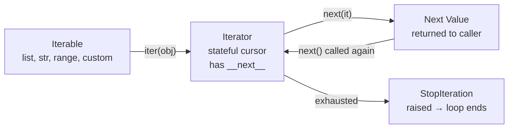
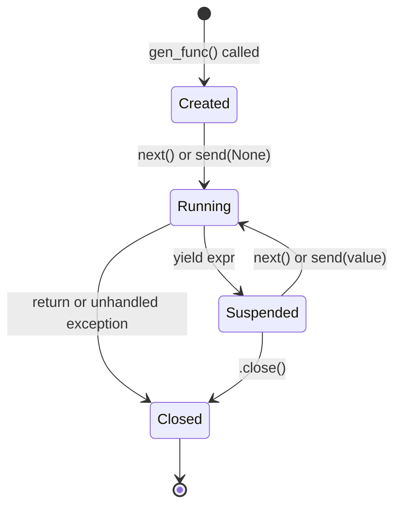
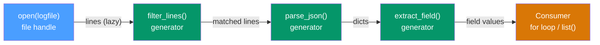

# Generators and Iterators

> [!abstract] TL;DR
> Generators are paused functions that produce values on demand — they replace memory-hungry lists with lazy pipelines, and can receive values back through `send()` to become full coroutines. Mastering the iterator protocol, `yield from`, and `itertools` turns Python data pipelines from scripts into systems.

---

## Intuition — Analogy First

**Analogy:** A vending machine is like a list — it holds everything inside and only works if the warehouse (RAM) is stocked. A pipe from a water tower is like a generator — water flows only when you open the tap, and the tower does not need to fill a swimming pool first.

In Python terms: a list computes and stores every element before you see any of them. A generator computes the *next* element only when asked, keeps no history, and uses the same fixed amount of memory whether the sequence has 10 items or 10 billion. The moment you need random access or multiple passes, you need the swimming pool. For a single forward pass over a stream — the pipe wins every time.

---

## How It Works

### 1. The Iterator Protocol

Every `for` loop in Python is syntactic sugar over two dunder methods.

```python
# The for loop desugared
for item in some_iterable:
    process(item)

# Is exactly equivalent to:
iterator = iter(some_iterable)   # calls some_iterable.__iter__()
while True:
    try:
        item = next(iterator)    # calls iterator.__next__()
        process(item)
    except StopIteration:
        break                    # exhausted — loop ends cleanly
```

**Key distinction — Iterable vs Iterator:**

| Concept | Has `__iter__` | Has `__next__` | Reusable |
|---------|:---:|:---:|:---:|
| **Iterable** | Yes (returns an iterator) | No | Yes |
| **Iterator** | Yes (returns self) | Yes | No — one pass only |

A list is an iterable: calling `iter(mylist)` gives a fresh list_iterator every time. That iterator is *not* the list — it's a separate stateful cursor. An iterator is also an iterable (its `__iter__` returns `self`), but it can only be traversed once.

```python
# Custom iterator class implementing the protocol from scratch
class Countdown:
    """Iterates from n down to 0."""

    def __init__(self, start: int) -> None:
        self.current = start

    def __iter__(self):
        return self          # the iterator IS the iterable here

    def __next__(self) -> int:
        if self.current < 0:
            raise StopIteration
        val = self.current
        self.current -= 1
        return val

for n in Countdown(3):
    print(n)   # 3, 2, 1, 0
```

**Iterator protocol flow:**



---

### 2. Generator Functions

A generator function contains at least one `yield` statement. Calling it does **not** execute the body — it returns a generator object in the `Created` state. Execution begins (and suspends) each time `next()` is called.

```python
def squares(n: int):
    for i in range(n):
        yield i ** 2          # suspend here, hand value to caller

gen = squares(5)              # body NOT run yet
print(next(gen))              # 0  — runs until first yield, suspends
print(next(gen))              # 1  — resumes, runs to second yield
list(gen)                     # [4, 9, 16] — drains the rest
next(gen)                     # StopIteration — generator is closed
```

**Generator expression** — inline syntax, equivalent to a one-liner generator function:

```python
sq_gen = (x ** 2 for x in range(10))   # parentheses, not brackets
sq_list = [x ** 2 for x in range(10)]  # list: allocates all 10 ints

import sys
print(sys.getsizeof(sq_list))   # ~184 bytes (10 ints + list overhead)
print(sys.getsizeof(sq_gen))    # 208 bytes — fixed regardless of n
# For range(10_000_000) the list is ~80 MB; the generator is still 208 bytes.
```

**Generator execution states:**



---

### 3. Generator Delegation: `yield from`

`yield from iterable` transparently delegates iteration to a sub-iterable (including another generator). It:
- Passes `next()` calls through to the inner generator.
- Passes `.send(value)` and `.throw(exc)` through transparently.
- Captures the sub-generator's `return` value as the expression result of `yield from`.

```python
def flatten(nested):
    """Recursively flatten a nested list using yield from."""
    for item in nested:
        if isinstance(item, list):
            yield from flatten(item)   # delegate to recursive call
        else:
            yield item

list(flatten([1, [2, [3, 4]], 5]))   # [1, 2, 3, 4, 5]
```

Without `yield from`, you would need an explicit nested loop:

```python
def flatten_manual(nested):
    for item in nested:
        if isinstance(item, list):
            for sub in flatten_manual(item):
                yield sub            # verbose and does not pass send/throw through
        else:
            yield item
```

**Capturing a sub-generator's return value:**

```python
def subgen():
    yield 1
    yield 2
    return "done"            # the return value of a generator

def delegator():
    result = yield from subgen()   # result captures "done"
    yield f"subgen returned: {result}"

list(delegator())    # [1, 2, 'subgen returned: done']
```

> [!warning] Python 3.7+ pitfall
> In Python 3.7+, a `StopIteration` raised *inside* a generator is automatically converted to `RuntimeError`. Before 3.7, `return value` in a generator was the same as `raise StopIteration(value)` — code that relied on this inside a generator silently breaks in 3.7+.

---

### 4. Two-Way Communication: `send`, `throw`, `close`

A generator can *receive* values from the caller via `send()`, making it a full coroutine.

| Method | What it does |
|--------|-------------|
| `next(gen)` | Equivalent to `gen.send(None)` — resume, ignore sent value |
| `gen.send(value)` | Resume; `value` becomes the result of the `yield` expression inside the generator |
| `gen.throw(ExcType)` | Inject an exception at the point the generator is suspended |
| `gen.close()` | Inject `GeneratorExit` at the suspension point; generator should not yield again |

**First-call rule:** A freshly created generator is at its `Created` state — it has not run at all. The first call must be `next(gen)` or `gen.send(None)`. Calling `gen.send(non_None_value)` before the generator has been primed raises `TypeError`.

```python
def running_average():
    """Coroutine: receives numbers via send(), yields cumulative average."""
    total = 0.0
    count = 0
    while True:
        value = yield (total / count if count else 0.0)
        total += value
        count += 1

avg = running_average()
next(avg)              # prime the coroutine (first yield reached, outputs 0.0)
print(avg.send(10))    # 10.0
print(avg.send(20))    # 15.0
print(avg.send(30))    # 20.0
avg.close()            # GeneratorExit injected — clean shutdown
```

---

### 5. Generator Pipelines

Chaining generators produces a lazy data pipeline: each stage is a generator consuming the previous, and no stage pulls data until the final consumer does. Memory usage is proportional to one record at a time, not the full dataset.



---

### 6. The `itertools` Module

`itertools` is the standard library's generator combinator toolkit. All functions return iterators (lazy). Critical for interviews.

**Infinite iterators** (must be bounded with `islice` or `takewhile`):

| Function | Produces | Example |
|----------|----------|---------|
| `count(start, step)` | 0, 1, 2, … forever | `count(10, 2)` → 10, 12, 14, … |
| `cycle(iterable)` | repeats iterable forever | `cycle('ABC')` → A B C A B C … |
| `repeat(obj, n)` | obj, n times (or forever) | `repeat(0, 3)` → 0, 0, 0 |

**Finite iterators:**

| Function | Produces |
|----------|----------|
| `islice(it, stop)` / `islice(it, start, stop, step)` | slice without materializing |
| `takewhile(pred, it)` | items while pred is True |
| `dropwhile(pred, it)` | items after pred first goes False |
| `filterfalse(pred, it)` | items where pred is False |
| `compress(data, selectors)` | items where selector is truthy |
| `accumulate(it, func)` | running reduce (cumulative sum by default) |
| `starmap(func, it)` | `func(*args)` for each args tuple in it |
| `zip_longest(*its, fillvalue)` | zip that pads shorter iterables |
| `chain(*its)` | concatenate iterables |
| `chain.from_iterable(it)` | flatten one level of nesting |
| `groupby(it, key)` | group consecutive equal-key elements (needs sorted input) |

**Combinatoric iterators:**

| Function | Produces | Example size |
|----------|----------|-------------|
| `product(*its, repeat)` | Cartesian product | `len(A)^repeat` |
| `permutations(it, r)` | ordered r-length selections | `n!/(n-r)!` |
| `combinations(it, r)` | unordered, no repetition | `C(n,r)` |
| `combinations_with_replacement(it, r)` | unordered, with repetition | `C(n+r-1,r)` |

**`groupby` requires sorted input** — it groups consecutive equal-key items only:

```python
from itertools import groupby

data = [('A', 1), ('A', 2), ('B', 3), ('A', 4)]
# NOT sorted by key → 'A' will appear in two separate groups
for key, group in groupby(data, key=lambda x: x[0]):
    print(key, list(group))
# A [('A', 1), ('A', 2)]
# B [('B', 3),]
# A [('A', 4)]   ← wrong if you wanted all A's together

# Correct pattern: sort first
data.sort(key=lambda x: x[0])
for key, group in groupby(data, key=lambda x: x[0]):
    print(key, list(group))
# A [('A', 1), ('A', 2), ('A', 4)]
# B [('B', 3)]
```

---

### 7. `functools` for Iteration

| Tool | Use with generators/iterators |
|------|-------------------------------|
| `reduce(func, it, init)` | Fold an iterator into a single value left-to-right |
| `partial(func, *args)` | Pre-fill arguments to create reusable pipeline stages |
| `lru_cache` / `cache` | Memoize *recursive functions* that call generators internally; cannot memoize generators themselves (they are stateful objects, not pure functions) |

```python
from functools import reduce, lru_cache

# reduce over a generator — no intermediate list needed
total = reduce(lambda a, b: a + b, (x**2 for x in range(10)))
print(total)   # 285

# lru_cache on a recursive helper feeding a generator
@lru_cache(maxsize=None)
def fib(n: int) -> int:
    if n < 2:
        return n
    return fib(n - 1) + fib(n - 2)

def fib_stream(limit: int):
    """Generate Fibonacci numbers up to limit, backed by cached fib()."""
    n = 0
    while True:
        val = fib(n)
        if val > limit:
            return
        yield val
        n += 1

list(fib_stream(100))   # [0, 1, 1, 2, 3, 5, 8, 13, 21, 34, 55, 89]
```

---

### 8. Async Generators

An **async generator** is defined with `async def` and contains `yield`. It must be consumed with `async for` inside an async context.

```python
import asyncio

async def async_count_up(limit: int):
    """Async generator: yields integers with a delay between each."""
    for i in range(limit):
        await asyncio.sleep(0.01)   # non-blocking wait
        yield i

async def main():
    async for value in async_count_up(5):
        print(value)   # 0 1 2 3 4 (each after 10ms delay)

asyncio.run(main())
```

**Async generator vs `asyncio.Queue` for producer-consumer:**

| Pattern | Best for |
|---------|---------|
| `async for gen` | Single consumer pulling from one producer; simple pipeline |
| `asyncio.Queue` | Multiple producers / multiple consumers; backpressure control; decoupled components |

The `aiofiles` streaming pattern for reading large files without blocking the event loop:

```python
import aiofiles

async def stream_lines(path: str):
    async with aiofiles.open(path, 'r') as f:
        async for line in f:
            yield line.rstrip('\n')
```

---

## Code Demos

### Demo 1: Infinite Fibonacci Iterator Class

```python
class FibonacciIterator:
    """Infinite Fibonacci sequence via the iterator protocol."""

    def __init__(self) -> None:
        self._a, self._b = 0, 1

    def __iter__(self):
        return self

    def __next__(self) -> int:
        value = self._a
        self._a, self._b = self._b, self._a + self._b
        return value

from itertools import islice

fib = FibonacciIterator()
print(list(islice(fib, 10)))   # [0, 1, 1, 2, 3, 5, 8, 13, 21, 34]

# Reset requires a new instance — iterators are one-shot
fib2 = FibonacciIterator()
print(list(islice(fib2, 5)))   # [0, 1, 1, 2, 3]
```

---

### Demo 2: Lazy Log File Processing Pipeline

```python
import json
from typing import Generator

def open_lines(filepath: str) -> Generator[str, None, None]:
    """Stage 1: yield raw lines from a file without loading all into RAM."""
    with open(filepath, 'r', encoding='utf-8') as f:
        for line in f:
            yield line.rstrip('\n')

def filter_errors(lines: Generator) -> Generator[str, None, None]:
    """Stage 2: only pass lines that contain the word ERROR."""
    for line in lines:
        if 'ERROR' in line:
            yield line

def parse_json_lines(lines: Generator) -> Generator[dict, None, None]:
    """Stage 3: parse each line as JSON, skip malformed ones."""
    for line in lines:
        try:
            yield json.loads(line)
        except json.JSONDecodeError:
            continue   # silently drop unparseable lines

def extract_field(records: Generator, field: str) -> Generator:
    """Stage 4: pull a specific field from each dict."""
    for record in records:
        if field in record:
            yield record[field]

def build_pipeline(filepath: str, field: str):
    """Compose the four stages — nothing runs until the for loop below."""
    lines   = open_lines(filepath)
    errors  = filter_errors(lines)
    records = parse_json_lines(errors)
    return extract_field(records, field)

# Usage: only one line in memory at any time, even for a 10GB log file
for value in build_pipeline('app.log', 'user_id'):
    process(value)   # your processing function
```

---

### Demo 3: Coroutine-Based Running Average with `send()`

```python
from typing import Optional

def running_stats():
    """
    Coroutine that maintains running mean and variance online.
    Send a float to get back (mean, variance) after each new value.
    Implements Welford's online algorithm.
    """
    n = 0
    mean = 0.0
    M2 = 0.0   # sum of squared deviations from the running mean

    while True:
        x = yield (mean, M2 / n if n > 1 else 0.0)
        n += 1
        delta = x - mean
        mean += delta / n
        delta2 = x - mean
        M2 += delta * delta2

def demo_running_stats():
    stats = running_stats()
    next(stats)   # prime: advance to first yield

    for value in [2, 4, 4, 4, 5, 5, 7, 9]:
        mean, var = stats.send(value)
        print(f"After {value}: mean={mean:.2f}, variance={var:.2f}")
    stats.close()

demo_running_stats()
# After 2: mean=2.00, variance=0.00
# After 4: mean=3.00, variance=2.00
# After 4: mean=3.33, variance=1.33
# ...
# After 9: mean=5.00, variance=4.57
```

---

### Demo 4: `itertools.groupby` for Grouped Aggregation

```python
from itertools import groupby
from operator import itemgetter

# Simulate sorted transaction records (must be sorted by the group key)
transactions = sorted([
    {'user': 'alice', 'amount': 30},
    {'user': 'bob',   'amount': 15},
    {'user': 'alice', 'amount': 50},
    {'user': 'bob',   'amount': 25},
    {'user': 'carol', 'amount': 80},
], key=itemgetter('user'))

# Group by user and compute per-user total
for user, group in groupby(transactions, key=itemgetter('user')):
    user_transactions = list(group)   # consume the sub-iterator fully here
    total = sum(t['amount'] for t in user_transactions)
    print(f"{user}: total=${total}, n={len(user_transactions)}")

# alice: total=$80, n=2
# bob:   total=$40, n=2
# carol: total=$80, n=1
```

> [!warning] Common mistake: forgetting `list(group)` before the next `groupby` iteration
> The group sub-iterator is invalidated as soon as `groupby` advances to the next group. If you store the group object without consuming it immediately, it will be empty. Always call `list(group)` or exhaust it inside the loop body.

---

## Real-World Example

> **Example — PyTorch `DataLoader` and `IterableDataset`:** PyTorch's `DataLoader` is a generator pipeline wrapped in industrial-strength engineering. When you pass `num_workers > 0`, worker processes each run a generator over their slice of the dataset and push batches into a shared multiprocessing queue. The training loop is the consumer. This is exactly the producer-consumer pattern built from Python's iterator protocol: `__iter__` / `__next__` on the `Dataset`, chained through a sampler, collated, and prefetched. For streaming datasets too large to index (`IterableDataset`), PyTorch falls back to a plain generator interface — the same protocol this note describes. See [[PyTorch_DataLoader]] for the full DataLoader deep dive.

---

## Trade-offs

### Generator vs List

| Aspect | Generator | List |
|--------|-----------|------|
| Memory | O(1) — one item at a time | O(n) — all items in RAM |
| First-item latency | Immediate — no upfront work | Full computation before any item |
| Speed (single pass) | Same order as loop | Slightly faster (cache-friendly) |
| Random access | Not possible | O(1) by index |
| Multiple passes | Not possible (one-shot) | Unlimited re-iteration |
| Serialization / pickling | Cannot pickle arbitrary generators | Easy |

### Generator vs Coroutine

| Aspect | Generator (pull) | Coroutine with `send` (push) |
|--------|-----------------|------------------------------|
| Data flow | Consumer pulls values from producer | Caller pushes values into generator |
| Typical use | Data pipelines, lazy sequences | Stateful accumulators, event handlers |
| Mental model | Water tap — pull when ready | Funnel — push data in, aggregate |
| Complexity | Low | Medium — priming step, send protocol |

### `itertools` vs Manual Loop

| Aspect | `itertools` | Manual loop |
|--------|------------|-------------|
| Readability | High (declarative) | Verbose |
| Performance | C-speed (implemented in C) | Python-speed |
| Debuggability | Harder to step through | Easy with print/debugger |
| Composability | Excellent — functions compose | Manual plumbing |

---

## When to Use vs Avoid

**Use generators when:**
- Dataset is larger than available RAM (streaming file processing, Kafka consumers, chunked database reads).
- You need a single forward pass and random access is not required.
- Building multi-stage data pipelines where each stage should be independently testable.
- Writing `DataLoader`-style code or custom PyTorch `IterableDataset` subclasses.
- Generating infinite or very long sequences (Fibonacci, token streams, simulation states).

**Avoid generators when:**
- You need random access by index (`data[i]`).
- You need to pass over the data more than once (e.g., computing mean then std in two passes).
- You need `len()` — generators have no length until exhausted.
- The sequence is small enough to fit comfortably in memory and construction cost is negligible.
- You need to pickle or serialize the iteration state.

---

## Common Pitfalls

- **Consuming a generator twice silently produces nothing** — The second `for` loop or `list()` call returns an empty sequence with no error. This is the most common generator bug. Always construct a fresh generator or use `itertools.tee()` if two consumers are needed (though `tee` itself accumulates memory).

- **`groupby` requires pre-sorted input** — `groupby` groups *consecutive* equal-key elements. Passing unsorted data creates multiple small groups instead of one large group per key. Always `sort()` or use `sorted()` on the data first, using the same key function.

- **Priming a coroutine** — Calling `gen.send(non_None_value)` before the first `next(gen)` (or `gen.send(None)`) raises `TypeError: can't send non-None value to a just-started generator`. Wrap coroutines in a `@coroutine` decorator that auto-primes them, or document the priming requirement explicitly.

- **`yield from` and `StopIteration` in Python 3.7+** — Code like `raise StopIteration` inside a generator (intended to signal the end) is now converted to `RuntimeError`. Use `return` to end a generator cleanly. Any helper function called inside a generator that raises `StopIteration` will bubble up as `RuntimeError`. Fix by catching `StopIteration` explicitly before it reaches the generator frame.

- **`itertools.tee` memory trap** — `tee(it, n)` creates n independent iterators over the same source. If one iterator advances far ahead of the others, all intermediate values are buffered in memory, negating the memory savings of the original generator.

- **Generator expressions in function calls vs assignments** — `sum(x**2 for x in range(n))` passes a generator expression directly (correct, no extra parentheses needed). `f((x for x in data))` requires the double parentheses only when passing to a multi-argument function: `f(x for x in data)` is a syntax error only if `f` takes multiple args.

---

## Related Concepts

- [[_MOC_Python|↑ Python MOC]] — section map and learning path for all 37 Python engineering notes
- [[Python_for_ML]] — Foundational Python patterns for ML; the "Generator for Large Datasets" section is the direct predecessor to this note.
- [[NumPy_Fundamentals]] — When generators hand off to NumPy, the data enters a vectorized execution context; understanding both layers is essential for efficient ML data pipelines.
- [[PyTorch_DataLoader]] — The `Dataset.__getitem__` and `IterableDataset.__iter__` contracts are direct applications of the iterator protocol described here.
- [[Streaming_Responses]] — LLM streaming responses use async generators under the hood; the SSE token-by-token pattern is `async for token in response_stream`.
- [[FastAPI_for_ML]] — FastAPI's `StreamingResponse` consumes a (sync or async) generator and streams its output to clients.

---

## Review Questions

1. **Protocol question:** Explain the difference between an *iterable* and an *iterator* in Python. Why does a `list` support `for` loops but is not itself an iterator? Write the minimum code needed to make a custom class work as an iterator in a `for` loop.

2. **`yield from` question:** Given a deeply nested list `[1, [2, [3, [4]]]]`, write a generator that flattens it using `yield from`. Then explain: what does `yield from` do that a plain `for sub in recursive_call(): yield sub` does *not* do?

3. **`groupby` pitfall:** A colleague writes the following and gets wrong results: `for dept, grp in groupby(employees, key=lambda e: e['dept']): compute_stats(grp)`. Identify two bugs and fix both.

4. **Generator vs coroutine:** You need to compute a per-user running average over a stream of events. A junior engineer proposes building a generator that yields averages. A senior engineer suggests using `send()` instead. Explain the conceptual difference between these two designs and when each is the right choice.

---

## Sources

- [Python Docs — Iterator Types](https://docs.python.org/3/library/stdtypes.html#iterator-types)
- [Python Docs — Generators](https://docs.python.org/3/reference/expressions.html#generator-expressions)
- [Python Docs — `itertools`](https://docs.python.org/3/library/itertools.html)
- [PEP 342 — Coroutines via Enhanced Generators](https://peps.python.org/pep-0342/)
- [PEP 380 — Syntax for Delegating to a Sub-Generator (`yield from`)](https://peps.python.org/pep-0380/)
- [PEP 479 — Change StopIteration handling inside generators](https://peps.python.org/pep-0479/)
- [PEP 525 — Asynchronous Generators](https://peps.python.org/pep-0525/)
- [David Beazley — Generator Tricks for Systems Programmers](https://www.dabeaz.com/generators/)

---

#python #generators #iterators #lazy-evaluation #memory #intermediate
