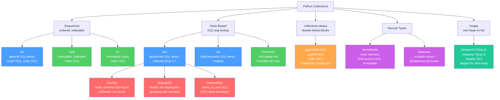

# Python Collections

> [!abstract] TL;DR
> Python's built-in types (`list`, `dict`, `set`, `tuple`) and the `collections` / `heapq` modules give you O(1)-average-case data structures backed by C implementations — choosing the right container for the job eliminates entire bug categories and can turn O(n) algorithms into O(1) ones.

---

## Intuition

**Analogy:** Think of your kitchen storage. A `list` is a numbered shelf — you can add jars to the end instantly, but sliding one into the middle means shifting everything over. A `dict` is a labelled spice rack — you reach for "cumin" directly rather than scanning every jar. A `set` is a unique stamp collection — duplicates fall out automatically and checking membership takes one glance. A `tuple` is a sealed blister pack — once filled the contents never change and you can hand it to anyone without worry. A `deque` is a bread box open at both ends — you can push and pull from either side equally fast.

The `collections` module gives you specialized variants of these built-ins, each tuned for access patterns the bare types handle awkwardly.

---

## How It Works

### Core Mechanics

#### 1. list — Dynamic Array

CPython's `list` is a **dynamic array of `PyObject*` pointers**. Appending is O(1) amortized because CPython **over-allocates** by roughly 1.125× whenever the backing array must grow (growth series: 0, 4, 8, 16, 25, 35, 46, …). The occasional reallocation costs O(n), but it happens rarely enough that the amortized cost per append is O(1).

| Operation | Average Time | Notes |
|---|---|---|
| `append(x)` | O(1) amortized | rare O(n) resize |
| `pop()` | O(1) | removes last element |
| `insert(i, x)` | O(n) | shifts all elements after index i |
| `list[i]` | O(1) | direct pointer dereference |
| `x in list` | O(n) | linear scan |
| `len(list)` | O(1) | stored as a struct field |
| `sort()` | O(n log n) | Timsort; stable |

**list vs array.array vs numpy:** Use `list` for heterogeneous Python objects. Use `array.array` for typed numeric data when you want C-level compactness without pulling in NumPy. Use `numpy.ndarray` for vectorized mathematical operations on large numeric datasets.

**Timsort stability:** `list.sort()` and `sorted()` use Timsort — a hybrid merge/insertion sort that is *stable* (equal elements keep their original order) and adaptive (O(n) on nearly-sorted input).

**List comprehensions vs `map()`/`filter()`:** Prefer list comprehensions for clarity and general use. `map()` with a built-in C function (e.g., `map(str, nums)`) can be marginally faster than a comprehension because no Python-level lambda is invoked per element. `filter()` with a `lambda` is consistently slower than a comprehension with a condition.

```python
# Preferred for readability and speed in the general case
squares = [x**2 for x in range(10)]

# map() wins when the function is a C built-in (no lambda overhead)
strings = list(map(str, [1, 2, 3]))

# Comprehension is faster than filter+lambda for user-defined predicates
evens = [x for x in range(10) if x % 2 == 0]
```

---

#### 2. dict — Compact Hash Map with Open Addressing

CPython 3.6+ uses a **compact hash table** with **open addressing**. Entries are stored in insertion order in a dense array; a sparse index array maps hash values to positions in the dense array. This layout gives O(1) lookup and guarantees insertion-ordered iteration with less memory than the classic sparse-only layout.

**Python 3.7+ guarantees insertion order as part of the language specification** (not just a CPython implementation detail).

| Operation | Average Time | Notes |
|---|---|---|
| `d[key]` | O(1) | hash then probe |
| `d[key] = val` | O(1) | hash then probe |
| `del d[key]` | O(1) | marks slot deleted |
| `key in d` | O(1) | hash lookup only |
| `d.get(k, default)` | O(1) | returns default; no KeyError |
| Iteration | O(n) | walks dense entry array |

Worst case for all hash operations is O(n) if a pathological key set causes many collisions — this is why hash randomisation (`PYTHONHASHSEED`) is enabled by default.

**Useful idioms:**

```python
# Merge two dicts (Python 3.9+); b wins on key conflict
merged = a | b
a |= b                         # in-place

# Equivalent for older Python
merged = {**a, **b}

# Insert-if-absent, then append — one lookup
d.setdefault("key", []).append(value)

# Views are live — they reflect subsequent mutations to the dict
keys_view = d.keys()
d["new"] = 1
"new" in keys_view             # True — not a frozen snapshot
```

---

#### 3. set / frozenset — Hash Set

`set` is essentially a dict that stores only keys. `frozenset` is the immutable, hashable variant — it can be used as a dict key or stored inside another set.

| Operation | Average Time |
|---|---|
| `add(x)` | O(1) |
| `remove(x)` | O(1) |
| `x in s` | O(1) |
| `s \| t` (union) | O(len(s) + len(t)) |
| `s & t` (intersection) | O(min(len(s), len(t))) |
| `s - t` (difference) | O(len(s)) |
| `s ^ t` (symmetric difference) | O(len(s) + len(t)) |

**set vs list for membership testing:** `x in my_set` is O(1); `x in my_list` is O(n). For any repeated membership test against a fixed collection, convert to a set first.

```python
allowed = {"admin", "editor", "viewer"}
if role in allowed:   # O(1) hash lookup, not O(n) linear scan
    grant_access()
```

---

#### 4. tuple — Immutable Sequence

Tuples are stored more compactly than lists (no over-allocation slack) and are **hashable** when all their elements are hashable, making them valid dict keys.

```python
# Packing and unpacking
point = (3, 4)
x, y = point

# Star unpacking (Python 3+)
first, *rest = [1, 2, 3, 4]       # first=1, rest=[2, 3, 4]
head, *middle, tail = range(5)     # head=0, tail=4

# Single-element tuple — trailing comma is mandatory
single = (42,)    # tuple of one int
not_tuple = (42)  # just the int 42; parentheses are grouping, not tuple syntax

# Tuple as composite dict key
grid = {}
grid[(0, 0)] = "origin"           # (row, col) as key
```

---

#### 5. collections.deque — Doubly-Linked List of Fixed-Size Blocks

`deque` is implemented as a **doubly-linked list of fixed-size blocks** (not a single contiguous array). This gives O(1) worst-case (not amortized) appends and pops from **both ends**.

| Operation | Time | Notes |
|---|---|---|
| `append(x)` | O(1) | right end |
| `appendleft(x)` | O(1) | left end |
| `pop()` | O(1) | right end |
| `popleft()` | O(1) | left end |
| `dq[i]` | O(n) | traverses linked blocks; no random access |
| `rotate(k)` | O(k) | circular rotation |

**`maxlen` — circular buffer:** `deque(maxlen=k)` creates a fixed-capacity deque that automatically discards from the opposite end when full. Ideal for keeping the last N events without manual eviction logic.

**Thread safety:** `append`, `appendleft`, `pop`, and `popleft` are each atomic under the GIL, making `deque` safe for one producer/one consumer from opposite ends — unlike `list`.

**deque vs list:** Use `deque` when O(1) operations on both ends matter (BFS queues, sliding windows, bounded history buffers). Use `list` when you need O(1) random index access or must pass the collection to NumPy, Pandas, or PyTorch.

---

#### 6. collections.Counter — Frequency Dict

`Counter` is a `dict` subclass where missing keys **return 0** rather than raising `KeyError`. It is purpose-built for frequency counting.

```python
from collections import Counter

c = Counter("abracadabra")
# Counter({'a': 5, 'b': 2, 'r': 2, 'c': 1, 'd': 1})

c.most_common(3)        # [('a', 5), ('b', 2), ('r', 2)] — O(n log k)
c["z"]                  # 0 — no KeyError, no insertion

# Arithmetic on Counters
c1 = Counter(a=3, b=1)
c2 = Counter(a=1, b=2)
c1 + c2   # Counter({'a': 4, 'b': 3})  — add counts
c1 - c2   # Counter({'a': 2})           — subtract; floor at 0; drops non-positives
c1 & c2   # Counter({'a': 1, 'b': 1})  — take minimum of each count
c1 | c2   # Counter({'a': 3, 'b': 2})  — take maximum of each count

# update() adds in-place (like +=); subtract() keeps negatives
c1.update(c2)           # modifies c1 in place
c1.subtract(c2)         # allows negative counts
```

**`update()` vs `+`:** `update()` modifies in place and keeps negative counts as they are; `+` creates a new Counter and floors counts at 0. Use `subtract()` when you need to track deficits.

---

#### 7. collections.defaultdict — Factory for Missing Keys

`defaultdict` calls a **factory function** on every missing key access instead of raising `KeyError`, and inserts the factory's return value at that key.

```python
from collections import defaultdict

# Grouping pattern — most common use case
groups = defaultdict(list)
for word in ["apple", "ant", "banana", "ape"]:
    groups[word[0]].append(word)
# defaultdict(list, {'a': ['apple', 'ant', 'ape'], 'b': ['banana']})

# Counting — but prefer Counter for this
freq = defaultdict(int)
for char in "hello":
    freq[char] += 1

# Nested graph adjacency list
graph = defaultdict(set)
graph["A"].add("B")     # no KeyError even if "A" was not present
```

**defaultdict vs `dict.setdefault()` vs `Counter`:**
- `defaultdict(list)` — cleanest syntax for grouping; factory called once per missing key.
- `d.setdefault(k, []).append(v)` — no import; slightly more overhead per call (evaluates default expression on every call, even if key exists in some Python versions).
- `Counter` — use specifically for integer frequency counts; adds `most_common`, arithmetic operations, and `elements()` that `defaultdict(int)` lacks.

---

#### 8. collections.OrderedDict — Doubly-Linked Dict with O(1) Reorder

Since plain `dict` in Python 3.7+ preserves insertion order, `OrderedDict`'s main remaining advantage is `move_to_end()` (O(1) reposition via an internal doubly-linked list) and `popitem(last=False)` (O(1) FIFO removal from the front).

```python
from collections import OrderedDict

od = OrderedDict([("a", 1), ("b", 2), ("c", 3)])
od.move_to_end("a")              # order: b, c, a
od.move_to_end("c", last=False)  # order: c, b, a
od.popitem(last=False)           # removes ('c', 3) from front — O(1)
```

The canonical modern use case is implementing **LRU caches** without a sorting step (see Code Demo). Python's own `functools.lru_cache` uses this pattern internally.

---

#### 9. namedtuple and typing.NamedTuple — Named Records

`namedtuple` produces a tuple subclass with named fields. Field access by name has **zero runtime overhead** — fields are stored at fixed tuple offsets, not in a `__dict__`.

```python
from collections import namedtuple
from typing import NamedTuple

# Factory-function style
Point = namedtuple("Point", ["x", "y"])
p = Point(3, 4)
p.x             # 3   — named access
p[0]            # 3   — positional access (still a tuple)
p._asdict()     # {'x': 3, 'y': 4}
p._replace(x=10)  # Point(x=10, y=4)  — returns new instance; original unchanged

# Class-based syntax (supports type hints and default values)
class Vector(NamedTuple):
    x: float
    y: float
    label: str = "unlabeled"

v = Vector(1.0, 2.0)
hash(v)         # hashable — can be used as dict key or set element
```

**namedtuple vs dataclass:**
- `namedtuple` — immutable, tuple subclass, hashable, memory-efficient (no `__dict__` overhead), limited support for defaults and inheritance.
- `@dataclass` — mutable by default (or `frozen=True` for immutability), full class inheritance, rich default handling (`field(default_factory=...)`), `__post_init__`, but not a tuple subclass.

---

#### 10. heapq — Min-Heap on a Plain List

`heapq` turns a regular Python `list` into a **min-heap in place**. There is no separate heap class — the list IS the heap, with the invariant `h[k] <= h[2*k+1]` and `h[k] <= h[2*k+2]` for all valid indices.

| Function | Time | Notes |
|---|---|---|
| `heappush(h, x)` | O(log n) | push then sift up |
| `heappop(h)` | O(log n) | pop min then sift down |
| `heapify(h)` | O(n) | Floyd's bottom-up algorithm |
| `nlargest(k, it)` | O(n log k) | maintains a min-heap of size k |
| `nsmallest(k, it)` | O(n log k) | maintains a max-heap of size k |
| Peek at minimum | O(1) | `h[0]` — direct list index |

**Max-heap trick:** Python provides only a min-heap. To simulate a max-heap, **negate values** on push and negate again on pop.

**Heap of tuples for stable priority queues:** When priorities may be equal and the item type does not support comparison (e.g., arbitrary objects), push `(priority, insertion_counter, item)`. The `insertion_counter` breaks ties without ever comparing `item` values.

```python
import heapq

h = []
counter = 0
tasks = [(3, "low-priority"), (1, "critical"), (1, "also-critical")]
for priority, task in tasks:
    heapq.heappush(h, (priority, counter, task))
    counter += 1

while h:
    pri, _, task = heapq.heappop(h)
    print(pri, task)
# 1 critical
# 1 also-critical
# 3 low-priority
```

---

### Flow / Architecture



*(Blue = built-in sequence/hash; green = immutable variants; red = dict subclasses from `collections`; orange = deque; purple = record types; teal = heap)*

---

## Code Demo

### 1. LRU Cache with OrderedDict

```python
from collections import OrderedDict

class LRUCache:
    """
    O(1) get and put.
    OrderedDict front = least-recently-used; back = most-recently-used.
    move_to_end() promotes a hit to MRU in O(1).
    popitem(last=False) evicts LRU in O(1).
    """

    def __init__(self, capacity: int) -> None:
        self.cache: OrderedDict[int, int] = OrderedDict()
        self.capacity = capacity

    def get(self, key: int) -> int:
        if key not in self.cache:
            return -1
        self.cache.move_to_end(key)   # promote to MRU
        return self.cache[key]

    def put(self, key: int, value: int) -> None:
        if key in self.cache:
            self.cache.move_to_end(key)
        self.cache[key] = value
        if len(self.cache) > self.capacity:
            self.cache.popitem(last=False)   # evict LRU from front


cache = LRUCache(2)
cache.put(1, 10)
cache.put(2, 20)
print(cache.get(1))    # 10 — promotes 1 to MRU; order: 2, 1
cache.put(3, 30)       # evicts 2 (LRU)
print(cache.get(2))    # -1 — evicted
print(cache.get(3))    # 30
```

---

### 2. Anagram Grouping with defaultdict

```python
from collections import defaultdict

def group_anagrams(words: list[str]) -> list[list[str]]:
    """
    Groups words that are anagrams of each other.
    Key insight: sorted characters form the canonical anagram fingerprint.
    """
    groups: defaultdict[tuple, list[str]] = defaultdict(list)
    for word in words:
        key = tuple(sorted(word))    # "eat" and "tea" both map to ('a','e','t')
        groups[key].append(word)
    return list(groups.values())


words = ["eat", "tea", "tan", "ate", "nat", "bat"]
print(group_anagrams(words))
# [['eat', 'tea', 'ate'], ['tan', 'nat'], ['bat']]
```

---

### 3. Top-K Frequent Elements with Counter + heapq

```python
from collections import Counter
import heapq

def top_k_frequent(nums: list[int], k: int) -> list[int]:
    """O(n log k) — heapq.nlargest maintains a min-heap of size k."""
    freq = Counter(nums)
    return heapq.nlargest(k, freq, key=freq.get)


def top_k_manual(nums: list[int], k: int) -> list[int]:
    """Same result using the explicit negate-for-max-heap trick."""
    freq = Counter(nums)
    heap: list[tuple[int, int, int]] = []
    tie_break = 0
    for num, count in freq.items():
        heapq.heappush(heap, (-count, tie_break, num))   # negate = max-heap
        tie_break += 1
    return [heapq.heappop(heap)[2] for _ in range(k)]


nums = [1, 1, 1, 2, 2, 3]
print(top_k_frequent(nums, k=2))    # [1, 2]
print(top_k_manual(nums, k=2))      # [1, 2]
```

---

### 4. Sliding Window Maximum with deque

```python
from collections import deque

def sliding_window_max(nums: list[int], k: int) -> list[int]:
    """
    O(n) sliding window maximum using a monotonic deque.
    Invariant: dq stores indices in *decreasing* order of their nums values.
    Front of dq = index of the current window's maximum element.
    """
    result: list[int] = []
    dq: deque[int] = deque()   # stores indices, not values

    for i, val in enumerate(nums):
        # Remove indices that have fallen outside the current window [i-k+1, i]
        while dq and dq[0] < i - k + 1:
            dq.popleft()
        # Maintain decreasing value order: remove smaller rear elements
        while dq and nums[dq[-1]] < val:
            dq.pop()
        dq.append(i)
        # Record result once the first full window is formed
        if i >= k - 1:
            result.append(nums[dq[0]])

    return result


nums = [1, 3, -1, -3, 5, 3, 6, 7]
print(sliding_window_max(nums, k=3))   # [3, 3, 5, 5, 6, 7]
```

---

## Real-World Example

> **Example:** CPython's `functools.lru_cache` decorator (stdlib since 3.2) uses an `OrderedDict` internally to achieve O(1) cache hits and O(1) LRU eviction. When `@lru_cache(maxsize=128)` decorates a function, each call either promotes the key to MRU position via `move_to_end()` or evicts the LRU entry via `popitem(last=False)` — exactly the pattern in Code Demo 1. The stdlib also uses `Counter` in `collections.Counter`-based frequency tools, `deque` as the underlying structure for `queue.Queue` thread-safe queuing, and `defaultdict` pervasively in the `email`, `html.parser`, and `zipimport` modules for grouping and adjacency list construction.

---

## Trade-offs

### list vs deque

| Aspect | list | deque |
|---|---|---|
| Append / pop from right | O(1) amortized | O(1) worst-case |
| Appendleft / popleft | O(n) — shifts all elements | O(1) worst-case |
| Random index access | O(1) — contiguous array | O(n) — traverses linked blocks |
| Memory layout | Contiguous (cache-friendly iteration) | Linked blocks (cache-unfriendly for iteration) |
| `maxlen` circular buffer | Not supported | Native support |
| Thread-safe end ops | No | Yes (GIL-atomic append/pop) |

### dict vs defaultdict vs Counter

| Aspect | dict | defaultdict | Counter |
|---|---|---|---|
| Missing key behaviour | `KeyError` | Calls factory, inserts result | Returns 0; does not insert |
| Best for | General mapping | Grouping, graph adjacency | Frequency counting |
| Extra features | `\|` merge (3.9+), live views | None beyond dict | `most_common`, arithmetic, `elements()` |
| Import required | No | `from collections import defaultdict` | `from collections import Counter` |

### namedtuple vs dataclass vs TypedDict

| Aspect | namedtuple | dataclass | TypedDict |
|---|---|---|---|
| Mutability | Immutable | Mutable (or `frozen=True`) | Mutable (it is a dict) |
| Memory | Same as tuple — no `__dict__` | Heavier (`__dict__` unless `__slots__`) | Full dict overhead |
| Hashable | Yes (if all fields hashable) | Only if `frozen=True` | No |
| Positional access | Yes (tuple index) | No | No (key lookup only) |
| Type hints | Via `typing.NamedTuple` class syntax | Native | Native |
| Inheritance | Limited (tuple subclass) | Full class inheritance | Limited |
| Best for | Lightweight records, composite dict keys | Rich domain objects with behaviour | API/JSON schemas, `**kwargs` typing |

---

## When to Use vs Avoid

**Use list when:**
- You need an ordered, mutable, indexable sequence of mixed-type objects.
- Appending to the right end is the dominant operation.
- You need to pass the collection to NumPy, Pandas, PyTorch, or scikit-learn (all accept Python lists).

**Use deque when:**
- You need O(1) operations on both ends: BFS queues, sliding window bookkeeping, bounded event history.
- You need thread-safe concurrent appends/pops from opposite ends.

**Use dict when:**
- Lookup, insert, and delete by key are the dominant operations.
- You need insertion-ordered iteration.

**Use set when:**
- Membership testing against a fixed collection is the dominant operation.
- You need set algebra (union, intersection, difference, symmetric difference).

**Use Counter when:**
- You need frequency counts with arithmetic on frequencies or `most_common(n)`.

**Use defaultdict when:**
- You are building a dict where each value is a collection (list, set, int) and want automatic zero-cost initialisation on first access.

**Use namedtuple when:**
- You need a lightweight, immutable, hashable record that is also a valid dict key.

**Use heapq when:**
- You need a priority queue, or repeatedly need the k smallest/largest elements from a large collection.

**Avoid when:**
- `list` for O(1) left-end pops — use `deque.popleft()`.
- `list` for O(1) membership testing — use `set`.
- bare `dict` with complex missing-key initialisation — use `defaultdict`.
- `namedtuple` when you need mutability or full class inheritance — use `dataclass`.

---

## Common Pitfalls

- **Mutable default argument** — `def f(x=[]):` creates the list once at function definition time and shares it across all calls. Fix: `def f(x=None): if x is None: x = []`. This is Python's single most common footgun.

- **`list * n` creates shallow copies** — `[[]] * 3` creates three references to the *same* inner list. Mutating one mutates all three. Fix: `[[] for _ in range(3)]`.

- **dict keys must be hashable** — `list`, `set`, and `dict` cannot be dict keys; attempting to use them raises `TypeError`. Use `tuple` or `frozenset` as composite hashable keys.

- **Counter subtraction floors at 0** — `Counter(a=1) - Counter(a=5)` gives `Counter()`, not `Counter(a=-4)`. Use `c.subtract(other)` to retain negative counts, then read via `c["a"]`.

- **deque random access is O(n)** — `dq[500]` on a 10,000-element deque walks through up to 500 linked nodes. If you are frequently indexing a deque, switch to a list.

- **Modifying a dict while iterating over it** — raises `RuntimeError: dictionary changed size during iteration`. Iterate over a snapshot: `for k in list(d):`.

- **Single-element tuple syntax** — `(42)` is just `42` with redundant parentheses; `(42,)` is the one-element tuple. The trailing comma is what creates the tuple, not the parentheses.

---

## Related Concepts

- [[_MOC_Python|↑ Python MOC]] — section map and learning path for all 37 Python engineering notes
- [[Python_for_ML]] — vectorization philosophy, list comprehensions vs generators, Python ecosystem overview; `collections` types are the pure-Python building blocks before NumPy takes over
- [[NumPy_Fundamentals]] — when to abandon Python lists for C-backed typed arrays; `array.array` is the middle ground; NumPy supersedes `list` for numeric work
- [[Pandas]] — `DataFrame` and `Series` are higher-level collections built on NumPy arrays; `groupby` mirrors `defaultdict(list)` at scale
- [[Static_vs_Dynamic_Arrays]] — the theory behind `list`'s over-allocation growth strategy and why amortized O(1) append holds
- [[Hash_Table_Fundamentals]] — open addressing, load factor, and collision resolution — the internals of `dict` and `set`
- [[Deque]] — the DSA perspective on double-ended queues and their role in BFS and monotonic sliding-window patterns
- [[Binary_Heap]] — the heap property that `heapq` enforces on a plain Python `list`; heapify in O(n) via Floyd's algorithm
- [[Amortized_Analysis]] — the formal justification for why `list.append()` is O(1) amortized despite occasional O(n) resizes
- [[Sliding_Window]] — the algorithmic pattern where `deque` provides O(1) window-boundary management; see Code Demo 4
- [[Top_K_Pattern]] — heap-based pattern for top-K queries; `heapq.nlargest` and `Counter.most_common` both implement it

---

## Review Questions

1. **Internals:** Explain why `dict` lookup is O(1) average case but O(n) worst case. What condition causes worst-case behaviour, and how does enabling `PYTHONHASHSEED` randomisation mitigate the risk of intentional hash collision attacks?

2. **Scenario:** You are building a real-time stream processor that must report the maximum value seen in a sliding window of the last 60 events. The naive approach stores all 60 values in a list and calls `max()` on each event — O(k) per event. Explain how a `deque` with a monotonic invariant reduces this to O(1) amortized per event, and describe exactly what invariant the deque must maintain.

3. **Trade-off:** A colleague proposes `Counter(A) - Counter(B)` to find elements present in list A but not in list B. A second colleague proposes `set(A) - set(B)`. Give a concrete example where these produce different results, and explain which is correct for a bag-of-words frequency-difference calculation versus a simple membership-difference calculation.

4. **heapq max-heap:** Python's `heapq` is strictly a min-heap. You need to stream integers and at any point answer "what are the K largest integers seen so far?" in O(log K) per insertion. Describe the negation trick to convert the min-heap into a max-heap, and explain why you should use `(priority, counter, value)` tuples rather than bare values when multiple items may share the same priority.

---

## Sources

- [Python docs — Data Structures tutorial](https://docs.python.org/3/tutorial/datastructures.html)
- [Python docs — collections module](https://docs.python.org/3/library/collections.html)
- [Python docs — heapq](https://docs.python.org/3/library/heapq.html)
- [CPython source — listobject.c (over-allocation logic)](https://github.com/python/cpython/blob/main/Objects/listobject.c)
- [Raymond Hettinger — Modern Python Dictionaries, PyCon 2017](https://www.youtube.com/watch?v=npw4s1QTmPg)
- [Real Python — Python's collections Module Guide](https://realpython.com/python-collections-module/)

---

#python #collections #data-structures #performance #intermediate
