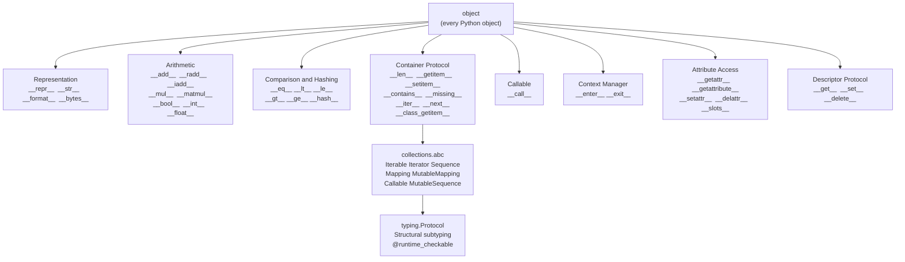

# Python Data Model

> [!abstract] TL;DR
> The Python Data Model is the set of special `__dunder__` methods that let your objects speak Python's native language — enabling `len(obj)`, `obj[i]`, `obj + other`, `with obj:`, and more — while ABCs and Protocols make those contracts explicit and statically enforceable.

---

## Intuition

**Analogy:** Think of Python's built-in operators and functions as a universal remote control. The remote has buttons labelled `len`, `+`, `[]`, `for`, `with`. When you press `len`, the remote looks for a `__len__` socket on your object. If it finds one, it connects. If not, it raises a `TypeError`. The Python Data Model is the specification of every socket the remote knows about — build your class with the right sockets and every Python idiom works on it automatically.

The deeper insight: Python's built-in types are not privileged. `list`, `dict`, and `str` are not special — they just implement the same `__len__`, `__getitem__`, `__iter__` sockets you can implement. When NumPy gives you `a + b` for arrays, that is `ndarray.__add__`. When PyTorch's `DataLoader` iterates your `Dataset`, that is `__len__` and `__getitem__`. The entire scientific Python stack is built on this contract.

---

## How It Works

### Core Mechanics

The Python interpreter never calls dunder methods via normal attribute lookup on the instance. It looks them up on the **type** (class), bypassing instance `__dict__`. This is why setting `obj.__len__ = lambda: 99` does not fool `len(obj)` — Python calls `type(obj).__len__(obj)` instead.

Key dispatch rules:

1. `len(x)` calls `type(x).__len__(x)` — must return a non-negative integer.
2. `x + y` calls `type(x).__add__(x, y)` first; if that returns `NotImplemented`, tries `type(y).__radd__(y, x)`.
3. `x[i]` calls `type(x).__getitem__(x, i)`.
4. `for item in x` calls `type(x).__iter__(x)`; if missing, falls back to `__getitem__` starting at 0.
5. `isinstance(x, SomeABC)` checks the MRO first, then calls `SomeABC.__subclasshook__(type(x))` for virtual subclass registration.

### Protocol Hierarchy



---

## Core Concepts

### 1. Object Representation

| Method | Called by | Purpose |
|--------|-----------|---------|
| `__repr__` | `repr(x)`, interactive shell, `!r` in f-strings | Unambiguous; ideally `eval(repr(x)) == x` |
| `__str__` | `str(x)`, `print(x)`, `!s` in f-strings | Human-readable; falls back to `__repr__` if absent |
| `__format__` | `format(x, spec)`, f-strings with format specs | Custom format specs like `f"{v:.2f}"` or `f"{v:polar}"` |
| `__bytes__` | `bytes(x)` | Binary representation |

If `__repr__` is defined but not `__str__`, Python uses `__repr__` for both. If `__repr__` returns a non-string, Python raises `TypeError` — a bug that only appears at runtime, not at class definition time.

---

### 2. Comparison and Hashing

- `__eq__` controls `==`. Return `NotImplemented` (not `False`) for unsupported types so Python can try the other operand's method.
- **The hash contract:** if `a == b` then `hash(a) == hash(b)`. Violating this breaks sets and dicts silently — equal objects are stored as separate entries.
- **Critical rule:** defining `__eq__` causes Python to set `__hash__ = None` automatically, making instances unhashable. You must explicitly define `__hash__` to re-enable hashing.
- `functools.total_ordering` generates the remaining comparison methods from `__eq__` plus any one of `__lt__`, `__le__`, `__gt__`, or `__ge__`. It carries a small performance cost since each comparison becomes an indirect call.

---

### 3. Arithmetic Operators

- **Forward:** `a + b` calls `a.__add__(b)`.
- **Reflected:** if `__add__` returns `NotImplemented`, Python tries `b.__radd__(a)`. This enables `3 * vector` to call `vector.__rmul__(3)`.
- **In-place:** `a += b` calls `a.__iadd__(b)`. If absent, falls back to `a = a + b`. Should return `self` for mutable types.
- **Numeric conversions:** `__bool__` controls `if obj:`. If absent, Python falls back to `__len__` (zero-length = falsy). `__int__` and `__float__` control explicit conversion.
- **`__matmul__`** implements the `@` operator (PEP 465), used by NumPy and PyTorch for matrix multiplication.

---

### 4. Container Protocol

| Method | Enables |
|--------|---------|
| `__len__` | `len(obj)`, truthiness fallback when `__bool__` is absent |
| `__getitem__` | `obj[i]`, `obj[a:b]`, and iteration fallback when `__iter__` is absent |
| `__setitem__` | `obj[i] = value` |
| `__delitem__` | `del obj[i]` |
| `__contains__` | `item in obj`; if absent, Python iterates via `__iter__` |
| `__missing__` | Called by `dict.__getitem__` on a key miss — only in `dict` subclasses |
| `__iter__` | `for x in obj`, `iter(obj)`, all comprehensions |
| `__next__` | `next(obj)` — makes the object its own iterator |
| `__class_getitem__` | `Vector[int]` as a generic type annotation (PEP 560) |

Implementing `__len__` and `__getitem__` alone satisfies the `collections.abc.Sequence` virtual subclass check. The ABC mixin then provides `__contains__`, `__iter__`, `__reversed__`, `index()`, and `count()` for free.

---

### 5. Callable and Attribute Access

**`__call__`** makes instances callable like functions. `obj(args)` dispatches to `type(obj).__call__(obj, args)`. PyTorch's `nn.Module` uses this to wrap `forward()` with gradient hooks, device checks, and hook machinery — the user calls `model(x)`, the framework intercepts it through `__call__`.

**`__getattr__(self, name)`** is called only when normal attribute lookup fails — not in `obj.__dict__`, not in the class, not in any base class. This makes it safe for proxy objects and lazy attributes, because typos in existing attribute names still raise `AttributeError` normally.

**`__getattribute__(self, name)`** is called on every attribute access, even successful ones. Overriding it is dangerous: any `self.x` expression inside the override triggers it again, causing infinite recursion. Always delegate via `super().__getattribute__(name)` for attributes you are not explicitly intercepting.

**`__slots__`** replaces the per-instance `__dict__` with a fixed C-level array, saving 30–50% memory for classes with many instances. Drawbacks: no runtime attribute addition; `weakref` support requires `"__weakref__"` in the slots tuple; any subclass that omits `__slots__` re-introduces `__dict__`, negating the savings.

---

### 6. Descriptors

A descriptor is any object whose class defines `__get__`, and optionally `__set__` or `__delete__`. It must be stored as a **class** attribute to activate — instance assignment bypasses the protocol.

- **Data descriptor:** implements `__get__` and `__set__` (or `__delete__`). Takes priority over the instance `__dict__`.
- **Non-data descriptor:** implements only `__get__`. The instance `__dict__` takes priority.

Attribute lookup order (simplified):
```
obj.x
  1. type(obj).__mro__ scan for a data descriptor with name "x"
  2. obj.__dict__["x"]
  3. type(obj).__mro__ scan for a non-data descriptor with name "x"
  4. AttributeError
```

`property` is a data descriptor (has both `__get__` and `__set__`). `classmethod` and `staticmethod` are non-data descriptors (only `__get__`). When you write `@property`, you are attaching an object with `__get__/__set__/__delete__` to the class — the descriptor protocol does the rest.

---

### 7. Abstract Base Classes (ABCs)

`abc.ABC` combined with `@abstractmethod` creates an interface that cannot be instantiated unless all abstract methods are implemented. This catches "I forgot to implement `forward()`" errors at object creation time rather than at invocation time.

`collections.abc` provides a rich hierarchy built on dunder methods:

| ABC | Required methods | Provided for free |
|-----|-----------------|-------------------|
| `Iterable` | `__iter__` | — |
| `Iterator` | `__iter__`, `__next__` | — |
| `Sequence` | `__len__`, `__getitem__` | `__contains__`, `__iter__`, `__reversed__`, `index`, `count` |
| `Mapping` | `__len__`, `__getitem__`, `__iter__` | `__contains__`, `keys`, `values`, `items`, `get`, `__eq__` |
| `MutableMapping` | above + `__setitem__`, `__delitem__` | `pop`, `popitem`, `clear`, `update`, `setdefault` |
| `Callable` | `__call__` | — |

**Virtual subclasses via `__subclasshook__`:** a class passes `isinstance(x, Iterable)` if it has `__iter__` in its MRO — even without inheriting from `Iterable`. This is how `isinstance([], Iterable)` returns `True` without `list` subclassing `Iterable`.

---

### 8. Structural Subtyping — Protocols (PEP 544)

`typing.Protocol` makes duck typing explicit and statically checkable. A class satisfies a Protocol if it has the required methods and attributes — no inheritance declaration needed.

```
Nominal (ABC):    class Foo(MyABC): ...     # explicit opt-in
Structural (Protocol): class Foo: ...       # automatic if it has the methods
```

`@runtime_checkable` allows `isinstance()` checks at runtime, but checks only method/attribute **names** — it cannot verify signatures or return types.

**When to choose Protocol over ABC:**
- You cannot modify the third-party classes that must satisfy the interface.
- You want static analysis support (mypy treats Protocol structurally) without inheritance coupling.
- You need to express "any object with a `draw()` method" without a class hierarchy.

**When to choose ABC over Protocol:**
- You want to provide shared implementation through mixin methods.
- You control all implementors and want `@abstractmethod` enforcement.
- You need `register()` to retrofit an existing class without modifying it.

---

## Code Demo

```python
from __future__ import annotations
import math
import operator
from collections.abc import Sequence
from typing import Protocol, runtime_checkable


# ── Structural Protocol: Drawable ─────────────────────────────────────────────
@runtime_checkable
class Drawable(Protocol):
    def draw(self) -> str: ...


# ── Vector: full Python Data Model implementation ─────────────────────────────
class Vector:
    """N-dimensional vector demonstrating the Python Data Model."""

    __slots__ = ("_data",)  # memory-efficient: replaces __dict__ with C array

    def __init__(self, *components: float) -> None:
        self._data = tuple(components)

    # Representation ---------------------------------------------------------
    def __repr__(self) -> str:
        # Unambiguous: eval(repr(v)) reconstructs the object
        return f"Vector({', '.join(str(x) for x in self._data)})"

    def __str__(self) -> str:
        return f"<Vector {list(self._data)}>"

    def __format__(self, fmt_spec: str) -> str:
        if fmt_spec == "p" and len(self._data) == 2:
            mag = abs(self)
            ang = math.degrees(math.atan2(self._data[1], self._data[0]))
            return f"|{mag:.4f} angle {ang:.2f} deg"
        return f"Vector({', '.join(format(x, fmt_spec) for x in self._data)})"

    # Comparison & hashing ---------------------------------------------------
    def __eq__(self, other: object) -> bool:
        if isinstance(other, Vector):
            return self._data == other._data
        return NotImplemented  # lets the other operand's __eq__ run

    def __hash__(self) -> int:
        # REQUIRED when __eq__ is defined; equal objects must have equal hashes
        return hash(self._data)

    def __lt__(self, other: Vector) -> bool:
        return abs(self) < abs(other)

    # Arithmetic -------------------------------------------------------------
    def __add__(self, other: Vector) -> Vector:
        if isinstance(other, Vector):
            return Vector(*map(operator.add, self._data, other._data))
        return NotImplemented

    def __radd__(self, other: object) -> Vector:
        # Handles sum([v1, v2]) which starts with integer 0 + v1
        if other == 0:
            return self
        return NotImplemented

    def __mul__(self, scalar: float) -> Vector:
        return Vector(*(x * scalar for x in self._data))

    def __rmul__(self, scalar: float) -> Vector:
        return self.__mul__(scalar)

    def __abs__(self) -> float:
        return math.sqrt(sum(x * x for x in self._data))

    def __bool__(self) -> bool:
        return abs(self) != 0.0

    # Container protocol -----------------------------------------------------
    def __len__(self) -> int:
        return len(self._data)

    def __getitem__(self, index):
        if isinstance(index, slice):
            return Vector(*self._data[index])
        return self._data[index]

    def __iter__(self):
        return iter(self._data)

    def __contains__(self, item: float) -> bool:
        return item in self._data

    # Generic alias (PEP 560): allows Vector[int] as a type annotation -------
    def __class_getitem__(cls, item):
        return cls


# ── Demonstration ─────────────────────────────────────────────────────────────
v1 = Vector(3.0, 4.0)
v2 = Vector(1.0, 2.0)

print(repr(v1))           # Vector(3.0, 4.0)
print(str(v1))            # <Vector [3.0, 4.0]>
print(f"{v1:p}")          # |5.0000 angle 53.13 deg
print(abs(v1))            # 5.0
print(v1 + v2)            # Vector(4.0, 6.0)
print(3 * v1)             # Vector(9.0, 12.0)  -- via __rmul__
print(sum([v1, v2]))      # Vector(4.0, 6.0)   -- via __radd__
print(len(v1))            # 2
print(v1[0])              # 3.0
print(v1[0:1])            # Vector(3.0,)       -- slice returns a Vector
print(3.0 in v1)          # True
print(list(v1))           # [3.0, 4.0]

# Vector satisfies collections.abc.Sequence via __subclasshook__
# (has __len__ + __getitem__); no explicit inheritance required
print(isinstance(v1, Sequence))   # True

# Hashable: usable in sets and as dict keys (because __hash__ is defined)
seen = {v1, Vector(3.0, 4.0), Vector(0.0, 0.0)}
print(len(seen))          # 2  -- v1 and Vector(3.0, 4.0) are equal and share a hash


# ── Protocol check ────────────────────────────────────────────────────────────
class Circle:
    def draw(self) -> str:
        return "O"

class Point:
    pass  # no draw() method

print(isinstance(Circle(), Drawable))   # True  -- structural match
print(isinstance(Point(), Drawable))    # False -- missing draw()
```

---

## Real-World Example

> **Example:** PyTorch's `torch.utils.data.Dataset` is a direct application of the container protocol in a production ML framework. Implementing `__len__` and `__getitem__` in a subclass is the entire API contract the `DataLoader` requires — `DataLoader` calls `__len__` to compute the number of batches and `__getitem__` to fetch individual samples. No framework magic is involved, just the Python Data Model. One layer up, `nn.Module.__call__` wraps `forward()` with gradient hooks, training/eval mode checks, and registered hooks — the user writes `model(x)`, the framework intercepts it through `__call__`. The entire PyTorch module system is the Python Data Model operating at production scale.

---

## Trade-offs

| Mechanism | Advantage | Drawback |
|-----------|-----------|---------|
| `__slots__` (no `__dict__`) | 30–50% less memory per instance; faster attribute lookup via C array | No runtime attribute addition; requires `"__weakref__"` slot for weak references; any unslotted subclass re-introduces `__dict__` |
| `__dict__` (default) | Fully dynamic; `vars(obj)` works; supports monkey-patching | ~200 bytes overhead per instance; slightly slower attribute lookup |
| ABC (nominal typing) | `@abstractmethod` prevents incomplete implementations at instantiation; mixin methods provided automatically | Requires explicit inheritance; cannot retrofit third-party classes without `register()` |
| `typing.Protocol` (structural) | Zero coupling; works with existing classes without modification; supported by mypy | `@runtime_checkable` checks only name presence, not signature or return type; weaker enforcement than ABCs |
| `__getattr__` (on attribute miss) | Only fires when attribute lookup fails; safe for proxy and lazy patterns; does not intercept valid accesses | Cannot intercept existing attributes; attribute typos may silently delegate instead of raising `AttributeError` |
| `__getattribute__` (every access) | Intercepts every attribute access; powerful for logging, proxying, and sandboxing | Any `self.x` inside the override re-enters itself, causing infinite recursion; measurable performance cost on every access |

---

## When to Use vs Avoid

**Use dunder methods when:**
- You want your class to integrate with Python's built-in syntax and standard library functions.
- You are building a library type — a tensor, a graph node, a custom container, a DSL object.
- You want `len()`, `for`, `with`, `+`, and `[]` to work naturally without special methods on the caller's side.

**Use ABCs when:**
- You want to enforce an interface and have `@abstractmethod` catch missing implementations at class instantiation time.
- You want to share default implementations through mixin methods (e.g., `Sequence` giving you `index()`).
- All implementors are under your control and you want a clear, nominal class hierarchy.

**Use Protocols when:**
- You are writing library code that must accept third-party types you cannot modify.
- You want duck typing with static analysis support — mypy understands Protocol structurally.
- You need to express "any object with a `predict()` method" without imposing an inheritance hierarchy.

**Avoid `__getattribute__`** unless the use case explicitly requires intercepting every access. Infinite recursion is trivial to introduce and the performance cost is paid even for unrelated attributes. Use `__getattr__` for the vast majority of proxy and fallback patterns.

---

## Common Pitfalls

- **Defining `__eq__` without `__hash__`** — Python silently sets `__hash__ = None`, making instances unhashable. Any class with a custom `__eq__` that should be usable in sets or as dict keys must explicitly define `__hash__`. Equal objects must have equal hashes — use a tuple of the defining fields: `return hash((self.x, self.y))`.

- **`__repr__` returning a non-string** — `return 42` inside `__repr__` raises `TypeError: __repr__ returned non-string (type int)`. Python enforces this at call time, not at class definition, so the bug hides until someone calls `repr(obj)` in production.

- **Infinite recursion in `__getattribute__`** — Any `self.anything` expression inside `__getattribute__` calls it again. Always break the cycle with `super().__getattribute__(name)`:
  ```python
  def __getattribute__(self, name):
      value = super().__getattribute__(name)  # correct: bypasses override
      log(name)
      return value
  ```

- **Mutable default argument in `__init__`** — `def __init__(self, data=[])` shares the same list object across all instances. Use `def __init__(self, data=None)` and set `self.data = data if data is not None else []`.

- **`__radd__` not handling `sum()`** — `sum([v1, v2])` starts as `0 + v1`, calling `int.__add__(0, v1)` which returns `NotImplemented`, then falls back to `v1.__radd__(0)`. If `__radd__` does not handle `other == 0`, the sum fails with `TypeError`. Always include `if other == 0: return self`.

- **`__slots__` in subclasses** — If a subclass omits `__slots__`, it silently gains `__dict__`, negating the memory savings for the entire inheritance chain. Every class in a slots-optimized hierarchy must declare its own `__slots__`.

---

## Related Concepts

- [[_MOC_Python|↑ Python MOC]] — section map and learning path for all 37 Python engineering notes
- [[Python_for_ML]] — covers Python as the glue layer for ML; the data model explains precisely why `ndarray`, `DataFrame`, and `Dataset` feel like native Python objects
- [[NumPy_Fundamentals]] — `ndarray` implements `__add__`, `__getitem__`, `__iter__`, `__len__`, and the `__array_ufunc__` extension protocol; understanding the data model explains why all NumPy operators compose correctly
- [[PyTorch_DataLoader]] — custom `Dataset` subclasses implement `__len__` and `__getitem__`; this is the container protocol operating at production scale in every PyTorch training loop
- [[PyTorch_Fundamentals]] — `nn.Module.__call__` wraps `forward()` via the callable protocol; `nn.Module.__setattr__` intercepts assignment to register `Parameter` and submodule objects; the module system is the data model at work
- [[Scikit_Learn]] — the Estimator protocol (`fit`, `predict`, `transform`) mirrors `typing.Protocol`; scikit-learn validates it structurally via `check_estimator`, demonstrating protocol-driven design before PEP 544 existed

---

## Review Questions

1. **Descriptor protocol:** You define a `Validated` descriptor class with `__get__` and `__set__`, and store an instance as a class attribute: `class Foo: x = Validated()`. Explain the exact lookup order Python follows when resolving `obj.x`, and why a data descriptor takes priority over the instance `__dict__` while a non-data descriptor does not.

2. **`__hash__` contract:** A colleague adds `__eq__` to a model config class but omits `__hash__`. Three weeks later, a production cache implemented as a `dict` starts growing without bound instead of deduplicating entries for equal configs. Trace the root cause through Python's internals, state the fix, and explain why the fix must satisfy `a == b → hash(a) == hash(b)`.

3. **Protocol vs ABC:** Your team is building a data-loading library. You want to express that any object with `load(path: str) -> bytes` and `save(path: str, data: bytes) -> None` can serve as a storage backend. Would you use `typing.Protocol` or `abc.ABC`? Now the requirements change: you also want to provide a default `load_json` method that wraps `load`. How does this change your answer?

4. **`__getattr__` vs `__getattribute__`:** A teammate proposes overriding `__getattribute__` to log all attribute accesses for debugging. Describe two concrete failure modes this introduces, write the corrected implementation using `__getattr__` instead, and explain precisely which attribute accesses `__getattr__` will and will not capture.

---

## Sources

- [Python Data Model — Official Reference](https://docs.python.org/3/reference/datamodel.html)
- [PEP 544 — Protocols: Structural Subtyping](https://peps.python.org/pep-0544/)
- [PEP 560 — Core Support for typing Module and Generic Types](https://peps.python.org/pep-0560/)
- [collections.abc — Abstract Base Classes for Containers](https://docs.python.org/3/library/collections.abc.html)
- Ramalho, L. — *Fluent Python* (2nd ed., O'Reilly, 2022) — Chapters 1, 11–13, 23–24
- [Real Python — Python Data Model](https://realpython.com/python-data-model/)

---

#python #data-model #dunder #protocols #oop
