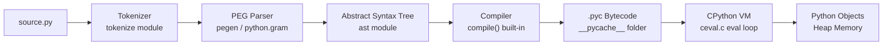
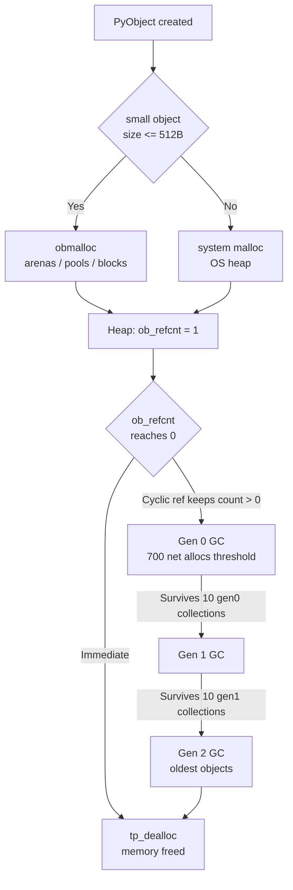

# ⚙️ Python Internals

> [!abstract] TL;DR
> CPython executes Python source by passing it through tokenizer → parser → AST → bytecode compiler, then running that bytecode on a stack-based VM under the constraint of the Global Interpreter Lock; memory is reclaimed via immediate reference counting for most objects and a generational cyclic garbage collector for circular references.

---

## Intuition

**Analogy:** Imagine Python source code is a recipe written in English prose. Before any cooking happens, a kitchen brigade works through successive transformations: a line cook reads the text word-by-word *(tokenizer)*, a sous-chef groups words into meaningful phrases *(parser)*, a lead chef draws a logical intent diagram *(AST)*, and a prep team converts the diagram into numbered instruction cards *(bytecode)*. The head chef — the CPython VM — then follows those cards one at a time, managing pantry stock *(memory)* and kitchen staff *(threads)*. Crucially, **only one chef can touch the stove at any moment** — that constraint is the GIL.

The pantry uses a smart restocking system: a daily tally (reference counting) immediately removes ingredients no longer needed, while a weekly audit (the cyclic GC) catches the case where two ingredients each list the other on their "required-by" tag — circular references the daily count can never resolve on its own.

---

## How It Works

### CPython Architecture

The reference implementation of Python is CPython, written in C. Every `.py` file passes through five stages before any code runs:

1. **Tokenize** — The `tokenize` module converts raw text into a stream of typed tokens: keywords, identifiers, operators, and literals. This is where `SyntaxError: invalid syntax` on a bad character appears.
2. **Parse** — A PEG (Parsing Expression Grammar) parser converts the token stream into a parse tree. Since Python 3.9, CPython uses its own PEG parser (`pegen`), replacing the older LL(1) grammar. The `Grammar/python.gram` file in the CPython source defines the language.
3. **Build AST** — The parse tree is transformed into an Abstract Syntax Tree. The `ast` module exposes this tree: `ast.parse("x = 1 + 2")` returns an `ast.Module` you can walk with `ast.NodeVisitor` or transform with `ast.NodeTransformer`. Linters, formatters, and type checkers all operate at this layer.
4. **Compile** — The `compile()` built-in converts the AST into a **code object** (`types.CodeType`). The result is cached as a `.pyc` file inside `__pycache__/` using Python's `marshal` format along with a magic version number and a source hash or timestamp for invalidation.
5. **Evaluate** — The CPython VM (`Python/ceval.c`) interprets bytecode in a loop called the **eval loop**. It maintains a value stack; every instruction pops operands and pushes results.

**Python 3.11 Specializing Adaptive Interpreter:** When the eval loop sees the same opcode on the same types repeatedly, it substitutes a faster *specialised* variant inline (e.g., `LOAD_ATTR_MODULE` instead of generic `LOAD_ATTR`). Inline caches store the specialisation guess directly in the bytecode array. No JIT compilation is involved — pure adaptive interpretation achieves 10–60% real-world speedups over 3.10.

---

### Bytecode and the dis Module

Bytecode is a compact binary sequence of opcodes and arguments. The **code object** attached to every function, class, and module exposes its structure:

| Attribute | What it holds |
|---|---|
| `co_varnames` | Tuple of local variable names (in slot order) |
| `co_consts` | Tuple of literal constants embedded in the function |
| `co_names` | Tuple of global and attribute names |
| `co_flags` | Bitmask encoding: generator, coroutine, nested function, `*args`, `**kwargs` |
| `co_stacksize` | Maximum stack depth the function requires |
| `co_freevars` | Names captured from an enclosing scope (closures) |

Key opcodes to recognise in `dis.dis()` output:

| Opcode | Meaning |
|---|---|
| `RESUME` | Function entry point marker (3.11+) |
| `LOAD_FAST` | Push a local variable — O(1), index known at compile time |
| `LOAD_GLOBAL` | Push a global or builtin — dict lookup, slower than `LOAD_FAST` |
| `LOAD_DEREF` | Push a cell variable (closure) — slightly slower than `LOAD_FAST` |
| `STORE_FAST` | Pop top-of-stack into a local slot |
| `BINARY_OP` | Apply arithmetic/logical operator — pops two, pushes one |
| `CALL` | Call a callable (unified opcode in 3.11+) |
| `RETURN_VALUE` | Return top-of-stack to caller |
| `GET_ITER` / `FOR_ITER` | Implement the iterator protocol for `for` loops |
| `BUILD_LIST` | Construct a list from N stack items |

The **stack-based VM** means every expression is evaluated by pushing operands then consuming them with an operator instruction. There are no registers — only the value stack and local variable slots.

---

### Memory Management — Reference Counting

Every CPython object is a C struct beginning with `ob_refcnt` (the reference count) and `ob_type` (pointer to the type). The invariant: when `ob_refcnt` drops to zero, `tp_dealloc` is called **immediately** in the same stack frame — no GC pause, fully deterministic.

**Reference count events:**

| Event | Effect on `ob_refcnt` |
|---|---|
| Assigned to a variable | +1 |
| Passed as a function argument | +1 |
| Stored in a container (list, dict, set) | +1 |
| Variable reassigned or goes out of scope | -1 |
| Removed from a container | -1 |
| `del x` | -1 on the referenced object |

**Practical implications:**

- `sys.getrefcount(x)` always returns at least *n + 1* — the function call itself holds a temporary reference to the argument. Subtract 1 to get the real count.
- `id(obj)` returns the object's memory address. Two live objects cannot share an address; once freed, an address may be reused by a new object — which is the source of subtle `is` identity bugs.
- `weakref.ref(obj)` creates a reference that does **not** increment `ob_refcnt`, allowing observation without keeping an object alive. Useful for caches and callback registries.

---

### Memory Management — Cyclic Garbage Collector

Reference counting cannot handle **circular references**: if A holds a reference to B and B holds one back to A, both `ob_refcnt` values remain > 0 forever even after all external references are dropped. The `gc` module provides a generational cyclic garbage collector to handle this case.

**Generational collection:** Objects start in generation 0 (youngest). When generation 0 accumulates enough objects, a collection runs and survivors are promoted to generation 1, then eventually to generation 2 (longest-lived). Most objects die young — generational collection exploits this to minimize scan cost.

```python
import gc

gc.get_threshold()        # (700, 10, 10)
                          # gen0 collected after 700 net allocations
                          # gen1 collected after 10 gen0 collections
                          # gen2 collected after 10 gen1 collections

gc.collect(generation=0)  # force collect only gen0
gc.collect()              # force full collection across all generations

gc.disable()              # disable automatic GC — manual control
gc.enable()               # re-enable (always pair with disable)
gc.is_tracked(obj)        # True if obj is under cyclic GC surveillance
gc.get_count()            # (n0, n1, n2) — current allocation counts
```

**What the cyclic GC tracks:** Only *container* objects — `list`, `dict`, `set`, class instances, and similar. Plain integers and strings (immutable, no cross-references) are never tracked, keeping the GC scan set small.

**Finalizers and GC:** If objects in a reference cycle define `__del__`, the cyclic GC (since Python 3.4, PEP 442) calls `__del__` before breaking the cycle. Pre-3.4, such objects ended up in `gc.garbage` and leaked permanently. Even post-3.4, relying on `__del__` for deterministic resource cleanup is fragile — use context managers (`with` / `__enter__` / `__exit__`) instead.

---

### Small Object Allocator (obmalloc)

For objects 512 bytes or smaller, CPython bypasses the system `malloc` and uses its own **pymalloc** allocator (also called obmalloc), organised in three tiers:

| Tier | Size | Description |
|---|---|---|
| **Arenas** | 256 KB each | Large blocks allocated from the OS; released back to the OS when all pools inside are fully free |
| **Pools** | 4 KB each | Fixed-size regions within arenas; each pool is dedicated to a single block size class |
| **Blocks** | 8 – 512 bytes | Individual object allocations within a pool; sizes are rounded up to the next multiple of 8 bytes |

This layered design eliminates `malloc` call overhead and external fragmentation for the most common case (small, frequently allocated objects like integers, short strings, and stack frames).

**Object Interning:**

Small integers and common strings are pre-allocated singletons that Python reuses instead of creating new objects:

- **Integer interning range:** −5 to 256. `a = 100; b = 100; a is b` is `True`. Outside this range, `a = 1000; b = 1000; a is b` is typically `False` (each assignment creates a fresh object). Always use `==` for value equality; use `is` only for identity checks against `None`, `True`, `False`, or explicitly interned objects.
- **String interning:** Strings that look like Python identifiers are interned automatically during compilation. `sys.intern("my_key")` forces a string into the intern table and returns the canonical copy — useful for dictionary keys accessed millions of times in tight loops, since interned key comparison reduces to a pointer comparison before hash comparison.

---

### The __slots__ Mechanism

By default every Python instance stores its attributes in a per-instance `__dict__` — a dynamic hash table. For classes that are instantiated in millions, this dict dominates memory use (an empty dict in CPython 3.11 is 232 bytes).

`__slots__ = ("x", "y", "z")` instructs CPython to allocate a fixed C-struct layout with one typed slot per name, eliminating the per-instance dict entirely:

**Benefits:**
- **Memory savings:** Typically 40–60% fewer bytes per instance — the slot descriptor is shared across all instances in the class's C struct, not copied per object.
- **Attribute access speed:** Slot descriptors use direct offset arithmetic; `__dict__` lookup requires a hash computation.
- **Interface enforcement:** Attempting to set an undeclared attribute raises `AttributeError` at runtime, catching typos early.

**Caveats and limitations:**
- Instances cannot have ad-hoc attributes: `obj.new_attr = 1` raises `AttributeError` unless `new_attr` is in `__slots__`.
- Subclasses that do not define `__slots__` get a `__dict__` anyway, negating savings unless every class in the hierarchy uses `__slots__`.
- To support `weakref`, include `"__weakref__"` in the slots tuple explicitly.
- Pickling works but requires explicit `__getstate__` / `__setstate__` for non-trivial inheritance.

---

### Profiling Tools Overview

| Tool | Mechanism | Overhead | Best For |
|---|---|---|---|
| `cProfile` | C-level function hooks | Low | First pass: identify slow functions |
| `line_profiler` | Line-level tracing hooks | High | Deep dive: find slow lines within a function |
| `memory_profiler` | Line-level memory snapshots | Very high | Identify lines where memory grows |
| `tracemalloc` | Allocation-site tracking in C | Medium | Trace where allocations originate |
| `sys.getrefcount` | Single object refcount | None | Debug a specific suspected leak |
| `py-spy` | Sampling (OS-level, no code changes) | Near-zero | Production profiling without instrumentation |

Install extras: `pip install line_profiler memory_profiler py-spy`

---

### Python 3.11–3.13 Improvements

| Release | Key Internal Change |
|---|---|
| **3.11** | Specializing adaptive interpreter (inline caches per opcode); zero-cost exceptions (`try` has no overhead unless an exception is raised); `ExceptionGroup` and `except*`; `tomllib` stdlib; `Self` type in `typing` |
| **3.12** | Per-subinterpreter GIL (subinterpreters can run in parallel processes sharing the same `Py_Initialize` call); improved f-string parsing (nested quotes, multiline); `@override` decorator; `type X = ...` soft type alias syntax |
| **3.13** | Experimental JIT compiler (copy-and-patch technique — fills template opcodes at runtime); experimental free-threaded mode (`PYTHON_GIL=0` or `python -X gil=0`; PEP 703); improved interactive REPL |

The **no-GIL mode** (targeting stable in Python 3.14) replaces per-object reference counting with thread-safe biased reference counting — each object has a local refcount owned by one thread (cheap to update) plus a shared refcount (updated atomically only on thread handoff).

---

### Flow / Architecture

**CPython Execution Pipeline:**



**Memory Management Architecture:**



---

## Code Demo

### 1. Reading Bytecode with dis.dis()

```python
import dis

def add_squares(a, b):
    x = a * a
    y = b * b
    return x + y

dis.dis(add_squares)
# CPython 3.12 output (abbreviated):
# RESUME           0
# LOAD_FAST        0 (a)       <- slot 0, no dict lookup
# LOAD_FAST        0 (a)
# BINARY_OP        5 (**)      <- pops 2, pushes result
# STORE_FAST       2 (x)       <- pops into slot 2
# LOAD_FAST        1 (b)
# LOAD_FAST        1 (b)
# BINARY_OP        5 (**)
# STORE_FAST       3 (y)
# LOAD_FAST        2 (x)
# LOAD_FAST        3 (y)
# BINARY_OP        0 (+)
# RETURN_VALUE                 <- pops TOS and returns

# Inspect the code object directly
code = add_squares.__code__
print("Local vars:  ", code.co_varnames)   # ('a', 'b', 'x', 'y')
print("Constants:   ", code.co_consts)     # (None,)
print("Stack depth: ", code.co_stacksize)  # 3
print("Flags bitmask:", code.co_flags)     # encodes: generator? coroutine? nested?
```

### 2. Tracking Allocations with tracemalloc

```python
import tracemalloc

tracemalloc.start()
snapshot1 = tracemalloc.take_snapshot()

# Perform allocations we want to measure
data = [{"id": i, "value": i * 2.5} for i in range(100_000)]

snapshot2 = tracemalloc.take_snapshot()

top_stats = snapshot2.compare_to(snapshot1, "lineno")
print("Top 3 allocations since baseline:")
for stat in top_stats[:3]:
    print(f"  {stat}")
# Example output:
#   <string>:4: size=23.5 MiB (+23.5 MiB), count=300001 (+300001)
#   ...

# Can also filter by filename
filtered = [s for s in top_stats if "mymodule" in str(s.traceback)]

tracemalloc.stop()
```

### 3. CPU Profiling with cProfile and pstats

```python
import cProfile
import pstats
import io

def naive_matrix_multiply(n):
    A = [[float(i + j) for j in range(n)] for i in range(n)]
    B = [[float(i * j) for j in range(n)] for i in range(n)]
    C = [[0.0] * n for _ in range(n)]
    for i in range(n):
        for j in range(n):
            for k in range(n):
                C[i][j] += A[i][k] * B[k][j]
    return C

# Profile into an in-memory stream so output can be parsed or displayed
profiler = cProfile.Profile()
profiler.enable()
naive_matrix_multiply(40)
profiler.disable()

stream = io.StringIO()
stats = pstats.Stats(profiler, stream=stream)
stats.sort_stats("cumulative")   # order by total time including sub-calls
stats.print_stats(8)             # show top 8 functions
print(stream.getvalue())
# Typical output columns: ncalls | tottime | percall | cumtime | percall | filename:lineno(function)
```

### 4. __slots__ Memory Benchmark (1 Million Instances)

```python
import sys
import tracemalloc

class WithDict:
    def __init__(self, x, y, z):
        self.x = x
        self.y = y
        self.z = z

class WithSlots:
    __slots__ = ("x", "y", "z")

    def __init__(self, x, y, z):
        self.x = x
        self.y = y
        self.z = z

# Per-instance shallow size comparison
d = WithDict(1, 2, 3)
s = WithSlots(1, 2, 3)
dict_bytes  = sys.getsizeof(d) + sys.getsizeof(d.__dict__)
slots_bytes = sys.getsizeof(s)   # no __dict__ to add
print(f"WithDict  (obj + __dict__): {dict_bytes} bytes")
print(f"WithSlots (no __dict__):    {slots_bytes} bytes")
print(f"Saving: {(dict_bytes - slots_bytes) / dict_bytes:.0%} per instance")

# Scale to 1 million instances
N = 1_000_000
tracemalloc.start()

snap_before = tracemalloc.take_snapshot()
instances_d = [WithDict(i, i + 1, i + 2) for i in range(N)]
snap_after_d = tracemalloc.take_snapshot()
diff_d = sum(st.size_diff for st in snap_after_d.compare_to(snap_before, "lineno"))
print(f"\n1M WithDict   instances: {diff_d / 1024 / 1024:.1f} MB")
del instances_d

snap_before2 = tracemalloc.take_snapshot()
instances_s = [WithSlots(i, i + 1, i + 2) for i in range(N)]
snap_after_s = tracemalloc.take_snapshot()
diff_s = sum(st.size_diff for st in snap_after_s.compare_to(snap_before2, "lineno"))
print(f"1M WithSlots  instances: {diff_s / 1024 / 1024:.1f} MB")
del instances_s

tracemalloc.stop()
# Typical result: WithDict ~160 MB, WithSlots ~72 MB  (~55% saving)
```

---

## Performance Optimization Patterns

These patterns derive directly from CPython internals knowledge:

| Pattern | Internal Reason | Example |
|---|---|---|
| Alias globals as locals before tight loops | `LOAD_FAST` (slot index) beats `LOAD_GLOBAL` (dict lookup per call) | `_len = len` before the loop |
| List comprehension over explicit `append` | Single bytecode burst; CPython's `BUILD_LIST` + `LIST_APPEND` loop is optimised | `[x*x for x in data]` |
| `str.join()` over `+` concatenation | `+` creates O(n) intermediate `str` objects; `join` allocates once | `", ".join(parts)` |
| `array.array` for homogeneous numerics | No per-element `PyObject` boxing; contiguous C array in memory | `array.array("d", floats)` |
| `bytearray` over `bytes` for in-place mutation | `bytes` is immutable — every "mutation" copies; `bytearray` mutates in place | `buf = bytearray(raw_data)` |
| `__slots__` on high-volume instance classes | Eliminates per-instance `__dict__` (232+ bytes per object) | Graph nodes, event records |
| Release GIL in C extensions | Allows true CPU parallelism across OS threads | NumPy, PyTorch C kernels calling `Py_BEGIN_ALLOW_THREADS` |

---

## Real-World Example

> **NumPy and the GIL:** When NumPy executes a vectorised operation like `np.dot(a, b)`, it enters C code and calls `Py_BEGIN_ALLOW_THREADS`, explicitly releasing the GIL. While a BLAS routine computes the result (potentially using SIMD or multiple OS threads internally), Python threads can run Python bytecode in parallel. This is why `ThreadPoolExecutor` accelerates NumPy-heavy workloads but fails for pure Python loops — the GIL is only released when computation leaves the bytecode eval loop.
>
> **asyncio and the GIL:** `asyncio` sidesteps GIL contention by running a single thread with cooperative multitasking. All coroutines share one thread and yield at `await` points. The event loop uses OS-level non-blocking I/O (`epoll`, `kqueue`, IOCP) to multiplex thousands of connections without spawning threads. The result: no GIL contention, no context-switch overhead — just one thread efficiently interleaving I/O waits.
>
> **Instagram GC disabling:** Instagram's Python service disabled the cyclic GC entirely on their copy-on-write forked worker processes. The `gc` module's bookkeeping caused copy-on-write page faults in forked processes, inflating memory usage. With `gc.disable()` called before the fork and careful avoidance of circular references in long-lived objects, they reclaimed tens of gigabytes of shared memory across the fleet.

---

## Trade-offs

### Python Implementation Options

| Aspect | CPython | PyPy | Cython |
|---|---|---|---|
| Python compatibility | Full spec, all C extensions | Mostly compatible; some C-API gaps | Requires explicit type annotations |
| Speed (pure Python loops) | Baseline | 4–10x faster (tracing JIT) | Near-C speed for annotated code |
| C extension support | Native (C API, cffi, ctypes) | Slower via cpyext compatibility layer | Fully native — compiles to C |
| GIL | Present | Present (STM branch experimental) | Present; can release manually |
| Best use case | General-purpose, ecosystem compatibility | Long-running numeric loops, no C deps | CPU-bound Python needing near-C speed |

### Profiling Tool Selection

| Tool | Overhead | Granularity | When to Choose |
|---|---|---|---|
| `cProfile` | Low (C hooks) | Function-level | First pass: find which functions consume time |
| `line_profiler` | High | Line-level | Second pass: pinpoint slow lines in a known function |
| `memory_profiler` | Very high | Line-level memory delta | Finding which line causes memory growth |
| `tracemalloc` | Medium | Allocation site with traceback | Tracking where allocations originate in large codebases |
| `sys.getrefcount` | None | Single object | Debugging a suspected reference leak on one object |
| `py-spy` | Near-zero (sampling) | Function-level stack | Production systems where instrumentation is not feasible |

---

## When to Use vs Avoid

**Apply `__slots__` when:**
- A class is instantiated millions of times (graph nodes, ML data records, protocol message objects)
- You want to enforce a fixed attribute interface and catch typos at runtime
- Memory profiling confirms instance `__dict__` overhead is a significant fraction of total memory

**Avoid `__slots__` when:**
- Objects require dynamic attributes set via `setattr(obj, computed_name, val)` at runtime
- The class hierarchy is deep and not all base classes define `__slots__` (a single class without slots reintroduces `__dict__`)
- Prototyping — the rigidity slows iteration

**Use `multiprocessing` (not `threading`) for CPU-bound work:**
- Each worker process has its own Python interpreter and its own GIL, enabling true parallelism
- Use `threading` only for I/O-bound work or when calling C extensions that release the GIL

**Disable the cyclic GC strategically when:**
- Benchmarking shows GC pauses are measurable and your code avoids circular references
- Inside a `fork`-based server to prevent copy-on-write page faults from GC bookkeeping
- Always pair with `gc.enable()` in a `finally` block to prevent indefinite garbage accumulation

---

## Common Pitfalls

- **`is` instead of `==` for integers** — `a = 1000; b = 1000; a is b` evaluates to `False` because integers outside [−5, 256] are not interned singletons. `is` checks identity (memory address); `==` checks value. Reserve `is` for `None`, `True`, `False`, and explicitly interned objects.
- **Relying on `__del__` for deterministic cleanup with cyclic references** — If two objects in a cycle both define `__del__`, the order of finalizer calls is undefined and the objects may not be collected promptly. Use context managers (`with`) for deterministic resource release (file handles, network sockets, locks).
- **`sys.getrefcount` always returns n + 1** — The function argument itself holds a temporary reference. The true external count is `sys.getrefcount(x) - 1`. Forgetting this leads to false conclusions about reference leaks.
- **Forgetting `gc.enable()` after `gc.disable()`** — `gc.disable()` in a hot path without a matching `gc.enable()` in `finally` causes circular garbage to accumulate unboundedly. Wrap with `try/finally` or a context manager.
- **Assuming `LOAD_FAST` applies to closure variables** — A variable captured from an enclosing scope uses `LOAD_DEREF` (cell object indirection), not `LOAD_FAST`. Closures in tight inner loops are a subtle bottleneck; extracting the captured value into a local variable inside the inner function resolves it.
- **Trusting `sys.getsizeof` for total memory cost** — `sys.getsizeof` returns the *shallow* size of the object, excluding the memory of referenced objects. A list of 1000 strings reports only the list's internal pointer array size, not the strings themselves. Use `tracemalloc` or recursive inspection for true totals.

---

## Related Concepts

- [[Python_for_ML]] — the GIL, vectorisation, and when Python interpreter overhead matters in ML pipelines; this note extends that foundation to the implementation level
- [[NumPy_Fundamentals]] — NumPy's C layer calls `Py_BEGIN_ALLOW_THREADS` to release the GIL and manages its own contiguous array buffers entirely outside Python's object heap, which is why it escapes both GIL and obmalloc limitations
- [[PyTorch_Fundamentals]] — PyTorch tensors are C++ objects whose data lives off Python's heap; `requires_grad`, autograd graph construction, and `torch.no_grad()` all interact with Python's reference counting in subtle ways when tensors are stored in Python containers
- [[GPU_Architecture_Basics]] — once computation is dispatched to a GPU kernel the GIL is irrelevant; understanding the eval loop boundary explains exactly where Python's bytecode ends and CUDA begins
- [[Data_Parallelism]] — `multiprocessing` avoids the GIL entirely by spawning separate Python processes (independent interpreters, independent GILs), in contrast to `threading` which shares one GIL across all threads in a process
- [[CUDA_Fundamentals]] — writing custom CUDA extensions that call `Py_BEGIN_ALLOW_THREADS` / `Py_END_ALLOW_THREADS` is the canonical mechanism for achieving true CPU+GPU parallelism from Python code
- [[Mixed_Precision_Training]] — `torch.cuda.amp.autocast` and `GradScaler` use Python's context manager protocol (`__enter__` / `__exit__`), illustrating how high-level training tooling is built on top of Python's object model

---

## Review Questions

1. **Conceptual — Reference Counting vs Cyclic GC:** Explain the specific condition under which reference counting alone cannot free an object, even when no external code can reach it. Walk through how CPython's cyclic garbage collector detects and frees such objects — what is the algorithm it uses on generation 0?

2. **Scenario — Integer Interning:** A colleague writes a unit test: `assert fetch_user_id() is 42`. The test passes locally but fails intermittently in staging. What is the root cause, what Python internal mechanism is responsible, and how would you fix both the test and any similar patterns elsewhere in the codebase?

3. **Trade-off — `__slots__` Decision:** You are designing an in-memory event record class that will be instantiated 5 million times per second in a streaming processor. Your team lead suggests `__slots__`. Describe two concrete benefits and two situations where adding `__slots__` to this class hierarchy would either backfire or require substantial additional boilerplate to work correctly.

4. **Bytecode Reading:** Given the following `dis.dis()` output for a single-expression function, reconstruct the Python source and explain what each opcode in the sequence does to the evaluation stack:
   ```
   LOAD_GLOBAL   0 (len)
   LOAD_FAST     0 (items)
   CALL          1
   LOAD_CONST    1 (2)
   BINARY_OP     5 (*)
   RETURN_VALUE
   ```

---

## Sources

- [CPython source: ceval.c — the eval loop](https://github.com/python/cpython/blob/main/Python/ceval.c)
- [Python dis module — Bytecode Instructions](https://docs.python.org/3/library/dis.html)
- [Python gc module — Garbage Collector Interface](https://docs.python.org/3/library/gc.html)
- [PEP 703 — Making the GIL Optional in CPython](https://peps.python.org/pep-0703/)
- [What's New in Python 3.11 — Faster CPython](https://docs.python.org/3/whatsnew/3.11.html#faster-cpython)
- [tracemalloc — Trace Memory Allocations](https://docs.python.org/3/library/tracemalloc.html)
- [Python Data Model — Object, Value, Type](https://docs.python.org/3/reference/datamodel.html)
- [Instagram Engineering — Dismissing Python Garbage Collection](https://engineering.instagram.com/dismissing-python-garbage-collection-at-instagram-4dca40b29172)

---

#python #cpython #internals #memory-management #bytecode #GIL
