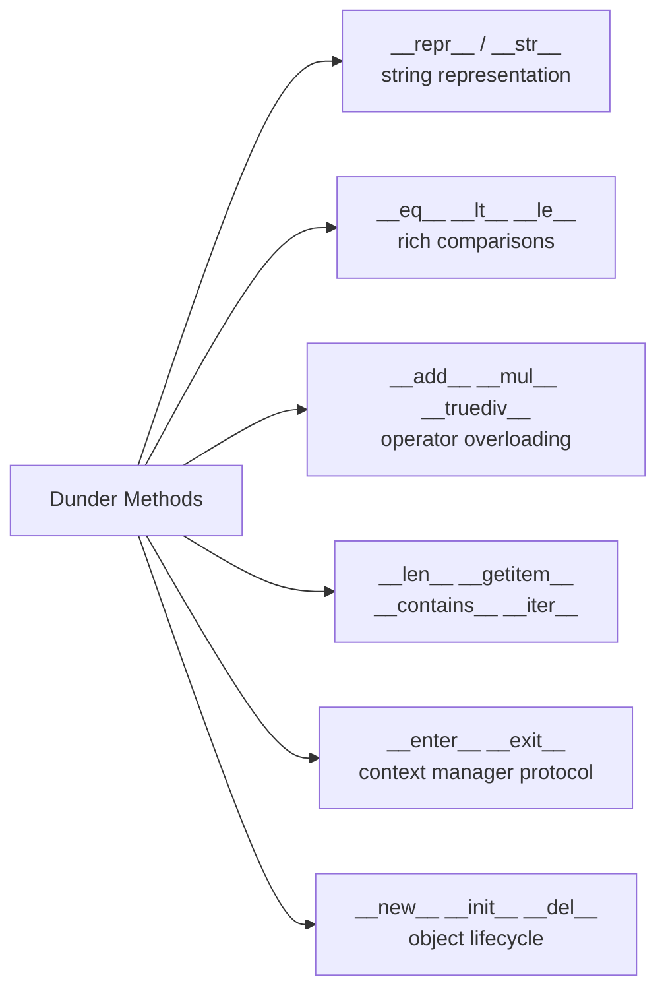

# Object-Oriented Programming in Python

> [!abstract] TL;DR
> Python OOP is prototype-based at runtime but presents a classical-style class/instance surface. Key differentiators vs Java/C++: everything is an object (including classes themselves), multiple inheritance via C3 MRO, dunder methods for operator overloading, `__slots__` for memory control, and `dataclasses` for boilerplate elimination.

---

## Class Anatomy

```python
class Animal:
    species_count = 0          # class variable, shared across all instances

    def __init__(self, name: str, sound: str) -> None:
        self.name = name       # instance variable
        self.sound = sound
        Animal.species_count += 1

    def speak(self) -> str:
        return f"{self.name} says {self.sound}"

    @classmethod
    def how_many(cls) -> int:  # receives class, not instance
        return cls.species_count

    @staticmethod
    def kingdom() -> str:      # receives nothing special
        return "Animalia"

    def __repr__(self) -> str:
        return f"Animal(name={self.name!r})"

    def __str__(self) -> str:
        return self.name
```

---

## Inheritance and MRO

Python resolves method lookup via **C3 linearization** (Method Resolution Order):

```python
class Dog(Animal):
    def __init__(self, name: str) -> None:
        super().__init__(name, "Woof")   # always use super()

    def fetch(self) -> str:
        return f"{self.name} fetches!"

class ServiceDog(Dog):
    def assist(self) -> str:
        return f"{self.name} assists"

# MRO: ServiceDog → Dog → Animal → object
print(ServiceDog.__mro__)
```

**Diamond inheritance** — C3 ensures each class appears only once:

```python
class A:
    def method(self): return "A"

class B(A):
    def method(self): return f"B -> {super().method()}"

class C(A):
    def method(self): return f"C -> {super().method()}"

class D(B, C):   # MRO: D → B → C → A → object
    pass

D().method()  # "B -> C -> A"
```

---

## Key Dunder Methods



| Dunder | Triggered by | Example |
|--------|-------------|---------|
| `__repr__` | `repr(obj)`, debugging | `return f"Point({self.x}, {self.y})"` |
| `__str__` | `str(obj)`, `print()` | `return f"({self.x}, {self.y})"` |
| `__eq__` | `==` | `return self.x == other.x` |
| `__hash__` | `hash()`, dict keys | Must define with `__eq__` |
| `__len__` | `len(obj)` | `return len(self._items)` |
| `__getitem__` | `obj[key]` | `return self._items[key]` |
| `__iter__` | `for x in obj` | `return iter(self._items)` |
| `__enter__/__exit__` | `with obj:` | Resource management |

---

## Dataclasses (Modern Python OOP)

`@dataclass` auto-generates `__init__`, `__repr__`, `__eq__` — preferred for data-holding classes:

```python
from dataclasses import dataclass, field
from typing import ClassVar

@dataclass(frozen=True, order=True)  # immutable + auto-comparison
class Point:
    x: float
    y: float
    label: str = ""
    _count: ClassVar[int] = 0        # class variable, not a field

    def distance_from_origin(self) -> float:
        return (self.x**2 + self.y**2) ** 0.5

p = Point(3.0, 4.0)
p.distance_from_origin()  # 5.0
```

---

## Abstract Base Classes

```python
from abc import ABC, abstractmethod

class Shape(ABC):
    @abstractmethod
    def area(self) -> float: ...

    @abstractmethod
    def perimeter(self) -> float: ...

    def describe(self) -> str:         # concrete method on abstract class
        return f"Area: {self.area():.2f}"

class Circle(Shape):
    def __init__(self, radius: float):
        self.radius = radius

    def area(self) -> float:
        import math
        return math.pi * self.radius ** 2

    def perimeter(self) -> float:
        import math
        return 2 * math.pi * self.radius

# Shape()  → TypeError: Can't instantiate abstract class
```

---

## `__slots__` — Memory Optimization

By default, instance `__dict__` uses ~200 bytes per object. `__slots__` replaces it with a fixed-size array:

```python
class Point:
    __slots__ = ("x", "y")   # no __dict__, no arbitrary attributes

    def __init__(self, x, y):
        self.x = x
        self.y = y

# 40–60% less memory for millions of instances
# trade-off: can't add new attributes dynamically
```

---

## Properties vs Direct Attributes

```python
class Temperature:
    def __init__(self, celsius: float) -> None:
        self._celsius = celsius   # _ convention: "internal"

    @property
    def celsius(self) -> float:
        return self._celsius

    @celsius.setter
    def celsius(self, value: float) -> None:
        if value < -273.15:
            raise ValueError("Below absolute zero")
        self._celsius = value

    @property
    def fahrenheit(self) -> float:
        return self._celsius * 9/5 + 32

t = Temperature(25)
t.celsius = -300   # raises ValueError
```

---

## Common Pitfalls

1. **Mutable default in `__init__`** — `def __init__(self, items=[])` shares the list across all instances. Use `items=None` and `self.items = items or []`.
2. **Forgetting `super().__init__()`** in multiple inheritance — breaks MRO and parent initialization.
3. **Defining `__eq__` without `__hash__`** — Python sets `__hash__ = None`, making instances unhashable (can't use in sets/dicts).
4. **Class variable vs instance variable** — assigning `self.x = val` shadows a class variable `x` with an instance variable; they're distinct slots.
5. **`__repr__` vs `__str__`** — if only `__repr__` is defined, `str()` falls back to it. Define `__repr__` first; add `__str__` only for a user-friendly alternative.

---

## Related Concepts

- [[Python_Data_Model]] — Full dunder protocol reference
- [[Decorators_and_Metaprogramming]] — Metaclasses, class decorators
- [[Python_Internals]] — How CPython implements classes
- [[Type_Hints_and_Static_Analysis]] — Typing with class hierarchies
- [[Context_Managers]] — `__enter__`/`__exit__` protocol

---

## Review Questions

1. **What is C3 linearization and why does Python use it instead of simple depth-first MRO?**
   *Answer: C3 ensures consistent ordering in diamond inheritance — each base class appears once, in the order expected by all subclasses. Simple depth-first violates the Liskov substitution principle in diamond cases.*

2. **A class defines `__eq__`. What happens to its hashability and why?**
   *Answer: Python sets `__hash__ = None` automatically, making instances unhashable. Two equal objects must have the same hash; since you've redefined equality, the default identity-based hash is no longer valid. You must explicitly define `__hash__` (or use `@dataclass(frozen=True, eq=True)`).*

3. **When would you choose `__slots__` and what's the trade-off?**
   *Answer: Use `__slots__` when creating millions of small objects to reduce memory (no `__dict__` overhead). Trade-off: can't add arbitrary attributes dynamically, and inheritance with `__slots__` requires careful setup in every subclass.*

#Python #OOP #Classes #Inheritance #Dataclasses
