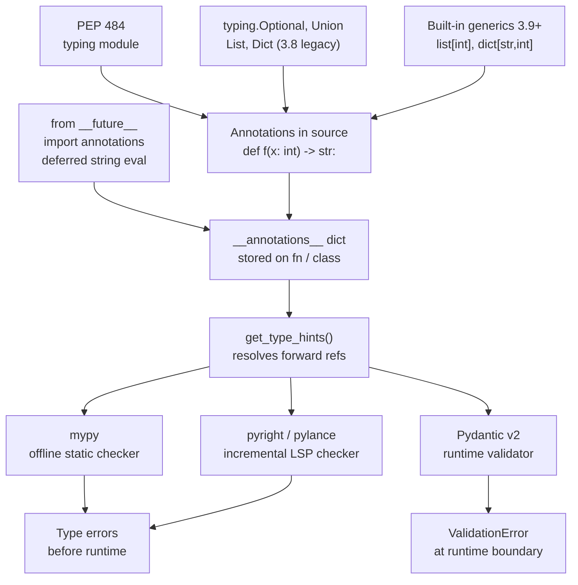

# Python Type Hints and Static Analysis

> [!abstract] TL;DR
> Python's type annotation system (PEP 484+) lets you declare what types functions expect and return — without changing runtime behavior — so that static checkers (mypy, pyright) catch bugs before execution and runtime validators (Pydantic v2) enforce schemas at the boundary of your system.

---

## Intuition

**Analogy:** Think of type hints as the blueprint annotations an architect adds to construction drawings — dimensions, load ratings, material specs. The building can still be constructed without them, but contractors can now catch structural errors before the concrete is poured, not after the building collapses.

In Python, annotations are stored as strings in `__annotations__` dicts at import time. They don't change what the code does. What changes is what tools can do *about* the code: a static checker reads the blueprint and flags mismatches; a runtime validator like Pydantic reads it to enforce contract boundaries against untrusted data.

---

## How It Works

### Core Mechanics

1. You write annotations: `def greet(name: str) -> str`.
2. Python stores them in `function.__annotations__` as a dict.
3. `typing.get_type_hints(obj)` resolves forward-referenced strings into actual types.
4. **Static checkers** (mypy, pyright) read annotations at check-time — no code runs.
5. **Runtime validators** (Pydantic v2) call `get_type_hints()` to build validators that execute when data enters your system.

### Flow / Architecture



---

## Concept Reference

### 1. Basic Annotations

```python
from __future__ import annotations  # all annotations become strings (deferred eval)
from typing import NoReturn

# Variable annotation
x: int = 5
name: str  # declaration only, no assignment

# Function annotation
def add(a: int, b: int) -> int:
    return a + b

# None return
def log(msg: str) -> None:
    print(msg)

# NoReturn: function never returns (raises or exits)
def crash(msg: str) -> NoReturn:
    raise RuntimeError(msg)

# Any: escape hatch — disables checking for that expression
from typing import Any
def legacy_parse(data: Any) -> dict[str, Any]:
    return dict(data)

# object vs Any:
#   object  — valid supertype but you cannot call methods on it (checker enforces this)
#   Any     — checker treats it as compatible with EVERYTHING (silences all errors)
```

> `from __future__ import annotations` makes every annotation a string at import time, which enables forward references and lets you use `list[int]` syntax on Python 3.8 without the `from __future__` import being strictly needed — but it also means annotations are never evaluated at runtime unless you call `get_type_hints()` explicitly.

---

### 2. `typing` Module Essentials

```python
from typing import Optional, Union, Callable
from collections.abc import Sequence

# Optional[X] == X | None  (prefer X | None in Python 3.10+)
def find(key: str, data: dict[str, int]) -> int | None:
    return data.get(key)

# Union (3.9- style)
def process(val: Union[int, str]) -> str:
    return str(val)

# Built-in generics (3.9+) — prefer these over typing.List, typing.Dict
scores: list[float] = [9.5, 8.2]
lookup: dict[str, int] = {"a": 1}

# tuple: fixed-length vs variable-length
point: tuple[int, int] = (3, 4)          # exactly two ints
coords: tuple[float, ...] = (1.0, 2.0, 3.0)  # any length of floats

# set and frozenset
tags: set[str] = {"python", "typing"}

# Callable[[arg_types], return_type]
Predicate = Callable[[int, str], bool]

def apply(fn: Predicate, n: int, s: str) -> bool:
    return fn(n, s)
```

---

### 3. TypeVar and Generics

```python
from typing import TypeVar, Generic
from collections.abc import Iterator

T = TypeVar("T")
S = TypeVar("S", bound="Comparable")  # bounded TypeVar

# Generic function: T is inferred from the argument
def first(items: list[T]) -> T:
    return items[0]

reveal_type(first([1, 2, 3]))   # mypy reveals: int
reveal_type(first(["a", "b"]))  # mypy reveals: str

# Generic class
class Stack(Generic[T]):
    def __init__(self) -> None:
        self._items: list[T] = []

    def push(self, item: T) -> None:
        self._items.append(item)

    def pop(self) -> T:
        if not self._items:
            raise IndexError("pop from empty stack")
        return self._items.pop()

    def __len__(self) -> int:
        return len(self._items)

    def __iter__(self) -> Iterator[T]:
        return iter(reversed(self._items))

# ParamSpec: preserve parameter types through a decorator
from typing import ParamSpec, Callable as C
import functools, time

P = ParamSpec("P")
R = TypeVar("R")

def timed(fn: C[P, R]) -> C[P, R]:
    @functools.wraps(fn)
    def wrapper(*args: P.args, **kwargs: P.kwargs) -> R:
        t0 = time.perf_counter()
        result = fn(*args, **kwargs)
        print(f"{fn.__name__}: {time.perf_counter() - t0:.4f}s")
        return result
    return wrapper  # type: ignore[return-value]

# TypeAlias (3.10+, also available via typing_extensions)
from typing import TypeAlias
Vector: TypeAlias = list[float]
```

---

### 4. Structural Subtyping with Protocol

Protocol is Python's mechanism for **duck typing with static checking** — a class satisfies a Protocol if it has the right methods/attributes, regardless of inheritance.

```python
from typing import Protocol, runtime_checkable

@runtime_checkable  # enables isinstance() checks at runtime
class Drawable(Protocol):
    def draw(self) -> None: ...
    def resize(self, factor: float) -> None: ...

class Circle:
    def draw(self) -> None:
        print("O")
    def resize(self, factor: float) -> None:
        self.radius *= factor  # type: ignore[attr-defined]

class Square:
    def draw(self) -> None:
        print("[]")
    def resize(self, factor: float) -> None:
        self.side *= factor   # type: ignore[attr-defined]

def render(shape: Drawable) -> None:
    shape.draw()

# Both Circle and Square satisfy Drawable without inheriting it
render(Circle())   # ok
render(Square())   # ok
isinstance(Circle(), Drawable)  # True (because @runtime_checkable)

# Protocol inheritance
class Serializable(Protocol):
    def to_dict(self) -> dict[str, object]: ...

class SerializableDrawable(Drawable, Serializable, Protocol):
    pass  # combines both protocols
```

**Structural (Protocol) vs Nominal (ABC):**
- `Protocol`: "has these methods" — no explicit declaration required from implementors
- `ABC`: "explicitly inherits from this base" — implementors must opt in

---

### 5. Literal, Final, ClassVar, TypedDict

```python
from typing import Literal, Final, ClassVar, TypedDict, Required, NotRequired

# Literal: constrain to specific values
HTTPMethod = Literal["GET", "POST", "PUT", "DELETE"]

def request(method: HTTPMethod, url: str) -> None: ...

request("GET", "https://example.com")   # ok
# request("PATCH", "...")               # mypy error

# Final: constant — cannot be reassigned
MAX_RETRIES: Final[int] = 3
API_VERSION: Final = "v2"  # type inferred

# ClassVar: class-level attribute, excluded from __init__ in dataclasses
from dataclasses import dataclass

@dataclass
class Model:
    name: str
    instance_count: ClassVar[int] = 0  # shared across instances, not a field

# TypedDict: typed dictionary — structural, no overhead
class DBConfig(TypedDict):
    host: str
    port: int
    database: str

class AppConfig(TypedDict, total=False):  # all keys optional
    debug: bool
    log_level: str

# Mix required and optional keys (Python 3.11+)
class ServerConfig(TypedDict):
    host: str                           # required
    port: int                           # required
    timeout: NotRequired[float]         # optional
    ssl: NotRequired[bool]              # optional

cfg: ServerConfig = {"host": "localhost", "port": 8080}  # ok
```

---

### 6. Dataclasses

`dataclasses` generate `__init__`, `__repr__`, `__eq__` (and optionally `__hash__`, `__lt__` etc.) from annotated class body fields.

```python
from dataclasses import dataclass, field, InitVar, KW_ONLY
from typing import ClassVar

@dataclass(frozen=True, slots=True, order=True, kw_only=True)
class Point:
    x: float
    y: float
    label: str = field(default="", repr=True, compare=False)
    _cache: ClassVar[dict[tuple[float, float], "Point"]] = {}

    def distance(self) -> float:
        return (self.x ** 2 + self.y ** 2) ** 0.5

@dataclass
class Dataset:
    name: str
    rows: list[dict[str, object]] = field(default_factory=list)
    # InitVar: passed to __post_init__ but not stored as a field
    validate: InitVar[bool] = True

    def __post_init__(self, validate: bool) -> None:
        if validate and not self.name:
            raise ValueError("Dataset must have a name")

# Utility functions
import dataclasses
p = Point(x=3.0, y=4.0)
print(dataclasses.asdict(p))           # {"x": 3.0, "y": 4.0, "label": ""}
p2 = dataclasses.replace(p, y=0.0)    # new frozen instance

# slots=True (3.10+): replaces __dict__ with __slots__ — faster attribute access, lower memory
# frozen=True: makes instances hashable (usable as dict keys)
# order=True: generates __lt__, __le__, __gt__, __ge__ based on field order
# kw_only=True: all fields become keyword-only in __init__
```

**`dataclasses` + inheritance gotcha:** if a parent has fields with defaults, all child fields must also have defaults. Use `field(default=...)` or `kw_only=True` to avoid this.

---

### 7. Pydantic v2 (BaseModel)

Pydantic v2 is the dominant runtime validation library in the Python ML/API ecosystem. It uses the same type annotation syntax as static checkers but **validates and coerces data at runtime**.

```python
from __future__ import annotations
from typing import Annotated, Literal, Union
from pydantic import (
    BaseModel, Field, field_validator, model_validator, ConfigDict
)

# --- Discriminated union for polymorphic content ---
class TextContent(BaseModel):
    type: Literal["text"]
    text: str

class ImageContent(BaseModel):
    type: Literal["image"]
    url: str
    width: Annotated[int, Field(ge=1, le=4096)]
    height: Annotated[int, Field(ge=1, le=4096)]

Content = Annotated[
    Union[TextContent, ImageContent],
    Field(discriminator="type"),  # Pydantic picks model by 'type' field value
]

# --- Main request model ---
class APIRequest(BaseModel):
    model_config = ConfigDict(
        strict=True,           # disallow coercion (str "1" won't become int 1)
        populate_by_name=True, # accept both alias and field name
    )

    model: str = Field(alias="model_id")
    temperature: Annotated[float, Field(ge=0.0, le=2.0)] = 1.0
    max_tokens: Annotated[int, Field(ge=1, le=8192)] = 512
    content: Content

    @field_validator("model")
    @classmethod
    def validate_model(cls, v: str) -> str:
        allowed = {"gpt-4o", "gpt-4o-mini", "claude-3-5-sonnet-20241022"}
        if v not in allowed:
            raise ValueError(f"model must be one of {allowed!r}")
        return v

    @model_validator(mode="after")
    def check_tokens_for_model(self) -> APIRequest:
        """Model validators run AFTER all field validators."""
        if "mini" in self.model and self.max_tokens > 4096:
            raise ValueError("mini models support at most 4096 max_tokens")
        return self

# --- Usage ---
raw = {
    "model_id": "gpt-4o",
    "temperature": 0.7,
    "max_tokens": 1024,
    "content": {"type": "text", "text": "Explain backpropagation."},
}
req = APIRequest.model_validate(raw)   # replaces v1's parse_obj()
print(req.model_dump())                # replaces v1's .dict()
print(req.model_dump_json())           # replaces v1's .json()
```

**Pydantic v1 vs v2 API differences (common pitfall):**
| v1 | v2 |
|----|-----|
| `.dict()` | `.model_dump()` |
| `.json()` | `.model_dump_json()` |
| `.parse_obj(data)` | `.model_validate(data)` |
| `@validator` | `@field_validator` |
| `class Config:` | `model_config = ConfigDict(...)` |

---

### 8. Mypy Configuration

```ini
# mypy.ini (or [tool.mypy] section in pyproject.toml)
[mypy]
python_version = 3.11
strict = true                     # enables all strict flags below:
#   disallow_untyped_defs         # all functions must be annotated
#   disallow_any_generics         # ban bare List, Dict without subscript
#   warn_return_any               # flag functions returning Any
#   no_implicit_reexport          # don't re-export imported names
#   strict_equality               # tighter == checks

ignore_missing_imports = true     # skip errors for untyped third-party libs
warn_unused_ignores = true        # flag stale # type: ignore comments

# Per-module overrides (loosen rules for legacy code)
[mypy-legacy_module.*]
ignore_errors = true

[mypy-numpy.*]
ignore_missing_imports = true
```

**Inline escape hatches:**

```python
x = some_untyped_function()    # type: ignore[no-untyped-call]
y: int = external_value        # type: ignore[assignment]

# reveal_type: mypy prints the inferred type (removed before runtime)
reveal_type(x)                 # Revealed type is "Any"
```

**mypy vs pyright:**

| Aspect | mypy | pyright |
|--------|------|---------|
| Speed | Slower (Python daemon) | Much faster (incremental, TypeScript-based) |
| Strictness | Requires explicit `--strict` | Strict by default in many checks |
| IDE integration | Requires plugin | Native via Pylance in VS Code |
| Inference quality | Conservative, stable | Aggressive, occasionally more noise |
| CI use | Standard in many projects | Growing adoption, faster CI runs |

---

### 9. Advanced Patterns

```python
from __future__ import annotations
from typing import Annotated, overload, cast, TYPE_CHECKING
from typing import Self, Never

# --- Annotated: attach metadata to a type without changing its semantics ---
from pydantic import Field
PositiveInt = Annotated[int, Field(gt=0)]
BoundedStr = Annotated[str, Field(min_length=1, max_length=255)]

# --- @overload: multiple signatures for one function ---
@overload
def process(data: str) -> str: ...
@overload
def process(data: list[str]) -> list[str]: ...

def process(data: str | list[str]) -> str | list[str]:
    """Uppercase a string or each element of a list."""
    if isinstance(data, list):
        return [s.upper() for s in data]
    return data.upper()

result_str: str = process("hello")         # mypy: str
result_list: list[str] = process(["hi"])   # mypy: list[str]

# --- cast(): assert a type to the checker (UNSAFE — no runtime check) ---
raw_value = get_json_field("count")
count = cast(int, raw_value)  # tells mypy it's int; you are responsible for truth

# --- TYPE_CHECKING guard: import only at check time, not runtime ---
if TYPE_CHECKING:
    from heavy_module import ExpensiveType  # not imported at runtime

def analyze(obj: "ExpensiveType") -> None:  # forward reference as string
    ...

# --- Self type (3.11+): fluent builder pattern ---
class QueryBuilder:
    def __init__(self) -> None:
        self._filters: list[str] = []

    def where(self, condition: str) -> Self:
        self._filters.append(condition)
        return self  # mypy infers subclass type, not QueryBuilder

    def build(self) -> str:
        return " AND ".join(self._filters)

# --- Never / NoReturn ---
def assert_never(value: Never) -> Never:
    """Exhaustiveness check for union branches."""
    raise AssertionError(f"Unexpected value: {value!r}")

def handle(status: Literal["ok", "error"]) -> str:
    if status == "ok":
        return "success"
    elif status == "error":
        return "failure"
    else:
        assert_never(status)  # mypy flags if a branch is not handled
```

---

## Code Demo

### Demo 1: Generic `Stack[T]` with Full Annotations

```python
from __future__ import annotations
from typing import Generic, TypeVar, Iterator

T = TypeVar("T")

class Stack(Generic[T]):
    """A LIFO stack fully typed for static checkers."""

    def __init__(self) -> None:
        self._items: list[T] = []

    def push(self, item: T) -> None:
        self._items.append(item)

    def pop(self) -> T:
        if not self._items:
            raise IndexError("pop from empty stack")
        return self._items.pop()

    def peek(self) -> T:
        if not self._items:
            raise IndexError("peek at empty stack")
        return self._items[-1]

    def __len__(self) -> int:
        return len(self._items)

    def __bool__(self) -> bool:
        return bool(self._items)

    def __iter__(self) -> Iterator[T]:
        """Iterate top-to-bottom."""
        return iter(reversed(self._items))

# mypy infers Stack[int]; push("hello") would be a type error
int_stack: Stack[int] = Stack()
int_stack.push(1)
int_stack.push(2)
print(int_stack.pop())   # 2
print(len(int_stack))    # 1
```

---

### Demo 2: Pydantic v2 `APIRequest` with Validators and Discriminated Union

(See Section 7 above for the full implementation — it is the canonical demo.)

---

### Demo 3: `@overload` for Multi-Signature Functions

```python
from __future__ import annotations
from typing import overload

@overload
def process(data: str) -> str: ...
@overload
def process(data: list[str]) -> list[str]: ...

def process(data: str | list[str]) -> str | list[str]:
    """Uppercase a string or each string in a list."""
    if isinstance(data, list):
        return [s.upper() for s in data]
    return data.upper()

# mypy correctly infers return types from the overloads
a: str = process("hello")               # str
b: list[str] = process(["hi", "bye"])   # list[str]
```

---

### Demo 4: `TypedDict` for Config Dicts

```python
from __future__ import annotations
from typing import TypedDict, NotRequired

class DBConfig(TypedDict):
    host: str
    port: int
    database: str
    username: str
    password: str

class AppConfig(TypedDict, total=False):  # all keys optional
    debug: bool
    log_level: str
    max_retries: int

class FullConfig(TypedDict):
    db: DBConfig
    app: NotRequired[AppConfig]  # optional top-level key

def connect(config: DBConfig) -> None:
    print(f"Connecting to {config['host']}:{config['port']}/{config['database']}")

cfg: FullConfig = {
    "db": {
        "host": "localhost",
        "port": 5432,
        "database": "ml_experiments",
        "username": "admin",
        "password": "secret",
    }
    # "app" key is NotRequired, so omitting it is valid
}
connect(cfg["db"])
# Output: Connecting to localhost:5432/ml_experiments
```

---

## Real-World Example

> **FastAPI + Pydantic v2:** FastAPI uses Pydantic BaseModel as its request/response schema system. When you declare `async def predict(req: PredictRequest)`, FastAPI calls `model_validate()` on the incoming JSON body, catching invalid input before your inference code ever runs, and returns a 422 Unprocessable Entity automatically on validation failure. The OpenAPI schema (shown at `/docs`) is generated directly from the Pydantic model's field annotations and `Field(...)` metadata — one source of truth for validation, documentation, and serialization. This is why Pydantic is ubiquitous in ML serving pipelines built with FastAPI.

---

## Trade-offs

### Data Container Choice

| Aspect | `dataclass` | Pydantic `BaseModel` | `TypedDict` | `attrs` |
|--------|------------|---------------------|-------------|---------|
| Runtime validation | None (annotations only) | Full coerce + validate | None | Optional (validators) |
| Serialization | `asdict()` (no JSON) | `model_dump_json()` native | Plain dict | Via `cattrs` |
| Performance | Fastest init | Slowest (validation cost) | Dict overhead only | Near-dataclass |
| Immutability | `frozen=True` | `ConfigDict(frozen=True)` | No | `frozen=True` |
| Schema / OpenAPI | No | Yes (via Pydantic) | No | No |
| Best for | Internal data structures | API boundaries, config | Config dicts, kwargs | High-performance data |

### Checker Choice

| Aspect | mypy | pyright |
|--------|------|---------|
| Speed | Slower (Python, daemon helps) | Much faster (incremental) |
| Strictness out-of-box | Lenient unless `--strict` | Strict by default |
| IDE integration | Plugin-based | Native in VS Code via Pylance |
| Inference quality | Conservative, very stable | Aggressive, catches more issues |
| CI/CD fit | Mature, widely adopted | Growing, faster pipelines |

---

## When to Use vs Avoid

**Use type hints + mypy/pyright when:**
- Your codebase has more than one contributor or will last longer than a sprint
- You write library or framework code where callers cannot inspect internals
- You want IDE autocomplete and jump-to-definition to work reliably
- You are building ML pipelines where tensor shapes or config types are a source of bugs

**Use Pydantic BaseModel when:**
- You are validating data from untrusted sources (HTTP requests, files, environment variables)
- You need automatic JSON serialization/deserialization
- You want a single source of truth for API schema + validation + documentation

**Use `dataclass` instead of BaseModel when:**
- Data is purely internal (never from untrusted sources)
- Performance is critical and validation overhead is unacceptable
- You want no external dependencies

**Avoid or limit `Any` when:**
- You care about catching real bugs — `Any` silences the checker for the entire expression
- You are reviewing others' code — `Any` is a frequent source of hidden runtime errors

---

## Common Pitfalls

- **`Optional[str]` vs `str | None`** — These are exactly equivalent. `Optional[str]` is `Union[str, None]`. The union syntax (`str | None`) is preferred in Python 3.10+ for readability; `Optional` should only appear in 3.9 and older code. Never use `Optional[str] | None` (redundant).

- **`list[int]` not subscriptable at runtime before 3.9** — On Python 3.8, `list[int]` in a function body raises `TypeError`. Fix: add `from __future__ import annotations` at the top of every file. This defers annotation evaluation to strings, so `list[int]` is never evaluated at runtime.

- **`Any` silently disables checking** — A single `Any` in a call chain can propagate through multiple layers. `reveal_type()` is your friend for auditing. Use `# type: ignore[specific-code]` with a specific error code rather than a bare `# type: ignore` to keep suppressions surgical.

- **Pydantic v1 vs v2 API** — Pydantic v2 (released 2023) is a full rewrite. `BaseModel.dict()` became `model_dump()`; `@validator` became `@field_validator`. Old code copied from Stack Overflow often uses v1 syntax that silently fails in v2 or (worse) works but bypasses validation. Always check which version a code sample targets.

- **TypeVar scope** — `T = TypeVar("T")` must be defined at module scope (or class scope for Generic). Defining a TypeVar inside a function body creates a fresh, unrelated TypeVar on each call — the generic constraint is lost.

- **`@field_validator` class method requirement** — In Pydantic v2, field validators must be decorated with both `@field_validator("field_name")` and `@classmethod`. Forgetting `@classmethod` raises a runtime error, not a type error.

- **Protocol methods need `...` bodies** — Protocol method definitions use `...` as the body. Using `pass` also works but `...` is conventional. A non-`...` body means the method has a real implementation and the Protocol itself becomes concrete, which defeats the structural typing purpose.

---

## Related Concepts

- [[Python_for_ML]] — the broader Python runtime model (GIL, vectorization, generators); type hints in ML code are covered briefly but this note goes deep on the annotation system itself
- [[FastAPI_for_ML]] — uses Pydantic BaseModel for request/response validation and OpenAPI schema generation; the most common production use of Pydantic in the ML stack
- [[LangGraph]] — uses `TypedDict` as the canonical state type for `StateGraph`; understanding `TypedDict` makes LangGraph state schemas readable and type-safe
- [[Structured_Output]] — Pydantic models used to parse and validate structured JSON output from LLMs; `model_validate()` is the integration point
- [[NumPy_Fundamentals]] — `numpy.typing.NDArray[np.float64]` is the production-correct annotation for NumPy arrays; plain `np.ndarray` loses dtype information

---

## Review Questions

1. **Protocol vs ABC:** A colleague proposes adding `class Drawable(ABC)` with `@abstractmethod draw()`. You suggest `Protocol` instead. Explain the structural vs nominal subtyping distinction, and give a concrete scenario where Protocol is strictly better than ABC.

2. **TypeVar bounds:** You define `T = TypeVar("T", bound=int)` and `S = TypeVar("S", int, float)`. What is the difference between a bounded TypeVar and a constrained TypeVar? Write a generic function using each and explain what mypy will accept or reject for each.

3. **Pydantic validator order:** In a Pydantic v2 `BaseModel`, you have two `@field_validator("price")` decorators and one `@model_validator(mode="after")`. In what order do they execute? What does `mode="before"` vs `mode="after"` on a `@model_validator` change, and when would you use each?

4. **mypy `strict` mode:** Your team decides to enable `strict = true` in `mypy.ini` on a 20,000-line codebase. List at least four specific checks that `strict` enables, and explain how you would incrementally migrate the codebase to silence the new errors without using a blanket `# type: ignore`.

---

## Sources

- [PEP 484 — Type Hints](https://peps.python.org/pep-0484/)
- [PEP 526 — Variable Annotations](https://peps.python.org/pep-0526/)
- [PEP 544 — Protocols: Structural Subtyping](https://peps.python.org/pep-0544/)
- [PEP 585 — Type Hinting Generics in Standard Collections](https://peps.python.org/pep-0585/)
- [Python `typing` module documentation](https://docs.python.org/3/library/typing.html)
- [mypy documentation](https://mypy.readthedocs.io/)
- [pyright documentation](https://github.com/microsoft/pyright)
- [Pydantic v2 documentation](https://docs.pydantic.dev/latest/)

---

#python #type-hints #mypy #pyright #pydantic #typing
