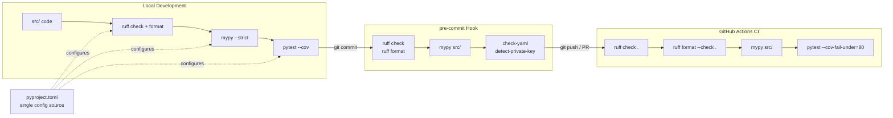

# Python Dev Tools

> [!abstract] TL;DR
> `pyproject.toml` is the single config file for your entire Python project; `ruff` lints and formats at Rust speed replacing flake8 + isort + black; `mypy` catches type errors before runtime; `pre-commit` blocks bad commits locally; and GitHub Actions enforces the same checks in CI — together they shift code review from style debate to real substance.

---

## Intuition

**Analogy:** A professional kitchen has rigid mise en place — every tool is in its assigned place, every ingredient prepped to standard before service starts. A cook who skips prep survives a slow Tuesday but collapses on a 200-cover Saturday rush. Dev tooling is mise en place for a codebase: formatting is consistent (nobody argues about trailing commas), types are verified (no surprise `AttributeError` at 2 AM), and tests pass before code ships.

The `pyproject.toml` is the kitchen manual that every tool reads from one source of truth. `pre-commit` hooks are the quality check before a dish leaves the pass. GitHub Actions CI is the head chef who inspects every plate before it reaches the guest — and whose approval cannot be skipped.

---

## How It Works

### Core Mechanics

The modern Python toolchain collapses what used to be seven separate config files into one. Every tool reads its own `[tool.<name>]` section from `pyproject.toml`. Developers install everything in one command: `pip install -e ".[dev,test]"`.

The pipeline has three enforcement points:

1. **Local dev loop** — developer runs `ruff` and `mypy` manually or via `make` targets after editing
2. **pre-commit hook** — git runs hooks automatically on `git commit`; bad commits are blocked before they leave the machine
3. **GitHub Actions CI** — every push and PR runs the full suite; required status checks block merges into main

### Pipeline Flow



---

### 1. pyproject.toml — Single Config Source

`pyproject.toml` (PEP 517/518/621) replaces all legacy config files:

| Legacy file | Replaced by section in `pyproject.toml` |
|-------------|------------------------------------------|
| `setup.py` / `setup.cfg` | `[build-system]` + `[project]` |
| `.flake8` | `[tool.ruff.lint]` |
| `mypy.ini` | `[tool.mypy]` |
| `.isort.cfg` | ruff `I` rule group |
| `pytest.ini` | `[tool.pytest.ini_options]` |
| `.coveragerc` | `[tool.coverage.run]` + `[tool.coverage.report]` |

Key sections:
- **`[build-system]`** — declares the build backend (setuptools, hatch, poetry)
- **`[project]`** — `name`, `version`, `requires-python`, `dependencies` (runtime-only)
- **`[project.optional-dependencies]`** — `dev` and `test` groups; install with `pip install -e ".[dev,test]"` for an editable dev install that also pulls dev tooling
- **`[tool.*]`** — one section per tool; each tool reads only its own section and ignores the rest

---

### 2. ruff — Linter + Formatter

ruff is a Rust-based tool that replaces flake8, isort, pyupgrade, and black in a single binary. It is 10-100x faster than the equivalent Python toolchain on large codebases.

```
ruff check .            # lint; report errors
ruff check --fix .      # lint + auto-fix safe errors in-place
ruff format .           # format (replaces black)
ruff format --check .   # format check only (CI mode — exits non-zero if any file would change)
```

Rule groups selected via `[tool.ruff.lint] select`:

| Code | Source | What it checks |
|------|--------|----------------|
| `E` / `W` | pycodestyle | Style errors / warnings |
| `F` | pyflakes | Undefined names, unused imports |
| `I` | isort | Import section ordering |
| `UP` | pyupgrade | Syntax modernization (f-strings, `X \| Y` union syntax) |
| `S` | flake8-bandit | Security issues (subset of bandit) |
| `B` | flake8-bugbear | Likely bugs and design issues |
| `ANN` | annotations | Missing type annotations |

Inline suppression: `# noqa: E501`. Always use the specific code; bare `# noqa` silences everything on the line and makes audits impossible.

---

### 3. black and isort (Legacy Context)

**black** (pre-ruff era): deterministic, opinionated formatter — almost no configuration choices.
- `black --line-length 88 src/` or `black --check src/` for CI
- **Magic trailing comma**: black never collapses a trailing-comma sequence to one line; use this to pin multi-line formatting intentionally
- Config in `[tool.black]`: `line-length`, `target-version`, `skip-magic-trailing-comma`

**isort** (pre-ruff era): orders imports into three sections — stdlib → third-party → local.
- `profile = "black"` for style compatibility with black's import formatting
- `--check-only` for CI; config: `known_third_party`, `known_first_party`

**Why teams migrated to ruff:**
- One tool handles lint + format + import sort + pyupgrade
- Single version pin; no "black and flake8 fought over a line" conflicts
- Speed: a 200-file project that took 8s with black + flake8 + isort takes under 0.5s with ruff

**Migration path:** Add `"I"` to `[tool.ruff.lint] select` to get isort behavior. Replace `black` invocations with `ruff format`. Remove black and isort from `[project.optional-dependencies]`. Remove their pre-commit hooks and replace with `ruff` + `ruff-format` hooks.

---

### 4. mypy — Static Type Checker

mypy reads type annotations and proves (or disproves) type safety without running the code. It finds bugs at check-time: wrong argument types, missing return statements, attribute access on `None`.

```
mypy src/              # check src/ directory
mypy src/ tests/       # also check test code
mypy src/ --strict     # enable all strict checks
mypy --install-types   # detect and install missing stub packages
```

**What `--strict` enables** (the four most impactful):

| Flag enabled by `--strict` | What it catches |
|----------------------------|-----------------|
| `disallow_untyped_defs` | Functions without full annotations; callers cannot be checked |
| `disallow_any_generics` | Bare `list`, `dict` without subscript — masks element type errors |
| `warn_return_any` | Functions returning `Any` propagate unchecked values silently |
| `no_implicit_reexport` | Prevents accidental API surface expansion in library code |

**Incremental mode:** mypy caches results in `.mypy_cache/`. Subsequent runs only re-check changed files — commit this directory to CI caching for large codebases.

**`reveal_type(expr)`:** Drop this anywhere in source; mypy prints the inferred type and exits non-zero. Remove before committing. Essential for debugging complex generic inference.

**Type stubs:** Third-party libraries without inline types need separate stub packages:
- `types-requests` (for `requests`)
- `pandas-stubs` (for `pandas`)
- `boto3-stubs[s3]` (for boto3 S3 operations)

**Inline suppression:**
```python
result = legacy_func()   # type: ignore[no-untyped-call]
value: int = external    # type: ignore[assignment]
```
Always use a specific error code. Bare `# type: ignore` silences every error on the line including ones you haven't seen yet.

**Per-module overrides** let you loosen rules for specific files without affecting the rest:
```toml
[[tool.mypy.overrides]]
module = "legacy_module.*"
ignore_errors = true

[[tool.mypy.overrides]]
module = ["numpy.*", "pandas.*"]
ignore_missing_imports = true
```

---

### 5. pre-commit — Local Hook System

pre-commit manages git hooks that run before a commit is accepted. Hooks are defined in `.pre-commit-config.yaml` and wired into `.git/hooks/pre-commit` via `pre-commit install`.

```
pre-commit install          # wire hooks into .git/hooks/ — run once after every clone
pre-commit run --all-files  # run all hooks on every tracked file (CI bootstrap or manual audit)
pre-commit autoupdate       # bump all hook `rev` values to latest releases
```

**`pass_filenames: false` for mypy:** mypy must receive the full `src/` directory, not just staged files. Without this, pre-commit passes only changed files to mypy and cross-module type errors are invisible. Set `pass_filenames: false` and `args: [src/]` together.

**`stages`:** By default hooks run at `commit`. Add `stages: [push]` for expensive hooks (secret scanning) that should run as the final gate before the remote receives code.

**Why pre-commit matters:** CI takes 2-5 minutes. A pre-commit hook catches the same error in under 10 seconds, before the bad commit ever reaches the repository. The `--no-verify` bypass exists and leaves an audit trail in the reflog; for most teams this is acceptable because CI still blocks merges.

---

### 6. bandit — Security Linting

bandit statically scans for common security vulnerabilities in Python source code.

```
bandit -r src/          # recursive scan, medium+ severity
bandit -r src/ -ll      # include low-severity findings
bandit -r src/ -f json  # JSON output for CI dashboards
```

Common B-codes:

| Code | What it detects |
|------|-----------------|
| `B101` | Use of `assert` (stripped by `python -O`) |
| `B105` | Hardcoded password string in source |
| `B311` | Insecure `random` module (use `secrets` for cryptographic use) |
| `B506` | Unsafe `yaml.load()` — use `yaml.safe_load()` |
| `B608` | SQL injection via string concatenation or `%` formatting |

Inline suppression: `# nosec B311` — always name the specific code.

**ruff `S` rules vs bandit:** ruff's `S` group covers approximately 40-50% of bandit checks — the most common ones. bandit additionally catches `B608` (SQL injection via format strings), certain subprocess argument injection patterns, and XML vulnerability checks (`B405`–`B413`). For high-security projects, run both; use ruff `S` for fast local feedback and full bandit in CI.

---

### 7. pyupgrade — Syntax Modernizer

pyupgrade automatically rewrites Python code to use modern syntax for a given minimum Python version:

- `Union[X, Y]` → `X | Y` (3.10+)
- `Optional[X]` → `X | None`
- `open(f)` without encoding → `open(f, encoding="utf-8")`
- `super(ClassName, self)` → `super()`
- Old `%`-formatting → f-strings (when safe)

```
pyupgrade --py311-plus src/myfile.py
```

ruff's `UP` rule group implements all pyupgrade transforms as auto-fixable lint rules. Running `ruff check --fix .` applies all safe `UP` transforms automatically, making the standalone `pyupgrade` tool redundant when ruff is in the stack.

---

### 8. GitHub Actions CI

CI enforces the same checks pre-commit runs locally, but it cannot be bypassed and runs on every PR against every matrix target. Cache pip deps and `.mypy_cache` to keep runs under two minutes.

Key design decisions:
- **`fail-fast: false`** in the matrix — let all Python versions run even if one fails; flaky version-specific failures are easier to diagnose
- **`cache: pip`** on `actions/setup-python` — caches the pip download cache, not the venv; still install from scratch each run for correctness
- **Separate cache for `.mypy_cache`** keyed on `pyproject.toml` hash — mypy incremental cache is safe to reuse across runs for the same config
- **`--cov-fail-under=80`** — CI fails if branch coverage drops below 80%; adjust per project

---

### 9. Development Workflow

`make` targets give every developer a consistent command vocabulary regardless of IDE:

```
make install       # pip install -e ".[dev,test]" + pre-commit install
make lint          # ruff check .
make format        # ruff format .
make type-check    # mypy src/
make test          # pytest --cov=src
make all           # lint + format-check + type-check + test
```

**VS Code** settings for instant feedback on save (`.vscode/settings.json`):
```json
{
  "editor.formatOnSave": true,
  "editor.defaultFormatter": "charliermarsh.ruff",
  "[python]": {
    "editor.codeActionsOnSave": {
      "source.fixAll.ruff": "explicit",
      "source.organizeImports.ruff": "explicit"
    }
  },
  "mypy-type-checker.enabled": true,
  "mypy-type-checker.args": ["--strict"]
}
```

**`.editorconfig`** enforces cross-editor consistency (indent size, line endings, final newline) independently of the formatter — useful when the team mixes VS Code, PyCharm, and Neovim:
```ini
root = true

[*.py]
indent_style = space
indent_size = 4
end_of_line = lf
charset = utf-8
trim_trailing_whitespace = true
insert_final_newline = true
```

---

## Code Demo

### Demo 1: Complete `pyproject.toml`

```toml
[build-system]
requires = ["setuptools>=68", "wheel"]
build-backend = "setuptools.build_meta"

[project]
name = "my-service"
version = "0.1.0"
description = "A Python backend service"
requires-python = ">=3.11"
dependencies = [
    "fastapi>=0.111",
    "pydantic>=2.7",
    "sqlalchemy>=2.0",
    "httpx>=0.27",
]

[project.optional-dependencies]
dev = [
    "ruff>=0.4",
    "mypy>=1.10",
    "types-requests",
    "pre-commit>=3.7",
    "bandit>=1.7",
]
test = [
    "pytest>=8",
    "pytest-cov>=5",
    "pytest-asyncio>=0.23",
]

# ── ruff ──────────────────────────────────────────────────────────────────────
[tool.ruff]
line-length = 88
target-version = "py311"

[tool.ruff.lint]
select = [
    "E", "W",   # pycodestyle errors / warnings
    "F",        # pyflakes (undefined names, unused imports)
    "I",        # isort import ordering
    "UP",       # pyupgrade (f-strings, X | Y union syntax)
    "S",        # bandit security subset
    "B",        # flake8-bugbear (likely bugs)
    "ANN",      # missing type annotations
]
ignore = [
    "ANN101",  # missing type annotation for `self` in methods
    "ANN102",  # missing type annotation for `cls` in classmethods
]

[tool.ruff.lint.per-file-ignores]
"tests/**/*.py" = ["S101", "ANN"]     # allow assert + skip annotation reqs in tests
"src/generated/**/*.py" = ["ALL"]    # skip auto-generated protobuf / ORM files

[tool.ruff.format]
quote-style = "double"
indent-style = "space"

# ── mypy ──────────────────────────────────────────────────────────────────────
[tool.mypy]
python_version = "3.11"
strict = true
warn_return_any = true
warn_unused_ignores = true     # flag stale # type: ignore comments

[[tool.mypy.overrides]]
module = ["numpy.*", "pandas.*"]
ignore_missing_imports = true  # these libs have partial or external stubs

[[tool.mypy.overrides]]
module = "src.generated.*"
ignore_errors = true           # generated code; not our types to fix

# ── pytest ────────────────────────────────────────────────────────────────────
[tool.pytest.ini_options]
testpaths = ["tests"]
asyncio_mode = "auto"
addopts = "-v --tb=short"

# ── coverage ──────────────────────────────────────────────────────────────────
[tool.coverage.run]
source = ["src"]
omit = ["src/generated/*", "tests/*"]

[tool.coverage.report]
exclude_lines = [
    "pragma: no cover",
    "def __repr__",
    "raise NotImplementedError",
    "if TYPE_CHECKING:",
]
fail_under = 80
```

---

### Demo 2: `.pre-commit-config.yaml`

```yaml
repos:
  # ruff: lint + format (replaces flake8, isort, black, pyupgrade)
  - repo: https://github.com/astral-sh/ruff-pre-commit
    rev: v0.4.4
    hooks:
      - id: ruff
        args: [--fix]
        stages: [commit]
      - id: ruff-format
        stages: [commit]

  # mypy: static type checking across the full src/ directory
  - repo: https://github.com/pre-commit/mirrors-mypy
    rev: v1.10.0
    hooks:
      - id: mypy
        additional_dependencies: [pydantic>=2.7, types-requests]
        # pass_filenames: false so mypy receives the full src/ directory,
        # not just the staged files — cross-module errors require full context
        pass_filenames: false
        args: [src/]
        stages: [commit]

  # General file hygiene
  - repo: https://github.com/pre-commit/pre-commit-hooks
    rev: v4.6.0
    hooks:
      - id: check-yaml
      - id: end-of-file-fixer
      - id: trailing-whitespace
      - id: detect-private-key        # blocks accidental private key commits
      - id: check-merge-conflict
      - id: check-added-large-files
        args: [--maxkb=500]

  # Secret scanning — heavier, run only at push stage
  - repo: https://github.com/gitleaks/gitleaks
    rev: v8.18.3
    hooks:
      - id: gitleaks
        stages: [push]
```

---

### Demo 3: GitHub Actions CI (`.github/workflows/ci.yml`)

```yaml
name: CI

on:
  push:
    branches: [main]
  pull_request:
    branches: [main]

jobs:
  quality:
    runs-on: ubuntu-latest
    strategy:
      fail-fast: false          # let all matrix versions run even if one fails
      matrix:
        python-version: ["3.11", "3.12"]

    steps:
      - uses: actions/checkout@v4

      - name: Set up Python ${{ matrix.python-version }}
        uses: actions/setup-python@v5
        with:
          python-version: ${{ matrix.python-version }}
          cache: pip             # caches the pip download cache

      - name: Install dependencies
        run: pip install -e ".[dev,test]"

      - name: Lint with ruff
        run: ruff check .

      - name: Check formatting with ruff
        run: ruff format --check .

      - name: Cache mypy results
        uses: actions/cache@v4
        with:
          path: .mypy_cache
          key: mypy-${{ matrix.python-version }}-${{ hashFiles('pyproject.toml') }}

      - name: Type check with mypy
        run: mypy src/

      - name: Run tests with coverage
        run: pytest --cov=src --cov-report=xml --cov-fail-under=80

      - name: Upload coverage to Codecov
        uses: codecov/codecov-action@v4
        if: matrix.python-version == '3.11'   # upload once, not per matrix cell
        with:
          file: ./coverage.xml
          fail_ci_if_error: false
```

---

### Demo 4: `Makefile`

```makefile
.PHONY: install lint format format-check type-check test security all clean

install:
	pip install -e ".[dev,test]"
	pre-commit install

lint:
	ruff check .

format:
	ruff format .

format-check:
	ruff format --check .

type-check:
	mypy src/

test:
	pytest --cov=src --cov-report=term-missing

security:
	bandit -r src/ -ll

# Run the full suite locally before pushing a PR
all: lint format-check type-check test

clean:
	find . -type d -name __pycache__ -exec rm -rf {} +
	find . -type d -name .mypy_cache -exec rm -rf {} +
	find . -type d -name .pytest_cache -exec rm -rf {} +
	find . -name "*.pyc" -delete
	find . -name "coverage.xml" -delete
```

> [!warning] Makefile Indentation
> Recipe lines in a `Makefile` **must** use a literal tab character (`\t`), not spaces. If you paste this into your editor and it converts tabs to spaces, `make` will reject the file with `missing separator` errors. Most editors have a "convert indentation" toggle for Makefiles.

---

## Real-World Example

> **FastAPI's own repository** uses exactly this toolchain. The `tiangolo/fastapi` codebase uses `pyproject.toml` as the single config source, ruff for lint and format (replacing the previous black + isort + flake8 setup), mypy in strict mode for the framework's public API surface, and pre-commit hooks that run ruff and mypy before every commit. Their CI matrix covers Python 3.8 through 3.12 with `fail-fast: false`. The strict mypy configuration is what enables IDE tools (Pylance, mypy daemon) to give accurate autocomplete to FastAPI *users* — the framework's internal type annotations are the source of truth for the generated OpenAPI schema **and** for the end-user IDE experience simultaneously.

---

## Trade-offs

| Comparison | Pro | Con |
|------------|-----|-----|
| **ruff** vs flake8 + isort + pyupgrade | 10-100x faster (Rust); single binary and version pin; built-in `--fix` | Newer — some niche flake8 plugins (pep8-naming, flake8-django) don't have ruff equivalents yet |
| **ruff format** vs black | Same speed advantage; single tool; near-100% format parity with black | `skip-magic-trailing-comma` must be opted into; black has a longer track record for edge cases |
| **mypy** vs pyright / pylance | Mature, stable; standard in CI pipelines; precise, descriptive error messages | Slower (Python daemon even with incremental cache); `--strict` must be opt-in; VS Code needs a plugin |
| **pyright** vs mypy | Much faster (TypeScript-based, truly incremental); native VS Code via Pylance | Error messages are less human-readable; CI integration less mature; occasional false positives |
| **pre-commit** vs CI-only checks | Immediate local feedback in <10s; free (no CI minutes); catches issues before they're committed | Requires `pre-commit install` per clone; can be bypassed with `--no-verify`; adds ~5-15s to commit time |

---

## When to Use vs Avoid

**Use this full toolchain when:**
- The project has more than one contributor or will outlast a sprint
- You're building library or framework code where callers cannot inspect internals
- The team has mixed experience levels — ruff's `--fix` teaches correct style silently by rewriting code
- CI pipelines must enforce standards without trusting developer discipline

**Scale down when:**
- A solo notebook exploration — tooling adds friction with no team benefit; `ruff check` at minimum still catches real bugs
- A truly throwaway script under 100 lines — but run `ruff check` and `mypy` anyway on anything you'll share

**Avoid combining:**
- Never run both `black` and `ruff format` — they fight on edge cases and produce a file that changes on every save
- Never run both `isort` and ruff `I` rules — they produce different orderings and create infinite fix loops
- Don't enable `strict = true` on a legacy codebase overnight — migrate incrementally using `[[tool.mypy.overrides]]` to suppress per-module, shrinking the suppressed set over sprints

---

## Common Pitfalls

- **Global `ignore_missing_imports = true` in mypy** — Setting this globally hides real errors when a package *does* have types but you made a typo in the import path. Set it only for specific untyped packages via `[[tool.mypy.overrides]]` with `module = "untyped_lib.*"`.

- **pre-commit not blocking push** — Default hooks run at `commit`. `detect-private-key` runs locally but gitleaks secret scanning is expensive and needs `stages: [push]` to run as the last gate before the remote. Without `stages: [push]`, a key committed in session A could be pushed in session B without triggering the hook.

- **ruff and black running simultaneously** — If both are installed as VS Code formatters or pre-commit hooks, they conflict on trailing-comma edge cases and produce a file that changes on every save. Remove black entirely from deps, hooks, and VS Code settings when adopting ruff format.

- **mypy not checking test files** — Calling `mypy src/` in CI skips `tests/`. Type errors in test helpers and fixtures go undetected until runtime. Either expand the call to `mypy src/ tests/` or add `files = src tests` in `[tool.mypy]`.

- **`per-file-ignores` omitted for generated code** — Protobuf-generated files, Alembic migrations, and auto-generated API clients routinely violate lint rules by design. Add `"src/generated/**/*.py" = ["ALL"]` to `[tool.ruff.lint.per-file-ignores]` immediately, or every ruff run emits hundreds of spurious errors that train developers to ignore the output.

- **Stale `# type: ignore` comments** — Enable `warn_unused_ignores = true` in `[tool.mypy]`. mypy will flag `# type: ignore` comments that no longer suppress an actual error (for example, because the upstream library added type stubs). Without this setting, suppressions accumulate silently and the codebase gradually fills with noise that masks real future errors.

- **`pre-commit install` not automated** — New clones miss the hooks entirely unless `pre-commit install` is part of `make install`. Document it in the README and wire it as the second line of the `install` make target, immediately after `pip install -e ".[dev,test]"`.

---

## Related Concepts

- [[Type_Hints_and_Static_Analysis]] — deep dive into mypy configuration, `--strict` flag details, per-module overrides, `reveal_type()`, type stubs, and the mypy vs pyright comparison; the mypy coverage here is practical setup while that note covers the annotation system itself
- [[FastAPI_Deep_Dive]] — FastAPI uses Pydantic + type annotations across its entire public surface; the `pyproject.toml` and mypy strict setup described here directly enables correct Pylance autocomplete for FastAPI route parameters and dependency injection
- [[Django_Fundamentals]] — Django projects follow the same `pyproject.toml` packaging pattern; `manage.py` coexists with `[build-system]`; `mypy-django` plugin adds ORM model type awareness on top of the standard mypy config
- [[Concurrency_in_Python]] — asyncio code has mypy-specific annotation patterns (`Coroutine[Any, Any, T]`, `AsyncIterator[T]`); `pytest-asyncio` is configured via `[tool.pytest.ini_options] asyncio_mode = "auto"` alongside the sync test config
- [[Decorators_and_Metaprogramming]] — decorators that wrap functions and change their signature require `ParamSpec` and `TypeVar` to type correctly under mypy `--strict`; ruff `ANN` rules enforce that wrapper functions also carry annotations

---

## Review Questions

1. **ruff `S` vs bandit in CI:** Your `pyproject.toml` has `"S"` in `[tool.ruff.lint] select` and a security reviewer insists you also add `bandit -r src/` as a separate CI step. What categories of vulnerability does bandit detect that ruff `S` rules do not currently cover? How would you structure the CI workflow to run both without creating duplicate noise for developers in pre-commit?

2. **`pre-commit install` vs `pre-commit run`:** A new team member clones the repo, sees `.pre-commit-config.yaml`, and runs `pre-commit run --all-files` — all hooks pass. They commit several files without running `pre-commit install`. Explain exactly what happens at commit time, why their commits are not blocked, and what you would add to `make install` and the README to prevent this class of error for all future contributors.

3. **`# type: ignore` vs per-module override:** `src/integrations/legacy_client.py` calls an untyped C extension and mypy emits 30 errors, all `no-untyped-call`. Should you add `# type: ignore[no-untyped-call]` to each of the 30 call sites or add a `[[tool.mypy.overrides]]` block with `ignore_errors = true` for that module? Describe what each approach conceals, and identify the one case where per-line suppression is preferable to the module-level override.

4. **`strict` implications on a legacy codebase:** Your team enables `strict = true` in `[tool.mypy]` on a 15,000-line codebase that currently passes mypy without strict. List four specific checks that `strict` activates, describe one concrete bug each check would have caught in a real codebase, and outline an incremental migration strategy using `[[tool.mypy.overrides]]` that lets the project continue shipping while strict violations are resolved module by module.

---

## Sources

- [ruff documentation](https://docs.astral.sh/ruff/)
- [mypy documentation](https://mypy.readthedocs.io/)
- [pre-commit documentation](https://pre-commit.com/)
- [bandit documentation](https://bandit.readthedocs.io/)
- [pyproject.toml specification — Python Packaging User Guide](https://packaging.python.org/en/latest/specifications/pyproject-toml/)
- [PEP 517 — Build system interface](https://peps.python.org/pep-0517/)
- [PEP 621 — Storing project metadata in pyproject.toml](https://peps.python.org/pep-0621/)
- [GitHub Actions documentation](https://docs.github.com/en/actions)

---

#python #ruff #mypy #linting #formatting #pre-commit #devtools #tooling
