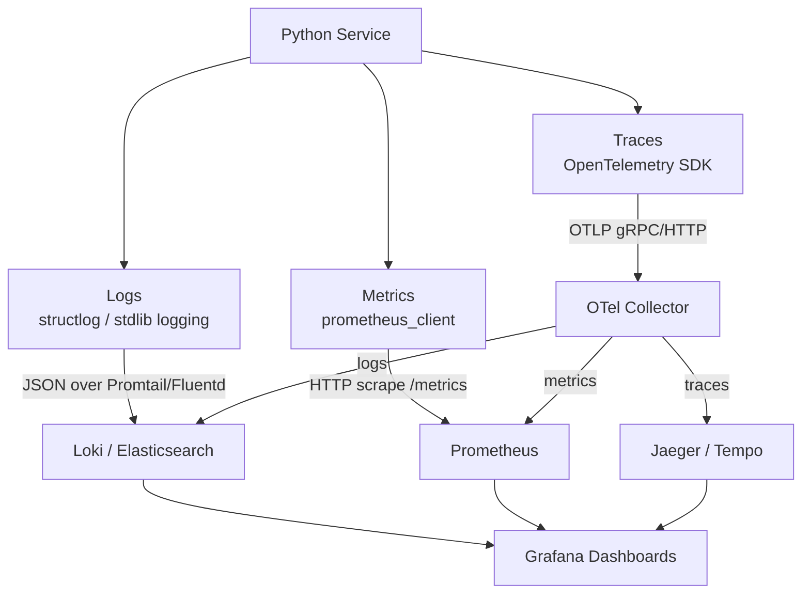
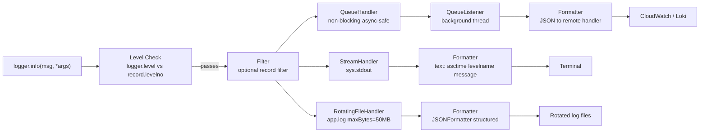
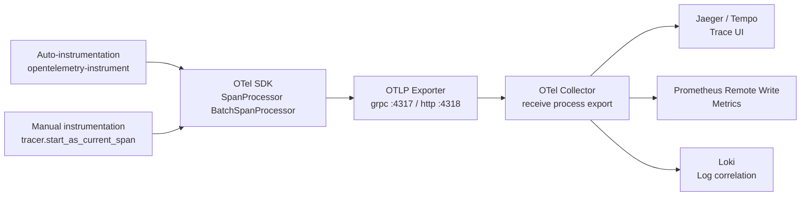

# Python Logging and Observability

> [!abstract] TL;DR
> Production Python services require three signals — logs (what happened), metrics (how often and how fast), and traces (where across services) — and the ecosystem gives you a clear stack for each: stdlib `logging` or `structlog` for structured logs, `prometheus_client` for metrics, OpenTelemetry for distributed tracing, and Sentry for error capture. Getting this stack right is the difference between debugging a production incident in 5 minutes versus 5 hours.

---

## Intuition

**Analogy:** A hospital uses three distinct monitoring systems: a patient chart (logs — narrative record of every event), vital-signs monitors displaying numbers on a dashboard (metrics — heart rate, blood pressure over time), and a GPS tracker on an ambulance showing its entire route across departments (traces — the journey of a single request across services). A doctor who only has one of these three is flying blind. An on-call engineer without all three is in the same situation.

The Python observability stack maps directly: `structlog` writes the patient chart in a structured, machine-readable format; `prometheus_client` drives the vital-signs dashboard that Grafana displays; OpenTelemetry follows a single HTTP request as it travels from FastAPI through a database call and out to a downstream service.

---

## How It Works

### Core Mechanics

#### 1. The `logging` Module

Python's standard library `logging` is built around four objects:

- **Logger** — the entry point your code touches. `logging.getLogger(__name__)` returns a named logger tied to the module's fully qualified name (e.g., `myapp.api.routes`).
- **Handler** — determines *where* log records go (stdout, file, rotating file, network socket).
- **Formatter** — determines *how* a record is rendered (plain text, JSON, colorized).
- **Filter** — optional gatekeeping applied to individual records before they reach a handler.

**Level hierarchy** (numeric values are the threshold):
| Level | Value | Use for |
|---|---|---|
| `DEBUG` | 10 | Detailed diagnostics, disabled in production |
| `INFO` | 20 | Normal operational events |
| `WARNING` | 30 | Unexpected but non-fatal situations |
| `ERROR` | 40 | Failures that need attention |
| `CRITICAL` | 50 | Process-level failures |

**Logger hierarchy and propagation:** Loggers form a tree rooted at the root logger. `myapp.api.routes` is a child of `myapp.api`, which is a child of `myapp`, which is a child of root. By default, records propagate up the tree — a record logged to `myapp.api.routes` will be handled by handlers attached to `myapp`, `myapp.api`, and root, unless `logger.propagate = False` is set.

**Critical rule for libraries:** A library should always add a `NullHandler` to its root logger and never call `logging.basicConfig()`. That configuration is the application's responsibility.

```python
# Inside a library package's __init__.py
import logging
logging.getLogger(__name__).addHandler(logging.NullHandler())
```

**Lazy evaluation — why `%s` matters:**
```python
# BAD: expensive_fn() is called even if DEBUG is disabled
logger.debug("result: " + str(expensive_fn()))

# GOOD: %s formatting is lazy — expensive_fn() never called if DEBUG is off
logger.debug("result: %s", expensive_fn())
```

#### 2. Handlers and Formatters

| Handler | Purpose |
|---|---|
| `StreamHandler` | Write to `sys.stdout` or `sys.stderr` |
| `FileHandler` | Append to a fixed file |
| `RotatingFileHandler(maxBytes, backupCount)` | Rotate when file reaches `maxBytes`; keep `backupCount` old files |
| `TimedRotatingFileHandler` | Rotate on a time schedule (midnight, hourly) |
| `NullHandler` | Silently discard records (library default) |
| `QueueHandler` | Put records on a `queue.Queue`; use with `QueueListener` for non-blocking async-safe logging |

**Format variables:**
```
%(asctime)s     — timestamp (formatted by datefmt)
%(name)s        — logger name (e.g., myapp.api.routes)
%(levelname)s   — DEBUG / INFO / WARNING / ERROR / CRITICAL
%(message)s     — the formatted log message
%(filename)s    — source file name
%(lineno)d      — source line number
%(funcName)s    — calling function name
%(process)d     — process ID
%(thread)d      — thread ID
```

#### 3. Structured Logging with `structlog`

`structlog` treats log records as dictionaries of key-value pairs rather than formatted strings. Every field is explicit, machine-readable, and queryable in Loki or Elasticsearch.

**Key concepts:**
- **Processor chain** — a list of callables applied sequentially to the event dict. Each processor receives `(logger, method_name, event_dict)` and returns a modified `event_dict`. The final processor renders to string or dict.
- **Bound logger** — a logger with context fields pre-attached. `log = log.bind(request_id=req_id, user_id=uid)` returns a new logger where every subsequent call includes those fields.
- **Bridge to stdlib** — `structlog` can wrap stdlib `logging`, sending its output through the stdlib handler chain (useful for third-party library log unification).

#### 4. `contextvars` for Async Log Context

`threading.local()` stores data per OS thread — it breaks under asyncio because many coroutines share one thread. `ContextVar` stores data per *async task* (or per synchronous call stack). It is the correct mechanism for injecting request-scoped data (request ID, user ID, tenant ID) into logs across all coroutines that descend from the same task.

```python
from contextvars import ContextVar
request_id_var: ContextVar[str] = ContextVar("request_id", default="")
```

When you spawn a new task with `asyncio.create_task()`, the child task inherits a *copy* of the parent's context — modifications in the child do not affect the parent, and vice versa. This is safe by default.

**Pitfall:** If you use `loop.run_in_executor()` to run blocking code in a thread pool, the `ContextVar` value is propagated into the thread. However, if you use `asyncio.create_task()` and then the task itself creates an executor call, the ContextVar is correctly inherited through the chain.

#### 5. OpenTelemetry (OTel)

OTel is a vendor-neutral observability framework. It defines APIs for three signals:

- **Traces** — a tree of `Span` objects representing a distributed request. Each span has a name, start/end time, attributes (key-value metadata), events (timestamped annotations), and a status. Spans are linked by `trace_id` and `parent_span_id` propagated via the `traceparent` HTTP header (W3C Trace Context spec).
- **Metrics** — named, typed numeric measurements. Types: `Counter` (monotonically increasing), `UpDownCounter` (can decrease), `Histogram` (value distribution with configurable buckets), `Gauge` (point-in-time reading).
- **Logs** — structured log records that can be correlated with traces via `trace_id` and `span_id` fields.

**Two instrumentation modes:**
- **Auto-instrumentation** (`opentelemetry-instrument --exporter otlp myapp.py`) — zero code changes; the agent monkey-patches supported libraries at startup.
- **Manual instrumentation** — explicit spans, attributes, and events in application code. More control, higher precision, but requires code changes.

#### 6. Prometheus Metrics

Prometheus uses a **pull** model: the Prometheus server scrapes your app's `/metrics` endpoint at a configured interval. `prometheus_client` exposes four metric types:

| Type | Use case | Example |
|---|---|---|
| `Counter` | Monotonically increasing count | `http_requests_total`, `errors_total` |
| `Gauge` | Current value, can go up or down | `active_connections`, `queue_depth` |
| `Histogram` | Distribution of observed values | `request_duration_seconds`, `payload_bytes` |
| `Summary` | Quantiles computed in-process | Avoid — Histogram + Grafana is preferred |

Labels slice a metric along dimensions: `http_requests_total{method="GET", status="200"}`.

#### 7. Sentry for Error Tracking

Sentry is a **push** model error tracker. When an unhandled exception occurs, the Sentry SDK captures the full exception, stack trace, local variable values, breadcrumbs (recent log events), and contextual data (user, tags, release), then sends it to the Sentry backend. This is distinct from logging — Sentry aggregates, deduplicates, and alerts on errors rather than just archiving them.

### Flow / Architecture

**Observability pillars:**



**Python `logging` handler chain:**



**OpenTelemetry pipeline:**



---

## Code Demo

### 1. `structlog` + `ContextVar` Request ID in FastAPI Middleware

```python
# pip install structlog fastapi uvicorn
import logging
import uuid
from contextvars import ContextVar
from typing import Callable

import structlog
import uvicorn
from fastapi import FastAPI, Request, Response

# ── CONTEXTVAR: per-request request_id ────────────────────────────────────────
request_id_var: ContextVar[str] = ContextVar("request_id", default="")

# ── STRUCTLOG CONFIGURATION ───────────────────────────────────────────────────
def add_request_id(logger, method, event_dict):
    """Processor: inject request_id from ContextVar into every log record."""
    rid = request_id_var.get("")
    if rid:
        event_dict["request_id"] = rid
    return event_dict

structlog.configure(
    processors=[
        structlog.stdlib.filter_by_level,
        structlog.stdlib.add_logger_name,
        structlog.stdlib.add_log_level,
        structlog.processors.TimeStamper(fmt="iso"),
        add_request_id,                          # our custom processor
        structlog.processors.format_exc_info,
        structlog.processors.JSONRenderer(),     # output as JSON lines
    ],
    wrapper_class=structlog.stdlib.BoundLogger,
    context_class=dict,
    logger_factory=structlog.stdlib.LoggerFactory(),
)

# Bridge: configure stdlib root logger so structlog output goes to stdout
logging.basicConfig(
    format="%(message)s",       # structlog already formats; just pass through
    level=logging.INFO,
    handlers=[logging.StreamHandler()],
)

log = structlog.get_logger(__name__)

# ── FASTAPI APP ───────────────────────────────────────────────────────────────
app = FastAPI()

@app.middleware("http")
async def request_id_middleware(request: Request, call_next: Callable) -> Response:
    """Generate a UUID request ID and bind it into the ContextVar for this task."""
    rid = str(uuid.uuid4())
    token = request_id_var.set(rid)          # set in current async context
    try:
        response = await call_next(request)
        response.headers["X-Request-ID"] = rid
        return response
    finally:
        request_id_var.reset(token)          # clean up (good practice)

@app.get("/items/{item_id}")
async def get_item(item_id: int):
    # request_id is automatically included in every log line from this handler
    log.info("fetching_item", item_id=item_id, cache_hit=False)
    return {"item_id": item_id, "name": "widget"}

@app.get("/error")
async def trigger_error():
    try:
        result = 1 / 0
    except ZeroDivisionError:
        log.exception("division_error", endpoint="/error")  # includes traceback
        raise

# Run: uvicorn main:app --reload
# Every log line: {"event":"fetching_item","item_id":5,"request_id":"a1b2...", ...}
```

---

### 2. OpenTelemetry Manual Tracing

```python
# pip install opentelemetry-sdk opentelemetry-exporter-otlp-proto-grpc
from opentelemetry import trace
from opentelemetry.sdk.trace import TracerProvider
from opentelemetry.sdk.trace.export import BatchSpanProcessor
from opentelemetry.exporter.otlp.proto.grpc.trace_exporter import OTLPSpanExporter
from opentelemetry.sdk.resources import Resource

# ── TRACER SETUP (do once at application startup) ─────────────────────────────
resource = Resource.create({"service.name": "recommendation-service", "service.version": "2.1.0"})
provider = TracerProvider(resource=resource)
exporter = OTLPSpanExporter(endpoint="http://otel-collector:4317", insecure=True)
provider.add_span_processor(BatchSpanProcessor(exporter))
trace.set_tracer_provider(provider)

tracer = trace.get_tracer(__name__)

# ── MANUAL INSTRUMENTATION ────────────────────────────────────────────────────
def get_recommendations(user_id: int, limit: int = 10) -> list[int]:
    with tracer.start_as_current_span("get_recommendations") as span:
        # Set attributes — searchable metadata in Jaeger/Tempo
        span.set_attribute("user.id", user_id)
        span.set_attribute("recommendations.limit", limit)

        # Nested span for the DB lookup
        with tracer.start_as_current_span("db.query_user_history") as db_span:
            db_span.set_attribute("db.system", "postgresql")
            db_span.set_attribute("db.statement", "SELECT item_id FROM history WHERE user_id = ?")
            # Simulate DB call
            history = [101, 202, 303]
            db_span.add_event("query_complete", {"row_count": len(history)})

        # Nested span for the ML model call
        with tracer.start_as_current_span("ml.score_candidates") as ml_span:
            ml_span.set_attribute("ml.model_version", "v3.2")
            ml_span.set_attribute("ml.candidate_count", 50)
            recommendations = [1001, 1002, 1003][:limit]
            ml_span.add_event("scoring_complete", {"output_count": len(recommendations)})

        span.set_attribute("recommendations.returned", len(recommendations))
        return recommendations

# Auto-instrumentation for FastAPI — zero code changes in route handlers:
# pip install opentelemetry-instrumentation-fastapi
# from opentelemetry.instrumentation.fastapi import FastAPIInstrumentor
# FastAPIInstrumentor.instrument_app(app)
```

---

### 3. Prometheus Metrics Middleware for FastAPI

```python
# pip install prometheus-client fastapi uvicorn
import time
from fastapi import FastAPI, Request, Response
from prometheus_client import Counter, Histogram, Gauge, generate_latest, CONTENT_TYPE_LATEST

app = FastAPI()

# ── METRIC DEFINITIONS (module-level singletons) ──────────────────────────────
REQUEST_COUNT = Counter(
    "http_requests_total",
    "Total HTTP requests",
    ["method", "endpoint", "status_code"],
)
REQUEST_DURATION = Histogram(
    "http_request_duration_seconds",
    "HTTP request duration in seconds",
    ["method", "endpoint"],
    buckets=[0.005, 0.01, 0.025, 0.05, 0.1, 0.25, 0.5, 1.0, 2.5, 5.0],
)
ACTIVE_REQUESTS = Gauge(
    "http_active_requests",
    "Number of HTTP requests currently being processed",
)

# ── MIDDLEWARE ─────────────────────────────────────────────────────────────────
@app.middleware("http")
async def metrics_middleware(request: Request, call_next) -> Response:
    start = time.perf_counter()
    ACTIVE_REQUESTS.inc()
    try:
        response = await call_next(request)
        duration = time.perf_counter() - start
        endpoint = request.url.path
        REQUEST_COUNT.labels(
            method=request.method,
            endpoint=endpoint,
            status_code=str(response.status_code),
        ).inc()
        REQUEST_DURATION.labels(method=request.method, endpoint=endpoint).observe(duration)
        return response
    except Exception as exc:
        duration = time.perf_counter() - start
        REQUEST_COUNT.labels(method=request.method, endpoint=request.url.path, status_code="500").inc()
        REQUEST_DURATION.labels(method=request.method, endpoint=request.url.path).observe(duration)
        raise exc
    finally:
        ACTIVE_REQUESTS.dec()

# ── METRICS ENDPOINT ──────────────────────────────────────────────────────────
@app.get("/metrics")
async def metrics():
    """Prometheus scrape endpoint."""
    return Response(content=generate_latest(), media_type=CONTENT_TYPE_LATEST)

@app.get("/predict")
async def predict(x: float):
    # Business logic — histogram and counter update automatically via middleware
    return {"prediction": x * 2.5}

# Prometheus scrape config (prometheus.yml):
# scrape_configs:
#   - job_name: 'my-service'
#     static_configs:
#       - targets: ['my-service:8000']
```

---

### 4. `dictConfig` for Production Logging (JSON + Rotating File)

```python
# pip install python-json-logger
import logging
import logging.config

LOGGING_CONFIG = {
    "version": 1,
    "disable_existing_loggers": False,       # preserve library loggers
    "formatters": {
        "json": {
            "()": "pythonjsonlogger.jsonlogger.JsonFormatter",
            "format": "%(asctime)s %(name)s %(levelname)s %(message)s %(filename)s %(lineno)d",
        },
        "simple": {
            "format": "%(asctime)s %(levelname)-8s %(name)s — %(message)s",
            "datefmt": "%Y-%m-%d %H:%M:%S",
        },
    },
    "handlers": {
        "console": {
            "class": "logging.StreamHandler",
            "stream": "ext://sys.stdout",
            "formatter": "simple",
            "level": "DEBUG",
        },
        "file_json": {
            "class": "logging.handlers.RotatingFileHandler",
            "filename": "/var/log/myapp/application.log",
            "maxBytes": 52428800,            # 50 MB
            "backupCount": 5,
            "formatter": "json",
            "level": "INFO",
            "encoding": "utf-8",
        },
        "queue": {
            # Non-blocking: handlers run in a background thread
            "class": "logging.handlers.QueueHandler",
            "queue": "ext://myapp.logging_setup.log_queue",
        },
    },
    "loggers": {
        "myapp": {
            "level": "DEBUG",
            "handlers": ["console", "file_json"],
            "propagate": False,              # don't double-log to root
        },
        "uvicorn.access": {
            "level": "INFO",
            "handlers": ["file_json"],
            "propagate": False,
        },
        "sqlalchemy.engine": {
            "level": "WARNING",             # suppress SQL debug spam in production
            "handlers": ["file_json"],
            "propagate": False,
        },
    },
    "root": {
        "level": "WARNING",
        "handlers": ["console"],
    },
}

# Call this once at application startup, before any other imports that log
logging.config.dictConfig(LOGGING_CONFIG)
logging.captureWarnings(True)   # route Python warnings through the logging system

logger = logging.getLogger(__name__)
logger.info("Logging configured: JSON to rotating file, text to console")
```

---

## Real-World Example

> **Example:** Stripe's Python backend services use a layered observability stack that matches this pattern exactly. Every service emits structured JSON logs containing `request_id`, `user_id`, `idempotency_key`, and `charge_id` — the correlation fields that let an on-call engineer follow a payment failure across ten microservices in Kibana using a single `request_id` query. OpenTelemetry distributed traces visualize the latency breakdown across service boundaries (the API gateway, fraud scoring, card network call, database write). Prometheus metrics drive Grafana dashboards tracking payment success rate and p99 latency per card network. Sentry captures any unhandled exception with the Stripe charge ID attached as a tag — letting a support engineer jump from a customer complaint to the exact stack frame in under 30 seconds. The three-signal stack (logs + metrics + traces) is what makes a company with billions of transactions per year debuggable.

---

## Trade-offs

| Aspect | `structlog` | `loguru` | stdlib `logging` |
|---|---|---|---|
| Structured output | Native, first-class | Requires serializer | Requires `python-json-logger` |
| API ergonomics | Explicit, functional | Simple, one-liner | Verbose boilerplate |
| Ecosystem compatibility | Full stdlib bridge | Partial stdlib bridge | Universal — all libraries use it |
| Learning curve | Moderate (processor chain) | Low | Low |

| Aspect | Sentry (hosted) | Self-hosted ELK | Grafana Loki |
|---|---|---|---|
| Cost | Per-event pricing, can be high | High infra + ops cost | Low — efficient compressed storage |
| Error aggregation | Best-in-class deduplication | Manual with ES queries | Not purpose-built |
| Log query language | Limited — tag-based | Lucene / KQL (powerful) | LogQL (label-based, efficient) |
| Operational burden | None (SaaS) | High | Low-medium |

| Aspect | OTel auto-instrumentation | OTel manual instrumentation |
|---|---|---|
| Coverage | Broad — all supported libs | Only what you explicitly instrument |
| Control | Low — opinionated attribute names | High — custom spans and attributes |
| Overhead | ~2-5% latency on fast paths | Proportional to spans you create |
| Setup effort | Minutes | Hours to days |

| Aspect | Prometheus (pull) | StatsD (push/UDP) | Datadog Agent (push) |
|---|---|---|---|
| Query language | PromQL — expressive | Basic counters only | DQL — proprietary |
| Data loss risk | Scrape failures lose data | UDP fire-and-forget packet loss | Buffered, low loss |
| Infrastructure | Self-host Prometheus + Grafana | Simple daemon | SaaS, high cost at scale |
| Histograms | Client-side buckets | Client-side timers | Server-side percentiles |

---

## When to Use vs Avoid

**Use `structlog` when:**
- Your service needs machine-readable logs queryable in Loki/Kibana.
- You want contextual fields (request_id, user_id) to appear on every log line without passing them explicitly.
- You are building a new service and are not constrained by legacy logging config.

**Use stdlib `logging` with JSON formatter when:**
- You need to integrate with existing code or third-party libraries that use stdlib.
- Your team already has a `dictConfig` setup and just needs to add structured output.

**Add OpenTelemetry when:**
- Your service makes calls to other services (databases, APIs, message queues) and you need to understand where latency originates.
- You have more than two services and are experiencing "which hop is slow?" problems.

**Skip OTel auto-instrumentation and use manual when:**
- You need custom attribute names or business-level span names (e.g., `process_payment` rather than `POST /payments`).
- The auto-instrumented overhead is measurable on hot paths (sub-millisecond handlers).

**Use Sentry when:**
- You need error deduplication, grouping, and assignment across a team.
- You want zero-config exception capture with full stack traces including local variable values.

**Avoid Sentry when:**
- PII exposure is a concern — Sentry captures local variables including function arguments; always configure `before_send` to scrub sensitive fields.

---

## Common Pitfalls

- **`logging.basicConfig()` called too late** — `basicConfig()` is a no-op if the root logger already has handlers. This happens when a library or import triggers logging before your config runs. Always call `logging.config.dictConfig()` at the very top of your entry point, before other imports.

- **Logger name collisions** — naming a logger `"requests"` conflicts with the `requests` library's own logger, causing duplicate records or suppressed output. Always use `getLogger(__name__)` — never a hardcoded string.

- **Blocking handlers in async code** — `FileHandler` and network-based handlers do synchronous I/O. In an async service, a slow `FileHandler` write blocks the event loop thread and increases latency for all concurrent requests. Use `QueueHandler` + `QueueListener` to push log records to a background thread.

- **Logging inside tight loops** — even at INFO level, creating a `LogRecord` object per iteration costs real CPU time. Check the level first (`if logger.isEnabledFor(logging.DEBUG):`) or move logging outside the inner loop.

- **Not propagating trace context across `asyncio.create_task()`** — OTel's context propagation uses Python's `contextvars` machinery. `asyncio.create_task()` correctly copies the current context to the child task, so spans created inside the task are linked to the parent trace. However, `loop.run_in_executor()` does *not* copy context by default — wrap with `contextvars.copy_context().run(fn)` to propagate into thread pool workers.

- **Logging sensitive data** — stack traces, local variable captures (Sentry), and debug log lines can expose passwords, API keys, tokens, and PII. Use `before_send` in Sentry to scrub fields. In logging formatters, avoid including `%(args)s` or full `repr()` of request bodies.

- **Not calling `logging.captureWarnings(True)`** — Python's `warnings.warn()` bypasses the logging system by default. After calling `captureWarnings(True)`, all `DeprecationWarning`, `RuntimeWarning`, etc. are routed through the `py.warnings` logger and appear in your log output and dashboards.

---

## Related Concepts

- [[ML_Monitoring_Overview]] — observability at the infrastructure level (latency, error rate) is the foundation that ML-specific drift monitoring builds on top of.
- [[LLM_Observability]] — extends these pillars with LLM-specific signals: token counts, prompt/completion pairs, LLM-as-judge quality scores, and cost tracking.
- [[FastAPI_Deep_Dive]] — the `QueueHandler` pitfall, `ContextVar` middleware, and Prometheus metrics middleware integrate directly into FastAPI's middleware chain.
- [[Async_Python_Web]] — explains why `ContextVar` is necessary for async log context and how `asyncio.create_task()` propagates context copies.
- [[Concurrency_in_Python]] — `threading.local()` vs `ContextVar` distinction; `QueueHandler` uses a background thread — understanding the GIL and thread coordination matters here.
- [[Context_Managers]] — the `@contextmanager` pattern for timing code blocks and the `with tracer.start_as_current_span(...)` OTel API both rely on the context manager protocol.
- [[FastAPI_for_ML]] — the Prometheus middleware and request-ID middleware patterns apply directly to ML model serving endpoints.
- [[Model_Serving_Overview]] — SLOs (p99 latency, error rate) that drive alerting rules are exposed as Prometheus metrics from the serving layer.
- [[Celery_and_Task_Queues]] — Celery tasks run in separate workers; trace context must be serialized into task headers for distributed tracing across the FastAPI → Celery → result boundary.

---

## Review Questions

1. Your module-level logger is named `"myapp"` hardcoded. A junior engineer renames the module from `myapp/api/routes.py` to `myapp/v2/api/routes.py`. What observability problem does this cause, and how does `getLogger(__name__)` prevent it?

2. You have a FastAPI endpoint that calls three downstream services and a PostgreSQL query. An end user reports that a specific request took 4 seconds, but your p99 Prometheus histogram shows 200ms. What observability signal — logs, metrics, or traces — would you use to diagnose this specific slow request, and why?

3. Explain why `threading.local()` breaks as a mechanism for injecting `request_id` into log records in an async FastAPI service. What is the correct replacement and why does it work in asyncio?

4. `logger.debug("processed record: %s", compute_heavy_summary(record))` is called 100,000 times per second. DEBUG is disabled in production. Is `compute_heavy_summary()` called? Why or why not — and what is the correct fix if it were called?

---

## Sources

- [Python `logging` — HOWTO (official)](https://docs.python.org/3/howto/logging.html)
- [structlog documentation](https://www.structlog.org/en/stable/)
- [OpenTelemetry Python documentation](https://opentelemetry-python.readthedocs.io/)
- [prometheus_client Python library](https://github.com/prometheus/client_python)
- [Sentry Python SDK](https://docs.sentry.io/platforms/python/)
- [python-json-logger](https://github.com/madzak/python-json-logger)
- [W3C Trace Context specification](https://www.w3.org/TR/trace-context/)
- Kleppmann, Martin. *Designing Data-Intensive Applications*. O'Reilly, 2017. Chapter 1 (reliability, observability).

---

#python #logging #observability #opentelemetry #structlog #monitoring #sentry
