# Python Packaging

> [!abstract] TL;DR
> Python packaging is the discipline of isolating your project's dependencies (via virtual environments), declaring them precisely (via `pyproject.toml`), locking the full dependency tree for reproducibility (via `poetry.lock` or `uv lock`), and distributing code as installable artifacts (sdist + wheel) to PyPI — `uv` has emerged as the fastest, most complete tool for all of these in 2025.

---

## Intuition

**Analogy:** Imagine every Python project as a restaurant kitchen. Without packaging discipline, every kitchen in the building shares one pantry and one fridge — a cook upgrading `numpy` for the dessert station silently breaks the sauce station that needed an older version. A virtual environment is a private pantry for each kitchen; a lock file is the laminated recipe card that lists exact quantities of every ingredient so the dish comes out identically every time, regardless of when or where it is made.

The packaging ecosystem takes this further: a build backend converts your kitchen's recipes (source code) into a sealed meal kit (a wheel), the PyPI index is the meal kit delivery service, and `pip install` is the act of opening that kit in a new kitchen.

---

## How It Works

### Core Mechanics

1. **Virtual environment creation** — `python -m venv .venv` copies (or symlinks) the interpreter and creates an isolated `site-packages/` directory. Activating the environment (`source .venv/bin/activate` / `.venv\Scripts\activate`) prepends `.venv/bin` to `$PATH` so that `python` and `pip` resolve to the isolated copies.
2. **Dependency declaration** — `pyproject.toml` (PEP 517/518/621) is the single file for project metadata, dependencies, and tool configuration.
3. **Dependency resolution** — A resolver (pip's backtracking resolver, Poetry's SAT solver, uv's PubGrub implementation) computes a consistent set of versions satisfying all constraints and records it in a lock file.
4. **Building a distribution** — A build backend (hatchling, setuptools, flit) reads `pyproject.toml` and produces a source distribution (`.tar.gz`) and a wheel (`.whl`).
5. **Publishing** — `twine upload dist/*` or `poetry publish` authenticates to PyPI and uploads the artifacts.

### Flow / Architecture

```mermaid
graph TD
    subgraph publishing["Publishing Flow"]
        SRC["Source Code\nsrc/mypackage/"] --> BB["Build Backend\nhatchling / setuptools / flit"]
        BB --> SDIST["sdist .tar.gz\nsource distribution"]
        BB --> WHEEL["wheel .whl\npre-built binary"]
        SDIST --> PYPI["PyPI Index\npypi.org"]
        WHEEL --> PYPI
        PYPI --> PIP_INSTALL["pip install mypackage\nor uv pip install"]
    end
    subgraph venv_flow["Virtual Env Isolation"]
        GLOBAL["Global Python\n/usr/bin/python3"] --> VENV["python -m venv .venv\nisolated interpreter"]
        VENV --> SITE["site-packages/\nproject-specific deps only"]
        VENV --> BIN[".venv/bin/python\n.venv/bin/pip"]
    end
    subgraph poetry_flow["Poetry Lock Flow"]
        TOML["pyproject.toml\ntool.poetry.dependencies"] --> RESOLVER["Poetry SAT Resolver"]
        RESOLVER --> LOCK["poetry.lock\nfully pinned tree\ncommit to VCS"]
        LOCK --> INSTALL["poetry install\n→ .venv"]
    end
```



---

## Core Concepts

### 1. Virtual Environments

A virtual environment is a self-contained directory tree with its own Python interpreter copy and isolated `site-packages/`. This is the foundation of all reproducible Python work.

```bash
# Create a venv named .venv (conventional name, in .gitignore)
python -m venv .venv

# Activate — Linux/macOS
source .venv/bin/activate

# Activate — Windows PowerShell
.venv\Scripts\Activate.ps1

# Activate — Windows cmd.exe
.venv\Scripts\activate.bat

# Verify which python is active
which python        # Linux/macOS → /path/to/.venv/bin/python
where python        # Windows → path\to\.venv\Scripts\python.exe

# The VIRTUAL_ENV env var is set while active
echo $VIRTUAL_ENV   # Linux/macOS
echo $Env:VIRTUAL_ENV  # PowerShell

# Always upgrade pip immediately — the bundled pip is often outdated
python -m pip install --upgrade pip

# Deactivate to return to system Python
deactivate
```

**Why venvs:** Two projects requiring `pydantic==1.10` and `pydantic>=2.0` cannot coexist in the same environment. Virtual environments make this a non-problem.

**`.gitignore` rule:** Always add `.venv/` (and common alternatives like `venv/`, `env/`, `.env/`) to `.gitignore`. Committing a venv bloats the repo and breaks on other machines.

```bash
# Capture current environment to a requirements file
pip freeze > requirements.txt

# Reproduce on another machine
pip install -r requirements.txt
```

---

### 2. pip and Requirements Files

`pip` is the standard Python package installer. Understanding its version specifier syntax prevents the most common dependency hell scenarios.

```bash
# Exact version pin — use for direct dependencies in requirements.txt
pip install "requests==2.31.0"

# Compatible release — ~=X.Y.Z means >=X.Y.Z, <X.Y+1
# i.e., patch versions only; minor version is locked
pip install "pydantic~=2.5.0"

# Range — common in pyproject.toml for library dependencies
pip install "fastapi>=0.100,<1.0"

# Editable install: installs the local package in-place
# Changes to src/ are reflected immediately without reinstall
pip install -e .

# Editable install with extras (optional dependency groups)
pip install -e ".[dev,test]"

# Install from a requirements file
pip install -r requirements.txt
pip install -r requirements-dev.txt

# Audit for conflicts
pip check

# See what is outdated
pip list --outdated
```

**`requirements.txt` pattern in practice:**

```
# requirements.txt — minimal direct deps (for applications, not libraries)
fastapi==0.111.0
pydantic==2.7.1
uvicorn[standard]==0.29.0
sqlalchemy==2.0.30

# requirements-dev.txt — extend requirements.txt for development
-r requirements.txt
pytest==8.2.0
ruff==0.4.4
mypy==1.10.0
pytest-cov==5.0.0
```

**`pip-tools` for pinning transitive dependencies:**

```bash
pip install pip-tools

# requirements.in — only your direct dependencies with loose constraints
# fastapi>=0.100
# pydantic>=2.0

pip-compile requirements.in        # outputs requirements.txt with ALL transitive deps pinned
pip-compile requirements-dev.in    # outputs requirements-dev.txt
pip-sync requirements.txt          # installs exactly what's in the lock file (removes extras too)
```

`pip-compile` solves the problem that `pip freeze` captures everything installed (including transitive deps) but does not track which deps are direct vs transitive. `requirements.in` is your source of truth; `requirements.txt` is the generated lock file.

---

### 3. pyproject.toml — Project Metadata

`pyproject.toml` (PEP 517/518/621) is the modern single source of truth for Python project metadata, replacing `setup.py` and `setup.cfg`. Every new project should start with it.

```toml
# pyproject.toml — complete example for a publishable package

[project]
name = "mypackage"
version = "0.3.1"
description = "A concise description of what this package does"
readme = "README.md"
license = { text = "MIT" }
authors = [
    { name = "Karan Jain", email = "karan@example.com" }
]
requires-python = ">=3.11"
keywords = ["ml", "api", "utilities"]
classifiers = [
    "Development Status :: 4 - Beta",
    "Intended Audience :: Developers",
    "License :: OSI Approved :: MIT License",
    "Programming Language :: Python :: 3",
    "Programming Language :: Python :: 3.11",
    "Programming Language :: Python :: 3.12",
]
# Direct runtime dependencies — use ranges, not exact pins, for libraries
dependencies = [
    "fastapi>=0.100,<1.0",
    "pydantic>=2.0",
    "httpx>=0.25",
]

[project.optional-dependencies]
# Installed with: pip install "mypackage[dev]"
dev = [
    "ruff>=0.4",
    "mypy>=1.10",
    "pytest>=8.0",
    "pytest-cov>=5.0",
]
# Installed with: pip install "mypackage[test]"
test = [
    "pytest>=8.0",
    "pytest-asyncio>=0.23",
    "httpx>=0.25",   # TestClient dependency
]

[project.scripts]
# Creates a CLI entry point: mypackage-serve → mypackage.cli:main
mypackage-serve = "mypackage.cli:main"

[project.urls]
Homepage = "https://github.com/karanjain/mypackage"
Repository = "https://github.com/karanjain/mypackage"
Documentation = "https://mypackage.readthedocs.io"
"Bug Tracker" = "https://github.com/karanjain/mypackage/issues"

# PEP 517/518: declare the build backend
[build-system]
requires = ["hatchling"]
build-backend = "hatchling.build"

[tool.hatch.version]
# Derive version from VCS tag: hatch version → reads from git tag
source = "vcs"

[tool.hatch.build.targets.wheel]
# src/ layout: only package the src/mypackage directory
packages = ["src/mypackage"]

# --- Tool configuration (same file, no separate tool config files needed) ---

[tool.mypy]
python_version = "3.11"
strict = true
ignore_missing_imports = true

[tool.ruff]
line-length = 88
target-version = "py311"

[tool.ruff.lint]
select = ["E", "F", "I", "UP"]

[tool.pytest.ini_options]
testpaths = ["tests"]
addopts = "--cov=src/mypackage --cov-report=term-missing"
```

---

### 4. Poetry

Poetry is an all-in-one project management tool: dependency resolver, virtual environment manager, build tool, and publisher. It introduced the `poetry.lock` file, which pins the full transitive dependency tree.

```bash
# Create a new project with standard layout
poetry new my-project

# Or initialize poetry in an existing directory
cd my-project
poetry init

# Add a runtime dependency (writes to pyproject.toml + resolves poetry.lock)
poetry add fastapi
poetry add "pydantic>=2.0,<3.0"

# Add a dev-only dependency to a named group
poetry add --group dev pytest ruff mypy

# Install all dependencies from poetry.lock (exact versions)
poetry install

# Install without dev dependencies (production-like)
poetry install --without dev

# Update a specific package (re-resolves, updates poetry.lock)
poetry update pydantic

# Run a command inside the project's venv (without activating)
poetry run python src/mypackage/main.py
poetry run pytest

# Activate the project venv as a subshell
poetry shell

# Build sdist + wheel into dist/
poetry build

# Publish to PyPI (prompts for credentials or uses stored token)
poetry publish

# Publish and build in one step
poetry publish --build

# Show the active virtual environment details
poetry env info

# Show where the venv lives
poetry env info --path
```

**`[tool.poetry]` section in `pyproject.toml`:**

```toml
[tool.poetry]
name = "my-project"
version = "0.1.0"
description = "Example project"
authors = ["Karan Jain <karan@example.com>"]
readme = "README.md"

[tool.poetry.dependencies]
python = ">=3.11,<4.0"
fastapi = ">=0.100,<1.0"
pydantic = "^2.0"    # ^2.0 = >=2.0.0,<3.0.0 (caret constraint)

[tool.poetry.group.dev.dependencies]
pytest = ">=8.0"
ruff = ">=0.4"
mypy = ">=1.10"

[build-system]
requires = ["poetry-core"]
build-backend = "poetry.core.masonry.api"
```

**`poetry.lock`** is a fully pinned TOML file listing the resolved version of every package (direct and transitive) with content hashes for integrity verification. It **must be committed to version control** for reproducible builds.

---

### 5. uv — The Ultrafast Package Manager

`uv` (by Astral, the Ruff team) is a Rust-implemented package manager that is 10–100× faster than pip for cold installs and serves as a drop-in replacement for `pip`, `pip-tools`, `virtualenv`, and `poetry` in a single binary.

```bash
# Install uv (one-time, system-wide)
pip install uv
# or: curl -LsSf https://astral.sh/uv/install.sh | sh

# Create a virtual environment
uv venv .venv

# Install packages (pip-compatible, faster)
uv pip install fastapi pydantic uvicorn

# Sync environment from a lock file (removes packages not in the file)
uv pip sync requirements.txt

# Compile a lock file from pyproject.toml or requirements.in
uv pip compile pyproject.toml -o requirements.txt
uv pip compile requirements.in -o requirements.txt

# Run a script using an auto-managed venv (no manual activation)
uv run python main.py

# Poetry-style project management (uv's own project mode)
uv init my-project              # creates pyproject.toml + uv.lock
uv add fastapi                  # adds dep, resolves, updates uv.lock
uv add --dev pytest ruff        # dev dependency
uv lock                         # re-resolve and update uv.lock
uv sync                         # install from uv.lock
uv sync --frozen                # install without re-resolving (CI mode)

# Run any tool without installing it (like npx)
uvx ruff check src/
uvx pytest
```

**Why uv is becoming the default (2025):**

- Written in Rust with PubGrub resolver — resolves in milliseconds vs seconds for pip.
- `uv.lock` is cross-platform (specifies platform-specific markers).
- Replaces: `pip`, `pip-tools`, `virtualenv`, `venv`, `pipx`, and most of `poetry`.
- Actively developed by the team that built Ruff (which replaced flake8, isort, pyupgrade).
- Compatible with `pyproject.toml` — no new file formats required.

---

### 6. Build Backends

A build backend converts your source tree into distributable artifacts. It is declared in `[build-system]` and invoked by `python -m build` or `pip install .`.

| Backend | Use case | Config |
|---------|----------|--------|
| `hatchling` | Modern pure-Python packages, pyproject.toml only | `[tool.hatch]` |
| `setuptools` | Legacy projects; `setup.py` or `setup.cfg` | `setup.cfg` / `setup.py` |
| `flit` | Simple pure-Python packages with minimal config | `[tool.flit]` |
| `maturin` | Packages with Rust extensions (PyO3 bindings) | `Cargo.toml` + `pyproject.toml` |
| `poetry-core` | Projects managed by Poetry | `[tool.poetry]` |

```toml
# hatchling (recommended for new projects)
[build-system]
requires = ["hatchling"]
build-backend = "hatchling.build"

# setuptools (for legacy or C-extension packages)
[build-system]
requires = ["setuptools>=68", "wheel"]
build-backend = "setuptools.build_meta"
```

**sdist vs wheel:**

- **sdist (`.tar.gz`)** — Source distribution. Contains raw source code. Requires a build step on the target machine. Essential for packages with optional compiled extensions.
- **wheel (`.whl`)** — Pre-built binary. Installs by extraction only; no build step. `py3-none-any.whl` is a universal wheel (pure Python). `cp311-cp311-manylinux_x86_64.whl` is a platform wheel (compiled for CPython 3.11 on Linux x86-64). Always publish both.

```bash
# Build both sdist and wheel
python -m build         # uses build backend declared in pyproject.toml
ls dist/
# mypackage-0.3.1.tar.gz
# mypackage-0.3.1-py3-none-any.whl
```

---

### 7. Publishing to PyPI

```bash
# Install publishing tools
pip install twine build

# Build the distribution artifacts
python -m build

# Check the distribution for common issues before uploading
twine check dist/*

# Upload to TestPyPI first (test run, separate index)
twine upload --repository testpypi dist/*

# Install from TestPyPI to verify
pip install --index-url https://test.pypi.org/simple/ mypackage

# Upload to the real PyPI
twine upload dist/*
# Prompts for username (__token__) and password (your API token)
```

**PyPI API tokens:** Go to pypi.org → Account Settings → API Tokens. Use a project-scoped token in CI/CD, not your global token.

**Trusted Publishing (OIDC — no token needed in GitHub Actions):**

Configure on PyPI: Publishing → Add a new publisher → GitHub Actions. The workflow authenticates via OIDC — PyPI verifies the GitHub repository and workflow file identity without any stored secret.

**Versioning tools:**

```bash
# Bump version across pyproject.toml, __init__.py, CHANGELOG
pip install bump2version
bump2version patch   # 1.2.3 → 1.2.4
bump2version minor   # 1.2.3 → 1.3.0
bump2version major   # 1.2.3 → 2.0.0

# hatch version management (if using hatchling)
hatch version patch
hatch version minor
```

---

### 8. Dependency Resolution and Lock Files

A **lock file** records the exact version of every package (direct + transitive) and content hashes. It guarantees that `pip install -r requirements.txt` on day 1 installs the same thing as on day 500.

| Tool | Lock file | Format |
|------|-----------|--------|
| `poetry` | `poetry.lock` | TOML |
| `uv` | `uv.lock` | Custom TOML |
| `pip-tools` | `requirements.txt` | PEP 508 text |
| `pip` (no lock) | none | — |

**Lock file vs constraints file:**
- **Lock file** — fully pinned, every package, with hashes. Reproducible.
- **Constraints file** (`pip install -c constraints.txt`) — upper-bounds for transitive deps but does not pin everything. Useful for coordinating shared deps across a monorepo without a lock file.

**Supply chain security:**

```bash
# Install with hash checking (requires hashes in requirements.txt from pip-compile --generate-hashes)
pip install --require-hashes -r requirements.txt
```

**Automated updates:** `Dependabot` (GitHub) or `Renovate` (multi-platform) scan your lock files and open PRs updating individual packages. Configure update frequency and grouping rules in `.github/dependabot.yml`.

---

### 9. Managing Multiple Python Versions

```bash
# pyenv (Linux/macOS — installs CPython from source)
brew install pyenv             # macOS
curl https://pyenv.run | bash  # Linux

pyenv install 3.12.4           # install a specific version
pyenv install 3.11.9
pyenv global 3.12.4            # set system-wide default
pyenv local 3.11.9             # set per-directory (writes .python-version)
pyenv versions                 # list all installed

# pyenv-win for Windows
pip install pyenv-win

# .python-version file (committed to VCS)
# 3.11.9
```

**Multi-version CI testing with `tox`:**

```ini
# tox.ini
[tox]
envlist = py311, py312, py313

[testenv]
deps = pytest
commands = pytest tests/
```

**`nox` (code-based tox alternative):**

```python
# noxfile.py
import nox

@nox.session(python=["3.11", "3.12", "3.13"])
def tests(session):
    session.install("pytest", "pytest-cov")
    session.install("-e", ".")
    session.run("pytest", "tests/")

@nox.session
def lint(session):
    session.install("ruff", "mypy")
    session.run("ruff", "check", "src/")
    session.run("mypy", "src/")
```

**`uv` with multiple Python versions:**

```bash
uv python install 3.11 3.12   # download and manage Python versions
uv python list
uv venv --python 3.11 .venv-311
uv run --python 3.12 pytest    # run with a specific version
```

---

### 10. Project Templates and Structure

**Standard `src/` layout (recommended):**

```
my-project/
├── src/
│   └── mypackage/
│       ├── __init__.py       # public API re-exports
│       ├── core.py
│       └── utils.py
├── tests/
│   ├── conftest.py
│   └── test_core.py
├── pyproject.toml
├── README.md
├── .gitignore
├── Makefile                  # common commands: make test, make lint, make build
└── .python-version           # pyenv version pin
```

**Why `src/` layout:**
- Prevents accidentally importing the local source tree instead of the installed package during testing (import ambiguity prevention).
- Forces an actual install step (`pip install -e .`) before tests can import the package, catching packaging bugs early.
- Flat layout (`mypackage/` at root) is simpler but allows `import mypackage` to succeed from the repo root without an install — masking bugs where the installed package would not be importable.

**`__init__.py` design — expose your public API:**

```python
# src/mypackage/__init__.py
from importlib.metadata import version

__version__ = version("mypackage")  # reads from installed metadata, not hardcoded

# Re-export public symbols so callers use: from mypackage import MyClass
from mypackage.core import MyClass, run
from mypackage.utils import parse_config

__all__ = ["MyClass", "run", "parse_config", "__version__"]
```

**Cookiecutter / Copier for project templates:**

```bash
pip install cookiecutter
cookiecutter gh:audreyfeldroy/cookiecutter-pypackage

pip install copier
copier copy gh:pawamoy/copier-uv my-new-project
```

---

## Code Demo

### Demo 1: Complete `pyproject.toml` for a Publishable Package

```toml
# pyproject.toml — production-ready configuration
[project]
name = "ml-serve"
version = "1.0.0"
description = "Lightweight ML model serving utilities"
readme = "README.md"
license = { text = "Apache-2.0" }
authors = [{ name = "Karan Jain", email = "karan@example.com" }]
requires-python = ">=3.11"
dependencies = [
    "fastapi>=0.111,<1.0",
    "pydantic>=2.7",
    "uvicorn[standard]>=0.29",
    "httpx>=0.27",
]

[project.optional-dependencies]
dev = ["ruff>=0.4", "mypy>=1.10", "pytest>=8.0", "pytest-cov>=5.0"]
test = ["pytest>=8.0", "pytest-asyncio>=0.23", "httpx>=0.27"]
torch = ["torch>=2.3", "torchvision>=0.18"]

[project.scripts]
ml-serve = "ml_serve.cli:main"

[project.urls]
Repository = "https://github.com/karan/ml-serve"
Documentation = "https://ml-serve.readthedocs.io"

[build-system]
requires = ["hatchling"]
build-backend = "hatchling.build"

[tool.hatch.build.targets.wheel]
packages = ["src/ml_serve"]

[tool.ruff]
line-length = 88
target-version = "py311"

[tool.ruff.lint]
select = ["E", "F", "I", "UP", "B", "SIM"]

[tool.mypy]
python_version = "3.11"
strict = true
ignore_missing_imports = true

[tool.pytest.ini_options]
testpaths = ["tests"]
asyncio_mode = "auto"
addopts = "--cov=src/ml_serve --cov-report=term-missing -q"
```

---

### Demo 2: GitHub Actions Automated PyPI Publish (Trusted Publishing / OIDC)

```yaml
# .github/workflows/publish.yml
# Triggered on a version tag push: git tag v1.2.3 && git push --tags
name: Publish to PyPI

on:
  push:
    tags:
      - "v*"

jobs:
  build:
    runs-on: ubuntu-latest
    steps:
      - uses: actions/checkout@v4
      - uses: astral-sh/setup-uv@v3
        with:
          enable-cache: true

      - name: Set up Python
        run: uv python install 3.12

      - name: Install dependencies and run tests
        run: |
          uv sync --frozen --group dev
          uv run pytest tests/ -q

      - name: Build distribution
        run: uv build   # creates dist/*.tar.gz and dist/*.whl

      - name: Upload dist artifacts
        uses: actions/upload-artifact@v4
        with:
          name: dist
          path: dist/

  publish:
    needs: build
    runs-on: ubuntu-latest
    environment: pypi          # GitHub environment requiring approval
    # Trusted publishing: no PYPI_API_TOKEN secret needed
    permissions:
      id-token: write          # required for OIDC token generation

    steps:
      - uses: actions/download-artifact@v4
        with:
          name: dist
          path: dist/

      - name: Publish to PyPI
        uses: pypa/gh-action-pypi-publish@release/v1
        # No password needed — OIDC proves identity to PyPI automatically
```

> **Configure on PyPI first:** pypi.org → Your project → Publishing → "Add a new publisher" → select GitHub, enter your repo and workflow filename.

---

### Demo 3: Full `uv` Workflow (Create, Install, Lock, Run)

```bash
#!/usr/bin/env bash
# Complete uv workflow for a new project

# 1. Initialize a new project (creates pyproject.toml + uv.lock)
uv init my-api-service
cd my-api-service

# 2. Add dependencies (resolves and updates uv.lock automatically)
uv add fastapi uvicorn pydantic
uv add --dev pytest ruff mypy

# 3. Create virtual environment and sync from uv.lock
uv sync

# 4. Verify the environment
uv run python -c "import fastapi; print(fastapi.__version__)"

# 5. Run tests through uv (activates venv automatically)
uv run pytest tests/

# 6. Compile a pip-compatible requirements.txt from the lock
uv pip compile pyproject.toml -o requirements.txt
# Also generate a dev version
uv pip compile pyproject.toml --extra dev -o requirements-dev.txt

# 7. CI: frozen sync (never re-resolves, fails if uv.lock is out of date)
uv sync --frozen

# 8. Run any tool without installing into the project venv
uvx ruff check src/
uvx --python 3.12 mypy src/

# 9. Build wheel
uv build
```

```python
# src/my_api_service/__init__.py
from importlib.metadata import version

__version__ = version("my-api-service")
```

---

### Demo 4: Poetry Monorepo with Shared Internal Package

```
monorepo/
├── packages/
│   ├── shared/           # internal library shared across services
│   │   ├── src/shared/
│   │   │   └── __init__.py
│   │   └── pyproject.toml
│   ├── api-service/
│   │   ├── src/api_service/
│   │   │   └── main.py
│   │   └── pyproject.toml
│   └── worker-service/
│       ├── src/worker_service/
│       │   └── worker.py
│       └── pyproject.toml
└── pyproject.toml        # optional root config for shared tools
```

```toml
# packages/shared/pyproject.toml
[tool.poetry]
name = "shared"
version = "0.1.0"
description = "Internal shared utilities"

[tool.poetry.dependencies]
python = ">=3.11"
pydantic = ">=2.0"

[build-system]
requires = ["poetry-core"]
build-backend = "poetry.core.masonry.api"
```

```toml
# packages/api-service/pyproject.toml
[tool.poetry]
name = "api-service"
version = "0.1.0"

[tool.poetry.dependencies]
python = ">=3.11"
fastapi = ">=0.111"
# Reference the local shared package via path dependency
shared = { path = "../shared", develop = true }

[build-system]
requires = ["poetry-core"]
build-backend = "poetry.core.masonry.api"
```

```bash
# In packages/api-service/
poetry install   # installs shared as an editable path dependency
poetry run python src/api_service/main.py
```

> **uv workspaces (preferred for monorepos in 2025):** `uv` has native workspace support — declare `[tool.uv.workspace]` in the root `pyproject.toml` and uv resolves all packages together with a single `uv.lock` at the root.

```toml
# Root pyproject.toml (uv workspace)
[tool.uv.workspace]
members = ["packages/*"]
```

---

## Real-World Example

> **FastAPI + uv in production (2025):** The FastAPI project itself migrated its development workflow to `uv` for its dramatically faster CI. The `pyproject.toml` declares `fastapi` as a library with `requires-python = ">=3.8"` and loose dependency ranges; the `uv.lock` pins exact versions for CI reproducibility. The Docker image uses a multi-stage build: stage 1 runs `uv sync --frozen --no-dev` to install only production deps into `.venv`; stage 2 copies just `.venv` and the `src/` tree — keeping the image small and the install deterministic. This pattern eliminates the "works on my machine" class of bugs entirely.

---

## Trade-offs

### Tool Comparison: poetry vs uv vs pip-tools

| Aspect | `poetry` | `uv` | `pip-tools` |
|--------|----------|------|-------------|
| Install speed | Moderate (Python resolver) | 10–100× faster (Rust) | Slow (pip resolver) |
| Lock file format | `poetry.lock` (TOML) | `uv.lock` (TOML, cross-platform markers) | `requirements.txt` (text) |
| Project management | Full (init, add, build, publish) | Full (init, add, lock, build) | Compile only |
| Monorepo support | Via path deps (manual) | Native workspaces | Not supported |
| PyPI publishing | Built-in (`poetry publish`) | Via `twine` or `uv publish` (2025) | Not supported |
| pyproject.toml | Own `[tool.poetry]` format | PEP 621 standard `[project]` | Not required |
| Ecosystem compatibility | High, widely adopted | Growing rapidly | Highest (pip-compatible) |
| Best for | Teams wanting one opinionated tool | Speed, simplicity, modern projects | Minimal tooling, pip-compatible output |

### Layout: `src/` vs Flat

| Aspect | `src/` layout | Flat layout |
|--------|--------------|-------------|
| Import ambiguity | Eliminated — must install before import works | Present — bare `import mypackage` works from repo root without install |
| Editable install complexity | Requires `pip install -e .` always | Works without install during development |
| Packaging bugs caught | Early — tests exercise the installed package | Late — bugs only surface after users install from PyPI |
| Adoption | Recommended by PyPA; used by FastAPI, pydantic | Simple scripts, legacy projects |

### Versioning Scheme

| Aspect | Semantic Versioning (SemVer) | Calendar Versioning (CalVer) |
|--------|------------------------------|------------------------------|
| Format | `MAJOR.MINOR.PATCH` (1.3.2) | `YYYY.MM.DD` or `YYYY.MM` (2025.01) |
| Breaking change signal | MAJOR bump | No automatic signal |
| Predictability | High — users know what a MAJOR bump means | Low — must read changelog |
| Best for | Libraries with stable APIs | Applications, OS distributions (Ubuntu), pip itself |

---

## When to Use vs Avoid

**Use `uv` when:**
- Starting any new project in 2025 — it subsumes pip, pip-tools, and virtualenv
- CI speed is important — the cold install cache cuts CI time from minutes to seconds
- You want a single tool that handles the entire workflow

**Use `poetry` when:**
- Your team already has deep poetry knowledge and existing `poetry.lock` files
- You want integrated publish + environment management in one well-documented tool
- You prefer the explicit `^1.0` / `~1.0` constraint syntax

**Use `pip-tools` when:**
- You need maximum pip compatibility and a dead-simple compile-pin-sync loop
- The project is being maintained by engineers unfamiliar with newer tools
- You need `requirements.txt` output for a tool that cannot read `poetry.lock` or `uv.lock`

**Avoid:**
- Committing your `.venv/` — it is machine-specific and will break on other platforms
- Using `pip install` with no version constraints in production — causes silent upgrade breakage
- Mixing lock file tools on the same project (e.g., `poetry.lock` + `requirements.txt` generated by pip-tools) — they diverge immediately

---

## Common Pitfalls

- **Not committing the lock file** — Forgetting to commit `poetry.lock` or `uv.lock` means `poetry install` / `uv sync` resolve fresh every time. Two developers running the same command on different days may get different minor versions. Lock files belong in version control for applications; for libraries, the lock file is for CI only and not distributed to users.

- **`python -m pip` vs `pip`** — If multiple Python versions exist on `$PATH`, bare `pip` may point to a different Python than `python`. Always use `python -m pip install` to guarantee you install into the currently active interpreter. This is especially subtle on Windows where `py -m pip` and `pip` can diverge.

- **`pip install -e .` without `[build-system]`** — On older projects without a `[build-system]` table, pip falls back to `setup.py` legacy mode. This bypasses PEP 517, may silently install incorrect package paths, and will be deprecated. Add `[build-system]` with `hatchling` or `setuptools` to opt into the modern build protocol.

- **Publishing with a squatted or mistyped package name** — Before `pip install mypackage`, an attacker could register `mypackage` on PyPI and serve malicious code. Search PyPI to verify your name is unique before publishing. Also: `typosquatting` attacks register `reqeusts` or `pydanticv2` — always audit `pip install` commands in dependencies.

- **`requires-python` too loose** — Declaring `requires-python = ">=3.6"` but using `str | None` syntax (3.10+) causes a confusing `SyntaxError` for users on older Pythons. Test the declared minimum version in CI using tox or nox.

- **Editable install inside Docker without `--no-cache-dir`** — `pip install --no-cache-dir -e .` inside a Dockerfile avoids bloating the image with pip's download cache (which cannot be reused between builds). Omitting `--no-cache-dir` adds hundreds of megabytes to layers.

- **`poetry add` modifying an unpinned version range** — `poetry add requests` writes `requests = "^2.31.0"` (the latest at add-time). If you later run `poetry update requests` and there is a 2.32, your `poetry.lock` updates but your `pyproject.toml` range still allows it — this is correct. However, if requests releases 3.0, the `^2.31` constraint correctly blocks it. Understanding caret constraints prevents surprise breakage.

---

## Related Concepts

- [[Python_for_ML]] — covers Python's runtime model and GIL; virtual environments and dependency management are mentioned as part of the ML project workflow
- [[Python_Internals]] — explains how `import` resolves modules via `sys.path`; understanding why `src/` layout forces an install and why `.venv/site-packages` must precede system paths
- [[Type_Hints_and_Static_Analysis]] — `pyproject.toml` is the home for `[tool.mypy]` and `[tool.ruff]` configuration alongside package metadata; mypy and ruff are dev dependencies installed via extras
- [[FastAPI_Deep_Dive]] — FastAPI projects are the canonical use case for the src/ layout, pyproject.toml extras with `[dev]` and `[test]` groups, and GitHub Actions publishing workflows
- [[Docker_for_ML]] — Docker multi-stage builds use `uv sync --frozen` or `pip install -r requirements.txt` to produce minimal, reproducible images; the virtual env inside Docker replaces system-wide installs
- [[Context_Managers]] — `python -m venv .venv` creates an isolated environment that the shell activation script wraps; the `with` statement analogy applies to environment lifecycle management

---

## Review Questions

1. **Lock file vs constraints file:** A teammate says "we don't need `poetry.lock` because `pyproject.toml` already specifies our dependencies." Explain the concrete failure mode that occurs when `poetry.lock` is absent, using a transitive dependency scenario where package A requires `httpx>=0.25` and package B requires `httpx<0.27`, and a new `httpx` 0.28 has been released since your last install.

2. **`src/` layout import ambiguity prevention:** You have a repository with `mypackage/` at the root (flat layout) and `tests/test_core.py`. Describe the exact mechanism by which a test can import the wrong version of `mypackage` — the one from the repo tree rather than the installed one — and explain how switching to `src/mypackage/` with `pip install -e .` eliminates this risk entirely.

3. **Trusted publishing OIDC benefit:** Your team is setting up PyPI publishing in GitHub Actions. A colleague suggests storing `PYPI_API_TOKEN` as a repository secret. You argue for trusted publishing (OIDC) instead. Explain what OIDC-based trusted publishing is, what security risk the token approach carries that OIDC eliminates, and what configuration is required on both the PyPI side and the GitHub Actions workflow side.

4. **`pip-compile` purpose:** A new engineer asks "if we already have `pyproject.toml` declaring our dependencies, why do we need `pip-compile`?" Explain the distinction between a dependency specification (`>=1.2,<2.0`) and a lock file (exact pinned version for every transitive dep), describe what can go wrong without `pip-compile` in a team setting, and show the two-step `pip-compile` + `pip-sync` workflow.

---

## Sources

- [Python Packaging User Guide — PyPA](https://packaging.python.org/en/latest/)
- [PEP 517 — Build system interface](https://peps.python.org/pep-0517/)
- [PEP 518 — Specifying Minimum Build System Requirements](https://peps.python.org/pep-0518/)
- [PEP 621 — Storing project metadata in pyproject.toml](https://peps.python.org/pep-0621/)
- [uv documentation — Astral](https://docs.astral.sh/uv/)
- [Poetry documentation](https://python-poetry.org/docs/)
- [pip-tools documentation](https://pip-tools.readthedocs.io/)
- [Hatchling documentation](https://hatch.pypa.io/latest/)
- [PyPA trusted publishing guide](https://docs.pypi.org/trusted-publishers/)
- [pyenv documentation](https://github.com/pyenv/pyenv)
- [Testing & Packaging — Hynek Schlawack](https://hynek.me/articles/testing-packaging/)

---

#python #packaging #poetry #pip #venv #pypi #dependency-management #tooling
