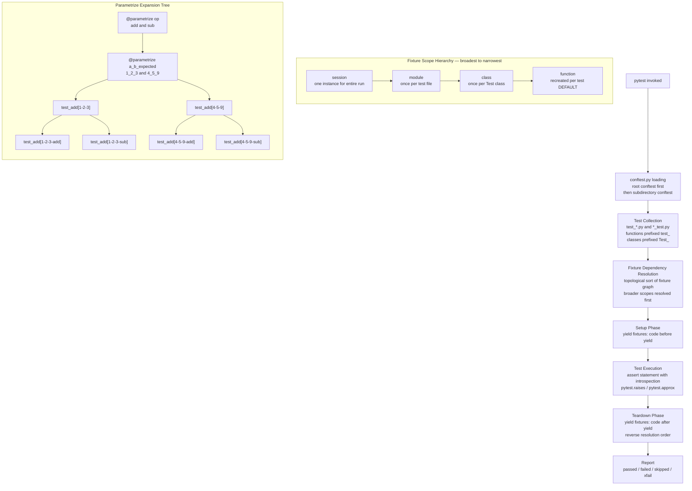

# Python Testing with pytest

> [!abstract] TL;DR
> pytest is the de-facto Python testing framework: plain `assert` introspection, composable fixtures with automatic dependency injection, parametrize for data-driven tests, rich mocking via `unittest.mock` and `pytest-mock`, async support via `pytest-anyio`, and coverage via `pytest-cov` — together forming a complete test infrastructure for every layer of a Python backend.

---

## Intuition

**Analogy:** Think of pytest as a smart test factory assembly line. The factory manager (`pytest` CLI) first reads the facility's shared tooling catalog (`conftest.py`), then walks the floor collecting every workbench labelled `test_*`. Before running any job, it checks which shared tools (fixtures) each workbench needs and pre-assembles them in the right order — a session-scoped database is set up once at shift start, a function-scoped transaction is rolled back after every single job. At teardown, the tools are cleaned up in reverse order, automatically. `@pytest.mark.parametrize` is the fixture that stamps the same job card with different materials, running the same assembly check against each variant without duplicating the work order.

The key insight separating pytest from `unittest`: instead of inheriting from `TestCase` and calling `self.assertEqual`, you write plain Python functions with plain `assert`. pytest rewrites the AST of your assertion at collection time so that when it fails, it shows you the actual vs expected values without you writing a single message string.

---

## How It Works

### Core Mechanics

**Test discovery rules:**
1. Start from the current directory (or path arguments).
2. Recursively collect files matching `test_*.py` or `*_test.py`.
3. Within those files, collect functions prefixed `test_` and methods prefixed `test_` inside classes prefixed `Test`.
4. Before any collection, load `conftest.py` files from the root down to each file's directory.

**Essential CLI flags:**
```
pytest test_file.py -v          # verbose: show each test name + result
pytest -k "test_login"          # filter by expression (substring match on test name)
pytest -x                       # fail fast: stop after first failure
pytest --tb=short               # traceback style: short | long | no | line | native
pytest -s                       # disable output capture (show print() in real time)
pytest -m "slow"                # run only tests decorated @pytest.mark.slow
pytest --lf                     # re-run only the tests that failed last run
pytest -n 4                     # parallel execution via pytest-xdist (4 workers)
```

### Flow / Architecture



---

## 1. pytest Basics

### Assert Introspection

pytest rewrites `assert` statements at collection time. A failing assertion shows the actual diff without any message string:

```python
# Standard assert — pytest shows full diff on failure
def test_addition():
    result = 1 + 1
    assert result == 3
# Output on failure:
#   assert 2 == 3
#    +  where 2 = 1 + 1

# Floats: use pytest.approx (handles IEEE 754 rounding)
import pytest

def test_float_math():
    assert 0.1 + 0.2 == pytest.approx(0.3)           # passes
    assert [0.1, 0.2] == pytest.approx([0.1, 0.2])   # works on lists
    assert 1.0 == pytest.approx(1.0, rel=1e-3)        # relative tolerance
```

### Exception and Warning Testing

```python
import pytest

def divide(a, b):
    if b == 0:
        raise ZeroDivisionError("cannot divide by zero")
    return a / b

def test_divide_by_zero():
    with pytest.raises(ZeroDivisionError, match="cannot divide"):
        divide(10, 0)

def test_raises_captures_exception():
    with pytest.raises(ValueError) as exc_info:
        int("not_a_number")
    assert "invalid literal" in str(exc_info.value)

import warnings

def warn_fn():
    warnings.warn("deprecated", DeprecationWarning, stacklevel=2)

def test_deprecation_warning():
    with pytest.warns(DeprecationWarning, match="deprecated"):
        warn_fn()
```

### Markers

```python
import pytest
import sys

@pytest.mark.skip(reason="not implemented yet")
def test_not_ready():
    pass

@pytest.mark.skipif(sys.platform == "win32", reason="POSIX-only")
def test_unix_signals():
    pass

@pytest.mark.xfail(reason="known bug #123", strict=False)
def test_known_failure():
    assert 1 == 2  # expected to fail; xpass if it passes + strict=True → error

@pytest.mark.slow           # custom marker — run with: pytest -m slow
def test_heavy_computation():
    pass
```

Register custom markers in `pyproject.toml` to avoid warnings:
```toml
[tool.pytest.ini_options]
markers = [
    "slow: marks tests as slow (deselect with '-m not slow')",
    "integration: marks integration tests",
]
```

---

## 2. Fixtures

### Fixture Basics and Dependency Injection

Fixtures are resolved by name: pytest inspects the test function's parameter names and finds matching fixture definitions. This is pure dependency injection — no explicit wiring needed.

```python
import pytest

@pytest.fixture
def sample_user():
    """Function-scoped fixture (default) — recreated for every test."""
    return {"id": 1, "name": "Alice", "email": "alice@example.com"}

def test_user_name(sample_user):          # pytest injects sample_user by name
    assert sample_user["name"] == "Alice"

def test_user_email(sample_user):         # gets a fresh sample_user — not shared
    assert "@" in sample_user["email"]
```

### Yield Fixtures — Setup and Teardown

A `yield` in a fixture splits it into setup (before yield) and teardown (after yield). Teardown runs even if the test raises — functionally identical to `try/finally`. See [[Context_Managers]].

```python
import pytest
import tempfile
import os

@pytest.fixture
def temp_file():
    """Creates a temp file; cleans up even if the test fails."""
    fd, path = tempfile.mkstemp(suffix=".txt")
    os.close(fd)
    yield path                 # test receives the path
    os.unlink(path)            # teardown — always runs

def test_write_to_file(temp_file):
    with open(temp_file, "w") as f:
        f.write("hello")
    with open(temp_file) as f:
        assert f.read() == "hello"
```

### Fixture Scopes

```python
import pytest

@pytest.fixture(scope="session")
def db_engine():
    """Created once for the entire test session — expensive connections."""
    engine = create_engine("sqlite:///./test.db")
    Base.metadata.create_all(engine)
    yield engine
    Base.metadata.drop_all(engine)
    engine.dispose()

@pytest.fixture(scope="module")
def api_client():
    """One client instance per test file."""
    client = httpx.Client(base_url="http://testserver")
    yield client
    client.close()

@pytest.fixture(scope="class")
def class_state():
    """Shared within one Test class, new per class."""
    return {"counter": 0}

@pytest.fixture(scope="function")   # default — explicit for clarity
def fresh_dict():
    return {}
```

### Built-in Fixtures

```python
def test_stdout_capture(capsys):
    """capsys — captures print() output."""
    print("debug info")
    captured = capsys.readouterr()
    assert captured.out == "debug info\n"

def test_temp_dir(tmp_path):
    """tmp_path — provides a pathlib.Path to a per-test temp dir."""
    f = tmp_path / "config.json"
    f.write_text('{"key": "value"}')
    assert f.read_text() == '{"key": "value"}'

def test_monkeypatch(monkeypatch):
    """monkeypatch — patches attributes, env vars, dict items."""
    monkeypatch.setenv("DATABASE_URL", "sqlite:///:memory:")
    monkeypatch.setattr("os.getcwd", lambda: "/fake/path")
    import os
    assert os.getcwd() == "/fake/path"

def test_request_fixture(request):
    """request — access test context: name, node, markers."""
    print(f"Running test: {request.node.name}")
```

### autouse Fixtures

```python
@pytest.fixture(autouse=True)
def reset_global_state():
    """Runs for every test in scope without being declared as a parameter."""
    yield
    # teardown: clear any global state
    some_module.CACHE.clear()
```

---

## 3. conftest.py

`conftest.py` is pytest's implicit plugin file. It is auto-loaded before test collection — no import needed. Fixtures defined in `conftest.py` are available to all tests in the same directory and all subdirectories.

**Hierarchy:** A root `conftest.py` applies globally. A `tests/integration/conftest.py` applies only to tests under `tests/integration/`. Fixtures from parent conftest files are visible in subdirectory conftest files.

```
tests/
    conftest.py             ← session fixtures, shared mocks, DB engine
    unit/
        conftest.py         ← unit-test-specific fixtures (lightweight)
        test_services.py
    integration/
        conftest.py         ← real DB session, live HTTP client
        test_api.py
```

**Configuration: `conftest.py` vs `pytest.ini` vs `pyproject.toml`:**

| File | Purpose |
|------|---------|
| `conftest.py` | Fixtures, hooks, local plugins — Python code |
| `pytest.ini` | Static config: `testpaths`, `addopts`, markers — no fixtures |
| `pyproject.toml [tool.pytest.ini_options]` | Same as `pytest.ini` but co-located with packaging config |

```toml
# pyproject.toml — preferred for modern projects
[tool.pytest.ini_options]
testpaths = ["tests"]
addopts = "-v --tb=short --strict-markers"
asyncio_mode = "auto"           # makes all async tests run under anyio automatically
markers = ["slow", "integration", "smoke"]
```

---

## 4. Parametrize

### Basic Parametrize

```python
import pytest

def add(a, b):
    return a + b

@pytest.mark.parametrize("a,b,expected", [
    (1, 2, 3),
    (0, 0, 0),
    (-1, 1, 0),
    (100, -50, 50),
])
def test_add(a, b, expected):
    assert add(a, b) == expected
# Generates 4 tests: test_add[1-2-3], test_add[0-0-0], etc.
```

### `pytest.param` — Per-Case Marks and IDs

```python
@pytest.mark.parametrize("value,expected", [
    pytest.param(None, TypeError, id="none_input",
                 marks=pytest.mark.xfail(reason="None not handled yet")),
    pytest.param("hello", str, id="string_passes"),
    pytest.param(42, int, id="int_passes",
                 marks=pytest.mark.slow),
])
def test_type_check(value, expected):
    assert isinstance(value, expected)
```

### Multiple Decorators — Cartesian Product

```python
@pytest.mark.parametrize("op", ["add", "subtract"])
@pytest.mark.parametrize("a,b", [(1, 2), (3, 4)])
def test_operations(a, b, op):
    pass
# Generates 4 tests: [1-2-add], [1-2-subtract], [3-4-add], [3-4-subtract]
```

### Parametrized Fixtures with `params` and `indirect`

```python
@pytest.fixture(params=["sqlite", "postgresql"])
def database_url(request):
    """Fixture runs once per param value."""
    if request.param == "sqlite":
        return "sqlite:///:memory:"
    return "postgresql://localhost/testdb"

def test_db_connection(database_url):
    # Runs twice: once for sqlite, once for postgresql
    assert "://" in database_url


# indirect=True: parameter is passed to the fixture, not directly to the test
@pytest.fixture
def user(request):
    """Receives the param via request.param."""
    role = request.param
    return {"role": role, "name": f"test_{role}"}

@pytest.mark.parametrize("user", ["admin", "reader"], indirect=True)
def test_user_role(user):
    assert user["role"] in ["admin", "reader"]
```

### Programmatic Parametrize

```python
import json
import pathlib

# Load test cases from a JSON file — useful for large test datasets
TEST_CASES = json.loads(pathlib.Path("tests/fixtures/cases.json").read_text())

@pytest.mark.parametrize("case", TEST_CASES, ids=[c["id"] for c in TEST_CASES])
def test_from_file(case):
    result = my_function(case["input"])
    assert result == case["expected"]
```

---

## 5. Mocking with `unittest.mock`

### Mock vs MagicMock

```python
from unittest.mock import Mock, MagicMock, AsyncMock, patch, patch_object

# Mock — tracks calls, configurable return values, no dunder support
m = Mock()
m.return_value = 42
assert m() == 42
m.assert_called_once()

# MagicMock — Mock + pre-configured dunder methods (__len__, __iter__, __enter__, __exit__)
mm = MagicMock()
mm.__len__.return_value = 5
assert len(mm) == 5

# side_effect — exception, callable, or iterable of return values
m2 = Mock(side_effect=[1, 2, ValueError("out of values")])
assert m2() == 1
assert m2() == 2
# m2()  → raises ValueError

# Call inspection
m3 = Mock()
m3("alice", role="admin")
m3.assert_called_once_with("alice", role="admin")
print(m3.call_args_list)    # [call('alice', role='admin')]
print(m3.call_count)        # 1
```

### `@patch` — Replace at Import Boundary

```python
from unittest.mock import patch
import requests

def fetch_user(user_id: int) -> dict:
    resp = requests.get(f"https://api.example.com/users/{user_id}")
    resp.raise_for_status()
    return resp.json()

# Patch where the name is USED, not where it is defined
# fetch_user uses 'requests' from its own module namespace
@patch("mymodule.requests.get")
def test_fetch_user(mock_get):
    mock_get.return_value.json.return_value = {"id": 1, "name": "Alice"}
    mock_get.return_value.raise_for_status = Mock()

    result = fetch_user(1)
    assert result["name"] == "Alice"
    mock_get.assert_called_once_with("https://api.example.com/users/1")

# patch as context manager — same semantics, scoped to the with block
def test_fetch_user_context():
    with patch("mymodule.requests.get") as mock_get:
        mock_get.return_value.json.return_value = {"id": 2, "name": "Bob"}
        mock_get.return_value.raise_for_status = Mock()
        result = fetch_user(2)
    assert result["name"] == "Bob"

# patch.object — patch a specific attribute on a specific object
import mymodule

def test_patch_object():
    with patch.object(mymodule.SomeClass, "method_name", return_value=99):
        obj = mymodule.SomeClass()
        assert obj.method_name() == 99
```

### Context Manager Mocking

```python
from unittest.mock import MagicMock, patch

# MagicMock auto-configures __enter__ and __exit__ for use as context manager
def test_file_write():
    mock_file = MagicMock()
    with patch("builtins.open", return_value=mock_file):
        with open("test.txt", "w") as f:
            f.write("data")
        mock_file.__enter__.return_value.write.assert_called_once_with("data")
```

### AsyncMock — Mocking Coroutines

```python
from unittest.mock import AsyncMock, patch
import asyncio

async def fetch_data(client, url: str) -> dict:
    response = await client.get(url)
    return await response.json()

async def test_async_fetch():
    mock_client = AsyncMock()
    mock_response = AsyncMock()
    mock_response.json.return_value = {"status": "ok"}
    mock_client.get.return_value = mock_response

    result = await fetch_data(mock_client, "http://example.com")
    assert result == {"status": "ok"}
    mock_client.get.assert_awaited_once_with("http://example.com")
# Note: use assert_awaited_once_with for coroutines, not assert_called_once_with
```

---

## 6. pytest-mock Plugin

`pytest-mock` wraps `unittest.mock` and exposes it via the `mocker` fixture — auto-cleanup included, no need to call `patch.stop()`.

```bash
pip install pytest-mock
```

```python
def test_with_mocker(mocker):
    # mocker.patch — same as @patch but scoped to the test, auto-stopped on teardown
    mock_get = mocker.patch("mymodule.requests.get")
    mock_get.return_value.json.return_value = {"id": 1}
    mock_get.return_value.raise_for_status = mocker.Mock()

    result = fetch_user(1)
    assert result["id"] == 1

def test_mocker_spy(mocker):
    """spy — calls the real function but tracks call count and args."""
    spy = mocker.spy(mymodule.SomeClass, "expensive_method")
    obj = mymodule.SomeClass()
    result = obj.expensive_method(42)

    assert result is not None              # real function ran
    spy.assert_called_once_with(obj, 42)  # but tracked the call
    print(spy.call_count)                 # 1

def test_mocker_async(mocker):
    """MagicMock and AsyncMock available on mocker."""
    mock_fn = mocker.AsyncMock(return_value={"key": "value"})
    # Use in async test...

def test_reset(mocker):
    mock = mocker.patch("mymodule.some_function")
    mock("first_call")
    mocker.resetall()              # resets call history of all mocks in this test
    assert mock.call_count == 0
```

**Why prefer `pytest-mock` over raw `unittest.mock`:**
- Auto-cleanup: no `patcher.start()` / `patcher.stop()` boilerplate
- Fixture-based: works naturally with other pytest fixtures
- `mocker.spy` tracks calls to the real implementation — no behavior change
- Consistent with pytest's philosophy of minimal boilerplate

---

## 7. Testing Async Code

### pytest-anyio

`anyio` provides a backend-agnostic async test runner. Mark any `async def` test with `@pytest.mark.anyio` and it runs in an event loop automatically. See also [[Async_Python_Web]] for the underlying async patterns.

```bash
pip install anyio[trio] pytest-anyio
```

```python
import pytest
import anyio

@pytest.mark.anyio
async def test_simple_async():
    await anyio.sleep(0)    # yields control — confirms event loop is live
    assert True

# Select backend per test
@pytest.mark.anyio(backend="trio")
async def test_with_trio():
    await anyio.sleep(0)

# Or globally in pyproject.toml:
# [tool.pytest.ini_options]
# anyio_backend = "asyncio"
```

### Session-Scoped Event Loop

```python
# conftest.py — share one event loop across the session for expensive async fixtures
import pytest
import anyio

@pytest.fixture(scope="session")
def anyio_backend():
    return "asyncio"      # pin backend for entire session

@pytest.fixture(scope="session")
async def db_pool():
    """Session-scoped async fixture — pool created once, closed at session end."""
    pool = await asyncpg.create_pool("postgresql://localhost/testdb")
    yield pool
    await pool.close()
```

### Mocking Async Functions in Async Tests

```python
from unittest.mock import AsyncMock, patch
import pytest

@pytest.mark.anyio
async def test_service_with_async_mock(mocker):
    mock_db = mocker.AsyncMock()
    mock_db.fetch_user.return_value = {"id": 1, "name": "Alice"}

    with mocker.patch("myapp.services.get_db", return_value=mock_db):
        result = await myapp.services.get_user_profile(1)
    assert result["name"] == "Alice"
```

---

## 8. Testing FastAPI and Django

### FastAPI: AsyncClient + Dependency Override

FastAPI's `app.dependency_overrides` map swaps any `Depends()` for a test replacement without modifying app code. See [[FastAPI_Deep_Dive]] for the full dependency system.

```python
# pip install httpx pytest-anyio
import pytest
from httpx import AsyncClient, ASGITransport
from myapp.main import app
from myapp.dependencies import get_db

def override_get_db():
    """In-memory SQLite session for tests."""
    db = TestingSessionLocal()
    try:
        yield db
    finally:
        db.close()

@pytest.fixture(autouse=True)
def apply_db_override():
    app.dependency_overrides[get_db] = override_get_db
    yield
    app.dependency_overrides.clear()

@pytest.mark.anyio
async def test_create_user():
    async with AsyncClient(transport=ASGITransport(app=app), base_url="http://test") as client:
        resp = await client.post("/users", json={"name": "Alice", "email": "alice@test.com"})
    assert resp.status_code == 201
    assert resp.json()["name"] == "Alice"

@pytest.mark.anyio
async def test_get_user_not_found():
    async with AsyncClient(transport=ASGITransport(app=app), base_url="http://test") as client:
        resp = await client.get("/users/99999")
    assert resp.status_code == 404
```

### Django: pytest-django

```bash
pip install pytest-django
```

```ini
# pytest.ini or pyproject.toml
[tool.pytest.ini_options]
DJANGO_SETTINGS_MODULE = "myproject.settings.test"
```

```python
import pytest
from django.test import RequestFactory

@pytest.mark.django_db                       # grants DB access; wraps in a transaction that rolls back
def test_create_user_model():
    from myapp.models import User
    user = User.objects.create(username="alice", email="alice@test.com")
    assert User.objects.filter(username="alice").exists()

@pytest.mark.django_db(transaction=True)     # real transactions (slower, needed for some signals)
def test_real_transaction():
    pass

def test_view_with_client(client):           # built-in 'client' fixture = Django test client
    resp = client.get("/health/")
    assert resp.status_code == 200

def test_view_with_request_factory(rf):      # rf = RequestFactory — no middleware
    from myapp.views import health_view
    request = rf.get("/health/")
    resp = health_view(request)
    assert resp.status_code == 200

@pytest.fixture
def admin_client(client, django_user_model):
    user = django_user_model.objects.create_superuser("admin", "admin@test.com", "pass")
    client.force_login(user)
    return client

def test_settings_override(settings):       # 'settings' fixture overrides Django settings
    settings.CACHES = {"default": {"BACKEND": "django.core.cache.backends.dummy.DummyCache"}}
    from django.core.cache import cache
    cache.set("key", "value")
    assert cache.get("key") is None          # dummy cache never stores
```

---

## 9. Coverage

```bash
pip install pytest-cov
pytest --cov=src --cov-report=term-missing --cov-report=html
```

```toml
# pyproject.toml
[tool.coverage.run]
source = ["src"]
branch = true                      # branch coverage: True/False paths both tested
omit = [
    "src/migrations/*",
    "src/**/conftest.py",
    "tests/*",
]

[tool.coverage.report]
fail_under = 85                    # CI fails if coverage drops below 85%
show_missing = true

[tool.coverage.html]
directory = "htmlcov"
```

**Branch coverage** is more meaningful than line coverage: a line with `if condition: return x` has two branches (condition true and false). Branch coverage requires both to be exercised.

**Excluding irrelevant code:**
```python
if TYPE_CHECKING:                  # never executed at runtime
    from mymodule import SomeType  # pragma: no cover

def impossible_branch():
    raise NotImplementedError      # pragma: no cover
```

> [!warning] Coverage vs Quality
> 100% coverage does not mean your tests are good. A test that calls every line but makes no assertions achieves perfect coverage with zero test value. Coverage tells you what code was *executed*, not whether the behavior is *correct*. Aim for 80-90% line + branch coverage with meaningful assertions, not gaming the number.

---

## 10. Test Organization and Best Practices

### AAA Pattern

```python
def test_transfer_reduces_sender_balance():
    # ARRANGE — set up all preconditions
    sender = Account(balance=1000)
    receiver = Account(balance=0)

    # ACT — execute exactly one thing
    transfer(sender, receiver, amount=300)

    # ASSERT — verify the outcome
    assert sender.balance == 700
    assert receiver.balance == 300
```

### Naming Convention

```
test_<function>_<scenario>_<expected_result>

test_divide_by_zero_raises_zero_division_error
test_login_with_invalid_password_returns_401
test_create_user_with_duplicate_email_returns_409
```

### Factory Fixtures

```python
@pytest.fixture
def make_user():
    """Factory fixture — returns a callable that creates users with overridable defaults."""
    def _factory(name="Alice", email="alice@test.com", role="reader", **kwargs):
        return {"name": name, "email": email, "role": role, **kwargs}
    return _factory

def test_admin_can_delete(make_user):
    admin = make_user(role="admin")
    reader = make_user(name="Bob", email="bob@test.com")
    assert can_delete(admin, reader) is True

def test_reader_cannot_delete(make_user):
    reader = make_user(role="reader")
    other = make_user(name="Bob", email="bob@test.com")
    assert can_delete(reader, other) is False
```

### Property-Based Testing with Hypothesis

`hypothesis` generates test inputs automatically and shrinks failing cases to the minimal reproducer.

```python
from hypothesis import given, settings, assume
from hypothesis import strategies as st

def sort_list(lst: list) -> list:
    return sorted(lst)

@given(st.lists(st.integers()))
def test_sort_idempotent(lst):
    """Sorting twice is the same as sorting once."""
    assert sort_list(sort_list(lst)) == sort_list(lst)

@given(st.lists(st.integers(), min_size=1))
def test_sort_preserves_min(lst):
    """Min element is always first after sorting."""
    assert sort_list(lst)[0] == min(lst)

@given(st.lists(st.integers()), st.lists(st.integers()))
@settings(max_examples=500)
def test_sort_merge_property(a, b):
    """sorted(a + b) == merge(sorted(a), sorted(b)) — merge-sort invariant."""
    import heapq
    merged = list(heapq.merge(sorted(a), sorted(b)))
    assert merged == sorted(a + b)
```

**Shrinking:** when hypothesis finds a failing input `[3, -7, 1000, 42]`, it automatically tries smaller variants — fewer elements, smaller values — until it finds the minimal case that still fails (e.g., `[-1]`). This is the single most useful feature for diagnosing failures.

### Mutation Testing

```bash
pip install mutmut
mutmut run --paths-to-mutate src/
mutmut results
# mutmut modifies your source (swaps + for -, removes conditions) and runs tests.
# A "survived" mutant means your tests didn't catch the change — a test quality gap.
```

---

## Code Demo

### Demo 1: Full `conftest.py` — Session DB + Transactional Rollback

```python
# tests/conftest.py
import pytest
from sqlalchemy import create_engine, text
from sqlalchemy.orm import sessionmaker
from myapp.models import Base

# ──────────────────────────────────────────────────────────────────────────────
# Session-scoped: engine + schema created ONCE per test run
# ──────────────────────────────────────────────────────────────────────────────
@pytest.fixture(scope="session")
def engine():
    """In-memory SQLite engine — recreated fresh each test session."""
    _engine = create_engine("sqlite:///:memory:", connect_args={"check_same_thread": False})
    Base.metadata.create_all(_engine)
    yield _engine
    Base.metadata.drop_all(_engine)
    _engine.dispose()

@pytest.fixture(scope="session")
def session_factory(engine):
    """Session factory shared across all tests — bound to the session engine."""
    return sessionmaker(bind=engine, autocommit=False, autoflush=False)

# ──────────────────────────────────────────────────────────────────────────────
# Function-scoped: each test gets its own transaction that rolls back on teardown
# This gives test isolation WITHOUT re-creating the schema each time (fast!)
# ──────────────────────────────────────────────────────────────────────────────
@pytest.fixture
def db_session(engine, session_factory):
    """
    Nested transaction pattern:
      1. Begin a connection-level transaction (savepoint parent)
      2. Create a Session bound to that connection
      3. Begin a SAVEPOINT inside the outer transaction
      4. Yield the session to the test
      5. Rollback to the savepoint → test data is gone, schema stays intact
    """
    connection = engine.connect()
    transaction = connection.begin()

    session = session_factory(bind=connection)

    # SQLite supports nested transactions via SAVEPOINT
    connection.execute(text("SAVEPOINT test_savepoint"))

    yield session

    session.close()
    connection.execute(text("ROLLBACK TO SAVEPOINT test_savepoint"))
    transaction.rollback()
    connection.close()

# ──────────────────────────────────────────────────────────────────────────────
# Convenience factories available to all tests
# ──────────────────────────────────────────────────────────────────────────────
@pytest.fixture
def make_user(db_session):
    """Factory fixture that creates persisted User records."""
    from myapp.models import User

    def _factory(name="Test User", email="test@example.com", role="reader"):
        user = User(name=name, email=email, role=role)
        db_session.add(user)
        db_session.flush()    # assigns id without committing — rolls back with the session
        return user

    return _factory
```

### Demo 2: Parametrize with `pytest.param` + `indirect` Fixture

```python
# tests/test_auth.py
import pytest
from myapp.auth import check_permission

# ── Indirect fixture: param drives fixture setup ──────────────────────────────
@pytest.fixture
def user_with_role(request):
    """Receives role via request.param; builds a dict instead of hitting DB."""
    permissions = {
        "admin": ["read", "write", "delete"],
        "editor": ["read", "write"],
        "viewer": ["read"],
    }
    role = request.param
    return {"role": role, "permissions": permissions[role]}

@pytest.mark.parametrize(
    "user_with_role,action,expected",
    [
        pytest.param("admin", "delete", True, id="admin_can_delete"),
        pytest.param("editor", "write", True, id="editor_can_write"),
        pytest.param("viewer", "delete", False, id="viewer_cannot_delete"),
        pytest.param(
            "editor", "delete", False,
            id="editor_cannot_delete",
            marks=pytest.mark.xfail(reason="permission model not finalized", strict=False),
        ),
    ],
    indirect=["user_with_role"],   # "user_with_role" column goes through the fixture
)
def test_permission(user_with_role, action, expected):
    result = check_permission(user_with_role, action)
    assert result == expected
```

### Demo 3: Async FastAPI Test with AsyncClient + Dependency Override

```python
# tests/test_users_api.py
import pytest
from httpx import AsyncClient, ASGITransport
from myapp.main import app
from myapp.dependencies import get_db

# ── In-memory DB override ─────────────────────────────────────────────────────
from sqlalchemy import create_engine
from sqlalchemy.orm import sessionmaker
from myapp.models import Base

test_engine = create_engine("sqlite:///:memory:", connect_args={"check_same_thread": False})
TestingSessionLocal = sessionmaker(bind=test_engine)
Base.metadata.create_all(test_engine)

def override_get_db():
    db = TestingSessionLocal()
    try:
        yield db
    finally:
        db.close()

# ── Apply override for every test in this module ──────────────────────────────
@pytest.fixture(autouse=True)
def apply_overrides():
    app.dependency_overrides[get_db] = override_get_db
    yield
    app.dependency_overrides.clear()

# ── Shared async client fixture ───────────────────────────────────────────────
@pytest.fixture
async def client():
    async with AsyncClient(transport=ASGITransport(app=app), base_url="http://test") as ac:
        yield ac

# ── Tests ─────────────────────────────────────────────────────────────────────
@pytest.mark.anyio
async def test_create_user_success(client):
    resp = await client.post("/users", json={"name": "Alice", "email": "alice@test.com"})
    assert resp.status_code == 201
    body = resp.json()
    assert body["name"] == "Alice"
    assert "id" in body

@pytest.mark.anyio
async def test_create_user_duplicate_email(client):
    payload = {"name": "Bob", "email": "bob@test.com"}
    await client.post("/users", json=payload)           # first creation
    resp = await client.post("/users", json=payload)    # duplicate
    assert resp.status_code == 409

@pytest.mark.anyio
async def test_get_user_not_found(client):
    resp = await client.get("/users/99999")
    assert resp.status_code == 404
    assert "not found" in resp.json()["detail"].lower()

@pytest.mark.anyio
async def test_external_service_mocked(client, mocker):
    """Mock an external HTTP call made inside the endpoint."""
    mock_notify = mocker.AsyncMock(return_value={"sent": True})
    mocker.patch("myapp.services.notification_service.send", new=mock_notify)

    resp = await client.post("/users", json={"name": "Carol", "email": "carol@test.com"})
    assert resp.status_code == 201
    mock_notify.assert_awaited_once()
```

### Demo 4: Hypothesis Property Test + `mocker.spy`

```python
# tests/test_algorithms.py
import pytest
from hypothesis import given, settings, assume
from hypothesis import strategies as st

# ── Production function under test ────────────────────────────────────────────
def merge_sorted(a: list, b: list) -> list:
    """Merge two sorted lists into a sorted list — O(n+m)."""
    result = []
    i = j = 0
    while i < len(a) and j < len(b):
        if a[i] <= b[j]:
            result.append(a[i]); i += 1
        else:
            result.append(b[j]); j += 1
    result.extend(a[i:])
    result.extend(b[j:])
    return result

# ── Property-based tests ──────────────────────────────────────────────────────
sorted_list = st.lists(st.integers(min_value=-1000, max_value=1000)).map(sorted)

@given(a=sorted_list, b=sorted_list)
def test_merge_sorted_output_is_sorted(a, b):
    """Output must be non-decreasing."""
    result = merge_sorted(a, b)
    assert result == sorted(result)

@given(a=sorted_list, b=sorted_list)
def test_merge_sorted_preserves_all_elements(a, b):
    """All elements are present — no drops, no duplicates invented."""
    result = merge_sorted(a, b)
    assert sorted(result) == sorted(a + b)

@given(a=sorted_list, b=sorted_list)
@settings(max_examples=1000)
def test_merge_sorted_length(a, b):
    """Output length equals sum of input lengths."""
    assert len(merge_sorted(a, b)) == len(a) + len(b)

# ── mocker.spy example ────────────────────────────────────────────────────────
import myapp.cache as cache_module

def test_cache_hit_skips_db(mocker):
    """
    mocker.spy wraps the real function so it still runs,
    but we can verify HOW MANY TIMES it was called.
    """
    spy = mocker.spy(cache_module.LRUCache, "get")

    cache = cache_module.LRUCache(maxsize=10)
    cache.set("key", "value")

    # First access: cache hit
    result1 = cache.get("key")
    # Second access: still cache hit (no DB call)
    result2 = cache.get("key")

    assert result1 == result2 == "value"
    assert spy.call_count == 2      # real method ran twice
```

---

## Real-World Example

> **Example:** Stripe's Python SDK test suite uses parametrize and fixture factories extensively. For each API resource (Charge, Customer, PaymentIntent), a shared `conftest.py` provides a `stripe_client` session fixture pointing at their Stripe-mock server (a local HTTP server that mimics the Stripe API). A `make_customer` factory fixture creates test customers on the mock server. The test for `create_charge` is parametrized over currency codes and amounts — a single test body covers 50+ currency/amount combinations. `mocker.patch` replaces the outbound HTTP transport with `httpx.MockTransport` for pure unit tests, while integration tests use the real mock server. Coverage is enforced at 90% with `fail_under`, blocking merges that regress the metric.

---

## Trade-offs

| Aspect | `unittest` (stdlib) | `pytest` |
|--------|--------------------|---------| 
| Verbosity | Requires `self.assertEqual`, `self.assertRaises`, class inheritance | Plain `assert`, bare functions |
| Fixtures | `setUp`/`tearDown` per class, no composability | Composable, injectable, scoped fixtures |
| Output on failure | Generic "AssertionError" | Full diff with actual vs expected values |
| Ecosystem | Built-in, no install | `pytest-mock`, `pytest-cov`, `pytest-anyio`, `pytest-xdist` |
| Discovery | Requires `unittest.main()` or discovery run | Automatic — any `test_*.py` file |
| Django compatibility | `TestCase` is `unittest.TestCase` subclass | `pytest-django` wraps seamlessly |

| Aspect | Mock Dependencies | Real Dependencies |
|--------|------------------|-------------------|
| Speed | Milliseconds per test | Seconds (DB, network) |
| Confidence | Tests code logic only; real integration untested | Tests actual behavior end-to-end |
| Flakiness | None — mocks never time out | Network/DB can produce intermittent failures |
| Maintenance | Mocks drift from real behavior over time | Always matches current contract |
| Best for | Unit tests, pure logic, CI fast feedback | Integration/E2E, pre-deploy validation |

| Aspect | `function` scope | `session` scope |
|--------|-----------------|-----------------|
| Isolation | Perfect — new instance per test | Shared state can leak across tests |
| Speed | Slower — setup/teardown every test | Fast — setup once, amortized |
| Best for | Anything mutable (DB sessions, files) | Read-only shared resources (DB engine, HTTP client, loaded model) |

| Aspect | `asyncio` backend | `anyio` (trio backend) |
|--------|------------------|------------------------|
| Compatibility | Python stdlib — widest library support | Trio is stricter about cancellation semantics |
| Cancellation behavior | Best-effort | Structured — guaranteed cleanup on cancel |
| Framework support | FastAPI, aiohttp, asyncpg | Increasingly supported; anyio unifies both |
| Test syntax | `@pytest.mark.anyio` + `anyio_backend="asyncio"` | `@pytest.mark.anyio(backend="trio")` |

---

## When to Use vs Avoid

**Use when:**
- Testing any Python backend — pytest is the community default.
- You need parametrize to cover many input variants without duplicating test bodies.
- Fixtures need setup/teardown (DB sessions, temp files, mock services).
- Testing async FastAPI or Django Channels code — `pytest-anyio` covers this cleanly.
- You want property-based testing via `hypothesis` to find edge cases you wouldn't enumerate manually.

**Avoid when:**
- Pure `unittest.TestCase` subclasses are required by an existing framework (run them with pytest anyway — it supports `unittest` style).
- Extremely lightweight scripts where adding a test runner dependency is overkill — in that case, inline `assert` statements or `doctest` suffice.
- Heavy property tests (large `max_examples`) run in CI on every push — gate `@settings(max_examples=5000)` tests to a nightly job.

---

## Common Pitfalls

- **Fixture scope mismatch: session fixture requesting function fixture** — if a `session`-scoped fixture declares a `function`-scoped fixture as a parameter, pytest raises `ScopeMismatch: You tried to access the function scoped fixture ... with a session scoped request object`. Fix: broaden the inner fixture to at least the same scope, or pass a factory instead of a direct fixture.

- **`patch` targeting the wrong module** — `patch("mymodule.requests.get")` patches `requests.get` as imported into `mymodule`. If `mymodule.py` does `from requests import get`, you must patch `mymodule.get`, not `requests.get`. The rule: **patch where the name is used, not where it is defined**.

- **`MagicMock` for async coroutines silently breaks** — `MagicMock()` returns a regular object when called. An `async def` function returns a coroutine object. If you mock an async function with `MagicMock`, calling it returns a `MagicMock` instance (not a coroutine), and `await mock_fn()` raises `TypeError: object MagicMock can't be used in 'await' expression`. Always use `AsyncMock` for async callables.

- **`pytest.mark.anyio` scope must match fixture scope** — by default, `@pytest.mark.anyio` creates a new event loop per test function. A `session`-scoped async fixture runs in a different event loop than the test. Fix: set `anyio_backend` fixture to `scope="session"` in `conftest.py`, or use `asyncio_mode = "auto"` in `pyproject.toml` which defaults to session scope for async fixtures.

- **Forgetting `yield` in fixtures causes teardown code to never run** — if you write teardown code after a plain `return` instead of `yield`, pytest collects the fixture, runs the test, but the teardown code is never reached. Common mistake: `return db_session` then `db_session.close()` below — the close never runs. Use `yield db_session` and place cleanup after the yield.

- **`autouse=True` fixture with broad scope causing cross-test pollution** — an `autouse=True, scope="session"` fixture that mutates shared state (e.g., a global cache or registry) affects all tests in the session. Tests that run after the mutating test see different state than tests that run before. Fix: use `scope="function"` for any autouse fixture that touches mutable state, or ensure the teardown explicitly resets the state.

---

## Related Concepts

- [[FastAPI_Deep_Dive]] — `app.dependency_overrides` pattern for swapping real DB dependencies with test doubles; `ASGITransport` with `AsyncClient` for full-stack async API tests without a running server
- [[Async_Python_Web]] — foundational async patterns (`asyncio.gather`, `AsyncClient`, event loop semantics) that underpin `pytest-anyio` async test execution
- [[Django_Fundamentals]] — `pytest-django` integration: `@pytest.mark.django_db`, the `client` and `rf` fixtures, and `settings` fixture for Django-specific test isolation
- [[Context_Managers]] — `yield` fixtures are `@contextmanager` under the hood; `with patch()` is a context manager; understanding `__enter__`/`__exit__` explains why teardown is guaranteed even on exceptions
- [[Decorators_and_Metaprogramming]] — `@pytest.fixture`, `@pytest.mark.parametrize`, and `@patch` are all function decorators; understanding decorator execution order is essential when stacking marks
- [[Concurrency_in_Python]] — `AsyncMock`, `pytest-anyio`, and event loop scope relate directly to asyncio's coroutine model and task lifecycle
- [[SQLAlchemy_and_Databases]] — the session-scoped engine + function-scoped transactional rollback pattern demonstrated in Demo 1 uses SQLAlchemy's connection and session APIs

---

## Review Questions

1. **Fixture scope for DB connections:** You have a `session`-scoped fixture that creates a database engine and a `function`-scoped fixture that creates a `Session` from that engine. A test requests both. How many times is the engine created across a 100-test run? What would happen if you accidentally declared the session fixture with `scope="session"` while it depends on a `function`-scoped connection fixture? How would you structure the nested transaction pattern to get per-test isolation without schema re-creation?

2. **Patch target rule:** A file `myapp/services.py` contains `from httpx import AsyncClient`. A test patches `httpx.AsyncClient`. The mock is never triggered — the real `AsyncClient` is always called. Explain exactly why this happens in terms of Python's name binding, and write the correct `patch` target string.

3. **`AsyncMock` vs `MagicMock` for coroutines:** A colleague replaces an `async def send_email(to: str) -> bool:` function with `mocker.MagicMock(return_value=True)` in a test. The test passes locally but the CI test runner reports `TypeError: object MagicMock can't be used in 'await' expression`. Explain what is happening at the Python object level, what the correct mock type is, and which assertion method you use to verify the mock was awaited (not just called).

4. **Hypothesis shrinking benefit:** A `hypothesis` test for a custom JSON serialiser finds a failing input: a deeply nested dict with 200 keys and unicode strings. Before you can debug, hypothesis automatically reports the failing input as `{"a": None}`. Explain the shrinking process: what algorithm hypothesis uses to find this minimal case, why this is more useful than the original 200-key dict for debugging, and what `@settings(suppress_health_check=[...])` is for when hypothesis finds a "data generation is too slow" health check failure.

---

## Sources

- [pytest Documentation](https://docs.pytest.org/en/stable/)
- [pytest-mock Documentation](https://pytest-mock.readthedocs.io/en/latest/)
- [anyio — pytest-anyio](https://anyio.readthedocs.io/en/stable/testing.html)
- [unittest.mock — Python Docs](https://docs.python.org/3/library/unittest.mock.html)
- [hypothesis Documentation](https://hypothesis.readthedocs.io/en/latest/)
- [pytest-cov Documentation](https://pytest-cov.readthedocs.io/en/latest/)
- [pytest-django Documentation](https://pytest-django.readthedocs.io/en/latest/)
- [Coverage.py Documentation](https://coverage.readthedocs.io/en/latest/)

---

#python #pytest #testing #tdd #mocking #fixtures #backend
