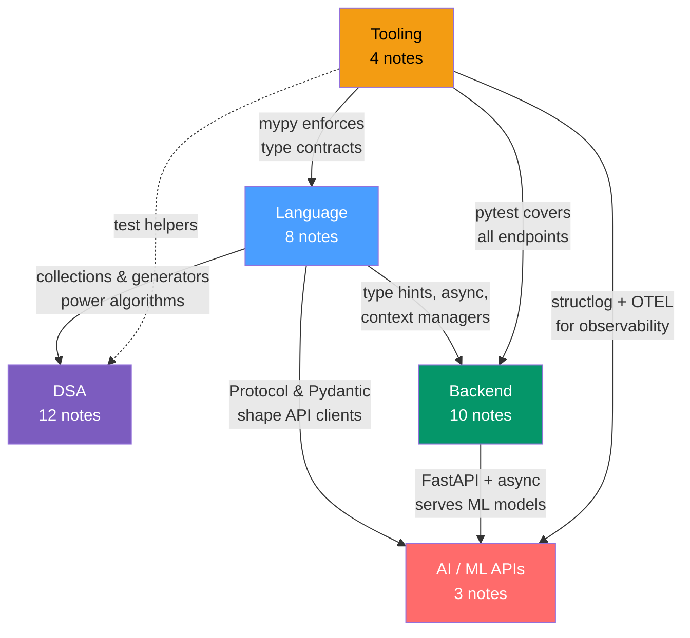

# Python Engineering — Map of Content

> [!info] How to use this map
> This section treats Python as a complete engineering discipline — not just scripting glue. Start with **Language** to build a strong mental model of the runtime, use **Tooling** to set up your workflow, then branch into **DSA**, **Backend**, or **AI/ML APIs** depending on your goal. Come back to the advanced Language notes (Concurrency, Internals, Decorators) after you have real use cases to anchor them.

This vault covers 37 notes across 5 subsections: the Python language core and runtime internals, algorithmic problem-solving in Python, production backend development, LLM/ML API integration, and the tooling ecosystem. It sits inside the broader [[_MOC_AI_ML_Master|AI/ML Master Vault]].

---

## Concept Map

*(Blue = Language core, Purple = DSA, Green = Backend, Red = AI/ML APIs, Orange = Tooling. Solid arrows = "feeds into", dashed = "supports".)*

---

## Learning Path

*Recommended first-pass order. Each phase builds on the previous.*

### Phase 1 — Language Foundation
1. [[Python_Collections]] — learn what data structures exist and their O(n) guarantees before writing a single algorithm
2. [[Python_Data_Model]] — understand the dunder-method contract that every Python framework is built on
3. [[Generators_and_Iterators]] — lazy evaluation and the iterator protocol; required for reading large datasets efficiently
4. [[Context_Managers]] — resource safety pattern used in DB sessions, file I/O, and PyTorch training loops
5. [[Type_Hints_and_Static_Analysis]] — modern typed Python; prerequisite for FastAPI, Pydantic, and clean API clients

### Phase 2 — Tooling Baseline
6. [[Python_Dev_Tools]] — install ruff, mypy, and pre-commit before writing any project code
7. [[Python_Packaging]] — poetry/hatch, venv, and PyPI workflow; know how your project is built
8. [[Python_Testing]] — pytest fixtures, parametrize, and mocking; needed to validate every subsequent section

### Phase 3 — DSA (Interview and Algorithm Track)
9. [[Arrays_and_Strings]] — two pointers and sliding window; the most common interview pattern
10. [[Linked_Lists]] — dummy-head and fast/slow pointer techniques
11. [[Stacks_and_Queues]] — monotonic stack and BFS; return here when solving tree/graph problems
12. [[Sorting_and_Searching]] — binary search templates and `bisect`; used in nearly every medium+ problem
13. [[Binary_Trees]] — traversals, BST, LCA, and the heap property
14. [[Heaps_and_Priority_Queues]] — `heapq` patterns, lazy deletion, and the median-of-a-stream trick
15. [[Graphs]] — BFS/DFS, Dijkstra, Union-Find, and grid problems
16. [[Recursion_and_Backtracking]] — the backtracking template before tackling DP
17. [[Dynamic_Programming]] — `@lru_cache`, tabulation fill-order, and the seven DP pattern families
18. [[Greedy_Algorithms]] — exchange argument and interval scheduling; complements DP
19. [[Bit_Manipulation]] — XOR patterns and bitmask DP; Python arbitrary precision as a superpower
20. [[Trie_and_String_Algorithms]] — Trie class, KMP, Rabin-Karp; for hard string problems

### Phase 4 — Backend Web
21. [[REST_API_Design]] — REST constraints and URL design principles before touching a framework
22. [[FastAPI_Deep_Dive]] — dependency injection, middleware, WebSockets, and testing patterns
23. [[Authentication_and_Authorization]] — bcrypt/Argon2, JWT, OAuth2, and RBAC
24. [[SQLAlchemy_and_Databases]] — Core/ORM, session lifecycle, Alembic migrations, and async
25. [[Django_Fundamentals]] — MVT, QuerySet, migrations, CBVs; the full-stack alternative to FastAPI
26. [[Django_REST_Framework]] — serializers, viewsets, and routers on top of Django
27. [[Async_Python_Web]] — httpx, aiohttp, asyncpg, and aiofiles for async I/O
28. [[Redis_with_Python]] — redis-py, caching patterns, pub/sub, and rate limiting
29. [[Celery_and_Task_Queues]] — Celery workers, Redis broker, beat scheduler, and Flower monitoring
30. [[WebSockets_and_Real_Time]] — WebSocket protocol, FastAPI WS, Socket.IO, and SSE

### Phase 5 — AI/ML API Integration
31. [[ML_Project_Structure]] — project layout, Hydra config, and reproducibility before writing ML code
32. [[OpenAI_API_Python]] — openai v1 client, streaming, function calling, and embeddings
33. [[Anthropic_API_Python]] — anthropic client, tool use, prompt caching, streaming, and batch API

### Phase 6 — Advanced Language (return with real context)
34. [[Decorators_and_Metaprogramming]] — functools, metaclasses, dataclasses; makes more sense after seeing frameworks use them
35. [[Concurrency_in_Python]] — GIL mechanics, threading, multiprocessing, asyncio, and TaskGroup
36. [[Python_Internals]] — CPython bytecode, reference counting, GC, `__slots__`, and profiling
37. [[Python_Logging_and_Observability]] — logging module, structlog, OpenTelemetry, and Sentry

---

## All Notes in This Section

### Language (8 notes)

| Note | Core Idea | Difficulty |
|------|-----------|------------|
| [[Python_Collections]] | `list`/`dict`/`set` internals, `deque`, `Counter`, `defaultdict`, `heapq` time complexities | Intermediate |
| [[Python_Data_Model]] | Dunder methods let your objects speak native Python; ABCs and Protocols make contracts explicit | Intermediate |
| [[Generators_and_Iterators]] | Iterator protocol, `yield from`, `itertools`, and async generators for lazy, memory-efficient pipelines | Intermediate |
| [[Context_Managers]] | `__enter__`/`__exit__`, `@contextmanager`, `ExitStack`, and async context managers | Intermediate |
| [[Type_Hints_and_Static_Analysis]] | PEP 484, `TypeVar`, `Protocol`, Pydantic v2, and `mypy` for statically safe Python | Intermediate |
| [[Decorators_and_Metaprogramming]] | Stacked decorators, `functools`, metaclasses, and `dataclasses` for code generation | Advanced |
| [[Concurrency_in_Python]] | GIL, threading, multiprocessing, `asyncio` event loop, and `TaskGroup` | Advanced |
| [[Python_Internals]] | CPython bytecode, reference counting, cyclic GC, `__slots__`, and profiling with `cProfile` | Advanced |

### DSA (12 notes)

| Note | Core Idea | Difficulty |
|------|-----------|------------|
| [[Arrays_and_Strings]] | Two pointers, sliding window, prefix sums, and hash-map frequency patterns | Intermediate |
| [[Linked_Lists]] | Dummy-head sentinel, fast/slow pointers, LRU cache with `OrderedDict`, Floyd's cycle detection | Intermediate |
| [[Stacks_and_Queues]] | Monotonic stack, BFS with `deque`, sliding-window maximum via deque | Intermediate |
| [[Sorting_and_Searching]] | Timsort internals, binary search templates, `bisect`, and quick-select | Intermediate |
| [[Binary_Trees]] | Iterative and recursive traversals, BST invariant, LCA, serialize/deserialize, heap as array | Intermediate |
| [[Heaps_and_Priority_Queues]] | `heapq` API, max-heap negation trick, lazy deletion, and the median-of-a-stream pattern | Intermediate |
| [[Recursion_and_Backtracking]] | Backtracking template, state/choose/unchoose, N-Queens, permutations, and subset enumeration | Intermediate |
| [[Greedy_Algorithms]] | Exchange argument proof, interval scheduling, Huffman coding, and Dijkstra as greedy | Intermediate |
| [[Bit_Manipulation]] | Bit tricks, XOR identity/swap, bitmask DP, and Python's arbitrary-precision integers | Intermediate |
| [[Graphs]] | BFS/DFS, Dijkstra with `heapq`, Union-Find, topological sort, and grid problem templates | Advanced |
| [[Dynamic_Programming]] | `@lru_cache`, tabulation fill-order, space compression, knapsack, interval DP, state machine | Advanced |
| [[Trie_and_String_Algorithms]] | Trie class, KMP failure function, Rabin-Karp rolling hash, Z-algorithm, Manacher's palindrome | Advanced |

### Backend (10 notes)

| Note | Core Idea | Difficulty |
|------|-----------|------------|
| [[REST_API_Design]] | REST constraints, resource-oriented URL design, HTTP semantics, pagination, and versioning | Intermediate |
| [[Authentication_and_Authorization]] | Password hashing with bcrypt/Argon2, JWT lifecycle, OAuth2 flows, RBAC, and CORS | Intermediate |
| [[Django_Fundamentals]] | MVT pattern, QuerySet lazy evaluation, migrations, CBVs, signals, and the admin | Intermediate |
| [[Django_REST_Framework]] | Serializers, generic views, viewsets, routers, permissions, and throttling | Intermediate |
| [[Redis_with_Python]] | `redis-py` client, cache-aside/write-through patterns, pub/sub, and token-bucket rate limiting | Intermediate |
| [[SQLAlchemy_and_Databases]] | SQLAlchemy Core vs ORM, session lifecycle, relationship loading, Alembic, and async engine | Advanced |
| [[FastAPI_Deep_Dive]] | Dependency injection graph, middleware, WebSocket endpoints, lifespan events, and `TestClient` | Advanced |
| [[Async_Python_Web]] | `httpx`, `aiohttp`, `asyncpg`, and `aiofiles` for fully async I/O without blocking the event loop | Advanced |
| [[Celery_and_Task_Queues]] | Celery worker architecture, Redis broker, result backend, beat scheduler, and Flower monitoring | Advanced |
| [[WebSockets_and_Real_Time]] | WebSocket protocol, FastAPI WS handler, Socket.IO rooms, and Server-Sent Events | Advanced |

### AI / ML APIs (3 notes)

| Note | Core Idea | Difficulty |
|------|-----------|------------|
| [[ML_Project_Structure]] | `src/` layout, Hydra config hierarchy, Typer CLI, reproducibility with seed management | Intermediate |
| [[OpenAI_API_Python]] | `openai` v1 client, streaming with `stream=True`, function/tool calling, and embeddings API | Intermediate |
| [[Anthropic_API_Python]] | `anthropic` client, tool use, prompt caching with `cache_control`, streaming, and batch API | Intermediate |

### Tooling (4 notes)

| Note | Core Idea | Difficulty |
|------|-----------|------------|
| [[Python_Dev_Tools]] | `ruff` lint/format, `black`, `isort`, `mypy`, `pre-commit` hooks, and `bandit` security scanning | Beginner |
| [[Python_Packaging]] | `poetry` and `hatch` for dependency management, `pip` internals, PyPI publishing, and `venv` | Beginner |
| [[Python_Testing]] | `pytest` fixtures, `conftest.py`, `parametrize`, `unittest.mock`, `pytest-anyio`, and coverage | Intermediate |
| [[Python_Logging_and_Observability]] | `logging` module hierarchy, `structlog`, OpenTelemetry traces/metrics, and Sentry integration | Intermediate |

---

## Key Questions This Section Answers

- How does Python's data model let third-party libraries like NumPy and PyTorch feel native?
- When should I use threading, multiprocessing, or asyncio — and what does the GIL actually prevent?
- What are the five algorithmic patterns that solve 80% of LeetCode medium problems?
- How do I structure a FastAPI service with proper dependency injection, auth, and async DB access?
- How do I call OpenAI and Anthropic APIs with streaming, tool use, and error handling in production?
- How do I set up a Python project (linting, typing, testing, packaging) correctly from day one?
- When does `@lru_cache` memoization break and how does tabulation DP avoid Python's recursion limit?

---

## Connections to Other Topics

- [[_MOC_AI_ML_Master|AI/ML Master Vault]] — this section provides the Python implementation layer for all other sections in the vault
- [[_MOC_Foundations]] — `Python_for_ML` and `NumPy_Fundamentals` in Foundations complement this section's Language notes; the Data Model note explains how `ndarray` works at the protocol level
- [[_MOC_Deep_Learning]] — PyTorch's `DataLoader` iterates via `__len__` / `__getitem__` (Data Model); the Concurrency note explains `num_workers` and the GIL; Context Managers covers `torch.no_grad()`
- [[_MOC_Generative_AI]] — `OpenAI_API_Python` and `Anthropic_API_Python` are the implementation layer for the Agents and LLM Apps notes in Generative AI
- [[_MOC_MLOps]] — `ML_Project_Structure`, `Python_Logging_and_Observability`, and `Python_Packaging` feed directly into MLOps tooling (experiment tracking, model serving, CI/CD)
- [[_MOC_AI_System_Design]] — FastAPI, SQLAlchemy, Redis, and Celery notes provide the concrete backend building blocks referenced in AI System Design case studies
