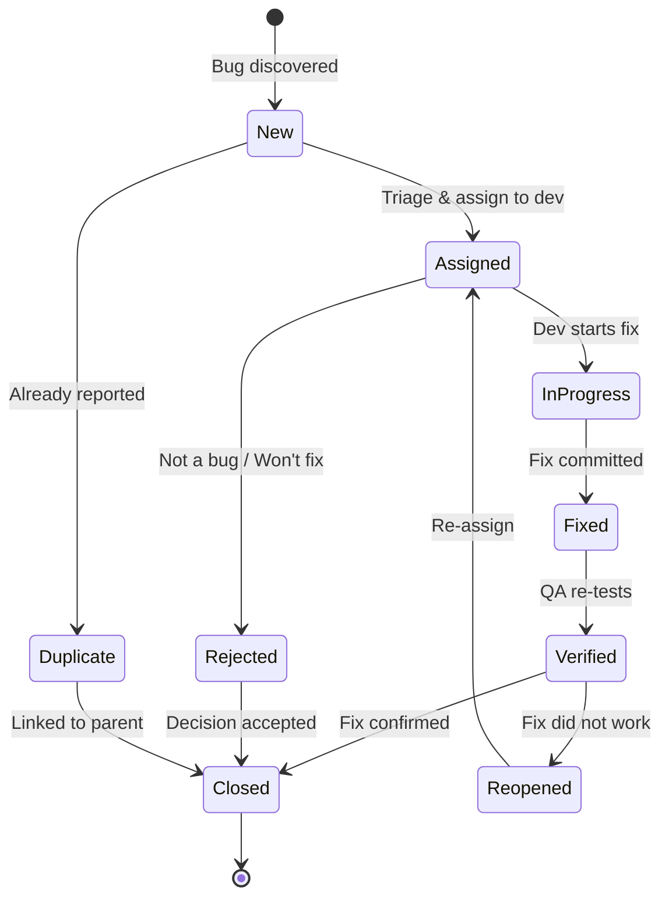

# Bug Lifecycle

> [!abstract] TL;DR
> A great bug report is a **reproducible recipe**: title, environment, exact steps to reproduce, actual vs expected result, severity, and attached evidence (logs, screenshots). Severity measures impact on the system (Critical crashes everything); Priority measures urgency for the business (High must be fixed this sprint). The bug lifecycle moves from New → Assigned → In Progress → Fixed → Verified → Closed, with a Reopened path if verification fails. Root cause analysis (5-whys, fishbone) turns bug fixes into process improvements.

---

## Bug Report Anatomy

```
┌─────────────────────────────────────────────────────────────────┐
│ Title: Payment checkout crashes with NullPointerException       │
│        when cart contains a deleted product                     │
├─────────────────────────────────────────────────────────────────┤
│ Environment:  Production / v2.4.1 / Chrome 124 / macOS 14.4    │
│ Reporter:     Alice (QA)  │  Date: 2026-07-29                   │
│ Severity:     Critical    │  Priority: High                     │
│ Component:    Checkout Service                                  │
├─────────────────────────────────────────────────────────────────┤
│ Steps to Reproduce:                                             │
│  1. Add product SKU-789 to cart                                 │
│  2. Admin deletes product SKU-789 from catalogue                │
│  3. User proceeds to checkout (POST /api/checkout)              │
│  4. Observe: 500 Internal Server Error                          │
├─────────────────────────────────────────────────────────────────┤
│ Actual Result:                                                  │
│   HTTP 500; logs show: NullPointerException at                  │
│   CheckoutService.java:142 — product.getPrice() on null object  │
├─────────────────────────────────────────────────────────────────┤
│ Expected Result:                                                │
│   HTTP 409 Conflict with body:                                  │
│   { "error": "PRODUCT_UNAVAILABLE", "sku": "SKU-789" }         │
│   Cart updated to remove unavailable item                       │
├─────────────────────────────────────────────────────────────────┤
│ Evidence: [screenshot.png] [server.log] [curl_command.txt]      │
│ Reproducible: Always (100%)  │  Regression: No (new feature)   │
└─────────────────────────────────────────────────────────────────┘
```

**Writing a great title**: `[Component] [Action] causes [unexpected behaviour] when [condition]`
- Good: "Checkout service throws NPE when cart contains deleted product"
- Bad: "Checkout broken" / "Bug in payment"

---

## Severity vs Priority

| | Severity (Technical impact) | Priority (Business urgency) |
|--|---------------------------|---------------------------|
| **Definition** | How badly does it affect the system? | How urgently must it be fixed? |
| **Set by** | QA / Developer | Product Manager / Business |
| **Example mismatch** | Typo on the CEO's name on About page: **Low severity**, **High priority** | Race condition in logging: **High severity**, **Low priority** |

### Severity Levels

| Level | Definition | Example |
|-------|-----------|---------|
| **Critical (S1)** | System crash, data loss, security breach — no workaround | Server crashes on login; payment charges wrong amount |
| **High (S2)** | Major feature broken — no workaround | Checkout always fails; file upload broken |
| **Medium (S3)** | Feature partially broken — workaround exists | Sort order wrong; slow loading on edge case |
| **Low (S4)** | Cosmetic or minor inconvenience | Typo, misaligned UI element, minor colour issue |

---

## Bug Lifecycle (State Machine)



**State definitions**:
- **New**: freshly filed, not yet triaged
- **Assigned**: dev assigned in sprint/backlog
- **In Progress**: dev is actively working on fix
- **Fixed**: PR merged, awaiting QA verification
- **Verified**: QA confirmed fix on staging
- **Closed**: fix verified in production or test environment
- **Reopened**: verification failed — original bug persists or fix introduced regression
- **Rejected**: triage determined it's expected behaviour, out of scope, or a duplicate

---

## Jira Bug Workflow

```bash
# Common Jira issue types for bugs
# Bug → Sub-task for investigation, Story for the fix

# Example Jira CLI (jira-cli)
jira issue create \
  --project MYAPP \
  --type Bug \
  --summary "Checkout NPE when cart has deleted product" \
  --priority Critical \
  --label "regression" \
  --component "Checkout Service" \
  --description "$(cat bug_description.md)"

# Transition a bug to In Progress
jira issue transition MYAPP-4321 "In Progress"

# Link to related stories
jira issue link MYAPP-4321 MYAPP-4200 "is caused by"
```

**Useful Jira JQL queries**:

```jql
-- All open Critical bugs in current sprint
project = MYAPP AND issuetype = Bug AND priority = Critical 
AND sprint in openSprints() ORDER BY created DESC

-- Bugs escaped to production this quarter
project = MYAPP AND issuetype = Bug AND labels = "production-escape"
AND created >= startOfQuarter()

-- Bugs reopened more than once (quality signal)
project = MYAPP AND issuetype = Bug AND timesInStatus("Verified") > 1
```

---

## Root Cause Analysis

### 5-Whys Example

**Bug**: Payment service charges customers twice intermittently.

1. **Why** did customers get charged twice? → The payment service retried on timeout
2. **Why** did it retry? → The network call timed out after 5 seconds
3. **Why** did the network call time out? → The payment gateway was under load (10–15s response)
4. **Why** was there no idempotency check? → The retry logic didn't pass the idempotency key
5. **Why** wasn't the idempotency key implemented? → No requirement specified it; developer was unaware of Stripe's idempotency key feature

**Root cause**: Missing requirement for idempotent payment requests.
**Fix**: Add idempotency key to all charge requests + add integration test for retry scenario.
**Process fix**: Add "idempotency requirements" to API design checklist.

### Fishbone (Ishikawa) Diagram

```
                    Production Bug Escape
                           │
       ┌───────────────────┼───────────────────┐
       │                   │                   │
   Process               People              Tools
   ├─ No code review    ├─ Dev new to       ├─ No static
   │  checklist            payment APIs        analysis
   ├─ Bug escaped        ├─ QA didn't       ├─ No contract
   │  UAT                  test retries        test
   └─ No regression                        └─ No integration
      for new edge cases                      environment
```

---

## Defect Clustering Principle (Pareto)

**~80% of bugs are found in ~20% of modules.** Track which components generate the most defects — these high-defect modules need:
- Extra test coverage (unit + integration)
- Code review by senior engineers
- Architectural review (often defect-prone code has design issues)
- Possible refactoring to reduce complexity (high cyclomatic complexity correlates with defect density)

---

## Zero Bug Policy

**Philosophy**: treat every known bug as a debt that costs more the longer it sits. Rather than a backlog of hundreds of bugs, keep the bug count at zero by:
1. Triage every bug within 24 hours
2. Critical/High bugs: fix in the current sprint (break normal sprint flow if needed)
3. Medium bugs: fix in the next sprint
4. Low bugs: fix or close (accept as known limitation with documentation)

Not practical for all teams but sets a quality mindset: bugs are not normal; they represent rework debt.

---

## Common Pitfalls

1. **Vague titles** — "login broken" tells the developer nothing; a good title is a complete sentence with component + action + condition
2. **Steps to reproduce are incomplete** — missing preconditions means the developer can't reproduce the bug; always include environment, user role, and seed data
3. **Conflating severity and priority** — a low-severity typo on the CEO's name may be Priority Critical; developers should not unilaterally change priority
4. **Not reopening when fix is partial** — if verification catches even a slightly different behaviour, reopen; don't close with "good enough"
5. **Skipping root cause analysis** — fixing the symptom without finding the root cause means the same class of bug will reappear elsewhere

---

## Review Questions

1. Write a complete bug report for a scenario where a user's shopping cart is emptied after clicking "Back" in the browser.
2. What is the difference between severity and priority? Give an example of a low-severity, high-priority bug.
3. Trace through the bug lifecycle states for a bug that is fixed, fails QA verification, and is then fixed again successfully.
4. Apply the 5-whys technique to: "Users report they are logged out unexpectedly after ~10 minutes of inactivity."

---

## Related Notes

- [[_MOC_QA_Testing_Master|↑ QA Testing MOC]]
- [[QA_Overview]]
- [[Testing_in_Agile]]
- [[Test_Case_Design]]

---

#QA #Testing #BugLifecycle #Defects #Jira
