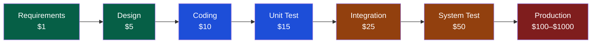

# QA Overview

> [!abstract] TL;DR
> QA (Quality Assurance) ensures the process produces quality; QC (Quality Control) inspects the output for defects; Testing verifies specific behaviours. The testing pyramid (unit → integration → E2E) guides investment allocation: fast, cheap unit tests form the wide base; slow, expensive E2E tests are the narrow top. Shift-left means finding defects earlier in the SDLC, where fixing them is 10–100x cheaper.

---

## QA vs QC vs Testing

| Concept | Focus | Who | When | Example |
|---------|-------|-----|------|---------|
| **QA** (Quality Assurance) | Process improvement | QA team + whole team | Throughout SDLC | Writing test plans, defining DoD, code review standards |
| **QC** (Quality Control) | Product inspection | QA team | After build | Running regression suite, UAT sign-off |
| **Testing** | Defect detection | Dev + QA | Per feature | Writing and running unit/integration/E2E tests |

QA is **proactive** (prevent defects); QC is **reactive** (find defects). Testing is the hands-on execution that feeds QC, and the process learnings feed QA.

---

## Testing Pyramid

```
         ┌─────────────┐
         │    E2E       │  ← Few, slow, expensive, high confidence
         ├─────────────┤
         │ Integration  │  ← Some, moderate cost
         ├─────────────┤
         │    Unit      │  ← Many, fast, cheap, isolated
         └─────────────┘
```

**Recommended ratio**: 70% unit / 20% integration / 10% E2E.

- **Unit** — test a single function/class in isolation; milliseconds per test; mock all dependencies
- **Integration** — test interaction between 2+ real components (e.g., service + real DB); seconds per test
- **E2E** — test full user workflow through the deployed system; minutes per test; most fragile

The **ice cream cone anti-pattern** (inverted pyramid) is common in legacy projects: mostly manual/E2E, almost no unit tests — slow, expensive, high false-negative rate.

---

## Testing Quadrants (Agile Testing Quadrants)

|  | **Business-Facing** | **Technology-Facing** |
|--|--------------------|-----------------------|
| **Support Team** (Q2 / Q1) | Functional tests, story tests, prototypes (Q2) | Unit tests, component tests, TDD (Q1) |
| **Critique Product** (Q3 / Q4) | Exploratory, usability, UAT, alpha/beta (Q3) | Performance, load, security, "ility" tests (Q4) |

- **Q1** (automated, tech-facing): unit + integration tests; guide development
- **Q2** (automated + manual, business-facing): functional acceptance tests; BDD scenarios
- **Q3** (manual, business-facing): exploratory, usability; critique the product
- **Q4** (tools, tech-facing): performance, security; protect the product

---

## Cost of Defects — Shift-Left Principle



**Shift-left**: involve testing as early as possible — review requirements for ambiguity, review design for testability, write unit tests before or alongside code (TDD). A defect caught at requirements review costs ~$1 to fix; the same defect found in production costs $100–$1000+.

---

## SDLC Testing Phases

| Phase | Testing Activity | Deliverable |
|-------|-----------------|-------------|
| Requirements | Requirements review, ambiguity check | Test basis, test conditions list |
| Design | Design review, architecture walkthrough | Test strategy, testability assessment |
| Coding | Unit tests, code review, static analysis | Unit test suite, coverage report |
| Integration | Integration testing, API contract tests | Integration test suite |
| System | System testing, regression, smoke/sanity | System test report |
| UAT | User acceptance testing, beta testing | UAT sign-off, go/no-go decision |

---

## Testing in Agile

**Sprint testing workflow**:
1. **Sprint planning**: QA contributes acceptance criteria to stories (three amigos)
2. **During sprint**: dev writes unit tests; QA automates acceptance tests alongside dev
3. **Definition of Done (DoD)** includes: unit tests pass, integration tests pass, automation coverage maintained, no new high-severity bugs
4. **Sprint review**: demo to stakeholders including QA sign-off

**BDD in Agile**: Gherkin scenarios written collaboratively by Dev + QA + BA (three amigos) before coding starts. The scenario serves as both specification and automated test.

**Exploratory testing**: time-boxed, charter-driven investigation of the sprint's new functionality. Not scripted — tester uses domain knowledge to probe edge cases the automated suite may miss.

---

## QA Metrics

| Metric | Formula | Target |
|--------|---------|--------|
| **Defect Density** | Bugs per KLOC or per story point | Trending down sprint over sprint |
| **Test Coverage** | Lines/branches covered ÷ total | ≥80% line coverage for critical paths |
| **Escape Rate** | Bugs found in prod ÷ total bugs found | <5% (low production escapes) |
| **MTBF** (Mean Time Between Failures) | Total uptime ÷ number of failures | Trending up |
| **MTTR** (Mean Time To Recover) | Total downtime ÷ number of incidents | <1 hour for P1 |
| **Automation Coverage Growth** | New automated tests per sprint | Positive each sprint |

---

## Common Pitfalls

1. **QA as gatekeeper, not collaborator** — embedding QA at the end of the sprint creates a bottleneck and adversarial relationship; shift to whole-team quality
2. **Ignoring the pyramid** — writing all tests as E2E because "they test everything" leads to slow, brittle suites that fail constantly
3. **Vanity metrics** — reporting line coverage without branch coverage gives false confidence; a function can be 100% line-covered with zero meaningful assertions
4. **Skipping requirements review** — the cheapest place to catch defects is before a line of code is written; invest 30 minutes in a requirements walkthrough
5. **Treating automation as a phase** — automation is not a project to "do once"; it requires continuous maintenance and investment per sprint

---

## Review Questions

1. What is the difference between QA, QC, and Testing? Give a concrete example of each in a Scrum team.
2. Explain the testing pyramid and the "ice cream cone anti-pattern". Why is the anti-pattern problematic?
3. How does the cost of defects change across SDLC phases, and how does the shift-left principle address this?
4. Which testing quadrant covers performance and security testing, and why are these classified separately from functional tests?

---

## Related Notes

- [[_MOC_QA_Testing_Master|↑ QA Testing MOC]]
- [[Test_Types_and_Strategies]]
- [[Testing_in_Agile]]
- [[_MOC_Java_Testing|Java Testing MOC]]
- [[_MOC_DevOps_Master|DevOps MOC]]

---

#QA #Testing #Foundations
