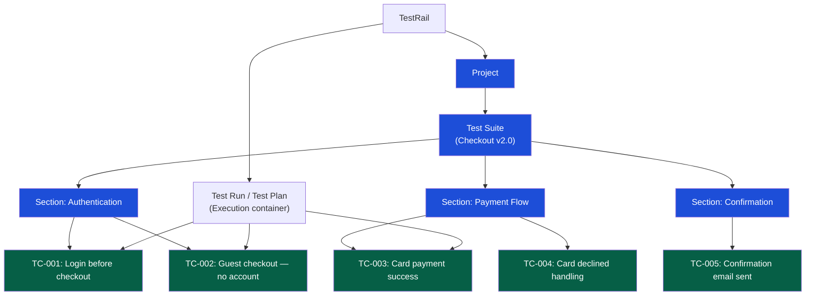

# Test Management Tools

> [!abstract] TL;DR
> Test management tools are the operational system of record for QA: they store test cases, track test plan execution, link tests to requirements, and report coverage and progress. The right tool depends on whether your team is Jira-centric (Xray or Zephyr Scale integrate natively), test-case-volume-heavy (TestRail's structured organization excels), or needs enterprise reporting (qTest). The traceability matrix — linking requirements to test cases to bugs — is the universal output that all these tools must produce for audit and coverage analysis.

---

## Why Test Management Tools Exist

Ad hoc test management (spreadsheets, wiki pages) breaks down when:
- Test case count exceeds ~100 (search, organization, and deduplication become impossible)
- Multiple testers run the same test plan concurrently (conflicts, missing results)
- Auditors ask "which test covers requirement REQ-042?" (no linkage without a tool)
- Management asks "what percentage of test cases have been executed this sprint?" (no dashboard)
- A bug is found in production that should have been caught (no proof of what was tested)

---

## Tool Comparison

| Tool | Best For | Jira Integration | Pricing | Notable Feature |
|---|---|---|---|---|
| **TestRail** | High-volume test suites; test-case-centric teams | Via plugin | Per-seat SaaS | Best-in-class test case organization; milestones |
| **Zephyr Scale** | Jira-native teams; agile QA | Native (Jira app) | Per-agent | BDD step library; cross-project cycles |
| **qTest** | Enterprise; compliance-heavy orgs | Strong | Enterprise pricing | Requirements traceability; compliance reporting |
| **Xray** | Jira-native; BDD teams using Cucumber/Gherkin | Native (Jira app) | Per-user | Runs Cucumber features as test cases; Gherkin support |
| **Azure Test Plans** | Microsoft/Azure DevOps shops | Azure DevOps native | Per-user | Exploratory testing sessions; load test integration |
| **Spreadsheet (Excel/Sheets)** | Tiny teams; PoC | None | Free | Simple; breaks at scale |

---

## Test Plan Structure

A test plan is the governance document that defines what will be tested, how, by whom, and against what success criteria. It is written before testing begins.

```markdown
# Test Plan: Checkout v2.0 Release

## 1. Scope
  In scope:  Guest checkout, registered user checkout, payment flow (card/PayPal)
  Out of scope: Admin portal, reporting, mobile app (separate plan)

## 2. Test Objectives
  - Verify all acceptance criteria for US-4021 through US-4055 are met
  - Regression: Ensure no existing checkout flows are broken
  - Performance: Checkout P95 < 300ms at 500 concurrent users

## 3. Test Types
  - Functional testing: API tests (REST Assured), E2E (Playwright)
  - Security: OWASP ZAP scan, IDOR tests on order endpoints
  - Accessibility: Axe automated + NVDA manual screen reader test
  - Performance: k6 load test (500 users, 10-min soak)

## 4. Entry Criteria (testing cannot start until these are met)
  - All user stories in scope have Accepted status from PM
  - Staging environment is deployed with production-equivalent data
  - API test suite passes in staging environment
  - No P1 or P2 bugs open from previous test cycle

## 5. Exit Criteria (testing is complete when these are met)
  - 100% of test cases executed
  - No open P1 or P2 bugs
  - P3/P4 bugs documented with PM sign-off to defer
  - Test report published to Confluence

## 6. Roles
  Lead QA: Alice
  API testing: Bob
  E2E automation: Carol
  Security review: Dave (Security team)

## 7. Schedule
  Test execution: June 10–21
  Bug fix window: June 22–25
  Re-test: June 26–27
  Go/No-go: June 28

## 8. Risk
  Risk: Stripe sandbox reliability in staging environment
  Mitigation: Mock Stripe for unit/integration; use live sandbox only for E2E
```

---

## TestRail: Hands-On

TestRail is the most widely used dedicated test management tool.



### TestRail Key Concepts

| Concept | Description |
|---|---|
| **Test Suite** | Collection of test cases for a product area or release |
| **Section** | Folder within a suite for organizing by feature or flow |
| **Test Case** | Individual test with preconditions, steps, expected results |
| **Test Run** | Execution container: pick cases from a suite, assign testers, track results |
| **Test Plan** | Group of test runs (e.g., Regression + Smoke + Exploratory) for a release |
| **Milestone** | Release marker; test plans can be linked to milestones for tracing |

### TestRail API (CI Integration)

```python
# Update test result via TestRail API from automated test
import requests
from requests.auth import HTTPBasicAuth

TESTRAIL_URL = "https://yourorg.testrail.io/index.php?/api/v2"
AUTH = HTTPBasicAuth("qa@example.com", "api_key_here")

def add_result(run_id: int, case_id: int, status: int, comment: str = ""):
    """
    status: 1=Passed, 2=Blocked, 3=Untested, 4=Retest, 5=Failed
    """
    resp = requests.post(
        f"{TESTRAIL_URL}/add_result_for_case/{run_id}/{case_id}",
        auth=AUTH,
        json={"status_id": status, "comment": comment}
    )
    resp.raise_for_status()
    return resp.json()

# In pytest conftest.py — post results after each test
def pytest_runtest_makereport(item, call):
    if call.when == "call":
        case_id = item.get_closest_marker("testrail")
        if case_id:
            status = 1 if call.excinfo is None else 5
            add_result(
                run_id=int(os.environ["TESTRAIL_RUN_ID"]),
                case_id=case_id.args[0],
                status=status,
                comment=str(call.excinfo) if call.excinfo else "Passed"
            )

# Usage in test:
@pytest.mark.testrail(1042)  # TC-1042 in TestRail
def test_card_payment_success():
    ...
```

---

## Xray for Jira: BDD-Native Test Management

Xray stores test cases as Jira issues (type: Test), enabling native linking to user stories and bugs.

```gherkin
# Xray Test (Gherkin format, stored in Jira issue TEST-042):
Feature: Card payment
  
  @regression @checkout
  Scenario: Successful card payment completes order
    Given I have items in my cart
    And I am on the checkout page
    When I enter valid card details
      | number   | 4111111111111111 |
      | expiry   | 12/28            |
      | cvv      | 123              |
    And I click "Place Order"
    Then I see the order confirmation page
    And I receive an order confirmation email
```

```yaml
# Xray CI integration — publish results from Playwright/Cucumber
- name: Run E2E tests
  run: npx playwright test --reporter=junit

- name: Import results to Xray
  run: |
    curl -H "Content-Type: application/xml" \
      -u "$JIRA_USER:$JIRA_TOKEN" \
      -X POST \
      "https://yourorg.atlassian.net/rest/raven/1.0/import/execution/junit?projectKey=QA" \
      --data @test-results/junit.xml
```

---

## The Traceability Matrix

A traceability matrix links requirements to test cases to bugs, providing proof of coverage and enabling impact analysis.

```
Requirement Traceability Matrix — Checkout v2.0

| Req ID | Requirement | Test Cases | Bugs | Coverage |
|--------|-------------|------------|------|----------|
| REQ-041 | Guest can checkout without creating account | TC-001, TC-002, TC-003 | BUG-221 | ✓ Covered |
| REQ-042 | Card payment accepts Visa, Mastercard, Amex | TC-010 through TC-015 | — | ✓ Covered |
| REQ-043 | Payment failure shows user-friendly message | TC-016, TC-017 | — | ✓ Covered |
| REQ-044 | Confirmation email sent within 60 seconds | TC-025 | BUG-234 | ✓ Covered |
| REQ-045 | Order total correct with discount codes | TC-030, TC-031, TC-032 | — | ✓ Covered |
| REQ-046 | Checkout accessible at WCAG 2.1 AA | TC-040 (axe), TC-041 (NVDA) | BUG-240 | ⚠ In Progress |
| REQ-047 | Checkout completes in < 3 seconds at P95 | TC-050 (k6 load test) | — | ✗ Not Yet Tested |

Coverage Summary:
  Total requirements: 7
  Fully covered: 5 (71%)
  In progress: 1 (14%)
  Not tested: 1 (14%)
  Open P1/P2 bugs: 0
  Open P3/P4 bugs: 3
```

### Building a Traceability Matrix in Xray

In Xray, traceability is automatic: Test issues are linked to Story issues (`Tests` link type), and Bug issues are linked to Test issues that discovered them. The traceability matrix report is generated from these links.

### Requirements Coverage Formula

```
Requirements Coverage = (Requirements with ≥1 passing test) / Total requirements × 100

Target per sprint: 100% of in-scope requirements covered by automated or documented tests
Minimum for go-live: 0 open P1/P2 bugs, 100% of must-have requirements with passing tests
```

---

## Trade-offs

| Factor | TestRail | Zephyr Scale | Xray | qTest |
|---|---|---|---|---|
| Setup effort | Medium | Low (Jira) | Low (Jira) | High |
| Learning curve | Low | Medium | Medium | High |
| Jira traceability | Plugin required | Native | Native | Via API |
| BDD/Gherkin support | Basic | Good | Excellent | Good |
| Reporting | Excellent | Good | Good | Excellent |
| Enterprise compliance | Good | Good | Good | Best |
| Cost | Mid | Per-agent | Per-user | High |

---

## Common Pitfalls

1. **Test cases not linked to requirements** — A test case that is not linked to a requirement provides coverage information but cannot prove the requirement is tested. Every test case should trace to at least one requirement or user story.
2. **Stale test cases** — Test cases written for an old feature version that no longer reflect the current behavior. Assign a "last reviewed" date and audit per release.
3. **Running without entry criteria** — Executing tests before the staging environment is stable produces unreliable results and wastes tester time.
4. **Treating the traceability matrix as an output, not an input** — The matrix should drive test design: missing coverage is visible before testing, not discovered during it.
5. **Manual-only result entry** — Manually updating 200 test results after an automated run is error-prone and slow. Integrate CI with the tool's API to post results automatically.

---

## Review Questions

1. A requirements audit asks: "Which tests cover REQ-042?" How does a traceability matrix answer this, and what tool feature enables it?
2. Your team is Jira-native and uses Cucumber for BDD tests. Which test management tool is the best fit, and why?
3. What are entry and exit criteria in a test plan, and what risk does skipping them create?
4. How would you automate posting pytest results to TestRail from a CI pipeline? Sketch the integration steps.

---

## Related Notes

- [[_MOC_QA_Testing_Master|↑ QA Testing MOC]]
- [[Test_Case_Design]]
- [[Bug_Lifecycle]]
- [[Testing_in_Agile]]
- [[CI_CD_Testing_Integration]]

---

#QA #Testing #TestManagement #TestRail #Zephyr #Xray #TraceabilityMatrix
