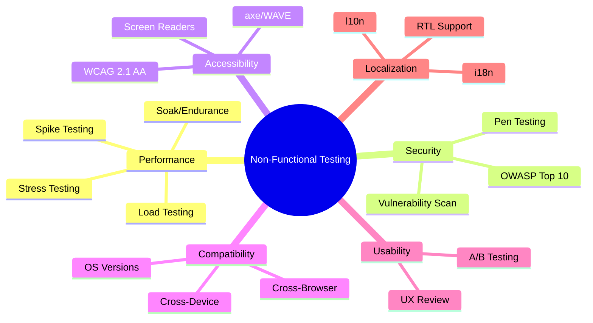

# Test Types and Strategies

> [!abstract] TL;DR
> Testing splits into **functional** (does it do what the spec says?) and **non-functional** (how well does it do it — performance, security, accessibility). A test strategy is the high-level approach for a project; a test plan is the tactical schedule; a test case is a single executable check. Risk-based testing directs effort at high-probability × high-impact areas first. Core design techniques — equivalence partitioning, boundary value analysis, decision tables, state transition — systematically derive test cases from specifications without needing to read code.

---

## Functional Testing Types

| Type | Scope | Who Runs It | When |
|------|-------|-------------|------|
| **Unit** | Single function/class | Developer | During coding (TDD) |
| **Integration** | 2+ components together | Dev + QA | After unit tests pass |
| **System** | Entire deployed application | QA | Before UAT |
| **Regression** | Previously working features | QA (automated) | Every commit/sprint |
| **Smoke** | Critical happy paths only | QA | After each deployment |
| **Sanity** | Narrow area after a fix | QA | After bug fix deployed |
| **UAT** | Business requirements | Business/End-users | Before go-live |

**Smoke vs Sanity**: Smoke tests are broad ("is the system alive?") — login works, homepage loads, payment flows. Sanity tests are narrow ("does this specific fix work?") — run after a targeted bug fix to verify the fix without full regression.

**Regression vs Retesting**: Retesting checks that a specific bug is fixed. Regression checks that fixing the bug hasn't broken something else.

---

## Non-Functional Testing



**Performance subtypes**:
- **Load test**: expected peak traffic — "can 1000 concurrent users checkout?"
- **Stress test**: beyond capacity to find breaking point — "what happens at 5000 users?"
- **Spike test**: sudden traffic burst — "flash sale scenario"
- **Soak/Endurance test**: sustained load over hours — "does memory leak under 500 users for 8 hours?"

---

## Test Strategy vs Test Plan vs Test Case

| Artifact | Answers | Level | Example |
|----------|---------|-------|---------|
| **Test Strategy** | What, Why, How (high level) | Project/Program | "We will use risk-based prioritisation; automation threshold is 80% of regression suite; production bugs treated as P0" |
| **Test Plan** | Who, When, Where, Resources | Release | "Sprint 12 test plan: 3 QA engineers, 5-day window, environment: staging-v2, tools: Playwright + Postman" |
| **Test Case** | Exactly what to execute | Scenario | "TC-042: Verify that checkout with expired credit card returns HTTP 402 with error code CARD_EXPIRED" |

A **test suite** is a collection of test cases grouped by feature or component.

---

## Risk-Based Testing

**Risk = Probability of failure × Impact of failure**

```
                    High Impact
                         │
    Invest heavily ────► │ ◄──── Invest heavily
    (monitor closely)    │       (priority focus)
                         │
Low Probability ─────────┼───────── High Probability
                         │
    Skip or defer ──────►│ ◄──── Automate + monitor
                         │
                    Low Impact
```

**Process**:
1. List all features/components
2. Assign probability (1–5): "How likely is this to fail?"
3. Assign impact (1–5): "What happens if it fails?"
4. Risk score = P × I; rank descending
5. Allocate test effort proportional to risk score

High-risk examples: payment processing, authentication, data export. Low-risk examples: static about page, colour theme toggle.

---

## Test Design Techniques

### Equivalence Partitioning (EP)

Divide valid and invalid input into partitions where all values in a partition behave identically. Test one value per partition.

**Example** — age field (valid: 18–99):
- Partition 1 (invalid): < 18 → test with 0 or 17
- Partition 2 (valid): 18–99 → test with 50
- Partition 3 (invalid): > 99 → test with 100 or 150

Testing 3 cases instead of 82 with equal defect-finding power.

### Boundary Value Analysis (BVA)

Bugs cluster at boundaries. Test values: min−1, min, min+1, max−1, max, max+1.

**Example** — age 18–99:
- 17 (below min), **18** (min), **19** (min+1), **98** (max−1), **99** (max), 100 (above max)

BVA generates 6 cases; combined with EP covers both techniques.

### Decision Table Testing

When behaviour depends on combinations of conditions. Enumerate all condition combinations; collapse equivalent actions.

| Condition A (logged in) | Condition B (premium) | Action |
|------------------------|-----------------------|--------|
| No | No | Show login CTA |
| No | Yes | (impossible state) |
| Yes | No | Show upgrade prompt |
| Yes | Yes | Grant access |

### State Transition Testing

For systems with defined states and transitions. Map: states → events → transitions → actions.

```
[Idle] --submit--> [Pending] --approved--> [Active]
                      |                       |
                   rejected               cancelled
                      ↓                       ↓
                  [Rejected]             [Cancelled]
```

Test all valid transitions + invalid transitions (e.g., "cancel a Rejected order" — should fail gracefully).

---

## Common Pitfalls

1. **Testing only happy paths** — negative tests (invalid input, auth failures, boundary violations) find more bugs per test than positive paths
2. **Confusing smoke and regression** — deploying to production with only a smoke suite is insufficient; regression catches subtle breakage in untouched code
3. **Skipping non-functional requirements** — performance and security requirements are often undocumented; explicitly discover and document NFRs before the project starts
4. **No EP/BVA — testing arbitrary values** — testing with 25, 50, 75 for an age field misses the boundary bugs at 17/18 and 99/100
5. **Treating risk assessment as one-time** — risk changes as the codebase evolves; re-run risk analysis at the start of each major release

---

## Review Questions

1. A login form accepts usernames of 6–20 characters. Using BVA, list the exact test values you would use.
2. What is the difference between a smoke test and a regression test? When would you run each?
3. Draw a state transition diagram for an order lifecycle (Placed → Paid → Shipped → Delivered, with cancellation states).
4. How would you prioritise test cases for a payment service using risk-based testing?

---

## Related Notes

- [[_MOC_QA_Testing_Master|↑ QA Testing MOC]]
- [[QA_Overview]]
- [[Test_Case_Design]]
- [[Performance_Testing]]
- [[_MOC_Java_Testing|Java Testing MOC]]

---

#QA #Testing #Strategy #Foundations
