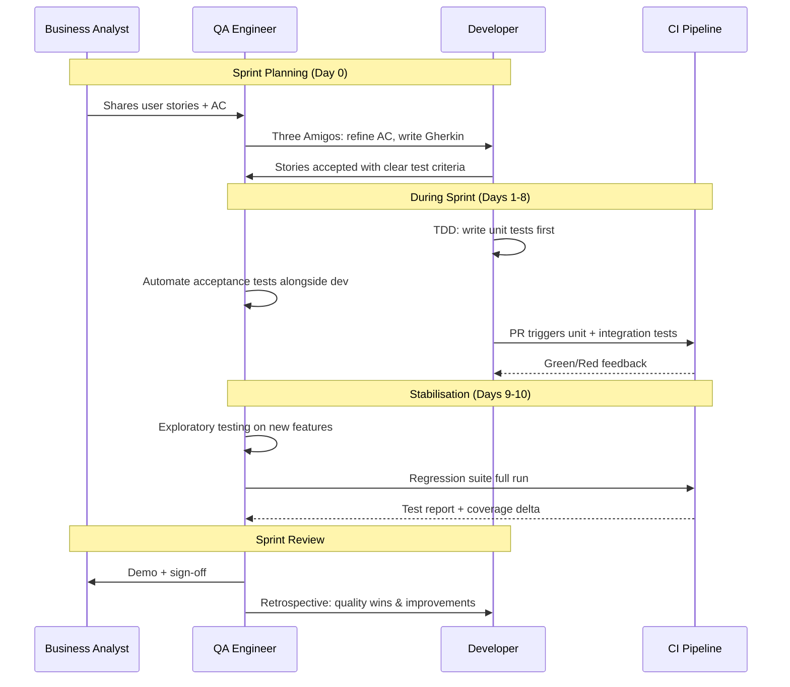

# Testing in Agile

> [!abstract] TL;DR
> In Agile, QA is not a gate at the end of a sprint but a collaborator throughout. The three amigos (Dev + QA + BA) refine stories together before sprint start, embedding acceptance criteria as BDD scenarios. The Definition of Done includes passing tests and automation coverage thresholds. Exploratory testing fills the gaps that scripted tests miss. Quality metrics are tracked per sprint to identify trends early before they become release blockers.

---

## Sprint Testing Workflow



---

## Definition of Done (DoD) — Quality Criteria

A story is not "done" until all DoD criteria are met:

```
DoD Checklist (story level):
  [ ] Unit tests written + passing (coverage ≥ 80% for new code)
  [ ] Integration tests written + passing
  [ ] Acceptance tests (BDD scenarios) automated + passing
  [ ] Code reviewed by 1+ peers
  [ ] No new High/Critical bugs
  [ ] Feature tested in staging environment
  [ ] Performance NFRs met (if applicable)
  [ ] Security checklist reviewed (OWASP basics)
  [ ] Documentation updated (API docs, README)
  [ ] QA sign-off given

Sprint DoD (release level):
  [ ] All stories meet story-level DoD
  [ ] Full regression suite passing
  [ ] Automation coverage % ≥ target (typically ≥70%)
  [ ] No open Critical/High bugs
  [ ] Performance baseline maintained (P95 latency ≤ threshold)
```

---

## Whole-Team Quality

**Traditional model**: Dev codes → throws over wall → QA tests → throws back bugs → repeat.

**Agile model**: QA is a quality facilitator, not a quality police. Quality is everyone's responsibility.

| Role | Quality Responsibility |
|------|----------------------|
| **Developer** | Write unit tests, integration tests; fix bugs immediately; not just "feature complete" |
| **QA Engineer** | Write acceptance tests; exploratory testing; automation architecture; quality metrics |
| **BA / PO** | Write clear, testable acceptance criteria; participate in three amigos |
| **Scrum Master** | Protect time for testing activities; ensure DoD is enforced; facilitate quality retrospectives |

---

## Three Amigos

**Who**: Developer + QA Engineer + Business Analyst/Product Owner
**When**: 1–2 days before a story enters the sprint (backlog refinement)
**Duration**: 15–30 minutes per story

**Goal**: eliminate ambiguity before coding starts. The three perspectives:
- **BA**: "What does the business need?"
- **Dev**: "How will this be implemented? What are the technical edge cases?"
- **QA**: "How will this be tested? What can go wrong? What are the boundary cases?"

**Output**: shared understanding + acceptance criteria written as Gherkin scenarios that all three parties agree are correct and complete.

```gherkin
Feature: Shopping cart quantity update
  # Written in Three Amigos session; agreed by Dev + QA + BA

  Scenario: Increase quantity of item already in cart
    Given I have 1 "Laptop Stand" in my cart
    When I change the quantity to 3
    Then my cart should show 3 "Laptop Stand" items
    And the cart total should reflect 3x the unit price

  Scenario: Set quantity to zero removes the item
    Given I have 2 "USB Cable" in my cart
    When I change the quantity to 0
    Then "USB Cable" should be removed from my cart
    And a confirmation message "Item removed" should appear

  Scenario: Quantity cannot exceed available stock
    Given "Wireless Mouse" has 5 units in stock
    And I have 4 "Wireless Mouse" in my cart
    When I try to change the quantity to 6
    Then an error "Only 5 available in stock" should appear
    And the quantity should remain at 4
```

---

## Specification by Example (SBE)

SBE turns abstract requirements into concrete examples that become tests. Instead of:

**Abstract requirement**: "The system should calculate discounts correctly."

**Specification by example**:

| User type | Cart total | Discount applied | Final price |
|-----------|-----------|-----------------|-------------|
| Guest | $100 | 0% | $100 |
| Member | $100 | 5% | $95 |
| Premium | $100 | 15% | $85 |
| Premium | $200 | 20% | $160 |  ← volume discount kicks in at $150+

These examples *are* the test cases. They eliminate interpretation gaps.

---

## Exploratory Testing

**Exploratory testing** is simultaneous learning, test design, and execution. It is NOT ad-hoc clicking — it is structured investigation guided by a **charter**.

**Charter format**: `Explore [target] using [resources/techniques] to discover [risks/information]`

**Example charters**:
- "Explore the checkout flow using invalid/expired payment cards to discover how the system handles payment failures"
- "Explore the search feature with Unicode characters and SQL injection patterns to discover input validation weaknesses"
- "Explore the user profile page using slow network (Chrome DevTools throttle) to discover UX under degraded conditions"

**Session-based testing**:
- Fixed time box: 60–90 minutes per session
- One charter per session
- Debrief: findings, test coverage, issues found, questions raised

---

## Test Automation ROI in Agile

```
Cost of a manual test (per execution):
  QA time: 5 minutes × $50/hour = $4.17 per run

Cost to automate (one-time):
  Dev time: 2 hours × $80/hour = $160

Break-even: 160 ÷ 4.17 = ~38 runs

In a weekly regression: 38 weeks ≈ 9 months break-even
But regression runs DAILY in CI: 38 days ≈ 6 weeks break-even
```

**Automation candidates** (automate first):
- Regression tests run on every PR
- Smoke tests run on every deployment
- Data-driven tests with many input combinations
- Tests requiring precise timing (race conditions, timeouts)

**Manual-only candidates**:
- Exploratory testing (by definition)
- Usability testing (requires human judgment)
- One-time tests for soon-to-be-deprecated features

---

## Quality Metrics Per Sprint

Track these metrics per sprint to identify trends before they become release blockers:

```
Sprint Quality Dashboard:
┌────────────────────────────┬────────┬──────────────┐
│ Metric                     │ Target │ Sprint 24    │
├────────────────────────────┼────────┼──────────────┤
│ New bugs filed             │ < 5    │ 3 ✓          │
│ Bugs fixed this sprint     │ 100%   │ 3/3 ✓        │
│ Regression test pass rate  │ > 98%  │ 98.5% ✓      │
│ Automation coverage growth │ > 0    │ +12 tests ✓  │
│ Escape rate (to prod)      │ < 2%   │ 0% ✓         │
│ Flaky test rate            │ < 1%   │ 2.1% ⚠       │
│ P95 response time (checkout│ < 500ms│ 487ms ✓      │
└────────────────────────────┴────────┴──────────────┘
```

**Trend analysis**: a single bad sprint is noise; three consecutive sprints with growing bug count is a signal requiring action (more unit tests, code review improvements, architectural review).

---

## Retrospective for Quality Improvement

Quality-focused retro questions:
- "Which bug escaped our automated suite and why?"
- "How many bugs were found in code review vs testing vs production?"
- "Which automated test saved us the most time this sprint?"
- "What would we have caught earlier if we had tested it differently?"

Output: 1–2 **concrete quality improvement actions** per retrospective (not vague "we should write more tests" but "add unit tests for the PaymentService retry logic by Sprint 26").

---

## Common Pitfalls

1. **QA bottleneck at sprint end** — if testing only happens in the last 2 days, QA becomes a blocker; testing must start day 1 alongside development
2. **Three amigos skipped to "save time"** — ambiguous requirements discovered during QA cost 5x more to fix than catching them in a 20-minute meeting
3. **DoD as checkbox, not culture** — marking "unit tests pass" without actually writing meaningful unit tests defeats the purpose; the team must hold each other accountable
4. **Automation as a separate sprint** — "we'll automate next sprint" never happens; automation must be done in the same sprint as the feature
5. **Exploratory testing treated as optional** — scripted tests can only verify what you already know; exploratory testing finds the unknown unknowns that scripted tests cannot

---

## Review Questions

1. What are the three amigos, and what unique perspective does each role bring to a story refinement?
2. Write two exploratory testing charters for a social media post scheduling feature.
3. How do you calculate the automation break-even point? At what frequency does automation ROI become compelling?
4. What quality metrics would you track per sprint, and what trends would concern you?

---

## Related Notes

- [[_MOC_QA_Testing_Master|↑ QA Testing MOC]]
- [[QA_Overview]]
- [[Test_Case_Design]]
- [[Bug_Lifecycle]]
- [[CI_CD_Testing_Integration]]
- [[_MOC_DevOps_Master|DevOps MOC]]

---

#QA #Testing #Agile #BDD #SprintTesting
