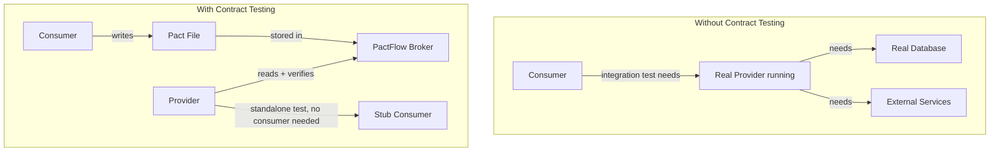
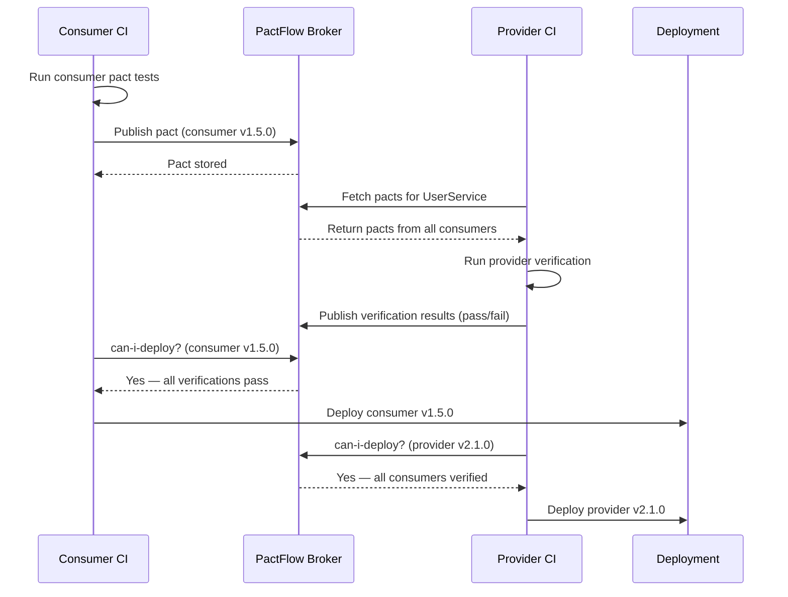

# Contract Testing

> [!abstract] TL;DR
> Consumer-driven contract testing (CDCT) ensures API consumers and providers stay compatible without running both services simultaneously. The consumer writes a **pact file** (JSON document describing expected interactions); the provider runs a verification suite against it. PactFlow acts as the broker storing and sharing pacts. Breaking changes are detected in CI before deployment, eliminating the need for expensive integrated environments for this class of bug.

---

## Why Contract Testing?



**Contract testing vs E2E integration testing**:
| Aspect | Contract Testing | E2E Integration Test |
|--------|-----------------|---------------------|
| Speed | Milliseconds | Minutes |
| Environment needed | None (both sides run independently) | Full stack running |
| Catches | Schema changes, removed fields, type changes | Business logic bugs, data flows |
| Flakiness | Very low | High |
| Cost | Low | High |
| Complements | Cannot replace functional tests | Cannot replace contract tests |

---

## Pact Framework — Consumer Side

**Step 1: Consumer writes the pact**

```java
// Consumer: OrderService consuming UserService API
@ExtendWith(PactConsumerTestExt.class)
@PactTestFor(providerName = "UserService")
class OrderServiceConsumerTest {

    // Define the expected interaction (contract)
    @Pact(consumer = "OrderService")
    public RequestResponsePact getUserById(PactDslWithProvider builder) {
        return builder
            .given("User with ID 123 exists")
                .uponReceiving("a request to get user 123")
                .path("/api/users/123")
                .method("GET")
                .headers(Map.of("Authorization", "Bearer test-token"))
            .willRespondWith()
                .status(200)
                .headers(Map.of("Content-Type", "application/json; charset=UTF-8"))
                .body(new PactDslJsonBody()
                    .uuid("id")                          // validates UUID format
                    .stringType("email")                 // validates type, not exact value
                    .stringValue("status", "ACTIVE")     // exact value constraint
                    .integerType("age")
                    .object("address")
                        .stringType("city")
                        .stringType("country")
                    .closeObject()
                )
            .toPact();
    }

    // Test uses the mock server generated from the pact
    @Test
    @PactTestFor(pactMethod = "getUserById")
    void orderService_canFetchUserById(MockServer mockServer) {
        UserServiceClient client = new UserServiceClient(mockServer.getUrl());
        User user = client.getUser("123");

        assertThat(user.getStatus()).isEqualTo("ACTIVE");
        assertThat(user.getEmail()).isNotNull();
        // Test focuses on: does the consumer handle the response correctly?
    }

    @Pact(consumer = "OrderService")
    public RequestResponsePact getUserNotFound(PactDslWithProvider builder) {
        return builder
            .given("User with ID 999 does not exist")
                .uponReceiving("a request for non-existent user")
                .path("/api/users/999")
                .method("GET")
            .willRespondWith()
                .status(404)
                .body(new PactDslJsonBody()
                    .stringValue("error", "USER_NOT_FOUND")
                    .stringType("message")
                )
            .toPact();
    }

    @Test
    @PactTestFor(pactMethod = "getUserNotFound")
    void orderService_handlesUserNotFound(MockServer mockServer) {
        UserServiceClient client = new UserServiceClient(mockServer.getUrl());
        assertThatThrownBy(() -> client.getUser("999"))
            .isInstanceOf(UserNotFoundException.class);
    }
}
```

**Generated pact file** (`target/pacts/OrderService-UserService.json`):
```json
{
  "consumer": { "name": "OrderService" },
  "provider": { "name": "UserService" },
  "interactions": [
    {
      "description": "a request to get user 123",
      "providerStates": [{ "name": "User with ID 123 exists" }],
      "request": { "method": "GET", "path": "/api/users/123" },
      "response": {
        "status": 200,
        "matchingRules": {
          "body": {
            "$.id": { "matchers": [{ "match": "type" }] },
            "$.email": { "matchers": [{ "match": "type" }] }
          }
        }
      }
    }
  ]
}
```

---

## Pact Framework — Provider Side

**Step 2: Provider verifies the pact**

```java
// Provider: UserService verifying against published pacts
@Provider("UserService")
@PactBroker(
    host = "pactflow.io",
    authentication = @PactBrokerAuth(token = "${PACT_BROKER_TOKEN}")
)
@SpringBootTest(webEnvironment = SpringBootTest.WebEnvironment.RANDOM_PORT)
class UserServiceProviderTest {

    @LocalServerPort int port;

    @BeforeEach
    void setUp(PactVerificationContext context) {
        context.setTarget(new HttpTestTarget("localhost", port));
    }

    @TestTemplate
    @ExtendWith(PactVerificationInvocationContextProvider.class)
    void verifyPact(PactVerificationContext context) {
        context.verifyInteraction();
    }

    // Provider states — set up the database/mocks per state
    @State("User with ID 123 exists")
    void userExists() {
        userRepository.save(User.builder()
            .id("123")
            .email("alice@example.com")
            .status("ACTIVE")
            .age(30)
            .address(Address.of("Boston", "US"))
            .build());
    }

    @State("User with ID 999 does not exist")
    void userDoesNotExist() {
        userRepository.deleteById("999");  // ensure absence
    }
}
```

---

## PactFlow Broker — CI/CD Integration



**CLI commands**:
```bash
# Publish pacts from consumer CI
pact-broker publish \
    --pact-dir target/pacts \
    --broker-base-url https://your-broker.pactflow.io \
    --broker-token $PACT_BROKER_TOKEN \
    --consumer-app-version $(git rev-parse --short HEAD) \
    --branch $(git rev-parse --abbrev-ref HEAD) \
    --tag main

# Check if safe to deploy
pact-broker can-i-deploy \
    --pacticipant OrderService \
    --version $(git rev-parse --short HEAD) \
    --to-environment production \
    --broker-base-url https://your-broker.pactflow.io \
    --broker-token $PACT_BROKER_TOKEN

# Record deployment
pact-broker record-deployment \
    --pacticipant OrderService \
    --version $(git rev-parse --short HEAD) \
    --environment production
```

---

## Breaking vs Non-Breaking API Changes

| Change | Breaking for Consumer? | Detected by Contract Test? |
|--------|----------------------|---------------------------|
| Add optional response field | No | No (contract only checks required fields) |
| Remove response field consumer uses | **Yes** | **Yes** |
| Rename field | **Yes** | **Yes** |
| Change field type (string → number) | **Yes** | **Yes** |
| Add required request field | **Yes** | **Yes** |
| Change HTTP status code | **Yes** | **Yes** |
| Add optional request field | No | No |

---

## OpenAPI as Contract (Prism + Dredd)

When you can't use Pact, use OpenAPI spec as the contract:

```bash
# Prism: mock server from OpenAPI spec
npm install -g @stoplight/prism-cli
prism mock openapi.yaml --port 4010

# Run your consumer tests against the mock
BASE_URL=http://localhost:4010 mvn test

# Dredd: validate a running API against OpenAPI spec
npm install -g dredd
dredd openapi.yaml http://localhost:8080 \
    --reporter junit \
    --output dredd-results.xml
```

**prism validate**: forward real requests to the server and validate responses match the schema:
```bash
prism proxy openapi.yaml http://localhost:8080 --port 4020
# Route tests through :4020 — Prism reports any contract violations
```

---

## GraphQL Contract Testing

```javascript
// Pact for GraphQL (JS consumer example)
const { GraphQLInteraction } = require("@pact-foundation/pact");

const getUserQuery = new GraphQLInteraction()
    .uponReceiving("a GetUser query")
    .withRequest({ path: "/graphql", method: "POST" })
    .withOperation("GetUser")
    .withQuery(`
        query GetUser($id: ID!) {
            user(id: $id) {
                id
                email
                status
            }
        }
    `)
    .withVariables({ id: "123" })
    .willRespondWith({
        status: 200,
        body: {
            data: {
                user: {
                    id: Matchers.like("123"),
                    email: Matchers.like("alice@example.com"),
                    status: "ACTIVE"
                }
            }
        }
    });
```

---

## Common Pitfalls

1. **Over-specifying the pact** — using `stringValue("email", "alice@example.com")` instead of `stringType("email")` makes the pact brittle; exact values should only be used for status fields, not data
2. **Consumer-only pact testing** — publishing pacts without running provider verification is meaningless; both sides must be wired into CI
3. **Skipping provider states** — a provider state that does nothing (empty `@State` method) means the test may pass even when the state is impossible; always set up the correct database/mock state
4. **Treating contract tests as functional tests** — pacts verify shape and structure; they do not verify that `amount = quantity × price` is calculated correctly; both layers are needed
5. **Not using `can-i-deploy`** — teams publish pacts but deploy without checking the broker; `can-i-deploy` is the actual safety gate that makes the whole system work

---

## Review Questions

1. What is the difference between consumer-driven contract testing and E2E integration testing? Which bugs does each catch?
2. Why should pact consumers use type matchers (`stringType`) rather than exact value matchers for most fields?
3. Walk through the CI/CD flow from a consumer writing a pact to a provider deploying with confidence. What steps are involved?
4. What is a breaking vs non-breaking API change, and how does the Pact broker detect breaking changes before deployment?

---

## Related Notes

- [[_MOC_QA_Testing_Master|↑ QA Testing MOC]]
- [[API_Testing_Fundamentals]]
- [[REST_Assured_and_API_Testing]]
- [[CI_CD_Testing_Integration]]
- [[_MOC_DevOps_Master|DevOps MOC]]

---

#QA #Testing #API #ContractTesting #Pact #OpenAPI
