# Security Testing for QA

> [!abstract] TL;DR
> Security testing for QA teams focuses on the most exploitable vulnerabilities — the OWASP Top 10 — using a combination of automated DAST (Dynamic Application Security Testing) tools in the CI pipeline and targeted manual testing of authentication, authorization, and input handling. QA engineers are not penetration testers, but they own the first line of defense: ensuring every user story has negative security test cases, DAST runs on every build, and authentication/authorization flows are explicitly tested.

---

## OWASP Top 10 (2021) — QA Testing Coverage

The OWASP Top 10 is the industry-standard list of the most critical web application security risks.

```mermaid
graph TD
    OWASP["OWASP Top 10 (2021)"] --> A1["A01: Broken Access Control\n#1 — most prevalent risk"]
    OWASP --> A2["A02: Cryptographic Failures\nSensitive data exposure"]
    OWASP --> A3["A03: Injection\nSQL, NoSQL, Command, LDAP"]
    OWASP --> A4["A04: Insecure Design\nMissing threat model"]
    OWASP --> A5["A05: Security Misconfiguration\nMissing hardening, defaults"]
    OWASP --> A6["A06: Vulnerable Components\nOutdated libs with CVEs"]
    OWASP --> A7["A07: Auth Failures\nBroken auth, session management"]
    OWASP --> A8["A08: Integrity Failures\nInsecure deserialization, CI/CD"]
    OWASP --> A9["A09: Logging Failures\nInsufficient monitoring"]
    OWASP --> A10["A10: SSRF\nServer-Side Request Forgery"]

    classDef high fill:#7f1d1d,color:#fff
    classDef med fill:#92400e,color:#fff
    classDef base fill:#1d4ed8,color:#fff
    class A1,A2,A3,A7 high
    class A4,A5,A6 med
    class A8,A9,A10 base
```



---

## Authentication Testing

Authentication failures (OWASP A07) are among the most impactful vulnerabilities. Test these scenarios explicitly:

```
Authentication Test Cases:

✓ Valid credentials → successful login, session issued
✓ Invalid password → generic error (not "wrong password" — no username enumeration)
✓ Invalid username → same generic error as wrong password
✓ Account lockout after N failed attempts (test N and N+1)
✓ Lockout resets after cooldown period
✓ JWT: tampered token rejected (change payload without re-signing)
✓ JWT: expired token rejected
✓ JWT: algorithm=none attack rejected
✓ JWT: RS256 key confusion attack rejected (if using asymmetric)
✓ Session cookie: HttpOnly flag set
✓ Session cookie: Secure flag set (HTTPS only)
✓ Session cookie: SameSite=Lax or Strict
✓ After logout: session token is invalidated server-side
✓ After logout: back button does not restore authenticated state
✓ Password reset token: single-use (cannot reuse)
✓ Password reset token: expires in ≤ 24 hours
✓ MFA bypass: cannot skip MFA step by direct URL navigation
```

### JWT Attack Test (Python)

```python
import requests
import base64
import json

def tamper_jwt(token: str, new_payload: dict) -> str:
    """
    Creates a tampered JWT with a modified payload but unchanged signature.
    A secure API must reject this.
    """
    parts = token.split('.')
    # Re-encode payload without signing
    tampered_payload = base64.urlsafe_b64encode(
        json.dumps(new_payload).encode()
    ).rstrip(b'=').decode()
    return f"{parts[0]}.{tampered_payload}.{parts[2]}"

def test_jwt_tamper_rejected():
    # Login to get a valid token
    resp = requests.post('/api/auth/login', json={
        'email': 'user@example.com',
        'password': 'password'
    })
    original_token = resp.json()['token']
    
    # Tamper: escalate role from 'user' to 'admin'
    tampered = tamper_jwt(original_token, {
        'sub': 'user@example.com',
        'role': 'admin',          # escalated
        'exp': 9999999999
    })
    
    # API must reject tampered token
    resp = requests.get('/api/admin/users', 
        headers={'Authorization': f'Bearer {tampered}'})
    
    assert resp.status_code == 401, f"VULNERABILITY: Tampered JWT accepted! Status: {resp.status_code}"
```

---

## Authorization Bypass Testing (A01: Broken Access Control)

Broken access control is the #1 OWASP risk. Test every endpoint for:

### Horizontal Privilege Escalation (IDOR)

```python
import requests
import pytest

class TestIDOR:
    """Insecure Direct Object Reference testing"""

    def test_user_cannot_access_another_users_order(self, api_client_user_a, api_client_user_b):
        # User A creates an order
        resp = api_client_user_a.post('/api/orders', json={'items': [{'sku': 'ABC', 'qty': 1}]})
        order_id = resp.json()['orderId']

        # User B attempts to access User A's order — must return 403 or 404
        resp_b = api_client_user_b.get(f'/api/orders/{order_id}')
        assert resp_b.status_code in [403, 404], \
            f"IDOR VULNERABILITY: User B accessed User A's order! Status: {resp_b.status_code}"

    def test_user_cannot_modify_another_users_profile(self, api_client_user_a, api_client_user_b, user_b_id):
        resp = api_client_user_a.put(f'/api/users/{user_b_id}', json={'name': 'Hacked'})
        assert resp.status_code in [403, 404], \
            f"IDOR: User A modified User B's profile! Status: {resp.status_code}"
```

### Vertical Privilege Escalation

```python
def test_user_cannot_access_admin_endpoints(api_client_user):
    """Regular user must not access admin-only endpoints"""
    admin_endpoints = [
        ('GET', '/api/admin/users'),
        ('DELETE', '/api/admin/users/123'),
        ('GET', '/api/admin/reports'),
        ('POST', '/api/admin/config'),
    ]
    
    for method, endpoint in admin_endpoints:
        resp = getattr(api_client_user, method.lower())(endpoint)
        assert resp.status_code in [401, 403], \
            f"PRIV ESCALATION on {method} {endpoint}: {resp.status_code}"
```

---

## Injection Testing (A03)

### SQL Injection Test Cases

```python
import requests
import pytest

SQL_INJECTION_PAYLOADS = [
    "' OR '1'='1",
    "'; DROP TABLE users; --",
    "1 UNION SELECT username, password FROM users--",
    "' OR 1=1 --",
    "admin'--",
    "1; SELECT * FROM information_schema.tables--",
]

@pytest.mark.parametrize("payload", SQL_INJECTION_PAYLOADS)
def test_login_rejects_sql_injection(payload):
    resp = requests.post('/api/auth/login', json={
        'email': payload,
        'password': 'anything'
    })
    # Must not return 200 (successful auth) or 500 (unhandled SQL error revealing stack trace)
    assert resp.status_code == 400, \
        f"Possible SQLi vulnerability with payload: {payload!r}, status: {resp.status_code}"
    # Must not leak database errors
    assert 'sql' not in resp.text.lower()
    assert 'syntax' not in resp.text.lower()
    assert 'mysql' not in resp.text.lower()
```

---

## Fuzzing

Fuzzing sends malformed, boundary, and unexpected inputs to find crashes, error leakages, and injection points.

```python
# Simple API fuzzer for boundary and special character testing
import requests
import string
import random

FUZZ_PAYLOADS = [
    # Boundary
    "",                         # empty string
    " ",                        # whitespace only
    "A" * 10000,                # very long string
    "A" * 65536,                # max varchar overflow attempt
    # Special characters
    "<script>alert(1)</script>", # XSS probe
    "../../../etc/passwd",       # path traversal
    "${7*7}",                    # template injection probe
    "{{7*7}}",                   # Jinja/Twig template injection
    "\x00",                      # null byte
    "\n\rContent-Type: text/html", # header injection
    # Numbers
    -1, 0, 2**31, 2**32, 2**63, # integer overflow probes
    float('inf'),
    float('nan'),
]

def fuzz_endpoint(endpoint: str, field: str):
    results = []
    for payload in FUZZ_PAYLOADS:
        try:
            resp = requests.post(endpoint, json={field: payload}, timeout=5)
            if resp.status_code == 500:
                results.append({
                    'payload': payload,
                    'status': resp.status_code,
                    'response': resp.text[:500],
                    'severity': 'HIGH — 500 error may reveal stack trace'
                })
        except Exception as e:
            results.append({'payload': payload, 'error': str(e)})
    return results
```

---

## DAST in the QA Pipeline

DAST (Dynamic Application Security Testing) automatically probes a running application for vulnerabilities.

### OWASP ZAP (Free, Open Source)

```yaml
# GitHub Actions: DAST with OWASP ZAP
- name: OWASP ZAP Baseline Scan
  uses: zaproxy/action-baseline@v0.11.0
  with:
    target: 'https://staging.example.com'
    rules_file_name: '.zap/rules.tsv'     # tune false positives
    cmd_options: '-a'                      # include alpha passive rules

# Full spider + active scan (slower, more thorough)
- name: OWASP ZAP Full Scan  
  uses: zaproxy/action-full-scan@v0.10.0
  with:
    target: 'https://staging.example.com'
    fail_action: true                      # fail CI on high-risk findings

# ZAP rules.tsv (to ignore known false positives):
# 10038   IGNORE   (Content Security Policy header not set — handled by CDN)
# 10020   IGNORE   (Missing Anti-clickjacking header — X-Frame-Options set at LB)
```

### Burp Suite Basics for QA

Burp Suite (Community edition is free) is the industry-standard manual security testing proxy.

```
Setup:
  1. Configure browser proxy → 127.0.0.1:8080
  2. Install Burp CA certificate (trust it in browser)
  3. Burp intercepts all HTTPS traffic

Key Burp Features for QA:

Proxy tab:
  - Intercept requests; modify before forwarding
  - Use to test parameter tampering (change orderId, userId in flight)

Repeater tab:
  - Replay a captured request with modifications
  - Perfect for testing IDOR, header manipulation, payload injection

Intruder tab:
  - Automated fuzzing: mark injection points, set payload list
  - Use for brute-force testing (verify lockout occurs)

Scanner (Pro only):
  - Automated vulnerability scanning
  - Community: use OWASP ZAP instead

Decoder:
  - Base64, URL encode/decode JWTs and cookies
  - Inspect JWT payload without libraries
```

---

## Security Test Case Structure

Every user story for authentication, authorization, or data handling should include security test cases:

```gherkin
# Acceptance Criteria Security Extensions

Feature: Order retrieval

  Scenario: User can retrieve their own order
    Given I am authenticated as user A
    When I request GET /api/orders/<my-order-id>
    Then the response status is 200
    And the response contains my order details

  Scenario: User cannot retrieve another user's order (IDOR)
    Given I am authenticated as user A
    When I request GET /api/orders/<user-b-order-id>
    Then the response status is 403 or 404
    And the response does not contain user B's order details

  Scenario: Unauthenticated request is rejected
    Given I have no authentication token
    When I request GET /api/orders/<any-order-id>
    Then the response status is 401

  Scenario: Tampered JWT is rejected
    Given I tamper the role claim in my JWT to "admin"
    When I request GET /api/orders/<any-order-id>
    Then the response status is 401
```

---

## Trade-offs

| Tool/Approach | Coverage | Speed | Effort | Best For |
|---|---|---|---|---|
| **OWASP ZAP baseline** | Passive, low-hanging fruit | Fast (2–5 min) | Low | Every PR / nightly |
| **OWASP ZAP full scan** | Active scan, more thorough | Slow (15–60 min) | Medium | Pre-release, weekly |
| **Burp Suite manual** | Targeted, deep | Variable | High | Specific high-risk features |
| **Custom pytest security tests** | Specific known risks | Fast | Medium | Regression suite |
| **External pen test** | Comprehensive | Very slow | Very high | Annual compliance, major releases |

---

## Common Pitfalls

1. **Testing only happy paths** — Security test cases must include negative tests: unauthorized access, tampered tokens, injection payloads, boundary inputs.
2. **Running DAST against production** — DAST tools perform active attacks. Always run against a dedicated staging environment.
3. **Ignoring error messages in responses** — A 500 response containing a stack trace or SQL error is a vulnerability even if the attack didn't succeed.
4. **Not testing authorization on every endpoint** — Authorization checks can be missing on a single endpoint while the rest are correct. Test every endpoint explicitly.
5. **Treating DAST as comprehensive** — DAST cannot find logic-level vulnerabilities (IDOR, business logic flaws) that require understanding of the domain. Supplement with manual testing.
6. **Skipping session invalidation tests** — Many teams test login but not logout. After logout, the session token must be invalid server-side.

---

## Review Questions

1. A colleague says "we have HTTPS, so we don't need security testing." List three vulnerabilities that HTTPS does not prevent.
2. Write a pytest test case that verifies a user cannot access another user's profile (IDOR protection) in a REST API.
3. What is the difference between DAST and SAST, and which is more appropriate for a QA engineer to run in a CI pipeline?
4. An endpoint returns `HTTP 500 Internal Server Error` with the body `com.mysql.jdbc.exceptions.jdbc4.CommunicationsException`. Is this a security issue? Why?

---

## Related Notes

- [[_MOC_QA_Testing_Master|↑ QA Testing MOC]]
- [[API_Testing_Fundamentals]]
- [[Contract_Testing]]
- [[CI_CD_Testing_Integration]]
- [[QA_Overview]]

---

#QA #Testing #Security #OWASP #DAST #BurpSuite #Authentication #Fuzzing
