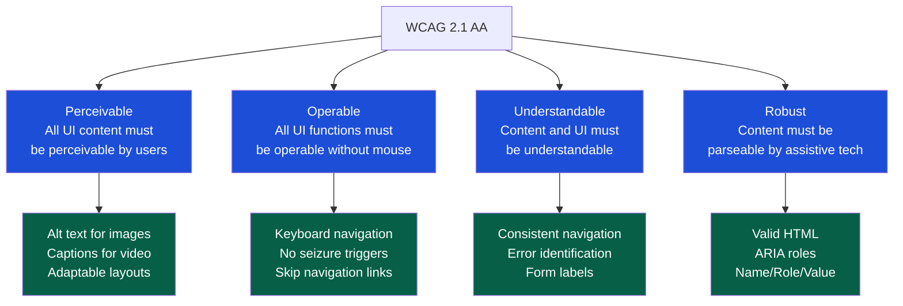

# Accessibility Testing

> [!abstract] TL;DR
> Accessibility testing verifies that software can be used by people with disabilities — visual, auditory, motor, and cognitive. WCAG 2.1 defines the legal and ethical standard (Levels A, AA, AAA). Automated tools (Axe, Wave) catch ~30–40% of issues; the rest require manual testing with keyboard and screen readers. Shift-left: build accessibility into components from the start — retrofitting is expensive and often architecturally messy.

---

## Why Accessibility Matters

Accessibility is both a legal requirement (ADA, EAA, EN 301 549, AODA) and a quality indicator. Accessibility failures typically correlate with poor semantic HTML, missing labels, and keyboard navigation gaps — all of which also degrade SEO, performance, and overall UX.

**Impact scope:** Approximately 15% of the global population lives with some form of disability (WHO). For a product with 1M users, that's up to 150,000 people whose experience is directly affected by accessibility quality.

---

## WCAG 2.1 / 2.2 Levels

WCAG (Web Content Accessibility Guidelines) is organized into three levels of conformance:

| Level | Requirements | Legal Threshold |
|---|---|---|
| **A (Minimum)** | Basic accessibility: alt text, keyboard access, no seizure triggers | Required by most legislation as the floor |
| **AA (Standard)** | Enhanced contrast (4.5:1), captions, resizable text, visible focus indicators | The target for most commercial software and legal compliance |
| **AAA (Enhanced)** | Sign language, 7:1 contrast, no timing requirements | Aspirational; not required in full for most sites |

**Most compliance targets**: WCAG 2.1 Level AA.

### The Four WCAG Principles (POUR)



---

## Automated Accessibility Tools

Automated tools catch approximately 30–40% of WCAG violations. They are fast and cheap — run them in CI as a floor, not a ceiling.

### Axe (Most Widely Used)

```javascript
// Playwright + axe-core integration
import { test, expect } from '@playwright/test';
import AxeBuilder from '@axe-core/playwright';

test.describe('Checkout page accessibility', () => {
    test('should not have automatically detectable WCAG 2.1 AA violations', async ({ page }) => {
        await page.goto('/checkout');
        
        const accessibilityScanResults = await new AxeBuilder({ page })
            .withTags(['wcag2a', 'wcag2aa', 'wcag21a', 'wcag21aa'])
            .exclude('#third-party-widget')           // known third-party issue
            .analyze();
        
        expect(accessibilityScanResults.violations).toEqual([]);
    });

    test('should pass for the form submission flow', async ({ page }) => {
        await page.goto('/checkout');
        await page.fill('#email', 'test@example.com');
        
        const results = await new AxeBuilder({ page })
            .include('#checkout-form')              // scope to specific component
            .analyze();
        
        // Report rather than fail for warnings
        if (results.violations.length > 0) {
            console.log('Violations:', JSON.stringify(results.violations, null, 2));
        }
        expect(results.violations).toEqual([]);
    });
});
```

```bash
# Cypress + cypress-axe
npm install cypress-axe axe-core

# cypress/support/commands.js
import 'cypress-axe';

# In a test:
cy.visit('/checkout');
cy.injectAxe();
cy.checkA11y(null, {
    runOnly: { type: 'tag', values: ['wcag2a', 'wcag2aa'] }
});
```

### Wave (WebAIM)

Wave is a browser extension and API that visualizes accessibility errors inline on the page. Excellent for manual review; shows exactly where errors occur on the rendered page.

```bash
# Wave API (CI-friendly)
curl "https://wave.webaim.org/api/request?key=YOUR_KEY&url=https://staging.example.com/checkout&format=json" \
  | jq '.statistics, .categories.error'
```

### Chrome DevTools Accessibility Panel

```
Open DevTools → Accessibility tab (requires "full-page accessibility tree" enabled in Experiments)

Checks:
  - Accessibility tree: verify element roles and names are correct
  - Contrast checker: Elements panel → Computed → find contrast ratio
  - Lighthouse audit: DevTools → Lighthouse → Accessibility → Generate report
```

---

## ARIA Roles and Attributes

ARIA (Accessible Rich Internet Applications) supplements HTML semantics for dynamic content that native HTML cannot express.

| ARIA Usage | Good Example | Bad Example |
|---|---|---|
| Roles | `<div role="button" tabindex="0">Submit</div>` (if can't use `<button>`) | `<div role="button">Submit</div>` without `tabindex` (not keyboard accessible) |
| Labels | `<input aria-label="Search products" type="search">` | `<input aria-label="input" type="search">` (meaningless) |
| Live regions | `<div aria-live="polite" aria-atomic="true">3 items added to cart</div>` | Dynamic updates with no live region (screen readers miss updates) |
| States | `<button aria-expanded="false" aria-controls="menu">Menu</button>` | Dropdown with no state communicated |

**The ARIA First Rule:** Use native HTML elements before adding ARIA. `<button>` is better than `<div role="button">`. Native HTML is automatically accessible; ARIA requires manual implementation of all expected behaviors.

```html
<!-- BAD: div pretending to be a button -->
<div class="btn" onclick="submit()">Submit</div>
<!-- Missing: keyboard access, role, focus indicator -->

<!-- GOOD: semantic button -->
<button type="submit" class="btn">Submit</button>

<!-- ALSO GOOD: if button element truly cannot be used -->
<div 
  role="button" 
  tabindex="0"
  aria-label="Submit order"
  onkeydown="handleKeyDown(event)"
  onclick="submit()">
  Submit
</div>
```

---

## Screen Reader Testing

Manual screen reader testing catches issues that automated tools cannot detect: confusing reading order, poor announcements of dynamic content, and contextless interactive elements.

| Screen Reader | Platform | Browser | Coverage |
|---|---|---|---|
| **NVDA** (free) | Windows | Firefox, Chrome | Industry standard for Windows testing |
| **JAWS** (paid) | Windows | Chrome, Edge | Enterprise; most used by corporations |
| **VoiceOver** | macOS / iOS | Safari | Required for Apple platform testing |
| **TalkBack** | Android | Chrome | Required for Android testing |
| **Narrator** | Windows | Edge | Edge-specific; secondary |

### Screen Reader Test Checklist

```
Basic navigation:
  [ ] Tab through the page — does focus order make logical sense?
  [ ] Is every interactive element reachable by keyboard?
  [ ] Is the focused element visually identifiable (focus indicator visible)?
  [ ] Does pressing Enter/Space on a focused element activate it?

Content:
  [ ] Are all images either described with meaningful alt text or marked as decorative (alt="")?
  [ ] Do form inputs have visible, programmatically associated labels?
  [ ] Are error messages linked to the form field that has the error?
  [ ] Are headings used for structure (h1→h2→h3), not just for visual size?

Dynamic content:
  [ ] Are status messages announced without moving focus? (aria-live)
  [ ] Are modal dialogs announced and focus trapped correctly?
  [ ] Are loading states announced?
  [ ] When content is added/removed dynamically, is it announced?
```

### Common NVDA Commands (Windows)

```
NVDA modifier key: Insert (or CapsLock)

Navigation:
  Tab / Shift+Tab    Move between interactive elements
  H / Shift+H        Jump between headings
  F / Shift+F        Jump between form elements
  B / Shift+B        Jump between buttons
  1–6                Jump to h1–h6

Reading:
  Insert+Down Arrow  Read from current position
  Insert+Up Arrow    Read title/current line
  Ctrl              Stop reading
```

---

## Automated vs. Manual Testing

| What to Test | Method | Tool |
|---|---|---|
| Missing alt text | Automated | Axe, Wave |
| Insufficient color contrast | Automated | Axe, Lighthouse, DevTools |
| Missing form labels | Automated | Axe |
| Missing ARIA roles | Automated | Axe |
| Keyboard navigation order | Manual | Keyboard only (no mouse) |
| Screen reader announcement correctness | Manual | NVDA, VoiceOver |
| Cognitive load and clarity | Manual | Usability testing |
| Touch target size | Both | Lighthouse (automated estimate) + manual |
| Dynamic content announcements | Manual | Screen reader + aria-live |
| Custom interactive components (sliders, date pickers) | Manual | Screen reader |

**CI integration for automated checks:**

```yaml
# .github/workflows/accessibility.yml
- name: Axe accessibility scan
  run: |
    npx playwright test --grep="accessibility" \
      --reporter=html
  
- name: Upload accessibility report
  uses: actions/upload-artifact@v4
  with:
    name: accessibility-report
    path: playwright-report/
```

---

## Trade-offs

| Approach | Coverage | Speed | Cost | Best For |
|---|---|---|---|---|
| Automated (Axe in CI) | 30–40% of WCAG issues | Very fast | Low | Regression gate; catches obvious issues |
| Browser extension (Wave, axe DevTools) | 30–40% | Fast | Free | During development; exploratory |
| Manual keyboard testing | 60–70% | Slow | Medium | Complex interactions and flows |
| Screen reader testing | 80–90% | Very slow | High | High-risk components; compliance audit |
| Third-party audit | ~95% | Very slow | Very high | Annual compliance audit; legal requirement |

---

## Common Pitfalls

1. **Relying solely on automated tools** — Automated tools miss ~60–70% of WCAG violations. Keyboard and screen reader testing is mandatory for compliance.
2. **`alt="image"` or `alt="photo"`** — Non-descriptive alt text is as harmful as missing alt text. Write alt text that conveys meaning: "A bar chart showing monthly revenue growth, with March at the highest point."
3. **Placeholder as label** — `placeholder` disappears on input; it cannot replace a visible `<label>`. Always associate a `<label>` with every input.
4. **Color as the only information signal** — "Required fields are shown in red" fails for color-blind users. Add an asterisk and a legend.
5. **Focus traps outside modals** — Focus should be trapped inside open modals and restored to the trigger on close. Non-modal focus traps are a WCAG 2.1.2 failure.
6. **Testing only with the mouse** — The quickest accessibility regression check is to unplug the mouse and try to use the application with keyboard only.

---

## Review Questions

1. What does WCAG 2.1 Level AA require for color contrast, and how would you detect a violation automatically in your CI pipeline?
2. A developer added a date picker built entirely from `<div>` elements. What ARIA attributes are needed, and what would you test manually with NVDA?
3. Automated scanning finds zero violations on a checkout form, but a blind user reports they cannot complete a purchase. What additional testing steps would you run?
4. What is the difference between `aria-label` and `aria-labelledby`? Give an example where each is appropriate.

---

## Related Notes

- [[_MOC_QA_Testing_Master|↑ QA Testing MOC]]
- [[Playwright_Testing]]
- [[Cypress_Testing]]
- [[CI_CD_Testing_Integration]]
- [[Test_Case_Design]]

---

#QA #Testing #Accessibility #A11y #WCAG #ARIA #ScreenReader
