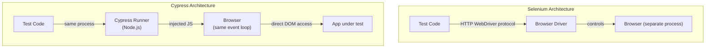

# Cypress Testing

> [!abstract] TL;DR
> Cypress runs directly inside the browser (not via WebDriver), giving it real-time DOM access, automatic retry on assertions, and reliable network interception. Commands are chainable and queue lazily — Cypress yields control between commands, eliminating flakiness from race conditions. `cy.intercept` stubs API calls for deterministic tests. Component Testing lets you test React/Vue/Angular components in isolation without a full browser page. Cypress Cloud parallelises execution across multiple machines.

---

## Architecture — Why Cypress Differs



**Key implications of running in-browser**:
- Zero flakiness from network latency (commands are synchronous-feeling)
- Direct access to `window`, `localStorage`, `fetch` API
- Real-time test reruns during development (watch mode)
- Can stub `Date`, `Math.random()`, timers (`cy.clock()`)
- Cannot test cross-origin pages (same-origin restriction)

---

## Installation and Setup

```bash
# Install
npm install --save-dev cypress

# Open interactive runner
npx cypress open

# Run headless
npx cypress run

# Project structure
cypress/
  e2e/               # test files
    auth.cy.js
    checkout.cy.js
  fixtures/          # JSON/CSV test data files
    users.json
    products.json
  support/
    commands.js      # custom commands
    e2e.js           # global setup (runs before all tests)
  component/         # component tests
cypress.config.js
```

**`cypress.config.js`**:
```javascript
const { defineConfig } = require('cypress');

module.exports = defineConfig({
    e2e: {
        baseUrl: 'http://localhost:3000',
        viewportWidth: 1280,
        viewportHeight: 720,
        defaultCommandTimeout: 10000,
        retries: { runMode: 2, openMode: 0 },
        video: false,
        screenshotOnRunFailure: true,
        setupNodeEvents(on, config) {
            // plugins
        },
    },
    component: {
        devServer: { framework: 'react', bundler: 'vite' },
    },
});
```

---

## Core Commands and Assertions

```javascript
// Navigation
cy.visit('/login')
cy.visit('https://example.com', { timeout: 10000 })

// Finding elements
cy.get('[data-testid="email-input"]')          // CSS selector
cy.get('#submit-btn')                          // ID
cy.contains('Place Order')                    // text content (partial match)
cy.contains('button', 'Place Order')          // element + text
cy.get('form').find('[type="submit"]')         // scoped find

// Actions
cy.get('[data-testid="email"]').type('alice@example.com')
cy.get('[data-testid="password"]').type('pass{enter}')    // {enter} key
cy.get('[data-testid="submit"]').click()
cy.get('select').select('United States')
cy.get('[type="checkbox"]').check()
cy.get('[type="file"]').selectFile('fixtures/invoice.pdf')

// Assertions (auto-retry until pass or timeout)
cy.get('[data-testid="welcome"]').should('be.visible')
cy.get('[data-testid="welcome"]').should('contain.text', 'Alice')
cy.url().should('include', '/dashboard')
cy.get('[data-testid="cart-count"]').should('have.text', '3')
cy.get('[data-testid="submit"]').should('be.disabled')

// Chaining
cy.get('[data-testid="items-list"]')
    .should('have.length', 3)
    .first()
    .should('contain.text', 'Laptop Stand')

// Aliases — cache selector for reuse
cy.get('[data-testid="order-form"]').as('form')
cy.get('@form').find('[data-testid="submit"]').click()

// Waiting
cy.get('[data-testid="spinner"]').should('not.exist')   // wait for spinner gone
cy.get('[data-testid="result"]').should('be.visible')   // retry until visible
```

---

## Fixtures for Test Data

```json
// cypress/fixtures/users.json
{
    "admin": {
        "email": "admin@example.com",
        "password": "AdminPass123",
        "role": "ADMIN"
    },
    "customer": {
        "email": "customer@example.com",
        "password": "CustPass123",
        "role": "CUSTOMER"
    }
}
```

```javascript
describe('Admin Features', () => {
    before(() => {
        cy.fixture('users').then(users => {
            cy.wrap(users.admin).as('adminUser');
        });
    });

    it('admin can delete users', function() {  // use function() to access this
        cy.visit('/login');
        cy.get('[data-testid="email"]').type(this.adminUser.email);
        cy.get('[data-testid="password"]').type(this.adminUser.password);
        cy.get('[data-testid="submit"]').click();
        cy.url().should('include', '/admin');
    });
});
```

---

## cy.intercept — Network Stubbing and Spying

```javascript
// Stub: intercept and return mock response (no real server call)
cy.intercept('GET', '/api/orders', {
    statusCode: 200,
    body: [
        { id: '1', status: 'PENDING', amount: 99.99 },
        { id: '2', status: 'SHIPPED', amount: 199.99 }
    ]
}).as('getOrders');

cy.visit('/orders');
cy.wait('@getOrders');                    // wait for intercept to be triggered
cy.get('[data-testid="order-row"]').should('have.length', 2);

// Spy: let real request through, just observe it
cy.intercept('POST', '/api/checkout').as('checkout');
cy.get('[data-testid="place-order"]').click();
cy.wait('@checkout').then(interception => {
    expect(interception.request.body.currency).to.equal('USD');
    expect(interception.response.statusCode).to.equal(201);
});

// Dynamic stub based on request
cy.intercept('GET', '/api/products/*', (req) => {
    if (req.url.includes('discontinued')) {
        req.reply({ statusCode: 404, body: { error: 'PRODUCT_DISCONTINUED' } });
    } else {
        req.continue();  // let real request through for other products
    }
});

// Simulate network error
cy.intercept('POST', '/api/checkout', { forceNetworkError: true });
cy.get('[data-testid="place-order"]').click();
cy.get('[data-testid="error-message"]').should('contain', 'Network error');
```

---

## Custom Commands

```javascript
// cypress/support/commands.js

// Login command — reusable across all tests
Cypress.Commands.add('login', (role = 'customer') => {
    cy.fixture('users').then(users => {
        const user = users[role];
        // Bypass UI for speed — set session via API
        cy.request('POST', '/api/auth/login', {
            email: user.email,
            password: user.password
        }).then(res => {
            window.localStorage.setItem('authToken', res.body.token);
        });
    });
});

// Add item to cart via API (bypass UI)
Cypress.Commands.add('addToCart', (sku, quantity = 1) => {
    cy.getCookie('sessionId').then(cookie => {
        cy.request({
            method: 'POST',
            url: '/api/cart/items',
            headers: { Authorization: `Bearer ${localStorage.getItem('authToken')}` },
            body: { sku, quantity }
        });
    });
});

// Type into a field with label (accessibility-friendly)
Cypress.Commands.add('fillField', (label, value) => {
    cy.contains('label', label)
        .invoke('attr', 'for')
        .then(id => cy.get(`#${id}`).clear().type(value));
});
```

```javascript
// Usage in tests
beforeEach(() => {
    cy.login('customer');      // fast API-based login
    cy.addToCart('SKU-001', 2);
});

it('checkout with saved payment method', () => {
    cy.visit('/checkout');
    cy.fillField('Billing address', '123 Main St');
    // ...
});
```

---

## Component Testing

```javascript
// cypress/component/ProductCard.cy.jsx
import ProductCard from '../../src/components/ProductCard';

describe('ProductCard', () => {
    it('displays product name and price', () => {
        const product = { name: 'Laptop Stand', price: 49.99, sku: 'SKU-001', inStock: true };

        cy.mount(<ProductCard product={product} onAddToCart={cy.stub().as('addToCart')} />);

        cy.get('[data-testid="product-name"]').should('have.text', 'Laptop Stand');
        cy.get('[data-testid="product-price"]').should('have.text', '$49.99');
        cy.get('[data-testid="add-to-cart"]').should('not.be.disabled');
    });

    it('disables add-to-cart when out of stock', () => {
        cy.mount(<ProductCard product={{ ...product, inStock: false }} />);
        cy.get('[data-testid="add-to-cart"]').should('be.disabled');
        cy.get('[data-testid="out-of-stock-badge"]').should('be.visible');
    });

    it('calls onAddToCart when clicked', () => {
        const onAddToCart = cy.stub().as('addToCart');
        cy.mount(<ProductCard product={product} onAddToCart={onAddToCart} />);

        cy.get('[data-testid="add-to-cart"]').click();
        cy.get('@addToCart').should('have.been.calledOnceWith', 'SKU-001');
    });
});
```

---

## Visual Testing with Percy

```javascript
// Install: npm install --save-dev @percy/cypress
// Import: add to cypress/support/commands.js: import '@percy/cypress'

it('checkout page visual regression', () => {
    cy.login('customer');
    cy.visit('/checkout');
    cy.get('[data-testid="order-summary"]').should('be.visible');

    cy.percySnapshot('Checkout Page');                    // full page
    cy.percySnapshot('Order Summary', {                   // element snapshot
        scope: '[data-testid="order-summary"]'
    });
});

// Run: PERCY_TOKEN=xxx npx percy exec -- cypress run
```

---

## Cypress Cloud (Parallelisation)

```bash
# Parallelise across 4 machines in CI
npx cypress run --parallel --record --key $CYPRESS_RECORD_KEY --ci-build-id $BUILD_ID

# Tag runs for filtering in dashboard
npx cypress run --record --tag "staging,regression"

# Run specific spec files
npx cypress run --spec "cypress/e2e/auth/**,cypress/e2e/checkout/**"
```

---

## Common Pitfalls

1. **Using `cy.wait(2000)` instead of waiting for elements** — Cypress retries assertions automatically; always wait for a DOM condition or `cy.wait('@alias')` for network calls
2. **Using `function()` vs arrow functions with `this`** — Cypress aliases (`cy.wrap().as('name')`) are only accessible via `this.name` inside `function()` callbacks, not arrow functions
3. **Direct `localStorage` manipulation without `cy.window()`** — access browser APIs through `cy.window().then(win => win.localStorage.setItem(...))` to stay in Cypress's command queue
4. **Over-using `cy.get()` with generic selectors** — `cy.get('button')` matches all buttons; be specific with `data-testid` or scope with `.find()`
5. **Testing implementation details** — testing that a component's state variable changed is fragile; test visible user-facing behaviour (what the user sees) not internal state

---

## Review Questions

1. How does Cypress's in-browser architecture differ from Selenium's WebDriver approach, and what practical advantage does it give for reliability?
2. What is the difference between `cy.intercept` as a spy vs a stub? When would you use each?
3. Write a custom Cypress command `cy.login()` that sets an auth token via API (bypassing the login UI).
4. What is Cypress Component Testing, and when is it preferable to full E2E testing?

---

## Related Notes

- [[_MOC_QA_Testing_Master|↑ QA Testing MOC]]
- [[Playwright_Testing]]
- [[Selenium_and_WebDriver]]
- [[CI_CD_Testing_Integration]]

---

#QA #Testing #Cypress #E2E #UITesting #ComponentTesting
