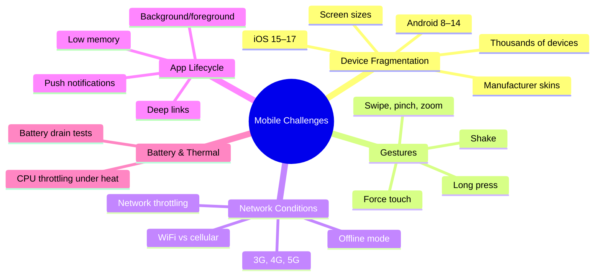

# Mobile Testing

> [!abstract] TL;DR
> Mobile testing is harder than web testing: device fragmentation (thousands of device/OS/manufacturer combinations), platform-specific gestures, unreliable network conditions, and app lifecycle events (backgrounding, deep links, push notifications). Appium is the WebDriver for mobile — cross-platform but slower. Espresso (Android) and XCUITest (iOS) are native frameworks — fast, reliable, tightly coupled to their platform. Detox is the best choice for React Native gray-box testing. Cloud device farms (BrowserStack, Sauce Labs) provide real-device coverage at scale.

---

## Mobile Testing Challenges



---

## Framework Comparison

| Framework | Platform | Approach | Speed | Maintenance | Use Case |
|-----------|---------|----------|-------|-------------|----------|
| **Appium** | iOS + Android | WebDriver (black-box) | Slow | Medium | Cross-platform team, legacy apps |
| **Espresso** | Android only | Native (white-box) | Fast | Low | Android-native apps |
| **XCUITest** | iOS only | Native (white-box) | Fast | Low | iOS-native apps |
| **Detox** | iOS + Android | Gray-box (React Native) | Fast | Medium | React Native apps |
| **BrowserStack** | Both | Cloud real devices | Medium | Low (no infra) | Device coverage at scale |

---

## Appium — Cross-Platform WebDriver

Appium extends the W3C WebDriver protocol for mobile platforms. It speaks to iOS via XCUI driver and Android via UiAutomator2.

```java
// Appium Java Client setup
import io.appium.java_client.android.AndroidDriver;
import io.appium.java_client.remote.MobileCapabilityType;

@BeforeEach
void setUp() throws MalformedURLException {
    UiAutomator2Options options = new UiAutomator2Options()
        .setDeviceName("Pixel_7_API_34")
        .setApp("/path/to/app.apk")
        .setAppPackage("com.example.myapp")
        .setAppActivity(".MainActivity")
        .setAutoGrantPermissions(true)
        .setNewCommandTimeout(Duration.ofSeconds(60));

    driver = new AndroidDriver(
        new URL("http://localhost:4723"),
        options
    );
}

@Test
void loginFlow_withValidCredentials() {
    // Find elements by accessibility ID (preferred — works on both platforms)
    driver.findElement(AppiumBy.accessibilityId("email-input")).sendKeys("alice@example.com");
    driver.findElement(AppiumBy.accessibilityId("password-input")).sendKeys("password");
    driver.findElement(AppiumBy.accessibilityId("login-button")).click();

    // Wait for dashboard
    WebDriverWait wait = new WebDriverWait(driver, Duration.ofSeconds(10));
    WebElement welcome = wait.until(
        ExpectedConditions.visibilityOfElementLocated(
            AppiumBy.accessibilityId("welcome-message")));
    assertThat(welcome.getText()).contains("Welcome");
}

// Gestures
@Test
void swipeToDeleteItem() {
    WebElement item = driver.findElement(AppiumBy.accessibilityId("cart-item-1"));

    // Swipe left to reveal delete
    new W3CActions(driver)
        .addPointerInput(PointerInput.Kind.TOUCH, "finger1")
        .createPointerMove(Duration.ZERO, PointerInput.Origin.viewport(), item.getLocation().x + 200, item.getLocation().y)
        .createPointerDown(PointerInput.MouseButton.LEFT.asArg())
        .createPointerMove(Duration.ofMillis(600), PointerInput.Origin.viewport(), item.getLocation().x - 100, item.getLocation().y)
        .createPointerUp(PointerInput.MouseButton.LEFT.asArg())
        .perform();

    driver.findElement(AppiumBy.accessibilityId("delete-button")).click();
}
```

**Appium server startup**:
```bash
# Install Appium and drivers
npm install -g appium
appium driver install uiautomator2   # Android
appium driver install xcuitest       # iOS

# Start Appium server
appium --port 4723

# List connected devices
adb devices          # Android
xcrun xctrace list devices  # iOS
```

---

## Espresso — Android Native

Espresso is Google's official Android UI testing framework. It runs in the same process as the app (white-box) — dramatically faster and more reliable than Appium for Android.

```java
// build.gradle
androidTestImplementation 'androidx.test.espresso:espresso-core:3.5.1'
androidTestImplementation 'androidx.test:runner:1.5.2'
androidTestImplementation 'androidx.test:rules:1.5.0'

// Test
@RunWith(AndroidJUnit4::class)
@LargeTest
class LoginActivityTest {

    @get:Rule
    val activityRule = ActivityScenarioRule(LoginActivity::class.java)

    @Test
    fun validLogin_navigatesToDashboard() {
        // ViewMatchers: find the element
        onView(withId(R.id.editTextEmail))
            // ViewActions: interact with it
            .perform(typeText("alice@example.com"), closeSoftKeyboard())

        onView(withId(R.id.editTextPassword))
            .perform(typeText("password123"), closeSoftKeyboard())

        onView(withId(R.id.buttonLogin)).perform(click())

        // ViewAssertions: verify the result
        onView(withId(R.id.textWelcome))
            .check(matches(isDisplayed()))
            .check(matches(withText(containsString("Welcome"))))
    }

    @Test
    fun invalidLogin_showsErrorSnackbar() {
        onView(withId(R.id.editTextEmail)).perform(typeText("wrong@example.com"))
        onView(withId(R.id.editTextPassword)).perform(typeText("wrong"), closeSoftKeyboard())
        onView(withId(R.id.buttonLogin)).perform(click())

        // Check Snackbar message
        onView(withText("Invalid credentials"))
            .check(matches(withEffectiveVisibility(Visibility.VISIBLE)));
    }

    @Test
    fun recyclerView_scrollsToItem() {
        // Espresso RecyclerView actions
        onView(withId(R.id.recyclerOrders))
            .perform(RecyclerViewActions.scrollToPosition<RecyclerView.ViewHolder>(15))
            .perform(RecyclerViewActions.actionOnItemAtPosition<RecyclerView.ViewHolder>(15, click()))
    }
}
```

---

## XCUITest — iOS Native

```swift
// LoginTests.swift — XCUITest
import XCTest

class LoginTests: XCTestCase {

    let app = XCUIApplication()

    override func setUpWithError() throws {
        continueAfterFailure = false
        app.launchArguments = ["--uitesting"]    // signal app to use test data
        app.launch()
    }

    func testSuccessfulLogin() throws {
        // XCUIApplication element access
        let emailField = app.textFields["email-input"]    // accessibility identifier
        let passwordField = app.secureTextFields["password-input"]
        let loginButton = app.buttons["Sign In"]

        XCTAssertTrue(emailField.exists)
        emailField.tap()
        emailField.typeText("alice@example.com")

        passwordField.tap()
        passwordField.typeText("password123")

        loginButton.tap()

        // Verify navigation to dashboard
        let welcomeLabel = app.staticTexts["welcome-message"]
        XCTAssertTrue(welcomeLabel.waitForExistence(timeout: 5))
        XCTAssertTrue(welcomeLabel.label.contains("Welcome"))
    }

    func testGestureSwipeToRefresh() {
        let table = app.tables["orders-table"]
        table.swipeDown()   // pull-to-refresh

        let loadingIndicator = app.activityIndicators["Loading"]
        XCTAssertFalse(loadingIndicator.waitForExistence(timeout: 5))
    }
}
```

**Setting accessibility identifiers in code** (critical for test stability):
```swift
// SwiftUI
TextField("Email", text: $email)
    .accessibilityIdentifier("email-input")

Button("Sign In") { ... }
    .accessibilityIdentifier("login-button")
```

---

## Detox — React Native Gray-Box Testing

```javascript
// e2e/login.test.js — Detox
const { device, element, by, expect } = require('detox');

describe('Login Flow', () => {
    beforeAll(async () => {
        await device.launchApp({ newInstance: true });
    });

    beforeEach(async () => {
        await device.reloadReactNative();  // fast reset without full relaunch
    });

    it('successful login', async () => {
        await element(by.id('email-input')).typeText('alice@example.com');
        await element(by.id('password-input')).typeText('password123');
        await element(by.id('login-button')).tap();

        await expect(element(by.id('dashboard-screen'))).toBeVisible();
        await expect(element(by.text('Welcome, Alice'))).toBeVisible();
    });

    it('shake to report bug', async () => {
        await device.shake();   // trigger shake gesture
        await expect(element(by.id('bug-report-modal'))).toBeVisible();
    });

    it('background and foreground app', async () => {
        await element(by.id('login-button')).tap();
        await device.sendToHome();     // background
        await device.launchApp({ newInstance: false });  // foreground
        await expect(element(by.id('dashboard-screen'))).toBeVisible();  // session persisted
    });
});
```

---

## Device Farms

```yaml
# BrowserStack App Automate — CI integration
- name: Run Mobile Tests on BrowserStack
  env:
    BROWSERSTACK_USERNAME: ${{ secrets.BS_USERNAME }}
    BROWSERSTACK_ACCESS_KEY: ${{ secrets.BS_ACCESS_KEY }}
  run: |
    # Upload app
    APP_URL=$(curl -u "$BROWSERSTACK_USERNAME:$BROWSERSTACK_ACCESS_KEY" \
      -X POST "https://api-cloud.browserstack.com/app-automate/upload" \
      -F "file=@app/build/app-release.apk" | jq -r '.app_url')

    # Run tests against real devices
    mvn test -Dplatform=android \
      -DremoteUrl=https://hub.browserstack.com/wd/hub \
      -DappUrl=$APP_URL \
      -DdeviceName="Google Pixel 7" \
      -DosVersion="13.0"
```

**Emulator vs Real Device**:
| Factor | Emulator | Real Device |
|--------|---------|-------------|
| Speed (test start) | Slow (boot time) | Fast |
| Cost | Free | Expensive (farm) |
| Accuracy | ~80% (no camera, biometrics, NFC) | 100% |
| Fragmentation | Limited | Wide (device farm = hundreds) |
| Flakiness | Higher | Lower |
| Recommended for | Dev/CI fast feedback | Release gate testing |

---

## Common Pitfalls

1. **No accessibility identifiers** — tests relying on text content break on every copy change; work with devs to add `accessibilityIdentifier` (iOS) or `contentDescription`/`viewTag` (Android) to key elements
2. **Testing on one device only** — a bug invisible on Pixel 7 may crash on Samsung Galaxy S21 due to manufacturer customisations; include at least one non-Pixel Android in your device matrix
3. **Not handling app permissions** — location, camera, notification permissions must be granted before the test step that requires them; Appium's `autoGrantPermissions` or Espresso's `GrantPermissionRule` handle this
4. **Slow test suites without parallelisation** — 100 Appium tests running serially can take 30+ minutes; run on multiple devices in parallel via device farm
5. **Ignoring deep links and push notifications** — these are common production bugs; test `app.openURL()` (Detox) and notification taps explicitly

---

## Review Questions

1. What are the key differences between Espresso and Appium for Android testing? When would you choose each?
2. Why are accessibility identifiers critical for mobile test stability? What happens when you test by text content instead?
3. What is a "gray-box" testing approach in Detox, and how does it differ from Appium's black-box approach?
4. When should you use real devices vs emulators, and what is the recommended strategy for a CI pipeline?

---

## Related Notes

- [[_MOC_QA_Testing_Master|↑ QA Testing MOC]]
- [[Selenium_and_WebDriver]]
- [[Playwright_Testing]]
- [[CI_CD_Testing_Integration]]

---

#QA #Testing #Mobile #Appium #Espresso #XCUITest #Detox
