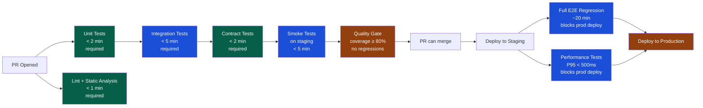

# CI/CD Testing Integration

> [!abstract] TL;DR
> Testing in CI/CD transforms the pipeline into an automated quality gate: every PR triggers unit + integration tests; every deployment to staging triggers regression + contract tests; performance gates block deploys that degrade P95 latency. GitHub Actions matrix strategy runs tests across browser/OS combinations in parallel. Ephemeral Docker Compose environments give each PR a fresh, isolated test target. Test results publish as JUnit XML, surfaced natively in GitHub's PR summary.

---

## Testing Pipeline Architecture



---

## GitHub Actions — Full Test Workflow

```yaml
# .github/workflows/ci.yml
name: CI — Test Suite

on:
  push:
    branches: [main, develop]
  pull_request:
    branches: [main]

jobs:
  # ─── Unit + Integration Tests ───────────────────────────────────────────
  test:
    name: "Unit & Integration (${{ matrix.java }})"
    runs-on: ubuntu-latest

    strategy:
      matrix:
        java: ['17', '21']            # test against multiple JDK versions
      fail-fast: false                # run all matrix jobs even if one fails

    services:
      postgres:
        image: postgres:15
        env:
          POSTGRES_DB: testdb
          POSTGRES_USER: test
          POSTGRES_PASSWORD: test
        ports: ['5432:5432']
        options: >-
          --health-cmd pg_isready
          --health-interval 10s
          --health-timeout 5s
          --health-retries 5

    steps:
      - uses: actions/checkout@v4

      - name: Set up JDK ${{ matrix.java }}
        uses: actions/setup-java@v4
        with:
          java-version: ${{ matrix.java }}
          distribution: temurin
          cache: maven

      - name: Run unit tests
        run: mvn test -Dgroups='unit' --no-transfer-progress

      - name: Run integration tests
        run: mvn test -Dgroups='integration' --no-transfer-progress
        env:
          SPRING_DATASOURCE_URL: jdbc:postgresql://localhost:5432/testdb
          SPRING_DATASOURCE_USERNAME: test
          SPRING_DATASOURCE_PASSWORD: test

      - name: Generate coverage report
        run: mvn jacoco:report --no-transfer-progress

      - name: Check coverage threshold
        run: mvn jacoco:check --no-transfer-progress
        # Configured in pom.xml: fail if coverage < 80%

      - name: Publish test results
        uses: mikepenz/action-junit-report@v4
        if: always()
        with:
          report_paths: '**/target/surefire-reports/TEST-*.xml'
          check_name: 'Test Results (JDK ${{ matrix.java }})'

      - name: Upload coverage to Codecov
        uses: codecov/codecov-action@v4
        with:
          files: target/site/jacoco/jacoco.xml

  # ─── API Contract Tests ─────────────────────────────────────────────────
  contract-tests:
    name: Contract Tests (Pact)
    runs-on: ubuntu-latest
    needs: test

    steps:
      - uses: actions/checkout@v4
      - uses: actions/setup-java@v4
        with: { java-version: '21', distribution: temurin, cache: maven }

      - name: Run consumer pact tests
        run: mvn test -Dgroups='pact-consumer'

      - name: Publish pacts to broker
        run: |
          npx pact-broker publish \
            --pact-dir target/pacts \
            --broker-base-url ${{ vars.PACT_BROKER_URL }} \
            --broker-token ${{ secrets.PACT_BROKER_TOKEN }} \
            --consumer-app-version ${{ github.sha }} \
            --branch ${{ github.head_ref }}

  # ─── E2E Tests — Matrix across browsers ────────────────────────────────
  e2e:
    name: "E2E (${{ matrix.browser }} / ${{ matrix.os }})"
    runs-on: ${{ matrix.os }}
    needs: test
    if: github.event_name == 'push' || github.event.pull_request.draft == false

    strategy:
      matrix:
        include:
          - browser: chromium
            os: ubuntu-latest
          - browser: firefox
            os: ubuntu-latest
          - browser: webkit
            os: macos-latest   # Safari only on macOS

    steps:
      - uses: actions/checkout@v4
      - uses: actions/setup-node@v4
        with: { node-version: '20', cache: 'npm' }

      - name: Install Playwright
        run: npx playwright install --with-deps ${{ matrix.browser }}

      - name: Start app under test
        run: docker compose up -d --wait
        env:
          DATABASE_URL: ${{ secrets.STAGING_DB_URL }}

      - name: Run Playwright tests
        run: npx playwright test --project=${{ matrix.browser }}
        env:
          BASE_URL: http://localhost:3000

      - name: Upload test report
        uses: actions/upload-artifact@v4
        if: failure()
        with:
          name: playwright-report-${{ matrix.browser }}-${{ matrix.os }}
          path: playwright-report/
          retention-days: 7
```

---

## Quality Gates Configuration

**JaCoCo coverage gate** (blocks merge if coverage drops):

```xml
<!-- pom.xml -->
<plugin>
    <groupId>org.jacoco</groupId>
    <artifactId>jacoco-maven-plugin</artifactId>
    <version>0.8.11</version>
    <executions>
        <execution>
            <id>check</id>
            <goals><goal>check</goal></goals>
            <configuration>
                <rules>
                    <rule>
                        <element>BUNDLE</element>
                        <limits>
                            <limit>
                                <counter>LINE</counter>
                                <value>COVEREDRATIO</value>
                                <minimum>0.80</minimum>  <!-- 80% line coverage -->
                            </limit>
                            <limit>
                                <counter>BRANCH</counter>
                                <value>COVEREDRATIO</value>
                                <minimum>0.70</minimum>  <!-- 70% branch coverage -->
                            </limit>
                        </limits>
                    </rule>
                    <!-- Critical packages: higher threshold -->
                    <rule>
                        <element>PACKAGE</element>
                        <includes>
                            <include>com.example.payment.*</include>
                        </includes>
                        <limits>
                            <limit>
                                <counter>LINE</counter>
                                <value>COVEREDRATIO</value>
                                <minimum>0.90</minimum>
                            </limit>
                        </limits>
                    </rule>
                </rules>
            </configuration>
        </execution>
    </executions>
</plugin>
```

**Performance gate in CI**:
```yaml
- name: Performance test (k6)
  run: |
    k6 run \
      --out json=perf-results.json \
      --env BASE_URL=${{ vars.STAGING_URL }} \
      k6/checkout-load-test.js

- name: Evaluate performance gate
  run: |
    P95=$(jq '.metrics.http_req_duration.values["p(95)"]' perf-results.json)
    ERROR_RATE=$(jq '.metrics.http_req_failed.values.rate' perf-results.json)
    echo "P95 latency: ${P95}ms, Error rate: ${ERROR_RATE}"

    python3 -c "
    import sys, json
    with open('perf-results.json') as f: d = json.load(f)
    p95 = d['metrics']['http_req_duration']['values']['p(95)']
    err = d['metrics']['http_req_failed']['values']['rate']
    failures = []
    if p95 > 500: failures.append(f'P95 {p95:.0f}ms > 500ms threshold')
    if err > 0.01: failures.append(f'Error rate {err:.2%} > 1% threshold')
    if failures:
        print('PERFORMANCE GATE FAILED:')
        for f in failures: print(f'  - {f}')
        sys.exit(1)
    print('Performance gate passed')
    "
```

---

## Test Environment Management

**Ephemeral environment with Docker Compose** (per-PR):

```yaml
# docker-compose.test.yml — test environment definition
version: "3.9"
services:
  app:
    build: .
    ports: ["8080:8080"]
    environment:
      - SPRING_PROFILES_ACTIVE=test
      - DATABASE_URL=jdbc:postgresql://db:5432/testdb
    depends_on:
      db:
        condition: service_healthy

  db:
    image: postgres:15
    environment:
      POSTGRES_DB: testdb
      POSTGRES_USER: test
      POSTGRES_PASSWORD: test
    healthcheck:
      test: ["CMD-SHELL", "pg_isready -U test"]
      interval: 5s
      timeout: 5s
      retries: 10

  redis:
    image: redis:7-alpine
    ports: ["6379:6379"]
```

```yaml
# In CI workflow
- name: Start test environment
  run: |
    docker compose -f docker-compose.test.yml up -d --build --wait
    echo "APP_URL=http://localhost:8080" >> $GITHUB_ENV

- name: Run API tests
  run: newman run postman/collection.json -e postman/ci-env.json \
      --env-var "baseUrl=$APP_URL"

- name: Run E2E tests
  run: npx playwright test --env BASE_URL=$APP_URL

- name: Tear down environment
  if: always()
  run: docker compose -f docker-compose.test.yml down -v
```

---

## Test Result Publishing

**JUnit XML → GitHub PR annotations**:
```yaml
- name: Publish Test Summary
  uses: mikepenz/action-junit-report@v4
  if: always()
  with:
    report_paths: |
      **/target/surefire-reports/TEST-*.xml
      **/test-results/junit.xml
    check_name: Test Results
    fail_on_failure: true
    require_tests: true
    # Annotates each failing test directly on the PR diff
    annotate_only: false
```

**GitHub Step Summary** (custom rich summary):
```yaml
- name: Add test summary to GitHub step summary
  if: always()
  run: |
    echo "## Test Results" >> $GITHUB_STEP_SUMMARY
    echo "" >> $GITHUB_STEP_SUMMARY
    echo "| Suite | Tests | Passed | Failed | Skipped |" >> $GITHUB_STEP_SUMMARY
    echo "|-------|-------|--------|--------|---------|" >> $GITHUB_STEP_SUMMARY
    python3 scripts/parse-junit-summary.py >> $GITHUB_STEP_SUMMARY
```

---

## Visual Regression in CI

```yaml
# Percy visual regression (with Playwright)
- name: Run visual regression tests
  run: npx percy exec -- npx playwright test --grep "@visual"
  env:
    PERCY_TOKEN: ${{ secrets.PERCY_TOKEN }}

# Chromatic visual regression (Storybook-based)
- name: Publish to Chromatic
  uses: chromaui/action@latest
  with:
    projectToken: ${{ secrets.CHROMATIC_PROJECT_TOKEN }}
    exitOnceUploaded: true   # async — don't block CI for review
```

---

## Shift-Left with Pre-Commit Unit Tests

```yaml
# .github/workflows/pre-commit.yml — fast gate on every push
name: Pre-commit checks

on: [push]

jobs:
  quick-check:
    runs-on: ubuntu-latest
    timeout-minutes: 5        # fast fail if this takes > 5 min

    steps:
      - uses: actions/checkout@v4
      - uses: actions/setup-java@v4
        with: { java-version: '21', distribution: temurin, cache: maven }

      - name: Unit tests only (fast)
        run: mvn test -Dgroups='unit' -T 4 --no-transfer-progress

      - name: Lint (checkstyle)
        run: mvn checkstyle:check --no-transfer-progress
```

**Local pre-commit hook** (shift-left to developer machine):
```bash
# .git/hooks/pre-commit
#!/bin/sh
echo "Running unit tests before commit..."
mvn test -Dgroups='unit' -q --no-transfer-progress
if [ $? -ne 0 ]; then
    echo "Unit tests failed. Commit aborted."
    exit 1
fi
```

---

## Common Pitfalls

1. **No test environment isolation** — multiple CI runs sharing a database cause race conditions; always use a per-run ephemeral environment or test-specific prefixes
2. **Slow tests on critical path** — E2E tests (20 min) should not block PR merge; run them post-merge on `develop` or in parallel with merge review
3. **Missing `if: always()` on report upload** — artifact upload and report publishing must run even when tests fail (`if: always()`), otherwise CI failures produce no diagnostic output
4. **Coverage gates without enforcement** — many teams set up JaCoCo thresholds but don't make them fail the build; coverage gates only work if they block the pipeline
5. **Secrets in test output** — API keys in test logs are a security risk; use `--mask` in GitHub Actions and ensure test fixtures never log credentials

---

## Review Questions

1. Describe the testing strategy for a GitHub Actions CI pipeline: which tests run on every PR, which run before production deploy?
2. How would you configure JaCoCo to fail the build if line coverage drops below 80%?
3. What is an ephemeral test environment? How would you create one with Docker Compose in CI?
4. Why must test report upload steps use `if: always()`? What happens without it?

---

## Related Notes

- [[_MOC_QA_Testing_Master|↑ QA Testing MOC]]
- [[Test_Automation_Architecture]]
- [[Contract_Testing]]
- [[k6_Performance_Testing]]
- [[Performance_Testing]]
- [[_MOC_DevOps_Master|DevOps MOC]]

---

#QA #Testing #CICD #GitHubActions #QualityGates #DevOps
