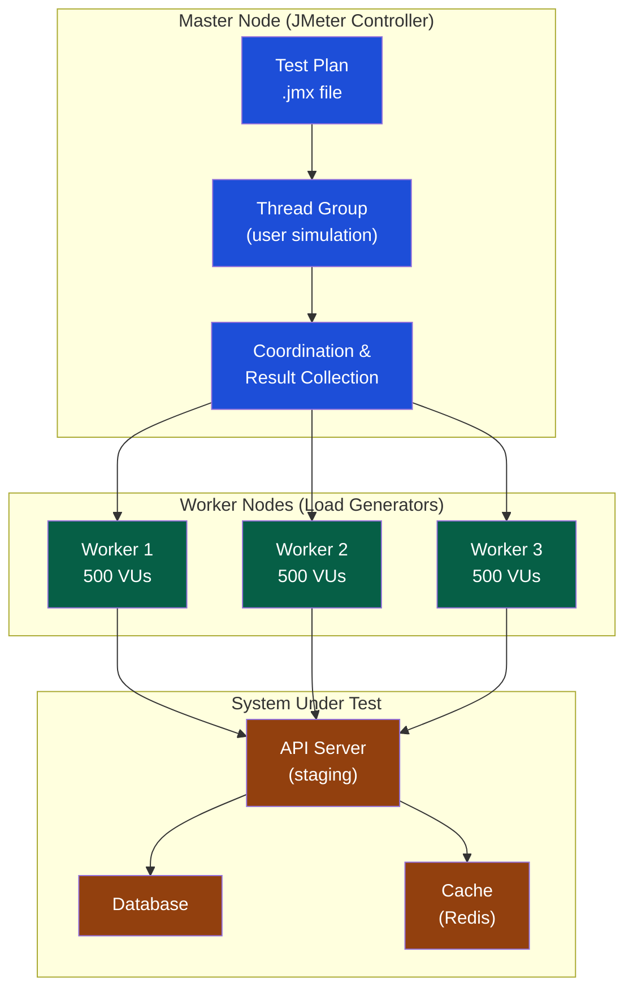

# JMeter Performance Testing

> [!abstract] TL;DR
> Apache JMeter is the most widely deployed open-source load testing tool, with a mature ecosystem, rich GUI for test plan authoring, and CLI mode for CI execution. A JMeter test plan is a hierarchy: Test Plan → Thread Groups → Samplers → Assertions → Listeners. Always run performance tests in CLI mode (non-GUI) — GUI consumes 30–50% of resources and skews results. JMeter excels at complex protocol scenarios (JDBC, JMS, FTP) and enterprise environments; k6 wins on developer ergonomics and modern scripting.

---

## JMeter Architecture



**Key architectural points:**
- JMeter simulates concurrent users as Java threads — each thread = one virtual user
- Master-worker architecture: one master orchestrates multiple worker nodes, each generating load
- All workers send their results to the master for aggregation
- The target system must be staging/pre-prod — never run load tests against production

---

## Test Plan Hierarchy

Every JMeter test plan follows this structure:

```
Test Plan
├── Thread Group (who, how many, how fast)
│   ├── HTTP Request Defaults (base URL, headers — shared across samplers)
│   ├── CSV Data Set Config (test data: users, products, etc.)
│   ├── HTTP Cookie Manager (session management)
│   ├── [Sampler] HTTP Request: POST /api/auth/login
│   │   ├── Response Assertion (status = 200)
│   │   └── JSON Extractor (extract "token" from response)
│   ├── [Sampler] HTTP Request: GET /api/products
│   │   └── Response Assertion (status = 200, body contains "sku")
│   ├── [Sampler] HTTP Request: POST /api/cart/items
│   │   └── Duration Assertion (< 500ms)
│   └── [Sampler] HTTP Request: POST /api/checkout
│       ├── Response Assertion (status = 201)
│       └── JSON Extractor (extract "orderId")
│
├── [Listener] Simple Data Writer → results.jtl   ← enabled, writes to file
└── [Listener] Summary Report                     ← DISABLED in CLI mode
```

---

## Thread Groups

The Thread Group defines the load profile — how many users, how fast they ramp up, and how long the test runs.

### Basic Thread Group

| Parameter | Description | Example |
|---|---|---|
| **Number of Threads** | Total virtual users (VUs) | 500 |
| **Ramp-Up Period** | Seconds to reach full thread count | 60 (one new user per 0.12 seconds) |
| **Loop Count** | How many times each thread repeats the scenario | -1 (infinite) or 1 |
| **Duration** | Total test duration in seconds (overrides loop count) | 300 |
| **Startup Delay** | Seconds before this thread group starts | 0 |

### Stepping Thread Group (Plugin)

The Stepping Thread Group (jp@gc plugin) provides more realistic ramp patterns:

```
Start with 0 users
Add 50 users every 30 seconds, up to 500 maximum
Hold for 5 minutes at peak
Reduce to 0 users over 60 seconds
```

### Throughput Shaping Timer (Constant Throughput Target)

```
Goal: Generate exactly 200 RPS regardless of thread count
Plugin: Throughput Shaping Timer
Configuration:
  Start RPS: 10
  End RPS: 200
  Ramp-up: 120 seconds
  Hold: 300 seconds
  Ramp-down: 60 seconds
```

---

## Core JMeter Components

### Samplers

Samplers are the requests JMeter sends to the system under test.

| Sampler | Protocol | Use Case |
|---|---|---|
| **HTTP Request** | HTTP/HTTPS | REST APIs, web pages — most common |
| **JDBC Request** | SQL/JDBC | Direct database load testing |
| **JMS Sampler** | JMS/AMQP | Message queue (ActiveMQ, RabbitMQ) |
| **WebSocket Sampler** | WebSocket | Real-time communication load |
| **GraphQL HTTP Request** | HTTP + GraphQL | GraphQL API testing |
| **JSR223 Sampler** | Groovy/Java | Custom logic that no built-in sampler covers |

### Config Elements

```
HTTP Request Defaults:
  Server name: staging.example.com
  Port: 443
  Protocol: https

HTTP Header Manager:
  Content-Type: application/json
  Accept: application/json

CSV Data Set Config:
  Filename: /data/users.csv
  Variable Names: email,password,userId
  Delimiter: ,
  Sharing Mode: All threads (each thread gets the next row)
```

### Extractors

```
JSON Extractor — Extract token from login response:
  Names of created variables: authToken
  JSON Path Expressions: $.token
  Match No.: 1
  Default Values: TOKEN_NOT_FOUND

Regex Extractor — Extract CSRF token from HTML:
  Names of created variables: csrfToken
  Regular Expression: name="_csrf" value="(.+?)"
  Template: $1$
  Match No.: 1
```

### Assertions

```
Response Assertion:
  Apply to: Main sample only
  Field to test: Response Code
  Pattern Matching Rules: Equals
  Patterns: 200

JSON Assertion:
  Assert JSON Path exists: $.orderId
  Additionally assert value: (checked)
  Expected value: (not empty regex: .+)

Duration Assertion:
  Duration to assert (milliseconds): 1000
  (Fails if response > 1000ms)

Size Assertion:
  Response Body size ≤ 1048576 (1MB max body)
```

---

## JMeter CLI — Running in Non-GUI Mode

Always run load tests in CLI mode in CI. GUI mode consumes extra resources and produces inaccurate results.

```bash
# Basic CLI run
jmeter -n \
  -t checkout-load-test.jmx \
  -l results/results.jtl \
  -e -o results/html-report \
  -Jbase_url=https://staging.example.com \
  -Jusers=500 \
  -Jramp_up=60 \
  -Jduration=300 \
  -Jthreads=500

# Distributed testing: master coordinates 3 workers
jmeter -n \
  -t checkout-load-test.jmx \
  -R worker1.internal,worker2.internal,worker3.internal \
  -l results/results.jtl \
  -Gbase_url=https://staging.example.com \    # -G passes to workers
  -Gusers=500

# Generate HTML report from existing .jtl file
jmeter -g results/results.jtl -o results/html-report

# Server mode (start a worker node)
jmeter-server -Djava.rmi.server.hostname=worker1.internal
```

### JMeter in CI (GitHub Actions)

```yaml
# .github/workflows/performance.yml
name: Performance Tests

on:
  schedule:
    - cron: '0 2 * * *'    # nightly at 2am
  workflow_dispatch:         # manual trigger

jobs:
  jmeter-load-test:
    runs-on: ubuntu-latest
    steps:
      - uses: actions/checkout@v4

      - name: Install JMeter
        run: |
          wget -q https://archive.apache.org/dist/jmeter/binaries/apache-jmeter-5.6.3.tgz
          tar xzf apache-jmeter-5.6.3.tgz
          echo "JMETER_HOME=$PWD/apache-jmeter-5.6.3" >> $GITHUB_ENV
          echo "$PWD/apache-jmeter-5.6.3/bin" >> $GITHUB_PATH

      - name: Install plugins
        run: |
          wget -q https://jmeter-plugins.org/get/ -O $JMETER_HOME/lib/ext/jmeter-plugins-manager.jar
          java -cp $JMETER_HOME/lib/ext/jmeter-plugins-manager.jar \
            org.jmeterplugins.repository.PluginManagerCMDInstaller
          $JMETER_HOME/bin/PluginsManagerCMD.sh install \
            jpgc-synthesis,jpgc-graphs-basic,jpgc-tst

      - name: Run JMeter test
        run: |
          jmeter -n \
            -t tests/performance/checkout-load-test.jmx \
            -l results/results.jtl \
            -e -o results/html-report \
            -Jbase_url=${{ vars.STAGING_URL }} \
            -Jusers=200 \
            -Jramp_up=60 \
            -Jduration=180

      - name: Validate performance thresholds
        run: |
          python3 scripts/validate_jmeter_results.py \
            --jtl results/results.jtl \
            --p95-threshold 500 \
            --error-rate-threshold 1.0

      - name: Upload HTML report
        uses: actions/upload-artifact@v4
        if: always()
        with:
          name: jmeter-report-${{ github.run_id }}
          path: results/html-report/
```

```python
# scripts/validate_jmeter_results.py
import csv
import argparse
import sys

def validate(jtl_file: str, p95_threshold: float, error_rate_threshold: float):
    durations = []
    errors = 0
    total = 0
    
    with open(jtl_file) as f:
        reader = csv.DictReader(f)
        for row in reader:
            total += 1
            durations.append(int(row['elapsed']))
            if row['success'] == 'false':
                errors += 1
    
    durations.sort()
    p95 = durations[int(len(durations) * 0.95)]
    error_rate = errors / total * 100
    
    print(f"Total requests: {total}")
    print(f"P95 latency: {p95}ms (threshold: {p95_threshold}ms)")
    print(f"Error rate: {error_rate:.2f}% (threshold: {error_rate_threshold}%)")
    
    failed = False
    if p95 > p95_threshold:
        print(f"FAIL: P95 {p95}ms exceeds {p95_threshold}ms threshold")
        failed = True
    if error_rate > error_rate_threshold:
        print(f"FAIL: Error rate {error_rate:.2f}% exceeds {error_rate_threshold}% threshold")
        failed = True
    
    sys.exit(1 if failed else 0)
```

---

## Realistic Load Profiles

A flat "500 users for 5 minutes" profile does not represent real traffic. Model realistic patterns:

```
Traffic Profile: E-Commerce Checkout

Morning ramp:  50 users (9am)
Peak:          500 users (12pm–2pm)
Afternoon:     200 users (3pm–5pm)
Evening peak:  400 users (7pm–9pm)
Off-peak:      20 users (overnight)

JMeter representation:
  Thread Group 1: 500 users, hold 60 min (peak)
  Throughput Controller: scale to 10% for off-peak
  
Or use: Throughput Shaping Timer with RPS targets per time block
```

---

## JMeter vs. k6

| Dimension | JMeter | k6 |
|---|---|---|
| **Language** | GUI + XML (.jmx); Groovy/Java for scripting | JavaScript (modern, TypeScript-friendly) |
| **Developer ergonomics** | Poor — XML is verbose; GUI dependency | Excellent — code-first, git-friendly |
| **Protocol support** | Excellent — HTTP, JDBC, JMS, FTP, SMTP, WebSocket | HTTP, WebSocket, gRPC; fewer native protocols |
| **CI integration** | Good (CLI mode) | Excellent (native Docker, k6 Cloud) |
| **Distributed testing** | Built-in master/worker | k6 Cloud or manual agent setup |
| **Learning curve** | Moderate (GUI concepts) | Low (familiar JS) |
| **Reporting** | HTML reports, Grafana via influxdb | Grafana, k6 Cloud dashboard |
| **Community** | Mature (20+ years) | Growing rapidly |

**Choose JMeter when:** Protocol diversity (JDBC, JMS, FTP) is needed; existing .jmx test plans; team unfamiliar with JavaScript; enterprise environment with JMeter expertise.

**Choose k6 when:** REST API and WebSocket testing; developer-owned performance tests; CI-first workflow; modern team comfortable with JavaScript.

---

## Common Pitfalls

1. **Running in GUI mode for load tests** — JMeter GUI consumes 30–50% of the machine's resources, artificially limiting throughput and skewing latency results. Always use CLI mode (`-n` flag).
2. **Too many active listeners** — Even in CLI mode, active listeners (Aggregate Report, View Results Tree) write to screen and consume memory. Disable all listeners; write raw results with Simple Data Writer only.
3. **Not parameterizing test data** — 500 threads using the same username produce unrealistic server behavior (single cache key, same session). Use CSV Data Set Config with unique users per thread.
4. **Not monitoring the target system** — High JMeter response times could be caused by JMeter itself (underpowered test machine), the network, the application, or the database. Always correlate with server-side metrics.
5. **Using localhost for distributed test master** — Worker nodes must reach the master over the network; specify `Djava.rmi.server.hostname` explicitly or workers cannot connect.
6. **No assertions** — A test plan with no assertions reports 100% success regardless of application behavior. Every sampler must have at minimum a response code assertion.

---

## Review Questions

1. A JMeter load test reports 400ms P95, but the operations team says the server CPU was 90% during the test. What server-side metrics would you correlate with the JMeter results, and what does high CPU at P95=400ms suggest?
2. Your CI machine can only support 50 virtual users but you need to simulate 1000. How do you achieve this with JMeter's distributed testing?
3. Compare JMeter and k6 for a team of developers who maintain their own performance tests in the same git repository as application code. Which would you recommend and why?
4. What is the difference between a Thread Group Ramp-Up of 60 seconds with 500 threads vs. the Throughput Shaping Timer set to 100 RPS? Which produces a more realistic load profile for a checkout API?

---

## Related Notes

- [[_MOC_QA_Testing_Master|↑ QA Testing MOC]]
- [[Performance_Testing]]
- [[k6_Performance_Testing]]
- [[CI_CD_Testing_Integration]]
- [[Test_Automation_Architecture]]

---

#QA #Testing #Performance #JMeter #LoadTesting #DistributedTesting
