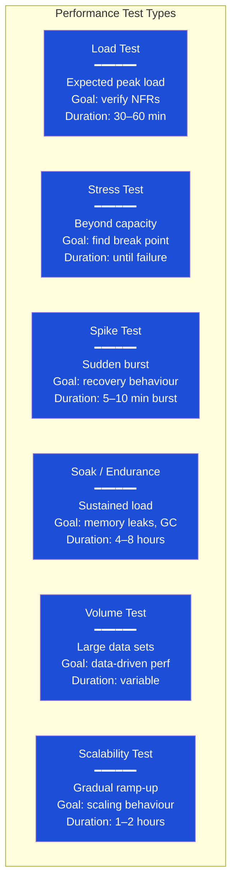

# Performance Testing

> [!abstract] TL;DR
> Performance testing validates that a system meets its non-functional requirements under expected and extreme load. Load testing verifies normal peak capacity; stress testing finds the breaking point; spike testing simulates sudden bursts; soak testing catches memory leaks over time. Key metrics are throughput (RPS), response time percentiles (P50/P95/P99), error rate, and concurrent users. Always compare against a **baseline** — a single run without context tells you nothing.

---

## Performance Testing Types



---

## Key Metrics

| Metric | Description | Target Example |
|--------|-------------|----------------|
| **Throughput (RPS/TPS)** | Requests or transactions per second | ≥ 500 RPS for checkout |
| **Response Time P50** | Median response time (50th percentile) | < 200ms |
| **Response Time P95** | 95th percentile — worst experience for 95% of users | < 500ms |
| **Response Time P99** | 99th percentile — outlier latency | < 1000ms |
| **Error Rate** | % of requests returning 4xx/5xx | < 0.1% under normal load |
| **Concurrent Users (VU)** | Number of virtual users active simultaneously | Depends on product |
| **CPU Utilisation** | Server CPU usage under load | < 70% at peak |
| **Memory Utilisation** | Heap/RAM under load | Stable (no leak trend) |
| **Connection Pool** | DB connection saturation | < 80% utilisation |

**Percentiles matter**: P99 means 99% of requests complete within that time. If P99 = 2000ms, 1 in 100 users waits 2+ seconds — this may be acceptable or unacceptable depending on the use case.

---

## JMeter

Apache JMeter is the most widely used performance testing tool.

**Test Plan structure**:
```
Test Plan
├── Thread Group (500 users, ramp-up 60s, duration 300s)
│   ├── HTTP Request Defaults (base URL, headers)
│   ├── HTTP Request: GET /api/products
│   ├── HTTP Request: POST /api/cart/items
│   ├── HTTP Request: POST /api/checkout
│   ├── Response Assertion (status = 200, body contains "orderId")
│   ├── Duration Assertion (< 1000ms)
│   └── CSV Data Set Config (test users)
└── Listeners (disabled during run — write to file)
    ├── Simple Data Writer (results.jtl)
    └── Summary Report
```

**JMeter CLI (non-GUI for CI)**:
```bash
# Run test plan
jmeter -n -t checkout-load-test.jmx \
    -l results/results.jtl \
    -e -o results/html-report \
    -Jbase_url=https://staging.example.com \
    -Jusers=500 \
    -Jramp_up=60 \
    -Jduration=300

# Distributed testing (master + multiple workers)
jmeter -n -t test.jmx -R worker1,worker2,worker3 -l results.jtl

# Generate HTML report from existing results
jmeter -g results/results.jtl -o results/html-report
```

**JMeter DSL** (code-based JMeter tests in Java):
```java
import static us.abstracta.jmeter.javadsl.JmeterDsl.*;

testPlan(
    threadGroup(500, Duration.ofMinutes(5),
        httpSampler("GET Products", "https://staging.example.com/api/products"),
        httpSampler("POST Checkout", "https://staging.example.com/api/checkout")
            .post(checkoutPayloadJson(), ContentType.APPLICATION_JSON)
    ),
    htmlReporter("results/report")
).run();
```

---

## k6 — Modern Performance Testing

See [[k6_Performance_Testing]] for deep-dive. Quick reference:

```javascript
// k6 checkout load test
import http from 'k6/http';
import { check, sleep } from 'k6';
import { Rate } from 'k6/metrics';

const errorRate = new Rate('errors');

export const options = {
    stages: [
        { duration: '2m', target: 100 },   // ramp up
        { duration: '5m', target: 100 },   // hold
        { duration: '2m', target: 500 },   // spike
        { duration: '5m', target: 500 },   // hold spike
        { duration: '2m', target: 0 },     // ramp down
    ],
    thresholds: {
        'http_req_duration': ['p(95)<500', 'p(99)<1000'],
        'http_req_failed': ['rate<0.01'],
        'errors': ['rate<0.05'],
    },
};

export default function () {
    const res = http.post(
        'https://staging.example.com/api/checkout',
        JSON.stringify({ items: [{ sku: 'SKU-001', qty: 1 }] }),
        { headers: { 'Content-Type': 'application/json', 'Authorization': `Bearer ${__ENV.API_TOKEN}` } }
    );

    const success = check(res, {
        'status is 201': r => r.status === 201,
        'response < 500ms': r => r.timings.duration < 500,
        'has orderId': r => JSON.parse(r.body).orderId !== undefined,
    });

    errorRate.add(!success);
    sleep(1);
}
```

---

## Gatling — Scala DSL

```scala
// CheckoutSimulation.scala
import io.gatling.core.Predef._
import io.gatling.http.Predef._
import scala.concurrent.duration._

class CheckoutSimulation extends Simulation {

    val httpProtocol = http
        .baseUrl("https://staging.example.com")
        .acceptHeader("application/json")
        .contentTypeHeader("application/json")

    val checkout = scenario("Checkout Flow")
        .exec(http("GET Products")
            .get("/api/products")
            .check(status.is(200))
            .check(jsonPath("$[0].id").saveAs("productId"))
        )
        .pause(1.second)
        .exec(http("POST Checkout")
            .post("/api/checkout")
            .body(StringBody("""{ "productId": "${productId}", "quantity": 1 }"""))
            .check(status.is(201))
            .check(responseTimeInMillis.lte(500))
        )

    setUp(
        checkout.inject(
            rampUsers(100).during(2.minutes),
            constantUsersPerSec(50).during(5.minutes)
        )
    ).protocols(httpProtocol)
     .assertions(
        global.responseTime.percentile(95).lte(500),
        global.failedRequests.percent.lte(1)
     )
}
```

```bash
# Run Gatling
mvn gatling:test -Dgatling.simulationClass=CheckoutSimulation

# View HTML report
open target/gatling/checkoutsimulation-*/index.html
```

---

## Artillery — YAML-Based

```yaml
# checkout-load.yml
config:
  target: "https://staging.example.com"
  phases:
    - duration: 120    # ramp up 2 min
      arrivalRate: 10
      rampTo: 100
    - duration: 300    # sustain 5 min
      arrivalRate: 100
  plugins:
    expect: {}    # assertion plugin

scenarios:
  - name: "Checkout flow"
    flow:
      - post:
          url: "/api/auth/login"
          json:
            email: "test@example.com"
            password: "password"
          capture:
            - json: "$.token"
              as: "authToken"
      - post:
          url: "/api/checkout"
          headers:
            Authorization: "Bearer {{ authToken }}"
          json:
            items: [{ sku: "SKU-001", quantity: 1 }]
          expect:
            - statusCode: 201
            - contentType: json
            - hasProperty: "orderId"
```

```bash
artillery run checkout-load.yml --output results.json
artillery report results.json  # generates HTML report
```

---

## Baseline vs Regression Performance Testing

**Baseline**: Run the test once on a known-good build and store the results. All future runs compare against the baseline.

```bash
# Run baseline and save
k6 run --out json=baseline.json checkout-test.js

# Run after changes and compare
k6 run --out json=current.json checkout-test.js

# Compare (custom script or k6 compare tool)
# Alert if P95 degraded > 10% from baseline
python compare_results.py baseline.json current.json --threshold 0.10
```

**Performance regression gate in CI**:
```yaml
- name: Performance test
  run: k6 run --out json=results.json checkout-test.js
  
- name: Check performance gate
  run: |
    P95=$(jq '[.metrics.http_req_duration.values.p95] | .[0]' results.json)
    if (( $(echo "$P95 > 500" | bc -l) )); then
      echo "FAIL: P95 latency $P95ms exceeds 500ms threshold"
      exit 1
    fi
```

---

## Common Pitfalls

1. **Running performance tests against production** — always use a dedicated load testing environment that mirrors production; load tests can (intentionally) bring services down
2. **Ignoring percentiles, using only averages** — P50=200ms sounds great, but if P99=5000ms, 1 in 100 users is having a terrible experience; always report P95 and P99
3. **No baseline** — a single performance run with no comparison point is meaningless; always establish and maintain a baseline
4. **Too many listeners in JMeter GUI mode** — running JMeter in GUI mode with multiple listeners active consumes 30–50% of resources; always run load tests in CLI mode
5. **Not monitoring server-side metrics** — high response times could be network, application, or database; always correlate test results with server CPU, memory, GC pause times, and DB slow query logs

---

## Review Questions

1. What is the difference between a load test, stress test, and soak test? When would you run each?
2. Why is P95 a more useful metric than the average response time?
3. What is a performance baseline and why is it necessary for regression testing?
4. Write a k6 threshold configuration that fails the test if P95 latency exceeds 500ms or error rate exceeds 1%.

---

## Related Notes

- [[_MOC_QA_Testing_Master|↑ QA Testing MOC]]
- [[k6_Performance_Testing]]
- [[CI_CD_Testing_Integration]]
- [[_MOC_DevOps_Master|DevOps MOC]]

---

#QA #Testing #Performance #LoadTesting #JMeter #k6 #Gatling
