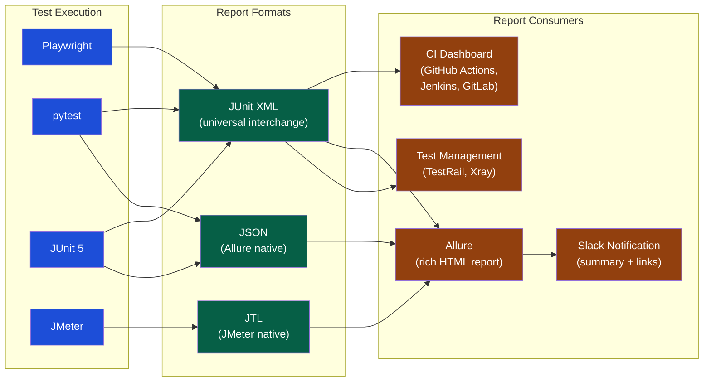

# Test Reporting

> [!abstract] TL;DR
> Test reporting transforms raw pass/fail data into actionable intelligence: which tests are failing, which are flaky, how coverage trends over time, and whether the suite is healthy. The JUnit XML format is the universal interchange format understood by every CI system. Allure Framework is the richest open-source test report generator, producing interactive HTML reports with history, trends, and categories. Flaky test detection — identifying tests that non-deterministically pass and fail — is the most underinvested reporting concern; a 5% flaky rate erodes team trust in the entire suite.

---

## The Test Reporting Ecosystem



---

## JUnit XML — The Universal Report Format

JUnit XML is supported by every CI system, test management tool, and reporting framework. Understanding the schema enables you to generate it from any test runner.

```xml
<?xml version="1.0" encoding="UTF-8"?>
<testsuites name="checkout-tests" tests="47" failures="2" errors="0" skipped="3" time="124.5">
    
    <testsuite name="CheckoutFlowTests" tests="12" failures="1" errors="0" skipped="0" time="45.2"
               timestamp="2026-07-30T09:00:00" hostname="runner-1">
        
        <testcase name="test_card_payment_success" classname="CheckoutFlowTests" time="2.341">
            <!-- No failure element = PASS -->
        </testcase>
        
        <testcase name="test_card_declined_shows_error" classname="CheckoutFlowTests" time="1.872">
            <!-- No failure element = PASS -->
        </testcase>
        
        <testcase name="test_paypal_redirect" classname="CheckoutFlowTests" time="8.413">
            <failure message="Expected status 302, got 500" type="AssertionError">
                AssertionError: Expected redirect to PayPal, received 500 Internal Server Error
                at tests/checkout/test_checkout_flow.py:84
                Stacktrace: ...
            </failure>
        </testcase>
        
        <testcase name="test_apple_pay_mobile" classname="CheckoutFlowTests" time="0.001">
            <skipped message="Apple Pay not available in CI environment"/>
        </testcase>
        
        <properties>
            <property name="environment" value="staging"/>
            <property name="browser" value="chromium"/>
        </properties>
    </testsuite>
    
</testsuites>
```

### Generating JUnit XML from Common Test Runners

```bash
# pytest
pytest tests/ \
  --junitxml=results/junit.xml \
  -v

# Playwright (TypeScript)
# playwright.config.ts:
reporter: [['junit', { outputFile: 'results/junit.xml' }]]

# JUnit 5 (Maven)
# pom.xml already produces surefire XML by default:
mvn test
# Output: target/surefire-reports/TEST-*.xml

# k6 (performance)
k6 run --out json=results/k6-output.json checkout-test.js
# Then convert to JUnit XML for CI:
k6-junit-report results/k6-output.json > results/k6-junit.xml
```

---

## Allure Framework

Allure produces rich, interactive HTML reports with historical trends, test categories, environment info, screenshots, and timelines.

### Setup

```bash
# Install Allure CLI
npm install -g allure-commandline

# Python (pytest)
pip install allure-pytest
pytest tests/ --alluredir=allure-results

# Generate HTML report
allure generate allure-results --clean -o allure-report
allure open allure-report

# Or serve locally
allure serve allure-results
```

### Allure Annotations (pytest)

```python
import allure
import pytest

@allure.epic("Checkout")
@allure.feature("Payment")
@allure.story("Card payment success")
@allure.severity(allure.severity_level.CRITICAL)
@allure.tag("regression", "smoke")
@pytest.mark.parametrize("card_type", ["visa", "mastercard", "amex"])
def test_card_payment(card_type: str, checkout_page):
    with allure.step(f"Enter {card_type} card details"):
        checkout_page.enter_card(card_type=card_type, number="4111111111111111")
    
    with allure.step("Place order"):
        result = checkout_page.place_order()
    
    with allure.step("Verify confirmation"):
        assert result.status == "confirmed", f"Expected confirmed, got {result.status}"
        allure.attach(
            checkout_page.screenshot(),
            name="confirmation-screenshot",
            attachment_type=allure.attachment_type.PNG
        )

@allure.issue("BUG-2241", "https://jira.company.com/browse/BUG-2241")
@allure.testcase("TC-1042", "https://testrail.company.com/index.php?/cases/view/1042")
def test_order_confirmation_email():
    ...
```

### Allure Report Structure

| Section | What It Shows |
|---|---|
| **Overview** | Pass/fail/broken/skipped counts; severity breakdown; trend chart |
| **Categories** | Failures grouped by type (product bug, test defect, flaky) |
| **Suites** | Test results organized by class/feature hierarchy |
| **Behaviors** | Epic → Feature → Story → Test case tree |
| **Timeline** | When each test ran; parallelism visualization |
| **History** | Per-test pass/fail trend across last N builds |
| **Graphs** | Severity distribution; test status pie; retry rate |

### Allure with GitHub Actions

```yaml
- name: Run tests
  run: pytest tests/ --alluredir=allure-results

- name: Generate Allure report
  uses: simple-elf/allure-report-action@v1
  with:
    allure_results: allure-results
    allure_history: allure-history
    keep_reports: 20    # keep last 20 runs in history

- name: Deploy Allure report to GitHub Pages
  uses: peaceiris/actions-gh-pages@v3
  with:
    github_token: ${{ secrets.GITHUB_TOKEN }}
    publish_branch: gh-pages
    publish_dir: allure-history
```

---

## HTML Reports from Other Frameworks

### Playwright HTML Reporter

```typescript
// playwright.config.ts
export default defineConfig({
    reporter: [
        ['html', { outputFolder: 'playwright-report', open: 'never' }],
        ['junit', { outputFile: 'results/junit.xml' }],
        ['list'],  // console output
    ],
});

// Generate and view
npx playwright test
npx playwright show-report
```

### pytest-html

```bash
pip install pytest-html

pytest tests/ \
  --html=reports/report.html \
  --self-contained-html \
  --junitxml=results/junit.xml
```

---

## Flaky Test Detection

A flaky test is one that produces non-deterministic results — passing on some runs and failing on others under the same code and environment conditions.

**Why flaky tests are dangerous:**
- Teams learn to ignore red CI builds: "It's probably just a flaky test"
- This erosion of trust means real failures also get dismissed
- Flaky tests take 3–5× longer to debug than deterministic failures
- A 5% flaky rate means a 10-test suite fails on every other run statistically

### Measuring Flakiness

```python
# Flakiness score calculation
# Run each test N times (e.g., 10 runs); count passes

def calculate_flakiness_score(test_name: str, runs: list[bool]) -> float:
    """
    runs: list of True (pass) / False (fail) per execution
    Returns flakiness score: 0 = always deterministic, 1 = maximally flaky
    """
    pass_count = sum(runs)
    fail_count = len(runs) - pass_count
    if pass_count == 0 or fail_count == 0:
        return 0.0  # deterministic (always pass or always fail)
    # Flakiness = how often it flips
    flips = sum(1 for i in range(1, len(runs)) if runs[i] != runs[i-1])
    return flips / (len(runs) - 1)

# Example:
# [T, T, F, T, F, T] → 4 flips / 5 = 0.8 (very flaky)
# [T, T, T, T, T, T] → 0 flips / 5 = 0.0 (deterministic)
```

### Flaky Test Detection with pytest-repeat

```bash
pip install pytest-repeat

# Run each test 5 times; reveal non-determinism
pytest tests/checkout/ --count=5 --repeat-scope=function

# Flag test as known flaky (quarantine)
@pytest.mark.flaky(reruns=3, reruns_delay=2)
def test_email_notification_received():
    # Network-dependent; allow 3 retries
    ...
```

### GitHub Actions: Flaky Test Report

```yaml
- name: Run tests with retry tracking
  run: |
    pytest tests/ \
      --junitxml=results/junit.xml \
      --reruns=2 \
      --reruns-delay=1 \
      -v 2>&1 | tee test-output.log

- name: Detect flaky tests
  run: |
    python3 scripts/detect_flaky.py \
      --junit results/junit.xml \
      --history results/history/ \
      --threshold 0.1 \
      --output results/flaky-report.json

- name: Comment flaky tests on PR
  uses: actions/github-script@v7
  with:
    script: |
      const flaky = require('./results/flaky-report.json');
      if (flaky.tests.length > 0) {
        const body = `## Flaky Tests Detected\n` +
          flaky.tests.map(t => `- \`${t.name}\`: ${t.flakiness_score} flakiness score`).join('\n');
        github.rest.issues.createComment({
          issue_number: context.issue.number,
          owner: context.repo.owner,
          repo: context.repo.repo,
          body
        });
      }
```

### Flaky Test Root Causes and Fixes

| Root Cause | Pattern | Fix |
|---|---|---|
| **Shared state** | Test A passes if run alone, fails after Test B | Use proper teardown; reset DB state between tests; use unique test data |
| **Timing/async** | Test fails 20% of the time; passes after `sleep(1)` | Use explicit waits, not sleeps; `waitFor()` in Playwright; `@eventually` in Awaitility |
| **External service** | Test fails on network timeout | Mock external dependencies; add retries only as a last resort |
| **Date/time** | Test passes in morning, fails after midnight | Freeze time; use `freezegun` (Python), `MockClock` (Java) |
| **Test ordering** | Tests fail when run in alphabetical order, pass randomly | Make each test independent; clean up in `setUp`/`tearDown` |
| **Concurrency** | Test fails when parallel execution is enabled | Guard shared resources; use proper locking or isolated environments |

---

## Test Trend Analysis

Trend analysis answers: Is the test suite getting healthier or degrading over time?

```python
# Calculate trend metrics from JUnit XML history
from pathlib import Path
import xml.etree.ElementTree as ET
from datetime import datetime

def analyze_trend(results_dir: str) -> dict:
    trend = []
    for xml_file in sorted(Path(results_dir).glob('junit-*.xml')):
        tree = ET.parse(xml_file)
        root = tree.getroot()
        # Handle both <testsuites> and <testsuite> root elements
        suite = root if root.tag == 'testsuite' else root.find('testsuite')
        
        total = int(suite.get('tests', 0))
        failures = int(suite.get('failures', 0))
        errors = int(suite.get('errors', 0))
        skipped = int(suite.get('skipped', 0))
        
        trend.append({
            'date': xml_file.stem.replace('junit-', ''),
            'total': total,
            'passed': total - failures - errors - skipped,
            'failed': failures + errors,
            'pass_rate': (total - failures - errors - skipped) / total * 100 if total > 0 else 0
        })
    return trend

# Alert if pass rate drops below threshold
def check_regression(trend: list, threshold: float = 98.0):
    recent = trend[-3:]  # last 3 runs
    avg_pass_rate = sum(r['pass_rate'] for r in recent) / len(recent)
    if avg_pass_rate < threshold:
        raise ValueError(f"Test suite health degrading: avg pass rate {avg_pass_rate:.1f}% < {threshold}%")
```

---

## CI Dashboard Integration

Most CI systems natively parse JUnit XML and display a test results dashboard without extra configuration.

| CI System | Configuration | Dashboard Feature |
|---|---|---|
| **GitHub Actions** | `publish-unit-test-result-action` or native test report | PR check with test summary; annotations on failures |
| **Jenkins** | JUnit plugin (built-in) | Test result trending chart; failure history |
| **GitLab CI** | `artifacts: reports: junit:` | Merge request widget with pass/fail delta |
| **CircleCI** | `store_test_results` step | Test insights dashboard; flaky test detection |

```yaml
# GitLab CI — native JUnit XML integration
test:
  script:
    - pytest tests/ --junitxml=junit.xml --cov=src --cov-report=xml
  artifacts:
    when: always
    reports:
      junit: junit.xml
      coverage_report:
        coverage_format: cobertura
        path: coverage.xml
    paths:
      - allure-results/
    expire_in: 7 days

# GitHub Actions — publish test results as PR check
- name: Publish Test Results
  uses: EnricoMi/publish-unit-test-result-action@v2
  if: always()
  with:
    files: |
      results/**/*.xml
    comment_mode: failures    # only comment if failures exist
    check_name: Test Results
```

---

## Common Pitfalls

1. **No historical data** — A single test run's pass rate tells you nothing without context. Store at least 30 builds of history to detect trends.
2. **Treating all flaky tests as acceptable** — Quarantining flaky tests (marking them `@skip` or `@flaky`) is a short-term tactic, not a solution. Track the quarantine list and schedule fixes.
3. **Not including failure context in reports** — A failure message of "AssertionError" without a screenshot, stack trace, or environment info forces re-running the test to diagnose it. Attach artifacts.
4. **JUnit XML without timestamps** — CI tools use timestamps to calculate run duration trends. Always include `timestamp` attributes.
5. **Allure results not persisted across runs** — Allure history requires the previous `allure-history` artifact to be downloaded and merged. Without this, every report shows only the current run with no trend.
6. **Muting CI failures** — Teams that add `|| true` to test commands to prevent CI from blocking deploys are flying blind. A failing test that doesn't block anything is not a test.

---

## Review Questions

1. A test suite has a 5% flaky rate. On a 200-test suite run in parallel across 4 workers, what is the expected probability that at least one flaky test fails in a given CI run? What does this mean for team trust in the pipeline?
2. What is the minimal information that every test failure report should include to enable a developer to diagnose the failure without re-running it?
3. Your team uses pytest. Walk through the steps to publish an Allure report with historical trend data to GitHub Pages after every merge to main.
4. Distinguish between a flaky test and a slow test. What detection and remediation approach applies to each?

---

## Related Notes

- [[_MOC_QA_Testing_Master|↑ QA Testing MOC]]
- [[CI_CD_Testing_Integration]]
- [[Test_Automation_Architecture]]
- [[Performance_Testing]]
- [[JMeter_Performance]]

---

#QA #Testing #TestReporting #Allure #JUnit #FlakyTests #CIDashboard
