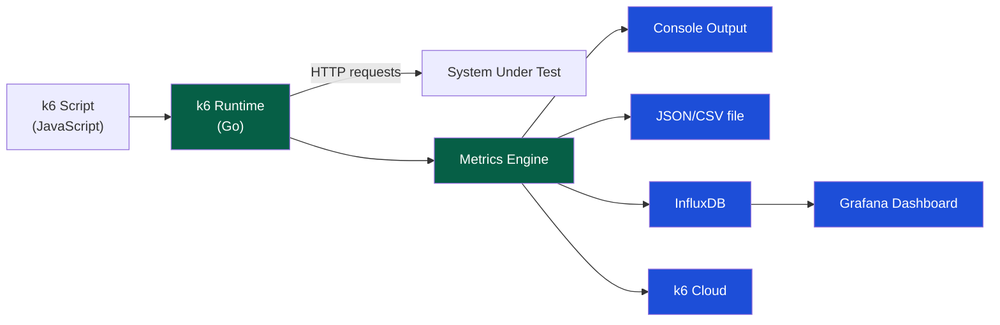

# k6 Performance Testing

> [!abstract] TL;DR
> k6 is a modern open-source load testing tool: JavaScript API with a Go runtime (fast and resource-efficient). Tests are scripts — version-controllable, reviewable, CI-friendly. Built-in thresholds act as pass/fail gates (P95 < 500ms fails the CI build). Custom metrics (`Counter`, `Gauge`, `Trend`, `Rate`) track business-level indicators beyond HTTP. Scenarios model complex traffic patterns — ramping VUs, constant arrival rate, per-VU iterations. k6 Cloud distributes load across regions.

---

## Architecture



---

## Installation

```bash
# Linux (Debian/Ubuntu)
sudo gpg -k
sudo gpg --no-default-keyring --keyring /usr/share/keyrings/k6-archive-keyring.gpg \
    --keyserver hkp://keyserver.ubuntu.com:80 --recv-keys C5AD17C747E3415A3642D57D77C6C491D6AC1D69
echo "deb [signed-by=/usr/share/keyrings/k6-archive-keyring.gpg] \
    https://dl.k6.io/deb stable main" | sudo tee /etc/apt/sources.list.d/k6.list
sudo apt update && sudo apt install k6

# macOS
brew install k6

# Docker
docker run --rm -i grafana/k6 run - < script.js

# Windows (via chocolatey)
choco install k6
```

---

## Test Structure and Lifecycle

```javascript
import http from 'k6/http';
import { check, sleep } from 'k6';

// 1. INIT STAGE — runs once per VU at startup (not counted in metrics)
const BASE_URL = __ENV.BASE_URL || 'https://staging.example.com';
const token = __ENV.API_TOKEN;

// 2. OPTIONS — test configuration
export const options = {
    vus: 10,
    duration: '30s',
};

// 3. SETUP — runs once before load test starts (for seeding data, auth, etc.)
export function setup() {
    const res = http.post(`${BASE_URL}/api/auth/token`, JSON.stringify({
        client_id: __ENV.CLIENT_ID,
        client_secret: __ENV.CLIENT_SECRET,
    }), { headers: { 'Content-Type': 'application/json' } });

    return { token: res.json().access_token };  // returned data passed to default()
}

// 4. DEFAULT FUNCTION — the actual load scenario (runs N times per VU)
export default function (data) {
    const params = {
        headers: {
            'Authorization': `Bearer ${data.token}`,
            'Content-Type': 'application/json',
        },
    };

    const res = http.get(`${BASE_URL}/api/products`, params);

    check(res, {
        'status is 200': r => r.status === 200,
        'response < 300ms': r => r.timings.duration < 300,
        'product list not empty': r => r.json().length > 0,
    });

    sleep(1);  // think time between iterations
}

// 5. TEARDOWN — runs once after load test completes
export function teardown(data) {
    // Clean up test data created in setup()
    http.del(`${BASE_URL}/api/test/cleanup`, null, {
        headers: { 'Authorization': `Bearer ${data.token}` }
    });
}
```

---

## HTTP Requests

```javascript
import http from 'k6/http';

// GET
const res = http.get('https://api.example.com/products');

// GET with params
const res = http.get('https://api.example.com/products', {
    headers: { 'Authorization': 'Bearer token' },
    tags: { name: 'GetProducts' },   // group metrics by name
    timeout: '5s',
});

// POST JSON
const payload = JSON.stringify({ sku: 'SKU-001', quantity: 2 });
const res = http.post('https://api.example.com/cart', payload, {
    headers: { 'Content-Type': 'application/json' },
});

// PUT with JSON
http.put('https://api.example.com/orders/123', JSON.stringify({ status: 'CANCELLED' }), {
    headers: { 'Content-Type': 'application/json' },
});

// DELETE
http.del('https://api.example.com/cart/items/456');

// Batch requests (parallel within one iteration)
const responses = http.batch([
    ['GET', 'https://api.example.com/products'],
    ['GET', 'https://api.example.com/categories'],
    ['GET', 'https://api.example.com/banners'],
]);

responses.forEach(res => check(res, { 'status 200': r => r.status === 200 }));
```

---

## Custom Metrics

```javascript
import { Counter, Gauge, Rate, Trend } from 'k6/metrics';

// Counter: cumulative count (checkout_attempts_total)
const checkoutAttempts = new Counter('checkout_attempts');

// Rate: ratio (0–1) — perfect for error rates and success rates
const checkoutSuccessRate = new Rate('checkout_success_rate');

// Trend: distribution (like response time) — tracks min/max/avg/percentiles
const checkoutDuration = new Trend('checkout_duration', true);  // true = milliseconds

// Gauge: current value (active_sessions, queue_depth)
const activeConnections = new Gauge('active_connections');

export default function () {
    checkoutAttempts.add(1);

    const start = Date.now();
    const res = http.post(`${BASE_URL}/api/checkout`, payload, params);
    const duration = Date.now() - start;

    checkoutDuration.add(duration);

    const success = check(res, { 'checkout ok': r => r.status === 201 });
    checkoutSuccessRate.add(success);

    if (!success) {
        console.error(`Checkout failed: ${res.status} ${res.body}`);
    }
}
```

---

## Thresholds — Pass/Fail Gates

```javascript
export const options = {
    thresholds: {
        // Built-in metrics
        'http_req_duration': [
            'p(50)<200',     // median under 200ms
            'p(95)<500',     // 95th percentile under 500ms
            'p(99)<1000',    // 99th percentile under 1 second
        ],
        'http_req_failed': ['rate<0.01'],  // error rate < 1%
        'http_req_duration{name:CheckoutAPI}': ['p(95)<800'],  // named group threshold

        // Custom metrics
        'checkout_success_rate': ['rate>0.99'],          // 99% success
        'checkout_duration': ['p(95)<600', 'avg<300'],

        // Abort on threshold breach (don't continue test)
        'http_req_failed': [{ threshold: 'rate<0.05', abortOnFail: true, delayAbortEval: '10s' }],
    },
};
```

**Exit codes**: k6 returns exit code `0` (pass) or `99` (threshold failure) — CI pipelines use this to fail the build.

---

## Scenarios — Advanced Load Patterns

```javascript
export const options = {
    scenarios: {
        // Scenario 1: Constant arrival rate (RPS-based — realistic)
        checkout_steady: {
            executor: 'constant-arrival-rate',
            rate: 50,                   // 50 iterations/second
            timeUnit: '1s',
            duration: '5m',
            preAllocatedVUs: 100,       // VU pool
            maxVUs: 200,
        },

        // Scenario 2: Ramp up VUs (user-based)
        browse_ramping: {
            executor: 'ramping-vus',
            startVUs: 0,
            stages: [
                { duration: '2m', target: 50 },
                { duration: '5m', target: 200 },
                { duration: '2m', target: 0 },
            ],
        },

        // Scenario 3: Fixed number of iterations per VU
        smoke_test: {
            executor: 'per-vu-iterations',
            vus: 5,
            iterations: 10,
            maxDuration: '1m',
        },

        // Run scenarios with time offsets
        spike: {
            executor: 'ramping-arrival-rate',
            startRate: 10,
            timeUnit: '1s',
            stages: [
                { duration: '30s', target: 500 },  // spike!
                { duration: '1m', target: 10 },    // recovery
            ],
            preAllocatedVUs: 200,
        },
    },
};

// Map scenarios to functions
export function checkout_steady() { /* checkout logic */ }
export function browse_ramping() { /* browse logic */ }
export function smoke_test() { /* critical path */ }
```

---

## Checks vs Thresholds

| | Checks | Thresholds |
|--|--------|-----------|
| **Definition** | Per-request boolean assertions | Aggregate metric gates for the whole test |
| **Failure effect** | Recorded as check failure (no abort) | Fails the test run (exit code 99) |
| **Timing** | Evaluated during execution | Evaluated after (or continuously with `abortOnFail`) |
| **Use** | "Did this response have status 200?" | "Did P95 latency stay under 500ms overall?" |

---

## Running and Output

```bash
# Basic run
k6 run script.js

# With environment variables
k6 run --env BASE_URL=https://staging.example.com --env API_TOKEN=xxx script.js

# Output to InfluxDB (live Grafana dashboard)
k6 run --out influxdb=http://localhost:8086/k6 script.js

# Output to JSON file
k6 run --out json=results.json script.js

# Output summary stats
k6 run --summary-export summary.json script.js

# Cloud execution (requires k6 account)
k6 cloud script.js

# Docker run
docker run --rm -i grafana/k6 run - < script.js \
    -e BASE_URL=https://staging.example.com
```

**Sample output**:
```
          /\      |‾‾| /‾‾/   /‾‾/
     /\  /  \     |  |/  /   /  /
    /  \/    \    |     (   /   ‾‾\
   /          \   |  |\  \ |  (‾)  |
  / __________ \  |__| \__\ \_____/ .io

  scenarios: (100.00%) 1 scenario, 100 max VUs
  default: 100 looping VUs for 5m0s (gracefulStop: 30s)

  ✓ status is 200
  ✓ response < 500ms
  ✗ has orderId (2.3% failed)

  checks.........................: 99.23% ✓ 89310  ✗ 692
  data_received..................: 45 MB 150 kB/s
  http_req_duration..............: avg=187ms min=45ms med=175ms max=2.1s p(90)=320ms p(95)=410ms p(99)=892ms
  http_req_failed................: 0.12% ✓ 108  ✗ 89202

  THRESHOLDS
  http_req_duration............: p(95)<500 ✓  p(99)<1000 ✓
  http_req_failed..............: rate<0.01 ✓
```

---

## Grafana Dashboard Integration

```yaml
# docker-compose.yml — local observability stack
version: "3"
services:
  influxdb:
    image: influxdb:1.8
    ports: ["8086:8086"]
    environment:
      INFLUXDB_DB: k6

  grafana:
    image: grafana/grafana:latest
    ports: ["3000:3000"]
    environment:
      GF_AUTH_ANONYMOUS_ENABLED: "true"
    volumes:
      - ./grafana/dashboards:/var/lib/grafana/dashboards
      - ./grafana/provisioning:/etc/grafana/provisioning
```

```bash
# Run k6 with InfluxDB output
k6 run --out influxdb=http://localhost:8086/k6 checkout-test.js
# Then view in Grafana at http://localhost:3000
# Import dashboard ID 2587 (official k6 dashboard)
```

---

## Common Pitfalls

1. **Using VU-based executor for latency-sensitive tests** — when VUs block waiting for slow responses, RPS drops; use `constant-arrival-rate` to maintain fixed RPS regardless of response time
2. **Running `sleep(0)` or no sleep** — no think time generates artificially high concurrent requests; add realistic `sleep(1)` to model user behaviour
3. **Sharing state between VUs via `export let`** — VUs run in separate goroutines; shared state causes race conditions; use the `setup()` return value to pass read-only data to VUs
4. **Not tagging requests** — without `tags: { name: 'CheckoutAPI' }`, all requests merge into a single metric; tag requests to get per-endpoint percentiles
5. **Ignoring server-side metrics** — k6 measures client-side latency; a 400ms response could be 50ms server processing + 350ms network; always correlate with server-side APM (Datadog, New Relic)

---

## Review Questions

1. What is the difference between a `Rate` and a `Trend` custom metric in k6? Give a use case for each.
2. What is the difference between `checks` and `thresholds`? Which one fails the CI build?
3. When should you use `constant-arrival-rate` executor vs `ramping-vus`?
4. Write k6 thresholds that fail the build if: P95 > 500ms, P99 > 1000ms, or error rate > 0.5%.

---

## Related Notes

- [[_MOC_QA_Testing_Master|↑ QA Testing MOC]]
- [[Performance_Testing]]
- [[CI_CD_Testing_Integration]]
- [[_MOC_DevOps_Master|DevOps MOC]]

---

#QA #Testing #Performance #k6 #LoadTesting #Grafana
