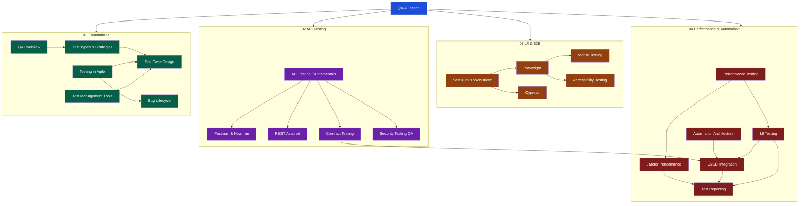

# QA and Software Testing

> **About**: 22 notes across 4 sections covering the full QA engineering spectrum — from testing foundations and bug lifecycle to API contract testing, security and accessibility testing, browser automation (Playwright, Cypress, Selenium), mobile testing, performance testing with JMeter and k6, test management tools, and CI/CD quality gates with rich test reporting.

---

## Concept Map

---

## Sections

### 01 — Foundations
*Core concepts every QA engineer must know*

| Note | Topics | Difficulty |
|------|--------|-----------|
| [[QA_Overview]] | QA vs QC vs Testing, testing pyramid, testing quadrants, cost of defects (shift-left), SDLC phases, QA metrics | Beginner |
| [[Test_Types_and_Strategies]] | Functional types (unit→UAT), non-functional types, test strategy vs plan vs case, risk-based testing, EP/BVA/decision tables/state transition | Beginner |
| [[Test_Case_Design]] | Test case anatomy, writing best practices, BDD Gherkin (Given/When/Then), test data management, coverage types (statement/branch/MC/DC), traceability matrix | Beginner |
| [[Bug_Lifecycle]] | Bug report anatomy, severity vs priority, bug lifecycle states, Jira workflow, root cause analysis (5-whys, fishbone), defect clustering, zero bug policy | Beginner |
| [[Testing_in_Agile]] | Sprint testing workflow, Definition of Done, whole-team quality, three amigos, specification by example, exploratory testing, automation ROI, quality metrics per sprint | Beginner |
| [[Test_Management_Tools]] | TestRail, Zephyr Scale, qTest, Xray (Jira), test plan structure (entry/exit criteria), traceability matrix, requirements coverage, CI API integration | Intermediate |

### 02 — API Testing
*Testing HTTP APIs — from REST fundamentals to contract testing*

| Note | Topics | Difficulty |
|------|--------|-----------|
| [[API_Testing_Fundamentals]] | REST API test checklist, HTTP idempotency, test data isolation, contract vs functional testing, negative testing patterns, Postman collections, Newman CLI | Intermediate |
| [[Postman_and_Newman]] | Workspace setup, variable scoping, dynamic variables, pre-request scripts (token refresh), test scripts (`pm.expect`), data-driven CSV, Newman flags, htmlextra reporter, mock servers | Intermediate |
| [[REST_Assured_and_API_Testing]] | Given/When/Then DSL, request/response specs, JSON path assertions, authentication (basic/OAuth2/JWT), JSON Schema validation, parameterized API tests, multipart file upload | Intermediate |
| [[Contract_Testing]] | Consumer-driven contract testing, Pact (consumer + provider), PactFlow broker, `can-i-deploy`, breaking vs non-breaking changes, OpenAPI/Prism/Dredd, GraphQL contracts | Advanced |
| [[Security_Testing_QA]] | OWASP Top 10, authentication testing (JWT attacks, lockout), IDOR/authorization bypass, SQL injection fuzzing, OWASP ZAP DAST in CI, Burp Suite basics for QA | Advanced |

### 03 — UI and E2E Testing
*Browser and mobile automation*

| Note | Topics | Difficulty |
|------|--------|-----------|
| [[Selenium_and_WebDriver]] | WebDriver architecture (W3C), Selenium 4 (CDP, relative locators), locator priority order, Page Object Model, WebDriverManager, explicit vs implicit waits, Selenium Grid | Intermediate |
| [[Playwright_Testing]] | Auto-wait, semantic locators (`getByRole`/`getByLabel`), network interception (`page.route`), visual comparison, browser contexts, codegen, trace viewer, CI Docker setup | Intermediate |
| [[Cypress_Testing]] | In-browser architecture, command chaining, auto-retry, fixtures, `cy.intercept` (spy vs stub), custom commands, Component Testing, Percy/Chromatic visual testing, Cypress Cloud | Intermediate |
| [[Mobile_Testing]] | Device fragmentation, Appium (cross-platform WebDriver), Espresso (`ViewActions`/`ViewMatchers`), XCUITest (accessibility identifiers), Detox (React Native gray-box), device farms | Advanced |
| [[Accessibility_Testing]] | WCAG 2.1/2.2 levels (A/AA/AAA), POUR principles, Axe+Playwright/Cypress, Wave API, NVDA/VoiceOver screen reader testing, ARIA roles and states, automated vs manual A11y | Intermediate |

### 04 — Performance and Automation
*Performance testing tools and automation engineering*

| Note | Topics | Difficulty |
|------|--------|-----------|
| [[Performance_Testing]] | Load/stress/spike/soak test types, key metrics (RPS, P50/P95/P99, error rate), JMeter (thread groups, distributed), k6 overview, Gatling (Scala DSL), Artillery (YAML), baseline vs regression | Advanced |
| [[JMeter_Performance]] | JMeter architecture (master/worker), Thread Groups (ramp/shaping), samplers (HTTP/JDBC/WebSocket), extractors, assertions, CLI mode, distributed testing, CI integration, JMeter vs k6 | Advanced |
| [[k6_Performance_Testing]] | Architecture, test lifecycle (setup/default/teardown), HTTP methods, custom metrics (Counter/Gauge/Trend/Rate), thresholds (pass/fail gates), scenarios (arrival rate, ramping VUs), Grafana integration | Advanced |
| [[Test_Automation_Architecture]] | Framework design principles, POM deep dive, Screenplay Pattern (actor/task/question), data-driven testing (CSV/JSON), flaky test quarantine, test pyramid implementation, Testcontainers, Allure reports | Advanced |
| [[CI_CD_Testing_Integration]] | Pipeline architecture, GitHub Actions (matrix, services, artifacts), JaCoCo coverage gates, Pact broker in CI, E2E matrix (browser/OS), ephemeral Docker environments, test result publishing, pre-commit unit tests | Advanced |
| [[Test_Reporting]] | Allure Framework (annotations, history, GitHub Pages), JUnit XML schema, flaky test detection and scoring, trend analysis, CI dashboard integration (GitHub Actions, GitLab, CircleCI) | Intermediate |

---

## Learning Paths

### Path A — QA Engineer (Manual → Automation)
*Start here if you're new to QA or transitioning from manual testing*

1. [[QA_Overview]] — understand the QA mindset and where it fits in SDLC
2. [[Test_Types_and_Strategies]] — know what types of tests exist and when to use them
3. [[Test_Case_Design]] — master writing effective, maintainable test cases
4. [[Bug_Lifecycle]] — report bugs professionally and track them to resolution
5. [[Testing_in_Agile]] — work effectively in a Scrum/Kanban team
6. [[API_Testing_Fundamentals]] — level up to API testing (most in-demand skill)
7. [[Postman_and_Newman]] — master Postman collections and Newman in CI
8. [[Selenium_and_WebDriver]] — start UI automation with the industry standard
9. [[Playwright_Testing]] — move to modern browser automation

### Path B — Test Automation Engineer
*Start here if you're already coding and want to build robust automation suites*

1. [[Test_Automation_Architecture]] — design the framework before writing tests
2. [[REST_Assured_and_API_Testing]] — Java DSL for API testing
3. [[Contract_Testing]] — Pact for microservice API compatibility
4. [[Selenium_and_WebDriver]] — POM, WebDriverManager, Selenium Grid
5. [[Playwright_Testing]] — modern E2E with TypeScript
6. [[Cypress_Testing]] — browser-native automation and component testing
7. [[CI_CD_Testing_Integration]] — integrate everything into the pipeline
8. [[Mobile_Testing]] — extend to iOS/Android automation

### Path C — Performance Engineer
*Start here if you're focused on scalability and non-functional requirements*

1. [[Performance_Testing]] — understand all performance test types and metrics
2. [[JMeter_Performance]] — master JMeter: thread groups, distributed testing, CI integration
3. [[k6_Performance_Testing]] — master the modern load testing tool
4. [[API_Testing_Fundamentals]] — understand the APIs you're load testing
5. [[CI_CD_Testing_Integration]] — build performance gates into CI/CD
6. [[Test_Reporting]] — publish Allure reports and detect flaky tests in CI

### Path D — Security and Accessibility QA
*Start here if you're expanding into non-functional quality domains*

1. [[QA_Overview]] — understand the full quality landscape
2. [[API_Testing_Fundamentals]] — build the API testing foundation
3. [[Security_Testing_QA]] — OWASP Top 10, DAST in pipeline, auth testing, IDOR
4. [[Accessibility_Testing]] — WCAG 2.1 AA, Axe automation, screen reader manual testing
5. [[CI_CD_Testing_Integration]] — integrate ZAP and Axe scans into the pipeline
6. [[Test_Management_Tools]] — manage test cases and traceability for compliance

---

## Cross-Vault Links

- [[_MOC_Java_Testing|Java Testing MOC]] — JUnit 5, Mockito, Testcontainers, Spring Boot testing
- [[_MOC_DevOps_Master|DevOps MOC]] — CI/CD pipelines, Docker, Kubernetes, monitoring

---

#QA #Testing #MOC
