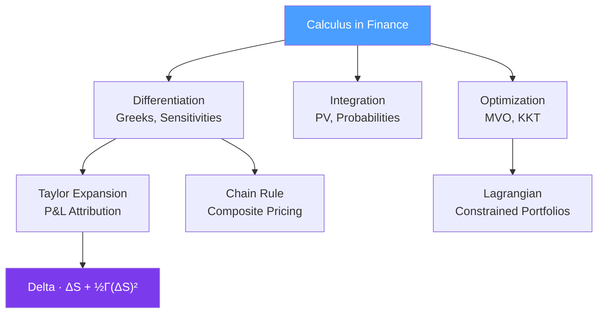

# 📐 Calculus for Finance

> [!abstract] TL;DR
> Calculus is the language of change — exactly what finance needs to model how option prices move as markets shift. The key tools are Taylor expansions (which give you the Greeks), Lagrangian optimization (which gives you MVO), and integration (which gives you present values and probabilities). Every pricing formula you encounter traces back to a differential equation.

## Intuition — Analogy First

Think of an option price as a curved hill in a landscape, where the x-axis is the stock price and the y-axis is the option value. A derivative (in the calculus sense) tells you the local slope of that hill — that is your **delta**: how much the option moves when the stock moves a little. But the hill is curved, not flat, so a second derivative tells you how the slope itself changes — that is your **gamma**: the rate of change of the rate of change.

Now imagine you are standing on that hill in fog. You cannot see the whole landscape. Taylor's theorem says: given your current position and the local slope and curvature, you can estimate how high you will be if you take a small step. This is exactly how traders hedge option books in real time — they approximate the non-linear P&L using delta (first-order) and gamma (second-order) terms without solving the full pricing model on every tick.

Portfolio optimization follows a different calculus story. You want to minimize risk subject to constraints (target return, weights sum to one). This is the classic Lagrangian multiplier setup — attach a penalty for each violated constraint, then set all partial derivatives to zero and solve. The result, MVO (Mean-Variance Optimization), is pure multivariable calculus applied to portfolio weights.

---

## How It Works



## Key Concepts / Details

### Taylor Expansion and Option P&L

The second-order Taylor expansion of an option price $V(S, t)$ around current values gives the fundamental P&L attribution:

$$\delta V \approx \Delta \cdot \delta S + \frac{1}{2}\Gamma(\delta S)^2 + \Theta \cdot \delta t$$

where:
- $\Delta = \frac{\partial V}{\partial S}$ is delta — first-order price sensitivity
- $\Gamma = \frac{\partial^2 V}{\partial S^2}$ is gamma — second-order convexity
- $\Theta = \frac{\partial V}{\partial t}$ is theta — time decay

The $\Gamma(\delta S)^2$ term is why options have **convexity**: a long option position benefits symmetrically from large moves in either direction. A delta-hedged long gamma position makes money proportional to $(\delta S)^2$, which is always non-negative. This is why traders say "long gamma is long volatility."

Higher-order terms (speed, color, vomma) come from taking more Taylor terms but are rarely used in practice.

### The Greeks — Partial Derivatives in Options Pricing

Each Greek is a partial derivative of the option value function:

| Greek | Formula | Intuition |
|-------|---------|-----------|
| Delta $\Delta$ | $\partial V / \partial S$ | Price change per $1 stock move |
| Gamma $\Gamma$ | $\partial^2 V / \partial S^2$ | Rate of delta change |
| Vega $\mathcal{V}$ | $\partial V / \partial \sigma$ | Sensitivity to volatility |
| Theta $\Theta$ | $\partial V / \partial t$ | Time decay per day |
| Rho $\rho$ | $\partial V / \partial r$ | Interest rate sensitivity |

For a Black-Scholes call, delta is $\Delta = N(d_1)$ where $d_1 = \frac{\ln(S/K) + (r + \sigma^2/2)T}{\sigma\sqrt{T}}$. This formula comes directly from differentiating the Black-Scholes PDE solution with respect to $S$.

### Chain Rule in Derivative Pricing

The chain rule is essential when pricing functions depend on intermediate quantities. If $V$ depends on the forward price $F$, and $F = S e^{(r-q)T}$, then:

$$\frac{\partial V}{\partial r} = \frac{\partial V}{\partial F} \cdot \frac{\partial F}{\partial r} = \frac{\partial V}{\partial F} \cdot T \cdot S e^{(r-q)T}$$

This propagates sensitivities through composite mappings — critical in multi-factor models like HJM interest rate models.

### MVO Lagrangian Formulation

Minimize portfolio variance subject to target return:

$$\mathcal{L}(\mathbf{w}, \lambda, \mu) = \frac{1}{2}\mathbf{w}^\top \Sigma \mathbf{w} - \lambda(\mathbf{w}^\top \boldsymbol{\mu} - \mu^*) - \mu(\mathbf{1}^\top \mathbf{w} - 1)$$

Setting $\frac{\partial \mathcal{L}}{\partial \mathbf{w}} = 0$ gives the optimality condition:

$$\Sigma \mathbf{w} = \lambda \boldsymbol{\mu} + \mu \mathbf{1}$$

Solving this linear system yields the efficient frontier weights. See [[Linear_Algebra_Finance]] for how $\Sigma$ is decomposed.

### KKT Conditions for Constrained Portfolio Problems

When adding inequality constraints (long-only: $w_i \geq 0$, position limits: $w_i \leq c_i$), the KKT conditions extend the Lagrangian:

$$\frac{\partial \mathcal{L}}{\partial w_i} = 0 \quad \text{for active assets}$$
$$\frac{\partial \mathcal{L}}{\partial w_i} \geq 0 \quad \text{for assets at lower bound}$$

This is the basis of quadratic programming solvers used in commercial portfolio optimizers (CVXPY, Gurobi).

### Integration in Finance

**Present value** is fundamentally an integral: $PV = \int_0^T C(t) e^{-rt} dt$

**Risk-neutral probability** of exercise: $P(S_T > K) = \int_K^\infty f(S_T) dS_T = N(d_2)$

**Expected shortfall (CVaR)** at confidence $\alpha$: $CVaR_\alpha = \frac{1}{1-\alpha} \int_\alpha^1 VaR_u \, du$

### Numerical Differentiation

When closed-form derivatives are unavailable, finite differences approximate them:

- **Forward difference**: $f'(x) \approx \frac{f(x+h) - f(x)}{h}$ — $O(h)$ error
- **Central difference**: $f'(x) \approx \frac{f(x+h) - f(x-h)}{2h}$ — $O(h^2)$ error (preferred)
- **Second derivative**: $f''(x) \approx \frac{f(x+h) - 2f(x) + f(x-h)}{h^2}$

Central differences are the default for numerical Greeks in practice. See [[Numerical_Methods]] for finite difference PDE grids.

## Python Example

```python
import numpy as np
from scipy.stats import norm

def black_scholes_greeks(S, K, T, r, sigma, option_type='call'):
    """
    Compute Black-Scholes option price and Greeks analytically.
    Uses partial derivatives of the BS formula.
    """
    d1 = (np.log(S / K) + (r + 0.5 * sigma**2) * T) / (sigma * np.sqrt(T))
    d2 = d1 - sigma * np.sqrt(T)

    if option_type == 'call':
        price = S * norm.cdf(d1) - K * np.exp(-r * T) * norm.cdf(d2)
        delta = norm.cdf(d1)
        theta = (-(S * norm.pdf(d1) * sigma) / (2 * np.sqrt(T))
                 - r * K * np.exp(-r * T) * norm.cdf(d2)) / 365  # per day
    else:
        price = K * np.exp(-r * T) * norm.cdf(-d2) - S * norm.cdf(-d1)
        delta = norm.cdf(d1) - 1
        theta = (-(S * norm.pdf(d1) * sigma) / (2 * np.sqrt(T))
                 + r * K * np.exp(-r * T) * norm.cdf(-d2)) / 365

    gamma = norm.pdf(d1) / (S * sigma * np.sqrt(T))
    vega  = S * norm.pdf(d1) * np.sqrt(T) / 100  # per 1% vol move

    return {'price': price, 'delta': delta, 'gamma': gamma,
            'vega': vega, 'theta': theta}

def taylor_pnl_attribution(delta, gamma, theta, dS, dt):
    """
    Approximate option P&L using 2nd-order Taylor expansion.
    delta_V ≈ Delta * dS + 0.5 * Gamma * dS^2 + Theta * dt
    """
    delta_term = delta * dS
    gamma_term = 0.5 * gamma * dS**2
    theta_term = theta * dt
    total = delta_term + gamma_term + theta_term
    return {
        'delta_pnl': delta_term,
        'gamma_pnl': gamma_term,
        'theta_pnl': theta_term,
        'total_approx': total
    }

# Example: ATM call option
params = dict(S=100, K=100, T=0.25, r=0.05, sigma=0.20)
greeks = black_scholes_greeks(**params)
print(f"Price: {greeks['price']:.4f}")
print(f"Delta: {greeks['delta']:.4f}")
print(f"Gamma: {greeks['gamma']:.6f}")
print(f"Vega:  {greeks['vega']:.4f}")
print(f"Theta: {greeks['theta']:.4f} per day")

# Taylor P&L for a +2% stock move over 1 day
pnl = taylor_pnl_attribution(greeks['delta'], greeks['gamma'],
                              greeks['theta'], dS=2.0, dt=1)
print(f"\nP&L attribution for +$2 move:")
for k, v in pnl.items():
    print(f"  {k}: {v:.4f}")
```

## Real-World Notes

- **Delta hedging** uses the first derivative to maintain a market-neutral position, but gamma leakage causes P&L to deviate as markets move — requiring dynamic rebalancing.
- **MVO in practice** often fails due to estimation error in $\boldsymbol{\mu}$; the gradient of the objective is very sensitive to expected returns. Shrinkage and Black-Litterman models regularize the solution.
- **Theta vs. gamma trade-off**: a long option position has positive gamma (benefits from moves) but negative theta (bleeds time value daily). The relationship is pinned by the Black-Scholes PDE: $\Theta + \frac{1}{2}\sigma^2 S^2 \Gamma + rS\Delta - rV = 0$.

## Common Pitfalls

- Confusing first-order delta approximation with the full P&L: for large moves, gamma terms dominate and the linear approximation breaks down badly.
- Using forward differences instead of central differences for numerical Greeks — the $O(h)$ error introduces systematic bias in risk numbers.
- Ignoring cross-Greeks (e.g., DdeltaDvol / "vanna") in exotic options where joint moves of $S$ and $\sigma$ create significant second-order effects.
- In MVO, treating the Lagrangian solution as global minimum when inequality constraints are active — need QP solver, not just solving the first-order conditions.

## Related Concepts

- [[Stochastic_Calculus]] — Itô's lemma is the stochastic generalization of the chain rule; the Black-Scholes PDE is derived using Taylor expansion + Itô
- [[Linear_Algebra_Finance]] — MVO optimization requires matrix inversion of the covariance matrix $\Sigma$
- [[Numerical_Methods]] — Finite difference methods discretize PDEs derived from calculus; numerical Greeks use finite difference approximations

## Review Questions

1. Write the second-order Taylor expansion for an option price change and identify each Greek term.
2. Why does a long gamma position profit symmetrically from both up and down moves?
3. Derive the KKT conditions for a long-only MVO problem with a target return constraint.
4. What is the relationship between theta and gamma implied by the Black-Scholes PDE?
5. Why is central difference preferred over forward difference for numerical Greeks?
6. How does the chain rule apply when computing the rho of an option on a dividend-paying stock?

## Sources

- Hull, J. — *Options, Futures, and Other Derivatives*, Chapter 19 (Greeks)
- Wilmott, P. — *Paul Wilmott on Quantitative Finance*, Vol. 1, Chapters 3-6
- Boyd & Vandenberghe — *Convex Optimization*, Chapter 5 (KKT conditions)

#quantitative-finance #math-foundations #calculus #greeks #optimization
