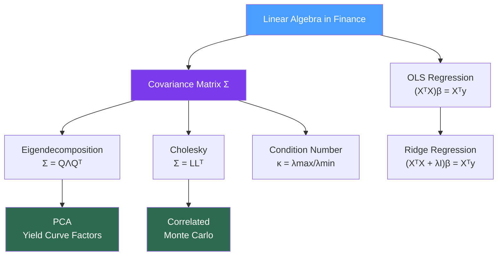

# 🔢 Linear Algebra for Finance

> [!abstract] TL;DR
> Linear algebra is the backbone of portfolio theory and quantitative modeling. The covariance matrix $\Sigma$ encodes all pairwise asset relationships, and nearly every quant technique — MVO, PCA, factor models, OLS regression, Monte Carlo correlation — reduces to operations on this matrix. Understanding eigendecomposition, Cholesky factorization, and matrix conditioning separates robust quant models from fragile ones.

## Intuition — Analogy First

Imagine a portfolio as a recipe, and each asset as an ingredient. The weights $\mathbf{w}$ are the proportions. Portfolio return is just a weighted average — a dot product, $\mu_p = \mathbf{w}^\top \boldsymbol{\mu}$. Simple enough. But portfolio **risk** is more complex, because ingredients interact: equities and bonds often move oppositely, oil and airline stocks move oppositely, tech stocks move together. You cannot capture this with simple averages — you need the full pairwise interaction table. That table is the covariance matrix $\Sigma$.

Now imagine you want to understand the essential "flavors" in your portfolio — what are the few underlying themes driving most of the variance? This is PCA: it rotates the coordinate system so that the first axis captures the most variance, the second captures the next most, and so on. Applied to a yield curve, PCA reveals that just three factors explain ~98% of all interest rate moves: level, slope, and curvature.

When you simulate correlated stock paths for Monte Carlo, you need to "color" independent random numbers with the right correlation structure. Cholesky decomposition is the tool: it finds a lower-triangular matrix $L$ such that $\Sigma = LL^\top$, letting you transform uncorrelated standard normals into correlated ones.

---

## How It Works



## Key Concepts / Details

### Portfolio Variance as a Quadratic Form

Portfolio variance is:

$$\sigma_p^2 = \mathbf{w}^\top \Sigma \mathbf{w} = \sum_{i,j} w_i \sigma_{ij} w_j$$

This is a **quadratic form** in the weight vector. A valid covariance matrix must be **positive semi-definite (PSD)**: $\mathbf{w}^\top \Sigma \mathbf{w} \geq 0$ for all $\mathbf{w}$, which ensures variance is never negative. Empirical covariance matrices can lose PSD-ness due to estimation noise (especially when $n_{assets} > n_{observations}$), which causes the optimizer to find phantom negative-variance portfolios.

Portfolio standard deviation is $\sigma_p = \sqrt{\mathbf{w}^\top \Sigma \mathbf{w}}$, and the gradient with respect to weights gives the **marginal contribution to risk**:

$$\frac{\partial \sigma_p}{\partial \mathbf{w}} = \frac{\Sigma \mathbf{w}}{\sigma_p}$$

### Eigendecomposition of the Covariance Matrix

Every symmetric PSD matrix $\Sigma$ has an eigendecomposition:

$$\Sigma = Q \Lambda Q^\top$$

where $Q$ is the orthogonal matrix of eigenvectors and $\Lambda = \text{diag}(\lambda_1, \lambda_2, \ldots, \lambda_n)$ with $\lambda_1 \geq \lambda_2 \geq \ldots \geq \lambda_n \geq 0$.

**Interpretation:**
- Eigenvectors $Q$ define the **principal directions** of variance (uncorrelated portfolios)
- Eigenvalues $\lambda_i$ are the **variance along each direction**
- PCA selects the top-$k$ eigenvectors as the principal components

**Yield curve PCA** applied to daily changes in swap rates typically finds:
- PC1 (level): ~85% of variance — all rates move together
- PC2 (slope): ~10% of variance — short rates vs. long rates
- PC3 (curvature): ~3% of variance — belly moves vs. wings

This explains why a 3-factor model (like Nelson-Siegel) works so well for yield curves.

### Cholesky Factorization for Correlated Monte Carlo

For simulation of correlated asset returns, Cholesky decomposition finds $L$ such that:

$$\Sigma = LL^\top$$

where $L$ is lower-triangular. To generate correlated samples:

1. Draw $\mathbf{Z} \sim \mathcal{N}(\mathbf{0}, I)$ — independent standard normals
2. Compute $\mathbf{X} = L\mathbf{Z}$ — this gives $\text{Cov}(\mathbf{X}) = L I L^\top = \Sigma$

Cholesky fails (is undefined) if $\Sigma$ is not PSD — a concrete numerical warning that your covariance matrix is ill-conditioned.

### Condition Number as a Stability Signal

The condition number of $\Sigma$ is:

$$\kappa(\Sigma) = \frac{\lambda_{max}}{\lambda_{min}}$$

A large $\kappa$ (say $> 10^6$) means the matrix is **near-singular**: tiny changes in data produce huge swings in the inverse $\Sigma^{-1}$, which feeds directly into MVO weights. This manifests as extreme, unstable portfolio allocations. The fix is regularization.

### OLS Normal Equations

Ordinary least squares regression $\mathbf{y} = X\boldsymbol{\beta} + \boldsymbol{\epsilon}$ minimizes $\|X\boldsymbol{\beta} - \mathbf{y}\|^2$. Setting the gradient to zero gives the **normal equations**:

$$(X^\top X)\boldsymbol{\beta} = X^\top \mathbf{y}$$

Solved as $\boldsymbol{\beta} = (X^\top X)^{-1} X^\top \mathbf{y}$ — the pseudoinverse solution. The Gram matrix $X^\top X$ plays the role of the covariance matrix; if it is ill-conditioned, OLS estimates explode.

### Ridge Regression — Tikhonov Regularization

Ridge regression adds $\lambda I$ to the Gram matrix:

$$\boldsymbol{\beta}_{ridge} = (X^\top X + \lambda I)^{-1} X^\top \mathbf{y}$$

This pulls the minimum eigenvalue up to $\lambda_{min} + \lambda$, reducing $\kappa$ and stabilizing the inversion. In portfolio terms, ridge is equivalent to adding a small "phantom" diagonal to the covariance matrix — a form of shrinkage.

### Ledoit-Wolf Shrinkage

The sample covariance matrix $\hat{\Sigma}_{sample}$ is noisy for high-dimensional portfolios. Ledoit-Wolf shrinkage blends it with a structured target $F$ (e.g., the identity matrix or a single-factor model):

$$\hat{\Sigma}_{shrunk} = (1 - \alpha)\hat{\Sigma}_{sample} + \alpha F$$

The shrinkage intensity $\alpha \in [0,1]$ is chosen analytically to minimize expected Frobenius loss. In practice, Ledoit-Wolf dramatically reduces out-of-sample portfolio volatility compared to raw sample covariance, especially for $n > 50$ assets.

## Python Example

```python
import numpy as np
import pandas as pd
from sklearn.decomposition import PCA

np.random.seed(42)

def simulate_correlated_returns(n_assets, n_days, corr_matrix, vols):
    """
    Simulate correlated daily returns using Cholesky decomposition.
    Returns shape: (n_days, n_assets)
    """
    sigma = np.diag(vols) @ corr_matrix @ np.diag(vols)  # convert corr to cov
    L = np.linalg.cholesky(sigma)
    Z = np.random.standard_normal((n_assets, n_days))
    X = L @ Z  # correlated returns
    return X.T, sigma

def portfolio_variance(weights, cov_matrix):
    """Quadratic form: w^T Sigma w"""
    return weights @ cov_matrix @ weights

def pca_yield_curve(rate_changes, n_components=3):
    """
    Apply PCA to daily yield curve changes.
    Returns loadings and explained variance ratios.
    """
    pca = PCA(n_components=n_components)
    pca.fit(rate_changes)
    loadings    = pca.components_              # shape (n_components, n_maturities)
    explained   = pca.explained_variance_ratio_
    return loadings, explained

def ledoit_wolf_shrinkage(returns):
    """
    Ledoit-Wolf analytical shrinkage estimator.
    """
    from sklearn.covariance import LedoitWolf
    lw = LedoitWolf()
    lw.fit(returns)
    return lw.covariance_, lw.shrinkage_

# --- Correlated Monte Carlo ---
n_assets = 4
n_days   = 252
corr = np.array([
    [1.00, 0.65, 0.30, -0.20],
    [0.65, 1.00, 0.25, -0.15],
    [0.30, 0.25, 1.00,  0.10],
    [-0.20,-0.15, 0.10,  1.00]
])
vols = np.array([0.20, 0.22, 0.18, 0.08])  # annualized vols

returns, sigma = simulate_correlated_returns(n_assets, n_days, corr, vols)

# Verify correlation is approximately recovered
realized_corr = np.corrcoef(returns.T)
print("Target vs Realized correlation (asset 0,1):")
print(f"  Target: {corr[0,1]:.2f}, Realized: {realized_corr[0,1]:.2f}")

# --- Condition number check ---
kappa = np.linalg.cond(sigma)
print(f"\nCondition number of covariance matrix: {kappa:.1f}")

# --- Portfolio variance ---
w_eq = np.ones(n_assets) / n_assets  # equal weight
port_var = portfolio_variance(w_eq, sigma)
print(f"\nEqual-weight portfolio annualized vol: {np.sqrt(port_var)*100:.1f}%")

# --- PCA on synthetic yield curve ---
maturities  = [0.25, 0.5, 1, 2, 3, 5, 7, 10, 20, 30]
n_maturities = len(maturities)
# Simulate yield curve changes with level/slope structure
level  = 0.005 * np.random.randn(n_days, 1)
slope  = 0.002 * np.random.randn(n_days, 1) * np.linspace(-1, 1, n_maturities)
noise  = 0.001 * np.random.randn(n_days, n_maturities)
curve_changes = level + slope + noise

loadings, explained_var = pca_yield_curve(curve_changes, n_components=3)
labels = ['Level', 'Slope', 'Curvature']
for i, (label, ev) in enumerate(zip(labels, explained_var)):
    print(f"PC{i+1} ({label}): {ev*100:.1f}% variance explained")
```

## Real-World Notes

- **Near-singular covariance matrices** are the norm in practice when running 200+ stock models with 2 years of daily data. Always check $\kappa$ before inverting.
- **Cholesky is the fastest** way to sample correlated normals (~$O(n^3)$ once, then $O(n^2)$ per sample). Eigendecomposition works too but is slower and less numerically stable for this purpose.
- **Factor model covariance** (BARRA-style) structures $\Sigma = B F B^\top + D$ (factor + idiosyncratic) to avoid inversion of a large dense matrix — a structural shrinkage approach.
- **Ledoit-Wolf in backtests**: replacing sample covariance with Ledoit-Wolf typically reduces realized tracking error and improves Sharpe ratio of MVO portfolios out-of-sample by 10-20%.

## Common Pitfalls

- Forgetting to annualize: daily covariance must be multiplied by 252 (trading days) before computing annual portfolio volatility.
- Using correlation matrix instead of covariance matrix in the quadratic form — portfolio variance needs covariance ($\sigma_i \sigma_j \rho_{ij}$), not just correlation.
- Ignoring negative eigenvalues from numerical noise — a small $-10^{-12}$ eigenvalue breaks Cholesky; clip to zero before factorization.
- Treating OLS estimates as unbiased when multicollinearity exists — the $(X^\top X)$ matrix is near-singular and $\hat{\beta}$ has huge variance even if it appears precise.

## Related Concepts

- [[Calculus_for_Finance]] — MVO optimization uses $\Sigma$ in the Lagrangian; the gradient of portfolio variance is $2\Sigma \mathbf{w}$
- [[Probability_Theory]] — The covariance matrix arises from the multivariate normal distribution; copulas extend dependence beyond linear correlation
- [[Numerical_Methods]] — Iterative solvers (conjugate gradient) handle large sparse systems; regularization stabilizes the Gram matrix inversion

## Review Questions

1. Why is portfolio variance a quadratic form, and what does PSD-ness of $\Sigma$ guarantee?
2. Explain Cholesky decomposition: what is $L$, and how do you generate correlated normals from it?
3. A covariance matrix has condition number $10^8$. What are the risks, and what remedies exist?
4. What do the three principal components of a yield curve represent, and why do they explain ~98% of variance?
5. How does Ledoit-Wolf shrinkage improve on the sample covariance matrix?
6. Derive the OLS estimator by setting the gradient of the least squares objective to zero.

## Sources

- Ledoit, O. & Wolf, M. — *Honey, I Shrunk the Sample Covariance Matrix* (2004)
- Alexander, C. — *Market Risk Analysis*, Vol. II (Principal Component Analysis)
- Golub & Van Loan — *Matrix Computations*, Chapter 4 (Cholesky), Chapter 12 (SVD/PCA)

#quantitative-finance #math-foundations #linear-algebra #pca #covariance #cholesky
