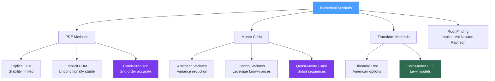

# 💻 Numerical Methods for Quantitative Finance

> [!abstract] TL;DR
> Numerical methods are how quants turn mathematical models into prices, Greeks, and risk numbers. The three main toolboxes are: finite difference methods (for PDE-based pricing), Monte Carlo simulation (for path-dependent and high-dimensional problems), and transform methods (FFT for model-independent pricing). Variance reduction techniques and quasi-Monte Carlo can reduce simulation error by 10-100x over naive Monte Carlo.

## Intuition — Analogy First

Imagine you need to compute the area under a complex curved surface (an option price as a function of all its inputs). You could solve an equation analytically — if you're lucky enough to have one. Or you could:

1. **Finite differences**: lay a grid over the surface and approximate the surface at each grid point by connecting neighbors — like a pixelated image of a smooth curve. Higher resolution (finer grid) means more accuracy but more computation.

2. **Monte Carlo**: throw darts randomly at the surface, measure their heights, and average — the average height approximates the integral. The famous $1/\sqrt{N}$ convergence rate means you need 100x more samples for 10x more accuracy, which is slow. Variance reduction tricks pre-shape the dart distribution to concentrate where it matters.

3. **FFT pricing**: some models (Heston, Lévy) have analytically known characteristic functions. You can price options by Fourier-transforming the characteristic function — exploiting structure to price thousands of strikes simultaneously at the cost of one computation.

The right method depends on the problem: vanilla options → closed-form or PDE; path-dependent exotics → Monte Carlo; many strikes at once → FFT; early exercise features → PDE or binomial tree.

---

## How It Works



## Key Concepts / Details

### Finite Difference Methods for PDEs

The Black-Scholes PDE:
$$\frac{\partial V}{\partial t} + \frac{1}{2}\sigma^2 S^2 \frac{\partial^2 V}{\partial S^2} + rS\frac{\partial V}{\partial S} - rV = 0$$

is discretized on a grid $(S_i, t_j)$ with $\delta S = S_{i+1} - S_i$ and $\delta t = t_{j+1} - t_j$.

**Explicit (Forward Euler)**:
$$\frac{V_i^{j+1} - V_i^j}{\delta t} = \mathcal{L}[V^j]$$

- Simple: each new time step computed directly from the previous
- **Stability condition**: $\delta t < \delta S^2 / (something)$ — requires fine time steps
- $O(\delta t, \delta S^2)$ accuracy

**Implicit (Backward Euler)**:
$$\frac{V_i^{j+1} - V_i^j}{\delta t} = \mathcal{L}[V^{j+1}]$$

- Requires solving a tridiagonal linear system at each time step
- **Unconditionally stable**: no restriction on $\delta t / \delta S^2$
- $O(\delta t, \delta S^2)$ accuracy (same order, but practically much better)

**Crank-Nicolson** (average of explicit and implicit):
$$\frac{V_i^{j+1} - V_i^j}{\delta t} = \frac{1}{2}\left(\mathcal{L}[V^j] + \mathcal{L}[V^{j+1}]\right)$$

- Unconditionally stable
- **$O(\delta t^2, \delta S^2)$** accuracy — second-order in time
- Industry standard for vanilla European and American options

American options add a **free boundary condition**: $V(S,t) \geq \max(K-S, 0)$ at each grid point, solved via the projected SOR algorithm.

### Monte Carlo Simulation

Standard Monte Carlo for a European call at maturity $T$:
1. Simulate $N$ paths of $S_T^{(i)}$ under the risk-neutral measure
2. Compute payoffs $h_i = \max(S_T^{(i)} - K, 0)$
3. Price $\approx e^{-rT} \frac{1}{N} \sum_{i=1}^N h_i$

**Standard error**: $\text{SE} = e^{-rT} \frac{\hat{\sigma}_h}{\sqrt{N}}$

Convergence rate: $O(N^{-1/2})$ — to halve the error, quadruple the sample size.

#### Antithetic Variates

For every draw $Z_i \sim \mathcal{N}(0,1)$, also compute the payoff with $-Z_i$:

$$\hat{h}_i = \frac{h(Z_i) + h(-Z_i)}{2}$$

If $h(Z)$ is monotone in $Z$ (which European calls are), $h(Z)$ and $h(-Z)$ are negatively correlated, reducing variance. Variance reduction factor: $\frac{1+\rho_{h,-h}}{2}$. For an ATM call, this can reduce variance by 50-70%.

#### Control Variates

If $X$ is a payoff with **known** price $E[X] = \mu_X$, use it to correct the estimate:

$$\hat{h}_{CV} = \bar{h} - b(\bar{X} - \mu_X)$$

with optimal coefficient $b^* = \text{Cov}(h, X) / \text{Var}(X)$. Common controls:
- Geometric average option (closed-form) for arithmetic average (Asian) option pricing
- European option price (Black-Scholes) as control for path-dependent variants

Variance reduction: $1 - \rho_{h,X}^2$. For $\rho = 0.99$, variance reduces by $99\%$.

#### Quasi-Monte Carlo — Sobol Sequences

Instead of random points, use **low-discrepancy sequences** (Sobol, Halton) that fill the space more uniformly:

- Convergence rate: $O((\log N)^d / N)$ vs. $O(N^{-1/2})$ for standard MC
- In low dimensions ($d \leq 10$), Sobol sequences are dramatically faster
- In high dimensions, the $(\log N)^d$ factor can erode the advantage

Sobol sequences are available in `scipy.stats.qmc.Sobol`.

### Newton-Raphson for Implied Volatility

Given a market option price $C_{mkt}$, implied volatility $\sigma^*$ satisfies $C_{BS}(\sigma^*) = C_{mkt}$. Newton-Raphson iterates:

$$\sigma_{n+1} = \sigma_n - \frac{C_{BS}(\sigma_n) - C_{mkt}}{\text{Vega}(\sigma_n)}$$

where Vega $= \partial C_{BS} / \partial \sigma > 0$ everywhere (calls are monotone in vol). This converges quadratically from a good initial guess. Common initializations: Brenner-Subrahmanyam approximation $\sigma_0 \approx \sqrt{2\pi/T} \cdot C_{mkt}/S$ for ATM options.

### Binomial Trees for American Options

The CRR (Cox-Ross-Rubinstein) binomial tree discretizes the stock price lattice:
- Up factor: $u = e^{\sigma\sqrt{\delta t}}$
- Down factor: $d = 1/u$
- Risk-neutral probability: $p = (e^{r\delta t} - d)/(u - d)$

At each node, the American option value is:
$$V = \max(\text{intrinsic value}, e^{-r\delta t}(p \cdot V_u + (1-p) \cdot V_d))$$

Convergence: $O(1/N)$ steps for most nodes, but oscillates due to grid alignment with the strike — Richardson extrapolation (average of $N$ and $N+1$ trees) significantly improves accuracy.

### Carr-Madan FFT Option Pricing

The Carr-Madan method prices a strip of European options across all strikes simultaneously using the characteristic function $\phi_T(\omega) = E^\mathbb{Q}[e^{i\omega \ln S_T}]$:

$$C(K) = \frac{e^{-\alpha \ln K}}{\pi} \int_0^\infty e^{-i\omega \ln K} \psi(\omega) \, d\omega$$

where $\psi(\omega)$ involves $\phi_T$. The integral is a Fourier transform, computed by FFT in $O(N \log N)$ for $N$ strikes simultaneously. This is why models like Heston and Variance Gamma are tractable: they have closed-form $\phi_T$ even though they have no closed-form option price.

### Optimization — BFGS and Quadratic Programming

For model calibration, **BFGS** (Broyden-Fletcher-Goldfarb-Shanno) is the standard quasi-Newton method:
- Approximates the Hessian using gradient differences
- Superlinear convergence near the optimum
- Available in `scipy.optimize.minimize(method='BFGS')`

For portfolio optimization with linear constraints, **quadratic programming** (QP) solves:
$$\min_{\mathbf{w}} \frac{1}{2}\mathbf{w}^\top Q \mathbf{w} + \mathbf{c}^\top \mathbf{w} \quad \text{s.t.} \quad A\mathbf{w} \leq \mathbf{b}, \, C\mathbf{w} = \mathbf{d}$$

CVXPY + OSQP is the standard open-source stack for convex QP in Python. See [[Calculus_for_Finance]] for the KKT conditions that QP solvers satisfy at the optimum.

## Python Example

```python
import numpy as np
from scipy.stats import norm, qmc
from scipy.optimize import brentq

np.random.seed(42)

def black_scholes_call(S, K, T, r, sigma):
    """Black-Scholes European call price."""
    d1 = (np.log(S / K) + (r + 0.5 * sigma**2) * T) / (sigma * np.sqrt(T))
    d2 = d1 - sigma * np.sqrt(T)
    return S * norm.cdf(d1) - K * np.exp(-r * T) * norm.cdf(d2)

def bs_vega(S, K, T, r, sigma):
    """Black-Scholes vega (∂C/∂σ)."""
    d1 = (np.log(S / K) + (r + 0.5 * sigma**2) * T) / (sigma * np.sqrt(T))
    return S * norm.pdf(d1) * np.sqrt(T)

# ── Monte Carlo with variance reduction ──────────────────────────────────────

def mc_european_call(S, K, T, r, sigma, n_paths, method='standard'):
    """
    Price European call via Monte Carlo with optional variance reduction.
    Methods: 'standard', 'antithetic', 'control_variate'
    """
    Z = np.random.standard_normal(n_paths)
    discount = np.exp(-r * T)

    if method == 'standard':
        S_T = S * np.exp((r - 0.5 * sigma**2) * T + sigma * np.sqrt(T) * Z)
        payoffs = np.maximum(S_T - K, 0)
        price   = discount * payoffs.mean()
        se      = discount * payoffs.std() / np.sqrt(n_paths)

    elif method == 'antithetic':
        # Pair each Z with -Z for variance reduction
        S_T_pos = S * np.exp((r - 0.5 * sigma**2) * T + sigma * np.sqrt(T) * Z)
        S_T_neg = S * np.exp((r - 0.5 * sigma**2) * T - sigma * np.sqrt(T) * Z)
        payoffs  = 0.5 * (np.maximum(S_T_pos - K, 0) + np.maximum(S_T_neg - K, 0))
        price    = discount * payoffs.mean()
        se       = discount * payoffs.std() / np.sqrt(n_paths)

    elif method == 'control_variate':
        # Control: digital (binary) call with known price norm.cdf(d2)*exp(-rT)
        S_T    = S * np.exp((r - 0.5 * sigma**2) * T + sigma * np.sqrt(T) * Z)
        h      = np.maximum(S_T - K, 0)       # payoff of interest
        X      = (S_T > K).astype(float)       # digital call payoff

        d2     = (np.log(S/K) + (r - 0.5*sigma**2)*T) / (sigma*np.sqrt(T))
        mu_X   = norm.cdf(d2)                  # known digital call price (undiscounted)

        b_star = np.cov(h, X)[0, 1] / np.var(X)
        h_cv   = h - b_star * (X - mu_X)
        price  = discount * h_cv.mean()
        se     = discount * h_cv.std() / np.sqrt(n_paths)

    return price, se

# ── Quasi-Monte Carlo with Sobol sequences ───────────────────────────────────

def qmc_european_call(S, K, T, r, sigma, n_paths):
    """Price via Sobol low-discrepancy sequence — faster convergence."""
    sampler = qmc.Sobol(d=1, scramble=True)
    U = sampler.random(n_paths).flatten()
    Z = norm.ppf(U)  # inverse CDF to get standard normals

    S_T    = S * np.exp((r - 0.5 * sigma**2) * T + sigma * np.sqrt(T) * Z)
    payoffs = np.maximum(S_T - K, 0)
    price   = np.exp(-r * T) * payoffs.mean()
    se      = np.exp(-r * T) * payoffs.std() / np.sqrt(n_paths)
    return price, se

# ── Newton-Raphson for implied volatility ─────────────────────────────────────

def implied_vol_newton(C_mkt, S, K, T, r, tol=1e-8, max_iter=100):
    """
    Compute implied volatility via Newton-Raphson.
    sigma_{n+1} = sigma_n - (C_BS(sigma_n) - C_mkt) / vega(sigma_n)
    """
    sigma = 0.20  # initial guess
    for i in range(max_iter):
        C_bs  = black_scholes_call(S, K, T, r, sigma)
        vega  = bs_vega(S, K, T, r, sigma)
        diff  = C_bs - C_mkt
        if abs(diff) < tol:
            print(f"Newton-Raphson converged in {i+1} iterations")
            return sigma
        sigma -= diff / vega
        sigma  = max(sigma, 1e-6)  # ensure positivity
    return sigma

# ── Run comparisons ──────────────────────────────────────────────────────────

params = dict(S=100, K=105, T=0.5, r=0.05, sigma=0.20)
true_price = black_scholes_call(**params)
N = 10_000

print(f"True BS price: {true_price:.4f}")
print(f"\n{'Method':<20} {'Price':>8} {'SE':>8}")
print("-" * 40)
for method in ['standard', 'antithetic', 'control_variate']:
    price, se = mc_european_call(**params, n_paths=N, method=method)
    print(f"{method:<20} {price:8.4f} {se:8.4f}")

price_qmc, se_qmc = qmc_european_call(**params, n_paths=N)
print(f"{'quasi_monte_carlo':<20} {price_qmc:8.4f} {se_qmc:8.4f}")

# Implied vol recovery
iv = implied_vol_newton(true_price, **{k: v for k, v in params.items()
                                        if k != 'sigma'})
print(f"\nImplied vol from true price: {iv:.4f} (target: 0.2000)")
```

## Real-World Notes

- **Crank-Nicolson oscillates** for options with discontinuous payoffs (digitals, barriers) at the discontinuity: use Rannacher time-stepping (2 fully implicit steps initially) to damp the oscillations before switching to CN.
- **Sobol sequences require scrambling** (randomization) for reliable error estimates — unscrambled Sobol gives biased error bars. Use `scipy.stats.qmc.Sobol(scramble=True)`.
- **Implied vol surface fitting**: Newton-Raphson for individual implied vols; SSVI (Stochastic Volatility Inspired) or SVI parametric models for the full surface; arbitrage-free constraint requires careful regularization.
- **Greeks by Monte Carlo**: pathwise differentiating the payoff (bumping $S$) is standard; likelihood ratio (score function) method handles discontinuous payoffs (digital barriers) without bias.

## Common Pitfalls

- Explicit FDM with too large a time step violates the CFL stability condition and produces wildly oscillating results — always check $\sigma^2 \delta t / \delta S^2 < 1$.
- Using standard Monte Carlo for path-dependent options without variance reduction when antithetic variates are trivially available — a free 2x speedup in sample efficiency.
- Sobol sequences require $N = 2^k$ points for best performance — using arbitrary $N$ can degrade the uniformity properties.
- Implied vol Newton-Raphson diverges for deep OTM/ITM options where vega is near zero — use bisection (Brent's method) as a fallback.
- Neglecting the **put-call parity sanity check** after any numerical pricing: $C - P = S e^{-qT} - K e^{-rT}$ must hold exactly for European options.

## Related Concepts

- [[Stochastic_Calculus]] — Monte Carlo simulates SDEs; finite difference methods solve the Feynman-Kac PDE; the two are mathematically equivalent by Feynman-Kac
- [[Calculus_for_Finance]] — Finite differences approximate derivatives; numerical Greeks use bump-and-reprice; Newton-Raphson uses the first derivative (vega) for implied vol
- [[Linear_Algebra_Finance]] — PDE finite difference grids produce tridiagonal systems solved by Thomas algorithm; QP portfolio optimization uses structured matrix solvers

## Review Questions

1. What is the stability condition for explicit FDM, and why is Crank-Nicolson the preferred scheme?
2. Explain antithetic variates: why does pairing $Z$ with $-Z$ reduce variance, and under what condition does it help most?
3. What is the convergence rate of Sobol QMC versus standard MC, and when does QMC lose its advantage?
4. Write the Newton-Raphson update for implied volatility and explain why convergence is quadratic near the solution.
5. What is the Carr-Madan FFT method, and why does it allow pricing across all strikes simultaneously?
6. A Monte Carlo estimate for an Asian option has standard error 0.05 with 10,000 paths. How many paths are needed to achieve SE = 0.005?

## Sources

- Glasserman, P. — *Monte Carlo Methods in Financial Engineering*, Chapters 4-5 (variance reduction)
- Wilmott, P. — *Paul Wilmott on Quantitative Finance*, Vol. 2 (finite difference methods)
- Carr, P. & Madan, D. — *Option Valuation Using the Fast Fourier Transform* (1999)

#quantitative-finance #math-foundations #numerical-methods #monte-carlo #finite-difference #fft
